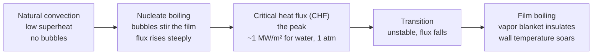
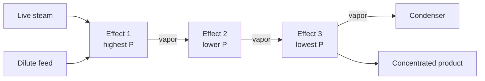

## ビデオ講義

<div class="video-container">
  <iframe
    width="560"
    height="315"
    src="https://www.youtube.com/embed/fpjFV6KX1hc?start=1509"
    title="化学工学伝熱 第3章: 沸騰、凝縮、そして蒸発装置"
    frameborder="0"
    allow="accelerometer; autoplay; clipboard-write; encrypted-media; gyroscope; picture-in-picture"
    allowfullscreen>
  </iframe>
</div>

> このビデオは以下のテキストと同じ内容をカバーしています。お好みの学習形式をお選びください。

---

# 第3章：沸騰、凝縮、そして蒸発装置

最初の 2 章では、液体のまま、あるいは気体のままでいる流体に熱を出し入れしてきました。その流体に相を変えさせれば、係数も危険もともに 1 桁跳ね上がります。沸騰（boiling）はプロセスエンジニアが手にできる最良の熱伝達です — それが破滅的に破綻する、まさにその点に至るまでは。

**相変化：最良にして最も危険な熱伝達**

## 学習目標

本章を修了すると、以下ができるようになります:

  * ✅ 顕熱ではなく潜熱（latent heat）が、リボイラー・コンデンサー・蒸発装置の大きさを決める理由を説明できる
  * ✅ 沸騰曲線を説明し、その上で核沸騰（nucleate boiling）・限界熱流束・膜沸騰（film boiling）の位置を示せる
  * ✅ バーンアウト（burnout）を、定熱流束機器に固有の設計上のハザードとして認識できる
  * ✅ 膜状凝縮（filmwise condensation）と滴状凝縮（dropwise condensation）を区別し、不凝縮ガス（noncondensable gas）がなぜコンデンサーを機能不全にするのかを説明できる
  * ✅ 多重効用蒸発（multiple-effect evaporation）の蒸気経済（steam economy）を計算し、その結果のどの部分が理想化されているかを述べられる
  * ✅ リボイラー（reboiler）を沸騰型熱交換器として同定し、その典型的な 2 つの故障モードを挙げられる

**読了時間**: 20-25分 **コード例**: 1 **演習**: 3

* * *

## 3.1 なぜ相変化が支配的なのか

[熱力学第1章](../chemical-engineering-thermodynamics/chapter-1.html)が、本章の算術を用意してくれました。水の比熱はおよそ 4.18 kJ/(kg·K)、100 °C・1 atm における蒸発潜熱はおよそ **2257 kJ/kg** です。一方を他方で割ると、その比は温度になります: 2257 / 4.18 ≈ **540 K**。蒸気 1 キログラムを凝縮させれば、液体の水 1 キログラムを 540 K 冷却するのと同じだけのエネルギーが放出されます — 液体の水では耐えられない振れ幅です。エネルギーがあるのは相変化です。

*係数*があるのも、また相変化です。[第1章](chapter-1.html)に表としてまとめた境膜係数は、気体を一桁台から数百 W/(m²·K) に、単相の液体を数百から約 10,000 までに置いていました。沸騰・凝縮する水は、おおむね **2,500–100,000 W/(m²·K)** にわたります — 定数ではなく、設計上の典型的な大きさです。この跳躍は 2 つの機構で説明できます。気泡が成長し激しく離脱することで、放っておけば壁面を断熱してしまう温度境界層がかき混ぜられること。そして凝縮する蒸気が一定温度で潜熱を手放すため、流体が冷えるにつれて駆動力が減衰していくのではなく、伝熱面全体にわたって駆動力が最大に保たれることです。

設計上の帰結は直接的です。[第1章](chapter-1.html)の総括伝熱係数において、

$$ \frac{1}{U} = \frac{1}{h_i} + \frac{L}{k} + R_f + \frac{1}{h_o} $$

（両側の汚れ抵抗はひとつの $R_f$ にまとめてあります）、相変化する側が寄与する抵抗はほとんど消えてしまうので、*もう一方*の側 — あるいは汚れ層 — が熱交換器を支配します。リボイラー、コンデンサー、蒸発装置が相変化を軸に組み立てられているのは、それが最小の伝熱面積で最大のエネルギーを動かすからです。

## 3.2 沸騰曲線

加熱面を飽和液のプールに沈め、壁面温度を飽和温度よりゆっくりと上げていくと想像してください。その差、すなわち**壁面過熱度（wall superheat）** $\Delta T_{\text{sat}} = T_{\text{wall}} - T_{\text{sat}}$ が駆動力であり、W/m² 単位の熱流束 $q''$ が応答です。一方を他方に対してプロットすれば、**沸騰曲線**が得られます — 単調ではありません。そこがまさに要点です。



過熱度が低いうちは何も沸きません。液は温まり、上昇し、**自然対流**だけで循環します。過熱度を数ケルビン上げると、表面の傷やくぼみで気泡が発生し、成長し、離脱します。これが**核沸騰**、スイートスポットです — 離れていく気泡が 1 つ 1 つ冷たいバルク液を壁面へ引き込むので、わずかな過熱度の上昇に対して熱流束が急峻に立ち上がります。

その上昇は終わりを迎えます。気泡がシート状に合体するほど多くなると、その間から新しい液が伝熱面に到達できなくなり、曲線は**限界熱流束（CHF）** — 核沸騰が維持できる最大の熱流束 — で折り返します。1 atm の水に対する標準的な教科書上の大きさは **≈ 1 MW/m²** です。これは設計値ではなく、オーダーの目安として扱ってください。ピークの先には**遷移沸騰**があり、そこでは蒸気の塊が生成しては崩壊し、過熱度が上がるにつれて熱流束は実際に*低下*します。さらにその先が**膜沸騰**、すなわち液と壁を隔てる連続的な蒸気の膜です。蒸気は熱をほとんど伝えないので、伝熱は崩壊します。

その崩壊を生き延びられるかどうかは、何が制御されているかで決まります。蒸気加熱の熱交換器が制御しているのは**壁面温度**です: CHF を超えると熱流束が単に落ち、装置は能力を発揮できなくなり、オペレーターが気付きます。加熱炉の管、電気式浸漬ヒーター、あるいは原子炉燃料棒が制御しているのは**熱流束**です — バーナーは焚かれ続け、電流は流れ続け、伝熱面がどうなっていようとお構いなしです。そうした機器が CHF を超えると、残された自由変数は壁面温度だけになり、断熱性の蒸気膜を通して同じ熱流束を無理やり通そうとして、数秒のうちに数百ケルビンも跳ね上がります。それが**バーンアウト**、すなわち機器の溶損です。設計則は身も蓋もありません — 定熱流束のサービスでは、CHF に対する余裕をもって、核沸騰の内側に十分とどまること。

## 3.3 凝縮

凝縮（condensation）は同じ物理を逆向きに走らせるものであり、その下位区分が重要になります。**膜状凝縮**では、液が伝熱面を濡らし、連続的な膜となって流れ落ちます。その膜こそが抵抗であり — すべてのジュールがそこを伝導しなければなりません — 管を下るにつれて膜が厚くなり、係数は低下します。**滴状凝縮**では表面が非濡れ性なので、液滴が生成し、成長し、転がり落ちて、繰り返し金属面を露出させ、係数は数倍高くなります。

滴状凝縮は設計の基準にはなりません。それを維持するには表面促進剤やコーティングが必要で、それらは数週間から数か月のうちに摩耗し、酸化し、あるいは洗い流され、その後、表面は膜状凝縮へ戻ります。**したがって工業的な標準実務は、膜状凝縮を前提に設計する**ことであり、滴状の挙動は帳簿に載せないボーナスとして扱います。設計に用いられる蒸気コンデンサーの係数は **5,000–15,000 W/(m²·K)** あたりに落ち着きます — これは典型的な大きさであり、幾何形状、設置方向、凝縮液の負荷に敏感です。

これらすべてを台無しにする汚染物質が 1 つあります: **不凝縮ガス**、すなわち運転条件で凝縮しないあらゆる成分です — 真空コンデンサーへ漏れ込む空気、シール用の窒素ブランケットガス、供給液に溶存していたガス。壁面へ向かう蒸気はそれらを一緒に運びますが、凝縮するのは蒸気だけなので、不凝縮ガスは滞留層として蓄積し、流入する蒸気はその層を*拡散*して通り抜けなければならなくなります — そして拡散は遅いのです。体積で数パーセントの空気があれば、コンデンサーの係数は数分の 1 に落ち得ます。だからこそ、あらゆるコンデンサーに**ベント**があり、真空サービスには連続運転のエジェクターが備わっています。いつのまにか性能を失ったコンデンサーは、汚れているよりもエアバインドしていることの方が多く、汚れと違ってその修復は数分で済みます。

## 3.4 蒸発装置と蒸気経済

**蒸発装置（エバポレータ）**は溶液から水を沸騰させて濃縮する装置であり、前の 2 つの節を 1 つの胴に収めたものです: 片側では蒸気が凝縮し、もう片側ではプロセス液が沸騰し、その間を管壁が隔てています。供給液が沸点で入ってくれば顕熱の項はないので、熱負荷は潜熱だけになります:

$$ Q = \dot{m}\lambda $$

ここで $\dot{m}$ は蒸発速度、$\lambda$ は蒸発潜熱です。

経済性はただ 1 つの比に集約されます。**蒸気経済**とは、消費した生蒸気 1 キログラムあたりに蒸発させた蒸気のキログラム数です:

$$ \text{steam economy} = \frac{\text{kg vapor evaporated}}{\text{kg live steam consumed}} $$

**単効用**の蒸発装置は、蒸気 1 キログラムを凝縮させておよそ 1 キログラムの水を蒸発させます — 経済は ≈ 1 で、これは 2 つの潜熱がほぼ等しいことに依拠し、損失と供給液の予熱を無視した理想化です。

改善策は、その蒸気を 2 度使うことです。その蒸気はそれを生み出した潜熱をなお実質的にすべて保持しているので、第 2 効用を**より低い圧力**に保てば、そこの液は**より低い温度**で沸騰し（[熱力学第3章](../chemical-engineering-thermodynamics/chapter-3.html): 飽和温度は圧力に従います）、第 1 効用の蒸気はそれを加熱するのに十分な高温だということになります。$N$ 個の効用を順に低い圧力で連ねれば、理想化された条件下で経済は $N$ に近づきます。



```python
LAMBDA = 2257.0      # kJ/kg, latent heat of water at 100 C, 1 atm (Thermodynamics Ch 1)
EVAP = 10_000.0      # kg/h of water to be evaporated
ETA = 0.85           # ILLUSTRATIVE per-effect factor, NOT a measured constant


def economy_ideal(n):
    """Idealized steam economy [kg vapor / kg steam]: N effects, N times the duty."""
    return float(n)


def economy_derated(n):
    """Same trend with an illustrative constant derating factor applied."""
    return ETA * n


def steam_demand(evap, economy):
    """Live steam required [kg/h] to evaporate `evap` kg/h at the given economy."""
    return evap / economy


print(f"{'effects':>7} {'ideal':>7} {'derated':>8} {'steam kg/h':>11} {'duty MW':>8} {'vs 1-effect':>12}")
base = steam_demand(EVAP, economy_derated(1))
for n in range(1, 7):
    econ = economy_derated(n)
    steam = steam_demand(EVAP, econ)
    duty = steam * LAMBDA / 3600.0 / 1000.0   # kg/h * kJ/kg -> kW -> MW
    saving = (1.0 - steam / base) * 100.0
    print(f"{n:7d} {economy_ideal(n):7.2f} {econ:8.2f} {steam:11.0f} {duty:8.2f} {saving:11.1f}%")

# effects   ideal  derated  steam kg/h  duty MW  vs 1-effect
#       1    1.00     0.85       11765     7.38         0.0%
#       2    2.00     1.70        5882     3.69        50.0%
#       3    3.00     2.55        3922     2.46        66.7%
#       4    4.00     3.40        2941     1.84        75.0%
#       5    5.00     4.25        2353     1.48        80.0%
#       6    6.00     5.10        1961     1.23        83.3%
```

この表は数字ではなくその*形*を読んでください。0.85 という係数は、**実際の経済が $N$ に届かないことを示すために挿入された、例示のための仮定**であって、測定された定数ではありません。それを差し引いても残るのが収穫逓減です: 1 効用から 2 効用にすれば蒸気は 50% 減りますが、5 効用から 6 効用ではわずか 3 ポイント強しか増えません。設備費は逆向きに動きます。使える温度差を $N$ 個の効用に均等に分ければ、各効用は $\Delta T_{\text{tot}}/N$ しか得られない一方で $Q_{\text{tot}}/N$ の熱負荷を担うので、それぞれが単効用の装置とほぼ同じ面積を必要とします — 総面積はおおむね $N$ に比例して増え、蒸気は $1/N$ で減るのです。工業的な多重効用列は、2 から 6 効用に落ち着くのが一般的です。

これとは別の道筋は、蒸気を段階的に使うのではなく格上げすることです。**機械式蒸気再圧縮（MVR）**は、蒸発した蒸気を、それ自身の効用を加熱できる圧力まで圧縮します。圧縮機は軸仕事 — [熱力学第2章](../chemical-engineering-thermodynamics/chapter-2.html)の貴重な資源 — を消費しますが、圧力比は小さいので、その仕事は再利用される潜熱のごく一部にとどまります。

## 3.5 リボイラーとのつながり

すべての蒸留塔は沸騰型の熱交換器で終わります。**リボイラー**は塔底の液を蒸発させ、還流が要求する蒸気の流れを生み出すものであり（[入門第4章](../chemical-engineering-introduction/chapter-4.html)）、たいていはプラントのエネルギー費における単一項目として最大のものです。2 つの構成が主流です。**ケトル型リボイラー**は、大きめの胴の中の液プールに管束を沈め、その上の気相空間へ向けて沸騰させます: 単純で、条件に寛容で、1 パスあたりの蒸発率が高い方式です。**サーモサイフォン**式リボイラーは、沸騰そのものによって流体の密度を下げ、塔底のサンプからの循環を駆動させます — ポンプ不要、ホールドアップが少なく、熱に弱い物質にやさしい方式です。

繰り返し現れる故障モードが 2 つあります。**汚れ（ファウリング）**は熱伝導率の低い層を堆積させ、所定の熱負荷を得るために必要な壁面温度を押し上げます。すると管に焼き付いている製品が劣化する — 自己加速するループです。**膜沸騰**は、$\Delta T$ を押し込みすぎたときに続いて起こります。典型的には、その汚れを補おうとして蒸気圧力を上げた場合です。すると $\Delta T$ が上がるにつれて熱負荷はむしろ*下がり*、蒸気をもっと入れようという本能がそれをさらに悪化させます。この 2 つは、たいてい同じ 1 つの出来事が順に起きたものです。

最後の制約は流体力学が課します。塔底製品は沸点で塔を出るので、そのポンプは吸込圧力と蒸気圧との間にほとんど余裕がありません — [流体力学第5章](../chemical-engineering-fluid-mechanics/chapter-5.html)の **NPSH** の問題です。蒸留塔のサンプがポンプよりずっと高い位置に据えられているのはこのためです: 飽和液はほんのわずかなきっかけでキャビテーションを起こします。

## 3.6 本章のまとめ

1. **潜熱は顕熱を圧倒する**: 水の 2257 kJ/kg は、4.18 kJ/(kg·K) を 540 K にわたって適用したのと等しく、これが相変化を伴う機器がプラント最大の熱負荷を担う理由である
2. 沸騰・凝縮の境膜係数は **2,500–100,000 W/(m²·K)**（典型的な大きさ）に達し、単相より 1 桁上である — したがって相変化する側が $U$ を支配することはめったにない
3. **沸騰曲線**は 自然対流 → 核沸騰 → **限界熱流束** → 遷移 → **膜沸騰** と進み、膜沸騰では蒸気の膜が壁面を断熱する。1 atm の水のピークは **1 MW/m²** 付近（教科書的な大きさ）
4. **バーンアウト**は定熱流束に固有のハザードである: 加熱炉の管、電気ヒーター、燃料棒は熱流束を逃がせないので、CHF を超えると壁面温度が急上昇する — 核沸騰の内側に余裕をもって設計すること
5. コンデンサーは**膜状凝縮**を前提に設計される。滴状凝縮の促進剤は使用中に劣化するからである。蒸気側の係数は **5,000–15,000 W/(m²·K)** が典型的
6. **不凝縮ガス**は凝縮面に蓄積し、蒸気にその層を拡散させることを強いる — だからこそすべてのコンデンサーにベントとエジェクターがある
7. **蒸気経済**は蒸気 1 kg あたりの蒸発蒸気 kg 数である: 単効用で ≈ 1、理想化された $N$ 効用では $N$ に近づき、実際にはそれより低い。面積は $N$ とともに増え、蒸気は $1/N$ で減るので、多重効用列は 2 から 6 効用に落ち着く。**MVR** は同じ節約を、わずかな軸仕事で買う
8. **リボイラー**は沸騰型の熱交換器であり — **ケトル型**（管束を沈めるもの）か**サーモサイフォン**（密度差で循環を駆動するもの） — **汚れ**と、それが引き起こす**膜沸騰**によって息の根を止められる。飽和した塔底液は恒久的な NPSH リスクである

**次章**: ここまでのあらゆる機構 — 伝導、対流、沸騰、凝縮 — は、物質どうしが接していることを必要としてきました。[第4章](chapter-4.html)では**放射（radiation）**を取り上げます。放射は何も必要とせず、真空を横切り、絶対温度の 4 乗に比例します — 加熱炉を動かしているのがこの機構です。

## 演習問題

1. **概念 — CHF を超える 2 通りのやり方**: 電気式浸漬ヒーターと蒸気加熱コイルが、同じ容器の中で 1 atm の水を沸騰させている。それぞれを限界熱流束を超えるまで押し込む。(a) それぞれの壁面温度に何が起こるかを述べよ。(b) なぜ一方だけが破壊されるのか。(c) あるリボイラーが汚れつつあり、オペレーターは熱負荷を保つために蒸気圧力を上げた。沸騰曲線は何を予測するか。
   *ヒント*: それぞれの装置がどちらの変数 — 熱流束か壁面温度か — を固定しているかを問い、そのうえで自由に動ける方の変数について沸騰曲線を読め。
   *解答*: (a) **蒸気コイル**は壁面温度（おおむね凝縮する蒸気の温度）を固定します。CHF を超えると曲線は折り返すので、**熱流束は下がり**ます。コイルは能力を発揮できなくなりますが、金属は蒸気温度の近くにとどまります。**電気ヒーター**は熱流束を固定します — 電流は流れ続けるのです。CHF を超えると核沸騰の枝上のどの点もその熱流束を通せないので、運転点は膜沸騰の枝へ飛び移り、断熱性の蒸気膜を通して同じ熱流束を駆動しようとして**壁面温度は数百ケルビン跳ね上がり**ます。(b) 溶損するのは定熱流束の装置だけです: 供給すると決めてしまったエネルギーを逃がすことができないからです。定温度の装置は**自己制限的**であり、蒸気加熱がより安全なユーティリティであるのはまさにそのためです。(c) 汚れは所定の熱負荷に必要な壁面温度を押し上げるので、蒸気圧力を上げることは過熱度を上げることを意味します — CHF のピークへ向かって押し込み、そしてそれを越えてしまうのです。すると $\Delta T$ が上がるにつれて**熱負荷は下がり**、本能的な対応（蒸気をもっと）が破綻を加速させます。正しい対応は清掃することです。

2. **定量 — 蒸発装置の熱負荷と面積**: ある蒸発装置は、すでに沸点にある供給液から 1 atm で **1,000 kg/h** の水を蒸発させなければならない。$\lambda = 2257$ kJ/kg とする。(a) 熱負荷を kW で計算せよ。(b) $U = 2{,}500$ W/(m²·K)、温度差 **15 K** として、必要な伝熱面積を計算せよ。(c) 蒸気の供給条件が悪化して $\Delta T$ が 10 K に下がった。同じ熱負荷にはどれだけの面積が必要になるか。
   *ヒント*: 熱負荷は単位を揃えた（kg/h → kg/s）$\dot{m}\lambda$ であり、次いで[第1章](chapter-1.html)の $A = Q/(U\,\Delta T)$ を使え。
   *解答*: (a) $Q = 1000 \times 2257 / 3600 =$ **626.9 kW ≈ 627 kW**。供給液は沸点で入ってくるので顕熱の項はなく、すべてが潜熱であることに注意してください。(b) $A = 626{,}900 / (2500 \times 15) =$ **16.7 m²**。(c) $A = 626{,}900/(2500 \times 10) =$ **25.1 m²** で、同じ仕事に対して伝熱面が 50% 増えます。面積は $\Delta T$ に反比例し、だからこそ温度の駆動力を失うことは高くつくのです — そして、使える $\Delta T$ をあえて分割する多重効用列が、蒸気の節約の代金を鋼材で支払っているのもこのためです。

3. **議論 — 効用は何段にするか、そしていつ再圧縮するか**: 10,000 kg/h の水を蒸発させているプラントが、単効用、4 効用列、MVR のあいだで選定を行っている。(a) 3.4 節の出力を使うと、4 効用はどれだけの蒸気節約をもたらすか。また、なぜ 10 効用はめったに建設されないのか。(b) コード中の 0.85 という係数は何を表しており、何に使ってはならないか。(c) どのような条件下で MVR は多重効用列に勝るか。
   *ヒント*: (a) では蒸気の傾向を、$N$ が増えたときの総面積のふるまいと比べよ。(c) では電力 1 キロワット時のコストを、蒸気 1 キロワット時のコストと比べよ。
   *解答*: (a) 4 効用は生蒸気を **75%** 削減します（表の 11,765 → 2,941 kg/h）。10 効用は 2 つの点で成り立ちません: *限界*の節約が縮小すること — 5 効用から 6 効用へ進んでもさらに 3.3 パーセントポイントしか節約できません — 一方で総伝熱面積はおおむね $N$ に比例して増え続けることです。各効用は $\Delta T_{\text{tot}}/N$ の駆動力しか受け取らないので、単効用の装置とほぼ同じ面積を必要とするからです。加えて厳しい物理的な下限もあります: 供給蒸気と最終コンデンサーとの間で使える総 $\Delta T$ は決まっており、濃縮された液の沸点上昇がそのうちの一部を各効用で食いつぶします。通常の落としどころは 2 から 6 効用です。(b) それは**例示のためのディレーティング仮定**であり、実際の経済が理想値 $N$ を下回ることを示すためだけに挿入されたものです。測定値ではなく、自然定数でもなく、機器のサイジングや保証経済値の提示に使っては**なりません** — 実際の損失は供給液の物性、沸点上昇、凝縮液のサブクール、断熱に依存します。(c) MVR が有利なのは、**蒸気に比べて電力が安い**場合、沸点上昇が小さい場合（そのとき圧縮機は小さな圧力比しか必要とせず、したがって仕事も少なくて済みます）、長い容器の列よりも中規模の単一装置が好まれる場合、そして第 1 効用に供給できる低品位の廃蒸気がない場合です。不利になるのは、電力が高い場合、汚れや腐食を伴うサービスでの圧縮機の保全が負担になる場合、あるいはサイトにすでに余剰の低圧蒸気があり、多重効用列がそれを無償で吸収できる場合です。
