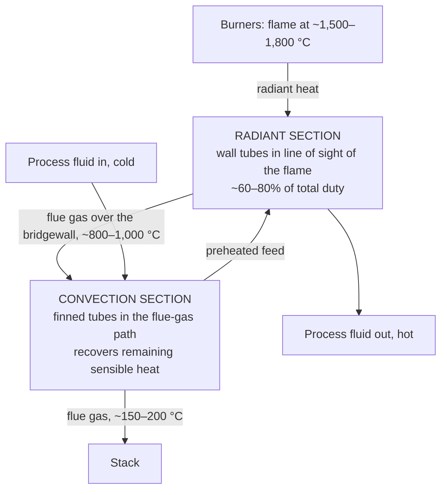

## ビデオ講義

<div class="video-container">
  <iframe
    width="560"
    height="315"
    src="https://www.youtube.com/embed/fpjFV6KX1hc?start=2311"
    title="化学工学伝熱 第4章: 放射と加熱炉"
    frameborder="0"
    allow="accelerometer; autoplay; clipboard-write; encrypted-media; gyroscope; picture-in-picture"
    allowfullscreen>
  </iframe>
</div>

> このビデオは以下のテキストと同じ内容をカバーしています。お好みの学習形式をお選びください。

---

# 第4章：放射と加熱炉

本章では熱伝達の第 3 の機構 — 伝わるための物質を必要としないもの — を取り上げます。放射（radiation）は、温かい配管まわりでは端数のような誤差にすぎず、加熱炉（fired heater）では設計基準そのものです。その一方から他方へと切り替わる温度こそが、ここでの物語です。

**媒体を必要としない熱**

## 学習目標

本章を修了すると、以下ができるようになります:

  * ✅ 伝導や対流と違って、なぜ放射が真空を越えるのかを説明できる
  * ✅ ステファン・ボルツマンの法則 $E = \varepsilon \sigma T^4$ を適用し、絶対温度を用いる理由を説明できる
  * ✅ 典型的な放射率（emissivity）を挙げ、それを使って周囲との正味の交換を見積もれる
  * ✅ 表面温度から、放射が無視できるか、同程度か、支配的かを判断できる
  * ✅ プロセス加熱炉の放射部（radiant section）と対流部（convection section）、およびそれぞれを制約するものを説明できる
  * ✅ 形態係数（view factor）と管表面温度（チューブスキン温度）を挙げ、それぞれが何を支配するかを述べられる

**読了時間**: 20-25分 **コード例**: 1 **演習**: 3

* * *

## 4.1 第 3 の機構

[第1章](chapter-1.html)は 2 つの機構から総括伝熱係数を組み立てました。**伝導**は、物質の中を分子から隣の分子へとエネルギーを受け渡していきます。**対流**は、動く流体の中でそれを運び去ります。どちらもそこに何かが存在することを必要とします。物質を取り去れば、どちらも止まります。

放射は止まりません。絶対零度より高いあらゆる表面は電磁波としてエネルギーを放出し、その波はまったくの無の中をきわめてよく伝わります。その証拠は毎朝届きます: 日光は 1 億 5000 万キロメートルの真空を越えて屋根を温めますが、その道中のどこにも媒体はありません。その隙間を伝導するものはなく、対流するものもないのに、およそ 1 平方メートルあたり 1 キロワットが到達しています。

実務のエンジニアにとって厄介なのは、放射が常に存在していながら、ほとんど常に重要ではないことです — そして突然、それがすべてになるまでは。60 °C の容器壁は放射しますが、同じ壁から熱を奪っていく対流と並べれば、放射の寄与はささやかな補正にすぎません。1,200 °C の加熱炉の内部では、順位は完全に逆転します: 放射が熱負荷の大半を届け、対流はおまけになります。その 2 つの世界のあいだの遷移点を突き止めるのが本章です。

## 4.2 ステファン・ボルツマンの法則

表面の放射能力 — 単位面積・単位時間あたりに放射するエネルギー、単位は W/m² — は

$$ E = \varepsilon \sigma T^4 $$

ここで $\sigma = 5.67 \times 10^{-8}$ W/(m²·K⁴) は**ステファン・ボルツマン定数**、$\varepsilon$ はその表面の**放射率**（次節で導入します — さしあたっては、その表面が放射体としてどれだけ優れているかを表す 0 から 1 の数だと思ってください）、$T$ はその**絶対**温度（ケルビン）です。

注意: ここでの $\varepsilon$ は放射率であり、[第2章](chapter-2.html)の熱交換器の有効度 $\varepsilon$ とは無関係です。この記号の衝突は文献では標準的なものです。

放射について異例なことはすべて、あの指数に宿っています。伝導と対流は温度差に対して線形です: 駆動力を 2 倍にすれば、流束も 2 倍になります。放射は絶対温度に対して 4 乗なので、$T$ を 2 倍にすれば放射は $2^4 = 16$ 倍になります。

### 例題：300 K 対 1,000 K

完全な放射体、すなわち**黒体（blackbody）**（$\varepsilon = 1$）を室温 300 K に置きます:

$$ E = 5.67 \times 10^{-8} \times 300^4 = 459\ \text{W/m}^2 $$

次に、同じ表面を 1,000 K の炉の中に置きます:

$$ E = 5.67 \times 10^{-8} \times 1000^4 = 56{,}700\ \text{W/m}^2 \approx 56.7\ \text{kW/m}^2 $$

温度は 3.3 倍になりました。放射は **123** 倍になりました。このたった 1 つの比較こそが、温かいタンクのまわりでは放射を無視できるのに、炎の近くではどこであれ無視できない理由です。

### ケルビンは省略できない

あの 4 乗の中の温度は**絶対**温度であり、摂氏の値が許されるような計算のしかたは存在しません。300 °C を 573 K ではなく「300」として代入すれば、答えは $(573/300)^4 = 13$ 倍ずれます。25 °C を「25」として代入すれば、周囲は式から事実上消えてしまいます。さらに悪いことに、0 °C の表面を「0」として入れれば放射はまったくのゼロになりますが、これは意味をなしません — 実際には 316 W/m² を放射しています。

これはゲージ圧を絶対圧として読むのと同じ種類の誤りであり、指数がそれを増幅するぶん、ここではいっそう深刻です。絶対圧の 50% の誤差は 50% の誤差のままですが、絶対温度の 50% の誤差は放射流束では 16 倍になります。放射の計算では、ほかの何かを紙に書き始める前に、まずケルビンを書き込んでください。

## 4.3 放射率と実在の表面

実在の表面は黒体ではありません。**放射率** $\varepsilon$ は、実在の表面が同じ温度で実際に達成する、黒体放射に対する割合であり、0（何も放射しない完全な反射体）から 1（黒体）までの値をとります。以下は**典型**値であり、見積もりには十分ですが、実際の表面についてのデータの代わりにはなりません:

| 表面 | 典型的な放射率 $\varepsilon$ |
|---|---|
| **酸化した炭素鋼** | ≈ 0.8 |
| **耐火レンガ** | ≈ 0.9 |
| **ほとんどの塗料（色を問わず）** | ≈ 0.9 |
| **研磨した鋼** | ≈ 0.1（典型値） |
| **研磨したアルミニウム／光沢箔** | ≈ 0.05 |

このうち 2 つには注釈が要ります。第 1 に、酸化した鋼は 0.8 付近ですが、*清浄で研磨された*鋼ははるかに低く — 0.1 あたり — つまり配管の放射損失は、表面が風雨にさらされるにつれて使用開始からの数か月でかなり増加するということです。第 2 に、0.05 の研磨アルミニウムと 0.8–0.9 のそれ以外との差は設計上の道具になります: 断熱材の周りに巻く**低放射率箔**は、伝導の意味での断熱材ではまったくなく、単に放射することを拒むだけで、放射項をおよそ 16 分の 1 に削ります。また、可視的な意味での色は何も教えてくれないことにも注意してください — 白い塗料と黒い塗料はプロセス温度でほぼ同じ放射率をもちます。放射が赤外だからです。

### 周囲との正味の交換

高温の表面は放射もすれば吸収もし、重要なのはその差だけです。よくあるケースである**大きな周囲の中の小さな物体** — 配管、容器、人など、壁や空に囲まれていて、その囲いが十分大きいために物体が放射したもののほとんどが戻ってこない場合 — では、正味の流束は次の形に簡単化されます

$$ q = \varepsilon \sigma (T_1^4 - T_2^4) $$

ここで $T_1$ は表面、$T_2$ は周囲で、いずれもケルビンです。この形はまた、表面が**灰色面（gray surface）**であること、すなわちその吸収率が放射率に等しいこと（キルヒホッフの法則）も仮定しています — 酸化した工業表面には良い近似ですが、選択性コーティングや太陽入射に対しては不十分です。小物体の仮定も実際に効いています: 大きな部屋の中の配管では成り立ちますが、物体が自らの囲いのかなりの部分を占める炉の内部では破綻します。一般の場合を扱う勘定のしかたは 4.5 節で名前を挙げます。

以下のコードは、これを 3 つの表面温度における裸配管に適用し、あわせて $h = 10$ W/(m²·K) を使った対流の見積もりを並べています。この値は静止空気への自然対流のオーダーの目安です。

```python
SIGMA = 5.67e-8  # W/(m^2*K^4)
EPS = 0.8        # emissivity of oxidized steel (typical)
H_CONV = 10.0    # W/(m^2*K), natural convection to still air (order of magnitude)
T_SURR_C = 25.0


def q_radiation(t_surface_c, t_surround_c=T_SURR_C, eps=EPS):
    """Net radiative flux [W/m^2] from a small hot surface to large surroundings."""
    t_s = t_surface_c + 273.15
    t_a = t_surround_c + 273.15
    return eps * SIGMA * (t_s**4 - t_a**4)


def q_convection(t_surface_c, t_surround_c=T_SURR_C, h=H_CONV):
    """Convective flux [W/m^2] from the same surface."""
    return h * (t_surface_c - t_surround_c)


print(f"{'T_surf [C]':>11} {'q_rad':>9} {'q_conv':>9} {'rad/conv':>9} {'total':>9}")
for t in (150.0, 300.0, 600.0):
    qr = q_radiation(t)
    qc = q_convection(t)
    print(f"{t:11.0f} {qr:9.0f} {qc:9.0f} {qr/qc:9.2f} {qr+qc:9.0f}")

#  T_surf [C]     q_rad    q_conv  rad/conv     total
#         150      1096      1250      0.88      2346
#         300      4536      2750      1.65      7286
#         600     26007      5750      4.52     31757
```

3 列目を読んでください。150 °C では放射は対流をわずかに*下回り*ます — 実質的な寄与ではありますが、支配的ではありません。300 °C では対流の 1.65 倍、600 °C では 4.5 倍になります。対流が線形に増えた（駆動力に追随して 150 °C から 600 °C で 4.6 倍）のに対し、放射はほぼ 24 倍に増えたからです。両者が等しくなる遷移点は、これらの仮定のもとでは **180 °C** 付近に落ちます。高温ラインからの損失を対流だけで見積もる人は、そのラインが高温であるほど、ますます大きく間違えることになります。

## 4.4 プラントで放射が問題になるとき

この計算から、実用的な**指針**が導かれます — 法則ではなく考え方の習慣であり、仮定した対流係数に敏感です:

- **およそ 100 °C 未満**: 放射は実在するが二次的な項である — $h = 10$ を前提にすれば、それでも損失の 30–40% を担い、強制対流下ではこれより小さくなる。丁寧な熱損失の見積もりには含めること。ただし設計をその上に組み立ててはならない。
- **100–500 °C**: 放射と対流は同程度であり、180 °C 付近の遷移点はこの帯域にある。どちらも落とせない。
- **およそ 500–600 °C 超**: 放射が支配する。これを省いた設計は保守的なのではなく、単に間違っている。

実務上の帰結が 2 つあります。第 1 は**人身保護**です。強く放射するほど高温の表面は、接触すれば火傷するほど高温でもあり、また放射流束は、対流では届かない距離で開いた炉の扉のそばに立つことを不快にするものでもあります。高温面付近での防護、遮蔽、時間制限は放射の問題です。

第 2 はお金です。200 °C の裸配管は、演習問題 2 で計算するとおり、放射だけでおよそ 1.9 kW/m² を捨てています — その 1 平方メートルごとに、1 時間ごとに、プラントの寿命が続くかぎり、購入して燃やされる燃料として。**断熱は二重に元が取れます**: 直列に伝導抵抗を加えると同時に、冷たい外表面を差し出すことで $T^4$ の項も一緒に潰すからです。外皮が 50 °C にとどまる断熱ラインの放射はおよそ 136 W/m² で、裸の場合の 10 分の 1 未満です。[第5章](chapter-5.html)の経済的厚さの計算は、その両方を勘定に入れます。

## 4.5 炉と加熱炉

**加熱炉** — 原油を蒸留温度まで持ち上げ、改質装置を駆動し、あるいは蒸気では熱すぎて賄えないリボイラー熱負荷を供給する主力設備 — は、燃料を燃やし、その熱を管内のプロセス流体に渡します。それを 2 段階で行い、放射と対流が異なる温度域で支配的になるという事実を利用します。



**放射部**は火室です: 耐火物（refractory）で内張りされた壁と、その周りに配置された、炎を直接見通す位置にあるプロセス管からなります。ここには[第1章](chapter-1.html)の意味で相関式にできる伝熱係数はありません — 管は炎と赤熱した耐火物からの $T^4$ によって加熱されるのであり、この部分は通常、加熱炉の総熱負荷の 60–80% を担います。**対流部**はその上にあり、放射で使える温度以下まで冷えた燃焼ガスがなお多量の顕熱を保持しているところです。フィン付き管が通常の強制対流によってそれを回収し、入ってくる供給流体が放射コイルに入る前に予熱します。向流の配置になっていることに注目してください: 冷たい供給流体は対流部に入り、高温の製品は放射部から出て行きます。

この絵を完成させる点が 3 つあります。

**高温ガスもまた放射する。** 窒素と酸素は熱放射に対して事実上透明ですが、燃焼生成物である**二酸化炭素と水蒸気**は赤外域で強く放射・吸収します。したがって燃焼ガスそのものが放射体であり、単に炎を覗くための透明な窓ではありません。（これを定量化するにはガス放射率の線図が必要で、本書の範囲をはるかに超えます。）

**形態係数**は幾何形状の勘定です。放射は直進するので、ある表面が放射したもののうちどれだけが実際に別の表面に届くかは、両者の相対的な大きさ、間隔、向きだけで決まります。**形態係数**はそれを捉える無次元の割合です — 短い隙間を隔てて炎に向き合う管はそれに対して大きな形態係数をもち、他の管の列の陰になる管は小さな形態係数しかもちません。炉の設計が熱の演習であると同時にレイアウトの演習でもあるのはこのためであり、4.3 節の単純な 2 面の式が、形態係数が実質的に 1 である特別な場合にすぎないのもこのためです。

**管表面温度**は健全性の限界です。放射部の管の金属壁は、その内部の流体より高温になり、その金属温度こそが — プロセス温度でも熱負荷でもなく — 加熱炉を最終的に制約するものです。合金の定格を超えれば、管は**クリープ**、すなわち高温で応力を受けた状態でのゆっくりとした永久変形を起こし、最後には破断に至ります。内面を熱くしすぎれば炭化水素が**コーキング**を起こし、熱抵抗をもつ炭素の堆積物が積み上がって、同じ熱負荷を通すために表面温度をさらに押し上げます — 自己加速するループであり、デコーキングのための停止か管の破損で終わります。管表面温度用の熱電対や赤外線サーベイが存在するのは、まさにこのためです。

## 4.6 本章のまとめ

1. **放射は媒体を必要としない。** 絶対零度より高いあらゆる表面は電磁エネルギーを放出し、それは真空を越える — 日光が毎日それを示しているとおりである。伝導・対流と並ぶ第 3 の機構である。
2. **ステファン・ボルツマン**: $E = \varepsilon \sigma T^4$、ここで $\sigma = 5.67 \times 10^{-8}$ W/(m²·K⁴)。4 乗であるということは、絶対温度を 2 倍にすると放射が 16 倍になるということである。
3. **例題の対比**: 300 K の黒体は 459 W/m² を放射し、1,000 K では 56,700 W/m² を放射する — 温度が 3.3 倍で放射は 123 倍である。
4. **温度は絶対温度でなければならない。** ケルビンであり、決して摂氏ではない。指数が、温度目盛りの取り違えを 1 桁以上の誤差に変えてしまう。
5. **放射率** $\varepsilon$ は 0 から 1 をとる: 酸化鋼 ≈ 0.8、耐火レンガ ≈ 0.9、研磨アルミニウム ≈ 0.05（典型値）。低 $\varepsilon$ の箔は放射に対する断熱として機能する。
6. 大きな周囲の中の小さな物体に対する**正味の交換**は $q = \varepsilon\sigma(T_1^4 - T_2^4)$ である — 放射したもののうち戻ってくる分がわずかであるほど周囲が大きい場合にのみ有効。
7. **遷移点**: $\varepsilon = 0.8$ の配管で $h = 10$ W/(m²·K) の場合、放射は 180 °C 付近で対流に達し、300 °C では対流の 1.65 倍、600 °C では 4.5 倍になる。指針としては、~100 °C 未満では二次的だが実在し、100–500 °C では対流と同程度、~500–600 °C 超では支配的である。
8. **加熱炉**は**放射部**（管が炎を見通し、熱負荷の 60–80%）と**対流部**（フィン付き管が燃焼ガスの顕熱を回収する）に分かれる。燃焼ガス中の CO₂ と H₂O は放射する。**形態係数**が幾何形状を扱い、**管表面温度**がクリープとコーキングを通じて限界を定める。
9. **断熱は二重に元が取れる**。伝導経路を絞ると同時に、外表面の $T^4$ の項も下げるからである。

**次章**: 4 つの章で機構が出そろいました — 伝導、対流、相変化、放射です。[第5章](chapter-5.html)はそれらを**伝熱の設計と高度化（intensification）**へと組み上げます: 汚れに耐え、経済性を満たし、より少ない機器からより多くの熱負荷を引き出す装置のサイジングと選定です。

## 演習問題

1. **概念 — 放射はどこに隠れているか**: (a) 真空ジャケット付きの極低温ラインは、内壁と外壁のあいだに事実上ガスがない。どの熱伝達機構が残り、また内壁がふつうアルミ蒸着箔で巻かれているのはなぜか。(b) 同一の鋼管 2 本が 400 °C で運転されており、一方は研磨したて、もう一方は長く酸化している。どちらがより多くの熱を失い、放射項ではおよそ何倍か。(c) 白い塗料は見た目には反射性が高いのに、高温の容器を白く塗ってもその放射損失にほとんど効かないのはなぜか。
   *ヒント*: 各設問について、$q = \varepsilon\sigma(T_1^4 - T_2^4)$ のどの項が変えられているのかを問え。(c) では、その容器が実際にどの波長で放射しているのかを問え。
   *解答*: (a) ガスとともに対流はなくなり、伝導は機械的な支持部を通じてのみ残ります。したがって残るのは**支配的な経路としての放射**であり、対策は $\varepsilon$ を攻めなければなりません: $\varepsilon \approx 0.05$ のアルミ蒸着箔は、0.8 付近の裸の金属面に対して放射項をおよそ 16 分の 1 に削ります。伝導に対しては無力な多層箔断熱が、極低温・真空サービスで標準的なのはこのためです。(b) **酸化した管**の方であり、4.3 節の表から研磨鋼を $\varepsilon \approx 0.1$ とすれば、放射項でおよそ $0.8/0.1 =$ **8 倍**です。放射率は表面の性質であってバルクの性質ではありません — 同じ温度の同じ鋼が、違う肌をまとっているだけです。(c) プロセス温度における放射率は**赤外**の性質であり、ほとんどすべての塗料は — 白でも黒でもその他でも — 赤外域で $\varepsilon \approx 0.9$ 付近にあるからです。可視的な色は日光の反射を表すもので、スペクトルの別の部分の話です。$\varepsilon$ を下げるのは本物の金属仕上げだけです。

2. **定量 — 裸配管のコスト**: 裸の酸化した鋼管の表面温度が **200 °C（473 K）**、放射率が **0.8** で、**25 °C（298 K）**の周囲へ放射している。(a) 正味の放射流束を W/m² で計算せよ。(b) $h = 10$ W/(m²·K) の対流を加えると、1 平方メートルあたりの全損失はいくらで、そのうち放射の占める割合はいくらか。(c) この配管の表面積は 40 m² で、連続運転されている。熱が 1 GJ あたり 8 USD であるとき、裸のままにしておくことは両方の機構を数えて年間いくらのコストになるか。
   *ヒント*: 一貫してケルビンで $q = \varepsilon\sigma(T_1^4 - T_2^4)$ を使え。(c) では W を J/s に換算し、1 年の秒数（3.15 × 10⁷ s）を掛けよ。
   *解答*: (a) $q = 0.8 \times 5.67 \times 10^{-8} \times (473^4 - 298^4) = 0.8 \times 5.67 \times 10^{-8} \times (5.006 \times 10^{10} - 7.886 \times 10^{9}) = 0.8 \times 5.67 \times 10^{-8} \times 4.217 \times 10^{10} =$ **1,913 W/m² ≈ 1.9 kW/m²**（473 K/298 K を使用。コードのように 473.15/298.15 とすれば 1,915 W/m² で、0.1% の差です）。(b) 対流の寄与は $10 \times (200 - 25) = 1{,}750$ W/m² なので、合計は **3,663 W/m²** となり、そのうち放射は $1913/3663 =$ **52%** です — 200 °C では 2 つの機構はほぼ拮抗しており、4.3 節で求めた ~180 °C の遷移点と整合します。(c) 全損失 $= 3{,}663 \times 40 = 146{,}500$ W $= 146.5$ kJ/s。1 年では $146.5 \times 3.15 \times 10^7 = 4.61 \times 10^9$ kJ $= 4{,}615$ GJ となり、費用は **≈ 37,000 USD／年**です。数年で回収できる断熱は、検討に迷うような話ではありません — そして、対流だけをモデル化した人にとっては、節約分の半分が見えなかったであろうことにも注意してください。

3. **議論 — 加熱炉を読む**: ある製油所の加熱炉が設計熱負荷で運転されているとき、オペレーターは、プロセス出口温度と燃料の焚き量がどちらも変わっていないのに、放射部の管表面温度用熱電対が数か月にわたって 40 °C 上昇していることに気付いた。(a) 最も可能性の高い原因は何か。(b) この傾向はなぜ自己強化的なのか。(c) 加熱炉を制約する変数が、プロセス出口温度ではなく管表面温度であるのはなぜか。(d) 同じ期間に煙突温度も上昇していたとしたら、それは何を意味するか。
   *ヒント*: 供給されている熱負荷を変えずに、管壁とプロセス流体のあいだに熱抵抗を加え得るものは何かを考えよ — そして、その熱負荷を壁を横切って一定に保つために壁が何をしなければならないかを考えよ。
   *解答*: (a) **放射部の管の内側へのコークスの堆積**です。炭素の堆積物は金属とプロセス流体のあいだに汚れ抵抗を加えます。より大きな抵抗を通して同じ熱負荷を押し通すには、金属がより高い温度になければなりません — まさに観測されたドリフトであり、焚き量にも出口温度にも変化がないこととも合致します。(b) 堆積物自身の断熱効果が内壁温度を上げ、コーキング速度は温度とともに急峻に上昇するので、壁が熱くなるほどコークスの堆積は速くなり、それがさらに壁温を上げるからです。これは正のフィードバックループであり、計画的なデコーキングか、計画外の管の破損で終わります。(c) 圧力を保持している要素はプロセス流体ではなく管の金属だからです。合金の定格を超えると、管は**クリープ** — 応力下でのゆっくりとした永久変形で、最終的には破断に至ります — を起こし、その速度は温度とともに急激に加速します。プロセス出口温度は管が破損する直前まで目標値に保てるので、何の警告にもなりません。警告を出すのは表面温度の熱電対です。(d) 煙突温度の上昇は、燃焼ガスが出て行く前に回収される熱が減っていることを意味します — **対流部**の管もまた、ガス側で汚れているのです。両方の症状が確認された以上、加熱炉は両端で効率を失っており、清掃の範囲は放射コイルにとどまらないはずです。
