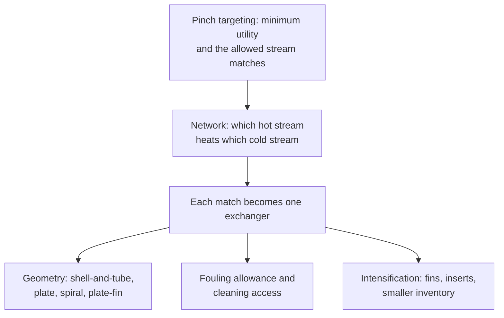

## ビデオ講義

<div class="video-container">
  <iframe
    width="560"
    height="315"
    src="https://www.youtube.com/embed/fpjFV6KX1hc?start=3091"
    title="化学工学伝熱 第5章: 伝熱設計とプロセス強化"
    frameborder="0"
    allow="accelerometer; autoplay; clipboard-write; encrypted-media; gyroscope; picture-in-picture"
    allowfullscreen>
  </iframe>
</div>

> このビデオは以下のテキストと同じ内容をカバーしています。お好みの学習形式をお選びください。

---

# 第5章：伝熱設計とプロセス強化

本章は、視野を引くことで本シリーズを締めくくります。第 1 章から第 4 章までは、熱交換器を 1 台ずつサイジングし、解析してきました。しかし実際のプラントは、それを数十台まとめて 1 つの熱経済として運転しています。ここでは、一つ一つの熱交換の組み合わせを安価でコンパクトにする機器、そのすべてに静かに課税してくる汚れ、それを小さくするプロセス強化、そしてそれを正直に保つデジタルの層に出会います。

**単一の熱交換器からプラントの熱経済へ**

## 学習目標

本章を修了すると、以下ができるようになります:

  * ✅ ピンチによる目標値が、個々の熱交換器の設計が経済的に達成しなければならない熱負荷をどう定めるかを説明できる
  * ✅ プレート式（プレートアンドフレーム）、スパイラル式、プレートフィン式の熱交換器を説明し、多管式（シェルアンドチューブ）がなお有利な場面を述べられる
  * ✅ 汚れを直列に加わる抵抗として扱い、その結果生じる熱負荷の低下を計算できる
  * ✅ 流速の管理や洗浄スケジュールを含め、汚れに対する設計上・運転上の対応を選択できる
  * ✅ フィンがなぜ気体側に属するのか、そしてプロセス強化が本質安全設計とどうつながるのかを説明できる
  * ✅ デジタルツインが熱交換器の管理に何を加えるのか — そして熱力学がそれに何を禁じているのか — を述べられる

**読了時間**: 20-25分 **コード例**: 1 **演習**: 3

* * *

## 5.1 1 台の熱交換器からネットワークへ

これまでの各章は、いずれも 1 つの機器を鍵穴から覗くように見てきました。一歩下がると、プラントは違って見えます。製油所の常圧蒸留装置には 40 台以上の熱交換器が並ぶことがあり、その 1 台 1 台が、どの高温流体でどの低温流体を加熱するかという判断の結果です。そうした判断は、熱交換器ごとに個別に下されるものではありません。**ピンチ解析**（[化学工学入門 第4章](../chemical-engineering-introduction/chapter-4.html)）は、ネットワークを 1 本も描く前に、ある流体の集合が必要としうる高温・低温ユーティリティの *最小* 量を計算します。そして 3 つの黄金律 — ピンチを越えて熱を移動させない、ピンチより上で冷却ユーティリティを使わない、ピンチより下で加熱ユーティリティを使わない — が、そもそもどの **マッチ（match、高温流体と低温流体の組み合わせ）** が存在を許されるのかを決めます。

この目標設定（ターゲティング）の段階が熱負荷を定めます。しかし、それは何も作りません。許されたマッチを実際のハードウェアに変えるところが本章の舞台であり、そこでの問いはどこまでも実務的です。伝熱面積はどれだけ必要か、どのような形状で、どれだけの設備投資で、どのような汚れに耐え、どれくらいの頻度で洗浄するのか。



この経済性は、*化学工学流体力学* [第4章](../chemical-engineering-fluid-mechanics/chapter-4.html) の管径選定と同じ韻を踏んでいます。伝熱面積を増やせば設備費が一度だけかかり、面積が足りなければユーティリティ費用が 20 年にわたって毎時間かかり続けます。温度接近を詰めればエネルギーは節約できますが面積を要求され、$\Delta T_{lm} \to 0$ の近くでは面積は際限なく増大します — [第2章](chapter-2.html) が私たちの前に立てた壁です。

## 5.2 コンパクト熱交換器

[第2章](chapter-2.html) の **多管式（シェルアンドチューブ）** 熱交換器は、産業界の既定の選択ではあっても、その最適解ではありません。清浄な液体用途におけるその対抗馬が **プレート式（プレートアンドフレーム）** 熱交換器です。薄い波板状の金属プレートを積み重ねてフレームで締め付け、高温流体と低温流体を狭い流路に交互に流します。

この形状から 4 つの性質が導かれます。波板は流れを **低いレイノルズ数で乱流** へと遷移させるので、[第1章](chapter-1.html) の境膜伝熱係数が、過酷な送液動力なしに高くなります。**面積密度（area density）** — 機器 1 m³ に詰め込まれた伝熱面積 — は、管束が到達できる水準よりはるかに高く、典型的な値は数百 m²/m³ に達します。多管式のおよそ 50–100 m²/m³ に対してです。したがって同じ熱負荷が、ごく一部の設置面積で得られます。流路の配置は **真の向流** を与えるので、[第2章](chapter-2.html) の補正係数 $F$ は 1 の近くにとどまり、多管式なら 5–10 K を要するところで 1–2 K の温度接近が達成できます。そしてフレームは単純に **ボルトを外せば開きます**。プレートは数時間で取り出して点検や機械的洗浄ができ、プレートを追加すれば伝熱面積を増やせます。

限界はシールにあります。**ガスケット式** — プレートを溶接ではなくエラストマーの帯でシールしたもの — は、そのエラストマー以上の性能にはなりません。典型的なガスケット仕様の上限は **180–200 °C、20–25 bar** 付近です（あくまで代表値です。本ページではなくメーカーの値を確認してください）。セミウェルド式、全溶接式、ブレージング式はいずれの限界も大幅に引き上げますが、この形式を魅力的にしていた「簡単に開けられる」という利点と引き換えになります。近縁の 2 形式がすき間を埋めます。**スパイラル式熱交換器** は、2 本の長い流路を中心のまわりに巻いたもので、各流体が遮るもののない 1 本の経路を持つため、スラリーや繊維を含む流体に耐えます。**プレートフィン式** のブロックは、たいていはアルミニウムのブレージング製で、空気分離や LNG のような極低温の用途において、極端に高い面積密度とごく小さな温度接近を実現します。

**標準的な実務** は、なお広い範囲の用途を多管式に送り込みます。高圧、高温、直管の機械的洗浄を必要とする汚れの激しい流体、大きな蒸気体積を伴う真空・凝縮の用途、そして標準化された機械設計規格と 1 世紀にわたる製作経験がプロジェクトを短縮するあらゆる場面です。コンパクトであることは、より優れていることを意味しません — それは *用途が許すときに* より優れている、ということです。

## 5.3 汚れ管理

汚れは、あらゆる伝熱設計にかかる目に見えない税金です。スケール、コーク、腐食生成物、バイオフィルム、そして沈降した粒子が伝熱面に層を作ります。層が何をするかは [第1章](chapter-1.html) がすでに教えてくれています。直列に抵抗を 1 つ加えるのです。

$$ \frac{1}{U_{\text{fouled}}} = \frac{1}{U_{\text{clean}}} + R_f $$

抵抗は足し合わされるので、ある $R_f$ が与える損害は、清浄時の熱交換器がどれだけ優れていたかに完全に依存します。優れた $U$ は自分自身の抵抗が小さいので、汚れの膜がすぐにそれを支配します。凡庸な $U$ はほとんど気づきもしません。

```python
U_CLEAN = 600.0   # W/(m2 K), clean overall coefficient
AREA = 120.0      # m2, fixed once the exchanger is built
DT_LM = 30.0      # K, log-mean temperature difference held constant

R_FOUL = [0.0, 0.0001, 0.00025, 0.0005, 0.00075, 0.001]  # m2 K/W


def fouled_U(u_clean, r_f):
    """Overall coefficient after adding a fouling resistance in series."""
    return 1.0 / (1.0 / u_clean + r_f)


def duty(u, area=AREA, dt_lm=DT_LM):
    """Q = U A dT_lm, in kW."""
    return u * area * dt_lm / 1000.0


q_clean = duty(U_CLEAN)

print(f"{'R_f [m2K/W]':>12} {'U [W/m2K]':>10} {'Q [kW]':>9} {'duty loss':>10}")
for r_f in R_FOUL:
    u = fouled_U(U_CLEAN, r_f)
    q = duty(u)
    print(f"{r_f:12.5f} {u:10.0f} {q:9.1f} {1 - q / q_clean:9.1%}")

r_half = 1.0 / U_CLEAN
print()
print(f"fouling resistance that halves the duty: {r_half:.5f} m2K/W")

#  R_f [m2K/W]  U [W/m2K]    Q [kW]  duty loss
#      0.00000        600    2160.0      0.0%
#      0.00010        566    2037.7      5.7%
#      0.00025        522    1878.3     13.0%
#      0.00050        462    1661.5     23.1%
#      0.00075        414    1489.7     31.0%
#      0.00100        375    1350.0     37.5%
#
# fouling resistance that halves the duty: 0.00167 m2K/W
```

まず最後の行から読んでください。清浄な熱交換器自身の抵抗は $1/600 = 0.00167$ m²K/W なので、ちょうどその大きさの汚れの膜が熱負荷を半分にします — そして、その 10 分の 3 の膜がすでに 23% を奪っています。汚れ係数は、無視できそうに見えるほど小さい単位で表に掲載されています。しかし無視できるものではありません。

まず設計上の対応があります。最も強力なのが **流速の管理** です。遅すぎれば粒子が沈降しバイオフィルムが定着し、速すぎればエロージョンと送液動力費が効いてきます。これは *化学工学流体力学* [第4章](../chemical-engineering-fluid-mechanics/chapter-4.html) の経済流速のトレードオフが、汚れの帽子をかぶって現れたものです。次に、腐食生成物や付着に対抗する **材質と表面の選定**、そして **実際に洗浄できる形状** — 機械的なロッド洗浄のために取り外し可能な鏡板を備えた直管や、ボルトを外せば開くプレートフレームです。伝統的な対応である、汚れ代（fouling allowance）として伝熱面積を追加するやり方には罠があります。運転開始時に面積が過剰であることは、流速が低く伝熱面が過度に冷えることを意味し、その結果、見込んだ余裕分より速く汚れが進むことがあるのです。

運転面では、汚れは *監視* されます。まともな熱交換器なら流量と 4 点の温度はどのみち測定されているので、日常の計装から $U$ を連続的に逆算し、トレンドを取ることができます。これは教科書どおりの **ソフトセンサー**（[化学工学入門 第5章](../chemical-engineering-introduction/chapter-5.html)）です。欲しい量が直接には測定できないので、すでに手元にある安価な測定値から推定するのです。その破綻の仕方もお決まりのものです — ドリフトした流量計や汚れた保護管（サーモウェル）は、本物の汚れとまったく同じように、推定された $U$ を悪化させます。

そのトレンドが、そのまま本格的な最適化の入力になります。洗浄が頻繁すぎれば生産時間と人手を無駄にし、まれすぎれば余分な燃料を燃やし、処理量の削減を強いることもあります。最適点は、汚れが 1 日進むことの限界エネルギー費用が、停止 1 日あたりに按分した費用と等しくなるところにあります — これは勘で決めることではなく、スケジューリングの問題です。

## 5.4 プロセス強化

**プロセス強化（インテンシフィケーション）** は、「これはどれだけ大きくなければならないか」よりも鋭い問いを立てます。どれだけ小さくできるか、と問うのです。伝熱におけるその答えは、[第1章](chapter-1.html) の教訓から始まります。最も小さい境膜伝熱係数が総括伝熱係数を支配し、気液間のあらゆる熱交換器において、それは気体側であり、しばしば 2 桁の差がついています。

だから、余分な伝熱面積は抵抗のあるところに置きます。**フィン** — 気体側に張り出した金属面 — は、弱い係数に面する面積を何倍にもします。あらゆる空冷器、ラジエーター、空調コイルが空気側にフィンを持ち水側は裸である理由がこれです。**ローフィン管** は短い一体成形のフィンを備え、従来型の多管式管束の内部で穏やかな向上をもたらします。**タービュレータ** — ねじった帯板やワイヤコイルを管内に挿入したもの — は流れに旋回を与えて管側の伝熱係数を上げ、その代金を圧力損失で支払います。既設の熱交換器が能力不足のときの標準的な改造手段です。**ヒートパイプ** はさらに進んで、密閉した管の内部での作動流体の沸騰と凝縮（[第3章](chapter-3.html) の相変化の伝熱係数）を利用し、ほとんど温度降下なしに熱を運ぶ受動的な装置です。

その見返りは設備費だけではありません。小さい機器は **保有量（インベントリ）が少なく**、高温・可燃性・有毒な流体の保有量が少ないことは、危険を制御することではなく減らすことです — [化学工学入門 第4章](../chemical-engineering-introduction/chapter-4.html) の Trevor Kletz の本質安全設計、「持っていないものは漏れない」が、優れた伝熱エンジニアリングの副産物としてやってくるのです。落とし穴は対称的です。強化された形状は流路が狭いため、5.3 節の汚れに対して最も耐性がありません。そして、あらゆるプロセス強化の判断は、実のところ、その用途がどれだけ清浄なままでいるかに賭けることなのです。

## 5.5 デジタルの層

熱交換器ネットワークは静的な対象ではありません。汚れは流体ごとに異なる速度で蓄積し、原料は変わり、外気温は振れ、設計時点では最適だったネットワークも 1 年後にはせいぜい許容できる程度のものになります。それへの対応が、熱交換器を **再評価（リレート）する** こと — データシートに書かれた熱負荷を信じるのではなく、既設の機器が今日の条件下で実際に何を達成しているのかを計算し直すこと — であり、しかもそれを定期修繕のときだけでなく連続的に行うことです。

これは [化学工学入門 第5章](../chemical-engineering-introduction/chapter-5.html) の意味での **デジタルツイン** です。ライブデータによってプラントと整合を保たれ続けるモデルであり、計器が直接には答えてくれない問いに答えるために使われます。5.3 節のソフトセンサーによる $U$ を与えられると、それは各機器の汚れの状態を推定し、それを将来へ外挿し、選択肢に値段を付けます。その上に最適化が乗ります — 次の機会にどの熱交換器を洗浄するか、並列運転する機器の間で流量をどう配分するか、どこでバイパスを開けるか。1 回 1 回の試行が高価だったり時間がかかったりするときには、*ベイズ最適化入門* シリーズ（[シリーズ目次](../bayesian-optimization/index.html)）のサンプル効率のよい手法が適した道具になります。稼働中のプラントでは多数の実験を行う余裕がないからこそ、そうなるのです。

これらのどれ 1 つとして、何かを無効にするものではありません。ツインは洗浄スケジュールも最適なバイパス配分も見つけられますが、温度差ゼロを越えて熱を移すことはできませんし、400 °C の流体が 50 °C の流体を加熱するときに破壊された仕事を取り戻すこともできません。その破壊こそ、*化学工学熱力学* [第2章](../chemical-engineering-thermodynamics/chapter-2.html) のエントロピー生成 — 伝熱の衣をまとった最小仕事の議論です。ソフトウェアはその下限の内側で最適化します。下限そのものを動かせるのは、フローシートだけです。

## 5.6 シリーズのまとめ

5 つの章を、1 章 1 文で。**第 1 章** は、直列の抵抗から総括伝熱係数を組み立て、そのうちのどれが支配的になるかを示しました。**第 2 章** は、その係数を $Q = UA\,\Delta T_{lm}$ と、$\Delta T_{lm}$ を意味のあるものにする熱交換器の流路構成を通じて、ハードウェアに変えました。**第 3 章** は相変化を加えました — 沸騰と凝縮の桁違いに大きい伝熱係数と、それに伴うバーンアウトと危険です。**第 4 章** は放射伝熱とその 4 乗則を導入しました。高温の炉が熱交換器とは別の学問分野になるのは、これが理由です。**第 5 章** は、そのすべてをネットワークへと組み上げ、汚れと戦い、機器を小さくしました。

より大きな流れは、[化学工学入門 第1章](../chemical-engineering-introduction/chapter-1.html) の輸送現象の対応表です。*流束 = 係数 × 駆動力* が、3 度繰り返されます。**運動量移動** は *化学工学流体力学* シリーズが扱っています。**伝熱** が本シリーズであり、温度差によって駆動されます。**物質移動** は濃度差によって駆動され、[化学工学物質移動と分離](../chemical-engineering-mass-transfer/index.html) がこの三者を完成させます — そして、ここまでの論理を追ってこられた方には、そこでの境膜係数、直列の抵抗、駆動力が、すでに見覚えのあるものに映るはずです。

次に進む先: これらの熱負荷が支える単位操作については *化学工学入門* へ、物性モデルと第二法則が定める下限については *化学工学熱力学* へ、熱を運ぶ流れについては *化学工学流体力学* へ、そしてそれらすべての上に築かれるデータの層については *プロセス・インフォマティクス入門* へ。

最後までお読みいただきありがとうございました。

## 演習問題

1. **概念 — 形式を選ぶ**: 次のそれぞれの用途について、熱交換器の形式を理由とともに指定しなさい。(a) 清浄なプロセス水 200 m³/h を冷却水で 85 °C から 40 °C へ冷却する。6 barg、要求される温度接近は 3 K、設置スペースに余裕のないプラント。(b) 320 °C、45 barg の炭化水素流体で、コークを析出する。定期修繕と定期修繕の間は連続運転。(c) 2 つの選択のうち、5.3 節の汚れの計算により大きくさらされているのはどちらで、それはなぜですか。
   *ヒント*: 性能を検討する前に、それぞれの用途を 5.2 節のガスケットと設計規格の限界に照らして確認すること。
   *解答*: (a) **プレート式（プレートアンドフレーム）。** 清浄な液–液の用途であり、典型的なガスケット仕様の限界（〜180–200 °C、〜20–25 bar）の十分内側にあります。そして 3 K の温度接近こそ、この形式が最も得意とするところです。真の向流によって $F$ が 1 の近くに保たれ、高い面積密度がこの熱負荷を小さな設置面積に収めます。フレームはボルトを外せば洗浄でき、熱負荷が増えればプレートを追加できます。(b) **多管式（シェルアンドチューブ）**、取り外し可能な鏡板を備えた直管です。圧力と温度がガスケット式のプレート熱交換器を端的に除外しますし、コーキングする用途は機械的に洗浄しなければなりません — 直管のロッド洗浄は日常的な作業ですが、狭いプレート流路のコークは化学洗浄だけでは回復できません。標準化された機械設計規格と製作経験も、ここで効いてきます。(c) **原理的にはプレート式のほうがさらされています**。清浄時の $U$ が高いので自身の抵抗が小さく、同じ汚れの膜がそのうちのより大きな割合を破壊するからです。それでも (a) で正しい選択であるのは、まさにその用途が清浄でフレームが開くからです。(b) のコーキングする流体ははるかに激しく汚れますが、洗浄できる形状に収められています。

2. **定量 — 汚れの膜の代償**: ある熱交換器が $U_{\text{clean}} = 600$ W/(m²·K) で設計されています。運転中に、汚れ抵抗 $R_f = 0.0005$ m²K/W が蓄積しました。(a) $U_{\text{fouled}}$ を計算しなさい。(b) 面積と $\Delta T_{lm}$ が一定のとき、熱負荷は何パーセント低下しますか。(c) 汚れた状態でも清浄時の熱負荷を出せるようにするには、設計段階でどれだけの追加面積が必要だったでしょうか。
   *ヒント*: 抵抗は足し合わされるので $1/U$ で扱うこと。熱負荷は $Q = UA\,\Delta T_{lm}$ なので、$A$ と $\Delta T_{lm}$ が一定なら熱負荷の比は $U$ の比そのものです。
   *解答*: (a) $1/U_{\text{fouled}} = 1/600 + 0.0005 = 0.001667 + 0.0005 = 0.002167$ m²K/W なので、$U_{\text{fouled}} = \mathbf{462\ W/(m^2 \cdot K)}$（丸める前は 461.5）。(b) $A$ と $\Delta T_{lm}$ が一定なら $Q \propto U$ なので、低下は $1 - 462/600 = \mathbf{23\%}$ — 丸めない値を使えば 23.1% であり、5.3 節の出力の $R_f = 0.0005$ の行と一致します。(c) 熱負荷を回復するには、面積を比の逆数 $600/461.5 = 1.30$ 倍にする必要があります。すなわち **およそ 30% 多い伝熱面積** です。それが汚れ代で買えるものであり、5.3 節の警告がそのまま当てはまります。過大な機器は初日には流速が低く伝熱面も冷たくなり、それが、まさにそのために見込んだはずの汚れを加速しかねないのです。

3. **討論 — いつ洗浄するか**: ある熱交換器の逆算された $U$ が、8 か月で 18% 低下しました。洗浄には、その装置を 2 日間停止する必要があります。(a) いつ洗浄するかを判断するには、どのようなデータが必要ですか。(b) 逆算された $U$ はなぜソフトセンサーなのか、そしてそれはどのように誤らせうるでしょうか。(c) デジタルツインはここでどこに価値を加え、何ができないのでしょうか。
   *ヒント*: まず 1 日あたりの費用のバランスとして組み立て、次に、測定された低下が汚れではないとしたら何がありうるかを問うこと。
   *解答*: (a) 低下した $U$ における 1 日あたりの追加ユーティリティ費用（燃料や蒸気の価格に増えた熱負荷を掛けたもの、あるいはそれが強いる処理量削減の価値）、生産損失を含む停止の総費用、洗浄そのものの費用、そして汚れ曲線の形 — 抵抗がなお急に増え続けているのか、すでに頭打ちになっているのか。1 日あたりの限界エネルギー損失が、停止 1 日あたりに按分した費用を上回った時点で洗浄します。ネットワークではこれがより難しくなります。1 台を洗浄すると、その分の熱負荷が他の機器へ移るからです。(b) それは、モデル $U = Q/(A\,\Delta T_{lm})$ を通じて、安価な日常測定 — 流量と 4 点の温度 — から、測定されていない量である汚れの状態を推定しています。誤らせるのは、入力がドリフトするときです。校正のずれた流量計、よどんだ場所に入った保護管、あるいは供給流量の低下による流速の減少は、いずれも堆積物がまったく生じていなくても計算上の $U$ を下げます。段階的な変化なのか緩やかな低下なのかを確認し、堆積物が流路を狭めるにつれて上昇する圧力損失と突き合わせてください。(c) ツインは各機器を現在の条件に照らして再評価し、汚れを原料や外気の影響から切り分け、トレンドを外挿し、洗浄スケジュールやバイパス配分を、実行に移す前に評価します — 稼働中のプラントでの 1 回 1 回の試行が高価なときには、ベイズ最適化が適しています。できないのは、熱力学的な下限を打ち破ることです。消えていく温度差を越えて熱を回収できるスケジュールはありませんし、大きな $\Delta T$ のマッチによって破壊された仕事を取り消せるモデルもありません。その損失をなくすにはネットワークそのものを変える必要があり、それはモデリングではなく、ピンチ解析の問題です。
