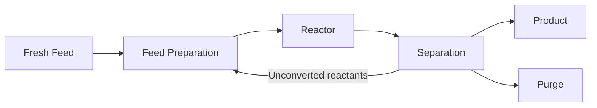

# 第1章：化学工学とは何か

本章では、工業スケールの化学がなぜベンチスケールの化学とは別の学問なのかを説明し、分野全体を組み立てている 2 つの考え方 — **単位操作（unit operation）**と**収支（balance）** — を導入し、プロセスのフローシートを読めるようにします。

**単位操作、収支、そしてプロセスの言語**

## 学習目標

本章を修了すると、以下ができるようになります:

  * ✅ フラスコで成功した反応が、なぜそのまま工業反応器にスケールしないのかを説明できる
  * ✅ 単位操作を定義し、主要なものを目的別に挙げられる
  * ✅ 定常状態の物質収支を立てて解ける
  * ✅ ブロックフロー図を読み、リサイクル流の役割を説明できる
  * ✅ 運動量・熱・物質の移動に共通する構造を説明できる

**読了時間**: 20-25分 **コード例**: 1 **演習**: 3

* * *

## 1.1 化学から化学工学へ

化学者が 100 mL のフラスコで反応をうまく成立させたとします。収率は良く、生成物は純粋です。では、これを年 1 万トン作ってください。

これは同じ問題ではありません。理由は幾何学にあります。この反応を 100 m³ の反応器 — 体積にして 100 万倍 — で行うと、容器は各方向の寸法が約 **100 倍**になります。熱は*体積*全体で発生しますが、除去されるのは*壁*を通してです:

- **発熱** ∝ 体積 ∝ L³（10⁶ 倍に増える）
- **除熱** ∝ 表面積 ∝ L²（10⁴ 倍に増える）
- **表面積対体積比** ∝ 1/L — これは 100 分の 1 に*下がる*

フラスコなら無害に逃がせていた発熱が、いまや相対的な冷却面積が 100 分の 1 になっています。対策を打たなければ、温度は暴走します。同じ議論は、混合（フラスコなら 1 秒、100 m³ なら数分）にも、相間の物質移動にも、そして実験室でこぼせば紙タオル 1 枚で済むものが工業スケールでは緊急事態になるという端的な事実にも当てはまります。

> **化学工学とは、物質とエネルギーを工業スケールで変換するプロセスを、安全に、確実に、経済的に設計し運転するための学問である。**

化学は*どんな反応が起こるか*に答えます。化学工学は*どんな速度で、どんな装置で、どれだけのコストで、そして何か問題が起きたときに何が起こるか*に答えます。

## 1.2 単位操作：この分野を築いた抽象化

**1915 年**、**Arthur D. Little** は — 化学工学をどう教えるべきかについて MIT に宛てた文書の中で — どんなに複雑なプロセスも、繰り返し現れる少数の物理的ステップに分解できると論じました。彼はそれらを**単位操作**と呼びました。この考え方は分野を再編しました。「硫酸製造」と「石鹸製造」を別々のレシピとして教える代わりに、蒸留、熱交換、ろ過を、それ自体が独立した工学の主題として一度だけ教えればよくなったのです。

| 目的 | 単位操作 | 利用する原理 |
|---|---|---|
| **分離** | 蒸留、吸収、抽出、吸着、膜分離、晶析、乾燥、ろ過 | 揮発度、溶解度、親和性、大きさ、相の違い |
| **熱移動** | 熱交換器、蒸発器、凝縮器 | 熱流束を駆動する温度差 |
| **流体操作** | ポンプ、圧縮機、配管、混合 | 圧力差と運動量移動 |
| **反応** | 多種多様な反応器 — **第2章** | 反応速度論と熱力学 |

この抽象化の威力は**転用可能性**にあります。蒸留をきちんと学べば — 気液平衡、段、還流（凝縮した塔頂留分の一部を塔に戻すこと）、エネルギーコスト — 製油所の原油分留にも、バイオエタノール工場のエタノール–水系の塔にも、空気から窒素と酸素を分ける深冷分離塔にも取り組めます。流体は違っても、工学は同じです。表の中で分離が大きな位置を占めているのには理由があります。ほとんどのプラントでは反応器は設備のごく一部にすぎず、資本費とエネルギーの大半は、そこから出てくるものの精製に費やされるからです。

## 1.3 物質収支とエネルギー収支：文法

単位操作が語彙だとすれば、**収支**は文法です。化学技術者が下すあらゆる定量的な主張は、**検査体積（control volume）**と呼ばれる、空間内に定義された領域について書かれた保存則の上に成り立っています:

```
accumulation = in − out + generation − consumption
```

全質量は保存されるので、生成項と消費項が現れるのは、反応する化学*種*を追跡するときだけです。**定常状態** — 何も時間変化しない、連続プラントの通常の状態 — では蓄積がゼロになり、収支は手計算で解ける代数式になります。

### 例題：エタノールと水を分ける

ある蒸留塔に、**10 wt% エタノール**を含む混合物が **F = 100 kg/h** で供給されています。塔は **90 wt% エタノール**の留出液 **D** と、**1 wt% エタノール**の缶出液 **B** を生み出します。反応は起こりません。この塔は留出液をどれだけ作るでしょうか。

塔全体について 2 本の収支 — **全質量**と**エタノール** — を書きます:

```
F = D + B                →   100 = D + B
0.10 × 100 = 0.90 D + 0.01 B   →   10 = 0.90 D + 0.01 B
```

エタノール収支に B = 100 − D を代入します:

```
10 = 0.90 D + 0.01 (100 − D) = 0.89 D + 1
0.89 D = 9
D = 10.11 kg/h      B = 89.89 kg/h
```

必ず検算しましょう: 出て行くエタノール = 0.90 × 10.11 + 0.01 × 89.89 = 9.10 + 0.90 = **10.0 kg/h** で、入ってくるエタノールと一致します。供給された 10 kg/h のうち 9.10 kg/h が留出液として出て行く — **回収率 91%** です。式 2 本、未知数 2 つ、そして塔の内部構造については何一つ必要ありませんでした。これこそがこの分野に特徴的な進め方です。まず保存則で問題を縛り、機構を心配するのはその後です。コードで書くと:

```python
import numpy as np

# Unknowns: D (distillate, kg/h), B (bottoms, kg/h)
# Row 1: overall mass balance      D +      B = 100
# Row 2: ethanol balance      0.90 D + 0.01 B = 0.10 * 100
A = np.array([[1.00, 1.00],
              [0.90, 0.01]])
b = np.array([100.0, 10.0])

D, B = np.linalg.solve(A, b)
print(f"D = {D:.2f} kg/h,  B = {B:.2f} kg/h")       # D = 10.11 kg/h,  B = 89.89 kg/h
print(f"ethanol out = {0.90*D + 0.01*B:.2f} kg/h")  # 10.00 kg/h
```

**エネルギー収支**もまったく同じように働きます。質量の代わりに、流れが持つエネルギー量であるエンタルピーを用いるだけです。そしてこれが、先ほどのきれいな結果をコストに変換します。エタノールを水から分けるということは混合物を沸騰させるということであり、100 °C・大気圧で水 1 kg を蒸発させるにはおよそ **2,257 kJ** かかります。蒸留は化学産業で最大級のエネルギー消費源であり、そのためプロセスを建設する価値があるかどうかを決めるのは、たいてい物質収支ではなくエネルギー収支です。（後の章に向けた注意: エタノールと水は 1 atm で 95.6 wt% エタノール付近に共沸混合物を作るため、通常の蒸留ではその純度を超えられません。）

## 1.4 プロセスを読む：フローシート

プロセスは**フローシート**として伝達されます。詳細度は 3 段階あります:

| 図面 | 示すもの | 用途 |
|---|---|---|
| **ブロックフロー図（BFD）** | プロセス区画を箱で、主要な流れ | 概念設計、教育、全体収支 |
| **プロセスフロー図（PFD）** | 個々の機器、流れの状態、熱・物質収支表 | プロセス設計と評価 |
| **P&ID** | すべての配管、バルブ、計器、制御ループ | 建設、運転、安全 — **第4章** |

ほとんどすべての連続プロセスは、同じ骨格を持っています:



分離部から前段へ戻る矢印が**リサイクル流**で、プロセス設計において最も重大な影響を持つ要素の一つです。

**リサイクルが不可欠な理由**: 反応器が 1 回の通過で原料をすべて転化することはめったにありません。平衡がそれを許さないこともあれば、高い転化率を強引に出そうとする条件が選択率を台無しにすることもあります。未転化の原料を捨てることは原料の浪費であり、原料費はたいてい最大の運転コストです。リサイクルによって、1 パスあたりの転化率がそこそこの反応器でも、**全体としての**高い転化率に到達できます。

**リサイクルが設計を難しくする理由**: すべてを結合してしまうからです。反応器の温度を変えれば分離の負荷が変わり、分離を変えれば反応器への供給が変わり、それがまた反応器を変えます。フローシートはもはやユニットごとに順に解くことができず、反復計算で収束させなければなりません — それがプロセスシミュレータのやっていることです。またリサイクルループには、入ってくるが出て行けないものが蓄積します — 供給中の不活性成分や、分離が取りきれない副生成物です。小さな**パージ**流はそのためにあります。リサイクルの一部を捨てることで不純物を一定に保つのです。さらにリサイクルは外乱をプラントの前段へ運び戻します。これは第3章で扱う制御上の問題です。

## 1.5 移動現象：その下にある物理

単位操作は、互いに無関係な装置の羅列に見えます。しかしそうではありません。**1960 年**、**Bird、Stewart、Lightfoot** が *Transport Phenomena* を出版し、運動量・熱・物質の移動が同じ形の法則に従うことを示して、それらを統一しました:

```
flux = coefficient × driving force
```

*流束（flux）*とは単位面積・単位時間あたりを通過する量であり、*駆動力*とは勾配 — ある物理量が位置に対してどれだけ急に変化しているか — です。

| 移動される量 | 法則 | 係数 | 駆動力 |
|---|---|---|---|
| **運動量** | ニュートンの粘性法則 | 粘度（μ） | 速度勾配 |
| **熱** | フーリエの熱伝導法則 | 熱伝導率（k） | 温度勾配 |
| **物質**（ある化学種の） | フィックの拡散法則 | 拡散係数（D） | 濃度勾配 |

3 つとも、勾配を平らにする向きに移動します。運動量は速い流体から遅い流体へ、熱は高温から低温へ、化学種は濃いところから薄いところへ。この統一の見返りは実務的です。ある移動問題について導かれた結果は、しばしばほかの移動問題にもそのまま使えますし、同じ装置上の工夫（乱流、薄い膜、大きな界面積）が 3 つすべてを同時に改善します。

## 1.6 化学技術者はどこで働くか

道具箱は業種を選びません。だからこそこの学位はよく通用します:

- **石油・石油化学** — 大規模連続プロセスの古典的な本拠地
- **医薬品** — 多くは回分式: 晶析、乾燥、厳格な規制
- **食品・飲料** — 蒸発、乾燥、殺菌、発酵
- **半導体** — 超高純度のガスと水、薄膜堆積、汚染管理
- **電池・エネルギー** — スラリー混合、塗工、乾燥、電解液の取り扱い、リサイクル
- **環境・水** — 汚染物質の吸収、膜処理、二酸化炭素回収

製油所の蒸留塔も乳業工場の蒸発器も、同じ収支に従う同じ単位操作です。化学は変わっても、工学は転用できます。

## 1.7 本章のまとめ

- スケールが物理を変える: 発熱は体積（L³）に比例して増えるのに除熱は面積（L²）に比例して増えるため、装置が大きくなるほど表面積対体積比は下がる — ベンチの結果は自動的には転用できない
- **単位操作**（Arthur D. Little、1915 年）は、どんなプロセスも再利用可能なステップに分解する: 分離、熱移動、流体操作、反応
- **収支**（蓄積 = 入 − 出 + 生成 − 消費）は定常状態では代数式に帰着する。100 kg/h の塔で D = 10.11 kg/h、B = 89.89 kg/h が得られたのがその例
- プロセスが経済的に成り立つかを決めるのは、たいてい物質収支ではなくエネルギー収支である
- **フローシート**には BFD、PFD、P&ID がある。**リサイクル**はプロセスを経済的にする一方で、あらゆるユニットを互いに結合させ、パージと反復解法を必要とする
- **移動現象**がこの分野を統一する: 運動量・熱・物質の移動はいずれも 流束 = 係数 × 駆動力 に従う

**次章**: フローシートの中心にある反応器 — 反応速度、反応器の型式、滞留時間が、転化率と選択率をどう決めるのか。

## 演習問題

1. **概念 — スケールアップ**: ある反応を 1 L の撹拌フラスコで行い、幾何学的に相似な 1,000 L の容器へスケールアップする。線寸法は何倍になるか、壁面の伝熱面積は何倍になるか、表面積対体積比はどう変わるか。十分な冷却を取り戻すための設計上の対応を 2 つ挙げよ。
   *ヒント*: まず体積比の立方根を取る。次に、容器壁以外の伝熱面積について考える。
   *解答*: 体積が 1,000 倍なので、線寸法は立方根で **10 倍**。壁面積は L² に比例するので **100 倍**。表面積対体積比は 1/L に比例するので **10 分の 1 に下がる** — 内容物 1 L あたりの冷却面積は、フラスコのときの 10% しかありません。設計上の対応: 壁以外の伝熱面積を追加する（**内部冷却コイル**、あるいは内容物をポンプで熱交換器に通す**外部熱交換ループ**）か、**半回分（セミバッチ）での滴下**によって発熱速度そのものを下げる — 制限反応物をゆっくり供給し、発熱が冷却能力を超えないようにする方法です。

2. **定量 — 物質収支**: ある乾燥機に、水分 20 wt% の湿潤固体が 500 kg/h で供給され、水分 2 wt% の製品が得られる。水は蒸気としてのみ出て行く。乾燥製品の流量と 1 時間あたりの蒸発水量を計算し、全質量の入と出が等しいことを確認せよ。
   *ヒント*: 乾燥固体はそのまま通過する — まずこれについて収支を取れば、未知数は 1 つだけ残る。
   *解答*: 入ってくる乾燥固体 = 0.80 × 500 = **400 kg/h** で、それはすべて製品として出て行き、製品中では 98 wt% を占めます: 製品 = 400 / 0.98 = **408.16 kg/h**。蒸発した水 = 500 − 408.16 = **91.84 kg/h**。検算: 408.16 + 91.84 = 500 kg/h で入 = 出。✓

3. **議論 — リサイクル**: ある反応器は 1 パスあたり反応物 A の 40% しか転化しないが、分離部が未転化の A をほぼすべて回収して戻している。それでも*全体*の転化率が 100% に近づきうる理由、供給中の少量の不活性成分をパージしなければならない理由、そしてパージ率が高すぎる場合と低すぎる場合に何がまずいのかを説明せよ。
   *ヒント*: 1 パス転化率と全体転化率を区別せよ。不活性成分にはパージ以外の出口がない。
   *解答*: **全体転化率 → 約 100%** となるのは、未転化の A が失われないからです。それは反応器に戻されて何度も機会を与えられるため、1 パスでは 40% しか転化しなくても、定常状態では供給された*新規*の A はほぼすべて最終的に製品になります。供給とともに入ってくる**不活性成分**は反応せず、製品とともに抜き出されもしないため、リサイクルループがその唯一の居場所になります — パージがなければ際限なく蓄積します。パージ率はトレードオフです: **高すぎる**と不活性成分と一緒にリサイクル中の反応物まで捨ててしまいます（原料費は最大の運転コストです）。**低すぎる**と不活性成分が蓄積し、反応器への供給を希釈し、反応速度を下げ、リサイクルループ上のあらゆるユニットを大型化させます。
