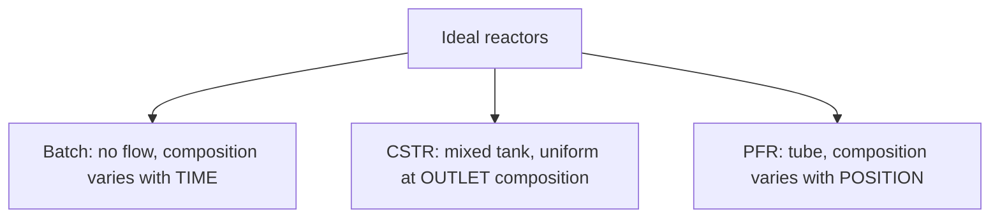
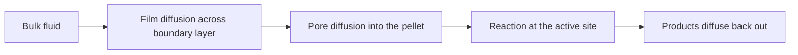

# 第2章：反応工学の基礎

本章では、分子が実際にその正体を変える唯一のユニットである反応器と、技術者がそれを記述するために使う少数の量 — 転化率、選択率、収率、反応速度、滞留時間 — を導入します。

**反応速度、反応器、そして転化率**

## 学習目標

本章を修了すると、以下ができるようになります:

  * ✅ 転化率、選択率、収率を定義し、選択率のほうが重要になることが多い理由を説明できる
  * ✅ べき乗則の速度式を書き、反応次数を説明できる
  * ✅ アレニウス式を用いて、反応速度がなぜこれほど温度に敏感なのかを説明できる
  * ✅ 回分反応器、CSTR、PFR とそれぞれの混合の仮定を比較できる
  * ✅ 滞留時間を使って単純な一次反応の反応器を設計（サイジング）できる
  * ✅ 実際の触媒反応器が理想的な挙動からずれる理由を説明できる

**読了時間**: 20-25分 **コード例**: 1 **演習**: 3

* * *

## 2.1 反応器はプロセスの心臓部

第1章の単位操作 — 混合、加熱、分離、送液 — はいずれも物質を移動させるか、その物理的状態を変えるだけです。分子が*何であるか*を変えるのは**反応器**だけです。

初学者にとって意外なのは次の点です。反応器はプラントの中で最も高価な機器であることは**むしろ少なく**、分離系列、熱交換器、圧縮機のほうが高くつくことがよくあります。それでも反応器がすべてを支配するのは、**反応器から出てくるものが、下流のあらゆるユニットの大きさを決める**からです。供給の半分を未反応のまま残す反応器は、大きなリサイクルループを強います。望ましくない副生成物を作る反応器は、蒸留塔をもう 1 本、永久に強いることになります。

反応器の性能は 3 つの数字で記述されます。2 つの経路をたどりうる反応物 **A** を考えます: A → **P**（目的物）または A → **W**（副生成物）。副生成物を W と表記するのは、下で選択率に S を使うためです。

| 量 | 定義 | 意味 |
|---|---|---|
| **転化率**（X） | 反応した A のモル数 ÷ 供給した A のモル数 | 供給のうちどれだけが使われたか |
| **選択率**（S） | 生成した P のモル数 ÷ 反応した A のモル数 | 反応した A がどこへ行ったか |
| **収率**（Y） | 生成した P のモル数 ÷ 供給した A のモル数 | 全体としての有用性。**Y = X · S**（ここで仮定しているような 1 対 1 の量論 A → P では厳密） |

A を 100 mol 供給する 2 つの候補反応器を考えます:

- **反応器 1**: 90 mol が反応、P が 63 mol、W が 27 mol → X = 90%、S = 70%、Y = 63%
- **反応器 2**: 60 mol が反応、P が 57 mol、W が 3 mol → X = 60%、S = 95%、Y = 57%

収率が高いのは反応器 1 ですが、それでも大半のプロセス技術者は反応器 2 を選ぶでしょう:

1. **未転化の原料は回収できるが、無駄になった原料は回収できない。** 反応器 2 から出てくる 40 mol の A は分離してリサイクルできます。反応器 1 で W に変わった 27 mol は破壊された原料であり、二度と戻らないお金です。
2. **副生成物は除去しなければならない。** その W は分離し、精製するか廃棄しなければならず、多くの場合は廃棄物として処理されます — 資本費と運転費が永久にかかります。

そこで、工学の標準的な直感はこうなります: **転化率は大きな反応器やリサイクルループで買えるが、選択率はたいてい買えない。** 選択率は化学の問題であり、触媒、温度、濃度によって解決されます。

## 2.2 反応速度

**反応速度**とは、単位体積・単位時間あたりに反応物をどれだけ速く消費するかです（例: mol L⁻¹ s⁻¹）。入門的な取り扱いでは**べき乗則の速度式**を用います:

$$ r = k \cdot C_A^{\,n} $$

ここで $C_A$ は A の濃度、$k$ は**速度定数**、$n$ は**反応次数**です。

次数は量論式から読み取るものではなく、データに対してフィッティングして決めるものです。**一次**（$n = 1$）: 濃度を 2 倍にすると速度も 2 倍になります。**二次**（$n = 2$）: 2 倍にすると速度は 4 倍になります。**ゼロ次**（$n = 0$）: 速度は濃度によらない — 触媒表面が飽和しているときによく見られます。一次反応が入門的な設計の主役なのは、きれいな閉形式の解が得られるからで、以下でもそれを使います。

### 温度：アレニウス式

速度定数は**アレニウス式**を通じて温度に依存します:

$$ k = A \cdot \exp\!\left(\frac{-E_a}{RT}\right) $$

ここで $A$ は頻度因子、$E_a$ は活性化エネルギー（典型的には 50〜100 kJ/mol）、$R$ = 8.314 J mol⁻¹ K⁻¹、$T$ は**絶対**温度（ケルビン）です。

肝心なのは指数関数です。よく知られた経験則に、**室温付近では 10 °C の上昇で速度がおよそ 2 倍になる**というものがあります。これはあくまで大まかな目安として扱ってください — この「2 倍」に対応するのは $E_a \approx 53$ kJ/mol です。298 K から 308 K への変化では:

| 活性化エネルギー | +10 °C での速度増加 |
|---|---|
| 50 kJ/mol | 約 1.9 倍 |
| 75 kJ/mol | 約 2.7 倍 |
| 100 kJ/mol | 約 3.7 倍 |

したがって正直な言い方はこうなります: *典型的な活性化エネルギーであれば、+10 °C は速度をおよそ 2〜4 倍にする。*

速度は話の半分にすぎません。熱力学が第 2 の、独立した制約を加えます。どんな速度式も、どんな触媒も、転化率を化学平衡より先へは押し進められません。しかも発熱反応では、温度を上げると平衡転化率はむしろ*下がり*ます。つまり、速さと到達可能な転化率は互いに逆方向に引っ張り合います。

このため温度は、**運転員が持つ最も強力なつまみであると同時に、最も危険なつまみ**でもあります。工業反応の大半は発熱反応です。反応が熱を発生する速さに冷却が追いつかなければ温度が上がり、それが速度を指数関数的に高め、さらに速く熱を放出させます。このフィードバックループが**熱暴走**であり、業界最悪級の事故の多くがこれによるものです。反応器を目標温度に保つことは**制御**の問題（第3章）であり、そもそも暴走が起こりえないように設計することは**安全と設計**の問題（第4章）です。

## 2.3 3 つの理想反応器

反応工学は、3 つの理想化によって実際の反応器を扱いやすくします:



| | **回分反応器** | **CSTR** | **PFR** |
|---|---|---|---|
| **流れ** | なし（密閉容器） | 連続的に流入・流出 | 管内を連続的に通過 |
| **混合** | 完全混合 | 完全混合 | 流れ方向にはなし |
| **濃度** | 時間とともに低下 | 一様で、出口濃度に等しい | 管に沿って低下 |
| **典型的な用途** | 医薬品、ファインケミカル | 液相反応、発酵 | 気相反応、充填触媒層 |

連続反応器の鍵となる設計変数は**滞留時間**です:

$$ \tau = \frac{V}{v} $$

ここで $V$ は反応器体積、$v$ は容積供給流量（密度一定の系の場合）であり、$\tau$ は流体要素が内部に滞在する平均時間です。

### 鍵となる知見：PFR は CSTR に勝る

同じ温度・同じ目標転化率であれば、**PFR は CSTR より小さい体積で済みます**。理由はまったくもって濃度にあります。PFR は濃度の全範囲を経験します。入口では高く（速く）、出口に向かって下がっていきます。CSTR は完全混合なので、**その体積全体が低い出口濃度に置かれ**、その仕事にとって最も遅い条件になります。

一次反応では、このペナルティは閉形式で表せます:

$$ \frac{V_{CSTR}}{V_{PFR}} = \frac{X/(1-X)}{\ln\!\big(1/(1-X)\big)} $$

転化率 90% ではこれは $9/\ln 10 = 9/2.303 \approx \mathbf{3.9}$ — 4 倍近い大きさです。このペナルティは転化率とともに急激に大きくなります。高転化率の工業反応器がたいてい管型であるのも、CSTR を直列に並べて PFR を近似することが多いのも、そのためです。

## 2.4 単純な反応器を設計する

ある一次の液相反応が $k = 0.5$ min⁻¹ を持つとします。**100 L/min** の供給から **95% の転化率**を得たいとします。

**選択肢 A — PFR**:

$$ \tau = \frac{\ln\!\big(1/(1-X)\big)}{k} = \frac{\ln 20}{0.5} = \frac{2.996}{0.5} \approx 6.0\ \text{min} \quad\Rightarrow\quad V \approx \mathbf{600\ L}\ \text{(599 L exactly)} $$

**選択肢 B — 単一の CSTR**:

$$ \tau = \frac{X}{k(1-X)} = \frac{0.95}{0.5 \times 0.05} = 38\ \text{min} \quad\Rightarrow\quad V = 38 \times 100 = \mathbf{3800\ L} $$

同じ仕事に対して、CSTR は **6 倍を超える体積**を必要とします。95% でのペナルティ（6.3 倍）は 90% のとき（3.9 倍）よりはるかに悪く、完全混合槽では最後の数パーセントの転化率が容赦なく高くつくのです。

```python
import math

k = 0.5    # 1/min, first-order rate constant
v = 100.0  # L/min, volumetric feed rate

print(f"{'X':>6} {'tau_PFR':>9} {'V_PFR':>9} {'tau_CSTR':>10} {'V_CSTR':>10} {'ratio':>7}")
for X in [0.50, 0.80, 0.90, 0.95, 0.99]:
    tau_pfr  = math.log(1.0 / (1.0 - X)) / k    # PFR, first order
    tau_cstr = X / (k * (1.0 - X))              # CSTR, first order
    print(f"{X:6.2f} {tau_pfr:9.2f} {tau_pfr*v:9.1f} "
          f"{tau_cstr:10.2f} {tau_cstr*v:10.1f} {tau_cstr/tau_pfr:7.2f}")

#      X   tau_PFR     V_PFR   tau_CSTR     V_CSTR   ratio
#   0.50      1.39     138.6       2.00      200.0    1.44
#   0.80      3.22     321.9       8.00      800.0    2.49
#   0.90      4.61     460.5      18.00     1800.0    3.91
#   0.95      5.99     599.1      38.00     3800.0    6.34
#   0.99      9.21     921.0     198.00    19800.0   21.50
```

最後の行が教訓です: 転化率 99% では、CSTR は PFR の **20 倍を超える**体積を必要とします。

## 2.5 触媒と実際の反応器

ここまではすべて、きれいな単一相の反応を仮定してきました。工業的には、それはむしろ例外です。教科書の標準的な数字として、**工業化学プロセスのおよそ 90% が触媒を伴う**と言われます。触媒とは、それ自体は消費されずに活性化エネルギーを下げることで反応を速める物質です。

| | **均一系** | **不均一系** |
|---|---|---|
| **相** | 反応物と同じ相（溶解している） | 固体触媒、流体の反応物 |
| **利点** | すべての活性点に到達可能。高い選択率 | 分離が容易 — 流体がそばを流れていくだけ |
| **欠点** | 生成物から分離しなければならない | 反応物が表面まで到達しなければならない |
| **例** | 溶液中の酸触媒 | アンモニア合成、接触分解 |

この最後の欠点こそが、実際の**充填層反応器**が理想的な PFR からずれる理由です。固体触媒上で反応する前に、分子は追加の移動ステップを経なければならないからです。



**境膜拡散**または**細孔内拡散**が化学反応そのものより遅ければ、観測される速度は速度式ではなく物質移動によって決まります。そのとき反応器は予測より遅く動き、温度に対する応答も弱くなります。拡散はアレニウス型の速度定数に比べて温度依存性がはるかに小さいからです。温度を上げても速くならなくなった反応器は、たいてい拡散律速です。

実際の反応器はまた、時間とともにずれていきます。**触媒の劣化** — コーキング（炭素質の析出）、被毒（硫黄などの不純物が活性点に結合すること）、シンタリング（高温で活性粒子が融合すること） — が活性を着実に低下させます。運転員は転化率を一定に保つために温度を少しずつ上げて補償し、やがて触媒を再生または交換しなければならなくなります。このずれを管理することこそ、プロセスの監視と制御が存在する理由そのものです。

## 2.6 本章のまとめ

- 反応器がプラント最大のコストであることはめったにないが、その**転化率と選択率が下流すべての大きさを決める**
- **Y = X · S**: 未転化の原料はリサイクルできるが、副生成物に変わった原料は永久に失われる — だから選択率は転化率より優先されることが多い
- べき乗則の速度式 $r = k C_A^n$。次数 $n$ は量論式から読み取るのではなく、データにフィッティングして決める
- アレニウス式により速度は温度に**指数関数的に**敏感になる: +10 °C は速度をおよそ 2〜4 倍にし、そのため温度は最も強力で最も危険なつまみとなる
- 3 つの理想反応器 — **回分反応器**（時間とともに変化）、**CSTR**（出口条件で一様）、**PFR**（位置とともに変化）。設計変数は滞留時間 $\tau = V/v$
- CSTR は体積全体を遅い出口濃度で運転する: 転化率 90% で PFR 体積の約 3.9 倍、95% で約 6.3 倍
- 工業プロセスの大半は触媒反応である。境膜拡散と細孔内拡散、そして劣化により、実際の反応器は理想モデルからずれる

**次章**: 反応器が設計どおりの性能を出すのは、それが設計時の温度・圧力・流量にとどまっている場合だけです。外乱、ドリフト、劣化に抗してそこに保ち続けること — それが**プロセス制御**です。

## 演習問題

1. **概念 — 転化率か選択率か**: 設計 1 は X = 95%、S = 60%。設計 2 は X = 70%、S = 92%。(a) それぞれの収率を計算せよ。(b) どちらを推奨するか、また何が変われば答えが変わりうるか。
   *ヒント*: Y = X · S。未反応の A と副生成物 W のたどる先を考えよ。
   *解答*: (a) 設計 1: Y = 0.95 × 0.60 = **57%**、設計 2: Y = 0.70 × 0.92 = **64.4%**。(b) 設計 2 は収率でも選択率でも勝っているので明らかな選択です — ただし、未反応の A を P から経済的に分離できない場合は別で、その場合は設計 2 のリサイクルループが高くつき、設計 1 の高い 1 パス転化率に価値が出てきます。

2. **定量 — 反応器のサイジング**: ある一次の液相反応が k = 0.2 min⁻¹、供給 50 L/min で、転化率 80% を目標とする。(a) PFR 体積、(b) 単一 CSTR の体積、(c) その比を計算せよ。
   *ヒント*: τ_PFR = ln(1/(1−X))/k、τ_CSTR = X/(k(1−X))、そして V = τ · v。
   *解答*: (a) τ_PFR = ln 5 / 0.2 = 8.05 min → V ≈ **402 L**。(b) τ_CSTR = 0.8/(0.2 × 0.2) = 20 min → V = **1000 L**。(c) 比は約 **2.5** — 95% での 6.3 倍というペナルティよりはるかに小さく、CSTR のペナルティが 100% に近づくほど急激に大きくなることを示しています。

3. **議論 — 温度と拡散**: ある技術者が充填層反応器の温度を 10 °C 上げたが、転化率は約 3% しか上がらず、アレニウス式の予測をはるかに下回った。説明を 2 つ挙げ、それらを区別するための実験を 1 つ示せ。
   *ヒント*: 化学反応そのもの以外に何が速度を律速しうるかを考えよ。
   *解答*: (1) 反応器が**拡散律速**である — 境膜拡散または細孔内拡散が観測速度を支配しており、拡散の温度依存性は弱い。(2) 反応が**平衡**近くにあり、それ以上の転化率が熱力学的に阻まれている（しかも発熱反応では、温度を上げると平衡転化率はむしろ下がる）。区別する実験: ペレットをより細かく砕いて再度運転する。速度が上がれば細孔内拡散が律速していたことになり、上がらなければ、同一条件で新しい触媒を充填して試し、平衡によるものか触媒劣化によるものかを切り分けます。
