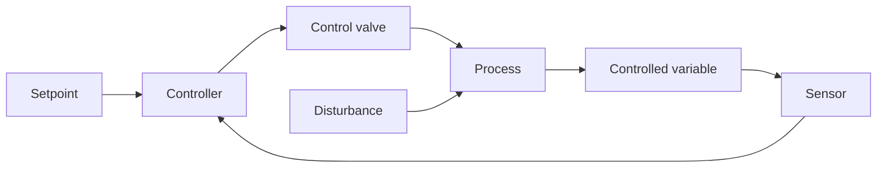

# 第3章：プロセス制御の基礎

本章では、化学プラントになぜ自動制御が必要なのか、フィードバックループはどのように働くのか、PID制御器の P・I・D の各項は何をしているのか、そしてなぜプロセスダイナミクスが制御を見た目以上に難しくするのかを説明します。

**プラントを望みの状態に保つ**

## 学習目標

本章を修了すると、以下ができるようになります:

  * ✅ プラントがなぜ定常状態にとどまらないかを説明し、制御目的を安全から利益まで順位づけできる
  * ✅ センサーから制御器を経て調節弁に至るフィードバックループをたどれる
  * ✅ P・I・D がそれぞれ何に寄与するか、そしてなぜ産業用ループの多くが PI として運用されるかを説明できる
  * ✅ 時定数とむだ時間が、ループをどこまで強くチューニング（整定）できるかをどのように制限するかを説明できる
  * ✅ カスケード制御・フィードフォワード制御・比率制御を見分け、モデル予測制御（MPC）がそれらの上位のどこに位置するかを理解できる

**読了時間**: 20-25分 **コード例**: 1 **演習**: 3

* * *

## 3.1 なぜ制御が必要か

第1章の収支は定常状態 — 時間とともに何も変化しない状態 — を前提としていました。それは便宜的な仮構です。実際のプラントは放っておいて定常を保つことはありません。**原料組成は変動し**、**外気条件は変わり**、**触媒は失活し**、熱交換器は汚れ、**需要は週ごとに変化します**。放置すればプロセスは設計点からさまよい出ます。**プロセス制御**は、プラントが今どうなっているかを測定し、それを継続的に元へ引き戻します。その目的は、次の優先順位（上ほど高い）で並びます:

| 目的 | 例 |
|---|---|
| **安全** | 暴走温度より下に保つ |
| **環境規制の順守** | 排出許容値の範囲内に収める |
| **設備の保護** | キャビテーション（ポンプ内で蒸気泡が崩壊する現象）、圧縮機サージ（激しい流れの逆流）、熱衝撃を避ける |
| **製品品質** | 純度を規格内に保つ |
| **利益** | 制約ぎりぎりの近くで運転する |

目的同士が衝突するとき、制御システムは安全を手放す前に利益を手放します。

### 動機づけとなる例：発熱反応器

第2章では Arrhenius 式から得られる経験則 — 10 °C の上昇でおおよそ**反応速度が2倍になる**（典型的な活性化エネルギーでは2〜4倍） — を示しました。冷却された反応器に発熱反応を入れてみましょう。温度上昇は反応を加速し、反応はより速く熱を放出し、それが温度をさらに押し上げます。一方、ジャケット冷却はおおむね温度差に比例してしか増えません。したがって、ある運転点の近傍では、両者のうちどちらが温度に対してより速く増加するかが問題になります。熱発生が熱除去よりも温度に対して速く増加すれば、バランスは傾きます。温度は落ち着く代わりに加速して離れていきます。これが**熱暴走**です。それが起こりうるかどうかは化学だけで決まるものではなく、設計と選ばれた運転点に依存します。まさにそれこそが、発熱反応器の設計（第4章）と制御（本章）を難しいものにしている理由です。

## 3.2 フィードバックループ

**センサー**が制御変数を測定します。**制御器**がそれを**設定値**と比較し、**偏差**を計算します。**アクチュエータ** — ほとんどの場合**調節弁** — が、冷却水流量や蒸気流量といった操作変数を変化させます。プロセスがそれに応答し、そしてこのサイクルが繰り返されます。



外乱は制御器を通ってではなく、プロセスに直接入ります。このためフィードバックには2つの仕事があります: **外乱抑制**（設定値は固定で、ループが変動を打ち消す — ほとんどのループがほとんどの時間やっていること）と、**設定値追従**（生産量や銘柄の切り替え時に目標値そのものが動く）です。フィードバックには1つの決定的な限界があります: **制御器は偏差が生じた後にしか動けない**、ということです。変動を防ぐことはできず、修正できるだけです — この隙間を突くのがフィードフォワード（3.5節）です。

### 80/20 の現実

大規模プラントでは数千のループが動いていることもありますが、その圧倒的多数は単純な**1入力1出力（SISO）フィードバックループ** — 1つの測定、1つの設定値、1つのバルブ — です。多変数の制御方式は学会論文になりますが、プラントを動かしているのはありふれた流量・レベル・圧力・温度のループであり、そのほぼすべてで最終制御要素は調節弁です。バルブはまた**フェイルセーフ**の思想も担っています。計装用空気が失われたとき、それぞれが安全な位置へ動くのです。

## 3.3 PID 制御

産業界の主力は **PID 制御器**です。産業界の実務調査は一貫して、プラントのループの大多数が PID 型であり、その多くが微分動作を切った **PI** として運用されていることを示しています。PID は偏差 *e = 設定値 − 測定値* から、3つの項 — 偏差の**現在・過去・未来** — を用いて出力を計算します:

| 項 | 読み取るもの | 効果 |
|---|---|---|
| **P**（比例） | *今*の偏差 | 偏差が大きいほど、修正も大きい |
| **I**（積分） | 蓄積された*過去*の偏差 | 偏差がゼロになるまで押し続ける |
| **D**（微分） | *傾向*、すなわち未来 | 変化率に反応する |

標準形（ISA 形）では:

$$ u(t) = K_c \left[ e(t) + \frac{1}{\tau_I} \int e\,dt + \tau_D \frac{de}{dt} \right] $$

ここで **Kc** は制御器ゲイン、**τI** は積分（リセット）時間、**τD** は微分時間です。∫ e dt は過去の偏差の累計、de/dt は偏差が今どれだけ速く変化しているか、と読んでください。どちらも手計算する必要はありません。制御器がやってくれます。

**P 単独ではオフセット（定常偏差）が残ります**。なぜなら、P は偏差が*ある*ときにしか出力を生まないからです。偏差をなくせば、バルブを開けておく信号もなくなってしまい、結果として定常的なずれが残ります。**I はそれを取り除きます**。偏差が残っている限り積分は蓄積を続け、その値を新しい定常出力として保持するからです。事実上すべての産業用ループが積分動作を持つのはこのためです。**D はしばしば切られます**。ノイズを含む測定値を微分するとバルブを叩くことになるためで、D が価値を発揮するのは主に応答の遅い温度ループです。

以下のシミュレーションは、1次プロセス（時定数5分）に PI 制御器を付け、*t* = 0 で設定値をステップ変化させたものです:

```python
# PI control of a first-order process, integrated with explicit Euler
tau, K = 5.0, 1.0        # process: time constant 5 min, steady-state gain 1
Kc, tauI = 2.0, 5.0      # PI tuning (lambda/IMC rule, explained in Section 3.4; lambda = 2.5 min)
dt, t_end = 0.01, 30.0   # Euler step must be much smaller than tau
setpoint = 1.0           # unit step in setpoint applied at t = 0

y, integral = 0.0, 0.0   # process output, and running integral of the error
for step in range(int(t_end / dt)):
    t = step * dt
    e = setpoint - y                    # where I want it minus where it is
    integral += e * dt                  # accumulated past error
    u = Kc * (e + integral / tauI)      # PI control action (valve signal)
    dydt = (-y + K * u) / tau           # first-order process dynamics
    y += dydt * dt                      # explicit Euler step
    if step % 500 == 0:                 # report every 5 minutes
        print(f"t = {t:4.1f} min   y = {y:5.3f}   u = {u:5.3f}")

# t =  0.0 min   y = 0.004   u = 2.004
# t =  5.0 min   y = 0.866   u = 1.134
# t = 10.0 min   y = 0.982   u = 1.018
# t = 15.0 min   y = 0.997   u = 1.002
# t = 20.0 min   y = 1.000   u = 1.000
# t = 25.0 min   y = 1.000   u = 1.000
```

出力は設定値に**ぴったり**到達します — 積分動作が仕事をしているのです。`integral / tauI` の項を削除して P のみにすると、出力は 0.667 で止まります。33% のオフセットです。

## 3.4 プロセスダイナミクス：制御が難しい理由

プロセスが瞬時に応答するなら、制御は簡単なものでしょう。それを妨げる効果が2つあります。

**慣性（時定数 τ）**。液で満たされた撹拌槽には熱容量があります。蒸気弁を開けても、温度は徐々にしか上がりません。1次プロセスは、1時定数で変化のおよそ63%を消化し、4〜5時定数でほぼ完了します。

**むだ時間（θ）**。バルブが動いた後、しばらくの間*まったく何も起こりません*。流体は配管を進まなければならず、組成の変化は分析計まで届かなければなりません。この**輸送遅れ**の間、制御器は目隠し状態で、古い情報に基づいて押し続けています。強く押しすぎると、ようやく届く修正が過大になり、ループは振動します。

この2つを組み合わせると、**むだ時間を伴う1次系（FOPDT）**モデル — 産業用ループの普遍的な近似記述 — が得られます。ステップ試験から得られる3つの数値、すなわちゲイン *K*、時定数 *τ*、むだ時間 *θ* です。重要な経験則は**むだ時間比 θ/τ** です:

| θ/τ | 難易度 | 典型例 |
|---|---|---|
| < 0.1 | 易しい — 強めにチューニングできる | 流量ループ、レベルループ |
| 0.1 – 1 | 中程度 — 通常のチューニング | ほとんどの温度ループ |
| > 1 | 難しい — 穏やかにするしかない | 分析計による組成ループ |

**むだ時間比が大きいほど、制御器は緩慢でなければなりません** — まだ手元にない情報を修正することはできないのです。

**Ziegler と Nichols は 1942 年に古典的なチューニング経験則を発表しました**。簡単なプラント試験から *Kc*、*τI*、*τD* を導くもので、今なお標準的な出発点です。彼らの設定値は強めで振動しやすいため、現代の実務ではより穏やかなモデルベースの規則 — **ラムダチューニング**あるいは **IMC（内部モデル制御）チューニング** — が好まれます。これは技術者が閉ループ応答の速さを直接指定するもので、上の `Kc = 2`、`τI = 5` がその例です。

## 3.5 単一ループを超えて

単一ループでは扱えないことの大半は、3つの単純な構造で処理できます。

**カスケード制御**は、あるループを別のループの内側に入れ子にします。ジャケット付き反応器では、反応器温度の*マスター*制御器はバルブを動かしません。ジャケット温度の**スレーブ制御器の設定値**を与え、そちらがバルブを動かします。速い内側ループが冷却水の外乱を反応器に届く前に吸収します。これは内側ループが外側ループよりずっと速いときに機能します。

**フィードフォワード制御**は*外乱そのもの*を測定し、その影響が現れる前に動きます。加熱器への供給流体が冷たくなれば、フィードフォワードは出口温度が下がるのを待たずに、冷たい供給が検出された瞬間に蒸気流量を増やします。外乱のモデルが必要で、決して完璧にはならないため、常にフィードバックと組み合わせて使われます。

**比率制御**は、ある流量を別の流量と一定比率に保ちます。古典的な例は加熱炉の**燃料／空気比**で、燃焼を完全かつ安全に保つために空気が燃料に追従します。

これらのループの上には、プラント全体の階層があります。**分散制御システム（DCS）**が数千のループを実行し、オペレータ画面を駆動し、**アラームシステム**を動かします。さらにその上には**高度プロセス制御（APC）** — 通常は**モデル予測制御（MPC）** — があり、動的モデルを用いて多数の相互作用する変数を制約下で同時に最適化し、下位の PID ループへ設定値を出します。プラントが意図的に制約ぎりぎりで運転できるのはこの層があるからです。この層が存在するのはループ同士が相互作用するためです。第1章の**リサイクル流**はプラント後段の外乱を再び前段へと運びます。そのため、あるユニットで修正された変動が、後になってリサイクルを通って戻ってくることがあります — プラント全体の制御が個々のループの総和以上である理由の1つです。より深く学ぶには、**Introduction to Process Monitoring and Control** および **Process Informatics Introduction** シリーズを参照してください。

## 3.6 本章のまとめ

- プラントは放っておいて定常を保つことはなく、熱発生が熱除去を上回れば発熱反応器は暴走しうる。制御目的は 安全 → 環境 → 設備 → 品質 → 利益 の順に並ぶ
- フィードバックループ — センサー → 制御器 → バルブ → プロセス — は外乱を抑制し、設定値に追従する。ほとんどのループは SISO であり、末端は調節弁である
- PID は偏差の現在（P）・過去（I）・未来（D）を読む。P 単独ではオフセットが残り、I がそれを取り除き、D はノイズを増幅する — だからほとんどのループは PI として動く
- ループの速度限界を決めるのは慣性よりもむだ時間である。FOPDT と θ/τ が標準的なモデルであり、Ziegler–Nichols（1942 年）が古典的なチューニング経験則である
- カスケード制御・フィードフォワード制御・比率制御が単一ループを拡張する。DCS と MPC はそれらの上位に位置する

**次章**: プロセス設計 — そしてそのつながりは双方向です。なぜなら**よく設計されたプロセスは制御しやすいプロセス**だからです。

## 演習問題

1. **概念**: ある調節弁が発熱反応器のジャケットへ冷却水を送っている。計装用空気が失われたとき、この弁はフェイルオープンとフェイルクローズのどちらであるべきか。またそれは 3.1 節のどの目的をトレードオフしているか。
   *ヒント*: 冷却が止まったら何が起こるかを問い、それから優先順位を当てはめてください。
   *解答*: **フェイルオープン**です。空気を失うことは制御を失うことを意味し、冷却されない発熱反応器は暴走へ向かいます。これは**製品品質**と**利益**を犠牲にして**安全**と**設備の保護**に資します — 過冷却はバッチを台無しにしますが、それが正しいトレードオフです。

2. **定量**: コード例（*K* = 1、設定値ステップ 1.0）について、P 単独の制御器はバイアスなしで *y* = *Kc*・*K* / (1 + *Kc*・*K*) に落ち着く。*Kc* = 2 と *Kc* = 9 のときのオフセットを計算せよ。ゲインを上げることが実務上の解決策にならないのはなぜか。
   *ヒント*: オフセットは設定値と整定値との差です。
   *解答*: *Kc* = 2 では *y* = 0.667、オフセットは **0.333**。*Kc* = 9 では *y* = 0.900、オフセットは **0.100**。オフセットはゲインとともに小さくなりますが決して消えず、むだ時間のある実プロセスでは高ゲインのループは振動的になり、やがて不安定になります。**積分動作**なら、控えめなゲインのままオフセットを取り除けます。

3. **議論**: ループ A は *τ* = 20 分、*θ* = 1 分。ループ B は *τ* = 4 分、*θ* = 4 分である。θ/τ を計算せよ — どちらが強くチューニングするのが難しいか。主な変動が冷却水温度の変動である反応器に対しては、カスケードとフィードフォワードのどちらを追加するか。
   *ヒント*: θ/τ の表を使い、それから速い内側ループがすでにその外乱を見ているかどうかを問うてください。
   *解答*: ループ A は θ/τ = 0.05（易しい）。ループ B は θ/τ = 1.0 — 時定数まるまる1つ分のあいだ目隠し状態なので、緩めにチューニングせざるを得ず、**はるかに難しい**です。冷却水の変動に対しては**カスケード**が自然な選択です。ジャケット温度のスレーブがその変動をほぼ即座にとらえ、反応器温度が動く前に修正します。フィードフォワードは有効な補完策ですが、外乱のモデルを必要とします。
