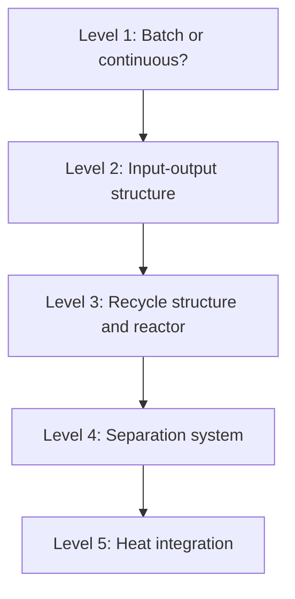
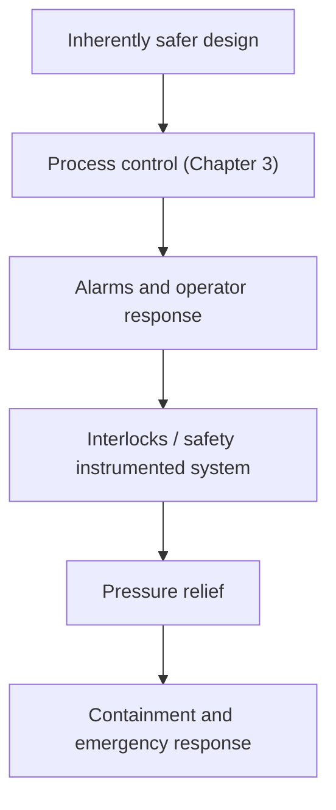

# 第4章：プロセスはどのように設計されるか

本章では、最初の3章で扱った要素 — 単位操作、反応器、制御 — が、どのようにして1つの完成したプロセスになるのかを示します。設計とは唯一の正解を持つ計算ではなく、競合する制約の下での構造化された意思決定の連なりです。

**概念からフローシート、そしてプラントへ**

## 学習目標

本章を修了すると、以下ができるようになります:

  * ✅ 設計初期の意思決定が、なぜプラントの生涯コストの大部分を決めてしまうのかを説明できる
  * ✅ Douglas の階層的意思決定手順と、それがなぜその順序なのかを説明できる
  * ✅ 蒸留がどのように設計されるかを概念的に説明し、還流比が何をトレードオフしているかを述べられる
  * ✅ ピンチ解析の目的と、その3つの黄金律を説明できる
  * ✅ 多重防護層の中で本質安全設計の原則を適用できる

**読了時間**: 20-25分 **コード例**: 0 **演習**: 3

* * *

## 4.1 設計とは制約下の意思決定である

プロセス設計は、いくつもの制約を同時に満たさなければなりません:

- **化学** — 選んだ条件で反応が成立すること
- **熱力学** — 平衡とエネルギー収支は、何をもってしても越えられない限界を定める
- **経済性** — 設備費、運転費、製品価格
- **安全** — 保有量、圧力、温度、そして故障時の挙動
- **環境と規制** — 排出、排水、廃棄物、許認可

これらは互いに違う方向へ引っ張り合います。温度を上げれば反応は速くなります（第2章）が、エネルギーがかかり危険性も高まります。より純度の高い製品は高く売れますが、より大きく、より高温の塔を必要とします。目的が互いに衝突するため、**唯一の「正しい」フローシートは存在しません** — あるのは、明示された優先順位に照らして良いか悪いかという設計だけです。

設計を難しくしているのは、意思決定が*いつ*行われるかという点です。広く引用される経験則によれば、**プロジェクトの生涯コストのおよそ80%が概念設計の段階でコミットされます**が、この段階が費やすエンジニアリング工数はごく一部にすぎません。この数値は定性的なものとして受け止めるべきですが、曲線の形は本物です。詳細設計が始まるころには、ルート、反応器、分離シーケンスはすでに固定されており、残された自由度は、そもそも存在すべきでなかったかもしれない機器を最適化することに限られます。**早いうちの意思決定は安く、遅くなってからの修正は高くつくのです。**

設計はまた、そのプラントがどれだけ制御しやすいかも決めてしまいます。緩衝容量、測定点、リサイクル結合の強さはここで決まります。よく設計されたプロセスが制御しやすいプロセスである（第3章）のはこのためです。

## 4.2 設計の階層

どこから始めればよいのでしょうか。標準的な答えは、**James Douglas**の**階層的意思決定手順**（*Conceptual Design of Chemical Processes*、1988年）です。フローシート全体を一度に解こうとするのではなく、決まった順序で決めていき、各レベルがその上のレベルに詳細を付け加えていきます。

- **レベル1 — バッチか連続か。** 少量、多品種、あるいは短期のキャンペーンならバッチが有利であり、大量で定常的な生産量なら連続が有利です。
- **レベル2 — 入出力構造。** プラントを1つの箱として扱います。どんな原料が入り、どんな製品と副生成物が出て、供給原料のどれだけの割合が製品になるのか。**原料効率**が決まるのはここです。
- **レベル3 — リサイクル構造。** 反応器とそのリサイクルが見える程度に箱を開けます。未転化の反応物は通常回収されて戻されるため、転化率（第2章）とリサイクル量が結びつきます。
- **レベル4 — 分離システム。** 反応器出口流を製品・リサイクル・廃棄物に分ける分離操作を選び、その順序を決めます。
- **レベル5 — 熱統合。** ここではじめて、流量と温度が分かった状態で、高温流体と低温流体を組み合わせてユーティリティ使用量を削減します。

この順序は経済性に従っています。汎用化学品では、**原料費が製造原価を支配するのが普通です** — 標準的な教科書の数値では、製品や立地に応じておおむね**総製造原価の33〜85%**とされます。この幅が伝えるメッセージは明確です。原料を望まれない副生成物として浪費するレベル2の判断は、下流の機器最適化のすべてを合わせたよりも高くつきうるのです。各レベルはふるいでもあります。レベル2の時点で製品価値から原料費を引いた値がすでに負であるなら、いかなる分離系も熱交換ネットワークもそのプロジェクトを救えません。

## 4.3 分離と純度のコスト

反応器が純粋な製品を生み出すことはめったにありません。分離はプラントの機器とエネルギーの多くを占め、その中で**蒸留が主力**です — 流体混合物に対して産業界で最も広く使われる分離であり、エネルギーの大口消費者でもあります。よく引用される数値は、**化学プラント・製油所の操業で使われるエネルギーのおよそ40〜50%**を蒸留に帰し、また**工業的な流体分離のおよそ90%**が蒸留によって行われているとしています。いずれもオーダー概算の調査値ですが、伝えるところは明白です。蒸留が支配的なのは、頑健でスケールしやすいからです。

二成分系の塔に対する古典的な概念設計ツールが **McCabe-Thiele線図**です。蒸気組成（y）を液組成（x）に対して取った軸の上に、次を示します:

- **平衡曲線** — ある液組成と平衡にある蒸気組成はいくつか。これは熱力学であり、いかなる設計もこれを越えることはできません。
- **操作線** — 供給段より上に1本、下に1本。物質収支が段ごとに実際にもたらすものです。
- **段作図（ステージステッピング）** — 両者の間に描かれる階段です。1段が1理論段に対応するので、階段の数を数えれば必要な段数が得られます。

*（本章の動画版では、描画された McCabe-Thiele線図 を示しています。）*

操作線を動かすつまみが**還流比**です。凝縮した塔頂液のうち、製品として抜き出さずに塔頂へ戻す量の割合を指します:

| 還流比 | 必要段数 | エネルギー使用量 | 実現可能性 |
|---|---|---|---|
| **最小還流** | 無限大 | 理論上最小 | 不可能 — 無限に高い塔 |
| **全還流** | 最小 | 無限大 | 不可能 — 製品が取れない |
| **最小の約1.2〜1.5倍** | 有限で中程度 | 中程度 | 標準的な設計経験則 |

還流を増やせば段数は減り（塔は低く、安くなり）ますが、リボイラーとコンデンサーの負荷は増えます（エネルギー費が永久に高くなります）。還流を減らせばエネルギーは節約できますが、より高い塔が必要になります。経済的最適点は2つの不可能な極端の間にあり、長年の経験則はそれを**最小還流比の1.2〜1.5倍**に置いています。これはプロセス設計における最も分かりやすい**設備費対運転費のトレードオフ**です。機器を一度買うか、20年にわたって毎時間ユーティリティ費を払い続けるか、という選択です。

## 4.4 熱統合とピンチ解析

フローシートには、加熱しなければならない流れと冷却しなければならない流れがあります。それらを別々に扱えば、蒸気の代金と冷却水の代金を二重に払うことになります — 冷却を要する高温流体が、加熱を要する低温流体のすぐ隣にあるにもかかわらず、です。**熱統合**はそれらを組み合わせ、あるプロセス流体が別の流体を加熱するようにして、双方のユーティリティ費を減らします。

その体系的手法が**ピンチ解析**で、1970年代後半から1980年代にかけて **Bodo Linnhoff** とその共同研究者によって開発されました。その洞察はこうです: **最小限必要な加熱ユーティリティと冷却ユーティリティの量**は、熱交換ネットワークを設計する*前に*計算できる、というものです。高温流体は熱の利用可能量対温度の1本の複合線図にまとめられ、低温流体はもう1本にまとめられ、選ばれた最小接近温度差が許す限り両者を近づけます。両者が接するところが**ピンチ**、すなわち熱力学的なボトルネックです。ピンチより上でプロセス内部から供給できない分が最小加熱ユーティリティであり、ピンチより下の余剰が最小冷却ユーティリティです。

目標値があると、問いは「このネットワークは良いか？」から「熱力学的最小からどれだけ離れているか？」へと変わります。ここから3つの黄金律が導かれます:

1. **ピンチをまたいで熱を移動させないこと**
2. **ピンチより上で冷却ユーティリティを使わないこと**
3. **ピンチより下で加熱ユーティリティを使わないこと**

いずれかに違反すると、両端で同時に負荷が増え、設計は最小から遠ざかります。既存プラントに適用したピンチ解析は、目視点検だけでは見逃されていた大きな省エネの余地を繰り返し見つけ出してきました。

## 4.5 設計による安全

安全は、フローシートが仕上がった後に付け加える層ではありません。ここで最も影響力のある考え方が**本質安全設計**であり、**Trevor Kletz** が数十年にわたって主張してきたものです。危険を制御するのではなく、取り除くのです。4つの原則があります:

| 原則 | 意味 | 例 |
|---|---|---|
| **最小化（Minimize）** | 危険物質の保有量を減らす | タンクに数トンではなく、連続反応器の中に数グラム |
| **代替（Substitute）** | より安全な物質やルート | 毒性の低い溶媒や試薬 |
| **緩和（Moderate）** | より穏やかな条件、または希釈形態 | 圧力・温度を下げる、希薄溶液にする |
| **単純化（Simplify）** | 複雑さと誤りを招きやすい工程を設計段階で排除する | バルブを減らし、手動操作を減らす |

Kletz の言葉を借りれば、**「持っていないものは漏れない」**のです。紙の上で取り除かれた危険には、防護システムも保全も運転員教育も、未来永劫必要ありません。危険を取り除く最も安上がりな時点は概念設計の段階です — まさに 4.1 節がレバレッジの所在として指し示したところです。

出来上がった設計は、その後で体系的にレビューされなければなりません。標準的な手法が **HAZOP**（危険性・運転性検討）です。多分野からなるチームが、配管計装図（第1章の P&ID）をノードごとにたどり、各プロセスパラメータに対して**ガイドワード** — *ない（no）*、*多い（more）*、*少ない（less）*、*逆（reverse）*、*〜に加えて（as well as）*、*一部（part of）*、*他の（other than）* — を当てはめていきます。「ここで流量が多くなったら：原因は何か、何が起こるか、何が我々を守るか？」ガイドワードがあることで、レビューはその朝たまたま発想力のある人がいるかどうかに左右されず、網羅的になります。

そうして残ったものは、1つが破られても次が破られないように並べられた**多重防護層**によって、深層で防護されます:

各層は、その上位の層がすべて失敗した後にはじめて働きます。この順序は優先順位でもあります — 最初の箱は最後の箱より価値が高いのです。

## 4.6 本章のまとめ

- 設計は化学・熱力学・経済性・安全・環境を同時に釣り合わせる。唯一の答えはなく、より良い設計とより悪い設計があるだけである
- 初期の意思決定が支配的である。経験則として、生涯コストの約80%が概念設計の段階でコミットされる
- Douglas の階層（1988年）: バッチ／連続 → 入出力 → リサイクル → 分離 → 熱統合
- 原料費が製造原価を支配することが多く（一般に33〜85%と引用される）、入出力の判断は機器の最適化に勝る
- 蒸留は分離操作を支配し、大量のエネルギーを消費する。McCabe-Thiele は平衡と物質収支がどのように段数を決めるかを示し、還流比はエネルギーと設備費をトレードオフする（最適値は最小の約1.2〜1.5倍）
- ピンチ解析はネットワーク設計に先立ってユーティリティの最小目標値を定める。3つの黄金律に従うこと
- 本質安全設計 — 最小化・代替・緩和・単純化 — は紙の上で危険を取り除く。HAZOP は体系的にレビューし、多重防護層が残りを受け止める

**次章**: 上に述べたほとんどすべては、高価な評価の上での最適化です — フローシートの代替案、還流比、熱交換ネットワーク、候補となる化学。まさにそこが、AI が化学工学に入り込む場所です。

## 演習問題

1. **概念**: あるチームが半年かけて熱交換ネットワークを最適化し、ユーティリティ費を15%削減した。その後のレビューで、選ばれた反応ルートが供給原料の30%を望まれない副生成物に送っていることが判明した。階層と 4.2 節を用いて、どちらの問題を先に扱うべきだったかを説明せよ。
   *ヒント*: それぞれの問題は階層のどのレベルにあり、どのコスト要素が通常支配的でしょうか。
   *解答*: 副生成物の問題は**レベル2（入出力構造／原料効率）**にあり、熱交換ネットワークは**レベル5（熱統合）**にあります。原料費が製造原価を支配するのが普通であることを考えれば、供給原料の30%を廃棄物に送ることは、ユーティリティの15%削減をほぼ確実に上回ります。**ルートのほうを先に直すべきだった**のであり、階層はまさにその順序を強制するために存在します。レベル2の欠陥はレベル5では修復できないからです。

2. **計算によらない推論**: ある塔が最小還流の1.05倍で運転されている。還流を最小の1.4倍まで上げたとき、(a) 必要段数、(b) リボイラー負荷、(c) 塔高 に何が起こるかを定性的に述べ、それぞれが設備費と運転費のどちらであるかを述べよ。
   *ヒント*: 最小還流では段数は発散します。経験則上の最適値は最小の1.2〜1.5倍です。
   *解答*: (a) 必要段数は**減り**、しかも急激に減ります — 最小の1.05倍ではまだ発散領域の近くにあるからです。(b) リボイラー（およびコンデンサー）負荷は**増え**、およそ余分に蒸発させる還流量に比例します。(c) 塔は段数に従って**低くなります**。段数と塔高は一度きり支払う**設備**費であり、リボイラー負荷はプラントの生涯にわたり毎時間支払う**運転**費です。だからこそ最適値はどちらの極端でもなく最小の1.2〜1.5倍にあり、また1.05倍が通常は最小に近すぎるのです。

3. **議論**: あるプロセスが、2つの工程の間に有毒中間体を20トン貯蔵している。Kletz の4原則それぞれについて設計変更を1つずつ提案し、それぞれが多重防護層の図のどこで働くかを述べよ。
   *ヒント*: そもそもその中間体を貯蔵する必要はあるのでしょうか。ルートや条件の変更によって、保有量を防護するのではなく無くすことはできないでしょうか。
   *解答*: **最小化** — 2つの工程を連続的に組み合わせるか再スケジュールし、中間体が作られるそばから消費されるようにして、20トンの保有量をなくします。**代替** — その有毒中間体を一切生成しない別ルートを採用します。**緩和** — どうしてもある程度の滞留が避けられないなら、希薄な状態で、冷却して、あるいは低圧で貯蔵し、漏洩が起きても勢いよく拡散しないようにします。**単純化** — 貯蔵工程とその移送配管・バルブ・手動操作をまるごと廃止します。4つとも、制御・アラーム・インターロック・逃し弁・封じ込めの上にある**最上段の箱「本質安全設計」**で働きます。だからこそ、それらはどの層よりも価値があるのです。紙の上で取り除かれた危険は、下位のすべての層に課される要求を永久に減らすからです。
