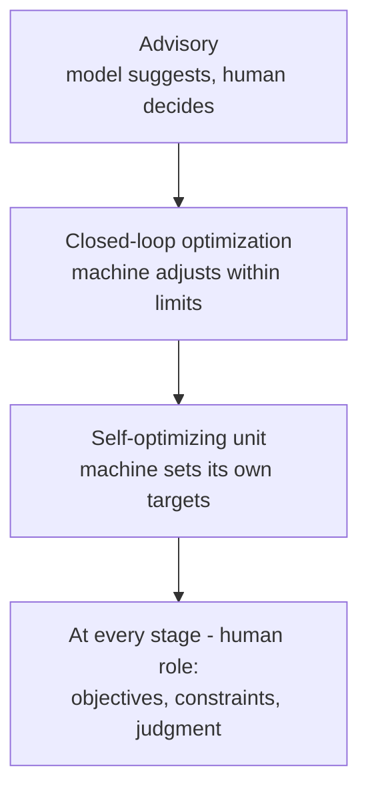

# 第5章: AIと化学工学の未来

最終章では、第 1〜4 章の内容を、いま産業実務に入りつつあるデータ駆動の手法 — ソフトセンサー、ベイズ最適化、デジタルツイン、そして自律プラントへの道 — に接続します。

**プロセスインフォマティクスとインテリジェントプラント**

## 学習目標

本章を修了すると、以下ができるようになります:

  * ✅ プロセス産業における AI 導入を推し進める 3 つの力を説明できる
  * ✅ ソフトセンサーとは何か、それが何をもたらし、どのように破綻するかを説明できる
  * ✅ 高価な実験にベイズ最適化が適する理由を説明できる
  * ✅ 第一原理モデル・ハイブリッドモデル・ML モデルを区別し、デジタルツインを定義できる
  * ✅ 自律運転を阻む本当の障壁を挙げられる
  * ✅ 基礎こそが AI を信頼できるものにすることをまとめられる

**読了時間**: 20-25分 **コード例**: 0 **演習**: 3

* * *

## 5.1 なぜ AI か、そしてなぜ今か

化学プラントは 1960 年代からコンピュータ化されてきました。ですから「化学工学における AI」は突然の到来ではありません。変わったのは 3 つの力のバランスです。

**プラントはすでに高度に計装されています。** 第 3 章の DCS は、数千の測定タグ — 温度、圧力、流量、液位、バルブ開度 — を連続的にサンプリングし、**プロセスヒストリアン（process historian）** に何年分も蓄積しています。多くの分野では最初の仕事が測定インフラの構築ですが、ここでは誰かがモデル化を計画するはるか以前からデータが集められてきました。

**古典的なモデルは構築も維持も高くつきます。** 第 1 章と第 4 章のフローシートを厳密にシミュレーションするには、熱力学、流体力学、機器形状を書き込む必要があります。経験を積んだエンジニアでも構築に数週間かかり、プラントが汚れ、老朽化していくなかで忠実さを保つには継続的な労力が要ります。

**業界は世代交代による知識の喪失に直面しています。** 経験豊富なオペレーターが後継者の育成より速く退職していること、そして彼らが知っていることの多く — どの装置が夏に高温になりがちか、どのアラームがたいてい誤報か — が一度も文書化されてこなかったことは、広く議論されている懸念です。これは測定された統計というよりコンセンサスレベルの観察ですが、現実の投資を動かしています: 人から人へ引き継げない判断は、部分的にでもコード化されなければなりません。

これらを包括する用語が **プロセスインフォマティクス（Process Informatics, PI）** です: データとモデルを組み合わせてプロセスを設計・運転・最適化すること — 本章が橋渡しとなる *プロセス・インフォマティクス入門* シリーズの主題です。

## 5.2 ソフトセンサー: 入口

プロセス産業で最も広く導入されているデータ駆動モデルが **ソフトセンサー（soft sensor）**（バーチャルセンサー）です。

> **ソフトセンサーとは、測定しにくい変数を、測定しやすい変数から推定するモデルです。**

エンジニアが最も制御したい変数は品質変数です: 組成、ポリマーのメルトインデックス、バイオマス濃度、不純物レベル。これらには実験室でのサンプリングか、高価で遅く保守の手間がかかるオンライン分析計が必要です — 一方でプラントは温度、圧力、流量を、あらゆる場所で安価に連続的に測定しています。ソフトセンサーは、過去のラボ結果と対応づけた過去のプロセスデータから、安価な測定量と高価な測定量の関係を学習し、それを連続的に推定します。

| | 実験室分析 | ソフトセンサー |
|---|---|---|
| 更新頻度 | 1 時間〜1 日ごと | 制御周期ごと |
| 遅れ | サンプリング、輸送、分析 | 実質的になし |
| 精度 | 基準となる品質 | 近似的、モデル依存 |

考え方自体は新しくありません: **推定制御（inferential control）** — 蒸留塔の段温度のような代理変数を通じて組成を制御する — は機械学習より前から存在します。現代のソフトセンサーは、これを 1 つの代理変数から多数へと一般化し、当てはめたモデルがそれらの組み合わせを担います。

なぜこれが重要かは第 3 章が説明しています。フィードバックループは自分が測定しているものしか修正できず、むだ時間はそれを盲目にします。1 時間後に届くラボ結果はほとんど役に立ちません — その時点ですでに 1 時間分の規格外製品が存在しているからです。**ソフトセンサーは、実験室分析では決して閉じられなかったループを閉じることができます。**

典型的な失敗は **モデルドリフト（model drift）** です。ソフトセンサーは特定の運転領域 — ある原料、ある触媒の使用時期、ある季節 — に対して当てはめられています。その外側では、モデルはそのことを告げずに外挿します: 数値を出し続け、それが単に誤っているだけです。したがって実運用ではラボサンプルを残し、それに対する予測誤差を監視し、再学習の手順を定めます。ソフトセンサーは設置する装置ではなく、維持し続けるモデルです。

## 5.3 実験が高価なときの最適化

第 4 章では、プロセス設計を、目的関数に対する意思決定 — 運転条件、機器サイズ、リサイクル構成 — の探索として捉えました。シミュレータがその目的関数を安価に評価できるなら、通常の最適化が使えます。難しいのは **1 回の評価が高価な** 場合です: 1 シフトを要するパイロットプラント運転、高価な試薬を消費する回分実験、試験に数日かかる触媒。評価は数十回しか許されないかもしれず、問いはこうなります: これまでに測定したすべてを踏まえて、次はどの実験を行うべきか?

**ベイズ最適化（Bayesian optimization）** は 3 つの手順でこれに答えます。第一に、*代理モデル（surrogate model）* を当てはめます — 決定変数上での目的関数の、安価な統計モデルです。第二に、その代理モデルに予測値だけでなく **不確かさ** を報告させ、モデル自身がどこで当て推量をしているかを分かるようにします。第三に、*獲得関数（acquisition function）* を用いて予測性能と不確かさを 1 つのスコアに統合し、それを最大化する実験を実行します — **活用**（結果が良さそうな場所を試す）と **探索**（最も分かっていない場所を試す）のバランスを取りながら。

こうして少ない予算を、一様にではなく意図的に配分します — これはあらゆるパイロット試験、触媒スクリーニング、配合開発が置かれている状況です。*ベイズ最適化入門* シリーズがその数学を展開します。ここでは、**実験が高価なときには、次の 1 回をうまく選ぶこと自体が工学的な問題である** と理解できれば十分です。

## 5.4 デジタルツインとモデル予測制御

プロセスモデルは競合関係ではなく、階層をなします:

| モデルの種類 | 何から構築するか | 強み | 弱み |
|---|---|---|---|
| **第一原理** | 収支、熱力学、反応速度論 | 外挿できる。*なぜ* かを説明する | 構築と維持にコストがかかる |
| **ハイブリッド** | 物理コア + ML 残差 | 物理が破綻を防ぎ、ML が残りを吸収する | 両方のスキルセットが必要 |
| **ML 代理モデル** | データのみ | 構築も評価も速い | 学習領域の内側でのみ信頼できる |

**第一原理モデル（物理モデル）** には 2 つの流儀があります。**定常フローシート計算** は「収束した運転点はどこか?」に答えます — 第 4 章の設計判断の背後にある問いです。**動的シミュレーション** は「プラントはどのようにそこへ至り、外乱にどう応答するか?」に答えます — 第 3 章のプロセス動特性であり、制御とオペレーター訓練が必要とする種類のものです。

**デジタルツイン（digital twin）** は単なるシミュレーションではありません。それは **稼働中のプラントと同期され続ける** モデルです — ライブの測定値を与えられ、実機を追従するよう定期的に再調整されます。この同期によって、現在の状態に対する what-if 解析（「いま供給流量を 5% 上げたら — 塔はフラッディングするか?」）、実際に再現するには危険すぎるシナリオでのオペレーター訓練、そして設計時点ではなく今日のプラントを反映した最適化が可能になります。

モデルベース運転の、産業界で確立された成功例が **モデル予測制御（MPC）** であり、第 3 章の制御階層の頂点で登場しました。MPC コントローラは内部にモデルを持ち、将来のホライズンにわたってプロセス応答を予測し、各制御周期において、制約を守りつつ目標に最もよく合致する操作量の動きを求める最適化を解きます — そしてその最初の一手を適用し、これを繰り返します。単一の PID ループでは歯が立たない多変数・相互干渉・制約付きの問題を扱うことができ、およそ 1980〜90 年代以降、石油精製と石油化学で標準的な実務となっています — モデルベース運転が報われることの最良の証拠です。

ここには正直な但し書きが必要です。文献はアルゴリズムに支配されていますが、実務上の難しさは別のところにあります: プラントはドリフトします — 熱交換器は汚れ、触媒は失活し、計器は校正がずれ、原料は変わる — ので、試運転時にプラントと一致していたモデルは 3 年後には一致しません。忠実さの維持は地味で継続的な作業であり、失敗の大半はそこに宿ります。**ボトルネックはモデルの構築ではなく、モデルの保守です。**

## 5.5 自律プラントへ向けて

その道筋は、自らの実験を計画・実行・解析するラボを扱う *自動実験・Self-Driving Labs 入門* シリーズと重なります。

産業界における導入の大半は第 1 段階 — オペレーターが受け入れるかどうかを判断する設定値を推奨するアドバイザリーシステム — にあります。第 2 段階、限定された範囲内での閉ループ最適化は、成熟した分野では MPC がすでに行っていることです。第 3 段階、装置が自らの目的を適応させる段階は、本当に実験的です。

この進展を押しとどめているのはアルゴリズムではありません。真の障壁は **安全認証**（プラントは膨大な蓄積エネルギーと危険物在庫を抱えており、仕様として与えられたのではなく学習された挙動を持つコントローラを承認することは、未解決の規制上の問題です）、**学習されたモデルの検証**（学習データの外側で許容可能な挙動を示すことを証明するのは、一般には未解決です）、そして **説明責任**（自律的な判断が事故を引き起こしたとき、責任の所在が特定できなければなりません）です。制度は手法よりもゆっくり動きます。

ラボからプラントへの最も活発な架け橋は、**自動実験を伴う連続フロー化学（continuous-flow chemistry）** です。小型のフロー反応器は速やかに定常状態に達し、材料の消費が少なく、本質的にコンピュータ制御に向いています — 閉ループ最適化に理想的であり、しかも見つかった条件はすでにスケール可能な連続形式であって、翻訳を要する回分レシピではありません。

人間の役割は消えません。SDL シリーズとまったく同じように、上へ移動するのです。機械は設定値を保持し、限られた空間を探索し、決して飽きません。人は **目的を定めること**（何を、安全・排出・機器寿命におけるどれだけのコストと引き換えに最適化するのか?）、**異常を判断すること**（本当のトラブルか、それとも伝送器の故障か?）、そして **結果を引き受けること** に責任を持ち続けます。機械がループを回し、エンジニアがそれが何のためのものかを決めるのです。

## 5.6 シリーズのまとめ

第 1 章では、あらゆるプロセスが **単位操作** に分解でき、そのすべてにわたって成り立つ勘定として **物質収支とエネルギー収支** があることを確認しました。第 2 章では反応器を開き、**反応速度論** が速さを、**熱力学** が限界を決めることを見ました。第 3 章では、外乱に抗する **フィードバック制御** によってプラントを一定に保ちました。第 4 章では、それらの部品を組み立てて **設計** — フローシート、熱統合、経済性、そして後付けではなく組み込まれた安全 — を作りました。第 5 章ではデータの層を加えました。

締めくくりのメッセージは覚えておく価値があります。**AI は古典的な基礎を置き換えません — プラントにおける AI を信頼できるものにしているのが、その基礎なのです。** ソフトセンサーが信用できるのは、物質収支がその出力を物理的にあり得ると裏づけるからです。デジタルツインが同期させる価値を持つのは、誰かが物理を書き下せるほどよく理解したからです。最適化の推奨に従って行動しても安全なのは、どの制約が厳格なのかをエンジニアが知っているからです。

次は: データの層は *プロセス・インフォマティクス入門*、手法は *ベイズ最適化入門*、モデルは *デジタルツイン構築入門*、自律性は *自動実験・Self-Driving Labs 入門* へ。

最後までお読みいただきありがとうございました。

## 演習問題

1. **概念**: ある蒸留塔の塔頂純度は、30 分ごとに値を報告するガスクロマトグラフで測定されていますが、塔自体は供給外乱に対しておよそ 10 分で応答します。GC の測定値だけに基づくフィードバックがうまく機能しない理由と、ソフトセンサーにはどのような入力が必要になるかを説明せよ。
   *ヒント*: 測定間隔を、第 3 章のプロセス応答時間およびむだ時間と比較し、塔がすでに連続的に測定しているものを思い出すこと。
   *解答*: 塔はおよそ 10 分で応答するのに測定は 30 分ごとなので、**外乱はサンプルとサンプルの間に到来し、完全に減衰してしまいます** — さらに各 GC 測定値には、サンプリングと分析による **むだ時間** が加わるため、ループは数分前に存在していた純度を修正していることになります。このように古く疎な情報に基づくフィードバックは、安定性を保つために感度を下げざるを得ず、プラントではなく履歴に反応してしまいます。**ソフトセンサー** であれば、塔がすでに毎秒測定しているもの、すなわち **段温度と塔頂温度**、塔の **圧力**（温度が組成を意味するのは、圧力が既知の場合だけです）、**還流流量**、**供給流量と供給組成** から、純度を連続的に推定できます — GC はドリフトの監視と再学習のための基準として残します。

2. **判断**: 1 つの反応器について 2 つのモデルが提示されています: (a) 試験したすべての条件で収率を ±3% 以内で予測する第一原理反応速度モデル、(b) 2 年分のプラントデータで学習し、その同じ期間について ±1% 以内で予測する ML 代理モデル。プラントはこれから原料を切り替えようとしています。どちらを信頼しますか、またそれはなぜですか?
   *ヒント*: 問われているのは外挿であって精度ではない — どちらのモデルが、データには含まれていない情報を持っているか?
   *解答*: **(a) の第一原理モデル** を信頼します。代理モデルの ±1% は *内挿* の精度であり、学習した運転領域の内側でのみ有効です。原料の切り替えはプラントをその領域の外へ動かし、そこではモデルは自信ありげな数値を出し続けますが、それは単に誤っています。反応速度モデルは機構 — 収支、速度式、熱力学 — を書き込んでおり、これは履歴データには含まれていない情報なので、条件が変わったときに黙って壊れるのではなく、緩やかに劣化します。ベストプラクティスは一度きりの選択をしないことです: **移行期は (a) を走らせ**、新しい条件でのデータを集め、**(b) を再学習** して、その学習領域が新しい原料をカバーした時点で代理モデルの精度上の優位を取り戻します。

3. **討論**: 自律プラントの主たる障害が技術的なものか制度的なものかを、およそ 200 語で論じよ。5.5 節の障壁を少なくとも 2 つ用い、どのような証拠があれば考えを変えるかを述べよ。
   *ヒント*: 1980〜90 年代以降の MPC の普及は、閉ループのモデルベース運転がすでに受け入れられていることを示している — では、次の一歩は何が違うのか?
   *解答*（模範解答、**制度的** であるという立場で論じたもの): MPC は 30 年以上にわたって製油所を閉ループで運転してきました。つまり業界は、コンピュータが設定値を握ることを明らかに受け入れており、自動制御という技術的な行為はすでに決着済みです。決着していないのは **安全認証** と **説明責任** です。MPC のモデルは仕様として与えられ監査可能ですが、学習されたコントローラの挙動はデータから推定されたものであり、それを承認する手続きも、その判断が事故に寄与したときに責任を割り当てる手続きも、どの規制当局も確立していません。**学習されたモデルの検証** がこれに輪をかけます: 学習データの外側で許容可能な挙動を示すことの証明は一般には未解決であり、認証は何に照らして認証すればよいのかを持たないのです。これらが制度的な問題だというのは、欠けている成果物がアルゴリズムではなく、標準・承認経路・責任規則である、という意味においてです。この判断を覆す証拠: 学習されたコントローラに対する規制当局承認の認証経路が存在するにもかかわらず、それを満たすモデルを作れるベンダーがいないために **何年も使われないまま** であったなら、拘束条件は制度的ではなく明らかに技術的でしょう — 認証された自律装置が、真にモデルの不十分さゆえに実運用で失敗した記録がある場合も同様です。
