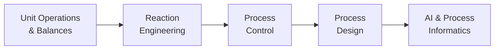

# 化学工学入門

**単位操作・反応器・制御・設計 — そして AI の居場所**

100 mL のフラスコで見事に進む反応が、そのまま 100 m³ の反応器にスケールするわけではありません。化学工学は、そのギャップを橋渡しする学問分野です: 物質とエネルギーを産業規模で変換するプロセスを、安全に、経済的に、そしてますます AI の助けを借りながら設計し、運転します。本シリーズは、プロセス産業が実際にどのように動いているのか、そしてデータ駆動の手法がどこに位置づくのかを理解したい学生・研究者のための、俯瞰的な入門です。

## シリーズ概要

本シリーズは、プロセスの一生を、その構成要素から知的な運転までたどります:

1. **分解する** — あらゆるプロセスは再利用可能な単位操作に分解され、物質収支とエネルギー収支がそれらを結びつける
2. **反応させる** — 反応器が転化率と選択率を決め、下流のすべてを規定する
3. **制御する** — フィードバックが、絶え間ない外乱にもかかわらずプラントを目標値に保つ
4. **設計する** — 階層的な意思決定が、化学を経済的で安全なフローシートに変える
5. **学習する** — ソフトセンサー、ベイズ最適化、デジタルツインがプラントを知的にする

## 各章の内容

| 章 | タイトル | 学べること |
|---------|-------|---------------------|
| 1 | [化学工学とは何か](chapter-1.html) | スケールアップ問題、単位操作、物質収支とエネルギー収支、フローシート、移動現象 |
| 2 | [反応工学の基礎](chapter-2.html) | 速度式とアレニウス挙動、回分・CSTR・PFR 反応器、転化率と選択率 |
| 3 | [プロセス制御の基礎](chapter-3.html) | フィードバックループ、PID 制御、プロセス動特性、カスケード制御とプラント全体制御 |
| 4 | [プロセスはどのように設計されるか](chapter-4.html) | 設計の階層、分離操作と蒸留、ピンチ解析、本質的により安全な設計 |
| 5 | [AI と化学工学の未来](chapter-5.html) | ソフトセンサー、ベイズ最適化、デジタルツイン、自律プラントへの道 |

## 本シリーズの対象読者

- **学生** — 化学・材料科学・工学を学び、講義では扱われないかもしれないプロセススケールの全体像を知りたい方
- **研究者** — 産業界と協働し、プラント・フローシート・制御ループの言葉を話す必要がある方
- **データサイエンティスト・インフォマティクス実務者** — プロセス産業に入っていくにあたり、プロセスインフォマティクスの土台となるドメインの基礎を求める方

化学工学の予備知識は前提としません。数学は代数、対数、いくつかの計算例のレベルにとどめ、唯一登場する微積分の式（PID の式）は言葉で説明します。

## 関連シリーズ

本シリーズは、データ駆動のプロセス系シリーズ — **プロセス・インフォマティクス入門**、**ベイズ最適化入門**、**プロセスモニタリング・制御入門**、**デジタルツイン構築入門**、**自動実験・Self-Driving Labs 入門** — に対する、古典的基礎の側の対をなすものです。第 5 章が、この 2 つの世界を明示的につなぎます。
