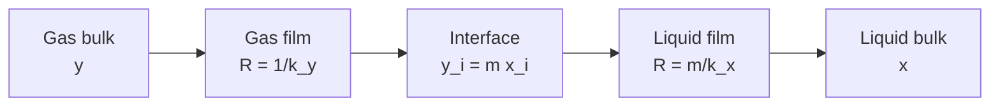

## ビデオ講義

<div class="video-container">
  <iframe
    width="560"
    height="315"
    src="https://www.youtube.com/embed/ANAuU3W1DPw"
    title="化学工学物質移動と分離 第1章: 拡散と物質移動係数"
    frameborder="0"
    allow="accelerometer; autoplay; clipboard-write; encrypted-media; gyroscope; picture-in-picture"
    allowfullscreen>
  </iframe>
</div>

> このビデオは以下のテキストと同じ内容をカバーしています。お好みの学習形式をお選びください。

---

# 第1章：拡散と物質移動係数

本章は、プラントにおけるあらゆる分離の背後にある機構 — 分子が濃いところから薄いところへ移動すること — から物質移動シリーズを始め、この遅い分子過程が、伝熱を扱いやすくしたのとまさに同じ道具立て、すなわち係数、駆動力、そして直列の抵抗によって、どのように工業装置へと変えられるのかを示します。

**フィックの法則、二重境膜モデル、そして輸送の 3 行目**

## 学習目標

本章を修了すると、以下ができるようになります:

  * ✅ 物質移動（mass transfer）を移動現象の表の 3 行目 — *流束 = 係数 × 駆動力* — として位置づけられる
  * ✅ フィックの法則（Fick's law）を適用し、気体から液体までの範囲にわたる拡散係数（diffusivity）を挙げられる
  * ✅ 工業的な物質移動が長い距離にわたる分子拡散に決して頼らない理由を説明できる
  * ✅ シュミット数（Schmidt number）をプラントル数（Prandtl number）の物質移動版として使える
  * ✅ 物質移動係数（mass-transfer coefficient）$k_c$ が物性値ではなく流れの帰結である理由を説明できる
  * ✅ ガス境膜と液境膜の抵抗を直列に合成し、どちらが支配しているかを見きわめられる

**読了時間**: 20-25分 **コード例**: 1 **演習**: 3

* * *

## 1.1 輸送の 3 行目

[入門シリーズ第1章](../chemical-engineering-introduction/chapter-1.html)では、**移動現象（transport phenomena）**を 3 行 — 運動量、熱、物質 — からなる 1 つの表として提示しました。各行はいずれも同じ文、*流束 = 係数 × 駆動力* の一例です。[流体力学](../chemical-engineering-fluid-mechanics/chapter-1.html)シリーズは運動量の行を展開し、そこでは駆動力が速度勾配、係数が粘度でした。[伝熱](../chemical-engineering-heat-transfer/chapter-1.html)シリーズは熱の行を展開し、そこでは駆動力が温度差、係数は熱伝導率 $k$ と境膜伝熱係数 $h$ から総括伝熱係数 $U$ にまで及びました。本シリーズは物質の行によって三者を完成させます。駆動力は**濃度差**であり、その係数が本章の主題です。

| 移動現象の行 | 流束 | 駆動力 | 係数 |
|---|---|---|---|
| **運動量** | せん断応力 $\tau$ | 速度勾配 | 粘度 $\mu$ |
| **熱** | 熱流束 $q$ | 温度勾配 | 熱伝導率 $k$、境膜伝熱係数 $h$ |
| **物質** | モル流束 $J$ | 濃度勾配 | 拡散係数 $D$、境膜係数 $k_c$ |

これを気にすべき商業上の理由は、**化学プラントがやっていることの大半が分離である**ということです。反応器がすべてを転化することはめったになく、望んだものだけに転化することは決してないので、その排出流は混合物になります: 目的生成物、未転化の原料、副生成物、溶媒、水。反応器より下流のほとんどすべては、その混合物を分けるために存在しています。蒸留塔と吸収塔は、精製、石油化学、ガス処理のフローシートを基数の面でも設備投資の面でも支配しており、分離は化学プロセスが使うエネルギーの大きな割合を占めるとされることが多いのです — [伝熱シリーズ第1章](../chemical-engineering-heat-transfer/chapter-1.html)が最大のユーティリティ消費者と特定したリボイラーと凝縮器は、結局のところ、蒸気で代価を払われている物質移動装置なのです。

これらの装置は、見覚えがあるはずの式でサイジングされます:

$$ N = k_c \, \Delta C $$

モル流束 $N$ は mol/(m²·s)、濃度差 $\Delta C$ は mol/m³、そして $k_c$ — **物質移動係数**、単位は m/s — が流体と流れに関するすべてを担います。これは熱流束の法則 $q = h \, \Delta T$ の文字を変えたものであり — 界面面積を掛ければ $Q = h A \Delta T$ の物質移動版になります — そして推論の多くもそのまま移ってきます。

本シリーズはこの式を装置へと変えていきます。本章が係数を組み立て、[第2章](chapter-2.html)がそれを**吸収塔**で働かせ、[第3章](chapter-3.html)が業界で最も重要な単一の分離操作である**蒸留**を扱い、[第4章](chapter-4.html)が**抽出、吸着、膜分離**を、そして[第5章](chapter-5.html)が**乾燥、晶析、そして与えられた問題に対して分離操作をどう選ぶか**で締めくくります。

## 1.2 拡散：フィックの法則

**拡散（diffusion）**とは、バルクの流れを伴わずに物質が物質の中を移動することです — 分子がランダムに動き回り、一方の側に他方より多くあるときにはいつでも正味の移動が現れます。分子を押す力は何もなく、そのドリフトは、偏った分布に対してランダム運動が引き起こすことにほかなりません。その法則は、熱伝導に関するフーリエの法則の直接の類似物です:

$$ J = -D \frac{dC}{dz} $$

ここで $J$ は **モル流束（molar flux）**、単位は mol/(m²·s)、$dC/dz$ は濃度勾配で単位は mol/m⁴（mol/m³ の濃度が m の距離にわたって変化する）、$D$ は **拡散係数**（拡散定数）で単位は m²/s です。フーリエの法則と同じく、マイナス符号は物理ではなく帳簿付けです: 物質は勾配を*下って*高濃度から低濃度へ動く、ということを述べており、したがって負の勾配が正の流束を与えます。

2 つの法則を並べてみると、類似は厳密です:

| 法則 | 流束 | 勾配 | 係数 |
|---|---|---|---|
| **フーリエ**（熱） | $q = -k\,dT/dx$ | 温度 | $k$ [W/(m·K)] |
| **フィック**（物質） | $J = -D\,dC/dz$ | 濃度 | $D$ [m²/s] |

実務上、物質の行を異なるものにしているのは、係数の大きさです:

| 媒体（常温常圧付近の代表値） | 拡散係数 $D$ [m²/s] |
|---|---|
| **気体** | 約 1 × 10⁻⁵ から 2 × 10⁻⁵ |
| **液体** | 約 1 × 10⁻⁹ |
| **固体** | さらにはるかに小さい |

これらは目安としての代表的なオーダーであって設計データではありません。実際の値は物質の組み合わせ、温度、圧力によって変わります。比として読んでください。液体中の拡散は**気体中よりおおよそ 4 桁遅く**、固体中の拡散はさらに遅いのですが、その差は材料によって幅がありすぎて 1 つの数値には要約できません。

実際上の帰結が、本章で最も重要な一文です。ランダムな分子運動は距離を稼ぐのが苦手です: おおまかなスケーリングとして、拡散がある化学種を距離 $L$ にわたって広げるのに要する時間は $L^2/D$ とともに増大するので、距離を 2 倍にすれば時間は 4 倍になります。静止した水の 1 cm にわたっては — $L^2/D \approx (0.01)^2 / 10^{-9}$ — その見積もりは $10^5$ 秒のオーダー、1 日以上です。どんなプラントもそれを待つことはできません。

だから**工業的な物質移動は、長い距離にわたって分子拡散だけに頼ることは決してありません**。そのかわり、輸送は流れが担い、拡散は最後の受け渡しを担います: ポンプ、撹拌機、充填物、トレイが新鮮な流体を物理的に界面の近くまで運び、拡散に求められるのは最後の薄い境膜を横切ることだけです。本シリーズにおける装置設計は、ほとんどすべてがそのジオメトリを整える仕事 — 界面面積を最大化し、境膜を薄く保つこと — です。演習 1 で時間スケールの数値を扱います。

## 1.3 シュミット数

熱と物質の行にはそれぞれ、自分の量がどれだけ速く広がるかを運動量がどれだけ速く広がるかと比べる無次元数があります。熱ではプラントル数 $Pr = \nu / \alpha$ で、$\alpha$ は熱拡散率、単位は m²/s です — この記号は[第3章](chapter-3.html)で、長年の慣習により相対揮発度に再利用されます。物質移動版の相棒が**シュミット数**です:

$$ Sc = \frac{\nu}{D} $$

ここで $\nu$ は動粘度で単位は m²/s — 運動量の拡散係数 — 、$D$ は物質の拡散係数です。どちらも単位が m²/s なので $Sc$ は無次元であり、1 つの問いに答えます: この流体の中では運動量と物質のどちらが速く広がるのか。

| 流体（オーダー） | シュミット数 $Sc$ |
|---|---|
| **気体** | 約 1 |
| **液体** | 約 1,000 |

気体では、運動量も物質も同じ分子が同じランダムウォークをすることによって運ばれるので、両者はほぼ同じ速さで広がり、$Sc$ は 1 の近くに落ち着きます — 気体で $Pr$ が 1 付近になるのと同じ偶然です。液体では、運動量は混み合って相互作用する分子構造を通じて効率よく伝えられる一方、個々の溶質分子はどこかへ行くのに隣の分子の間を割り込んで進まねばならないので、物質は運動量におよそ 3 桁遅れます。

この対比には、物理的な描像が付随します。$Sc$ が大きいところでは、壁の近くで濃度が変化する領域 — **濃度境界層** — が、その周りの速度境界層よりずっと薄くなります。液体中の溶質は界面の非常に薄い皮の中に閉じ込められており、まさにそれが、液相の装置で界面*面積*がこれほど重要になる理由です。シュミット数は $k_c$ の設計相関式に現れる無次元数で、それは Dittus–Boelter のような $h$ の相関式にプラントル数が現れるのとまったく同じです。本シリーズではそれらの相関式を展開しません。かわりに[第2章](chapter-2.html)で、係数と界面面積をまとめて、塔に使われる実用的なサイジング量、すなわち移動単位へと畳み込みます。

## 1.4 境膜モデルと物質移動係数

長い距離にわたって分子拡散に頼ることはできないので、工学の実務では、対流が $h$ にまとめられたのとまったく同じように、界面近傍で起こることすべてを 1 つの数値にまとめます。その道具立てが**境膜モデル**です: 物質移動に対する抵抗はすべて界面に隣接する厚さ $\delta$ の薄い停滞した境膜の中にあり、その先のバルク流体は完全に混合されて組成が一様である、と仮定します。すると

$$ N = k_c \, \Delta C $$

となり、$N$ はモル流束で単位は mol/(m²·s)、$\Delta C$ は界面とバルクの間の濃度差で単位は mol/m³、$k_c$ は **物質移動係数** で単位は m/s です。この描像の中では $k_c \approx D/\delta$ であり、$\delta$ が測定されることは決してないとはいえ、直観には役立ちます: 境膜が薄いほど係数は大きくなります。

肝心な点は、[伝熱シリーズ第1章](../chemical-engineering-heat-transfer/chapter-1.html)で $h$ について述べたことと同じであり、この分野で最もありふれた誤解なので繰り返す価値があります。拡散係数 $D$ は**物性値**です — 25 °C の水中の酸素を調べればそれで済みます。物質移動係数 $k_c$ は**物性値ではありません**。同じ溶質が同じ溶媒の中で同じ界面に接していても、流速、充填物、気泡径、撹拌速度、あるいは流れが層流か乱流かを変えれば $k_c$ は変わります。それは流れ場の帰結であり、だからこそ本シリーズは流体力学シリーズに依存しており、また $k_c$ が、それを測定した装置と条件とともにのみ引用される理由でもあります。

設計の操作レバーは、そこから直接に導かれます。乱流は新鮮な流体を界面へと運び込み、境膜を薄くして $k_c$ を高めます。小さな気泡や液滴は単位体積あたりの界面面積を高めます。規則充填物はその両方を行います。だからこそ物質移動装置ではしばしば*積* $k_c a$ が報告されるのです。ここで $a$ は単位体積あたりの界面面積で単位は m²/m³ です: 塔が実際に提供するのは係数と面積をあわせたものであり、しかも両者は通常、同じハードウェア変更によって同時に改善されます。

現実の界面がつねに停滞しているわけではないので、境膜モデルは物理的な真理というより単純化です — 界面が絶えず更新されるものとして扱う浸透説（penetration model）や表面更新説（surface-renewal model）は、$D$ に対する異なる依存性を予測し、一部の接触装置をよりよく記述します。本シリーズを通して境膜モデルを使うのは、それが単純であり、業界の設計相関式の基礎であり、そして工学的な結論を正しく導くからです。

## 1.5 界面、ヘンリーの法則、そして二重境膜モデル

伝熱には、物質移動には与えられていない単純化が 1 つありました: 温度は界面を横切って連続である、ということです。接している 2 つの物質は同じ表面温度にあります。**濃度は相境界を横切って連続ではありません。** 水中の気泡とその周りの水は、両方が平衡にありながら、それでも溶質を大きく異なる量だけ含みうるのです。溶質が単純に一方の相を他方より好むからです。

界面で一致するのは濃度ではなく**平衡**です。希薄な溶質に対しては、これは**ヘンリーの法則**によって表され、ここではモル分率で書きます:

$$ y = m x $$

ここで $y$ は界面におけるガス中の溶質のモル分率、$x$ は界面における液中のそのモル分率、$m$ は無次元の平衡定数（ヘンリー定数を全圧で割ったもの）です。$m$ の値は溶解度そのものを数値として表したものです:

  * **小さな $m$** — 非常に溶けやすい気体。低いガス相濃度でも液は多く保持します。水中のアンモニアが標準的な例で、常温常圧付近では $m$ はおおよそ 1 のオーダーです。
  * **大きな $m$** — わずかしか溶けない気体。多く溶かすには高いガス相濃度が必要です。水中の二酸化炭素が標準的な例で、常温常圧付近では $m$ はおおよそ 1,000 のオーダーです。

どちらもオーダーの目安として受け取ってください: $m$ は温度と全圧に強く依存し、液が温まるにつれて上がります — 水を加熱すると気体が溶液から出てくるのはそのためです。

**二重境膜モデル**が全体の描像を組み立てます。ガスから液へ移る溶質は、順に 2 つの行程を経ます: ガス境膜を通って界面へ、そこから液境膜を通って離れていきます。界面そのものでは平衡が瞬時に成り立つと仮定されます — 界面はそれ自体の抵抗を持ちません。逐次的なステップとは**直列の抵抗**を意味し、これは総括伝熱係数 $U$ に使われたのと同じ回路の論理です。



これらを足し合わせると **ガス基準総括物質移動係数** $K_y$ が得られます:

$$ \frac{1}{K_y} = \frac{1}{k_y} + \frac{m}{k_x} $$

ここで $k_y$ はガス境膜の係数、$k_x$ は液境膜の係数で、いずれもここではモル分率あたり kmol/(m²·s) を単位とします。第 2 項の $m$ こそが、物質移動を伝熱より豊かなものにしているものです: 液境膜の抵抗は単に $1/k_x$ ではなく、$1/k_x$ に*溶解度による重み付け*をしたものです。平衡定数が、液側の駆動力を $K_y$ が定義されているガス側の単位へと換算するからです。したがって、溶けにくい気体は、液境膜が物理的にはガス境膜となんら変わらない場合でさえ、$m$ 倍に増幅された液境膜抵抗を背負うことになります。

**これは[伝熱シリーズ第1章](../chemical-engineering-heat-transfer/chapter-1.html)の支配抵抗の議論を、新しい 1 対の抵抗に適用したものです。** あちらでは、最も大きな熱抵抗が $\Delta T$ の最も大きな分け前を取って $U$ を決めるので、それに手を付けないかぎり、それ以外の何を改善してもお金の無駄でした。ここでは 2 つの境膜抵抗のうち大きいほうが $K_y$ を決め、もう一方を改善しても何も得られません。 2 つの典型的なケースが両極に位置します:

  * **アンモニアの水への吸収 — ガス境膜支配。** $m$ が小さいので $m/k_x$ は小さく、抵抗のほとんどはガス境膜にあります。ガス側を設計しましょう: ガス流速を上げ、ガス相の乱流を促す充填物を選ぶのです。
  * **二酸化炭素の水への吸収 — 液境膜支配。** $m$ が大きいので $m/k_x$ が桁違いに支配します。液側を設計しましょう: 液負荷を上げ、液表面を更新する撹拌や充填物を使う — あるいは化学を変えて、水ではなくアミン水溶液へ吸収させ、反応が溶存 CO₂ を消費して液側の勾配を急峻にするようにします。この最後の選択肢こそが、工業的な CO₂ 回収が水ではなくアミンを使う理由です。

以下の算術がその内訳を明示します。

```python
def overall_Ky(k_y, k_x, m):
    """Overall gas-phase coefficient K_y and the two film resistances.

    k_y, k_x : film coefficients [kmol/(m^2*s) per unit mole fraction]
    m        : Henry's law slope, y = m*x [-]
    """
    resistances = {
        "gas film     1/k_y": 1.0 / k_y,
        "liquid film  m/k_x": m / k_x,
    }
    total = sum(resistances.values())
    return 1.0 / total, total, resistances


# Representative order-of-magnitude coefficients for a packed column, not design data.
CASES = {
    "NH3 into water  (m = 1, very soluble)":     dict(k_y=0.005, k_x=0.020, m=1.0),
    "CO2 into water  (m = 1000, sparingly sol.)": dict(k_y=0.005, k_x=0.020, m=1000.0),
}

for name, case in CASES.items():
    K_y, total, res = overall_Ky(**case)
    print(f"{name}:  K_y = {K_y:.3e} kmol/(m^2*s),  total R = {total:.1f}")
    for label, value in res.items():
        print(f"    {label} = {value:10.1f}  ({100 * value / total:5.1f}% of total)")
    print()

# NH3 into water  (m = 1, very soluble):  K_y = 4.000e-03 kmol/(m^2*s),  total R = 250.0
#     gas film     1/k_y =      200.0  ( 80.0% of total)
#     liquid film  m/k_x =       50.0  ( 20.0% of total)
#
# CO2 into water  (m = 1000, sparingly sol.):  K_y = 1.992e-05 kmol/(m^2*s),  total R = 50200.0
#     gas film     1/k_y =      200.0  (  0.4% of total)
#     liquid film  m/k_x =    50000.0  ( 99.6% of total)
```

2 つの境膜は、どちらの実行でも物理的には同一です — 同じ $k_y$、同じ $k_x$、同じハードウェアです。変わったのは溶解度だけであり、それが支配抵抗を界面の一方の側から他方の側へ移し、$K_y$ そのものもおよそ 200 倍動かしたのです。

さて、それぞれのケースにお金をかけてみましょう。ガス境膜の係数 $k_y$ を 0.005 から 0.010 へ 2 倍にすると、アンモニアでは $K_y$ が 4.00 × 10⁻³ から 6.67 × 10⁻³ へ上がり、その伸びは約 **67%** です — ところが CO₂ では $K_y$ が 1.992 × 10⁻⁵ から 1.996 × 10⁻⁵ へ動くだけで、伸びは約 **0.2%** です。かわりに液境膜の係数 $k_x$ を 2 倍にすると、逆のことが起こります: アンモニアでは約 **11%**、CO₂ では約 **99%** — ほとんど 2 倍です。同じハードウェア変更が、正しい投資にもまったくの無駄にもなりうるのであって、それを決めるのはどちらの境膜が支配しているかだけなのです。

この式について注意が 2 つあります。まず、この式は直線の平衡線、すなわち $m$ が一定の $y = mx$ を前提としており、これは希薄溶液で成り立ちます。濃厚系では平衡が曲線になり、局所的な傾きが必要になります。次に、界面そのものは抵抗を持たないと仮定していますが、これは標準的な扱いであるものの、界面活性剤が表面に蓄積する場合には成り立たなくなります。

## 1.6 本章のまとめ

1. 物質移動は**移動現象の表**の 3 行目 — *流束 = 係数 × 駆動力* — であり、駆動力は濃度差、実用の式は $N = k_c \Delta C$ である。分離は化学プロセスのフローシートを支配しており、化学プロセスが使うエネルギーの大きな割合を占めるとされることが多い
2. **フィックの法則** $J = -D\,dC/dz$ はフーリエの法則の直接の類似物である。代表的な拡散係数は気体で約 1–2 × 10⁻⁵ m²/s、液体で約 1 × 10⁻⁹ m²/s — おおよそ 4 桁遅い — であり、固体ではさらに遅い
3. 拡散時間がおおよそ $L^2/D$ でスケールするため、分子拡散では工業的な距離にわたって物質を動かせない: **流れが流体を近くまで運び、拡散が最後の境膜を横切る**。したがって装置設計は、界面面積を最大化しその境膜を薄くする仕事である
4. **シュミット数** $Sc = \nu/D$ はプラントル数の物質移動版である: 気体で約 1、液体で約 1,000 であり、これは液体の濃度境界層が非常に薄いことを意味する
5. $N = k_c \Delta C$ における**物質移動係数** $k_c$ は、伝熱における $h$ とまったく同様に、物性値ではなく流れの結果である。それは装置と条件とともに引用され、しばしば界面面積との積 $k_c a$ の形で示される
6. 濃度は相境界を横切って不連続である。界面で一致するのは平衡、すなわち**ヘンリーの法則** $y = mx$ であり、小さな $m$ は非常に溶けやすい気体を、大きな $m$ はわずかしか溶けない気体を意味する
7. **二重境膜説**は境膜を直列に置く: $1/K_y = 1/k_y + m/k_x$。同じ係数のもとで、NH₃（$m \approx 1$）は抵抗の **80% がガス境膜**である一方、CO₂（$m \approx 1{,}000$）は **99.6% が液境膜**である — 伝熱における $U$ と同じ支配抵抗の論理であり、CO₂ 回収が水ではなく反応性のアミンを使う理由でもある

**次章**: 係数は界面の 1 区画を記述するにすぎず、一方で塔は何メートルもの充填物にわたって流れを規格まで落とし込まねばなりません。[第2章](chapter-2.html)は $K_y$ を実際に働かせます — **ガス吸収塔とストリッピング塔** — 操作線、最小液流量、そして塔高が移動単位数からどのように導かれるかも含めて扱います。

## 演習問題

1. **概念 — 誰も拡散を待たない理由**: 拡散時間が $L^2/D$ でスケールするというおおまかな関係を使って、溶質が (a) 静止した水中を 1 mm、(b) 静止した水中を 1 cm（$D \approx 10^{-9}$ m²/s）、(c) 気体中を 1 cm（$D \approx 10^{-5}$ m²/s）広がるのに要する時間を見積もれ。(d) 撹拌槽は同じ混合を数秒で達成する。$D$ を変えることはできないのだから、撹拌翼は実際には何をしているのか。
   *ヒント*: メートル単位で計算して比を取れ。要点は精度ではなく指数である。
   *解答*: (a) $(10^{-3})^2 / 10^{-9} = 10^{-6}/10^{-9} = $ **約 10³ 秒**、おおよそ 17 分です。(b) $(10^{-2})^2/10^{-9} = $ **約 10⁵ 秒**、1 日以上です — 距離が 10 倍になると時間は 100 倍かかります。(c) $(10^{-2})^2/10^{-5} = $ **約 10 秒**、液体中の同じ距離より 4 桁速く、拡散係数の比と一致します。(d) 撹拌翼は $D$ を変えられないので、$L$ を変えています。バルクの対流が流体要素を槽の中で物理的に運び、乱流渦が、どの分子であれ拡散しなければならない距離を数センチメートルからマイクロメートルのオーダーへと切り刻みます。時間は $L^2$ でスケールするので、拡散距離を 10⁴ 分の 1 にすれば時間はおよそ 10⁸ 分の 1 になります。**工業的な物質移動装置はすべてこれをやっています**: 拡散を速めているのではなく、拡散が受け持つべき距離を短くしているのです。これらはスケーリングの議論によるオーダーの見積もりであって、拡散方程式の解ではありません。

2. **定量 — 中間的な溶解度**: 二酸化硫黄が充填塔で水に吸収されており、$k_y = 0.005$、$k_x = 0.020$ kmol/(m²·s)（モル分率あたり）、平衡線の傾きは $m = 30$ である。(a) 2 つの境膜抵抗、総括係数 $K_y$、そして各境膜の割合を計算せよ。(b) ある技術者が、ガス流速を 2 倍にして $k_y$ を 2 倍にすることを提案している。新しい $K_y$ を計算し、論評せよ。(c) 代わりに $k_x$ を 2 倍にしたら何が得られるか。(d) 結果を 1.5 節のアンモニアのケースと比較し、一般的な規則を述べよ。
   *ヒント*: 伝熱で $1/U$ を組み立てたのとまったく同じように、$1/K_y$ を項ごとに組み立てよ。
   *解答*: (a) $1/k_y = 1/0.005 = 200$、$m/k_x = 30/0.020 = 1{,}500$ なので、$1/K_y = 1{,}700$、したがって $K_y = $ **5.88 × 10⁻⁴ kmol/(m²·s)** です。**液境膜が抵抗の 88.2%**（1,700 のうち 1,500）を占め、ガス境膜は 11.8% です。(b) $1/K_y = 100 + 1{,}500 = 1{,}600$ となり、$K_y = $ **6.25 × 10⁻⁴** — 得られるのはわずか **6.3%** で、その代償はガス側の圧力損失がおよそ 4 倍になることと、フラッディングのリスクが高まることです。割に合いません。(c) $1/K_y = 200 + 750 = 950$ となり、$K_y = $ **1.05 × 10⁻³**、同じ相対的変化を支配抵抗に適用しただけで約 **79%** の伸びです。(d) $m \approx 1$ のアンモニアは 80% がガス境膜支配だったので、改善する価値があるのはガス側でした。$m = 30$ の SO₂ はすでに液境膜支配へ移っています。一般的な規則は、伝熱の規則の文字を変えたものです: **支配抵抗を改善せよ、そして何かに支出する前にそれを見きわめよ。** なお、$m = 30$ は 2 つの典型的な両極の間に位置しています — どちらの側が支配するかを決めるのは、カテゴリのラベルではなく溶解度なのです。

3. **議論 — 規格を満たせないスクラバー**: ベント流から CO₂ を除去する水スクラバーが、出口規格を満たせていない。4 つの提案が挙がっている: (i) ガスブロワーの回転数を上げて充填物中のガス流速を高める、(ii) 水の循環量を増やす、(iii) 水をアミン水溶液に置き換える、(iv) より高い充填層を設置する。それぞれを論じ、この議論に最も速く決着をつける単一の測定値またはデータが何かを述べよ。
   *ヒント*: 何かを判断する前に、水中の CO₂ の $m$ を見積もれ。
   *解答*: 水中の CO₂ は $m$ が 1,000 のオーダーなので、$1/K_y = 1/k_y + m/k_x$ から**液境膜が事実上すべての抵抗を握っています** — 1.5 節の数値では、そのうちの 99.6% です。したがって選択肢 (i) は、すでに全体の 1% を大きく下回る価値しかない抵抗を攻めるものです: $k_y$ が無限大であっても $K_y$ を目に見えて上げることはできず、余分な流速はブロワー動力を費やしながら塔をフラッディングへ近づけます。選択肢 (ii) は正しい境膜に向けられており $k_x$ をいくらか上げますが、$k_x$ は通常、液流量の分数乗で増大するので、流量を 2 倍にしても係数は 2 倍よりずっと少ししか買えません — 試す価値はありますが、それだけで十分である可能性は低く、送液と下流処理の負荷も増やします。選択肢 (iii) が正しい工学的な答えであり、工業的な CO₂ 回収がアミンで行われる理由です: 溶存 CO₂ と反応する溶媒は界面の液濃度を低く保ち、液側の勾配を急峻にして $k_x$ を実効的に大きな倍率で高めます。しかも同時に平衡も改善するので、必要な溶媒量ははるかに少なくて済みます。選択肢 (iv) は、設備費と圧力損失を定価で払って面積を買い、移動量を得るものです — 高さと予算があるなら正当ですが、支配抵抗ではなく症状に対処するものであり、水で成立させられるほど高い塔は経済的に成り立たないかもしれません。最も速く決着をつけるデータは、**実際の溶媒・温度・圧力に対する平衡定数 $m$** です: それが、ハードウェアに手を付ける前に抵抗の内訳を決めます。有用な補助的確認は、出口の液が CO₂ で飽和に近いかどうかです — 平衡から遠く離れて出ていくのであれば、塔は速度律速であり液境膜の議論が成り立ちます。ほぼ飽和して出ていくのであれば、問題は移動速度ではなく溶媒の容量であり、それに対処できるのは選択肢 (iii) だけです。
