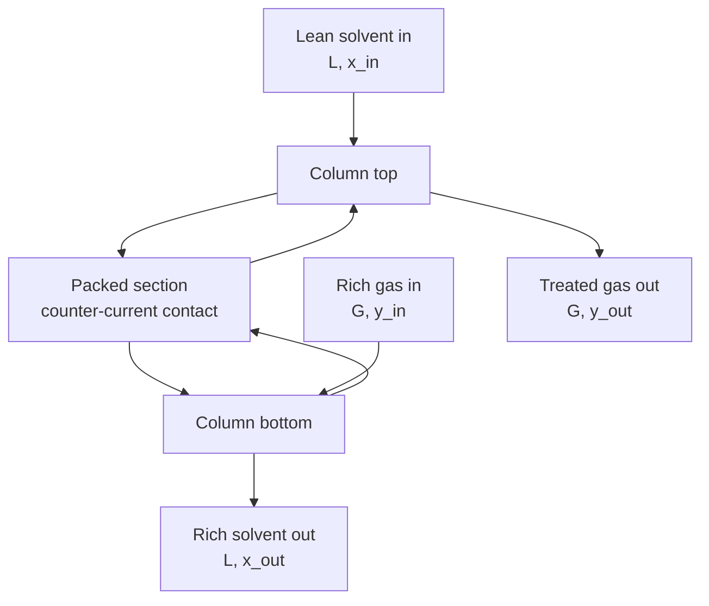

## ビデオ講義

<div class="video-container">
  <iframe
    width="560"
    height="315"
    src="https://www.youtube.com/embed/ANAuU3W1DPw?start=817"
    title="化学工学物質移動と分離 第2章: 吸収、ストリッピング、そして移動単位"
    frameborder="0"
    allow="accelerometer; autoplay; clipboard-write; encrypted-media; gyroscope; picture-in-picture"
    allowfullscreen>
  </iframe>
</div>

> このビデオは以下のテキストと同じ内容をカバーしています。お好みの学習形式をお選びください。

---

# 第2章：吸収、ストリッピング、そして移動単位

[第1章](chapter-1.html)は相間移動の道具立てを組み立てました — 二重境膜の描像、総括係数、そして 2 つの相がどこへ向かおうとしているかを定める平衡の言明としてのヘンリーの法則です。本章はそれを使い切ります。取り除きたい成分を運んでいるガス流が与えられたとき、溶媒をどれだけ送液し、どれだけ高い塔を買えばよいのでしょうか。

**操作線、最小液流量、そして HTU-NTU 法**

## 学習目標

本章を修了すると、以下ができるようになります:

  * ✅ 吸収（absorption）とストリッピング（stripping）が何をするかを述べ、それぞれの代表的な用途を挙げられる
  * ✅ 平衡線と操作線を描き、その 2 本の間隔として駆動力を読み取れる
  * ✅ 塔の濃厚端におけるピンチから最小の液ガス比を計算できる
  * ✅ 吸収因子 $A = L/(mG)$ を使って、設計に余裕があるかピンチに近いかを判断できる
  * ✅ 充填塔を $Z = \text{HTU} \times \text{NTU}$ — 移動単位高さ × 移動単位数 — でサイジングでき、強い溶媒のケース $\text{NTU} = \ln(y_{in}/y_{out})$ も扱える
  * ✅ トレイと充填物のどちらを選ぶかを判断でき、吸収塔とストリッピング塔がどのように対になって再生ループを構成するかを説明できる

**読了時間**: 20-25分 **コード例**: 1 **演習**: 3

* * *

## 2.1 仕事：溶質を相間で動かす

**吸収（absorption）**は、ガス流を液体の溶媒と接触させて、ある成分 — **溶質** — をガスから離脱させ液に溶け込ませる操作です。**ストリッピング**（脱着）は同じ装置を逆向きに運転するものです: 溶質を含んだ液をきれいなガスと接触させると、溶質が戻って出てきます。物理は[第1章](chapter-1.html)の相間移動であり、工学上の問いは、接触面積をどれだけ用意するかです。

どちらもプラントのいたるところにあります。「この流れには、それと一緒に出て行かせてはならないものが含まれている」という問いに答えるからです。排ガス洗浄は、煙突の手前で燃焼排ガスから酸性ガスを洗い落とします。ガススイートニングは、原料ガスがパイプラインの規格を満たし、途中でパイプラインを腐食させないように、そこから酸性成分を除去します。溶媒蒸気回収はベントから規制対象の有機物を引き抜きます。空気ストリッピングは、汚染された水に対して逆向きの役目を果たします。規格は用途によって大きく異なりますが — ある用途では 90% の除去で足り、別の用途ではファイブナイン（9 が 5 つ）が求められます — 以下のサイジングの論理はどの場合でも同じです。

その仕事が容易か過酷かを決める性質が 2 つあります。1 つ目は**溶解度**、すなわち溶媒がどれだけ強く溶質を求めるかで、希薄系では $y^* = m x$ におけるヘンリーの法則の傾き $m$ に集約されます。ここで $y^*$ は組成 $x$ の液と平衡にあるガス相のモル分率です。$m$ が小さいことは、しっかり保持する溶媒であり分離が容易であることを意味します。2 つ目は**要求される回収率**で、これは線形ではなく対数的に効いてきます — これが 2.4 節の中心的なサイジングの結果であり、非常に深い除去が直観より安く済む理由でもあります。

液中の反応が溶質を消費する場合 — 酸性ガス処理では通常の構成です — 平衡分圧は物理的な溶解度だけによる値をはるかに下回ります。**化学吸収**には本章の範囲を超えた独自の設計理論があります。以下で扱うのは物理的で希薄なヘンリーの法則のケースであり、多くの実際の塔にとって妥当な第一近似です。

## 2.2 2 本の線：平衡線と操作線

標準的なハードウェアを思い浮かべてください: **充填物**を詰めた垂直の円筒があり、ガスは下から上昇し、液は上から充填物の表面を伝って滴り落ち、両相は全体にわたって**向流**で接触します。



設計者に必要なものはすべて、$y$ を $x$ に対してプロットした 1 枚の図 — 液相のモル分率に対するガス相のモル分率 — の上にあり、そこには 2 本の線が引かれています。

**平衡線**は、無限の時間と面積が与えられたときに両相が行き着く先を示します。ヘンリーの法則に従う希薄系では、原点を通る直線になります:

$$ y^* = m x $$

**操作線**は、各高さで両相が実際にどこにいるかを示すもので、熱力学ではなく物質収支から出てきます。塔頂から任意の断面までを囲む境界を引くと、入る溶質と出る溶質が等しくなければならないので、$G$ をモルガス流量、$L$ をモル液流量として:

$$ G(y - y_{out}) = L(x - x_{in}) \qquad \Longrightarrow \qquad y = \frac{L}{G}x + \left(y_{out} - \frac{L}{G}x_{in}\right) $$

傾き $L/G$ の直線であり、塔頂の点 $(x_{in}, y_{out})$ と塔底の点 $(x_{out}, y_{in})$ を通ります。これが直線になるのは、溶質が両者の間を移っても担体ガスと溶媒の流量がほとんど変わらない程度に流れが希薄だと仮定したからです — 平衡線を直線にしたのと同じ単純化です。濃厚系ではモル分率座標で操作線が曲がりますが、モル比座標に移せばふたたび直線になります。まさにそれこそが、その座標が存在する理由です。

2 本の線をあわせると設計全体が担われます。任意の高さでガスは $y$ にあり、それが接触している液は $x$ にあります。平衡に達していたなら、ガスは $y^* = mx$ に*なっていたはず*です。**駆動力**は 2 本の線の間の縦方向の距離、$y - y^*$ です。吸収では操作線が平衡線の**上**にあります — ガスは局所の液と平衡になるより濃いので、溶質はガス → 液の方向、すなわち望む向きに移動します。2 本の線が接するところでは駆動力がゼロであり、どれだけ充填物を入れてもそれ以上の移動は起こりません。

これは伝熱の描像と構造的に双子の関係にあります。[伝熱シリーズ第2章](../chemical-engineering-heat-transfer/chapter-2.html)では駆動力は熱交換器に沿った温度差であり、$Q = UA\,\Delta T_{lm}$ が熱負荷を平均駆動力で割って面積を得ました。ここでは間隔が塔に沿った組成差であり、サイジングの法則は必要な組成変化を平均駆動力で割って高さを得ます。どちらの平均も対数の形になり、その理由は同じです: 間隔が装置に沿って指数的に減衰するからです。

## 2.3 最小液流量

溶媒はただではありません — 送液には動力、再生には蒸気、在庫には費用がかかります — ので、設計者は分離が許すかぎり $L$ を小さくしたいと考えます。$L/G$ が下がるとどうなるかを見てみましょう。

操作線は塔頂の点 $(x_{in}, y_{out})$ に固定されています: 供給される希薄溶媒（リーン溶媒）と、満たさねばならない規格です。$L/G$ を下げると傾きが小さくなり、線は平衡線に向かって下へ振れます — 物理的には、同じ負荷を運ぶ溶媒が少なくなるということは、溶質を含んだ溶媒がより濃くなるということであり、$x_{out}$ が上がって塔底の点が右へ滑っていきます。さらに続けると 2 本の線が接します。この接触が**ピンチ**であり、ここでは**濃厚端（リッチ端）**、すなわち両方の組成が最も高い塔底で起こります。

ピンチでは、出ていく液が入ってくるガスと平衡になっています:

$$ x_{out}^* = \frac{y_{in}}{m} $$

そして塔全体の物質収支から**最小の液ガス比**が得られます:

$$ \left(\frac{L}{G}\right)_{min} = \frac{y_{in} - y_{out}}{x_{out}^* - x_{in}} = \frac{y_{in} - y_{out}}{y_{in}/m - x_{in}} $$

この最小値は極限であって設計値ではありません。ちょうど $(L/G)_{min}$ では塔底の駆動力がゼロであり、必要な充填高さは無限大になります — ポンプ動力の有限の節約と引き換えに、際限のない塔を買うことになるのです。最小値に近づけば高さは急峻に増大し、そこから離せば最初は急速に、その後はほとんど下がらなくなります。実際の設計はその曲線の膝の部分に位置し、それを見つける指標が**吸収因子**です:

$$ A = \frac{L}{mG} $$

$A$ — 吸収因子であって、$Q = UA\,\Delta T_{lm}$ における面積と混同しないでください — は操作線の傾きを平衡線の傾きで割ったものです: 提供される溶媒の能力を、溶質の揮発性が要求するものと比べたものです。$A < 1$ は平衡線のほうが急であることを意味し、塔がどれだけ高くても達成できる回収率を $A$ そのもので頭打ちにします。$A > 1$ は 2 本の線が塔に沿って離れていくことを意味し、指定されたどんな回収率も有限の高さで買えます。**一般に**吸収塔の設計はおおよそ $A \approx 1.2$ から $2.0$ のあたりに落ち着きます — これは目安であって、確認なしに引用してよい最適値ではありません。実際の最適点は、その現場の溶媒・蒸気・設備の費用に依存するからです。

1 つの厳密な結果がこれを具体的にしてくれます。きれいな溶媒（$x_{in} = 0$）では、最小比の式を $m$ で割ると

$$ A_{min} = \frac{(L/G)_{min}}{m} = 1 - \frac{y_{out}}{y_{in}} $$

となり、これはちょうど分率としての回収率です。98% の除去を求めるなら、塔がそもそも成立するためには $A$ が 0.98 を超えていなければならず、99.9% を求めるなら 0.999 を超えていなければなりません。この下限はつねに 1 より小さいので、慣用の帯域はどんな回収率に対してもそれを上回っており、設計上の問いは $A$ が十分大きい*かどうか*ではなく、ささやかな $A$ がどれだけの高さを要求するかなのです。

## 2.4 HTU と NTU：積としての塔高

充填塔のサイジングの結果は、拍子抜けするほど単純です:

$$ Z = \text{HTU} \times \text{NTU} $$

ここで $Z$ は充填高さ、単位はメートルです。この因数分解は、分離の難しさとハードウェアの良さとを切り分けます。

**移動単位数**（NTU）は*難しさ*です: 入口組成から出口規格に到達するために、利用できる駆動力を何回消費しなければならないかを数える無次元の量です。

$$ \text{NTU} = \int_{y_{out}}^{y_{in}} \frac{dy}{y - y^*} $$

ここにハードウェアは一切現れません — 要求される組成と、化学が手渡してきた平衡線だけです。これは[伝熱シリーズ第2章](../chemical-engineering-heat-transfer/chapter-2.html)の ε-NTU 法における NTU の物質移動版であり、そのために同じ名前を共有しています。

**移動単位高さ**（HTU）は*ハードウェア*です: 移動単位 1 つ分に必要な充填高さであり、単位断面積あたりのガス流量を体積基準の係数 $K_y a$ で割ったものに等しくなります — ここで $a$ は充填層の単位体積あたりの界面面積、すなわち充填物が存在するそもそもの理由です。HTU が小さいことは、1 メートルあたり多くの濡れ面積を生み出す充填物であることを意味します。**代表的な**充填塔の HTU の値はおおよそ 0.3 から 0.6 m とされることが多いのですが、それは計画段階の数字にすぎません: HTU は充填物の種類と寸法、流量、物性、そして液がどれだけ均一に分散されているかに依存するので、実際のプロジェクトではベンダーのデータやパイロット試験から取ります。

2 本の線がともに直線であれば、この積分には閉じた形の解があります — 希薄系の標準的な結果で、Colburn の形で書けば:

$$ \text{NTU} = \frac{A}{A-1}\ln\left[\left(1 - \frac{1}{A}\right)\frac{y_{in} - m x_{in}}{y_{out} - m x_{in}} + \frac{1}{A}\right] $$

扱いにくい式ですが、最も重要な極限では簡単な形に崩れます。溶媒が十分に強く — 高い溶媒流量、小さな $m$、あるいは溶質を消費する反応によって — どこでも $y^* \approx 0$ であれば、積分は $\int dy/y$ になり、これは積分区間の両端の比の対数として評価されます:

$$ \text{NTU} = \ln\!\left(\frac{y_{in}}{y_{out}}\right) $$

この対数こそが、覚えておくべき一文です。**分離の難しさは、除去する量ではなく除去の比に依存する。** 出口濃度を半分にするのは、10% から 5% への場合であれ 1 ppm から 0.5 ppm への場合であれ、つねに $\ln 2 \approx 0.69$ 単位ぶんの追加の移動単位を要します。

### 計算例

ある希薄な溶質を 98% まで除去しなければならず、溶媒は $y^* \approx 0$ とみなせるほど強いとします。このとき除去比は

$$ \frac{y_{in}}{y_{out}} = \frac{1}{1 - 0.98} = 50 \qquad \Longrightarrow \qquad \text{NTU} = \ln 50 \approx 3.9 $$

HTU を 0.6 m と仮定すると:

$$ Z = \text{HTU} \times \text{NTU} = 0.6 \times 3.9 \approx 2.3\ \text{m} $$

98% の除去に対して充填高さは 2 メートル半足らず — 容易な吸収用途に対しては本当にこのオーダーであり、充填塔が魅力的である理由をよく示しています。これは実現可能性の見積もりであって、購入仕様ではないものとして受け取ってください。HTU は仮定した値であり、不確かさの大半を背負っています。$y^* \approx 0$ は*最も*有利なケースであり、有限の $A$ は NTU を $\ln 50$ より、ときにははるかに大きく引き上げます — 以下のコードが示すとおりです。そして実際の塔には、液分散のため、両相が入る端部効果のため、そして定格外運転に対する余裕のために高さが追加されます。納入される塔は 2.3 m より高くなります。

```python
import math

HTU = 0.6  # m, assumed packing height of a transfer unit


def ntu_strong_solvent(ratio):
    """NTU for the limiting case y* ~ 0, given the removal ratio y_in/y_out."""
    return math.log(ratio)


def ntu_colburn(A, ratio):
    """NTU for a straight equilibrium line and a clean solvent (x_in = 0).

    A is the absorption factor L/(m*G); ratio is y_in/y_out.
    """
    if abs(A - 1.0) < 1e-9:      # the A = 1 limit of the expression
        return ratio - 1.0
    return A / (A - 1.0) * math.log((1.0 - 1.0 / A) * ratio + 1.0 / A)


# Worked example: 98% removal, y* ~ 0
ratio = 1.0 / (1.0 - 0.98)
ntu0 = ntu_strong_solvent(ratio)
print(f"removal ratio y_in/y_out = {ratio:.0f}")
print(f"NTU (y* ~ 0)             = {ntu0:.2f}")
print(f"packed height Z          = {HTU * ntu0:.2f} m\n")

# The cost of running close to the pinch
print(f"{'A = L/(mG)':>11} {'NTU':>7} {'Z [m]':>7}")
for A in (1.0, 1.05, 1.1, 1.2, 1.5, 2.0, 3.0):
    n = ntu_colburn(A, ratio)
    print(f"{A:>11.2f} {n:7.1f} {HTU * n:7.1f}")
print(f"{'infinite':>11} {ntu0:7.1f} {HTU * ntu0:7.1f}")

# removal ratio y_in/y_out = 50
# NTU (y* ~ 0)             = 3.91
# packed height Z          = 2.35 m
#
#  A = L/(mG)     NTU   Z [m]
#        1.00    49.0    29.4
#        1.05    25.3    15.2
#        1.10    18.7    11.2
#        1.20    13.3     8.0
#        1.50     8.6     5.1
#        2.00     6.5     3.9
#        3.00     5.3     3.2
#    infinite     3.9     2.3
```

このスイープが教訓そのもの — ピンチの議論を定量化した形です。最小値（ここでは $A_{min} = 0.98$）のすぐ上、$A = 1$ では、塔は 49 の移動単位と 30 m 近い充填物を必要とします。$A$ を 1.5 まで上げるとそれは約 5 m まで崩れ落ち、$A = 2$ では 4 m を切ります。そこから先は平坦になります: $A = 2$ から無限の溶媒量まで行っても、さらに 1.6 m しか買えません。この平坦化こそが、慣用の帯域が今の位置にある理由です — おおよそ $A \approx 1.2$ を下回ると高さが爆発し、おおよそ $A \approx 2$ を上回ると、もはやたいして塔を短くしてくれない循環量に対価を払うことになります。

## 2.5 トレイか充填物か

同じ用途は、**充填塔** — 不規則充填物または規則充填物の層に、上部から液を分散させたもの — でも、**棚段塔** — ガスが泡となって通り抜ける液のプールをそれぞれが保持する板の積み重ね — でも運転できます。どちらも界面面積を作り出しますが、トレードオフの中身が違います。

| | トレイ | 充填物 |
|---|---|---|
| **接触の機構** | ガスが各段の液プールの中を泡となって通る | 液膜が固定された層の表面を流れ落ちる |
| **段あたりの圧力損失** | 高い — ガスはトレイごとに液のヘッドを持ち上げねばならない | 低い — 減圧下や大容量ガスの用途では、たいていこれが決め手になる |
| **処理能力／ターンダウン** | 高い液負荷をよく扱える。流量の大きな変動にも耐える | 低い液流量に敏感 — 乾いた部分ができると濡れ面積が台無しになる |
| **汚れ・固形分への耐性** | より耐性が高い — 段は点検・清掃ができる | 劣る — 汚れや析出を伴う用途では層が閉塞する |
| **小口径での経済性** | 悪い — 段のハードウェアやマンホールは安く小型化できない | 良い — 口径がおおよそ 1 メートルを下回ると、一般に充填物のほうが安い選択になる |
| **腐食性の用途** | 金属加工が材料選択を制約する | セラミックや樹脂の充填物が選択肢を広げる |
| **設計の基礎** | 平衡段とトレイ効率 | 連続接触、$Z = \text{HTU} \times \text{NTU}$ |

最後の行が概念上の分かれ目です。トレイは**平衡段**の列として記述され、実際のトレイは平衡に達しないので各段は 1 未満の**トレイ効率**で割り引かれます。充填物は連続接触として記述され、移動単位でサイジングされます。直線の場合には両者は相互に換算可能であり、選択肢を比較する設計者は通常、1 つの通貨に揃えたいので実際に換算します。標準的な実務のもとでは、低圧力損失・小口径・腐食性の用途は充填物に傾き、高液負荷・汚れ・広いターンダウンの用途はトレイに傾きます — これは仕様書のための出発点であって、その代わりになるものではありません。実際の選定はベンダーの性能データ、材質、据付費用を秤にかけるからです。

## 2.6 ストリッピング：鏡像

ストリッピングは吸収を逆向きに走らせるものであり、上記のすべての結果は変わるのではなく反転します。

溶質を含んだ溶媒が塔頂から入り、きれいな**ストリッピング剤** — 蒸気、空気、あるいは不活性ガス — が塔底から入ります。液は今や、出会うガスと平衡になるより濃いので、溶質は液を離れます。$y$-$x$ 線図の上では操作線が平衡線の**下**にあり、駆動力は $y^* - y$、すなわち同じ間隔を逆向きに読んだものです。ピンチはまたも濃厚端 — ここでは、溶質を含んだ液が入る*塔頂* — にあり、それは最小液流量ではなく**最小ガス流量**を決めます。支配的な無次元数は**ストリッピング因子** $S = mG/L = 1/A$ に反転し、ストリッピングはこれが 1 を余裕をもって上回ることを望みます。吸収が $A$ に 1 超を望むのとまったく同じ理由です。

吸収を容易にするものはすべてストリッピングを困難にし、そのトレードオフが溶媒選定の中心にあります。$m$ が非常に小さい溶媒は溶質をしっかり保持し、見事に吸収します。ところが溶媒を取り戻すには、まさにその握力を破らねばならず、ストリッピング塔がエネルギーで代価を払うことになります。温度を上げるか圧力を下げると $m$ が有利な方向に動きます — 液体への気体の溶解度は一般に温度が上がると下がります — これが、再生が通常は高温で、吸収が通常は低温で行われる理由です。

この対をなす関係こそが、ストリッピング塔が存在する理由です。溶媒が一度使われて捨てられることはめったになく、吸収塔とストリッピング塔は**再生ループ**として結合されます。希薄溶媒は低温で吸収し、溶質を含んだ溶媒は加熱され（通常は戻ってくる希薄流と熱交換するクロス熱交換器で加熱されます — [伝熱シリーズ第2章](../chemical-engineering-heat-transfer/chapter-2.html)の熱回収を溶媒の循環系に適用したものです）、ストリッピング塔へ送られ、溶質は濃縮された製品または廃棄流として離脱し、再生された溶媒は冷却されて戻されます。酸性ガス除去のための**アミン装置**が典型的な例です。

このループは溶媒流量の判断を捉え直します。2.4 節では高い $L/G$ を単に塔を短く買うものとして扱いましたが、循環するすべてのモルは加熱され、ストリッピングされ、ふたたび冷却されねばならず、それが再生塔のリボイラー熱負荷として返ってきます。溶媒流量はこのループの蒸気消費量に対する主要な操作レバーなので、正直な最適点は 2 つの塔とそのユーティリティにまたがることになります。

## 2.7 本章のまとめ

1. **吸収**は溶質をガスから液体の溶媒へ移し、**ストリッピング**はそれを逆転させる。代表的な用途: 排ガス洗浄、ガススイートニング、ベントからの溶媒蒸気回収、水中の揮発性成分の空気ストリッピング
2. 設計は 2 本の線を持つ $y$-$x$ 線図の上で行われる — ヘンリーの法則による**平衡線** $y^* = mx$（[第1章](chapter-1.html)）と、塔の一断面の物質収支による**操作線** $y = (L/G)x + (y_{out} - (L/G)x_{in})$ である。**駆動力**は両者の縦方向の間隔であり、吸収では操作線が平衡線の上にある
3. $L/G$ が下がると操作線は濃厚端で平衡線に**ピンチ**し、$x_{out}^* = y_{in}/m$ と $(L/G)_{min} = (y_{in}-y_{out})/(x_{out}^*-x_{in})$ を与える — これは無限の高さを要求する極限であって、決して設計値ではない。**吸収因子** $A = L/(mG)$ は設計がそのピンチからどれだけ上で運転されるかを示し、きれいな溶媒では $A_{min}$ は分率としての回収率にちょうど等しく、設計は**一般に**おおよそ $A \approx 1.2$ から $2.0$ に落ち着く
4. 充填高さは $Z = \text{HTU} \times \text{NTU}$ と因数分解される: **NTU** は分離の難しさ、**HTU** は充填物の効率のものさしであり — **代表的には**おおよそ 0.3 から 0.6 m とされるが、これはベンダーやパイロットのデータに置き換えられるべき計画段階の数字である
5. $y^* \approx 0$ とみなせるほど強い溶媒では $\text{NTU} = \ln(y_{in}/y_{out})$ となる: 難しさは除去の*比*に依存するので、出口濃度を半分にするのはつねに $\ln 2 \approx 0.69$ ぶんの追加の移動単位を要する。98% の除去では $y_{in}/y_{out} = 50$、$\text{NTU} = \ln 50 \approx 3.9$ であり、HTU $= 0.6$ m とすれば $Z \approx 2.3$ m — 余裕、端部効果、分散のための高さを加える前の値である
6. ピンチの近くで運転するのは高くつく: 同じ用途が $A = 1$ では約 29 m、$A = 1.5$ では約 5 m、$A = 2$ では約 3.9 m の充填物を必要とし、その先は平坦になる — ここから 1.2-2.0 の帯域が出てくる
7. **トレイ**は高い液負荷、汚れを伴う用途、広いターンダウンに適し、**充填物**は低圧力損失、小口径、腐食性の用途に適する。トレイは効率を伴う平衡段としてサイジングされ、充填物は移動単位によってサイジングされる
8. ストリッピングは吸収を鏡映しにする: 操作線は平衡線の**下**にあり、最小*ガス*流量があり、**ストリッピング因子**は $S = mG/L = 1/A$ である。吸収塔とストリッピング塔は**再生ループ**として対をなし — アミン装置が典型例である — したがって溶媒流量は塔の高さだけでなくリボイラー熱負荷とのトレードオフにもなる

**次章**: 吸収はガスと液の間の溶解度の差を利用しました。両相を*同じ*混合物の液と蒸気にすると、分離はかわりに揮発性の差を利用することになります — しかも各段が蒸気と液の両方を生み、それらを再び接触させねばなりません。[第3章](chapter-3.html)は**蒸留**を取り上げます。プロセス産業における既定の大規模分離操作であり、一般にそれらの産業で最大の分離用エネルギー消費者でもあります。

## 演習問題

1. **定量 — 最小液流量**: あるガスが $y_{in} = 0.020$ で吸収塔に入り、$y_{out} = 0.0010$ で出なければならない。溶媒はきれいで（$x_{in} = 0$）、平衡線は $y^* = 2.0\,x$ である。(a) 入ってくるガスと平衡にある液組成はいくらか。(b) $(L/G)_{min}$ を計算せよ。(c) その最小値はどの吸収因子に対応するか。また最小液流量の 1.5 倍における $A$ はいくらか。それが一般的な実務に対してどこに位置するかを論評せよ。
   *ヒント*: ピンチは濃厚端（塔底）にあり、そこでは出ていく液が入ってくるガスと平衡に達している。そして $A = (L/G)/m$ である。
   *解答*: (a) $x_{out}^* = y_{in}/m = 0.020/2.0 =$ **0.010** です。(b) $(L/G)_{min} = (0.020-0.0010)/0.010 =$ **1.9**（ガス 1 mol あたり液 1.9 mol）です。(c) $A_{min} = 1.9/2.0 =$ **0.95** であり、これはちょうど分率としての回収率 $1 - 0.0010/0.020$ に等しく、2.3 節がきれいな溶媒について予測したとおりです。最小値の 1.5 倍では $L/G = 2.85$、$A = 2.85/2.0 =$ **1.43** — 慣用の 1.2-2.0 の帯域の内側であり、ピンチから十分に離れていながら、たいして高さを買ってくれない溶媒に対価を払ってもいません。なお、きれいな溶媒では $A_{min} < 1$ がつねに成り立つので、本当の制約は $A > 1$ それ自体では決してありません。制約は $A$ が回収率の分率を上回ることであり、目安としての帯域が経済的な余裕を与えているのです。

2. **定量 — NTU と充填高さ**: あるベント流を、希薄な溶質について 99% の除去まで洗浄しなければならず、溶媒は全体にわたって $y^* \approx 0$ とみなせるほど強い。(a) 必要な NTU を計算せよ。(b) HTU を 0.45 m と仮定して、充填高さを見積もれ。(c) その後、規格が 99.5% に厳しくなった。NTU はどれだけ増え、それはどれだけの充填物の追加を意味し、この比較はどんな一般的規則を示しているか。
   *ヒント*: $y^* \approx 0$ のとき $\text{NTU} = \ln(y_{in}/y_{out})$ であり、除去率 $R$（分率）に対する除去比は $1/(1-R)$ である。
   *解答*: (a) $y_{in}/y_{out} = 1/(1-0.99) = 100$ なので $\text{NTU} = \ln 100 =$ **4.6** です。(b) $Z = 0.45 \times 4.605 =$ **2.1 m** の充填物です — 余裕、端部効果、分散器の高さを加える前の値であり、2.4 節とまったく同じく、仮定した HTU が支配的な不確かさです。(c) 99.5% では比が 200 になるので $\text{NTU} = \ln 200 = 5.30$、増加は $\ln 2 =$ **0.69** 移動単位、すなわち $0.45 \times 0.69 =$ **0.31 m** の充填物の追加です。規則はこうです: NTU は除去*比*の対数なので、出口濃度を半分にするたびに、出発点がどこであれ同じ $\ln 2 \approx 0.69$ 移動単位という一定の代償がかかります。深い除去は、線形の直観が示唆するよりも高さの面ではるかに安いのです — ただし $A$ がピンチから十分離れており、$y^* \approx 0$ が成り立っているかぎりにおいて。

3. **概念 — なぜ向流なのか**: ある技術者が、吸収塔を**並流**で運転すること、すなわちガスと液をともに塔頂から供給して両方が充填物の中を下向きに流れるようにすることを提案している。(a) 並流が達成しうる最良の結果を述べよ。(b) 向流にはなぜそのような天井がないのかを説明せよ。(c) この議論を、[伝熱シリーズ第2章](../chemical-engineering-heat-transfer/chapter-2.html)における熱交換器の向流の主張と関連づけよ。
   *ヒント*: 並流の接触では両方の流れが同じ場所で入口組成から始まる。塔が長くなるにつれて両者がどんな状態に近づくかを問え。
   *解答*: (a) 濃いガスが希薄溶媒と出会うのは入口だけであり、そこで駆動力は最大です。その後はガスが薄くなる一方で液は濃くなり、両者は*一緒に*変化します。2 つは**互いの平衡**へ収束するので、無限に長い並流塔にできる最良のことは、出ていく液と平衡にあるガスを出すこと、すなわち $y_{out} \to m x_{out}$ です。$x_{out}$ はすでに吸収された溶質量で決まってしまうので、その下限は規格をはるかに上回る位置にありうるのであって、充填物をいくら足してもそこを越えられません。(b) 向流では、塔頂で*処理済みの*ガスとそこへ入ってくる*希薄*溶媒が向き合うので、最もきれいなガスがつねに最もきれいな液と出会います。駆動力は入口で使い切られるのではなく塔の上方まで維持され、出口ガスを制限するのは出ていく溶媒の組成ではなく*入ってくる*溶媒の組成です。きれいな溶媒であればその限界は $y^* \to 0$ — 2.4 節の強い溶媒のケース — なので、任意に深い除去が有限の高さで達成可能です。(c) 同じ議論を、別の通貨で言い換えたものです。並流の熱交換では、両方の流れが共通の温度へ収束するので、低温側の出口を高温側の出口より上に持ち上げることはできません。向流は低温側の出口を高温側の*入口*と向き合わせ、温度クロスを許します。共有された構造はこうです: 並流は駆動力を入口付近で使い果たして 1 つの混ざり合った状態に漸近するのに対し、向流は駆動力を装置に沿って分配し、それぞれの流れの出口を*相手の*流れの入口に照らして評価します。装置の大きさはどちらの分野でも負荷を平均駆動力で割ったものなので、その平均を保つことのほうが、移動係数のどんな改良よりも価値があるのです。
