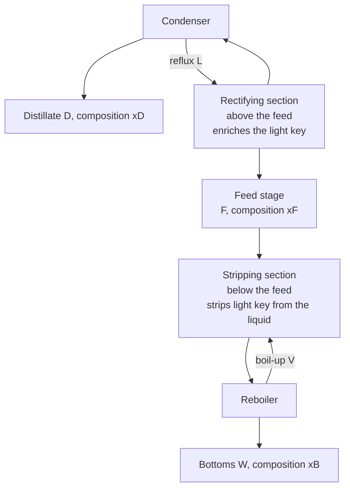

## ビデオ講義

<div class="video-container">
  <iframe
    width="560"
    height="315"
    src="https://www.youtube.com/embed/ANAuU3W1DPw?start=1595"
    title="化学工学物質移動と分離 第3章: 蒸留とマッケーブ・シーレ法"
    frameborder="0"
    allow="accelerometer; autoplay; clipboard-write; encrypted-media; gyroscope; picture-in-picture"
    allowfullscreen>
  </iframe>
</div>

> このビデオは以下のテキストと同じ内容をカバーしています。お好みの学習形式をお選びください。

---

# 第3章：蒸留とマッケーブ・シーレ法

本章は[熱力学第3章](../chemical-engineering-thermodynamics/chapter-3.html)の直接の続きです。あの章は理想的な二成分系の気液平衡を導き、それを 1 つの数値、相対揮発度 $\alpha$ へと凝縮しました。ここではその数値が使われます: それが塔の高さ、還流比、そしてリボイラーの熱負荷になるのです。

**相対揮発度、操作線、そして還流のトレードオフ**

## 学習目標

本章を修了すると、以下ができるようになります:

  * ✅ 揮発性の混合物に対して蒸留（distillation）が既定の分離である理由と、それがエネルギーを大量に消費する理由を説明できる
  * ✅ $\alpha$ 一定の平衡関係を使い、$\alpha$ から蒸留が快適な選択かどうかを判断できる
  * ✅ 濃縮部（rectifying section）、回収部（stripping section）、還流（reflux）、リボイラー（reboiler）、凝縮器（condenser）を見分け、それぞれが何に寄与しているかを述べられる
  * ✅ フェンスケ式（Fenske equation）を適用し、全還流における最小段数を計算できる
  * ✅ 45° 線、平衡曲線、操作線、そして q線からマッケーブ・シーレ線図を作図できる
  * ✅ 飽和液の二成分供給に対して最小還流を計算し、それが支配する設備費とエネルギー費のトレードオフを説明できる

**読了時間**: 20-25分 **コード例**: 1 **演習**: 3

* * *

## 3.1 なぜ蒸留なのか、そしてなぜそれほど高くつくのか

プロセスエンジニアに揮発性成分の液体混合物を分離してほしいと頼めば、最初の答えはほぼつねに**蒸留**です。化学工業と石油工業において、この種の混合物に対する最も一般的な大規模分離です — これは測定されたシェアというよりは工業的な慣行についての言明であり、定性的なままにとどめておく価値があります。蒸留のエネルギー消費量について公表されている推定値は、何を数え上げるかによって大きく異なるからです。

その理由は華やかさこそないものの、揺るぎません。蒸留は**物質分離剤**を必要としません — それ自体を購入し、再生し、廃棄しなければならない溶媒も吸着剤も膜も要りません。使うのは熱であり、熱はどのプラントにもすでに配管で届いています。実験室のカラムから直径 10 メートルの原油蒸留塔まで滑らかにスケールし、その設計手法は 1 世紀の歴史を持ち、十分に検証されています。代替手段 — 抽出、吸着、膜、晶析 — は 1 件ごとに自らの正当性を示さなければならず、だからこそ蒸留が苦戦する場所に現れるのです。

請求書はエネルギーとしてやってきます。[熱力学第1章](../chemical-engineering-thermodynamics/chapter-1.html)は同じことを自身の言葉で述べていました: 塔は供給液を温めるだけではなく、塔底で流れを沸騰させ、塔頂で再び凝縮させることを何度も繰り返します。**還流として戻される液の 1 モルごとが、次のパスでもう一度蒸発させられなければならない**からです。したがって塔内部の蒸気の往来は製品流量の数倍にのぼり、その 1 単位ごとが数百から数千 kJ/kg の潜熱を運びます。ゆえにリボイラーと凝縮器はフローシート上で通常最大のユーティリティ消費者であり、それらを担うハードウェア — [伝熱第3章](../chemical-engineering-heat-transfer/chapter-3.html)のリボイラーと、不凝縮ガスに悩まされる凝縮器 — こそが、運転コストが実際に発生する場所なのです。

2 つの帰結が本章の残りを組み立てます: 還流を減らすものは何であれエネルギー費を直接に減らすということ、そして還流を減らすことは段数を代償とし、段数とは鋼材であるということです。

## 3.2 選り分けの取っ手としての相対揮発度

混合物が沸騰によって分離できるのは、その上にある蒸気が下にある液と異なるからです。**相対揮発度**はまさにそれを測るもので、軽質成分を 1、重質成分を 2 とする二成分系では:

$$ \alpha = \frac{y_1/x_1}{y_2/x_2} $$

理想溶液ではこれは純成分蒸気圧の比 $\alpha = P_1^{sat}/P_2^{sat}$ に帰着します。[熱力学第3章](../chemical-engineering-thermodynamics/chapter-3.html)で導いたとおりです。$\alpha$ が組成範囲にわたっておおよそ一定であるとき — これは化学的に類似した成分について、ほどほどの温度幅の範囲で成り立つそれなりの近似であって、法則ではありません — 平衡関係は 1 つの式に集約されます:

$$ y = \frac{\alpha x}{1 + (\alpha - 1)x} $$

このたった 1 つの式が平衡データの表を置き換え、そのことが塔の手計算をそもそも可能にしています。

**ベンゼン-トルエン**は行儀のよい系の代表例であり、ここで扱う対象です。1 atm でベンゼンは **80.1 °C**、トルエンは **110.6 °C** で沸騰します。熱力学の章では 90 °C における蒸気圧から $\alpha \approx 2.48$ を得ており、その値を本章を通じて用います。$x = 0.4$ でこの式を読むと $y = 0.623$ が返ります: 1 回の平衡接触がベンゼン含有率を 22 パーセントポイント引き上げるのです。

$\alpha$ はどれだけ大きくなければならないのでしょうか。意図的に緩めの経験則を挙げます: **約 1.5 より上であれば、蒸留は概して快適です** — 段数は数十段にとどまり、還流比は 1 桁の小さな値に収まります。おおよそ 1.1 から 1.5 の間ではなお実行可能ですが、塔は高くなり還流は高くつきます。$\alpha$ が 1 に近づくと 2 つの相は互いに近づき、各段はほとんど何も成し遂げず、設計は無限の高さへと発散します。そして $\alpha$ が 1 を横切る**共沸組成**では、どれだけ段を重ねても混合物をその点より先へは動かせません。これらは目安であってしきい値ではありません: 処理量が大きいか蒸気が安ければ、小さなプラントなら決して建てないような低 $\alpha$ の塔も正当化されえます。3.4 節の式は、ある 1 つの純度仕様を固定したとき、$\alpha = 2.48$ で最小段数を約 6.5 段、$\alpha = 1.5$ で約 14.5 段、$\alpha = 1.2$ で約 32 段、$\alpha = 1.05$ で約 121 段と与えます — しかもこれらは*最小*段数であり、有限の還流や段効率の不足に対する余裕を見込む前の値です。

## 3.3 蒸留塔の解剖

蒸留塔とは接触段 — 段（トレイ）、あるいはそれと等価な高さの充填物 — を垂直に積み上げたもので、中ほどで供給を受け、底部に**リボイラー**、頂部に**凝縮器**を備えます。



蒸気は上昇し、液は下降し、各段で平衡に近づくのに十分な時間だけ両者は接触します。段を出る蒸気は後に残る液よりも軽質成分に富んでいるので、接触のたびに組成は望む方向へさらに移動します。

2 つの部分は異なる仕事をします。供給段より上では、**濃縮部**が上昇する蒸気を軽質キー成分に富ませます。その下では、**回収部**が下降する液から軽質キー成分を取り除き、缶出製品をきれいにします。どちらも戻りの流れなしには働きません: 濃縮部にはそこを流れ下る液が必要で、それは**還流** — 凝縮した塔頂液を製品として取り出さずに塔頂へ戻したもの — によって供給されます。回収部にはそこを流れ上る蒸気が必要で、それはリボイラーの**ボイルアップ(缶出蒸気)**によって供給されます。還流のない塔は、配管を余計に付けた 1 台のフラッシュドラムにすぎません。この捉え方が、あらゆる実設計を挟み込む 2 つの極限を浮かび上がらせます。

| 極限 | 還流比 $R$ | 必要な段数 | 製品 | なぜ実現不可能か |
|---|---|---|---|---|
| **全還流** | $\infty$ | **最小** | なし | 凝縮したものはすべて戻され、何も出て行かない |
| **最小還流** | $R_{\min}$ | **無限** | 全量 | 塔が無限に高くなってしまう |

全還流は、どのような塔でも必要となりうる最小の段数を与えます。各段の駆動力が取りうる最大になるからです。最小還流はエネルギーを最小にします。ボイルアップが取りうる最小になるからです — しかしそこでは操作線が平衡曲線に接し、その接点で駆動力が消え、段は**ピンチ**します: 何も変わらない場所に無限個の段が積み上がるのです。実際の塔はその間に位置します。

## 3.4 全還流とフェンスケ式

全還流では物質収支が劇的に単純になります: 製品が抜き出されないので、任意の段から落ちる液はその段へ上ってくる蒸気に等しく、したがって操作線は 45° 線 $y = x$ と一致します。$\alpha$ 一定の平衡関係をそのような $N$ 段にわたって連ねると、式は畳み込まれて、理論段の最小数に対する**フェンスケ式**になります:

$$ N_{\min} = \frac{\ln\!\left[\dfrac{x_D}{1-x_D}\cdot\dfrac{1-x_B}{x_B}\right]}{\ln \alpha} $$

角括弧の中の量は 2 つの**分離比**の比 — 留出液における軽質対重質を、缶出液における軽質対重質で割ったもの — であり、したがってこの式は、その隔たりを埋めるのに $\alpha$ を何回掛ければよいかを数えているのです。

### 例題：全還流におけるベンゼン-トルエン

留出液をベンゼン $x_D = 0.95$、缶出液をベンゼン $x_B = 0.05$ と指定し、$\alpha = 2.48$ とすると:

$$ \frac{x_D}{1-x_D}\cdot\frac{1-x_B}{x_B} = \frac{0.95}{0.05}\times\frac{0.95}{0.05} = 19 \times 19 = 361 $$

$$ N_{\min} = \frac{\ln 361}{\ln 2.48} = \frac{5.89}{0.908} \approx \mathbf{6.5\ \text{theoretical stages}} $$

この数値には 3 つの但し書きが付いて回ります。これは**理論**段を数えており、各段が平衡に達すると仮定していますが、実際の段はそうなりません。**段効率**で割ることによって物理的な段数は膨らみます。また、**リボイラーを 1 段として**数えています。リボイラー自身が 1 つの平衡接触だからです。そして、これは*下限*であって、製品を取り出すいかなる塔にも到達できません。その用途は、スクリーニングのための数値として、また $N_{\min}$ と $R_{\min}$ を併せて実際の段数を推定するショートカット相関の足がかりとしてです。

## 3.5 マッケーブ・シーレ法の作図

**マッケーブ・シーレ法**は、設計を、蒸気組成 $y$ を液組成 $x$ に対してとった 1 枚のプロット（どちらも 0 から 1 まで）の上に描かれる階段へと変えます。その威力は、平衡と物質収支が同じ座標軸の上に 2 本の異なる曲線として現れ、その 2 本を交互に行き来することが*すなわち*塔である、という点にあります。プロットを構成する要素は 4 つです。

**45° 線** $y = x$: 分離が起きない場合の基準線です。その上の点は蒸気と液が同一の組成を持つからです。また $x_D$、$x_F$、$x_B$ の位置を定めるのにも使われます。いずれも 1 つの組成をもつ単一の流れだからです。

**平衡曲線** $y = \alpha x/[1+(\alpha-1)x]$ は 45° 線の上側に膨らみます。任意の $x$ における曲線と線との縦方向の隔たりが、1 つの平衡段がもたらす濃縮です。$\alpha = 2.48$ ではその隔たりは $x = 0.4$ 付近で約 0.22 と最大になり、両端では消えてしまいます — 純度の最後の数パーセントが高くつくのはこのためです。

**濃縮部の操作線。** 塔頂部を囲む物質収支 — 凝縮器と、任意に取った切断面より上のすべての段 — が、その切断面を通って上昇する蒸気と、そこを通って落下する液とを結びつけます。還流比 $R = L/D$（戻される還流を、取り出される留出液で割ったもの）を用い、等モルオーバーフロー（constant molar overflow）を仮定すると、これは直線になります:

$$ y = \frac{R}{R+1}\,x + \frac{x_D}{R+1} $$

[第2章](chapter-2.html)の操作線の論理がそのまま当てはまります。名前が変わるのは流れだけです。その傾き $R/(R+1)$ はつねに 1 より小さく、$R$ が大きくなるにつれて 1 に近づき、一方で切片 $x_D/(R+1)$ は小さくなります。$R$ がいくらであっても線は $(x_D, x_D)$ を通るので、還流を上げることはこの点のまわりで線を**回転**させ、平衡曲線から遠ざけて駆動力を広げることになります。

**q線。** 供給がどのように入るかが、両側の流れの往来を変えます。パラメータ $q$ は、供給 1 モルあたりに回収部へ加えられる飽和液のモル数 — 大まかに言えば、供給が「どれだけ液らしいか」です。**飽和液の供給**では $q = 1$、飽和蒸気では $q = 0$ です。過冷却液は $q > 1$ を、過熱蒸気は $q < 0$ を与えます。q線は 2 本の操作線の交点の軌跡であり、$(x_F, x_F)$ から出発し、傾きは $q/(q-1)$ です。以下で用いる飽和液の場合、その傾きは無限大になります: **q線は $x = x_F$ で垂直**です。

**回収部の操作線**には、それに加えて別の計算は要りません — $(x_B, x_B)$ から、濃縮部の線が q線と出会う点まで引けばよいのです。3 本は 1 点で交わり、そのことが作図を自己無矛盾にしています。

### 段を刻んでいく

1. $(x_D, x_D)$ から始めます: 最上段を出る蒸気の組成は $y = x_D$ です。
2. **水平に平衡曲線まで**移動します — 1 回の平衡接触であり、その蒸気と平衡にある液を求めることです。描かれた 1 ステップが 1 理論段に相当します。
3. **垂直に操作線まで**移動します — 1 つの物質収支であり、1 つ下の段から上ってくる蒸気を求めることです。
4. 階段が q線を通過したところで濃縮部の線から回収部の線へ切り替えながら、これを繰り返します。その切り替え点が**供給段**です。
5. ステップが $x_B$ に達するかそれを下回ったところで止め、ステップ数を数えます: これがリボイラーを含む理論段数です。

2 つの診断が副産物として得られます。ステップは操作線と平衡曲線の隔たりが最大のところで最も大きく、両者が近づくところで小さくなります。ごく小さなステップが並ぶ領域が**ピンチ**であり、還流が最小値に近すぎるところに設定されていることの図的な兆候です。そして操作線が平衡曲線に一度でも*接して*しまえば、有限の階段ではその接点を越えられません。

## 3.6 最小還流と、それが支配するトレードオフ

$\alpha$ 一定の二成分系で供給が飽和液の場合、ピンチは操作線が供給組成のところで平衡曲線と出会う位置に生じ、最小還流比が閉じた形で得られます（この特別な場合に対する**アンダーウッド**の結果）:

$$ R_{\min} = \frac{1}{\alpha - 1}\left[\frac{x_D}{x_F} - \frac{\alpha\,(1-x_D)}{1-x_F}\right] $$

### 例題：ベンゼン-トルエン、飽和液の供給

等モルの供給 $x_F = 0.5$ を取り、$x_D = 0.95$ と $\alpha = 2.48$ は同じとすると:

$$ R_{\min} = \frac{1}{1.48}\left[\frac{0.95}{0.5} - \frac{2.48 \times 0.05}{0.5}\right] = \frac{1}{1.48}\left[1.9 - 0.248\right] \approx \mathbf{1.12} $$

$R = 1.12$ ではこの塔は無限に多くの段を必要とするので、実務では余裕を加えます。長く使われてきた経験則は、経済的最適をおおよそ **$R_{\min}$ の 1.2 倍から 1.5 倍**に置きます — これはその土地の蒸気の価格と鋼材の価格との兼ね合いに敏感であり、現代の最適化研究がこの範囲の外に着地することもある値です。ここで $1.4 \times R_{\min}$ を取ると設計還流比は約 **1.56** となり、これが以下で段を刻む対象のケースです。

| 操作 | 必要な段数 | リボイラーと凝縮器の熱負荷 | コストの種類 |
|---|---|---|---|
| $R$ を上げる | $N_{\min}$ に向かって減少 | ボイルアップにおおよそ従って増加 | 設備費は下がり、エネルギー費は上がる |
| $R$ を $R_{\min}$ に向けて下げる | 増加し、やがて発散 | その下限に向かって減少 | 設備費は上がり、エネルギー費は下がる |

設備費は一度だけ支払われ、エネルギー費はプラントの寿命が尽きるまで毎時間支払われます。この非対称性こそが、塔の還流を数パーセント削るレトロフィットが技術的な注目に値する理由です。

```python
"""McCabe-Thiele stage stepping for a constant-alpha binary.
Benzene-toluene, alpha = 2.48 (Thermodynamics Chapter 3).
Saturated-liquid feed (q = 1), so the q-line is vertical at x = xF.
Constant molar overflow assumed throughout.
"""
import math

ALPHA = 2.48                      # relative volatility, benzene over toluene
xD, xB, xF = 0.95, 0.05, 0.50     # distillate, bottoms, feed compositions
R = 1.56                          # about 1.4 x R_min for this case


def y_eq(x):
    """Equilibrium vapor composition at constant relative volatility."""
    return ALPHA * x / (1.0 + (ALPHA - 1.0) * x)


def x_eq(y):
    """Inverse: liquid in equilibrium with vapor of composition y."""
    return y / (ALPHA - (ALPHA - 1.0) * y)


def fenske(xd, xb, alpha):
    """Minimum theoretical stages at total reflux."""
    return math.log((xd / (1 - xd)) * ((1 - xb) / xb)) / math.log(alpha)


def r_min(xd, xf, alpha):
    """Minimum reflux: binary, constant alpha, saturated-liquid feed."""
    return (1.0 / (alpha - 1.0)) * (xd / xf - alpha * (1 - xd) / (1 - xf))


Nmin, Rmin = fenske(xD, xB, ALPHA), r_min(xD, xF, ALPHA)
print(f"Fenske N_min   = {Nmin:.2f} theoretical stages (total reflux)")
print(f"Minimum reflux = {Rmin:.2f}   ->  1.4 x R_min = {1.4 * Rmin:.2f}")
print(f"Equilibrium check: y(0.40) = {y_eq(0.40):.3f}")

slope_rect = R / (R + 1.0)
icept_rect = xD / (R + 1.0)
y_feed = slope_rect * xF + icept_rect         # q-line is vertical at xF
slope_strip = (y_feed - xB) / (xF - xB)
print(f"\nRectifying: y = {slope_rect:.4f} x + {icept_rect:.4f}")
print(f"Operating lines cross the q-line at ({xF:.2f}, {y_feed:.4f})")
print(f"Stripping:  y = {slope_strip:.4f} (x - {xB}) + {xB}")


def y_op(x):
    """Operating line: rectifying above the feed, stripping below."""
    return slope_rect * x + icept_rect if x >= xF else slope_strip * (x - xB) + xB


print(f"\n{'stage':>5} {'y_op':>8} {'x_eq':>8}  section")
x, stages, feed_stage = xD, 0, None
while x > xB and stages < 100:
    y = x if stages == 0 else y_op(x)   # start on the 45 line at (xD, xD)
    section = "rectifying" if x >= xF else "stripping"
    x = x_eq(y)                        # horizontal step to equilibrium
    stages += 1
    if feed_stage is None and x < xF:
        feed_stage = stages
    print(f"{stages:5d} {y:8.4f} {x:8.4f}  {section}")

print(f"\nTheoretical stages (reboiler included): {stages}")
print(f"Feed stage, counted from the top:       {feed_stage}")
print(f"Ratio to the Fenske minimum:            {stages / Nmin:.2f}")

# Fenske N_min   = 6.48 theoretical stages (total reflux)
# Minimum reflux = 1.12   ->  1.4 x R_min = 1.56
# Equilibrium check: y(0.40) = 0.623
#
# Rectifying: y = 0.6094 x + 0.3711
# Operating lines cross the q-line at (0.50, 0.6758)
# Stripping:  y = 1.3906 (x - 0.05) + 0.05
#
# stage     y_op     x_eq  section
#     1   0.9500   0.8845  rectifying
#     2   0.9101   0.8033  rectifying
#     3   0.8606   0.7134  rectifying
#     4   0.8058   0.6259  rectifying
#     5   0.7525   0.5508  rectifying
#     6   0.7067   0.4928  rectifying
#     7   0.6658   0.4454  stripping
#     8   0.5999   0.3768  stripping
#     9   0.5045   0.2910  stripping
#    10   0.3852   0.2017  stripping
#    11   0.2609   0.1246  stripping
#    12   0.1538   0.0683  stripping
#    13   0.0754   0.0318  stripping
#
# Theoretical stages (reboiler included): 13
# Feed stage, counted from the top:       6
# Ratio to the Fenske minimum:            2.01
```

この階段が、13 行に収まった設計のすべてです。塔はリボイラーを含めて **13 理論段**を必要とし、供給は塔頂から数えて 6 段目に入ります — フェンスケの最小値 6.5 のほぼ **2 倍**です。この比は $1.2$–$1.5 \times R_{\min}$ において十分よく再現するので健全性の確認に使えますが、この種のケースについての観察であって法則ではありません。ステップが小さいのがどこかに注目してください: 供給段をまたぐ 6 段目と 7 段目が組成を最も進めていません。そこで操作線が平衡曲線に最も近く走っているからです。還流を 1.12 に向けて下げれば、段数が爆発するのはまさにその場所です。

## 3.7 本章のまとめ

1. **蒸留**は揮発性の液体混合物に対する既定の分離である — 物質分離剤が不要、スケールがよく効く、手法が成熟している — が、その代償はエネルギーで支払われる。**還流**の 1 モルごとを再び沸騰させなければならないからである
2. **相対揮発度** $\alpha$ が選り分けの取っ手である。$\alpha$ が一定なら平衡曲線は $y = \alpha x/[1+(\alpha-1)x]$ であり、ベンゼン-トルエン（80.1 °C / 110.6 °C）は $\alpha \approx 2.48$ を与える
3. ヘッジを付けた経験則として、$\alpha$ が約 **1.5** を上回れば蒸留は快適である。$\alpha$ が **1** に近ければ非常に高い塔か別の技術が必要になり、$\alpha$ が 1 を横切る共沸組成は、その点より先への蒸留を阻む
4. 塔は供給段より上の**濃縮部**と下の**回収部**からなり、還流を戻す**凝縮器**とボイルアップを供給する**リボイラー**によって閉じられる
5. **全還流**は**フェンスケ式**を通じて最小段数を与える: $x_D = 0.95$、$x_B = 0.05$、$\alpha = 2.48$ では対数の引数が $19 \times 19 = 361$ となり、$N_{\min} = 5.89/0.908 \approx$ **6.5 理論段**である
6. **最小還流**は無限の段数を与える。同じ仕様で飽和液の等モル供給なら、$R_{\min} = (1/1.48)[1.9 - 0.248] \approx$ **1.12** である
7. **マッケーブ・シーレ法**は 45° 線、平衡曲線、濃縮部の線 $y = [R/(R+1)]x + x_D/(R+1)$、**q線**（飽和液では $x_F$ で垂直）、そして回収部の線を組み合わせる。水平のステップが平衡接触、垂直のステップが物質収支である
8. $R \approx 1.56$（$R_{\min}$ の約 $1.4$ 倍）では、例題のケースは供給を 6 段目に置いて **13 理論段**を必要とし、これは $N_{\min}$ のおおよそ 2 倍である。還流を増やせば熱負荷の増大と引き換えに段数が減り、その逆も成り立つ — 設備費は一度、エネルギー費は永遠に

**次章**: 蒸留は沸騰によって分離するので、$\alpha$ が 1 に近づくとき、共沸が道を塞ぐとき、混合物が熱に弱いとき、あるいは供給が希薄すぎて経済的に沸騰させられないときには失敗します。[第4章](chapter-4.html)は、そうした場合に代わって登場する分離 — **抽出、吸着、そして膜** — に目を向けます。いずれも熱ではなく**物質分離剤**の上に築かれており、平衡関係は揮発度ではなく分配関係や吸着等温式になりますが、段を重ねるという論理はそのまま引き継がれます。

## 演習問題

1. **定量 — フェンスケ式と純度の代償**: $\alpha = 2.48$ のベンゼン-トルエン塔が、$x_D = 0.95$、$x_B = 0.05$ から、より厳しい $x_D = 0.99$、$x_B = 0.01$ へと仕様変更される。(a) $N_{\min}$ を計算し、3.4 節の 6.5 段と比較せよ。(b) 次に、元の 0.95/0.05 の仕様を保ったまま、この 2 成分が沸点の近い組で $\alpha = 1.2$ であったと仮定して $N_{\min}$ を計算せよ。(c) 2 つの結果は、設計者がどちらの変数をまず心配すべきかについて何を語っているか。
   *ヒント*: $N_{\min} = \ln[(x_D/(1-x_D))\cdot((1-x_B)/x_B)]/\ln\alpha$ — 純度は対数の内側に入るのに対し、$\alpha$ は分母に座っていることに注意せよ。
   *解答*: (a) 2 つの分離比はいずれも 99 なので、引数は $99 \times 99 = 9801$、$\ln 9801 = 9.19$ となり、$N_{\min} = 9.19/0.908 \approx$ **10.1 段** — 6.5 段からおよそ 3.6 段、おおよそ 56% の増加です。両端を 95% から 99% へ締め上げることは高くつきますが破滅的ではありません。純度が対数の形で効いてくるからです。(b) 引数は 361 のまま変わらないので、$N_{\min} = 5.89/\ln 1.2 = 5.89/0.182 \approx$ **32 段**、同じ製品に対して元の 5 倍です。(c) **揮発度が支配的です。** 純度は対数の内側にあるので、9 が 1 つ増えるごとにおおよそ一定の段数の増分が加わるだけです。$\alpha$ は分母にあるので、それが 1 に近づくにつれて段数は発散します。分離が採算に合わないように見えるとき、最初に問うべきは純度目標を緩められるかどうかではなく、$\alpha$ がいくつであり、それを — 圧力によって、エントレーナーによって、あるいは別の単位操作によって — 変えられるかどうかです。

2. **定量 — 濃縮部の操作線**: ある塔が還流比 $R = 3$ で $x_D = 0.98$ を得ている。(a) 濃縮部の操作線を書き、その傾きと $y$ 切片を示せ。(b) その線が $(x_D, x_D)$ を通ることを確かめ、なぜそうでなければならないかを説明せよ。(c) $R \to \infty$ のとき、そして $R$ が下がるときに傾きと切片に何が起こるかを述べ、それぞれの極限を物理的な運転と結びつけよ。
   *ヒント*: $y = [R/(R+1)]x + x_D/(R+1)$ に $x = x_D$ を代入して整理せよ。
   *解答*: (a) 傾き $= 3/4 =$ **0.75**、切片 $= 0.98/4 =$ **0.245** なので、$y = 0.75x + 0.245$ です。(b) $x = 0.98$ では $0.75 \times 0.98 + 0.245 = 0.735 + 0.245 = 0.98 = x_D$ となります。そうでなければならないのは、凝縮器が 1 つの流れを同一組成の 2 つに分けるからです — 凝縮器に達する蒸気も、取り出される留出液も、戻される還流も、いずれも $x_D$ を担っています — したがって $R$ によらずそこで収支は満たされます。還流を変えると線が $(x_D, x_D)$ のまわりで**回転**するのはこのためです。(c) $R \to \infty$ では傾きが $\to 1$、切片が $\to 0$ となり、線は 45° 線になります。これが**全還流**です — 駆動力は最大、段数は最小、製品はなし。$R$ が下がると傾きは小さくなり切片は上がって、線は**平衡曲線のほうへ**振れ上がります。縦方向の隔たりは縮み、ステップは小さくなり、より多くの段が必要になります。そして $R = R_{\min}$ で線は曲線に接し、段数は発散します。還流を下げると切片が*上がる*ことに注意してください — 線は曲線に近づくのであり、これが「運転は安く、建設は高くつく」ことの図的な言明です。

3. **概念 — なぜ温度が組成を読み取れるのか**: ある塔には段の温度センサーが取り付けられているが、オンラインの組成分析計はなく、運転員はそれらの温度で塔を制御している。(a) 前シリーズの熱力学を用いて、段の温度がその段の組成についての情報を担う理由を説明せよ。(b) この推定はどのような仮定に依拠しており、そのうち運転中に破れうるのはどれか。(c) 制御のために、技術者が塔頂のすぐの段よりも、濃縮部や回収部の途中にある段を好みうるのはなぜか。
   *ヒント*: [熱力学第3章](../chemical-engineering-thermodynamics/chapter-3.html)の、圧力一定における二成分二相系のギブズの相律の数え方を思い出し、T-x-y 曲線が急峻な場所を見よ。
   *解答*: (a) 気液平衡にある二成分系では $F = 2 - 2 + 2 = 2$ です。塔の圧力を固定するとそのうち 1 つが消費され、自由な変数はちょうど **1 つ**残ります。したがって圧力一定のもとでは、段の温度を指定することが液組成を*決定します* — 両者は T-x-y 線図の泡点曲線によって固く結び付けられているのです。ベンゼン-トルエンは純ベンゼンの 80.1 °C から純トルエンの 110.6 °C まで走るので、塔頂から塔底までの温度分布は組成分布を直接に読み出したものであり、安価な熱電対が高価な分析計の代わりを務めます。(b) これは**二成分系**であること（あるいは 2 つのキー成分について擬二成分系として振る舞う混合物であること）、**圧力が既知かつ一定**であること、そして**段の上で平衡が成り立つ**ことを仮定しています。3 つとも破れうるものです: 供給とともに第 3 成分が入ってくれば一対一の対応が壊れます。ファウリング、フラッディング、あるいは凝縮器の熱負荷の変動による圧力変化は、すべての沸騰温度をずらし、実際には何も変わっていなくても推定される組成を動かします。そして飛沫同伴（エントレインメント）やウィーピングは、段を平衡に届かないままにします。圧力補正温度が標準的な部分的対策です。(c) 濃縮部の頂部近くでは組成はすでに $x_D$ に近く、T-x-y 曲線は**平坦**です — 大きな組成変化がほとんど温度変化を生まないので、感度は製品仕様が置かれているまさにその場所で最悪になります。少し下の段は分布が急峻な場所に位置するので、小さな逸脱が測定可能な温度の動きを生み、製品が規格を外れる前に制御系が反応します。この推定のステップ — 測定されていない品質変数を、安価で速く、相関のある測定から推定すること — は[第5章](chapter-5.html)がデータ駆動の**ソフトセンサー**へと展開する考え方であり、そこでは 1 つの段の熱力学的な議論の代わりに、モデルが多数の測定を一度に用いた回帰を担います。
