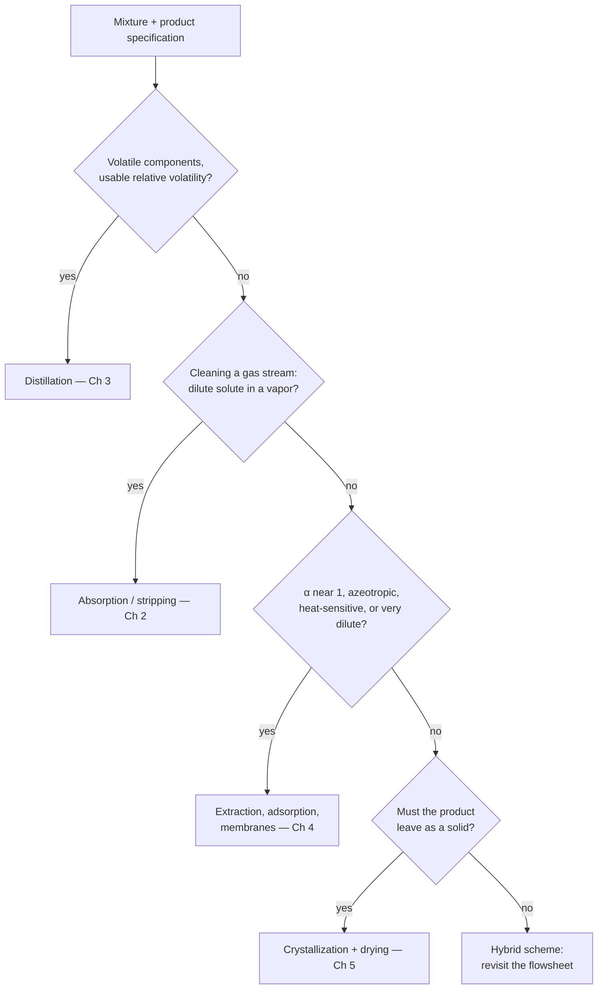

## ビデオ講義

<div class="video-container">
  <iframe
    width="560"
    height="315"
    src="https://www.youtube.com/embed/ANAuU3W1DPw?start=3250"
    title="化学工学物質移動と分離 第5章: 乾燥・晶析と分離プロセスの選定"
    frameborder="0"
    allow="accelerometer; autoplay; clipboard-write; encrypted-media; gyroscope; picture-in-picture"
    allowfullscreen>
  </iframe>
</div>

> このビデオは以下のテキストと同じ内容をカバーしています。お好みの学習形式をお選びください。

---

# 第5章：乾燥・晶析と分離プロセスの選定

ここまでの分離操作は、いずれも流体を手渡してくれました。留出液、ラフィネート、透過液、処理後のガス — どれも注ぐことができます。本章が扱うのは、製品が注げない操作です。そのうえで、第 1 章以来ずっと暗黙のうちに置かれてきた問い — ある混合物が与えられたとき、どの単位操作に手を伸ばし、どのような順序で問いを立てるのか — に答えて、本シリーズを締めくくります。

**固体を生成する単位操作と、フローシートにおける選定の論理**

## 学習目標

本章を修了すると、以下ができるようになります:

  * ✅ 固体を生成する分離が伝熱と物質移動を結合させる理由と、ハンドリングがその費用を支配する理由を説明できる
  * ✅ 相対湿度と湿球温度を解釈し、湿り空気線図が何のためにあるのかを述べられる
  * ✅ 恒率乾燥期間と減率乾燥期間を区別し、それぞれで何が律速となるかを特定できる
  * ✅ 過飽和と準安定域を説明し、核発生と成長が結晶粒径分布をどう定めるかを述べられる
  * ✅ 混合物を蒸留・吸収・抽出・吸着・膜・晶析へと振り分ける、順序立った論理をたどれる
  * ✅ 分離プロセス列が発する日常的な信号と、そのそれぞれが何を推定しているのかを挙げられる

**読了時間**: 20-25分 **コード例**: 1 **演習**: 3

* * *

## 5.1 固体が問題を変える理由

蒸留塔、吸収塔、膜モジュールは、機構こそ大きく異なりますが、1 つの便利な点で一致しています。その内部にあるものは、すべて流れるということです。製品が **固体** になった瞬間に、3 つのことが変わります。

**伝熱と物質移動が分けられなくなります。** 水が湿った固体から離れるのは、それを蒸発させる潜熱が同じ場所へ同じ速度で届いたときだけなので、物質流束は同じ境膜を横切る熱流束に鎖でつながれます。*化学工学伝熱* [第1章](../chemical-engineering-heat-transfer/chapter-1.html) と本シリーズの [第1章](chapter-1.html) を並行する科目として教えることを可能にしていた、きれいな分業が崩れ、1 つの速度式の中に両方の係数が現れます。

**製品の物理的な形態が仕様の一部になります。** 留出液は組成で規定されますが、結晶製品は組成 *に加えて* 結晶粒径分布、晶癖、多形、流動性でも規定されます — これらはいずれも分離装置の内部で決まってしまう性質であり、再溶解させずに下流で直すことはほぼ不可能です。含量規格は満たしたのに、角柱ではなく針状結晶を与えた晶析は失敗です。針状結晶はろ過が遅く、打錠にも向きません。

**ハンドリングが費用を支配します。** 固体はブリッジやアーチを作り、ラットホールを生じ、粒径で偏析し、空気から水分を吸い、そして多くの有機粉体では爆発性の粉じん雲を形成します。乾燥機のまわりのろ過機、コンベア、サイロ、ミル、集じん設備一式のほうが、分離装置そのものよりも費用がかかり、より多くの停止時間を引き起こすことはよくあります。これは広く報告されている経験則として扱ってください。測定された定数ではありません。したがって固体を生成する工程は **できるだけ後段に**、1 回だけ、そして製品の形態がそれを要求するときにだけ置きます。

## 5.2 湿度と湿球の考え方

乾燥では通常、空気をキャリアとして用いるので、ある程度の湿り空気の計算は避けて通れません。実務で使う量は **絶対湿度** $Y$ です — *乾き* 空気 1 kg あたりの水蒸気の kg 数であり、気流が水分を取り込んでも乾き空気は保存されるので、これが理にかなった基準になります — [第2章](chapter-2.html) が高濃度の吸収塔について指摘したのと同じ工夫です。**相対湿度** はおなじみの読み値で、分圧の比です:

$$ \mathcal{H}_R = \frac{p_w}{p_w^{\text{sat}}(T)} \times 100\% $$

空気を有用にしているのは分母です。飽和圧力は温度とともに急激に上昇するので、*水を加えずに* 空気を加熱すると、$p_w$ はそのままに $p_w^{\text{sat}}$ が上がり、相対湿度は一気に下がります。加熱は空気から水分を取り除くのではありません。空気がさらに水分を受け入れる「食欲」を大きくするのです。

ここで、流れている未飽和の空気の中で、温度計の球部を濡らしてみます。ウィック（吸水芯）からの蒸発が、通り過ぎる空気から潜熱を奪うので、球部は冷えます。冷えるにつれて、熱が *流れ込む* 駆動力は大きくなり、蒸発の駆動力は小さくなって、両者が釣り合います:

$$ h\,(T - T_w) = k_y \lambda_w \,(Y_w - Y) $$

この定常の読み値が **湿球温度** $T_w$ です — 伝熱係数と物質移動係数の釣り合いであり、したがって熱力学量ではなく輸送現象の量です。とくに空気–水系では、この 2 つの係数の比が湿り比熱に近い値になるため、$T_w$ は **断熱飽和温度** — 空気が自らの顕熱だけで飽和したときに到達する温度 — とほぼ一致します。これは空気–水系の好都合であって、有機溶媒には一般化できません。

帰結が 2 つあります。湿球降下 $T - T_w$ は、空気がどれだけ水分を欲しがっているかをそのまま読み取らせてくれます。そして、熱い空気にさらされた濡れた表面は、濡れているあいだはずっと **空気温度ではなく $T_w$ にとどまります** — 150 °C の空気が熱に弱い食品を、その表面が乾ききる直前まで、焼くことなく乾燥できるのはこのためです。

**湿り空気線図** は、これらすべてを 1 枚にまとめたものです — 乾球温度に対する絶対湿度を軸に、飽和曲線、等相対湿度線と等湿球温度線、湿り比容、エンタルピーを重ねてあり、その上に *プロセスの経路* をたどることができます。加熱は $Y$ 一定のまま水平に動き、断熱乾燥は湿球温度線に沿って左上へ進み、除湿は左へ進んで飽和に達したのち、その線に沿って下ります。ここでは実物を再掲しません。線図は圧力ごとに固有であり、その読み方は、自分の条件に合った線図を手元に置いて実際に手を動かして学ぶのが最良の技能だからです。

## 5.3 乾燥: 2 つの期間と 2 つの律速段階

熱風中で乾燥している湿った固体の重量を計測し、乾燥速度を **含水率** $X$（絶乾固体 1 kg あたりの水の kg 数）に対してプロットしてみます。この曲線は、ほぼ必ず、屈曲点で隔てられた 2 つの領域を示します。

**恒率乾燥期間** では、液体が蒸発するのと同じ速さで表面へ到達するので、表面は完全に濡れたままであり、自由水のように振る舞います。固体の構造は無関係で、速度は完全にその外側で決まります:

$$ N_c = k_y (Y_w - Y) = \frac{h\,(T - T_w)}{\lambda_w} $$

これらは [第1章](chapter-1.html) と *化学工学伝熱* [第1章](../chemical-engineering-heat-transfer/chapter-1.html) の外部境膜係数そのままです。空気が高温であるほど、乾燥しているほど、流速が高いほど速度は上がり、まったく異なる 2 つの固体がここではほとんど同じに見えることもあります。

**限界含水率** $X_c$ に達すると、液体は取り除かれるのと同じ速さでは表面へ到達できなくなり、速度が落ちます。この **減率乾燥期間** では、律速は固体の *内部* へ移ります。水分は毛管流れによって、マトリックス中の液体拡散によって、あるいは蒸発面が表面より内側へ後退したのちは細孔内の蒸気として移動します。ここでは材料が支配的になり、空気の条件はずっと効きにくくなります — この段階で風速を 2 倍にしてもほとんど得るものはなく、乾燥機を速くしようとする人にとっては高くつく驚きになります。

一般によく用いられる近似では、減率期の速度が平衡を上回って残っている水分に比例するとみなし、指数関数的な減衰を与えます:

$$ X - X_e = (X_c - X_e)\,e^{-k t} \qquad \Longrightarrow \qquad t = \frac{1}{k}\ln\!\frac{X_c - X_e}{X - X_e} $$

教訓は対数の中にあります。時間は水分の過剰分の *比* によって決まるので、さらに半分にするたびに同じだけの時間がかかり、最後の 1% に満たない部分が、通常、最も高くつく水分になります。**平衡含水率** $X_e$ にも注意してください — ある湿度の空気と平衡にある吸湿性の固体は、いくら時間をかけても取り除けない水分を保持します。実在の材料はしばしば 2 つ以上の減率区間を示すので、単一の指数関数は、その材料のデータに照らして検証したうえで使う便宜的なフィッティングであって、法則ではありません。

**乾燥機のギャラリー** を、1 行ずつ:

| 乾燥機 | 動作原理 | 代表的なトレードオフ |
|---|---|---|
| **棚式乾燥機** | 加熱したキャビネット内で、棚に静置した固体を乾燥させる | 小バッチや高付加価値品に対して最も単純で柔軟。人手がかかり、遅く、不均一 |
| **回転乾燥機** | 回転する傾斜ドラムの中で固体が転がり落ち、熱ガスと接触する | 粒状で流動性のよい固体向けの、頑丈な連続処理の主力機。大型で粉じんが出やすく、脆い原料や付着性の原料には不向き |
| **噴霧乾燥機** | 送液可能な原料を熱ガス中に噴霧し、飛行中に数秒で乾燥させる | 液体から流動性のよい粉体まで 1 工程で、粒径も制御可能。塔が大型で、1 kg あたりのエネルギーが大きい |
| **凍結乾燥** | 水を凍結させ、高真空下で昇華させる | 熱に弱い生物製剤で、構造と活性の保持が最良。ただし群を抜いて最も遅く、最も高価 |

最後の列が選定の論理です。この表を下へ降りていくのは、製品がそれを強いるときだけです。

## 5.4 晶析: 駆動力と粒径分布

晶析は 1 工程で分離 *と* 精製の両方を行います。成長する結晶格子が、何を受け入れるかについて選択的だからです — 多くの医薬品・ファインケミカルのプロセスが、蒸留塔ではなく晶析器で終わるのはこのためです。

出発点は **溶解度曲線** $c^*(T)$、すなわち固相と平衡に保たれる濃度です。その傾きの急峻さが戦略を決めます。急な曲線であれば冷却だけで大きな収率が得られますが、ほぼ平坦な曲線（塩化ナトリウムが典型例です）では冷却はほとんど何も達成せず、代わりに溶媒を蒸発させなければなりません。

平衡状態では何も晶析しません。駆動力は **過飽和** であり、$\Delta c = c - c^*$ あるいは比 $S = c/c^*$ として書かれます — いつもと同じ型であり、伝熱で $\Delta T$ が担っていた役割を $\Delta c$ が担っています。しかし過飽和は、ただちに結晶を生むわけではありません。溶解度曲線と、自発的な核発生が始まる点との間にあるのが **準安定域** です。溶液が長時間そこに留まっても核発生せず、それでいて既存の結晶は喜んで成長する帯域です。この帯域こそが、この操作全体の制御ハンドルになります。

  * 準安定域の **内側** で運転し、**種晶** を添加する: 成長は与えた種晶の上で起こり、新しい結晶はほとんど現れず、製品は大きく、均一で、ろ過しやすくなります。
  * 準安定限界を **越えて** 押し込む: **一次核発生** が自発的に起こり、微結晶が大量に発生して、ろ過の遅いスラリーと、ケーク中への大量の母液の残留を招きます。

この駆動力を 2 つのプロセスが分け合っています。**核発生（核化）** が粒子を作り、**成長** がそれを大きくします。どちらも過飽和とともに加速しますが、通常は核発生のほうがはるかに鋭く応答するので、速さを求めて押し込むと、多数の小さな結晶のほうへ天秤が傾きます。**冷却速度が結晶粒径分布を形づくる** のはこのためです。速く冷やせば、過飽和は結晶がそれを消費する能力を追い越し、準安定限界を突き破ります。準安定域の内側に留まるプロファイルに沿ってゆっくり冷やせば、既存の表面が、生成するのと同じ速さでそれを消費します。うまく運転された回分晶析では、一般に非線形のプロファイルが用いられ — 結晶表面がまだ少ない初期は穏やかに、後半は速く — 定められた温度で種晶添加が行われます。撹拌翼や壁との衝突によって結晶が破片を放出する **二次核発生** は、工業的な撹拌槽ではしばしば支配的であり、撹拌翼の回転数を、混合の変数であると同時に粒径分布の変数にしています。

そこから 2 つの構成が導かれます。**回分冷却晶析器** は、急な溶解度曲線、中程度の生産量、高付加価値の製品に適しており、温度プロファイルと種晶添加点を直接に制御できます — 医薬品の実務でこれが主流である理由がこれです — が、その代償としてバッチ間のばらつきと待機時間が生じます。**蒸発晶析器** は平坦な曲線と汎用品のトン数に適しており、良好なエネルギー経済性で連続運転できますが、粒径の制御は直接的でなく、加熱面での **スケーリング** が慢性的な問題になります。このスケーリングは、*化学工学伝熱* [第5章](../chemical-engineering-heat-transfer/chapter-5.html) の汚れが晶析器の顔をして現れたものであり、あの章の監視の考え方はそのまま移せます。日常の測定値から係数を逆算し、トレンドを取り、洗浄をカレンダーではなく費用のバランスに照らしてスケジューリングすることです。

## 5.5 分離プロセスの選定

ここが、本シリーズが積み上げてきた到達点です。混合物と仕様が与えられている。ではどの単位操作を選ぶのか。

選定は最適化ではなくスクリーニングの作業です。実現不可能な選択肢を安上がりに切り捨て、2〜3 個を残し、それらをきちんと見積もる。ただしそのスクリーニングには信頼できる順序があります。これらの操作は、成熟度、スケール、kg あたりの費用が大きく異なるからです。



| # | 問い | はいの場合 | ここで問う理由 |
|---|---|---|---|
| 1 | 揮発性があり熱的に安定な成分で、使える相対揮発度があるか？ | **蒸留**（[第3章](chapter-3.html)） | 既定の選択肢です。溶媒を追加せず、1 つの塔の中で段数に制限がなく、1 世紀の経験があります。スクリーニングのしきい値としてしばしば引用されるのは $\alpha \gtrsim 1.2$–$1.5$ で、それを下回ると段数と還流が急速に膨らみます。 |
| 2 | *気体から* 希薄な溶質を除去するのか？ | **吸収 / 放散**（[第2章](chapter-2.html)） | キャリアを凝縮させるわけにはいかないので、向流接触装置がいかなるバルクの相変化にも勝ります。対となる放散塔は後付けではなく、設計の一部です。 |
| 3 | $\alpha$ が 1 に近い、共沸、熱に弱い原料、あるいは非常に希薄な液相の目的成分か？ | **抽出・吸着・膜**（[第4章](chapter-4.html)） | それぞれが蒸留の特定の失敗様式を打ち破ります — 揮発度の代わりに親和性、非常に低い残留濃度までのスカベンジング、相変化を伴わない分離 — そしてそれぞれが負担を持ち込みます。溶媒回収、再生、ファウリングです。 |
| 4 | 製品は精製された固体、あるいは乾燥粉体として出さなければならないか？ | **晶析、続いてろ過と乾燥**（本章） | 熱負荷の面で塔に勝るからではなく、仕様が固体だから選ばれます。1 パスあたりの純度が高く、要求される形態が得られます — 固体ハンドリングの一式が付いてくることを含めて。 |
| 5 | どれもきれいに当てはまらない、あるいはどの選択肢も採算に合わない。 | **ハイブリッド、あるいはフローシートの変更** | 反応蒸留、抽出蒸留、共沸蒸留、膜と蒸留のハイブリッド、バルク処理の後段に置く吸着による仕上げ。そして、得られる答えのうち最も価値のあるもの — 反応、溶媒、あるいは仕様そのものを変えることです。 |

生き残った候補を、さらに 3 つの二次スクリーンが絞り込みます。**スケール**: kg あたりの費用は桁で変わります — クロマトグラフィーや凍結乾燥は kg スケールでは合理的でも、キロトンスケールでは不合理であり、蒸留はその逆です。**エネルギー**: 蒸留の優位性には大きな請求書が伴い、製油や大量生産化学品におけるプロセスエネルギーのかなりの割合を占めると一般に言われています — 公表されている推計値は、何を数えるかによって大きく幅があるので、いかなる数値も設計文書に入れる前に最新の出典で確認してください。この請求書こそ、膜と吸着が希薄な系や低 $\alpha$ の用途で着実に地歩を広げている理由です。**位置づけ**: バルクの分離はそれができる最も安価な操作で行い、そのうえで仕上げをします。バルク処理を任された膜は、高価にされた誤った道具です。同じ装置でも、塔の後段に置いて最後の数パーセントを担わせれば、しばしばプロセス列の中で最も安価な要素になります。

## 5.6 デジタルの層

分離プロセス列は、構造的な理由から、データに関して異例なほど気前がよいのです。知りたい量である組成は、遅く、高価に、そしてしばしばオフラインで測定されるのに対し、それと相関する量は連続的に、ほぼ無料で測定されています。以下はいずれも、*化学工学伝熱* [第5章](../chemical-engineering-heat-transfer/chapter-5.html) の意味での **ソフトセンサー** です。

**組成の代理としての塔の温度プロファイル。** 圧力が一定なら、段の温度は段の組成と結びついています — [第3章](chapter-3.html) で予告した推定です。温度フロントの垂直方向の位置を追跡すれば、分析室の測定値が返ってくるずっと前に、分離がどこで起きているのかが分かります。これは圧力が一定のときにのみ成り立ち、温度が組成を区別しなくなる共沸点の近くでは精度が落ちます。

**水力学とファウリングの指標としての圧力損失。** 塔では、処理量一定のもとで $\Delta P$ が上昇していくのは **フラッディング** への典型的な接近を意味し、逆に低下していくときは、漏液（ウィーピング）や内部部品の脱落を示していることがあります。膜スキッドでは、流束と $\Delta P$ の関係が、可逆的な濃度分極を不可逆的なファウリングから切り分け、洗浄サイクルのスケジュールを決めます。

**終点検出器としての乾燥曲線。** バッチの終了判断は、たいていうまくいっていません。早すぎれば含水率が規格外になる危険を冒し、遅すぎれば、すでに規格を下回っている水分のために何時間も燃料を燃やすことになります。バッチが進行するにつれて減率期の減衰をフィッティングしていけば、終点は予測に変わります。

```python
import numpy as np

# ---------------------------------------------------------------------------
# ILLUSTRATIVE SYNTHETIC DATA -- generated for teaching, not measured on any
# real dryer. Moisture content X [kg water / kg dry solid] during the falling-
# rate period, t [h] measured from the critical moisture point.
# ---------------------------------------------------------------------------
t_data = np.array([0.0, 1.0, 2.0, 3.0, 4.0, 5.0, 6.0])
X_data = np.array([0.250, 0.184, 0.132, 0.101, 0.075, 0.061, 0.047])

X_EQ = 0.02      # equilibrium moisture at the drying air's humidity
X_TARGET = 0.05  # product specification

# Model: X - Xe = (X0 - Xe) exp(-k t)  ->  ln(X - Xe) is linear in t
slope, intercept = np.polyfit(t_data, np.log(X_data - X_EQ), 1)
k = -slope
X0 = np.exp(intercept) + X_EQ


def time_to(x_target, k=k, x0=X0, x_eq=X_EQ):
    """Hours of falling-rate drying needed to reach x_target."""
    return -np.log((x_target - x_eq) / (x0 - x_eq)) / k


print(f"fitted rate constant k = {k:.3f} 1/h")
print(f"fitted intercept   X0 = {X0:.3f} kg/kg dry")
print()
print(f"{'t [h]':>6} {'X data':>8} {'X fit':>8}")
for t, x in zip(t_data, X_data):
    print(f"{t:6.1f} {x:8.3f} {X_EQ + (X0 - X_EQ) * np.exp(-k * t):8.3f}")
print()
print(f"time to reach X = {X_TARGET:.2f} kg/kg : {time_to(X_TARGET):.2f} h")
print(f"  0.25 -> 0.10 kg/kg (removes 0.15): {time_to(0.10):.2f} h")
print(f"  0.05 -> 0.03 kg/kg (removes 0.02): {time_to(0.03) - time_to(0.05):.2f} h")

# fitted rate constant k = 0.354 1/h
# fitted intercept   X0 = 0.251 kg/kg dry
#
#  t [h]   X data    X fit
#    0.0    0.250    0.251
#    1.0    0.184    0.182
#    2.0    0.132    0.134
#    3.0    0.101    0.100
#    4.0    0.075    0.076
#    5.0    0.061    0.059
#    6.0    0.047    0.048
#
# time to reach X = 0.05 kg/kg : 5.77 h
#   0.25 -> 0.10 kg/kg (removes 0.15): 3.00 h
#   0.05 -> 0.03 kg/kg (removes 0.02): 3.10 h
```

最後の 2 行を並べて読んでください。減率乾燥期間の初めに 0.15 kg/kg を除去するには 3.00 時間かかり、終わりに 0.02 kg/kg を除去するには 3.10 時間かかります — 水の量は 7 分の 1 にも満たないのに、わずかに *長い* のです。これは 5.3 節の対数を具体的な形にしたものであり、含水率の目標を保守的に低く置くのではなく、しっかりと根拠づけて定めるべきだという、あらゆる主張の背後にある算術です。

これを正直なものに保つために、注意が 2 つあります。フィッティングされた $k$ は材料物性ではありません — 空気の温度、湿度、風速、そして層の形状を内に抱えており、そのどれかが変われば再フィッティングしなければなりません。そしてこの答えは、最後のデータ点よりも先へ外挿しています。2 つ目の減率区間を持つ固体は、このフィッティングが予測するよりも遅く乾きます。だからこそ、この当てはめは最初に一度だけ信用するのではなく、バッチの進行に合わせて更新するのです。

前のシリーズが最後に述べた戒めは、ここにも当てはまります。終点を予測したり組成を推定したりするモデルは、物理の *内側* で最適化しているのであって、最小溶媒量を定める平衡も、最小還流比を定める相対揮発度も、乾燥の下限を定める平衡含水率も、無効にはできません。ソフトウェアは天井の下で最良の点を見つけるだけであり、天井そのものを動かせるのはフローシートの変更だけです。これらすべての上に築かれる計装と制御の層については、*プロセスモニタリング・制御入門* シリーズ（[シリーズ目次](../process-monitoring-control-introduction/index.html)）が自然な続きになります。

## 5.7 シリーズのまとめ

5 つの章を、1 章 1 文で。**第 1 章** は拡散と物質移動係数を組み立て、境膜抵抗が直列に足し合わされることを示しました。**第 2 章** は、その係数をガス吸収で働かせました。平衡が最小溶媒量を定め、段の積み重ねが塔高を定める世界です。**第 3 章** は、相対揮発度から段、還流、そして経済的な最小値へと蒸留を展開しました。**第 4 章** は、低 $\alpha$、共沸、熱に弱い系、希薄な系で蒸留が破綻するがゆえに存在する代替手段を扱いました。**第 5 章** は、固体を生成する単位操作を加え、その全体を選定の論理へとまとめ上げました。

本シリーズをもって、**輸送現象の三部作が完成** します。*化学工学流体力学* は速度勾配によって駆動される運動量を、*化学工学伝熱* は温度差によって駆動されるエネルギーを、そして本シリーズは濃度差によって駆動される物質を扱いました。3 つの科目、3 組の装置、3 つの語彙 — そしてその下にある 1 つの型が、*化学工学入門* [第1章](../chemical-engineering-introduction/chapter-1.html) の輸送現象の対応表です:

$$ \text{流束} = \text{係数} \times \text{駆動力} $$

いま読み終えたすべての章で、境膜係数、直列の抵抗、対数平均の駆動力、そして駆動力が消えていく壁が繰り返し現れたのは、これが理由です。既視感があったとすれば、それは繰り返しではありませんでした — 輸送現象の構造が、その仕事をしていたのです。

古典的な基礎の流れに残っているのは、組成が分離によってではなく意図的に変わる段階です。すなわち **反応工学** — 速度式、反応器の形式、滞留時間分布、そして発熱と転化率・安定性との結合です。そのシリーズは公開されました: [化学工学反応工学](../chemical-engineering-reaction-engineering/index.html) が反応速度式、反応器、滞留時間分布、発熱と転化率・安定性の結び付きを扱います。あわせて、これらの分離が置かれるフローシートについては *化学工学入門* へ、それらすべてが依拠する相平衡モデルについては *化学工学熱力学* へ、そして三部作の残る 2 つについては *化学工学流体力学* と *化学工学伝熱* へどうぞ。

最後までお読みいただきありがとうございました。

## 演習問題

1. **概念 — 空気を読む**: 湿球温度 30 °C の 60 °C の空気を、湿ったろ過ケークを載せた棚の上に吹き付けます。(a) 完全に濡れているあいだ、*ケークの表面* は何 °C にとどまり、それはなぜ 60 °C ではないのですか。(b) 同じ空気を、水を加えずに 90 °C まで加熱します。その絶対湿度、相対湿度、湿球温度に何が起こるかを述べ、そもそもなぜ加熱が役に立つのかを説明しなさい。(c) その後、表面温度が空気温度へ向かって上がり始めました。固体の内部で何が起きたのですか。また、さらに風速を上げたときに何が期待できますか。
   *ヒント*: $h(T - T_w) = k_y \lambda_w (Y_w - Y)$ から出発し、加熱が実際に変える量はどれかを問うこと。
   *解答*: (a) **約 30 °C — 湿球温度です。** 完全に濡れた表面は、空気から顕熱を得るのと同じ速さで蒸発によって潜熱を失い、その釣り合いが表面を $T_w$ に固定します — 熱に弱い材料でも、恒率乾燥期間であれば熱風で安全に乾かせるのはこのためです。(b) **絶対湿度は変わりません**。加熱は水を加えないからです。**相対湿度は大きく下がります**。$p_w$ が固定されたまま $p_w^{\text{sat}}(T)$ が急激に上昇するからです。**湿球温度は上がります** が、乾球側の 30 K の加熱に比べればはるかに小さい上昇なので、湿球 *降下* は大きくなります。加熱は水分を取り除くのではなく、空気が水分を受け入れる能力を大きくし、それによって釣り合いの中の両方の駆動力を、ひいては恒率期の流束を高めます。(c) 水分が **限界含水率** を割り込み、**減率乾燥期間** に入ったのです。蒸発面が固体の内部へ後退し、いまや内部の移動が律速になっています。蒸発冷却が弱まるので表面は空気温度へ近づいていきます — 熱に弱い製品が危うくなるのは、まさにこの瞬間です。風速を上げてもほとんど **効果はありません**。風速が作用するのは、もはや速度を決めていない外部境膜係数だからです。しかも、乾いてきた表面を過熱する危険は高まります。

2. **定量 — フィッティングした定数からの乾燥時間**: 同じ固体の 2 バッチ目を、同じ空気条件のもとで乾燥させます。したがって 5.6 節でフィッティングした定数 $k = 0.354$ h⁻¹ と $X_e = 0.02$ kg/kg dry をそのまま使えます。このバッチは $X_c = 0.30$ で減率乾燥期間に入り、0.06 kg/kg dry まで到達させなければなりません。(a) 減率期の所要時間を見積もりなさい。(b) 顧客が仕様を 0.04 kg/kg dry まで厳しくしました — どれだけ余分に時間がかかり、それは (a) と比べてどうですか。(c) この見積もりが実際には外れうる理由を 3 つ挙げなさい。
   *ヒント*: $t = \frac{1}{k}\ln\frac{X_c - X_e}{X - X_e}$ を使うこと。(b) では、そのような時間 2 つの差を取ること。
   *解答*: (a) $t = \frac{1}{0.354}\ln\frac{0.28}{0.04} = \frac{\ln 7}{0.354} = \frac{1.946}{0.354} \approx \mathbf{5.5\ h}$。(b) 0.04 までなら $t = \frac{\ln 14}{0.354} = \frac{2.639}{0.354} \approx 7.5$ h なので、余分にかかるのは $\approx \mathbf{2.0\ h}$ — すでに 5.5 時間かけて 0.24 を除去したうえで、さらに 0.02 kg/kg を除去するために **バッチが 36% 長くなる** ということです。これが 5.3 節の対数のペナルティを商業的な言葉に置き換えたものであり、厳しくされた含水率仕様を既定で受け入れるのではなく、問い直すべき強い論拠になります。さらに、0.04 は $X_e$ のわずか 2 倍にすぎないので、これ以上厳しくすると、所要時間が発散する平衡の下限に突き当たることにも注意してください。(c) 次のうち任意の 3 つ: **$k$ は材料定数ではない** — 空気の温度、湿度、風速、層の形状を内に抱えているので、乾燥機への仕込み量が変わればそれだけで無効になります。**多くの固体は 2 つ以上の減率区間を示す** ので、初期のデータに当てはめた単一の指数関数は、低い目標値までの時間を過小に予測します。**$X_e$ 自身が空気の湿度と温度に依存する** ため、その誤差は $X$ が $X_e$ に近づくにつれて対数の中で激烈に増幅されます。そしてこれは減率期の時間だけであり、バッチ時間としては昇温期間と恒率乾燥期間を加えなければなりません。

3. **選定 — 3 つの流れを振り分ける**: 5.5 節のチェックリストを、それぞれに順番どおり適用しなさい。スクリーニングで残す操作、それを扱う章、そしてその選択が持ち込む負担を 1 つ挙げること。(a) 50 °C の排ガス 200 000 Nm³/h で、約 8% の CO₂ を含み、約 1% まで低減する。(b) 熱に不安定な抗生物質を 3% 含む発酵液で、粒径を制御した乾燥結晶粉体として供給しなければならない。(c) 対象範囲全体で $\alpha \approx 1.05$ の 2 成分有機混合物、50 t/h、両製品とも純度 99.5%。
   *ヒント*: 答えが明らかに「いいえ」であっても、問い 1 は必ず問うこと — 「いいえ」である理由こそが設計上の制約です。
   *解答*: (a) 問い 1 は不成立です。バルクのキャリアが、まともな費用ではおよそ凝縮させられない永久ガスだからです。問い 2 は「はい」で、蒸気キャリア中の希薄な溶質にあたるので、**化学溶媒による吸収**（[第2章](chapter-2.html)）をスクリーニングで残します。負担は対となる **放散塔** であり、エネルギーと運転費用はそこにあります。この流量では吸収塔の直径がフラッディングで決まるので、塔は非常に大きくなります。スイングサイクルの吸着も、見積もる価値のある第 2 の候補として正当です。(b) 問い 1 は熱安定性で不成立、問い 2 は該当しません。問い 3 は部分的に「はい」です — 希薄で熱に弱い水溶液中の溶質は、*濃縮* 工程としての抽出、吸着、膜に適します。しかし決め手は問い 4 です。仕様が **粒径を制御した乾燥結晶粉体** なので、プロセス列は **晶析＋ろ過＋乾燥**（本章）で終わり、その前段には発酵液を濃縮する膜または吸着の工程が置かれる可能性が高いでしょう。負担は 5.1 節の固体ハンドリング一式と、とりわけ粒径分布です — 制御されたプロファイルに沿った種晶添加つきの回分冷却晶析を行い、乾燥機は熱への弱さを踏まえて選定します（活性がそれを要求するなら、費用を受け入れて凍結乾燥を選びます）。(c) 成分は確かに揮発性で安定ですが、$\alpha \approx 1.05$ はスクリーニングの目安 $\alpha \gtrsim 1.2$–$1.5$ をはるかに下回るので、通常の塔では非常に多くの段が必要になり、還流も全還流に近づいて、生涯費用をエネルギーが支配します。問い 3 が低 $\alpha$ の基準で「はい」となるので、**ハイブリッド** をスクリーニングで残します。バルクの分離は蒸留で行い、難しい側に **膜ユニット** を置くか、揮発度をずらす **エントレーナ** を用いた抽出的な方式を採ります（[第4章](chapter-4.html)。バルクの負荷は依然として [第3章](chapter-3.html) が担います）。負担は次のとおりです。膜はファウリング、モジュール交換、そして 50 t/h に見合うよう積み上げねばならないモジュールあたりの控えめな処理能力を伴います。エントレーナは、それ自身の回収塔を伴います。この処理量では、正直な最初の一手は問い 5 です — 上流の化学、あるいは 99.5% という仕様を変えられないかを問うこと。$\alpha = 1.05$ では、プラントを規定しているのは反応ではなく分離だからです。
