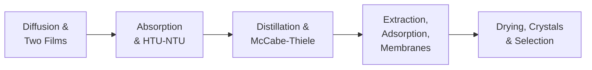

## ビデオ講義

  <iframe
    width="560"
    height="315"
    src="https://www.youtube.com/embed/ANAuU3W1DPw"
    title="化学工学物質移動と分離 - 全章"
    frameborder="0"
    allow="accelerometer; autoplay; clipboard-write; encrypted-media; gyroscope; picture-in-picture"
    allowfullscreen>
  </iframe>

> シリーズ全体を1本の動画にまとめています。各章ページのビデオは、その章の頭から再生されます。

---

# 化学工学物質移動と分離

**拡散、蒸留、そしてフローシートを規定する分離操作**

フローシートの大部分は分離装置であり、プラントのエネルギー費用の多くもそこで支払われています。本コースは、化学工学カリキュラムにおける輸送現象の流れを完成させるものです — 運動量移動が最初にあり、伝熱がその 2 番目、そして物質移動が今、三者を締めくくります — そのうえで、工業実務を支配する分離操作にわたって理論を実際に働かせます。

## シリーズ概要

1. **拡散する** — フィックの法則、二重境膜モデル、そして物質移動係数
2. **吸収する** — 操作線、ピンチ、そして HTU-NTU 法
3. **蒸留する** — 相対揮発度、McCabe-Thiele 法、そして還流のトレードオフ
4. **抽出する** — 蒸留では手が届かないときの抽出・吸着・膜分離
5. **固める** — 乾燥、晶析、そしてフローシートにおける選定の論理

## 各章の内容

| 章 | タイトル | 学べること |
|---------|-------|---------------------|
| 1 | [拡散と物質移動係数](chapter-1.html) | フィックの法則、拡散係数の大きさ、二重境膜モデル、ガス境膜支配と液境膜支配 |
| 2 | [吸収、ストリッピング、そして移動単位](chapter-2.html) | 操作線と平衡線、最小液流量、HTU-NTU によるサイジング、トレイと充填物 |
| 3 | [蒸留と McCabe-Thiele 法](chapter-3.html) | 相対揮発度、Fenske の最小段数、操作線、最小還流比、設備費とエネルギーのトレードオフ |
| 4 | [抽出、吸着、そして膜分離](chapter-4.html) | 抽出因子と多段化、Langmuir 型等温線と破過、膜の選択性 |
| 5 | [乾燥、晶析、そして分離操作の選定](chapter-5.html) | 湿球温度と乾燥期間、過飽和、分離操作の選定、デジタルの層 |

## 本シリーズの対象読者

- **学生** — 流体力学シリーズと伝熱シリーズからの輸送現象の流れを、分離操作へと進める方
- **エンジニア・研究者** — 塔をサイジングし、溶媒を選定し、あるいは乾燥機や晶析装置のトラブルシューティングを行う立場にある方
- **データサイエンティスト** — 塔の温度プロファイルや乾燥曲線を扱っており、その信号の背後にある物理を知りたい方

推奨される予備知識: 化学工学入門と流体力学。本コースが土台とする気液平衡は熱力学シリーズが、本コースが写し取る境膜係数の論理は伝熱シリーズが提供します。数学は代数の範囲にとどまり、いくつかの計算例が加わります。

## 関連シリーズ

**化学工学入門**、**化学工学熱力学**、**化学工学流体力学**、**化学工学伝熱** とともに、古典的な基礎のトラックを構成します。**化学工学反応工学** がトラックを完結させます。データ駆動の姉妹シリーズは **プロセス・インフォマティクス入門** と **プロセスモニタリング・制御入門** です。
