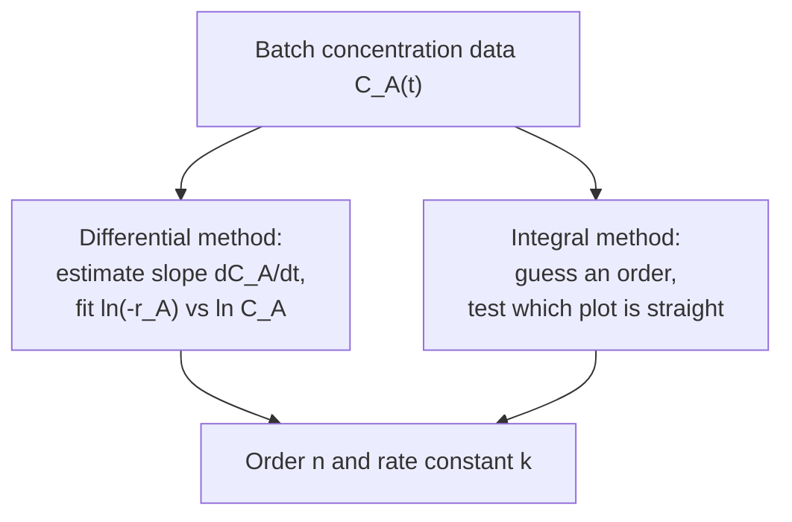

## ビデオ講義

<div class="video-container">
  <iframe
    width="560"
    height="315"
    src="https://www.youtube.com/embed/GIrdjPDTjwY"
    title="化学工学反応工学 第1章: 反応速度式とアレニウス式"
    frameborder="0"
    allow="accelerometer; autoplay; clipboard-write; encrypted-media; gyroscope; picture-in-picture"
    allowfullscreen>
  </iframe>
</div>

> このビデオは以下のテキストと同じ内容をカバーしています。お好みの学習形式をお選びください。

---

# 第1章：反応速度式とアレニウス式

本章は、あらゆる反応器がその周りでサイジングされる量 — 分子が正体を変える速さ — から反応工学シリーズを始め、容器を描く前にエンジニアが知っておかねばならない 2 つのこと、すなわち速度が濃度にどう依存するか、そして温度にどれほど激しく依存するかを扱います。

**どれだけ速く、何次で、そしてなぜ温度がすべてを支配するのか**

## 学習目標

本章を修了すると、以下ができるようになります:

  * ✅ 熱力学の問い（どこまで）と速度論の問い（どれだけ速く）を分離し、両方が必要な理由を説明できる
  * ✅ 速度の定義とべき乗則型の反応速度式を書き、反応次数が量論的ではなく経験的である理由を述べられる
  * ✅ 定容の回分反応器について、0 次・1 次・2 次の積分形反応速度式を適用できる
  * ✅ 1 次の半減期だけが濃度に依存しない理由を説明できる
  * ✅ 微分法と積分法を用いて、回分データから反応次数を決定できる
  * ✅ アレニウス式を定量的に使い、$\ln k$ を $1/T$ に対してプロットした図から $E_a$ を読み取れる

**読了時間**: 20-25分 **コード例**: 1 **演習**: 3

* * *

## 1.1 速度論は反応器の法である

[入門シリーズ第2章](../chemical-engineering-introduction/chapter-2.html)は、反応器を一度に描き切りました: 転化率、選択率、収率、べき乗則型の反応速度式、3 つの理想的な容器、そして温度がオペレータの持つ最も強力かつ最も危険なつまみであるという観察です。あれは地図でした。本シリーズはその実地 — プロセスエンジニアが反応器をサイジングし、その運転点を選び、そしてそこに留まるかどうかを判断するために実際に使う道具立てです。

反応工学のすべては 2 つの主題の間の分業の上に成り立っており、この 2 つを混同することは初学者が犯しうる最も高くつく誤りです。

| 問い | 主題 | 与えてくれるもの |
|---|---|---|
| **どこまで？** | 熱力学 | 平衡組成 — どんな触媒も引き上げられない天井 |
| **どれだけ速く？** | 速度論 | 速度 — その天井に近づくのにどれだけの反応器体積と時間がかかるか |

[化学工学熱力学](../chemical-engineering-thermodynamics/index.html)シリーズが第 1 の問いを扱い、とりわけ[その第4章](../chemical-engineering-thermodynamics/chapter-4.html)がギブズエネルギーを、転化率に上限を与える平衡定数へと変えます。**熱力学は許可証であって、日程表ではありません。** 平衡が圧倒的に有利な反応でも、測定できないほど遅いことがありえます — ダイヤモンドから黒鉛への転化は室温で熱力学的には下り坂ですが、誰の宝飾品も危険にさらされてはいません。逆に、平衡の悪い速い反応は、その低い天井に素早く達してそこで止まり、反応器がどれほど長くてもそれ以上進みません。

この 2 つはまた、**互いにトレードオフの関係にあります**。発熱反応では、温度を上げると速度は倍加しますが平衡転化率は*下がる*ので、最適な運転温度は最大値ではなく妥協点になります — アンモニア合成が標準的な例です。本章はその議論の速度論の側だけを組み立てます。[第5章](chapter-5.html)が熱効果のもとで両者を突き合わせます。

反応器の周りには、輸送の三者が展開した物理が控えています: 流体が容器の中をどう動くかについては[流体力学](../chemical-engineering-fluid-mechanics/chapter-1.html)、反応熱を除去できるかどうかについては[伝熱](../chemical-engineering-heat-transfer/chapter-1.html)、そして反応物がそもそも触媒表面に到達できるかどうかについては[物質移動](../chemical-engineering-mass-transfer/chapter-1.html)です。反応工学とは、その真ん中で起こることです。

本章は反応速度式そのものを組み立てます。[第2章](chapter-2.html)はそれを**理想反応器** — 回分反応器、CSTR（連続槽型反応器）、PFR（押出流れ反応器） — に入れ、それらの設計方程式を導きます。[第3章](chapter-3.html)は**複数反応と選択率**を扱い、そこでは反応速度式が競争になります。[第4章](chapter-4.html)は**滞留時間分布**、すなわち完全混合でも完全な押出流れでもない現実の容器のための道具を扱います。[第5章](chapter-5.html)は**熱効果、熱的安定性、そしてスケールアップ**で締めくくります。

## 1.2 速度、反応速度式、そして次数の罠

**反応速度**は単位体積あたりで定義されます。容器全体について引用された速度は、他へ持ち運べる情報を何も伝えないからです。体積 $V$ の閉じた容器の中に $n_A$ モルを保持している化学種 $A$ について、

$$ r_A = \frac{1}{V} \frac{dn_A}{dt} $$

$dn_A/dt$ は単純に「$A$ のモル数がどれだけ速く変化しているか」と読んでください。$V$ で割ることで、単位が mol/(m³·s)、あるいは実験室でより一般的な mol/(L·s) の示強的な量が得られ、それは 1 L のフラスコでも 200 m³ の容器でも同じことを意味します。反応物では $n_A$ が減るので $r_A$ は負になります。したがってエンジニアは通常、正の数である**消費速度** $-r_A$ を使って作業します。異なる化学種の速度は量論によって結びついています — $A + 2B \rightarrow P$ では $B$ は $A$ の 2 倍の速さで消えます — ので、化学種を明示せずに速度を引用することは、2 倍の誤差のよくある原因です。

定容のもとで — 液相の回分反応器が標準的なケースです — $n_A/V$ はまさに濃度 $C_A$ であり、定義は本章の残りで使う形へと単純化されます:

$$ -r_A = -\frac{dC_A}{dt} $$

**反応速度式**とは、その速度と組成との間の代数的な関係です。主力となる形が**べき乗則**です:

$$ -r_A = k \, C_A^{a} \, C_B^{b} $$

ここで $k$ は**速度定数**（その単位は下に示すとおり反応次数に依存します）、$a$ は $A$ に関する次数、$b$ は $B$ に関する次数、そして $a + b$ が**総括次数**です。

さて、どの速度論の講義も繰り返す注意です。どの速度論の講義もそうせざるをえないからです:

> **反応次数は実験的に決定される。量論係数から読み取るものではない。**

反応 $A + 2B \rightarrow P$ は $-r_A = k C_A C_B^2$ を意味*しません*。$A$ について 1 次で $B$ について 0 次かもしれませんし、総括で 1.5 次かもしれませんし、そもそもべき乗則ではないかもしれません。釣り合った反応式は、何が入って何が出るかについての会計上の記述であるのに対し、速度は実際の分子的な連鎖における**最も遅い素反応段階**によって決まります — そしてその連鎖は釣り合った反応式からは見えません。

ここから、1 つの重要な例外が出てきます:

  * **素反応**は、書かれたとおりの単一の分子的事象です。これらについてのみ、そしてこれらについてだけ、次数は量論に従います — 二分子的な素反応段階 $A + B \rightarrow$ 生成物 は、それぞれについて 1 次、総括で 2 次です。
  * **総括反応**は、いくつかの素反応段階からなる機構の正味の結果です。その次数は測定されねばならず、分数にも、一部の化学種について負にも、温度依存にもなりえます。

反応速度式はそれが当てはめられた条件範囲でのみ有効なので、**300 K・1 bar で当てはめられた次数は、500 K・20 bar では何も保証しません**。測定範囲の外への外挿は、スケールアップされた反応器が設計者を驚かせる標準的な手口の 1 つです。

反応次数はまた $k$ の単位を決めます。これは論文やデータシートから取ってきた数値に対する有用な整合性チェックになります。$-r_A$ の単位が mol/(L·s)、$C_A$ の単位が mol/L なので、$k$ は残りを何であれ担わねばなりません:

| 総括次数 | 反応速度式 | $k$ の単位 |
|---|---|---|
| **0 次** | $-r_A = k$ | mol/(L·s) |
| **1 次** | $-r_A = k C_A$ | s⁻¹ |
| **2 次** | $-r_A = k C_A^2$ | L/(mol·s) |

s⁻¹ で引用された「速度定数」は、付随する本文が何と言っていようと 1 次の定数です。

## 1.3 積分形反応速度式：定容の回分反応器

反応速度式は 1 つの瞬間を記述します。実験者が測定するのは濃度の履歴 — 数分から数時間にわたって回分反応器から抜き取られた試料です。この 2 つをつなぐには反応速度式を積分する必要があり、**定容の回分反応器**については 3 つの一般的な次数が、紙の上で使えるほど単純な式に積分されます。ここでは結果を引用します。積分そのものは標準的な微積分であり、再現はしません。

**0 次。** 速度は濃度にまったく依存しません:

$$ C_A = C_{A0} - k t $$

濃度は反応物が尽きるまで直線的に低下し、尽きた時点でこのモデルは適用されなくなります。これは**飽和した触媒表面**の姿です: あらゆる活性点が占有されているので、反応物を増やしても何も速くできません。基質濃度の高い酵素反応も同じようにふるまいます。

**1 次。** 速度は残っている量に比例します:

$$ \ln\!\frac{C_{A0}}{C_A} = k t \qquad\text{equivalently}\qquad C_A = C_{A0} e^{-kt} $$

これが主力です。多くの分解反応と異性化反応を記述し、閉じた形の反応器サイジングを与えるので予備設計での既定値になっています — [入門シリーズ第2章](../chemical-engineering-introduction/chapter-2.html)の $\tau$ の式はすべてこの行から来ています。

**2 次**（単一の反応物について、$2A \rightarrow$ 生成物、あるいは $A$ が自身と反応する場合）:

$$ \frac{1}{C_A} - \frac{1}{C_{A0}} = k t $$

濃度が下がるにつれて速度は崩れていくので、2 次反応の尾は非常に遅くなります — 高い転化率が高くつく実務上の理由です。

3 つを見分ける最も鋭い方法が、**半減期** $t_{1/2}$、すなわち存在する反応物の半分を消費するのに要する時間です。それぞれの式で $C_A = C_{A0}/2$ とおくと:

| 次数 | 積分形 | 直線プロット | 半減期 $t_{1/2}$ | $t_{1/2}$ のふるまい |
|---|---|---|---|---|
| **0 次** | $C_A = C_{A0} - kt$ | $C_A$ 対 $t$ | $C_{A0} / 2k$ | $C_{A0}$ が下がると**下がる** |
| **1 次** | $\ln(C_{A0}/C_A) = kt$ | $\ln C_A$ 対 $t$ | $\ln 2 / k$ | **一定** — 濃度に依存しない |
| **2 次** | $1/C_A - 1/C_{A0} = kt$ | $1/C_A$ 対 $t$ | $1/(k C_{A0})$ | $C_{A0}$ が下がると**上がる** |

真ん中の行が記憶する価値のあるものです。1 次反応では、

$$ t_{1/2} = \frac{\ln 2}{k} \approx \frac{0.693}{k} $$

であり、**そこには濃度が一切現れません**。容器がほぼ満杯であろうとほぼ空であろうと、物質の半分は同じ時間で消えます — 正真正銘 1 次の過程である放射性崩壊が、そもそも半減期で引用される理由です。0 次と 2 次では半減期がどこから始めるかに依存するので、それらの反応について裸の「半減期」を引用することは、初濃度なしには無意味です。

ここから、プロットソフトを必要としない素早い診断が得られます: 回分の記録から連続する半減期を測るのです。等しければ 1 次。1 つ前より長くなっていけば、より高い次数 — 2 次ではちょうど毎回 2 倍の長さです。1 つ前より短くなっていけば、0 次へと向かっています。演習 1 で両方のケースを扱います。

## 1.4 データから反応次数を求める

反応次数は導出できないので、測定から抽出せねばなりません。標準的な手法が 2 つあり、両者は競合するというより相補的です。



**微分法**は速度そのものを直接扱います。濃度対時間の曲線から傾きを取っていくつかの濃度における $-r_A$ を推定し、そのうえで対数を取ってべき乗則を線形化します:

$$ \ln(-r_A) = \ln k + n \ln C_A $$

$\ln(-r_A)$ を $\ln C_A$ に対してプロットすると直線になり、その**傾きが反応次数**、切片が $\ln k$ です。あらかじめ次数を仮定せず、分数次数も自然に返します。欠点ははっきり述べておく価値があります: ばらついた実験点から傾きを推定するとノイズが増幅されるので、この手法はデータ品質に関して 2 つのうちより要求が厳しいものです。

**積分法**は微分を完全に回避します。次数を推測し、1.3 節の表の対応する列をプロットして、どれが直線かを見るのです — 0 次なら $C_A$ 対 $t$、1 次なら傾き $-k$ の $\ln C_A$ 対 $t$、2 次なら傾き $+k$ の $1/C_A$ 対 $t$ です。積分がすでにデータを平滑化しているので、頑健です。その限界は、思いついて推測した次数しか検定できないこと、そして狭い転化率範囲では曲率が見えにくいことです — 3 つのプロットはいずれも最初の 20% ではおおむね直線に見えるので、**少なくとも 50–70% の転化率にわたるデータ**が実務上よく推奨されます。

線形化の実例が具体的にしてくれます。ある回分実験で、0、10、20、30、40 分において $C_A$ = 1.00、0.61、0.37、0.22、0.14 mol/L が得られたとします。$\ln C_A$ の値は 0.00、−0.49、−0.99、−1.51、−1.97 であり、10 分ごとにほぼちょうど 0.5 ずつ下がっています。単位時間あたり一定の $\ln C_A$ の減少量とは、そのプロット上で直線であること*そのもの*なので、この反応は 1 次であり、$k \approx 0.5/10 = 0.05$ min⁻¹、$t_{1/2} = \ln 2 / 0.05 \approx 13.9$ 分です — おおよそ 14 分でおよそ半分に落ちるデータと整合しています。もしこれらのデータが 2 次だったとしたら、代わりに $1/C_A$ — 1.00、1.64、2.70、4.55、7.14 — が等しい刻みで増えていたはずですが、明らかにそうなっていません。

実務上の注意が 2 つ。実際の当てはめは、目分量ではなく、線形化した形に対する最小二乗法か、反応速度式そのものに対する非線形回帰で行われます。そして、1 つの積分形へのよい当てはまりは証拠であって証明ではありません: それはモデルが測定範囲にわたってデータと*整合的*であることを示すにすぎず、機構を知っていることより弱い主張です。

## 1.5 アレニウス式

濃度は反応のふるまいの一部を説明します。温度が残りのほとんどを説明し、それは速度定数 $k$ を通じて行われます。$k$ が定数であるのは濃度に関してのみであって、温度に関しては決してそうではありません。その関係が**アレニウス式**です:

$$ k = A \exp\!\left(-\frac{E_a}{RT}\right) $$

ここで $A$ は**頻度因子**（$k$ と同じ単位）、$E_a$ は**活性化エネルギー**で単位は J/mol、$R$ = 8.314 J/(mol·K)、$T$ は**絶対**温度でケルビン単位です。ここで摂氏を使うのは古典的でひどく間違った誤りです。

物理的な描像は障壁です。分子は、生成物へと組み替わる前に、ひずんだ高エネルギーの配置に達するのに十分なエネルギーで衝突せねばなりません。$E_a$ はその障壁の高さであり、指数項は本質的に、それを越えるのに十分な熱エネルギーを持つ分子の割合です。その割合が $1/T$ について指数関数的であるために、控えめな温度変化が控えめでない速度変化を生みます。**触媒**は、より低い障壁を越える別の経路を開きます — 触媒が変えるのは $E_a$ であって平衡ではありません。触媒が反応を速くはできても、決してそれ以上遠くまで進ませられない理由です。

2 つの温度を比較すると、頻度因子は打ち消し合います:

$$ \ln\!\frac{k_2}{k_1} = \frac{E_a}{R}\left(\frac{1}{T_1} - \frac{1}{T_2}\right) $$

**計算例。** ある反応の $E_a$ = 80 kJ/mol です。300 K で運転していた回分容器を 310 K まで温めます。どれだけ速く進むようになるでしょうか。

$$ \ln\!\frac{k_2}{k_1} = \frac{80{,}000}{8.314}\left(\frac{1}{300} - \frac{1}{310}\right) \approx 9{,}622 \times 1.075\times10^{-4} \approx 1.035 $$

$$ \frac{k_2}{k_1} \approx e^{1.035} \approx 2.8 $$

10 K の上昇 — 絶対温度では約 3% — が、反応をおおよそ **2.8 倍**速く進ませます。

これが、*10 °C ごとに速度がおおよそ 2 倍になる*という現場でおなじみの経験則の由来です。これは法則ではなく、適用範囲が明示されたおおまかな目安として扱ってください: **常温付近でおおよそ 50–60 kJ/mol の活性化エネルギー**についてはそれなりによく成り立ちますが、その窓の外では両方向に劣化します。上の計算例は、まったくありふれた 80 kJ/mol でありながら、2 倍というよりほぼ*3 倍*を与えます。40 kJ/mol の低い障壁の反応では、2 倍をかなり下回ります。この経験則は、データがないときの妥当な最初の推測であり、$E_a$ を測定することの貧弱な代用品です。

$E_a$ の測定は原理的には単純です。アレニウス式の対数を取ると:

$$ \ln k = \ln A - \frac{E_a}{R}\cdot\frac{1}{T} $$

なので、$\ln k$ を $1/T$ に対してプロットした図 — **アレニウスプロット** — は、**傾き $-E_a/R$**、切片 $\ln A$ の直線になります。いくつかの温度で反応を行い、1.4 節の手法でそれぞれの $k$ を当てはめれば、傾きが活性化エネルギーを与えます。このプロットは診断でもあります: きれいな直線はその範囲にわたって単一の律速機構であることを支持する一方、**高温での折れ曲がりや平坦化**は、化学が遅い段階でなくなったことの古典的な兆候です。輸送が主導権を握ると、見かけの活性化エネルギーは急激に下がり、どれだけ下がるかはどの輸送段階が律速かによります: 外部**境膜**律速のもとでは、見かけの活性化エネルギーは拡散に特徴的な 10–20 kJ/mol まで落ちる一方、強い**細孔**（粒子内）拡散のもとでは観測される速度が $k D_{\text{eff}}$ の平方根に比例して変化するので、見かけの値は本来の値のおおよそ**半分** — 80 kJ/mol の反応なら約 40 kJ/mol — まで落ちます。これは、温度に応答しなくなった反応器は通常拡散律速であるという[入門シリーズ第2章](../chemical-engineering-introduction/chapter-2.html)の観察の定量版であり、反応工学が[物質移動](../chemical-engineering-mass-transfer/chapter-1.html)へと引き継ぐ場所でもあります。

以下のコードは、300 → 310 K の倍率を活性化エネルギーの範囲にわたって計算し、同じ温度ステップが 1 次の半減期に何をするかを示します。

```python
import math

R = 8.314  # J/(mol*K)


def rate_ratio(Ea_kJ, T1, T2):
    """Arrhenius ratio k(T2)/k(T1). Ea in kJ/mol, T in kelvin."""
    Ea = Ea_kJ * 1000.0
    return math.exp(-Ea / R * (1.0 / T2 - 1.0 / T1))


def half_life_first_order(k):
    """First-order half-life [same time unit as 1/k]; independent of concentration."""
    return math.log(2.0) / k


T1, T2 = 300.0, 310.0
print(f"Temperature step: {T1:.0f} K -> {T2:.0f} K   (1/T1 - 1/T2 = {1/T1 - 1/T2:.3e} 1/K)")
print(f"{'Ea [kJ/mol]':>12} {'ln(k2/k1)':>10} {'k2/k1':>8}")
for Ea_kJ in (40, 60, 80, 100):
    ratio = rate_ratio(Ea_kJ, T1, T2)
    print(f"{Ea_kJ:12.0f} {math.log(ratio):10.3f} {ratio:8.2f}")

print()

k0 = 0.05  # 1/min at 300 K, first order, illustrative value
print(f"First-order k at 300 K = {k0:.3f} 1/min  ->  t_half = {half_life_first_order(k0):.1f} min")
for Ea_kJ in (40, 60, 80, 100):
    k_hot = k0 * rate_ratio(Ea_kJ, T1, T2)
    print(f"  Ea = {Ea_kJ:3.0f} kJ/mol: k at 310 K = {k_hot:.3f} 1/min, "
          f"t_half = {half_life_first_order(k_hot):5.1f} min")

# Temperature step: 300 K -> 310 K   (1/T1 - 1/T2 = 1.075e-04 1/K)
#  Ea [kJ/mol]  ln(k2/k1)    k2/k1
#           40      0.517     1.68
#           60      0.776     2.17
#           80      1.035     2.81
#          100      1.293     3.64
#
# First-order k at 300 K = 0.050 1/min  ->  t_half = 13.9 min
#   Ea =  40 kJ/mol: k at 310 K = 0.084 1/min, t_half =   8.3 min
#   Ea =  60 kJ/mol: k at 310 K = 0.109 1/min, t_half =   6.4 min
#   Ea =  80 kJ/mol: k at 310 K = 0.141 1/min, t_half =   4.9 min
#   Ea = 100 kJ/mol: k at 310 K = 0.182 1/min, t_half =   3.8 min
```

80 kJ/mol の行が計算例を再現しています: $\ln(k_2/k_1)$ = 1.035、倍率 2.81 です。60 kJ/mol の行は 2.17 で、ここが「10 °C ごとに 2 倍」という経験則の出どころです — そして 40 と 100 kJ/mol の行は、1.68 と 3.64 で、それがどれほど速く成り立たなくなるかを示しています。半減期のブロックは、オペレータが気にする単位で同じことを述べています: 同じ 10 K のステップが、13.9 分の半減期を 40 kJ/mol では 8.3 分に、しかし 100 kJ/mol では 3.8 分にまで縮めます。

限界を 2 つ述べておく価値があります。アレニウスの形は、通常のプロセス温度範囲にわたっては優れた経験的記述ですが、厳密ではありません — $A$ に弱い温度依存性が存在することは多く、それは通常、当てはめられたパラメータの中に吸収されます。そして、プラントデータやペレットのデータから当てはめられた $E_a$ は**見かけの**活性化エネルギーであり、化学だけでなく化学と輸送の混合物を記述しているかもしれません。これはまさに上で述べた診断的な使い方です。

## 1.6 本章のまとめ

1. **熱力学がどこまでを、速度論がどれだけ速くを述べる**のであり、両方が必要である: 有利な平衡でも到達不能なほど遅いことがあり、速い反応でも低い天井で止まりうる。発熱反応では温度に対して両者が逆方向に引き合うので、運転点は妥協となる
2. 速度は**単位体積あたり** $r_A = (1/V)\,dn_A/dt$ で定義されるので、フラスコと容器の間で持ち運べる。定容ではこれは $-r_A = -dC_A/dt$ に帰着し、異なる化学種の速度は量論で結びついている
3. **べき乗則型の反応速度式** $-r_A = k C_A^a C_B^b$ の次数は**データに当てはめられるものであり、決して量論係数から読み取るものではない** — 次数が量論に従うのは**素反応**の場合だけであり、当てはめられた反応速度式はすべて、それが測定された条件の範囲でのみ有効である
4. 定容の回分反応器は $C_A = C_{A0} - kt$（0 次、$C_A$ 対 $t$ が直線）、$\ln(C_{A0}/C_A) = kt$（1 次、$\ln C_A$ 対 $t$ が直線）、$1/C_A - 1/C_{A0} = kt$（2 次、$1/C_A$ 対 $t$ が直線）に積分される
5. **1 次の半減期だけが濃度に依存しない**: $t_{1/2} = \ln 2 / k$。0 次の半減期は初濃度とともに下がり、2 次の半減期は上がる — したがって連続する半減期は素早い次数の診断になる
6. 反応次数は**微分法**（$\ln(-r_A)$ 対 $\ln C_A$ の傾きが $n$ を与える。ノイズに弱い）または**積分法**（どのプロットが直線かを検定する。頑健だが、50% 転化率を十分超えるまで広がったデータが必要）で抽出される
7. **アレニウス式** $k = A\exp(-E_a/RT)$ は速度を $1/T$ について指数関数的にする: $E_a$ = 80 kJ/mol では、300 K から 310 K への昇温が速度を約 **2.8** 倍にする。「10 °C ごとに 2 倍」という規則は、常温条件でおおよそ 50–60 kJ/mol 付近で有効な、限定を伴う目安である
8. $\ln k$ を $1/T$ に対してとった**アレニウスプロット**は傾き $-E_a/R$ を持つ。高温での平坦化は、細孔拡散のもとでは見かけの $E_a$ が本来の値のおおよそ半分へ、境膜律速のもとでは 10–20 kJ/mol の範囲へと落ちることを伴い、化学ではなく輸送が遅い段階になったことを示す

**次章**: 反応速度式は流体中の 1 点を記述するにすぎず、一方で反応器は形と流れと混合パターンを持つ容器です。[第2章](chapter-2.html)は $-r_A$ を**3 つの理想反応器** — 回分反応器、CSTR、押出流れ反応器 — の設計方程式へと変え、同じ化学が、容器の混ざり方によってまったく異なる体積を必要とする理由を示します。

## 演習問題

1. **概念 — 連続する半減期**: ある回分実験が $C_{A0}$ = 1.00 mol/L から始まる。実験 X では濃度が 20 分で 0.50 mol/L に落ち、その 20 分後に 0.25 mol/L に落ちる。実験 Y（同じ初濃度）では 20 分で 0.50 mol/L に落ちるが、0.25 mol/L に達するのにさらに 40 分かかる。(a) それぞれの実験の反応次数を同定せよ。(b) それぞれの $k$ を単位付きで計算せよ。(c) 実験 Y について、0.25 から 0.125 mol/L になるまでの時間を予測せよ。(d) 実験 X については裸の「半減期」を引用できるのに、実験 Y についてはできないのはなぜか。
   *ヒント*: 1.3 節の表の半減期の列を使え。問われているのは $t_{1/2}$ がどこから始めるかに依存するかどうかである。
   *解答*: (a) 実験 X は**連続する半減期が一定**なので、**1 次**です。実験 Y は濃度が半分になるたびに半減期が**2 倍**になっており、これは $t_{1/2} = 1/(kC_{A0})$ の兆候なので、**2 次**です。(b) 実験 X: $k = \ln 2 / t_{1/2} = 0.693/20 =$ **0.0347 min⁻¹**（1 次の単位、s⁻¹ または min⁻¹）。実験 Y: $k = 1/(t_{1/2}C_{A0}) = 1/(20 \times 1.00) =$ **0.05 L/(mol·min)**（2 次の単位）。(c) 0.25 mol/L から始めると $t_{1/2} = 1/(0.05 \times 0.25) =$ **80 分** — またも 2 倍です。2 次の尾は厳しいものです: 物質の最初の半分は 20 分で済んだのに、3 回目の半減には 80 分かかります。(d) 実験 X の半減期は反応だけの性質です。$\ln 2/k$ には濃度が含まれていないからです。実験 Y の半減期は $C_{A0}$ に依存するので、「半減期は 20 分である」は「1.00 mol/L から始めて」を付け加えなければ不完全です — 裸で引用すれば、2 半減期後には 4 倍の誤りを招きます。

2. **定量 — 2 つの温度からの活性化エネルギー**: ある 1 次の液相反応は、300 K で $k$ = 0.012 s⁻¹、310 K で $k$ = 0.034 s⁻¹ である。(a) $E_a$ を計算せよ。(b) 320 K における $k$ を予測せよ。(c) 3 つの温度それぞれにおける 1 次の半減期を計算せよ。(d) 「10 °C ごとに 2 倍」の規則がこの反応を記述していたかどうかを論評せよ。
   *ヒント*: $\ln(k_2/k_1) = (E_a/R)(1/T_1 - 1/T_2)$、そして $1/300 - 1/310 \approx 1.075\times10^{-4}$ K⁻¹ である。
   *解答*: (a) $k_2/k_1 = 0.034/0.012 = 2.83$ なので $\ln(k_2/k_1) = 1.041$ です。すると $E_a = R \ln(k_2/k_1) / (1/T_1 - 1/T_2) = 8.314 \times 1.041 / 1.075\times10^{-4} \approx$ **80.5 kJ/mol** — 約 2.8 という比がすでに示唆していたとおり、本質的に 1.5 節で扱った 80 kJ/mol のケースです。(b) $1/310 - 1/320 = 1.008\times10^{-4}$ K⁻¹ で $E_a/R \approx 9{,}686$ K なので、$\ln(k_3/k_2) = 0.976$、$k_3 = 0.034 \times e^{0.976} = 0.034 \times 2.65 \approx$ **0.090 s⁻¹** です。2 回目の 10 K ステップの比（2.65）が 1 回目（2.83）よりわずかに*小さい*ことに注意してください: 同じ温度ステップでも高温では得られるものが少なくなります。効果が $T$ ではなく $1/T$ に依存するからです。(c) $t_{1/2} = \ln 2/k$ より、300 K で **57.8 s**、310 K で **20.4 s**、320 K で **7.7 s** です。20 K の上昇が半減期を約 7.5 分の 1 に縮めました。(d) 記述していませんでした。10 K あたりの観測された倍率は約 2.8 であって 2 ではありません — 真の速度は 2 倍則が予測するよりおおよそ 40% 高く、それは 80 kJ/mol では、この目安が妥当である 50–60 kJ/mol の帯よりこの反応がかなり上に位置しているからです。

3. **議論 — 「量論が 2A → P と言っているのだから 2 次に違いない」**: ある若手エンジニアが、釣り合った反応式 $2A \rightarrow P$ から推論して、新しい反応は 2 次であると報告している。回分データは 40、60、80 °C で得られている。(a) その推論の何が間違っているかを述べよ。(b) データから真の反応次数をどう確立するかを説明せよ。(c) 積分法は 40 °C と 60 °C では 1 次についてよい直線を与えるが、80 °C ではどの単純な次数もうまく当てはまらず、アレニウスプロットが平坦化する。2 つの候補となる説明と、それらを区別する実験を 1 つ挙げよ。(d) 当てはめた反応速度式について、何をすることを拒否するか。
   *解答*: (a) 釣り合った反応式は**量論的な会計の記述**であり、反応次数は機構の最も遅い素反応段階によって決まりますが、釣り合った反応式はそれを明らかにしません。次数が量論に従うのは真に**素反応**である場合だけであり、$2A \rightarrow P$ は単一の二分子的事象というより正味の結果であることが非常に多いのです。2 次は検定されるべき仮説であって、演繹ではありません。(b) 頑健なのでまず**積分法**を適用します: 各温度で $C_A$、$\ln C_A$、$1/C_A$ を時間に対してプロットしてどれが直線かを見ます。3 つとも初期には直線に見えるので、50% の転化率を十分超えるまで広がったデータを必ず用います。**連続する半減期**で相互確認します — 一定なら 1 次、2 倍になるなら 2 次です。どれも当てはまらなければ、ノイズを増幅する代償を払って分数次数を返しうる**微分法**を使います。(c) 2 つの候補: (i) 80 °C で反応が**輸送律速**になった — 化学が速くなり、境膜拡散または細孔拡散が遅い段階になり、見かけの次数を歪め、アレニウスプロットを、細孔拡散のもとでは本来の $E_a$ のおおよそ半分へ、境膜律速のもとでは 10–20 kJ/mol へと向けて平坦化させた。あるいは (ii) **第 2 の経路または機構の変化**が働き始め、単一のべき乗則ではもうデータを記述できなくなった。区別する実験: 80 °C の実験を、大幅に高い撹拌のもとで（あるいは固体触媒であれば粉砕したペレットで）繰り返します。速度が上がり当てはまりが改善すれば輸送が律速でした。速度が変わらなければ化学が変わったのであり、新しい化学種がないか生成物分布を分析すべきです。(d) 私は、**当てはめた反応速度式を測定した窓の外へ外挿すること** — 温度、濃度、圧力のいずれについても — を拒否します。とりわけ、データがすでにモデルの破綻を示している 40–60 °C の 1 次の当てはめから 80 °C の反応器をサイジングすることを拒否します。反応速度式は有効範囲を伴う相関式であり、80 °C の異常はその範囲を超えたという警告なのです。
