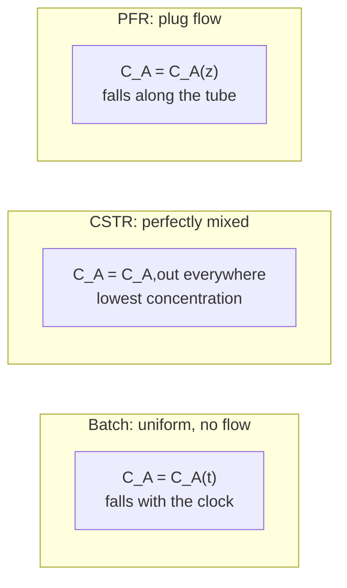

## ビデオ講義

<div class="video-container">
  <iframe
    width="560"
    height="315"
    src="https://www.youtube.com/embed/GIrdjPDTjwY?start=855"
    title="化学工学反応工学 第2章: 回分・CSTR・PFR — 理想反応器"
    frameborder="0"
    allow="accelerometer; autoplay; clipboard-write; encrypted-media; gyroscope; picture-in-picture"
    allowfullscreen>
  </iframe>
</div>

> このビデオは以下のテキストと同じ内容をカバーしています。お好みの学習形式をお選びください。

---

# 第2章：回分・CSTR・PFR — 理想反応器

[第1章](chapter-1.html)は反応速度式 — ある組成と温度において反応がどれだけ速く進むか — を組み立てました。反応速度式は流体中の 1 点についての記述です。反応器はそうした点で満たされた容器であり、買わねばならない体積は、それらの点がどの組成に保たれているかに依存します。本章はこの 2 つをつなぎます。

**設計方程式、転化率、そしてどちらの体積が勝つか**

## 学習目標

本章を修了すると、以下ができるようになります:

  * ✅ 3 つの理想反応器モデル — 回分反応器、CSTR（連続槽型反応器）、PFR（押出流れ反応器） — を、化学についてではなく流動パターンについての約束として述べられる
  * ✅ 転化率 $X$ と空間時間 $\tau = V/v_0$ を定義し、反応器サイジングの共通通貨として使える
  * ✅ 1 次・定密度の設計方程式、PFR について $k\tau = \ln[1/(1-X)]$、CSTR について $k\tau = X/(1-X)$ を適用できる
  * ✅ 正の次数の速度論において CSTR が PFR より多くの体積を必要とする構造的な理由を説明し、転化率を深めたときのペナルティを定量化できる
  * ✅ CSTR を直列にした槽列が、押出流れに向けてその差をどう埋めるかを示せる
  * ✅ 体積のペナルティにもかかわらず CSTR が正しい選択となる状況を挙げられる
  * ✅ ダムケラー数 $Da = k\tau$ を反応器の無次元の大きさとして読める

**読了時間**: 20-25分 **コード例**: 1 **演習**: 3

* * *

## 2.1 3 つの理想化、流れについての 3 つの約束

反応器モデルは化学のモデルではありません。化学は[第1章](chapter-1.html)で $-r_A = k C_A^n$ として登場し、どの容器でも同じ式です。容器ごとに変わるのは、*反応している間に流体が組成空間のどこに位置しているか*であり、それは流体がどう動くかによって決まります。古典的な 3 つの反応器モデルは、その問いに対する 3 つの理想化された答えです。

**回分反応器**は閉じた容器です: 仕込み、反応させ、抜き出します。反応の間は何も入らず何も出ないので、組成は時間だけの関数です。理想化は**空間的な完全混合**です — どの瞬間にも容器内のあらゆる点が 1 つの組成と温度を共有します。時計が進むにつれて濃度が下がり、それとともに速度も下がるので、反応器は仕込みから最終状態までのあらゆる組成を経巡ります。

**連続槽型反応器**（CSTR、混合流れ反応器あるいは逆混合反応器とも呼ばれます）は、連続的な供給、連続的な排出、そして撹拌機を備えた槽です。理想化は**供給流が内容物へ瞬時に完全に混合すること**です: 入ってきた分子はただちに容器全体へ分散するので、内容物は一様であり — そしてこれが鍵となる帰結ですが — *出口流はまさに内容物と同じ組成を持ちます*。定常状態ではその組成は時間的に固定されるので、容器全体が出口組成に永続的に置かれることになり、反応物を消費する反応ではそれがプロセス中のどこよりも*低い*濃度になります。

**押出流れ反応器**（PFR）は管です。流体は互いに独立した薄片 — プラグ — の連なりとして管に沿って動き、それぞれが平坦な速度分布を持ち、それぞれが断面方向に完全混合されており、前後のプラグと物質をやりとりしません。理想化は**軸方向の混合がないこと**です: 管に沿った位置が反応器内で過ごした時間と一対一に対応するので、プラグは配管を下っていく小さな回分反応器です。濃度は軸方向の位置とともに下がり、反応は 1 点ではなく組成の全範囲にわたって進みます。

このうち 2 つは、名前が示唆する以上に互いに似ています。回分と押出流れはどちらも組成の軌跡を余さずたどり — 一方は時間の中で、もう一方は空間の中で — 定密度であれば同じ積分を与えます。仲間外れは CSTR であり、本章のあらゆる結果はその 1 つの構造的な違いから導かれます。



それぞれのモデルは**流動パターンについての約束**であり、その約束を守るのは反応ではなく流体力学です。撹拌槽が CSTR のふるまいを示すのは、撹拌機が、反応による消費よりもはるかに速く内容物を循環・混合する場合だけです。そうでないときは、容器の一部は供給ジェットに短絡され、一部は淀んだ袋小路になり、槽はどちらのモデルでもないふるまいをします。管が押出流れを実現するのは、速度分布が十分に平坦で軸方向分散が十分に弱い場合だけです。層流では速度分布はまったく平坦ではなく — 軸上の流体は平均流速のおおよそ 2 倍で動く一方、壁際の流体はほとんど動きません — したがって層流の管はよくない押出流れ反応器になりえます。一方、より平坦な中心部の分布を持つ**乱流**域は理想にずっと近づきます。それは私たちの[流体力学](../chemical-engineering-fluid-mechanics/index.html)シリーズの題材であり、そこでレイノルズ数とこれらの流動域が展開されます。[第4章](chapter-4.html)は、現実の容器がその約束からどれほど外れているかを測る診断の道具 — 滞留時間分布 — とともに戻ってきます。

## 2.2 転化率、空間時間、そして設計方程式

反応器のサイジングには通貨が必要であり、そこでは 2 つの変数が使われます。

**転化率** $X$ は、供給された限定反応物のうち反応した割合です:

$$ X = \frac{F_{A0} - F_A}{F_{A0}} \qquad \text{(flow systems)}, \qquad X = \frac{N_{A0} - N_A}{N_{A0}} \qquad \text{(batch)} $$

これは 0 から 1 までの値を取り、プロセスが反応器設計者に手渡す仕様そのものです: 「供給の 90% を転化せよ」。**定密度** — ほとんどの液相の仕事、およびモル数が変化しない気相反応については妥当な近似です — のもとでは、濃度が直接に $C_A = C_{A0}(1 - X)$ で従います。

**空間時間** $\tau$ は、反応器体積を体積供給速度で割ったものです:

$$ \tau = \frac{V}{v_0} $$

時間の単位を持ち、供給の反応器 1 杯分を処理するのに要する時間として読めます。定密度系ではこれは平均滞留時間にも等しく、そのためしばしば大まかにそう呼ばれます。反応器に沿って密度が変化する場合には両者は分かれ、*入口*流量で定義される $\tau$ のほうがより明快な設計変数として残ります。

設計方程式は、それぞれの理想反応器についてのモル収支から得られます。**定密度における 1 次の速度論** $-r_A = kC_A$ では:

| 反応器 | 設計方程式 | 転化率について解いた形 |
|---|---|---|
| **回分** | $\displaystyle kt = \ln\!\frac{1}{1-X}$ | $X = 1 - e^{-kt}$ |
| **PFR** | $\displaystyle k\tau = \ln\!\frac{1}{1-X}$ | $X = 1 - e^{-k\tau}$ |
| **CSTR** | $\displaystyle k\tau = \frac{X}{1-X}$ | $\displaystyle X = \frac{k\tau}{1+k\tau}$ |

回分と PFR は $t$ と $\tau$ を入れ替えただけの同じ方程式であり、これが「プラグは配管を下っていく回分反応器である」の形式的な表現です。CSTR は種類として異なります: 一方には対数、もう一方には比が現れます。

この違いは代数上の偶然ではありません。PFR の収支は、下がっていく濃度分布にわたって速度を積分するので、

$$ \tau = C_{A0}\int_0^X \frac{dX}{-r_A} $$

管のあらゆる部分が*それぞれの局所的な*速度で寄与します — 反応物が豊富な入口近くでは高く、出口近くでは低くなります。CSTR の収支はそもそも積分ではありません。内部では何も変化しないからです:

$$ \tau = \frac{C_{A0}X}{(-r_A)_{exit}} $$

全体積が**出口**の速度で運転されます。CSTR に入る供給は $C_{A0}$ から $C_{A0}(1-X)$ へと瞬時に希釈され、滞在の間ずっとその下がった濃度で反応します。速度が濃度とともに上がる**正の次数**のあらゆる速度論にとって、これは運転する場所として最悪です: CSTR は、PFR が管の最初の区間に沿って収穫している、速く高濃度な部分の反応を意図的に捨てているのです。それが CSTR がより多くの体積を必要とする構造的な理由であり、例外を添えた規則として述べておく価値があります — 正の次数の速度論では CSTR のほうが大きくなりますが、反応物濃度とともに速度が*下がる*反応（負の次数の系、強く阻害される系 — および自己触媒系のうち低転化率の範囲）では、低い濃度で運転することが有利になり、順位は逆転しうるのです。

## 2.3 体積のペナルティを定量化する

定密度における 1 次反応を取り上げ、$X = 0.90$ を要求してみましょう。

PFR では:

$$ k\tau_{PFR} = \ln\!\frac{1}{1-0.90} = \ln 10 \approx 2.30 $$

CSTR では:

$$ k\tau_{CSTR} = \frac{0.90}{1-0.90} = \frac{0.90}{0.10} = 9 $$

同じ反応、同じ供給速度、同じ仕様であり、$V = \tau v_0$ で $v_0$ と $k$ が両者に共通なので、体積比は $k\tau$ の値の比になります:

$$ \frac{V_{CSTR}}{V_{PFR}} = \frac{9}{2.30} \approx 3.9 $$

撹拌槽は管の約 4 倍の体積でなければなりません。化学については何も変わっていません。変わったのは、反応している間に流体が保たれていた濃度だけです。

さて、ペナルティは定数ではないので、仕様を上下に動かしてみましょう:

| 転化率 $X$ | $k\tau$ PFR $= \ln[1/(1-X)]$ | $k\tau$ CSTR $= X/(1-X)$ | 体積比 |
|---|---|---|---|
| 0.50 | 0.69 | 1.0 | **≈ 1.4** |
| 0.90 | 2.30 | 9 | **≈ 3.9** |
| 0.99 | 4.61 | 99 | **≈ 21.5** |

最後の列を本章の教訓として読んでください。転化率が半分のところでは、2 つの反応器は体積の面でほとんど互換です — 40% の差は、機械的な単純さや伝熱上の都合が十分にひっくり返せる範囲の内側にあります。90% になると槽は 4 倍大きくなります。99% では 20 倍以上になります。CSTR の要求量が $X/(1-X)$ として増大し — $X \to 1$ で*発散*します — 一方で PFR の要求量は対数としてしか増大しないからです。

工学的な結論はこうです: **深い転化率は押出流れに属する。** 仕様が反応物の最後の数パーセントまで消費することを求めるなら、単一の撹拌槽は間違った容器であり、解決策は管型反応器か、次節の配置です。これを正直に保つために注意が 2 つ。この数値は定密度における 1 次についてのみ厳密です。他の次数では比は動きますが、定性的な順位はどんな正の次数についても保たれます。そして体積比はコスト比ではありません — ジャケット、清掃のためのアクセス、触媒の充填が見積もりに入ってくれば、管が槽より 1 立方メートルあたり常に安いとは限りません。

## 2.4 CSTR の槽列：差を買い戻す

中間の道があり、それは反応器設計において最も有用な事実の 1 つです。CSTR を複数直列に置き、それぞれの出口を次へ供給すると、その槽列は単一の槽よりも管に近いふるまいをします。

その機構は構造的な議論から従います。単一の CSTR は全体積を*最終の*出口濃度で運転します。直列の 2 槽はそれぞれ自分の出口濃度で運転され、1 槽目の出口は中間の組成 — 最終のものより高い、したがって速い — に位置します。この槽列は、PFR が滑らかに下っていく濃度の軌跡を、階段状に下っていくものです。槽を増やせば階段は細かくなり、無限に多くの無限小の槽の極限ではそれは曲線になり、槽列は PFR *そのもの*になります。

定密度における 1 次の速度論で等体積の CSTR を $N$ 槽直列にした場合、必要な全体の $k\tau$ は

$$ k\tau_{total} = N\left[\left(\frac{1}{1-X}\right)^{1/N} - 1\right] $$

であり、$N = 1$ で $X/(1-X)$ に帰着し、$N$ が大きくなるにつれて $\ln[1/(1-X)]$ に近づきます。$X = 0.90$ では:

| $N$ 槽 | 全体の $k\tau$ | 単一槽の要求量に対する割合 |
|---|---|---|
| 1 | 9.00 | 100% |
| 2 | 4.32 | 48% |
| 3 | 3.46 | 38% |
| 5 | 2.92 | 32% |
| 10 | 2.59 | 29% |
| PFR 極限 | 2.30 | 26% |

収束は**前倒し**であり、それが実務上の要点です。1 槽から 2 槽にするだけで全体積の半分以上が取り除かれ、3 槽目が残りのかなりの部分を取り除きます。等しい 2 ないし 3 槽で、単一の CSTR と PFR との差の多くを捉えられます — 有用な定性的規則ですが、「差の多く」が正確にどこに落ち着くかは転化率と速度論に依存するので、ケースごとに算術をやり直す価値があります。それを超えると見返りは薄くなります: 10 槽目が買う体積はわずかで、代償として容器 1 基、撹拌機 1 台、そしてノズル一式がかかります。

これが**槽列**の考え方であり、それには第 2 の人生があります。ここではそれは設計上の配置 — 実際の槽を意図的に直列にしたもの — です。[第4章](chapter-4.html)では同じ式が*モデル*として再登場します: 不完全に混合された現実の容器は、しばしば、その測定された滞留時間分布を再現するには理想的な槽が直列に何槽必要かを問うことで記述され、そこでの $N$ はハードウェアの数ではなく当てはめられたパラメータです。当てはめられた $N$ が大きければ押出流れに近いふるまいを、$N \approx 1$ ならよく混合された槽を意味します。同じ方程式に、2 つの読み方があるのです。

## 2.5 それでも CSTR が勝つとき

90% 転化率で 4 倍の体積ペナルティがあるのなら、CSTR は絶滅していてよいはずです。そうはなっていません — 撹拌槽は化学・製薬産業で最もよく使われる反応器の 1 つであり、その理由は体積とはほとんど関係がありません。

**温度制御。** 発熱反応は、それが進んでいる場所で熱を放出します。PFR では速度が入口で最も高いので、熱の放出はそこに集中し、温度が最も管理しにくいまさにその場所にホットスポットを作ります — そして速度は温度とともに急峻に上がるので、ホットスポットはそれを作った当の反応を加速します。CSTR は構造上、等温です: 温度は一様に 1 つ、冷却すべきよく混合された容器が 1 つ、ジャケットあるいはコイルはどこでも同じ条件を見ます。設定値に保つのが容易であり、冷却能力が発熱に追いつけるかどうかが問題であるときに、考えを組み立てるのも容易です。その問い — 熱的安定性と暴走 — は[第5章](chapter-5.html)の主題であり、CSTR の一様性が最も元を取る場所でもあります。

**固体とスラリーの取り扱い。** スラリーとして懸濁させた触媒、分散したまま保たれねばならない固体の反応物、析出する生成物 — いずれも懸濁を保つのに撹拌を必要とし、いずれも管の中では沈降し、ブリッジを作り、閉塞します。撹拌容器は不均一な混合物にとって自然な住処であり、また反応器を停止せずに触媒を投入・抜き出しできるのも、充填された管にはできないことです。

**選択率。** CSTR の欠点とされるもの — 全体積をプロセス中で最も低い濃度で運転すること — は、*低い*濃度こそ化学が求めるものであるときには利点に変わります。目的生成物が、競合する副反応より反応物について低い次数の反応から生じるなら、低い濃度は主反応より副反応をより強く抑えるので、同じ転化率において CSTR は PFR よりよい選択率をもたらします。[第3章](chapter-3.html)がその比較を定量的にします。ここでの要点は、「出口濃度で運転する」ことは欠点ではなく、その符号が反応ネットワークによって決まる設計上の*選択*だということです。

**液体に対する機械的な単純さ。** ジャケット付きの撹拌容器は標準的で、頑丈で、点検でき、清掃できます。粘性の高い液体を扱え、広い範囲でターンダウンでき、多品種プラントで製品を切り替えられ、そして圧力損失が実質的にありません。同じ役割を担う長い管は、摩擦に抗するポンプ動力を必要とし、清掃のためのアクセスも扱いにくいものです。

反応器の選定はトレードオフであり、体積はその 1 つの軸にすぎません。2.3 節の比のはしごが与えるのは、CSTR を選ぶことの*価格* — 低い転化率では控えめ、高い転化率では厳しい — であり、それによってこのトレードオフを、習慣ではなく数値を手にして行えるようになります。

## 2.6 ダムケラー数：反応器の無次元の大きさ

$k\tau$ という群は本章の仕事をすべてこなしてきたので、名前を与えるに値します。1 次反応についてはこれが**ダムケラー数**です:

$$ Da = k\tau $$

時間スケールの比として読んでください: $\tau$ は流体が反応器で過ごす時間、$1/k$ は反応が必要とする特性時間です。したがって $Da$ は、化学が起こるだけの十分な時間、流体がそこに留まるかどうかを問うています。同じことですが、これは入口条件における反応速度を対流的な供給速度で割ったもの — 供給に対する消費 — でもあります。

その有用性は、3 つの設計変数 — 反応器体積、供給速度、速度定数 — を 1 つの無次元数に畳み込むことにあり、そのため理想反応器における転化率は $Da$ だけに依存します: PFR では $X = 1 - e^{-Da}$、CSTR では $X = Da/(1 + Da)$ です。体積を 2 倍にしようと処理量を半分にしようと、反応器はどちらをしたのか気にしません。

この畳み込みは素早い健全性チェックを与えます。$Da \ll 1$ のときは滞留時間が反応時間に比べて短く、転化率は小さくなります — この極限ではどちらの反応器でも $X \approx Da$ なので、反応器を大きくすればそれに比例して多くの生成物が得られます。$Da \gg 1$ のときは反応は十分な時間を得ています。PFR は指数関数的な尾の奥に入り、CSTR は曲線の平坦な部分にいるので、さらに体積を足しても得られるものは次第に少なくなります。**おおよそ** $Da \approx 1$ が境界を示します — 反応器が明らかに小さすぎる状態を脱し、収穫逓減に入り始めるところです。これは設計規則ではなく方向づけの目安として扱ってください: 何をもって「十分」とするかは指定された転化率に依存し、どこで見返りが経済的に見合わなくなるかは、生成物の価値に対する体積のコストに依存します。

注意が 2 つ。第 1 に、$Da = k\tau$ は*1 次*の形です。$n$ 次では群は $Da = k C_{A0}^{\,n-1}\tau$ に一般化されるので、1 次以外のどの次数でも供給濃度が入ってきます。したがって反応次数を伴わずに引用されたダムケラー数は曖昧です。第 2 に、文献には他のダムケラー数も存在します — 反応時間を滞留時間ではなく混合時間や拡散時間と比較する変種です — ので、定義は仮定せずに明示すべきです。

## 2.7 コード例：比のはしごと槽列

本章の中心的な 2 つの数値結果 — 転化率を深めたときの体積のペナルティと、CSTR の槽列が押出流れに近づいていくこと — は、数行の算術です。

```python
import math


def ktau_pfr(X):
    """Dimensionless size k*tau for a PFR (or k*t for a batch reactor),
    first order, constant density."""
    return math.log(1.0 / (1.0 - X))


def ktau_cstr(X):
    """Dimensionless size k*tau for a single CSTR, first order, constant density."""
    return X / (1.0 - X)


def ktau_cstr_series(X, N):
    """Total k*tau for N equal-volume CSTRs in series, first order."""
    return N * ((1.0 / (1.0 - X)) ** (1.0 / N) - 1.0)


# --- The ratio ladder: how the CSTR penalty grows with conversion ---
print(f"{'X':>6} {'PFR k.tau':>10} {'CSTR k.tau':>11} {'V_CSTR/V_PFR':>13}")
for X in (0.50, 0.90, 0.99):
    p, c = ktau_pfr(X), ktau_cstr(X)
    print(f"{X:>6.2f} {p:>10.2f} {c:>11.2f} {c / p:>13.1f}")

# --- The cascade: N equal CSTRs in series at X = 0.90 ---
X = 0.90
print(f"\nX = {X}: PFR limit k.tau = {ktau_pfr(X):.2f}\n")
print(f"{'N tanks':>8} {'total k.tau':>12} {'% of N=1':>10}")
single = ktau_cstr(X)
for N in (1, 2, 3, 5, 10):
    t = ktau_cstr_series(X, N)
    print(f"{N:>8d} {t:>12.2f} {100 * t / single:>9.0f}%")

#      X  PFR k.tau  CSTR k.tau  V_CSTR/V_PFR
#   0.50       0.69        1.00           1.4
#   0.90       2.30        9.00           3.9
#   0.99       4.61       99.00          21.5
#
# X = 0.9: PFR limit k.tau = 2.30
#
#  N tanks  total k.tau   % of N=1
#        1         9.00       100%
#        2         4.32        48%
#        3         3.46        38%
#        5         2.92        32%
#       10         2.59        29%
```

最初のブロックがはしごです: 1.4、次に 3.9、そして 21.5。ペナルティは 50% から 90% の転化率の間でおおよそ 3 倍になり、90% から 99% の間でさらに 5 倍になります。$X/(1-X)$ が発散する一方で $\ln[1/(1-X)]$ は発散しないからです。

2 番目のブロックは $X = 0.90$ における槽列で、9.00 → 4.32 → 3.46 → 2.92 → 2.59 と、押出流れの値である 2.30 へ向けて下っています。最初に足した 1 槽が仕事の大半をこなします。$N = 10$ では槽列は PFR の約 13% 以内に入っていますが、最後の 5 槽が買ったのはそのうちのわずかな部分にすぎません。また、$N = 10$ は 2.30 に*達しておらず*、有限の $N$ では決して達しないことにも注意してください — PFR はこの数列の極限であり、近づけても到達はされないのです。

## 2.8 本章のまとめ

1. 3 つの理想反応器は 3 つの**流動パターンの約束**である: **回分**（空間的に一様、組成は時間の関数）、**CSTR**（完全混合であり、出口は内容物に等しい）、**PFR**（押出流れ、軸方向の混合なし、したがって位置が時間に対応する）。現実の容器がその約束を守るかどうかは流体力学の問題である — 関係する流動域については私たちの[流体力学](../chemical-engineering-fluid-mechanics/index.html)シリーズを、そのずれの測り方については[第4章](chapter-4.html)を参照
2. **転化率** $X$ は消費された限定反応物の割合であり、**空間時間** $\tau = V/v_0$ は体積供給速度あたりの反応器体積である。定密度では $C_A = C_{A0}(1-X)$
3. 1 次・定密度の設計方程式: 回分と PFR は $kt = k\tau = \ln[1/(1-X)]$ を与え、CSTR は $k\tau = X/(1-X)$ を与える。回分と PFR が方程式を共有するのは、プラグが配管を下っていく回分反応器だからである
4. CSTR は**全体積を出口の（最も低い）濃度で運転し**、PFR が入口近くで収穫している速く高濃度な部分の反応を捨てている。**正の次数**のあらゆる速度論では、これは体積の代償を伴う。反応物濃度とともに速度が下がる速度論（負の次数の系、強く阻害される系 — および自己触媒系のうち低転化率の範囲）では、順位が逆転しうる
5. $X = 0.90$、1 次では: PFR は $k\tau = \ln 10 \approx 2.30$、CSTR は $k\tau = 9$、体積比は $\approx 3.9$。はしごは $X = 0.50 \to \approx 1.4$、$X = 0.90 \to \approx 3.9$、$X = 0.99 \to 99/4.61 \approx 21.5$ となる。ペナルティは**高い転化率で爆発する**ので、深い転化率は押出流れ — あるいは槽列 — に属する
6. **CSTR の槽列**は押出流れに近づく: $k\tau_{total} = N[(1/(1-X))^{1/N} - 1]$。$X = 0.90$ でははしごが 9.00 → 4.32 → 3.46 → 2.92 → 2.59 と進み、PFR の 2.30 へ向かう。収束は前倒しであり、等しい 2 ないし 3 槽が差の多くを捉える。同じ式は[第4章](chapter-4.html)で、$N$ を数えるのではなく当てはめる、非理想的な容器の槽列*モデル*として戻ってくる
7. それでも CSTR が勝つのは、**温度制御**が重要なとき（冷却すべき一様な容器が 1 つ、入口のホットスポットなし — [第5章](chapter-5.html)）、**固体や触媒スラリー**を懸濁させ続けねばならないとき、**低い濃度が選択率を改善する**とき（[第3章](chapter-3.html)）、あるいは液体用途におけるジャケット付き撹拌容器の機械的な単純さと柔軟さのためである
8. **ダムケラー数** $Da = k\tau$（1 次。$n$ 次では $k C_{A0}^{n-1}\tau$）は反応器の無次元の大きさ — 反応時間に対する滞留時間 — である。PFR では $X = 1 - e^{-Da}$、CSTR では $X = Da/(1+Da)$。**おおよそ** $Da \approx 1$ が「小さすぎる」と「収穫逓減」を分けるが、これは設計規則ではなく方向づけの目安である

**次章**: ここまでのどの反応器も単一の反応を進めてきたので、転化率が唯一の性能指標でした。現実の原料はめったにそう都合よくありません — 複数の経路で反応し、欲しい生成物は欲しくない生成物と競合します。[第3章](chapter-3.html)は**複数反応、収率、そして選択率**に取り組みます。そこでは、ここで体積を決めたまさにその量 — 反応器が保つ濃度水準 — が、代わりに何が出てくるかを決めます。

## 演習問題

1. **定量 — CSTR 対 PFR のサイジング**: $k = 0.05\ \text{min}^{-1}$ の 1 次の液相反応が、定密度のもとで $v_0 = 20\ \text{L/min}$ で供給されている。仕様は $X = 0.85$ である。(a) PFR に必要な空間時間と体積を計算せよ。(b) 単一の CSTR について同じものを計算せよ。(c) 体積比を示し、2.3 節のはしごの上に位置づけよ。(d) 続いて仕様が $X = 0.95$ に厳しくなった。両方の体積を計算し直し、どちらの反応器の要求量がより速く増えたかを論評せよ。
   *ヒント*: $\tau_{PFR} = \ln[1/(1-X)]/k$、$\tau_{CSTR} = X/[k(1-X)]$、そしてどちらの場合も $V = \tau v_0$ である。
   *解答*: (a) $k\tau = \ln(1/0.15) = \ln 6.67 = 1.897$ なので、$\tau = 1.897/0.05 =$ **37.9 分**、$V = 37.9 \times 20 \approx$ **759 L** です。(b) $k\tau = 0.85/0.15 = 5.667$ なので、$\tau = 5.667/0.05 =$ **113 分**、$V = 113 \times 20 \approx$ **2270 L** です。(c) 比は $5.667/1.897 =$ **≈ 3.0** であり、これははしごの $X = 0.50$ における 1.4 と $X = 0.90$ における 3.9 の間に位置し、0.85 という転化率について予想されるとおりです。(d) $X = 0.95$ では: PFR は $k\tau = \ln 20 = 3.00$、$\tau = 60.0$ 分、$V =$ **1200 L**。CSTR は $k\tau = 0.95/0.05 = 19.0$、$\tau = 380$ 分、$V =$ **7600 L** で、比は **≈ 6.3** です。転化率を 85% から 95% に上げたことで、PFR は 1.6 倍、CSTR は 3.4 倍になりました。CSTR の要求量は $X/(1-X)$ として増大し、これは $X \to 1$ で発散する一方、PFR の要求量は対数的にしか増大しません — $X = 0.99$ で 21.5 を生んだのと同じ発散です。

2. **定量 — CSTR の槽列**: 演習 1 と同じ 1 次反応（$k = 0.05\ \text{min}^{-1}$、$v_0 = 20\ \text{L/min}$）が $X = 0.90$ に達しなければならない。(a) 単一の CSTR、等しい 2 槽の CSTR 直列、等しい 3 槽の CSTR 直列について、全体積を計算せよ。(b) それぞれを同じ役割の PFR の体積と比較せよ。(c) 単一槽から PFR までの差のうち、2 槽目はどれだけを埋め、3 槽目は何を加えるか。実務上の結論を述べよ。
   *ヒント*: $k\tau_{total} = N[(1/(1-X))^{1/N} - 1]$ であり、埋めるべき差は $k\tau_{CSTR} - k\tau_{PFR} = 9.00 - 2.30$ である。
   *解答*: (a) $N = 1$: $k\tau = 9.00$、$\tau = 180$ 分、$V =$ **3600 L**。$N = 2$: $k\tau = 2(10^{0.5}-1) = 4.32$、$\tau = 86.5$ 分、$V =$ 合計 **1730 L**、すなわち約 865 L の槽が 2 基です。$N = 3$: $k\tau = 3(10^{1/3}-1) = 3.46$、$\tau = 69.3$ 分、$V \approx$ 合計 **1390 L**、約 462 L の槽が 3 基です。(b) PFR には $k\tau = \ln 10 = 2.30$、$\tau = 46.1$ 分、$V =$ **921 L** が必要です。したがって槽列の体積は $N = 1, 2, 3$ についてそれぞれ PFR の体積の 3.9 倍、1.9 倍、1.5 倍です。(c) $k\tau$ で見た差は $9.00 - 2.30 = 6.70$ です。2 槽目は $9.00 - 4.32 = 4.68$、すなわち差の **70%** を埋めます。3 槽目は $4.32 - 3.46 = 0.86$、さらに **13%** を加え、槽列を全体の 83% のところまで持っていきます。実務上の結論: 1 槽足すことは通常きわめて割がよく、2 槽目もしばしば価値がありますが、その後は容器を 1 基増やすごとに — 撹拌機、ノズル、計装、制御ループとともに — 買える体積の節約は急速に縮んでいきます。打ち切り点が正確にどこに落ちるかは容器と体積の相対的なコストに依存しますが、収束が前倒しであるという形は一般的です。

3. **概念 — 出口で運転することの代償**: (a) 同じ 1 次の転化率に対して CSTR が PFR より多くの体積を必要とする理由を、それぞれの反応器の流体が経験する濃度に言及しながら、代数を使わずに説明せよ。(b) $X \to 1$ でペナルティがこれほど急激に増大する一方、PFR の要求量が対数的にしか増大しない理由を説明せよ。(c) ペナルティにもかかわらず CSTR を指定する状況を 2 つ、互いに異なるものを挙げ、それぞれで CSTR のどの性質が効いているかを述べよ。
   *ヒント*: (a) では、それぞれの容器の流体が反応している間にどの濃度に保たれているかを問え。(b) では、反応物の最後の数パーセントが消えていくときに、それぞれの反応器で*速度*に何が起こるかを比べよ。
   *解答*: (a) PFR の流体は濃度の全範囲を経巡ります: 入口近くではほぼ供給濃度にあって速く反応し、管の最後の区間だけが低い出口濃度で運転されます。CSTR は供給を瞬時に容器の内容物へ混合するので、*あらゆる*流体要素が、滞在の全期間にわたって出口濃度 — プロセス中のどこよりも低い濃度 — で反応します。1 次の速度は濃度に比例するので、CSTR はその全体積を、その役割に含まれる最も遅い速度で運転していることになり、遅い速度は同じ処理量に対してより多くの体積を意味します。PFR は、CSTR が捨てている速い初期の反応を収穫しているのです。(b) 違いは最後の数パーセントに宿ります。PFR では、最終的な転化率がどれほど深くても速い初期の区間が依然として仕事の大半をこなすので、$X$ を 0.90 から 0.99 へ押し上げることは低い濃度で運転される管を足すだけであり、要求量は $\ln 10 \approx 2.30$ 上がります — 残存反応物が 10 分の 1 になるたびに、これまでと同じ増分です。CSTR では容器全体が新しい、より低い出口濃度まで落ちるので、どこでも速度が仕様の厳しくなった分だけ下がります: 生き残る反応物を 10 分の 1 にせよと要求すれば反応器全体が 10 倍遅くなり、体積はおよそ 11 倍に上がります（99/9 = 11）。形式的には、$X/(1-X)$ が $X \to 1$ で発散する一方で $\ln[1/(1-X)]$ は対数的にしか増大しません — したがって $X = 0.90$ で 3.9、$X = 0.99$ で 21.5 になるのです。(c) いくつかあるうちの 2 例です。**厳密な温度制御を必要とする強い発熱反応**: ここで効いている性質は一様性です — 全体で 1 つの温度、冷却すべきよく混合された容器が 1 つ、そして PFR が速度の最も高い場所に作るような入口のホットスポットがないことです。**反応物濃度が低いほど選択率が改善する反応**、たとえば望ましくない副反応が目的反応より反応物について高い次数である場合: ここで効いている性質はまさにあの「欠点」、すなわち出口濃度での運転であり、それが主反応より副反応をより強く抑えるのです。懸濁を保たねばならないスラリー触媒や、ジャケット付き撹拌容器の機械的な単純さとターンダウン性も、同じく該当します。いずれの場合でも体積のペナルティは支払われたままです。2.3 節のはしごは、他の利点がそれに見合うと判断する前に、その請求額がどれほど大きいかを教えてくれます。
