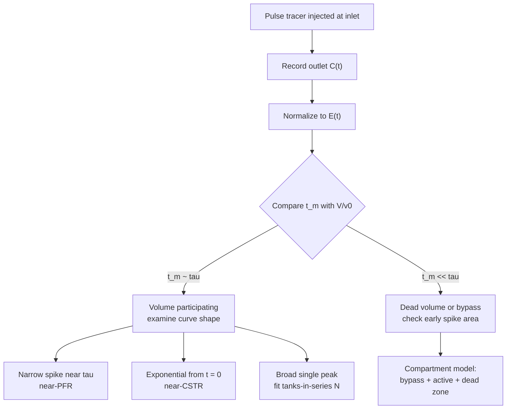

## ビデオ講義

<div class="video-container">
  <iframe
    width="560"
    height="315"
    src="https://www.youtube.com/embed/GIrdjPDTjwY?start=2527"
    title="化学工学反応工学 第4章: 滞留時間分布と非理想流れ"
    frameborder="0"
    allow="accelerometer; autoplay; clipboard-write; encrypted-media; gyroscope; picture-in-picture"
    allowfullscreen>
  </iframe>
</div>

> このビデオは以下のテキストと同じ内容をカバーしています。お好みの学習形式をお選びください。

---

# 第4章：滞留時間分布と非理想流れ

ここまでのすべての設計方程式は、流体が容器の中をどう動くかについての 1 つの言明の上に載ってきました。その言明は仮定であり、そして測定できるものです。本章はその測定について — そして、それが仮定と食い違ったときに何をすべきかについての章です。

**設計方程式が何を仮定していたかを、トレーサーが教えてくれる**

## 学習目標

本章を修了すると、以下ができるようになります:

  * ✅ 理想反応器の設計方程式の内側に隠れている流れの仮定を述べ、それらがなぜ前提とされるのではなく検証されなければならないかを説明できる
  * ✅ 滞留時間分布（RTD）$E(t)$ を定義し、それを測定するパルス応答実験とステップ応答実験を説明できる
  * ✅ 曲線から得た平均滞留時間を $V/v_0$ と比較し、その食い違いから死容積やバイパス（短絡）を診断できる
  * ✅ 2 つの理想の特徴 — PFR のスパイクと CSTR の指数関数 $E(t) = (1/\tau)e^{-t/\tau}$ — を見分け、$e^{-1} \approx$ 37% を解釈できる
  * ✅ 測定された曲線の形から、バイパス（短絡）、死領域、並列経路を読み取れる
  * ✅ 分散から槽列モデルのパラメータ $N$ を当てはめ、それを[第2章](chapter-2.html)の CSTR 直列の結果と結び付けられる
  * ✅ 一次反応の転化率が $E(t)$ のみに依存する理由を説明し、他の次数で問題となるミクロ混合の上下界を挙げられる

**読了時間**: 20-25分 **コード例**: 1 **演習**: 3

* * *

## 4.1 約束と配管との隔たり

[第2章](chapter-2.html)は設計方程式を、流れについての 2 つのきれいな描像の上に築きました。押し出し流れ反応器は流体を剛体の柱として動かします: どの要素も他を追い越さず、軸方向には何も混ざらず、すべての分子が内部でちょうど空間時間 $\tau = V/v_0$ を過ごします。連続撹拌槽型反応器は反対の極端を取ります: 混合は瞬時かつ完全で、内容物は均一であり、出口流はその内容物の見本です。

どちらの描像も装置の性質ではありません。いずれも装置内部の流れ場についての主張であり、実際の容器はそれらを破る自由を持っています。

出口の近くに置かれた供給ノズルは、流れの一部をほぼまっすぐ通り抜けさせることがあり — **バイパス（短絡）** — その結果、供給の一部は反応する時間をほとんど過ごさないまま出て行きます。邪魔板の裏の隅、撹拌翼の下の領域、大きすぎる鏡板の中の低速の環状部: いずれも主流とゆっくりとしか交換しない流体を抱えうるものであり、この**死容積**は、プラントが代金を払ったのに反応が受け取れない容積です。充填層では、流れが充填物を通る低抵抗の経路を見つけて**チャネリング**を起こし、触媒の多くを行き渡らないまま残すことがあります。層流の管では、欠陥は一切必要ありません: 速度分布そのものが、中心線の流体が壁近くの流体よりずっと早く到着することを保証します。

実務上の帰結は、**予測された転化率に届かない反応器が、必ずしも速度論の問題であるとは限らない**ということです。この 2 つの可能性を出口組成だけから区別することは通常不可能です: 低い転化率は、行儀のよい容器の中の遅い反応とも、行儀の悪い容器の中の速い反応とも矛盾しません。両者を分けるのは、化学に手を触れずに行われる、流れそのものの測定です。

## 4.2 滞留時間分布

検出できるものを供給に注入し、それがいつ出て行くかを見れば、容器は自らの流れの挙動を報告してくれます。**トレーサー**は不活性で、出口で容易に測定でき、密度と粘度がプロセス流体に十分近く、加えても測定対象の流れを変えてしまわないものであるべきです。染料、導電率で検出される塩、放射性あるいは蛍光性の物質はいずれも標準的です。要件は化学そのものではなく保存です — 入ったものは出てこなければならず、途中で吸着したり反応したり沈降したりしてはなりません。

### パルス応答実験

$t = 0$ に、装置が許す限り瞬間的に入口で少量のトレーサーを注入し、出口濃度 $C(t)$ がベースラインに戻るまで記録します。トレーサー分子はそれぞれ異なる経路をたどり異なる時刻に到着するので、$C(t)$ は通過時間の広がりを直接描き出します。出てきたトレーサーの総量で規格化すると、**滞留時間分布（RTD）**が得られます

$$ E(t) = \frac{C(t)}{\int_0^{\infty} C(t)\,dt} $$

これは作り方から $\int_0^{\infty} E(t)\,dt = 1$ を満たします。その解釈は本章のすべてであるだけに、慎重に述べておく価値があります: **$E(t)\,dt$ は、いま容器を出ていく物質のうち、内部で $t$ から $t + dt$ の間を過ごしたものの割合です。** $E$ は内容物の上ではなく、出口流の上の分布です。

### ステップ応答実験

もう一方は、$t = 0$ に供給をトレーサーなしから一定のトレーサー濃度 $C_0$ へ切り替え、そのまま保つやり方です。出口の比

$$ F(t) = \frac{C(t)}{C_0} $$

は**累積**分布です: 出口流のうち、内部にいた時間が $t$ より短いものの割合です。$F$ は 0 から 1 へ上昇し、$E$ はその傾きなので、2 つの実験は同じ情報を担っています。

どちらを行うかは実務上のトレードオフです。ステップのほうが実行は容易です — 鋭い注入は不要で、きれいな切り替えだけで済みます — が、そこから $E$ を取り出すことは測定データを微分することを意味し、それはノイズを増幅します。一方、パルスの整理は積分を意味し、それはノイズを抑えます。$\tau$ に対して注入を鋭くできる場合はパルス試験のほうが一般的であり、できない場合はステップ試験が好まれます。

### 最初の数値：平均滞留時間

曲線から、平均滞留時間は

$$ t_m = \int_0^{\infty} t\,E(t)\,dt $$

であり、診断が始まるのはここ、どんなモデルを当てはめるよりも前です。すべての容積が働いており、供給のすべてがそこを通る容器では、$t_m$ は公称の空間時間 $\tau = V/v_0$ に等しくなるはずです。そうならないとき — そして食い違いは通常、**$t_m$ のほうが小さく出る**という形を取ります — 容器は、あなたが持っていると信じている容積のすべてを流体が見てはいないことを告げています。その容積の一部が滞留しているか、供給の一部がそこを飛ばしているかのどちらかです。大まかで役に立つ見積もりとして、容積のうち働いている割合はおよそ $t_m/\tau$ です。

その数値には 2 つの注意が付きます。第一に、**トレーサーの回収率**を確認すべきです: 入れた量より出てきた量が少なければ収支は閉じておらず、候補は、測定窓の終わりを過ぎてもなおトレーサーを放出し続けているゆっくり抜ける死領域か、固体や壁への吸着か、計器の問題です。第二に、平均は**裾**に敏感です。被積分関数が $t$ の因子を担っているからです。長い裾を早く打ち切れば $t_m$ は低い側へ偏り、実在しない見かけの死容積を作り出しかねません。裾が本当にベースラインに落ちるまで十分に長く試験を行い、どれだけの時間行ったかを述べてください。

## 4.3 2 つの理想の特徴

[第2章](chapter-2.html)の 2 つの理想化は、その RTD の特徴があまりに明確なので、測定された曲線を一目見れば実際の容器を両者の間のどこかに位置づけられます。

**押し出し流れ**はすべての要素に同じ通過時間を与えます。パルスとして注入されたトレーサーはパルスのまま進み、パルスとして現れます: $E(t)$ は $t = \tau$ に位置するスパイクであり、それ以外ではゼロです。PFR は**遅延線**です — 入ってきたものが何であれ、形を変えずに、空間時間 1 つ分だけ遅れて出て行きます。追い越すものがないので早く着くものはなく、遅れるものがないので遅く着くものもありません。

**完全混合槽**は逆を与えます。注入されたトレーサーは直ちに容積の全体へ分散するので、容器は特定の要素がいつ入ってきたかの記憶をまったく保持せず、槽内のどの要素も単位時間あたり同じ確率で掃き出されます。この無記憶の性質が指数関数を生みます:

$$ E(t) = \frac{1}{\tau}\,e^{-t/\tau} $$

この曲線には強調に値する特徴が 2 つあります。その最大値は $t = 0$ にあります: **一部の流体は、事実上入ってきたその瞬間に出て行き**、ほとんどまったく反応する時間を持ちません。そして、空間時間まるまる 1 つ分より長くとどまった出口流の割合は

$$ e^{-1} \approx 37\% $$

なので、容器を出て行くもののおおよそ 63% は $\tau$ より短い時間しか内部にいなかったことになります。CSTR の「平均」滞留時間とは、途方もなく広い広がりにわたる平均であり、4.6 節はその広がりが何を犠牲にするかを示します。

実際の容器はこれらの間に着地し、どこに着地するかは形状と同じくらい流動状態から決まります。乱流の長い管は押し出し流れに近いものの、ぴたりとそこにあるわけではありません: 渦が断面を横切って物質を活発に輸送し、速度分布を平坦にするので大半の流体は $\tau$ 付近に到着しますが、その同じ渦が物質を軸方向にも広げ、パルスに有限の幅を与えます。同じ管でも層流ではかなり異なる振る舞いをします — [流体力学第3章](../chemical-engineering-fluid-mechanics/chapter-3.html)で述べられた放物線状の分布は、中心線の流体を平均よりずっと先に通す一方で壁近くの流体は這うように進み、半径方向の輸送は分子拡散だけに委ねられます。そのため、ハードウェアの欠陥が 1 つもなくても $E(t)$ は幅広く長い裾を引くものになります。その章はまた撹拌槽レイノルズ数も与えており、これは、そもそも CSTR の描像を仮定する価値があるほど槽が十分に激しく撹拌されているかどうかについての、対応する確認になります。

## 4.4 曲線から病理を読む

RTD 試験の価値は、異なる不具合が異なる指紋を残すことにあります。表は、目にする特徴を、それが含意する流れの挙動と、通常それを引き起こすハードウェアへと対応づけます。

| 曲線の特徴 | 何を意味するか | 典型的なハードウェア上の原因 |
|---|---|---|
| **$\tau$ よりはるかに早く到着する鋭いスパイク**が、本体より先に現れる | **バイパス（短絡）** — 供給の一部が、働いている容積へほとんど入らないまま出口に達している。早期のスパイクの下の面積がその割合を見積もる | 入口ノズルと出口ノズルが近すぎる、供給ジェットが出口に届く邪魔板のない槽、内部のシールや仕切りの漏れ |
| **長く、ゆっくり減衰する裾**が、$\tau$ の数倍が過ぎてもなおベースラインより上にある | **死領域あるいは停滞領域**が、活発な流れとゆっくりとしか交換していない — 主体が出て行ってからずっと後まで、容器はなおトレーサーを排出し続けている | 邪魔板の裏の隅、撹拌翼の下や内部構造物の裏の領域、水が抜けにくい底部鏡板、堆積した固体やファウリング |
| **明瞭なピークが 2 つ以上** | **通過時間の異なる並列経路** — 供給が分岐し、その枝が出口までに再び混ざらない | 抵抗の異なる並列の管や層のセクション、充填物を貫くチャネル、多パス型の熱交換器兼反応器で部分的に閉塞したパス |
| **$t_m$ が $V/v_0$ より明らかに小さい** | **参加していない容積** — 図面が示すより小さな空間で流体が入れ替わっている | 上記のような停滞容積、設計値より低い液位やガスホールドアップ、容積を占める固体のインベントリ |
| **$\tau$ 付近に幅広い単一ピーク**、早期のスパイクはなく、裾もほどほど | **軸方向分散あるいは速度分布による広がり** — 欠陥ではなく、単に想定より押し出し流れらしくない容器 | 層流の管内流れ、長さ対直径比が小さい、管に対して充填粒子が大きい、流量が低い |
| **トレーサーの回収率が 100% を大きく下回る** | **容器ではなく測定のほうに問題があるかもしれない** — あるいはトレーサーが保持されている | 触媒や壁への吸着、真に不活性ではないトレーサー、裾が終わる前に打ち切られた測定窓、漏れ |

2 つの習慣がこれらの読み取りを信頼できるものにします。測定された曲線は、白紙にではなく、意図した流れのパターンに対して**期待される**曲線に対して比較してください — 幅の広い曲線は充填層では憂慮すべきものですが、層流の管では取り立てて言うことのないものです。そして最後の行を他の行より先に扱ってください: 閉じていないトレーサー収支は、この一覧のほとんどどの病理でも真似できてしまいます。



## 4.5 槽列モデル

曲線を定性的に読むことは診断です。それを設計方程式の中で使うにはモデルが要ります。2 つの理想の間の全範囲をおおう最も単純なものが**槽列モデル**です: 実際の容器を、等しい理想 CSTR $N$ 個を順に連結したものとして表し、全容積は同じ、したがって全空間時間 $\tau$ も同じとします。

無次元時間 $\theta = t/\tau$ において、このモデルの RTD は

$$ E(\theta) = \frac{N\,(N\theta)^{N-1}\,e^{-N\theta}}{(N-1)!} $$

であり、これはパラメータを 1 つ持つガンマ形の族です。$N = 1$ ではこれは CSTR の指数関数に帰着します。$N$ が大きくなるにつれて曲線は狭く、より対称になり、その最大値は $\theta = 1$ へと移動し、$N \to \infty$ の極限では押し出し流れのスパイクに近づきます。つまり $N$ は 2 つの理想化の間を連続的に内挿し、このたった 1 つの数値が「この容器はどれだけ混ざっているか」という実務上の問いに答えます。

$N$ の当てはめに曲線フィッティングのソフトウェアは要りません。モデルが $N$ を測定された曲線の広がりに直接結び付けているからです。分散 $\sigma^2 = \int_0^{\infty} (t - t_m)^2 E(t)\,dt$ を用いると、モデルは次を与えます:

$$ \frac{\sigma^2}{\tau^2} = \frac{1}{N} \qquad \Longrightarrow \qquad N = \frac{\tau^2}{\sigma^2} $$

つまり測定された曲線の平均が $\tau$ を、分散が $N$ を与え、この 2 つのモーメントが当てはめのすべてです。**非整数の $N$ は普通のこと**であり、物理的に聞こえる値へ丸めるべきではありません。それは当てはめられた混合度のパラメータであって、容器の個数ではありません。

このモデルの正直な限界は、パラメータが 1 つしかないことから導かれます: $N$ は**広がりだけを、それ以外は何も**記述しません。二重ピークを表現できず、バイパスの割合を死領域から分離することもできません — どちらも単に分散を膨らませ、当てはめられた $N$ を押し下げるだけです。したがって当てはまりの悪さは、恥ずべきことというより情報を与えるものです: それは容器の問題が構造的であることを告げており、正しい記述は 4.4 節の診断から組み立てたコンパートメントモデルです。

$N$ は以前にも登場していたことに注意してください。[第2章](chapter-2.html)は設計上の問い — ある容積を直列の撹拌槽 $N$ 個に分けたとき転化率はどうなるか — を立て、$N$ が増えるにつれて CSTR の性能から PFR の性能へと登っていく梯子を生み出しました。ここでは $N$ は反対の方向からやってきます。すでに存在する装置の上で測定されたトレーサー曲線から取り出されるのです。**同じ数学が合成と診断の両方に仕えます**: 一方の向きは $N$ を選んで転化率を予測し、他方は混合度を測って $N$ を報告します。次節は同じ数値の上で両方の向きを走らせます。

## 4.6 混合の履歴は転化率にとって重要か

$E(t)$ は流体の各塊がどれだけ長くとどまったかを述べます。とどまっている間にその塊が何と接触していたかは述べません。2 つの容器がまったく同じ RTD を共有しながら、なお**ミクロ混合** — 年齢の異なる流体要素が実際に混ざり合う尺度 — において異なることがありえます。

2 つの極端が可能性を挟み込むので、名前を挙げておく価値があります。**完全偏析**は、流体が互いに内容物を決して交換しない小包となって進むものとして扱います。各小包はそれ自身の滞留時間だけ反応する小さな回分反応器であり、出口はそれら回分の結果の流量加重平均です。**最大混合**は反対の限界であり、そこでは流体要素は、最終的に一緒に出て行くことになる相手とできるだけ早く混ざります。実際の容器はその間にあり、与えられた $E(t)$ に対してこの 2 つの計算が達成しうる転化率を挟み込みます。

中心となる単純化はこうです: **一次反応では、転化率は $E(t)$ のみに依存し、ミクロ混合はまったく関係しません。** 理由は線形性です。一次の速度は濃度に比例するので、2 つの流体要素の濃度を平均してから反応させることは、別々に反応させてから平均することと同じ結果を与えます — 反応速度式は混合と可換なのです。偏析と最大混合の上下界は一致し、転化率を求める目的においては RTD が完全な記述になります。まさにこれが、RTD に基づく予測にとって**一次が正直な試験例である**理由であり、以下で計算する梯子を、容器がどう撹拌されているかについての但し書きなしに引用できる理由です。

他の次数では上下界は離れます。1 より大きい次数では、偏析のほうが通常より高い転化率を与えます。高濃度の流体をまとめて保つことが、線形より速く上昇する速度に有利に働くからです。1 より小さい次数では順序は一般に逆転します。一次から遠くない反応ではこの隔たりはしばしば小さく、だからこそ RTD に基づく見積もりは実務で有用であり続けます。しかし、速い反応、転化率ではなく**選択性**が問われる複雑な反応網、あるいは試薬がそもそも出会わなければ反応できない場合には、隔たりは小さくありません — そうした場合には RTD は必要ですが十分ではなく、小さな尺度での混合をそれ自身の問題として扱わなければなりません。

### コード：槽列モデル、曲線と転化率

このスクリプトは $N = 1, 2, 5, 20$ についてガンマ形の $E(\theta)$ を評価し、各曲線の極大がどこにあるかを報告し、直列 $N$ 槽に対する一次反応の転化率

$$ X = 1 - \frac{1}{\left(1 + k\tau/N\right)^{N}} $$

を、固定した $k\tau = \ln 10 \approx 2.30$ のもとで計算します — この値は、押し出し流れの極限 $X = 1 - e^{-k\tau}$ がちょうど 0.90 に落ち、梯子が読みやすくなるように選ばれています。

```python
from math import exp, factorial, log

K_TAU = log(10.0)   # k * tau = 2.30, chosen so the PFR reaches exactly 90% conversion


def e_theta(n, theta):
    """Tanks-in-series RTD in dimensionless time theta = t/tau (Gamma form)."""
    if theta <= 0.0:
        return float(n) if n == 1 else 0.0
    return n * (n * theta) ** (n - 1) * exp(-n * theta) / factorial(n - 1)


def peak_theta(n):
    """Position of the maximum of E(theta): theta = (N-1)/N."""
    return (n - 1) / n


def conversion(n, k_tau):
    """First-order conversion for N equal CSTRs in series, total space time tau."""
    return 1.0 - 1.0 / (1.0 + k_tau / n) ** n


print(f"k*tau = {K_TAU:.2f}   (PFR conversion = 1 - exp(-k*tau) = {1 - exp(-K_TAU):.2f})\n")

print(f"{'N':>4} {'peak theta':>11} {'E at peak':>10} {'E(1.0)':>8} {'X (1st order)':>14}")
for n in (1, 2, 5, 20):
    tp = peak_theta(n)
    print(f"{n:4d} {tp:11.2f} {e_theta(n, tp):10.2f} {e_theta(n, 1.0):8.2f} {conversion(n, K_TAU):14.3f}")
print(f"{'inf':>4} {1.00:11.2f} {'spike':>10} {'spike':>8} {1 - exp(-K_TAU):14.3f}")

ladder = " -> ".join(f"{conversion(n, K_TAU):.2f}" for n in (1, 2, 5, 20))
print(f"\nconversion ladder N = 1, 2, 5, 20: {ladder} -> {1 - exp(-K_TAU):.2f} (PFR)")

# k*tau = 2.30   (PFR conversion = 1 - exp(-k*tau) = 0.90)
#
#    N  peak theta  E at peak   E(1.0)  X (1st order)
#    1        0.00       1.00     0.37          0.697
#    2        0.50       0.74     0.54          0.784
#    5        0.80       0.98     0.88          0.850
#   20        0.95       1.82     1.78          0.887
#  inf        1.00      spike    spike          0.900
#
# conversion ladder N = 1, 2, 5, 20: 0.70 -> 0.78 -> 0.85 -> 0.89 -> 0.90 (PFR)
```

その出力からは 2 つのことが見て取れます。$N$ が増えるにつれて **$E(\theta)$ の極大が 0 から 1 へと進んでいきます** — $N = 1$ では最も確からしい滞留時間はゼロであり、ふたたび無記憶の CSTR です。そして $N = 20$ になるころには、曲線は $\theta = 1$ のわずか手前を中心とする狭い山になります。$N = 1$ の行にある $E(1.0) = 0.37$ という値は、4.3 節で出会った $e^{-1} \approx$ 37% と同じものであり、ここでは裾の面積ではなく縦座標として現れています。

そして転化率の梯子 — **0.70 / 0.78 / 0.85 / 0.89 → 0.90** — が本章のすべてを数値にします。同じ容積、同じ速度定数、同じ平均滞留時間が、容器が 1 つの完全混合槽として振る舞えば転化率 70% を、押し出し流れとして振る舞えば 90% をもたらします。20 パーセントポイントが流れのパターンだけに懸かっているのです。得られる利得の配分にも注目してください: $N = 1$ から $N = 2$ へで押し出し流れまでの隔たりのほぼ半分が取り戻せるのに対し、$N = 5$ から $N = 20$ へでは残る 5 ポイントのうち 4 ポイントに満たない分しか取り戻せません。容器に邪魔板を入れることや 1 つの槽を 2 つに分けることは、混合の悪さを埋め合わせるために必要な追加の容積よりも、転化率目標への安上がりな道であることがしばしばです — そして、いま自分がどちらを見ているのかを教えてくれるのが RTD 試験なのです。

## 4.7 本章のまとめ

1. **設計方程式は流れのパターンを仮定している。** 押し出し流れはすべての要素が内部でちょうど $\tau$ を過ごすことを、CSTR は瞬時かつ完全な混合を仮定する。実際の容器はバイパスし、チャネリングを起こし、死領域を抱えるので、転化率の不足は速度論の問題ではなく流れの問題でありうる — そして出口組成だけでは両者を見分けられない。
2. **RTD はトレーサーで測定する。** $E(t)\,dt$ は、出口流のうち容器内で $t$ から $t + dt$ の間を過ごしたものの割合であり、$\int_0^{\infty} E\,dt = 1$ である。**パルス**応答実験は $E$ を直接与え、**ステップ**応答実験は累積の $F(t)$ を与え、その傾きが $E$ である。ステップのほうが実行は容易で、パルスのほうが整理は容易である。
3. **最初の診断はモデルではなく比較である**: $t_m = \int t\,E\,dt$ を $\tau = V/v_0$ に対して比べる。測定された平均が公称の空間時間を大きく下回ることは、死容積かバイパスを示しており、働いている容積の割合はおよそ $t_m/\tau$ である。それを信じる前にトレーサーの回収率と裾の長さを確認すること。
4. **2 つの理想の特徴**: PFR は $\tau$ におけるスパイク — 遅延線である。完全混合槽は無記憶であり、$E(t) = (1/\tau)e^{-t/\tau}$ を与える。その最大値は $t = 0$ にあり、空間時間まるまる 1 つ分より長くとどまった出口流の割合は $e^{-1} \approx$ **37%** である。
5. **病理には指紋がある**: 早期のスパイクはバイパス、長い裾はゆっくり抜けている死領域、二重ピークは並列経路、そして $\tau$ 付近の幅広い単一ピークはありふれた軸方向分散か速度分布である — [流体力学第3章](../chemical-engineering-fluid-mechanics/chapter-3.html)の層流と乱流の対比だけでも、欠陥が 1 つもないまま曲線を広げるには十分である。
6. **槽列モデル**は容器を等しい CSTR $N$ 個としてモデル化し、$E(\theta) = N(N\theta)^{N-1}e^{-N\theta}/(N-1)!$、$\sigma^2/\tau^2 = 1/N$ であるから、$N$ は測定された曲線の 2 つのモーメントから求まる。$N = 1$ は CSTR、$N \to \infty$ は PFR に近づき、非整数の値が出るのは想定内である。記述するのは広がりだけなので、二重ピークやバイパスと死領域の組み合わせにはコンパートメントモデルのほうが必要になる。これは[第2章](chapter-2.html)の CSTR 直列の梯子を逆向きに読んだものである — 同じ数学を、設計からではなく測定から読むのである。
7. **一次の速度論では $E(t)$ で十分である**: 線形性が混合と反応を可換にするので、ミクロ混合は効かず、偏析と最大混合の上下界は一致する。他の次数ではその上下界は離れ — 1 より大きい次数では偏析のほうが通常有利である — 速い反応や選択性の問題では RTD だけでは十分でない。
8. **梯子**: $k\tau = \ln 10$ において、$N = 1, 2, 5, 20$ と押し出し流れに対する一次反応の転化率は **0.70 / 0.78 / 0.85 / 0.89 → 0.90** と並ぶ。得られる利得の大部分は最初の数槽で買えるのであり、だからこそ混合度を改善するほうが容積を買うより安上がりであることが多い。

**次章**: 本章は、容器が内部の流体に対して実際に何をしているのかを測定しました。[第5章](chapter-5.html)は、設計が安全かどうかを決める制約 — 熱 — をもってシリーズを締めくくります。断熱温度上昇、多重定常状態を生む発生対除去の描像と、そのうちどれを反応器が保つかを告げる安定性の判定条件、熱暴走の引き金とそれに対する防御、そしてスケールアップを速度論の問題ではなく冷却の問題にする表面積対容積の問題を順に扱い、そのすべての上に築かれるデジタルの層で閉じます。

## 演習問題

1. **解釈 — 測定された曲線を読む**: $V = 10$ m³ の撹拌容器に $v_0 = 2$ m³/min で供給している。パルストレーサー試験からは次が得られた: トレーサーは 20 秒以内に出口で最初に検出され、回収されたトレーサーの約 **15%** を担う鋭いスパイクとして現れる。曲線の本体は 4 分付近で極大となる。25 分の時点でもトレーサーはなおベースラインより上で検出できる。曲線から計算された平均は $t_m = 3.6$ min であり、回収率の合計は注入質量の 3% 以内で閉じている。(a) 公称の空間時間を計算し、$t_m$ と比較せよ。(b) 2 つの異常な特徴それぞれの背後にある病理と、それぞれについて点検すべきハードウェアを挙げよ。(c) $t_m/\tau$ から参加していない容積を見積もり、その見積もりが何を分離し何を分離しないかを正直に述べよ。(d) この曲線に槽列モデルの $N$ を当てはめるか。答えを根拠づけよ。
   *ヒント*: $\tau = V/v_0$。早期のスパイクと長い裾は独立した所見として扱い、パラメータ 1 つのモデルが何を表現できるかを問え。
   *解答*: (a) $\tau = 10/2 = $ **5.0 min** に対して $t_m = 3.6$ min です — 流体は公称の空間時間の約 **72%** で入れ替わっており、したがって容積のおよそ 28% が設計どおりには使われていません。(b) $\tau$ の約 7% の時点で到着する **20 秒の早期スパイク**は**バイパス（短絡）**です: 供給の約 15% が事実上反応しないまま出口に達しています。入口ノズルと出口ノズルの相対的な配置、邪魔板、そして漏れの可能性がある内部の仕切りを点検してください。空間時間の 5 倍にあたる **25 分を過ぎた裾**は、活発な流れへゆっくり抜けている**死領域あるいは停滞領域**です。邪魔板の裏の隅、撹拌翼の下の領域、底部鏡板、そして堆積した固体を点検してください。(c) 見積もりは $(1 - 0.72) \times 10 = $ **約 2.8 m³** の、実効的に参加していない容積です。この見積もりが*しない*ことは、2 つの機構を分離することです: バイパスもまた $t_m$ を下げるので、2.8 m³ の一部は、働いている容積へきちんと入らなかった 15% がもたらした見かけ上のものです。スパイクの面積はバイパスの割合を直接に定量します。死容積はそのうえで残りから推定すべきものであり、平均から読み取るものではありません。(d) **いいえ** — 少なくとも主たるモデルとしては当てはめません。槽列モデルは広がりを記述するパラメータを 1 つ持つだけであり、明瞭な早期スパイクに長い裾が加われば、単に分散が膨らんで低い $N$ が返り、両方の機構が隠されてしまいます。適切な記述は**コンパートメントモデル** — 働いている容積を迂回するバイパスの割合に、ゆっくり交換する死領域を付けたもの — であり、そのパラメータは点検が探している 2 つの是正箇所へと対応します。

2. **定量 — 測定された $N$ からの転化率**: ある一次の液相反応は $k = 0.4$ min⁻¹ であり、全空間時間が $\tau = 10$ min の容器で行われることになっている。(a) $k\tau$ と、押し出し流れの場合および単一の理想 CSTR の場合に得られる転化率を計算せよ。(b) 実際の容器についてのパルストレーサー試験から $t_m = 10$ min、$\sigma^2 = 25$ min² が得られた。分散から $N$ を当てはめよ。(c) 当てはめたモデルが予測する転化率を計算し、2 つの理想の答えと比較せよ。(d) あるエンジニアはこの反応器を押し出し流れと仮定してサイジングした。設計は何パーセントポイント楽観的か、また仕様が転化率 95% であったなら何が起こるか。
   *ヒント*: $X_{PFR} = 1 - e^{-k\tau}$、$X_{CSTR} = 1 - 1/(1 + k\tau)$、$N = \tau^2/\sigma^2$、そして $N$ 槽では $X = 1 - 1/(1 + k\tau/N)^N$。
   *解答*: (a) $k\tau = 0.4 \times 10 = $ **4.0** です。押し出し流れは $X = 1 - e^{-4} = 1 - 0.0183 = $ **0.982** を与えます。単一の CSTR は $X = 1 - 1/(1 + 4) = 1 - 0.200 = $ **0.800** を与えます。(b) $N = \tau^2/\sigma^2 = 100/25 = $ **4** です。平均が $\tau$ と一致していることは心強い事実です — この容器は死容積を抱えているようには見えず、単に管ほど押し出し流れらしくないだけです。(c) $N = 4$ では $1 + k\tau/N = 1 + 1 = 2$ なので、$X = 1 - 1/2^4 = 1 - 1/16 = $ **0.938** です。これは 2 つの理想の間に位置し、押し出し流れの端にずっと近くにあります — 4 槽ですでに隔たりの大部分が取り戻されています。(d) 押し出し流れの仮定は $0.982 - 0.938 = $ **約 4.4 パーセントポイント**だけ楽観的です。これは未転化の反応物として読み替えるまでは小さく聞こえます: 1.8% ではなく 6.2% が出て行くのであり、おおよそ **3.4 倍**です。それが含意する下流の分離と循環への影響も伴います。95% の仕様は、押し出し流れの計算では紙の上で満たされますが、実際の容積では**満たされません**。したがって選択肢は、容積を増やすか、温度を上げるか、混合度を改善するかであり — そのどの問題を解こうとしているのかを告げてくれるのはトレーサー試験だけです。

3. **概念 — 同じ $k\tau$ でなぜ CSTR の転化率は低いのか**: ある一次反応が、同一の温度、同一の速度定数、同一の平均滞留時間のもとで 2 回行われる — 一度は押し出し流れに近い管で、もう一度はよく混合された槽で。管は約 90%、槽は約 70% の転化率を与える。(a) 設計方程式を書かずに、$E(t)$ を用いてその差を説明せよ。(b) 槽はまた $\tau$ よりずっと*長く*流体を保持しており、一部ははるかに長い。なぜその余分な時間は、早く出て行った流体を埋め合わせないのか。(c) これが例示している、滞留時間の広がり一般についての原理を述べ、なぜそれを示すのに一次が適切な例であるかを述べよ。
   *ヒント*: $1 - e^{-kt}$ を $t$ に対して描き、平均を固定したまま $t$ を広げたとき、その曲線の平均に何が起こるかを問え。
   *解答*: (a) 管の $E(t)$ は $\tau$ におけるスパイクです: **すべての**要素が設計どおりの滞留時間をちょうど得るので、すべての要素が $k\tau$ に対応する回分の転化率を達成します。槽の $E(t) = (1/\tau)e^{-t/\tau}$ は $t = 0$ に最大値を持ち、これは一部の流体が入ってきたほぼその瞬間に出て行き、実質的にまったく反応する時間を持たないまま、出口へほぼゼロの転化率を寄与することを意味します。出口流の約 63% は空間時間 1 つ分より短い時間しか内部におらず、それより長いのは $e^{-1} \approx$ 37% だけです。出口はその広がり全体にわたる流量加重平均であり、滞留の短い部分によって引き下げられます。(b) 転化率が**飽和する**からです。回分の曲線 $1 - e^{-kt}$ は $t = 0$ の近くで急峻に立ち上がり、1 に近づくにつれて平坦になります。したがって滞留の短い要素から時間を奪うことは転化率を大きく損なう一方で、すでに 95% にある滞留の長い要素へ同じ時間を加えてもほとんど何も買えません。この交換は根本的に不公平であり、裾の側でどれだけ余分に滞留しても、早く出て行った流体が失ったものを返してはくれません。(c) その原理とは、**転化率が時間の飽和する（凹な）関数である反応では、平均を固定したまま滞留時間を広げることはつねに平均の転化率を下げる**というものです — 広がりが大きいほど代償も大きく、完全混合槽が極端な場合、押し出し流れが達成しうる最良の場合です。一次がこれを示すのに適切な例であるのは、そのとき転化率が $E(t)$ のみに依存し、それ以外の何にも依存しないからです: 線形性によってミクロ混合が脱落するので、0.70 と 0.90 の間の 20 ポイントの隔たりの全体が、滞留時間の分布に帰せられ、ほかのいかなる原因にも帰せられないのです。
