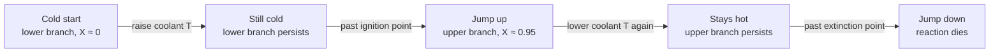

## ビデオ講義

<div class="video-container">
  <iframe
    width="560"
    height="315"
    src="https://www.youtube.com/embed/GIrdjPDTjwY?start=3315"
    title="化学工学反応工学 第5章: 熱効果・安定性・スケールアップ"
    frameborder="0"
    allow="accelerometer; autoplay; clipboard-write; encrypted-media; gyroscope; picture-in-picture"
    allowfullscreen>
  </iframe>
</div>

> このビデオは以下のテキストと同じ内容をカバーしています。お好みの学習形式をお選びください。

---

# 第5章：熱効果・安定性・スケールアップ

ここまでの議論はすべて、温度が自分で選べる数値であるかのように書かれてきました。反応速度式は $T$ を与えられたものとして扱い、理想反応器の設計方程式は $k$ を定数として扱い、選択率と滞留時間分布は条件を固定したうえで論じられてきました。それは教育上の便宜であり、本章はそれを取り下げます。実在の反応器は熱を放出あるいは吸収し、その熱が温度を変え、温度が速度を変えます — このループが、計算した設計点がそもそも存在するのか、反応器がそこに留まるのか、そしてパイロット機の快適なふるまいが体積 1,000 倍の増大を生き延びるのかを決めます。

**反応器が行儀よくふるまうかどうかを決めるエネルギー収支**

## 学習目標

本章を修了すると、以下ができるようになります:

  * ✅ 速度の温度依存性が指数関数的であることによって、エネルギー収支が付随的な計算ではなく設計上の制約になる理由を説明できる
  * ✅ 断熱温度上昇を計算し、その化学反応が本質的に寛容なのか本質的に危険なのかを判断するのに使える
  * ✅ 冷却された CSTR について発熱と除熱を描き、定常状態をその交点として位置づけられる
  * ✅ 安定性に関する古典的な傾きの判定条件を述べ、3 つの定常状態のうちどれが不安定かを特定できる
  * ✅ 代表的な暴走反応の引き金と、そのそれぞれに答える防御的な設計上の対策を挙げられる
  * ✅ スケールアップで比表面積（表面積/体積比）が下がる理由と、それが冷却の余裕に何をもたらすかを説明できる
  * ✅ 反応器温度と熱収支ソフトセンサーが、早期警報の計装としてどのように働くかを述べられる

**読了時間**: 20-25分 **コード例**: 1 **演習**: 3

* * *

## 5.1 熱が反応器の最大のリスクである理由

[第1章](chapter-1.html) のアレニウス式に戻りましょう:

$$ k(T) = k_0 \exp\!\left(-\frac{E}{RT}\right) $$

反応器設計に現れる他のあらゆる量は、入力に対して行儀よく応答します。CSTR の体積を 2 倍にすれば転化率は上がりますが、その伸びは線形以下です。供給流量を半分にすれば、滞留時間はちょうど 2 倍になります。温度だけが例外です。速度は温度に *指数関数的に* 依存し、多くの液相有機反応では、おなじみの経験則がその依存の激しさを言い当てています。活性化エネルギーが 50–60 kJ/mol 程度なら常温付近で 10 K あたりおよそ 2 倍、同じくらいよくある 80 kJ/mol の反応ではそれよりかなり大きく、3 倍近くになります（[第1章](chapter-1.html)）。

ここにエネルギー収支を結びつけます。発熱反応は、反応が速く進むほどそれに比例して熱を放出します。その熱が温度を上げます。温度が上がれば速度が上がります。速度が上がればさらに多くの熱が出ます。**反応の出力が自らの入力を養う** のです。しかも指数関数を通して。そしてその行く手に立ちはだかっているのは、冷却系だけです。

反応工学におけるエネルギー収支が、*化学工学熱力学* におけるようなきちんとした帳簿付けの作業ではないのは、このためです。あちらでは、それは熱負荷がいくらになるかを教えてくれるものでした。ここでは、設計点が **そもそも存在するのか**、反応器がそこに **留まる** のか、そして自分が崖のふちからどれだけ近いところで運転しているのかを教えます。転化率だけでサイジングした反応器は、設計ではありません — 設計の半分です。

吸熱反応は、同じ論理によって自己制限的です。反応が自分自身を冷やし、速度が落ち、プロセスは失速します。失速は経済上の問題であって、安全上の問題ではありません。**劇的な出来事のほぼすべては発熱反応のもの** であり、本章の残りはそこに住んでいます。

## 5.2 断熱温度上昇

発熱を伴う化学反応について最初に計算すべき数値は、**冷却がまったくない** 状態で完全に転化したときにバッチが到達する温度です。放出される熱を、混合物が吸収する顕熱と等しく置きます:

$$ \Delta T_{\text{ad}} = \frac{(-\Delta H_{\text{rxn}})\, C_{A0}}{\rho\, c_p} $$

**計算例。** 液相の原料で $C_{A0} = 2$ mol/L $= 2{,}000$ mol/m³、反応エンタルピー $\Delta H_{\text{rxn}} = -100$ kJ/mol、そして $\rho \approx 1{,}000$ kg/m³、$c_p \approx 4.18$ kJ/(kg·K) の水に似た溶媒をとります:

$$ \Delta T_{\text{ad}} = \frac{100{,}000 \times 2{,}000}{1{,}000 \times 4{,}180} \approx 48\ \text{K} $$

約 48 K です。これが何を意味するかを読み取ってください。反応器に仕込んだ瞬間に冷却を失えば、内容物は出発点より約 48 K 高い温度に行き着きます — 居心地はよくありませんが、常温付近から出発し、高沸点の溶媒を使っている容器であれば、乗り切れる範囲です。

ここで式の構造に注目してください。$\Delta T_{\text{ad}}$ は **$C_{A0}$ に対して線形** です。同じ化学反応を 4 mol/L で行えば約 96 K、8 mol/L では約 190 K になります。1 mol あたりの反応エンタルピーはまったく変わっていません — 変わったのは、液体 1 m³ の中にその mol 数がいくつ入っているか、それだけです。物質収支の上では不活性な無駄容積に見えていた溶媒が、エネルギー収支の上では構造的な仕事をしているのです。

**したがって希釈は安全上の変数であって、反応器容量の浪費ではありません。** これはプロセス安全における数少ない、本当に安価なてこの 1 つです。溶媒を加えれば最悪ケースの逸脱が比例して下がり、その代償は処理量と下流の分離負荷です。そのトレードオフこそ、$\Delta T_{\text{ad}}$ が判断材料として存在する理由であり、通常は化学反応そのものがまだ交渉可能な早い段階で決められます。

正直な但し書きが 2 つあります。この計算は、放出された熱がすべて液体の顕熱になると仮定しています — 蒸発もなければ、容器壁への熱移動もありません。そして、その上昇が *どれだけ速く* 起こるかについては何も語りません。8 時間かけて 48 K に達するゆっくりした発熱と、90 秒で同じ温度に達する速い発熱は、同じ $\Delta T_{\text{ad}}$ を持つ別々の問題です。

## 5.3 冷却された CSTR: 発熱・除熱・多重定常状態

ここで、[第2章](chapter-2.html) でサイジングしたような冷却付きの CSTR に、この発熱反応を入れます。ジャケットまたはコイルは、*化学工学伝熱* [第1章](../chemical-engineering-heat-transfer/chapter-1.html) の総括伝熱係数 $U$ と伝熱面積 $A$ で特徴づけられます。定常状態では、発生した熱は除去された熱と等しくなければなりません。それぞれの側を、反応器温度の関数として書き下します。

**発熱。** 一次反応では、滞留時間 $\tau$ の CSTR における定常状態の転化率は $X(T) = k(T)\tau/[1 + k(T)\tau]$ なので、

$$ G(T) = (-\Delta H_{\text{rxn}})\, v_0 C_{A0}\, X(T) $$

これを $T$ に対してプロットすると、**S 字型の曲線** — 発熱曲線 — になります。低温では $k\tau \ll 1$ で転化率は無視できるほど小さく、$G$ はほぼ平坦でほぼゼロです。温度が上がるとアレニウス因子が主導権を握り、$G$ は急峻に立ち上がります。そののち再び平坦になりますが、それは反応速度論が鈍るからではなく、**反応物が尽きる** からです。$X \to 1$ になれば取り出せる熱はもう残っておらず、$G$ は $(-\Delta H_{\text{rxn}}) v_0 C_{A0}$ で飽和します。加速、そして枯渇 — これが S 字の正体です。

**除熱。** 熱は冷却面から出ていくほか、冷たく入って熱く出ていく製品流とともにも運び出されます:

$$ R(T) = UA\,(T - T_c) + v_0 \rho c_p\,(T - T_0) $$

どちらの項も $T$ に対して **線形** です。したがって $R(T)$ は傾き $UA + v_0 \rho c_p$ の **直線** — 除熱直線 — であり、冷却面の寄与と流れの顕熱の項がそのまま足し合わされています。$UA$ を大きくすれば傾きが急になり、冷媒温度 $T_c$ を上げれば右へずれます。

**直線は S 字曲線を 1 点、2 点、あるいは 3 点で切ることができます。** 交点はそれぞれ定常状態であり、**多重定常状態（複数定常状態）** は、冷却された発熱 CSTR に実際に現れ、日常的に観察される性質です — 数学上の物珍しさではありません。交点が 2 つの場合は、残る 2 つの場合のあいだにある、きわどい接触の状態です。

交点が 3 つの場合を、例示用のパラメータ一式について 5.6 節で計算した結果として示します:

| 定常状態 | $T$ (K) | 転化率 $X$ | 放出熱 | 性格 |
|---|---|---|---|---|
| 下側（「消火」した状態） | ≈ 300 | ≈ 0.001 | ≈ 0.3 kW | 反応は事実上停止。冷たくて役に立たない |
| 中間 | ≈ 359 | ≈ 0.73 | ≈ 293 kW | **不安定** — 制御なしには維持できない |
| 上側（「着火」した状態） | ≈ 376 | ≈ 0.95 | ≈ 380 kW | 高温・高転化率。生産的な分枝 |

**安定性の判定条件。** 古典的な CSTR の安定性解析 — 通常 *van Heerden* の議論と呼ばれるもの — は、小さな温度の逸脱のあとに何が起こるかを問います。反応器を交点より少しだけ上へ押しやってみます。発熱は S 字曲線に沿って上がり、除熱は直線に沿って上がります。もし **除熱のほうが発熱よりも速く上がる** なら、余分な熱は運び去られ、逸脱は減衰し、その状態は安定です。発熱のほうが速く上がるなら、逸脱は自らを養い、反応器はその点から離れていきます。したがって条件は次のようになります:

$$ \left.\frac{dR}{dT}\right|_{T_s} > \left.\frac{dG}{dT}\right|_{T_s} \qquad \text{(古典的判定条件)} $$

これは小さな逸脱に対する安定性の **必要条件** として扱ってください。完全な保証ではありません。これは静的な、傾きに基づく議論です。完全な動的取り扱いでは反応器の熱的・物質的な時定数が入り、傾きの検定では見えない振動的な破綻様式が加わることもあります。しかしこの条件は本質的な物理を捉えており、実務家が実際にこれを使って考えています。

これを表に当てはめてみましょう。下側の状態では発熱曲線がほとんど平坦なので、どんな除熱直線でもそれに勝ちます: **安定**。上側の状態では発熱曲線はすでに飽和しており、その傾きは再び小さくなっています: **安定**。中間の状態では発熱曲線が最も急であり — 直線が 3 度目に交わることができるのは、まさにそのためです — 発熱が除熱を追い越します: **不安定**。定常状態が 3 つあるとき、中間の 1 つが不安定で、外側の 2 つが安定です。これが一般的な結論であり、この形のまま記憶しておく価値があります。

**着火・消火・ヒステリシス。** 中間の分枝は維持できないので、反応器の履歴が意味を持ちます。冷たい状態から起動して冷媒をゆっくり昇温していくと、反応器は下側の分枝をたどり — ほとんど反応しないまま — 除熱直線が発熱曲線の低いところを切らなくなる点を冷媒温度が越えるまで、そのままです。そこで下側の定常状態が消滅し、反応器は **着火** して上側の分枝へ飛び移ります。今度は冷やして戻してみます。同じ点で飛び戻ることは *ありません*。上側の交点が今度は消えるまで上側の分枝にしがみつき、そこで **消火** します。着火点と消火点は異なっており、その間のループが **ヒステリシス** です。



ここから実務上の帰結が 2 つ出てきます。**起動は設計された軌道であって、後付けの手順ではありません** — 運転点へ至る経路が、どちらの分枝に到達するかを決めます。そして **危険なのは折り返し（フォールド）です**。ここははっきり述べておくべき点です。よく誤解されるからです。発熱 CSTR は、その構造からして不安定なわけでは **ありません**。何千という数の発熱 CSTR が、何年ものあいだ安定に連続運転されています。具体的な危険は狭く、特定できるものです — 小さな外乱が分枝を切り替えてしまう消火側または着火側の折り返し（フォールド）の近くで運転すること、そして冷却を失うこと。冷却を失えば除熱直線は寝てしまい、冷たい側の分枝が消える一方で、高温の定常状態は設計温度をはるかに超えるところまで移動していきます。

## 5.4 暴走反応とその引き金

**熱暴走（暴走反応）** とは、発熱が除熱を上回り、その差が縮まるどころか広がっていくときに起こることです。温度が上がり、アレニウス因子が速度を増幅し、差はさらに広がり、逸脱は何かがそれを止めるまで加速し続けます — 反応物の枯渇、沸騰、緊急放出（リリーフ）系、あるいは容器そのものが止めるまで。ひと握りの引き金が、事故の大半を説明します。

**冷却の喪失。** ポンプの停止、閉まった弁、汚れたジャケット、冷媒供給の途絶。5.3 節の描像でいえば、$UA$ がゼロへ向かって崩れ、除熱直線はほぼ水平になり、最も高い交点を除くすべての交点が消えうる状況です。反応器はそこから断熱の場合へと向かっていきます — $\Delta T_{\text{ad}}$ を最初に計算する理由がこれであり、反応器ジャケットの汚れ監視が保全上の心配りではなく安全機能である理由でもあります。

**セミバッチにおける原料の蓄積。** セミバッチの滴下は、暴走を *避ける* ために存在します。試薬をゆっくり加えることで、ジャケットが追随できる速度で熱を放出させるのです。この保護は、加えた試薬がすみやかに反応することに依存しています。もしそうならなければ — 触媒が入れ忘れられていた、温度が低すぎる、阻害剤が存在する — 試薬はただ **蓄積** します。運転員には静かで冷たい容器が見えており、当然のように滴下を続けます。ようやく反応が開始したとき、蓄積した在庫のすべてが一度に転化し、実効的な $\Delta T_{\text{ad}}$ は、本来存在しているはずだった少量ではなく、容器の中にあるすべてによって決まります。蓄積は、最も安全な反応器の構成を最も危険な構成へと変えてしまうのであり、その兆候は、滴下期間中の温度応答が予想より **大きい** ことではなく **小さい** ことです。

**スケールアップでの不意打ち。** パイロット機は何か月も無事故で運転できたのに、実機は高温になる。それが不運ではなく構造的なものである理由は、5.5 節が説明します。

防御的な設計は、それぞれの引き金に直接答えます:

| 対策 | 何に対する防御か | 代償 |
|---|---|---|
| **希釈** | $\Delta T_{\text{ad}}$ を比例して下げる（5.2 節） | 処理量、下流の分離負荷 |
| **セミバッチ滴下** | 一度に反応しうる試薬の在庫量を制限する | サイクルタイム。機能させるには蓄積の監視が必要 |
| **緊急クエンチ（急冷）またはダンプ** | 逸脱が始まったあとに反応を止める — 冷たい希釈剤、阻害剤の注入、クエンチタンクへの投下 | 設備費、バッチの損失。想定で済ませず試験しておかねばならない |
| **伝熱面積の増加** | 除熱直線の傾きを急にする（内部コイル、外部ループ） | 設備費、製作の複雑さ、洗浄アクセス |

暴走反応に対する圧力の緊急放出（リリーフ）系のサイジングは、それ自体が独自の方法論と熱量測定試験の要件を持つ専門分野であり、ここでは扱いません。

## 5.5 スケールアップ: 消えていく伝熱面積

数多くのスケールアップの失敗の背後にある、幾何学的な事実がこれです。熱は反応器の **体積** の中で発生し、その **表面** を通して除去されます。幾何学的相似のもとでは、体積は代表寸法の 3 乗で増えるのに対し、表面積は 2 乗でしか増えません。したがって

$$ \frac{A}{V} \propto \frac{1}{L} $$

**計算例。** あるプロセスを 10 L のパイロット反応器で開発し、10 m³ で建設するとします — これは 10,000 L であり、体積は **1,000 倍** です。$1{,}000 = 10^3$ なので、線寸法のスケール係数は **10 倍**、伝熱面積は $10^2 = 100$ 倍になり、比表面積（表面積/体積比）は約 **10 分の 1** に下がります。

これを冷却の負荷として読み替えてください。単位体積あたりの発熱量は化学反応の性質であり、スケールによって変わりません。単位体積あたりの冷却能力は、およそ 10 分の 1 に落ちました。**パイロット機の冷却の余裕は、静かに消えてしまった** のです — 何かの設計が悪かったからではなく、相似に設計されたからです。パイロットスケールでは快適だったジャケット温度が、実機スケールでは不可能な温度になり、実機はパイロット機が経験したことのないほど 5.3 節の折り返し（フォールド）に近いところで運転していることに気づきます。

同じ算術が、小さな容器がなぜあれほど寛容なのかも説明します。実験室のフラスコは単位体積あたりの表面積が莫大で、室内へ熱を捨てています。まったく同じ化学反応でも、反応器の中では、同じ時間スケールで見れば事実上断熱です。**「実験室では一度も面倒を起こさなかった」化学反応は、実機容器の中でのふるまいについて、ほとんど何の情報も持っていません。**

緩和策はいずれも定性的で、いずれも何かを差し出すものです:

  * **内部コイル** は体積の内側に伝熱面積を加え、幾何学的相似を望ましい方向に破ります — その代償は、洗浄アクセス、撹拌の質、そして多品種対応の柔軟性です。
  * **外部循環ループ** は反応器の内容物をポンプで正規の熱交換器へ送って戻すので、伝熱面積は容器ではなく熱交換器とともにスケールします。その代価は、ポンプ、容器の外に出る保有量、そして循環が止まったときの新たな故障様式です。
  * **セミバッチ運転** は冷却を増やすのではなく、需要のほうを下げます。同じ総発熱量をより長い時間に引き伸ばすことで、使える伝熱面積で足りるようにします。
  * **連続運転** は面積ではなく保有量を攻めます。同じトン数を、任意の瞬間にはるかに少ない反応中の質量で作るので、最悪ケースの放出熱量が小さくなります。

この 4 つのうち 3 つは、そもそも伝熱の改善ではありません。熱が *いつ*、*どこで* 現れるかの組み替えです — 幾何学的相似こそが敵だと認識できたあとは、たいていこちらのほうが実り多い方向です。

## 5.6 デジタルの層

反応器の計装は、望ましい水準に比べれば疎です。本当に重要な量である組成は、通常、数十分から数時間の周期で返ってくるオフライン分析によって測定され、ときにはバッチあたり 1 回しか測られません。対照的に、温度は連続的に、安価に、そして信頼できる形で測定されています。転化率と温度はエネルギー収支を通して結合しているので、**反応器温度はたいていの場合、利用できる最も速い組成の代理指標** であり、しばしば反応器が発するただ 1 つのほぼリアルタイムの信号です。

だからこそ、温度のトレースは制御ループの設定値偏差以上の価値を持ちます。そこから取り出す価値のある派生信号が 2 つあります。

**熱収支ソフトセンサー。** 除熱側の量は、どのみちすべて計装されています。冷媒流量、冷媒の入口温度と出口温度、反応器温度、供給流量です。したがって、実際に放出されている熱は、日常の測定値から **逆算** できます:

$$ \dot{Q}_{\text{gen}} \approx \underbrace{\dot{m}_c c_{p,c}(T_{c,\text{out}} - T_{c,\text{in}})}_{\text{冷媒が持ち去る分}} \;+\; \underbrace{\rho V c_p \frac{dT}{dt}}_{\text{内容物に蓄積する分}} \;+\; \underbrace{v_0 \rho c_p (T - T_0)}_{\text{製品とともに出ていく分}} $$

これはまさに *化学工学伝熱* [第5章](../chemical-engineering-heat-transfer/chapter-5.html) の論理であり、あそこでは $U$ が 4 つの温度と 2 つの流量から逆算され、トレンドを取られていました。ここで推定される量は反応の瞬間発熱速度です — そして発熱は反応速度に比例するので、$\dot{Q}_{\text{gen}}$ はすでに設置されている計器から組み立てられた **速度計** になります。セミバッチの滴下においては、これが蓄積を直接に検定する手段です。滴下は進んでいるのに $\dot{Q}_{\text{gen}}$ がそれに追随していなければ、未反応の試薬が積み上がっています。ソフトセンサーにつきものの破綻様式も、そのまま抱えています — 冷媒流量計のドリフトや保護管（サーモウェル）の汚れは、本物のプロセス変化とまったく同じように推定を劣化させます。

**早期警報のサイン。** 2 つのパターンには、それ専用の警報を与える価値があります。**温度の加速** — 冷却がすでに最大であるのに $d^2T/dt^2$ が正でしかも増大していること — は暴走そのもののサインであり、絶対的な温度の上限が破られるより前に現れます。**冷却負荷のじりじりとした増加（クリープ）** — 同じ反応器温度を保つために、バッチごとに冷媒弁の開度が少しずつ大きくなっていくこと — はジャケットの汚れが $UA$ を蝕んでいるということであり、除熱直線がゆっくり寝ていっているということです。どちらも高温警報には手遅れになるまで現れません。どちらも水準ではなくトレンドだからです。

以下のコードは 5.3 節の描像を明示的に計算します。温度をスキャンし、発熱曲線と除熱直線が交わる場所を見つけ、それぞれの交点で傾きの検定を適用します。

```python
import numpy as np

# ---------------------------------------------------------------------------
# ILLUSTRATIVE PARAMETERS -- chosen for teaching, not measured on any real
# reactor. First-order exothermic reaction A -> B in a cooled CSTR.
# ---------------------------------------------------------------------------
V = 1.0            # reactor volume [m3]
v0 = 1.0e-3        # volumetric feed rate [m3/s]
TAU = V / v0       # mean residence time [s]

C_A0 = 2000.0      # feed concentration [mol/m3]
DH = -200_000.0    # reaction enthalpy [J/mol] (negative = exothermic)
RHO = 1000.0       # density [kg/m3]
CP = 2000.0        # specific heat [J/(kg.K)]

K0 = 4.0e15        # pre-exponential factor [1/s]
E_OVER_R = 15_000.0  # activation temperature E/R [K]

T0 = 300.0         # feed temperature [K]
TC = 300.0         # coolant temperature [K]

DT_AD = (-DH) * C_A0 / (RHO * CP)
FLOW = v0 * RHO * CP          # sensible-heat slope [W/K]
G_MAX = (-DH) * v0 * C_A0     # generation at full conversion [W]


def conversion(T):
    """Steady-state conversion of a first-order reaction in a CSTR."""
    kt = K0 * np.exp(-E_OVER_R / T) * TAU
    return kt / (1.0 + kt)


def generation(T):
    return G_MAX * conversion(T)


def removal(T, UA, Tc=TC):
    return UA * (T - Tc) + FLOW * (T - T0)


def crossings(UA, Tc=TC, T_lo=290.0, T_hi=460.0, n=170_001):
    T = np.linspace(T_lo, T_hi, n)
    f = generation(T) - removal(T, UA, Tc)
    out = []
    for i in np.where(np.sign(f[:-1]) != np.sign(f[1:]))[0]:
        a, b = T[i], T[i + 1]
        for _ in range(80):
            m = 0.5 * (a + b)
            if np.sign(generation(a) - removal(a, UA, Tc)) == np.sign(
                    generation(m) - removal(m, UA, Tc)):
                a = m
            else:
                b = m
        out.append(0.5 * (a + b))
    return out


def slopes(T, UA, h=1e-3):
    dG = (generation(T + h) - generation(T - h)) / (2 * h)
    return dG, UA + FLOW


print(f"adiabatic temperature rise  dT_ad = {DT_AD:.0f} K")
print(f"generation at full conversion      = {G_MAX/1000:.0f} kW")
print(f"flow sensible-heat slope           = {FLOW:.0f} W/K")
print()

for UA, Tc, label in ((12_000.0, 300.0, "heavy cooling, cold jacket"),
                      (3_000.0, 300.0, "modest cooling, cold jacket"),
                      (12_000.0, 355.0, "heavy cooling, tempered jacket")):
    Ts = crossings(UA, Tc)
    print(f"UA = {UA:>7.0f} W/K   Tc = {Tc:.0f} K   removal slope ="
          f" {UA + FLOW:>6.0f} W/K   -> {len(Ts)} steady state(s)   [{label}]")
    for T in Ts:
        dG, dR = slopes(T, UA)
        verdict = "stable" if dR > dG else "UNSTABLE"
        print(f"    T = {T:7.2f} K   X = {conversion(T):5.3f}"
              f"   Q = {generation(T)/1000:6.1f} kW"
              f"   dG/dT = {dG:7.0f}   dR/dT = {dR:6.0f}   {verdict}")
    print()

# adiabatic temperature rise  dT_ad = 200 K
# generation at full conversion      = 400 kW
# flow sensible-heat slope           = 2000 W/K
#
# UA =   12000 W/K   Tc = 300 K   removal slope =  14000 W/K   -> 1 steady state(s)   [heavy cooling, cold jacket]
#     T =  300.02 K   X = 0.001   Q =    0.3 kW   dG/dT =      52   dR/dT =  14000   stable
#
# UA =    3000 W/K   Tc = 300 K   removal slope =   5000 W/K   -> 3 steady state(s)   [modest cooling, cold jacket]
#     T =  300.06 K   X = 0.001   Q =    0.3 kW   dG/dT =      52   dR/dT =   5000   stable
#     T =  358.67 K   X = 0.733   Q =  293.4 kW   dG/dT =    9119   dR/dT =   5000   UNSTABLE
#     T =  375.97 K   X = 0.950   Q =  379.8 kW   dG/dT =    2032   dR/dT =   5000   stable
#
# UA =   12000 W/K   Tc = 355 K   removal slope =  14000 W/K   -> 1 steady state(s)   [heavy cooling, tempered jacket]
#     T =  373.95 K   X = 0.938   Q =  375.3 kW   dG/dT =    2487   dR/dT =  14000   stable
```

3 つのブロックを順に読んでください。冷たいジャケットに対して $UA = 12{,}000$ W/K だと、除熱直線は発熱曲線がとりうるどの傾きよりも急なので、定常状態はちょうど **1 つ** です — しかもそれは供給温度にあり、転化率は 0.1% です。安全だが役に立たない。冷やしすぎは反応を飼いならすのではなく、反応そのものを起こさせません。$UA = 3{,}000$ W/K まで落とすと、直線は S 字を 3 回切れるだけ緩やかになります。中間の交点は $dG/dT = 9{,}119$ W/K に対して $dR/dT = 5{,}000$ W/K であり、5.3 節が予測したとおり判定条件を満たしません。一方、外側の 2 つの状態はどちらも満たします。3 番目のブロックは大きな伝熱面積を保ったまま冷媒を 355 K まで上げたもので、これによって急峻な除熱直線が右へ滑り、S 字曲線を高いところで **1 回だけ** 切るようになります。転化率は 94%、安定性の余裕は十分です。うまく立てられた設計とはこういうものです。収まるうちで最小のジャケットでもなく、最大のジャケットでもなく、唯一の交点が望みの交点になるように除熱直線を置くこと、です。

このモデルを正直に保つための但し書きが 2 つあります。上のパラメータはすべて例示用であり、実際の値は、もっともらしく見える頻度因子からではなく、熱量測定から得られます。そしてこのモデルは定常状態だけを扱います。交点を見つけ、小さな逸脱に対してそれらを検定しますが、分枝と分枝のあいだの *経路* については何も語りません。起動の軌道や暴走の時間スケールが実際に住んでいるのは、まさにそこです。

## 5.7 シリーズのまとめ

5 つの章を、1 章 1 文で。**第 1 章** は反応速度式を組み立てました — 反応次数、速度定数、そして本章で舞い戻って主役となった、アレニウス型の温度依存性です。**第 2 章** は理想反応器、すなわち回分・CSTR・PFR を導き、同じ反応速度論がそれぞれでまったく異なる体積を与えることを示しました。**第 3 章** は複数反応へ向かい、そこでは目的が転化率ではなく **選択率** であり、反応器の仕事は一方の経路を他方より優遇することでした。**第 4 章** は実在の容器が理想的でないことを認め、**滞留時間分布** を用いてバイパスとデッドゾーンを診断し、その帰結の範囲を見積もりました。**第 5 章** はエネルギー収支を加え、それとともに、設計点が存在するのか、保たれるのか、そしてスケールアップを生き延びるのか、という問いを加えました。

本シリーズをもって、**古典的な基礎のトラックが完成** します。*化学工学入門* はフローシートと、収支に基づく考え方を示しました。*化学工学熱力学* は、他のすべてが呼び出す平衡と物性モデルを提供しました。*化学工学流体力学*、*化学工学伝熱*、そして *化学工学物質移動と分離* は、運動量・エネルギー・成分の輸送を扱いました。そして本シリーズは、組成が意図的に変わる段階を扱いました。プラントとは、この 6 つの科目を特定の順序に並べ、配管でつないだものです。

その上に載っているのが、データ駆動の層です。*プロセス・インフォマティクス入門*（[シリーズ目次](../pi-introduction/index.html)）はプロセスデータがどう集められ、洗浄され、モデル化されるかを扱い、*プロセスモニタリング・制御入門*（[シリーズ目次](../process-monitoring-control-introduction/index.html)）は、それらのモデルを稼働中のプラントが実際に動くものへ変える計装と制御を扱います。この関係は正確に述べておく価値があります。センサーとモデルは、熱力学・輸送現象・反応速度論が定める天井の **下** で最良の運転点を見つけさせてくれます — 天井そのものを上げてくれるわけではありません。天井がどこにあり、それがなぜそこにあるのかを知ること。6 つの古典シリーズは、そのためにありました。

最後までお読みいただきありがとうございました。

## 演習問題

1. **定量 — 断熱温度上昇**: ある液相の発熱反応を、$\rho \approx 900$ kg/m³、$c_p \approx 2.1$ kJ/(kg·K) の有機溶媒中で $C_{A0} = 1.5$ mol/L にて行います。反応エンタルピーは $\Delta H_{\text{rxn}} = -75$ kJ/mol です。(a) $\Delta T_{\text{ad}}$ を見積もりなさい。(b) 容器は 300 K で仕込まれ、溶媒は約 355 K で沸騰します。冷却が完全に失われた場合について論じなさい。(c) $\Delta T_{\text{ad}}$ を約 40 K 以下に抑えるには供給濃度をいくらにすればよく、その代償は何ですか。
   *ヒント*: $\Delta T_{\text{ad}} = (-\Delta H_{\text{rxn}}) C_{A0} / (\rho c_p)$ を $C_{A0}$ を mol/m³ 単位で用いること。また結果が $C_{A0}$ に対して線形であることに注意すること。
   *解答*: (a) $\Delta T_{\text{ad}} = (75{,}000 \times 1{,}500)/(900 \times 2{,}100) = 1.125\times10^8 / 1.89\times10^6 \approx \mathbf{60\ K}$（丸める前は 59.5 K）。(b) 沸騰までの余裕は $355 - 300 = 55$ K であり、これは **$\Delta T_{\text{ad}}$ より小さい** 値です。冷却が完全に失われた場合、バッチは反応物が尽きる前に沸騰に達するので、逸脱の行き着く先は単なる高温の容器ではなく、**蒸気発生と昇圧の事象** です — 質的に異なるハザードであり、緊急放出（リリーフ）系のサイジングが存在するのは、まさにこの場合のためです。さらに、沸騰は潜熱を吸収することで温度に上限を与えるので、温度に対しては保護的に働き、圧力に対しては危険であることにも注意してください。(c) 線形性から $C_{A0} = 1{,}500 \times (40/59.5) \approx 1{,}008$ mol/m³、すなわち **約 1.0 mol/L** — 仕込み濃度を 3 分の 1 下げることになります。その代償は、同じサイクルタイムでバッチあたりの生産量がおよそ 3 分の 1 失われること、そして下流で回収すべき溶媒が増えることです。それが正しいトレードオフかどうかは代替案（セミバッチ滴下、伝熱面積の増加）次第ですが、そのトレードオフを目に見えるものにするのが、この計算です。

2. **概念 — 安定性の描像を読む**: ある冷却された CSTR について、発熱曲線は 300 K でほぼゼロから立ち上がり、約 340 K から 370 K のあいだで急峻に上昇し、約 385 K より上では 400 kW 近くで平坦になります。除熱直線はこれを 3 つの温度で横切ります: 301 K、359 K、376 K。(a) どの交点が安定でどれがそうでないか、そしてどのような議論によってそう言えるかを述べなさい。(b) 反応器は 376 K で運転されており、そこでジャケットの汚れによって $UA$ が 30% 減少しました。除熱直線と各定常状態に何が起こるかを説明しなさい。(c) 冷たい状態から冷媒をゆっくり昇温していく運転員と、熱い状態からゆっくり降温していく運転員とが、まったく同じ冷媒温度でありながら異なる定常状態に行き着きうる理由を説明しなさい。
   *ヒント*: 各交点で $dR/dT$（定数、すなわち直線の傾き）と $dG/dT$（S 字曲線のその場所での傾き）を比べること。
   *解答*: (a) **301 K と 376 K は安定、359 K は不安定です。** 301 K では発熱曲線がほとんど平坦なので $dG/dT$ はごく小さく、除熱直線の傾きが楽にそれを上回ります — 小さな上向きの逸脱は、発生するより速く除去されて減衰します。376 K では反応物の枯渇によって曲線が再び平坦になっているので、ここでも $dR/dT > dG/dT$ です。359 K では曲線が急峻な領域にあり、$dG/dT$ が直線の傾きを上回ります。小さな昇温の逸脱は、除去される以上の余分な熱を生み、成長します。これが古典的判定条件であり、定常状態が 3 つあるときに **中間の 1 つが必ず不安定** である理由です。(b) $UA$ を 30% 減らすと **除熱直線は寝ます**（その傾きは $UA + v_0\rho c_p$ なので、減少は $UA$ の部分にだけ効きます）。さらに $T > T_c$ であるところではどこでも直線が下がるので、交点どうしは近づくのではなく **離れます**。5.6 節の例示用パラメータでいえば、$UA$ を 3,000 から 2,100 W/K に切り下げると、中間の状態は約 359 K から約 351 K へ下がり、運転点である上側の状態は約 376 K から約 397 K へ上がります。運転点は静かに高温側へ漂っていき、その一方で安定性の余裕 $dR/dT - dG/dT$ は縮んでいきます。汚れが進行した果てに消滅させるのは **下側と中間** の交点の対 — 着火側の折り返し（フォールド） — であり、冷たく安全な分枝が失われて、高温の分枝が唯一とりうる定常状態として残ります。したがってハザードは、運転温度が材料・沸騰・選択率の限界へ向かってじりじりと上方へ移動していくことです。分枝の移動によるスローモーションの暴走であり、駆動しているのは純粋に汚れだけで、故障事象は何も起きていません。逆算した $UA$ が保全指標ではなく安全上のトレンドである理由が、これです。(c) 中間の分枝には留まれないので、反応器は外側のどちらかの分枝に乗っているほかなく、どちらに乗るかは **もともとどちらに乗っていたか** で決まります — 5.3 節のヒステリシスです。冷たい状態から昇温していけば、下側の交点が **着火** 点で消えるまで下側の分枝に留まります。熱い状態から降温していけば、上側の交点が **消火** 点で消えるまで上側の分枝に留まります。この 2 つは異なる冷媒温度で起こるので、その間では 2 つの安定な状態が共存し、履歴がどちらかを選びます。実務的にいえば、起動手順は設計の一部だということです。

3. **定量 — スケールアップと消えていく伝熱面積**: あるプロセスを 25 L の幾何学的に相似なパイロット反応器で実証し、5 m³ で建設しようとしています。(a) 体積、線寸法、伝熱面積はそれぞれ何倍になり、比表面積（表面積/体積比）はどうなりますか。(b) パイロット機は約 20 K のジャケット側駆動力で余裕をもって除熱できていました。幾何学的相似のもとで、同じ体積あたりの発熱を除去するために実機はどれだけの駆動力を必要とし、それは現実的ですか。(c) 緩和策を 2 つ提案し、それぞれが何を差し出すことになるかを述べなさい。
   *ヒント*: 5 m³ は 5,000 L です。線寸法の倍率は体積比の 3 乗根を取ること。
   *解答*: (a) 体積は $5{,}000/25 = \mathbf{200\ 倍}$ になります。線寸法の倍率は $200^{1/3} \approx \mathbf{5.85\ 倍}$ なので、面積は $200^{2/3} \approx \mathbf{34\ 倍}$ になります。したがって比表面積（表面積/体積比）は約 $200/34 \approx \mathbf{5.9\ 分の\ 1}$ に下がります — 反応している体積あたりの冷却面積が、ざっと 6 分の 1 に失われるということです。(b) 単位体積あたりの発熱は化学反応が決めるものであって変わらないので、比面積がおよそ 6 分の 1 になれば、同じ $Q/V$ を得るには **駆動力がおよそ 6 倍** 必要になります。ざっと $20 \times 5.85 \approx \mathbf{117}$ K です。これは **現実的ではありません** — 反応温度より 100 K 以上も低い冷媒が要求されることになり、たいていの水系や温水系のユーティリティにそのようなものは存在せず、いずれにせよ壁面の液膜を凍結させたり汚したりして、壁面温度が選択率に及ぼす深刻な影響を招きます。正直な結論は、ここでは幾何学的相似が **破綻している** ということであり、実機の反応器を、単に大きなパイロット反応器にすることはできません。(c) 次のうち任意の 2 つ: **内部コイル** — 容器壁とは独立に伝熱面積を加えられるが、洗浄アクセス、撹拌の質、多品種対応の柔軟性を差し出す。**熱交換器を通る外部循環ループ** — 伝熱面積を容器の形状から完全に切り離せるが、ポンプ、容器外に増える保有量、そして循環喪失という新たな故障様式を差し出す。**セミバッチ滴下** — 供給側を増やすのではなくピークの熱需要を下げるが、サイクルタイムを差し出し、安全であるためには蓄積の監視を必要とする。**連続運転** — 製品あたりの反応中の保有量が小さく、比表面積も本質的に良好だが、開発の手間、ターンダウンの柔軟性を差し出し、まったく異なるプラントになる。
