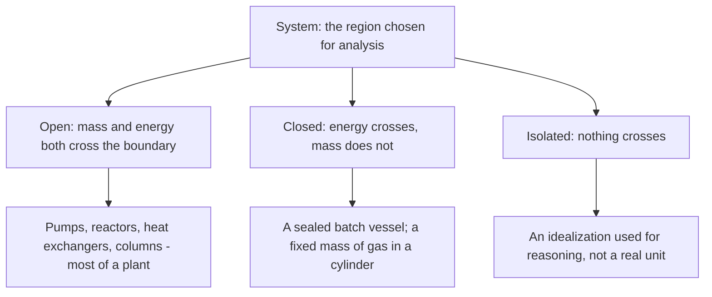
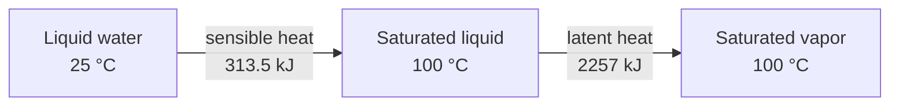

## ビデオ講義

<div class="video-container">
  <iframe
    width="560"
    height="315"
    src="https://www.youtube.com/embed/tGOpNey5U9E"
    title="化学工学熱力学 第1章: エネルギーと熱力学第一法則"
    frameborder="0"
    allow="accelerometer; autoplay; clipboard-write; encrypted-media; gyroscope; picture-in-picture"
    allowfullscreen>
  </iframe>
</div>

> このビデオは以下のテキストと同じ内容をカバーしています。お好みの学習形式をお選びください。

---

# 第1章：エネルギーと熱力学第一法則

本章では、化学工学熱力学の土台を組み立てます。系（system）とは何か、なぜ状態量（state function）がエネルギーの帳簿付けを扱いやすくするのか、そして熱力学第一法則（first law）が、プロセスの運転コストを決めるエネルギー収支へとどう姿を変えるのかを見ていきます。

**状態量、収支、そして熱力学がプラントを動かす理由**

## 学習目標

本章を修了すると、以下ができるようになります:

  * ✅ 熱力学が答えられて反応速度論には答えられない 3 つの問いを説明できる
  * ✅ 系、その境界、そして開いた系・閉じた系・孤立系の違いを定義できる
  * ✅ 状態量と経路関数（path function）を区別し、その区別が実務上なぜ有用なのかを説明できる
  * ✅ 熱力学第一法則を、閉じた系の形（$\Delta U = Q - W$）と定常流れの形（$\Delta H = Q - W_s$）で適用できる
  * ✅ 顕熱（sensible heat）と潜熱（latent heat）を分けて考え、それぞれの大きさを見積もれる
  * ✅ 流量と、温度変化または相変化から、熱交換器やリボイラーの熱負荷（duty）を計算できる

**読了時間**: 20-25分 **コード例**: 1 **演習**: 3

* * *

## 1.1 なぜ化学技術者に熱力学が必要なのか

*化学工学入門* シリーズは、二度とも同じ壁の手前で終わっていました。その第1章では *蓄積 = 入 − 出 + 生成 − 消費* という形の収支を書き、プロセスを建設する価値があるかどうかを決めるのはたいてい**エネルギー**収支だと述べましたが、流れの持つエネルギーがどこから来るのかは語りませんでした。その第2章では、どんな触媒も反応器を**化学平衡**の先へは押し進められないと注意を促しましたが、その限界を何が決めているのかは語りませんでした。熱力学は、その両方の向こう側にあるものです。

熱力学は、どんな速度式にも手の届かない 3 つの問いに答えます:

1. **その変換にはどれだけのエネルギーが必要か、あるいは放出されるか。** 反応速度論は反応がどれだけ速く進むかを教えますが、その間にどれだけの熱を加えたり除いたりしなければならないかを教えるのは熱力学だけです。
2. **どこまで進めるか。** 平衡は熱力学的な限界です。よい触媒はそこへ早く到達させますが、その先へ連れて行くものは何もありません。
3. **どちらの向きが自発的か。** あるプロセスがひとりでに進むのか、それとも駆動してやらなければならないのか — そして最小いくらのコストでか — を決めるのは熱力学第二法則（second law）です（[第2章](chapter-2.html)）。

覚えておく価値のある役割分担はこれです: **反応速度論は速度を、熱力学は可能性と価格を支配する。** 速度を無視した設計は単に遅いだけですが、熱力学に反する設計はそもそも建設できず、どれだけ工学的な努力を注いでも救えません。

## 1.2 系とその状態

熱力学のあらゆる記述は、ひとつの選択から始まります: **何を勘定の対象とするのか。** 選んだ領域が**系**、それ以外のすべてが**外界（surroundings）**、その間にある仮想的な面が**境界（boundary）**です。この境界は自然が与えるものではなく、技術者が引くものです — 熱交換器 1 台の周りに引けばその熱負荷が得られ、プラント全体の周りに引けばサイトのユーティリティ料金が得られます。

系は、境界が何を通すかで分類されます:



連続プロセスの機器は、ほとんどつねに**開いた系（open system）**です。物質が流入・流出する一方で、熱と軸仕事（shaft work）が同じ境界を横切ります。回分式の化学は、**閉じた系（closed system）**の本来の住処です。

### 状態量と経路関数

系の状態を表す物理量は 2 つに分かれます。この 2 つを見分けられることが、本章でいちばん役に立つ技能です。

| | **状態量** | **経路関数** |
|---|---|---|
| **例** | 内部エネルギー $U$、エンタルピー $H$、温度 $T$、圧力 $P$、体積 $V$、エントロピー $S$ | 熱 $Q$、仕事 $W$ |
| **依存するもの** | 現在の状態のみ | そこへ*どうやって*至ったか |
| **表記** | 変化を $\Delta U$、$\Delta H$ と書く | 量として書き、「$\Delta Q$」とは決して書かない |

**状態量**は、系の現在の状態だけで値が決まります。100 °C・1 atm の液体の水は、氷から加熱されて来たのであれ蒸気から凝縮して来たのであれ、ひとつの決まったエンタルピーを持ちます。**経路関数**にはそのような値がありません。系がどれだけの熱を「含んでいる」かを問うことはできず、指定されたプロセスの間に境界をどれだけ横切ったかしか問えないのです。

物理量は大きさによっても分かれます。**示量性（extensive）**の量は物質量とともにスケールし（全体積、全エンタルピー、質量）、**示強性（intensive）**の量はスケールしません（温度、圧力、密度、そして質量で割ったあらゆる示量性の量 — たとえば kJ/kg の比エンタルピー）。プロセスのデータは示強的に示され、その後に流量を掛けます。

この区別が商業的に重要なのは、**状態量の変化は、経路を知らなくても表から計算できる**からです。水を 25 °C から 200 °C・10 bar の蒸気にするのに必要なエネルギーを求めるには、両端の 2 状態だけが必要で、ボイラーの中でたどった道筋は関係ありません。この 1 点だけが、**蒸気表**と**プロセスシミュレータ**を成り立たせています — シミュレータはすべての配管内部の物理をモデル化しているのではなく、入口の状態と出口の状態を引いて差を取っているのです。

## 1.3 熱力学第一法則

熱力学第一法則は、熱と仕事を正直に数え上げたエネルギー保存則です。**閉じた系**に対しては:

$$ \Delta U = Q - W $$

符号の約束は明示しなければなりません。教科書によって異なるからです。ここでは、化学工学の実務の大半と同じく: **$Q$ は熱が系に*入る*ときに正、$W$ は系が外界に*する*仕事を正**とします。入ってくる熱は $U$ を上げ、出て行く仕事は $U$ を下げます。

もっとも、プラントの機器のほとんどは閉じてはいません — 流れています。入口と出口が 1 つずつの**定常状態の開いた系**について、運動エネルギー項と位置エネルギー項を無視すると（通常のプロセス流速と高低差では安全な近似です）、実用形はこうなります:

$$ \Delta H = Q - W_s $$

これは通過する物質の単位質量あたり、あるいは単位モルあたりの式で、$W_s$ はポンプ・圧縮機・タービンとやり取りする**軸仕事**です。

内部エネルギーではなくエンタルピーが現れる理由は、流れる物質が自らの圧力–体積エネルギーを境界の向こうへ運んでいくからです。エンタルピーは定義によってそれを内包しています:

$$ H = U + PV $$

こうして $H$ が流れのプロセスにおける自然なエネルギーの通貨になります。熱交換器、リボイラー、コンデンサーのように軸仕事がまったくない機器では、この式はプロセス工学でもっともよく使われる表現へ縮まります: $Q = \Delta H$。

### 例題：水 1 kg を加熱する

**25 °C** の液体の水 1 kg を、**100 °C**・1 atm の飽和蒸気にします。その経路は、物理的に異なる 2 つのステップに分かれます:



**ステップ 1 — 顕熱**。液体を温める部分で、液体の水について $c_p \approx 4.18$ kJ/(kg·K) を用います:

$$ Q_1 = m\,c_p\,\Delta T = 1 \times 4.18 \times (100 - 25) = 313.5\ \text{kJ} $$

**ステップ 2 — 潜熱**。温度一定のまま沸騰させる部分で、100 °C・1 atm での $\lambda \approx 2257$ kJ/kg を用います:

$$ Q_2 = m\,\lambda = 1 \times 2257 = 2257\ \text{kJ} $$

$$ Q_{\text{total}} = 313.5 + 2257 = 2570.5\ \text{kJ} $$

蒸発のステップには、液体を 75 °C 分だけ温めるのの約 **7.2 倍**のコストがかかります — しかもそれは温度一定で起こるので、エネルギーの大半が投入されている間、温度計は何も示しません。この比こそが、**蒸発と蒸留がプラントのエネルギー予算を支配する**理由です。お金が出て行くのは沸騰させるところなのです。

```python
CP_WATER = 4.18    # kJ/(kg K), liquid water
LAMBDA_100C = 2257 # kJ/kg, latent heat of vaporization at 100 C, 1 atm
T_BOIL = 100.0     # C

print(f"{'T_feed':>7} {'sensible':>9} {'latent':>8} {'total':>8} {'latent_pct':>11} {'ratio':>7}")
for t_feed in [20, 25, 40, 60, 80]:
    sensible = CP_WATER * (T_BOIL - t_feed)   # kJ/kg
    total = sensible + LAMBDA_100C            # kJ/kg
    print(f"{t_feed:7.0f} {sensible:9.1f} {LAMBDA_100C:8.0f} {total:8.1f} "
          f"{100*LAMBDA_100C/total:11.1f} {LAMBDA_100C/sensible:7.2f}")

#  T_feed  sensible   latent    total  latent_pct   ratio
#      20     334.4     2257   2591.4        87.1    6.75
#      25     313.5     2257   2570.5        87.8    7.20
#      40     250.8     2257   2507.8        90.0    9.00
#      60     167.2     2257   2424.2        93.1   13.50
#      80      83.6     2257   2340.6        96.4   27.00
```

この表が**供給液の予熱**について語っていることに注目してください。供給液を 20 °C から 80 °C へ上げるとボイラーの仕事から顕熱分の 250.8 kJ/kg が消えますが、潜熱の 2257 kJ/kg は手つかずのまま残ります。いくら予熱しても、相変化には手が届かないのです。

## 1.4 熱容量と顕熱・潜熱

**比熱容量** $c_p$ は、ある物質 1 kg を定圧下で 1 ケルビン上げるのに必要なエネルギーです。これは物質固有の性質で、温度に対して緩やかに変化します。手計算では、通常その範囲の平均値で十分です。

| 物質の種類 | 典型的な $c_p$ [kJ/(kg·K)] | 典型的な潜熱 [kJ/kg] |
|---|---|---|
| **液体の水** | ≈ 4.18 | 2257（100 °C、1 atm） |
| **有機液体** | ≈ 1.5–2.5 | ≈ 300–900 |
| **気体** | 1 のオーダー | — |

液体の水は際立った例外です。典型的な有機液体のおよそ 2 倍の熱容量を持ち、そのために優れた冷媒であると同時に、沸騰させるには高くつく物質でもあります。

表全体に貫かれているパターンが、本章の実務的な原則です:

> **相変化は高価であり、温度変化は比較的安い。**

有機液体を 50 K という大きな幅で加熱しても、コストはせいぜい 75–125 kJ/kg です。それを沸騰させれば数百 kJ/kg かかります。エネルギーの見積もりが思いのほか大きくなったときに、まず確認すべきは、何かが蒸発させられていないかどうかです。

## 1.5 実務におけるエネルギー収支

フローシートの上では、熱力学第一法則は封筒の裏でもできる算術になります。質量流量 $\dot{m}$ の流れについて:

$$ Q = \dot{m}\,c_p\,\Delta T \quad \text{(相変化なし)} \qquad\qquad Q = \dot{m}\,\lambda \quad \text{(相変化あり)} $$

その結果である**熱負荷（duty）**は、kW や MW で表した必要熱量流量です。これが熱交換器のサイズを決め、蒸気や冷却水の流量を決め、そのまま運転コストの行に載ります。

だからこそ、**蒸留塔のリボイラーとコンデンサーは、たいていフローシート上で最大のユーティリティ消費機器になります**。塔は供給液を温めるだけではありません。塔底で流れを沸騰させ、塔頂でそれをまた凝縮させる、ということを繰り返します。塔に戻された還流は、通過するたびにもう一度蒸発させなければならないからです。数百から数千 kJ/kg の潜熱に、この還流で増幅された塔内流量を掛ければ、塔はポンプも予熱器も、しばしば反応器さえも霞ませてしまいます。

そこで当然の疑問が湧きます。コンデンサーはリボイラーが供給するのとほぼ同じだけのエネルギーを捨てているのだから、片方をもう片方に食べさせればよいのでは、と。実際にできる場合もあります — 熱統合（heat integration）や多重効用蒸発はまさにそれを行います。しかし、どれだけ回収できるかの限界は、第一法則による限界ではありません。第一法則はエネルギーを数えて、それが保存されていることを見出すだけで、40 °C で捨てられる熱が 150 °C で供給される熱より価値が低いとは一言も言いません。その勘定には**エントロピー**が必要です。

## 1.6 本章のまとめ

- 熱力学は、反応速度論には答えられない 3 つの問いに答える: **どれだけのエネルギーか**、**どこまで進めるか**（平衡）、**どちらの向きか**（自発性）。反応速度論は速度を、熱力学は可能性と価格を支配する
- 解析は**境界**を引くことから始まる: 開いた系は物質とエネルギーを、閉じた系はエネルギーだけをやり取りし、孤立系はどちらもやり取りしない。プラントの機器は圧倒的に開いた系である
- **状態量**（$U$、$H$、$T$、$P$、$V$）は現在の状態だけで決まり、**経路関数**（$Q$、$W$）は経路に依存する — だからこそエンタルピー変化は蒸気表から読み取れ、経路をモデル化しなくてもシミュレータで計算できる
- 第一法則、閉じた系: $\Delta U = Q - W$、$Q$ は系に**入る**向きを正、$W$ は系が**する**向きを正とする。定常流れ: $\Delta H = Q - W_s$ で、$H = U + PV$ がエンタルピーを流れプロセスの通貨にしている
- 水 1 kg を 25 °C から 100 °C の飽和蒸気にするには **顕熱 313.5 kJ + 潜熱 2257 kJ = 2570.5 kJ** が必要で、潜熱の項は顕熱の項の約 **7.2 倍**である
- **相変化は高価、温度変化は安い** — 水の $c_p \approx 4.18$、有機物は ≈ 1.5–2.5 kJ/(kg·K) であるのに対し、潜熱は数百から数千 kJ/kg
- 熱負荷は $Q = \dot{m} c_p \Delta T$ または $Q = \dot{m}\lambda$ として求まる。したがってリボイラーとコンデンサーがフローシートのユーティリティ消費を支配する

**次章**: 第一法則はエネルギーが保存されると言うので、原理的にはエネルギーが失われることはありません。それでも、すべてを回収できるプラントは存在しません。**エントロピーと熱力学第二法則**（[第2章](chapter-2.html)）は、エネルギーには量だけでなく質があることを説明し、回収できるものの本当の限界を定めます。

## 演習問題

1. **概念 — 状態量と経路**: 2 人の技術者が、水 1 kg を 25 °C・1 atm から 100 °C・1 atm の飽和蒸気にする。技術者 A は液体を加熱してから沸騰させる。技術者 B はまず加圧して過熱し、その後に絞って冷却し、同じ最終状態に戻す。(a) 両者が得る $\Delta H$ は同じか。(b) 必要な $Q$ は同じか。(c) このことは熱力学データを表にすることについて何を教えているか。
   *ヒント*: 答える前に、量を状態量と経路関数に仕分けせよ。
   *解答*: (a) **はい。** $H$ は状態量なので、$\Delta H$ は始状態と終状態だけで決まり、それらは同一です — どちらの場合も 2570.5 kJ/kg です。(b) **いいえ。** $Q$ は経路関数です。B の経路には異なる仕事のやり取り（加圧のための軸仕事を含む）が伴うため、必要な熱量は異なります。(c) 表にできるのは状態量だけです。蒸気表が $T$ と $P$ に対して $H$、$U$、$S$、$V$ を載せているのは、それらが経路に依存しないからです。「蒸気に含まれる熱」の表は、けっして作りえません。

2. **定量 — 熱負荷**: あるプラントが、**20 °C** で供給される水 **500 kg/h** を、100 °C・1 atm の飽和蒸気に蒸発させる。$c_p = 4.18$ kJ/(kg·K)、$\lambda = 2257$ kJ/kg として、(a) 1 kg あたりの顕熱および潜熱の負荷、(b) 全熱量流量を kJ/h と GJ/h で、(c) それに相当する仕事率(熱量流量)を kW で計算せよ。
   *ヒント*: まず 1 kg あたりで計算し、その後に流量を掛けよ。1 kW = 1 kJ/s、1 時間は 3600 s である。
   *解答*: (a) 顕熱 = 4.18 × (100 − 20) = **334.4 kJ/kg**、潜熱 = **2257 kJ/kg**、合計 = **2591.4 kJ/kg**。(b) 500 × 2591.4 = **1,295,700 kJ/h ≈ 1.30 GJ/h**。(c) 1,295,700 / 3600 = **≈ 360 kW**。潜熱の項が負荷の 2257/2591.4 = **87.1%** を占めることに注意してください — ボイラーが本当に代金を払っているのは、80 K の温度上昇ではなく相変化なのです。

3. **議論 — エネルギーはどこへ行くのか**: ある同僚が、供給液を 25 °C から 90 °C へ上げる大型の供給予熱器を設置して、蒸留塔の蒸気代を削減しようと提案している。(a) これによって何が節約されるか、(b) その節約が本人の期待より小さいのはなぜか、(c) コンデンサーの熱を回収してリボイラーを動かすことについて、第一法則だけでは何が言えないかを説明せよ。
   *ヒント*: リボイラーの仕事を顕熱の部分と潜熱の部分に分け、その上で 40 °C の熱と 150 °C の熱を区別するものは何かを問え。
   *解答*: (a) 供給液を沸点まで持ち上げる顕熱の負荷 — 水なら 4.18 × 65 ≈ **272 kJ/kg** — をリボイラーから取り除きます。ただし、その予熱が新規の蒸気ではなく高温のプロセス流のような安価な熱源から来る場合に限られます。(b) 塔内の蒸気流量にかかる**潜熱**にはまったく手が付いておらず、そちらがはるかに大きな項です（水ならおよそ 2257 kJ/kg で、還流のたびに繰り返されます）。予熱が攻めているのは請求書の小さい方の部分です。(c) 第一法則が言うのはエネルギーが保存されるということだけです。コンデンサーはリボイラーが吸収するのとほぼ同じだけを捨てているので、紙の上では回収はただのように見えます。しかし第一法則は、コンデンサーの熱がリボイラーの必要とする温度より**低い温度**で出て行くために、そのままでは移せないという事実を表現できません。その質の差 — そしてヒートポンプのようにそれを埋めるための最小仕事 — を定量化するには、**エントロピー**と熱力学第二法則が必要です。
