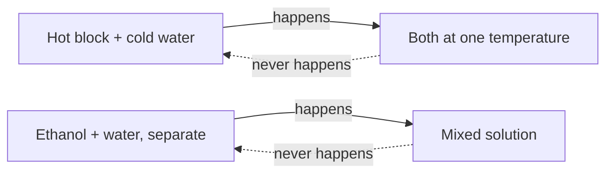
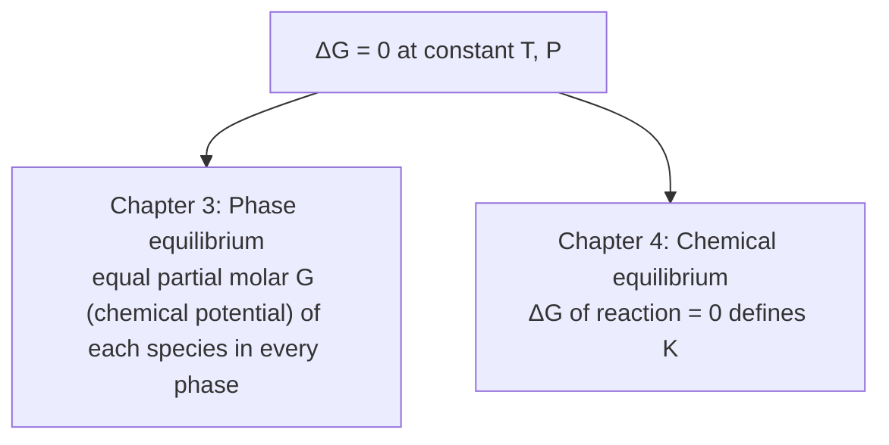

## ビデオ講義

<div class="video-container">
  <iframe
    width="560"
    height="315"
    src="https://www.youtube.com/embed/tGOpNey5U9E?start=739"
    title="化学工学熱力学 第2章: エントロピーと熱力学第二法則"
    frameborder="0"
    allow="accelerometer; autoplay; clipboard-write; encrypted-media; gyroscope; picture-in-picture"
    allowfullscreen>
  </iframe>
</div>

> このビデオは以下のテキストと同じ内容をカバーしています。お好みの学習形式をお選びください。

---

# 第2章：エントロピーと熱力学第二法則

第1章は私たちに帳簿を与えました。エネルギーは保存され、私たちはそれを数えられます。本章が与えるのは**方位磁針**です。熱力学第二法則（second law）は、プロセスがひとりでにどちらへ進むのか、熱からどれだけの仕事を取り出せる可能性があるのか、そしてなぜ混合物の分離が決して無料ではありえないのかを教えます。

**方向、限界、そして分離の代償**

## 学習目標

本章を修了すると、以下ができるようになります:

  * ✅ エネルギー保存だけではプロセスの方向を予測できない理由を説明できる
  * ✅ エントロピー（entropy）を状態量として定義し、熱力学第二法則を $\Delta S_{universe} \geq 0$ として述べられる
  * ✅ カルノー効率（Carnot efficiency）を計算し、なぜ仕事が熱力学的に熱より価値が高いのかを説明できる
  * ✅ 理想的な 2 成分混合物について、分離の最小仕事（minimum work of separation）を計算できる
  * ✅ その最小値を実際の蒸留のエネルギー使用量と比較し、その差を解釈できる
  * ✅ 温度・圧力が一定の条件下で、ギブズエネルギー（Gibbs energy）を自発性と平衡の判定基準として使える

**読了時間**: 20-25分 **コード例**: 1 **演習**: 3

* * *

## 2.1 第一法則が答えられない問い

熱い鋼のブロックを冷たい水に落としてみましょう。熱はブロックから水へ流れ、両者が同じ温度になるまで続き、エネルギーは保存されます。では逆を想像してください。水がひとりでに冷え、ブロックが熱くなっていく。エネルギーはまったく同じだけ正確に保存されます。第一法則の中に、それを禁じるものは何もありません — それでも、それは決して起こりません。

同じ非対称性はプラントのいたるところにあります。エタノールを水にかき混ぜれば溶液になりますが、その溶液がひとりでに 2 層に分かれ直すことはありません。ガスはボンベから部屋へ漏れ出しますが、押し合いながら中へ戻ることはありません。



これらのプロセスはどれも**両方**の向きでエネルギーを保存しますが、実際に観測されるのは片方の向きだけです。第一法則は帳簿係です — 量を監査しますが、方向については何も言いません。選んでいるのは、別の何かです。

その何かが**熱力学第二法則**であり、それが追いかけている量が**エントロピー**です。

## 2.2 エントロピー

**エントロピー**（記号 $S$、単位 J/K）は状態量です。内部エネルギーやエンタルピーと同じく、系がどうやってそこに至ったかではなく、現在の状態だけで決まります。絶対温度 $T$ 一定のもとでの可逆（reversible）な熱の移動については:

$$ \Delta S = \frac{Q_{rev}}{T} $$

物理的な意味を担っているのは分母の温度です。*同じ* 1 ジュールの熱でも、冷たい物体に入るときのほうが、熱い物体に入るときより*大きな*エントロピー変化を生みます。熱いブロックが水を温めて逆にはならないのはそのためです。高い $T$ でブロックが失うエントロピーは、低い $T$ で水が得るエントロピーより小さいので、この移動は全体を増やすのです。

統計的には、エントロピーは可能性の数を数えています。莫大な数の分子配置（**微視的状態**）で実現できるマクロな状態は、わずかな数の配置でしか実現できない状態より圧倒的に確からしいのです。ガスが容器の左半分に押し込められている配置より、容器全体に広がっている配置のほうが天文学的に多いので、ガスは容器を満たします — 何かの力が押しているからではなく、ほとんどすべての配置がそう見えるからです。エントロピーは、その数の対数です。

そして熱力学第二法則はこう述べます:

$$ \Delta S_{universe} = \Delta S_{system} + \Delta S_{surroundings} \geq 0 $$

系のエントロピーはたしかに下がりえます — 冷蔵庫は毎日水を凍らせています — が、それは外界が系の失う分より多く得る場合に限られます。等号が成り立つのは**可逆**プロセスの場合だけで、これは十分にゆっくりと、摩擦も、抑制されない膨張も、有限の温度差も、混合もない状態で進められ、そのまま正確に逆にたどれるという理想化です。現実のプロセスでこれに該当するものはありません。**あらゆる現実のプロセスはエントロピーを生成し**、生成されたエントロピーは破壊された仕事のポテンシャルです。それは、プラントが不可逆性（irreversible）によって失っているお金の、熱力学的な呼び名なのです。

## 2.3 カルノー限界

熱力学第二法則のもっとも影響の大きい帰結は、熱を仕事に変えることに関するものです。熱機関は $T_h$ の高温源から熱を受け取り、仕事を生み出し、そして $T_c$ の低温源へいくらかの熱を捨てなければなりません。この排熱は、設計で取り除くべき工学上の失敗ではありません — 全体のエントロピーが減らないようにしているのがそれなのです。$\Delta S_{universe} \geq 0$ を要求すると、効率に厳しい上限が課されます:

$$ \eta_{max} = 1 - \frac{T_c}{T_h} $$

ここで両方の温度は**絶対温度**、単位はケルビンです。ボイラーが 500 °C、冷却水が 25 °C の蒸気動力プラントを考えます:

$$ T_h = 773\ \text{K},\quad T_c = 298\ \text{K} \quad\Rightarrow\quad \eta_{max} = 1 - \frac{298}{773} = 0.614 \approx 61.4\% $$

この 2 つの温度に対しては、どんなボイラー設計も、作動流体も、タービンの冶金技術も、61.4% を超えられません。実際の蒸気プラントはそれをかなり下回り — 典型的には 35–45% の範囲に収まります — 現実の膨張、有限の温度差を介した伝熱、そして摩擦がいずれもエントロピーを生成するからです。

ここから得られる工学的な教訓は、発電の枠を超えて深いものです。熱も仕事もどちらもジュールで測られますが、**両者は交換可能ではありません**。仕事は完全に、しかも自由に熱へ変換されます。熱が仕事へ変換されるのは部分的にすぎず、その割合は熱源が冷たくなるほど小さくなります:

| | 熱力学的な価値 | 実務上の帰結 |
|---|---|---|
| **仕事**（電力、軸動力、圧縮） | 高い — 完全に変換可能 | 高価。買うのはできるだけ少なく |
| **高温の熱**（直火加熱炉、高圧蒸気） | 中程度 | より低温の用途へ順に落として使う価値がある |
| **低温の熱**（低圧蒸気、温水） | 低い | 仕事としてはほぼ無価値。加熱にはなお有用 |

ここから、プラントの現実が 2 つ直接に導かれます。第一に、**熱統合（heat integration）が重要**だということです — ピンチ解析（pinch analysis）（入門シリーズ 第4章）は、熱の一つひとつの塊を、まだ役に立つ最高の温度で使ってから冷却水へ落とすための仕組みであり、その仕事のポテンシャルを一段で破壊してしまうことを避けます。第二に、**圧縮機は、それが現れるところではどこでも運転コストを支配する**ということです。圧縮機はエネルギーのもっとも高価な形である仕事を消費し、どれだけ廃熱があってもその代わりにはなりません。

## 2.4 なぜ分離にはエネルギーがかかるのか

同じ論理を、プラントのもう一つの大きなエネルギー消費者に当てはめましょう。混合が自発的なのは、それがエントロピーを増やすからです — 混合物は、分かれた成分よりもはるかに多くの微視的状態を使えます。自発的な混合がエントロピーを上げるのですから、**混合をほどくことはエントロピーを下げるはず**であり、熱力学第二法則により、それは外部からの仕事によってしか支払えません。

モル分率 $x$ の**理想的な 2 成分混合物**について、1 モルあたりの混合エントロピー（entropy of mixing）は $\Delta S_{mix} = -R\,[x \ln x + (1-x)\ln(1-x)]$ であり、温度 $T$ でそれを元に戻すための最小可逆仕事は、このエントロピーに $T$ を掛けたものです（ここでは投入仕事の大きさとして示しています。第1章の符号の約束に従えば負の符号が付きます）:

$$ w_{min} = -RT\,\big[\,x \ln x + (1-x)\ln(1-x)\,\big] $$

298 K の等モル混合物について、$R = 8.314$ J/(mol·K) を用いると:

$$ w_{min} = -(8.314)(298)\,(0.5\ln 0.5 + 0.5\ln 0.5) = (8.314)(298)(0.693) = 1717\ \text{J/mol} \approx 1.72\ \text{kJ/mol} $$

```python
import math

R = 8.314      # J/(mol K)
T = 298.0      # K

def w_min(x, T=T):
    """Minimum reversible work to separate 1 mol of an ideal binary
    mixture of composition x into two pure streams, in J/mol."""
    if x <= 0.0 or x >= 1.0:
        return 0.0
    return -R * T * (x * math.log(x) + (1 - x) * math.log(1 - x))

print(f"{'x_A':>6} {'w_min (J/mol)':>15} {'w_min (kJ/mol)':>16}")
for x in [0.01, 0.05, 0.10, 0.25, 0.50, 0.75, 0.90, 0.99]:
    w = w_min(x)
    print(f"{x:6.2f} {w:15.1f} {w/1000:16.3f}")

w50 = w_min(0.50)
print(f"\nEquimolar mixture at {T:.0f} K: w_min = {w50:.0f} J/mol = {w50/1000:.2f} kJ/mol")

#    x_A   w_min (J/mol)   w_min (kJ/mol)
#   0.01           138.7            0.139
#   0.05           491.8            0.492
#   0.10           805.4            0.805
#   0.25          1393.2            1.393
#   0.50          1717.3            1.717
#   0.75          1393.2            1.393
#   0.90           805.4            0.805
#   0.99           138.7            0.139
#
# Equimolar mixture at 298 K: w_min = 1717 J/mol = 1.72 kJ/mol
```

この曲線は対称で、$x = 0.5$ で頂点を取ります。50/50 の混合物がもっとも分離しにくく、希薄な混合物は*混合物 1 モルあたり*ではわずかなコストしかかかりません — もっとも、回収される微量成分 1 モルあたりで見れば非常に高くつきます。

さて、心に留めておいてほしい比較です。あの等モルの分離の熱力学的な代価は、混合物 1 モルあたり約 **1.7 kJ** でした。工業的な分離についての公表された解析は一般に、実際の蒸留が**熱力学的最小値の 10 倍から 100 倍**のオーダーを消費すると報告しています。その値は相対揮発度、還流比、熱統合の度合いによって変わります。これは精密な数値ではなく、あくまでそういう桁のオーダーの範囲として扱ってください。

自らの理論的な下限の 10–100 倍で運転されているプロセスは工学では珍しく、だからこそ分離はこれほど活発な研究対象なのです。主要な代替手段はいずれも — コンデンサーの熱負荷をリボイラーで再利用する**ヒートポンプ**と蒸気再圧縮、塔 1 本とその再混合による損失をまるごと取り除く**隔壁塔**（1 つの塔で 2 つの分離を行う）、そしてそもそも混合物を沸騰させない**膜**や吸着 — その差の一部に切り込むものです。

## 2.5 ギブズエネルギー：技術者の方位磁針

$\Delta S_{universe}$ を追いかけるということは外界まで勘定に入れるということで、これは扱いにくいものです。幸いにも、化学技術者はほとんどつねに**温度・圧力一定**の条件で仕事をしており、その条件のもとでは熱力学第二法則は系だけの物理量へと包み直されます。それが**ギブズエネルギー**です:

$$ G = H - TS $$

その威力は、そこから得られる判定基準にあります。$T$ と $P$ が一定のとき:

| 条件 | 意味 |
|---|---|
| $\Delta G < 0$ | 書かれた向きにプロセスは**自発的**である |
| $\Delta G = 0$ | 系は**平衡**にある — 正味の変化はない |
| $\Delta G > 0$ | プロセスは**非自発的**であり、逆向きが自発的である |

この定義は競争として読んでください。$H$ の項はエネルギーを下げること — 結合をつくる、凝縮する、秩序化する — に報酬を与えます。$-TS$ の項はエントロピーを上げること — 結合を切る、蒸発する、混ざる — に報酬を与えます。温度が審判で、それを上げるとエントロピー側が強くなります。液体が熱いと沸騰し冷たいと凍る理由も、加熱したときにしか進まない反応がある理由も、これです。

このシリーズでこれから続くものはすべて、この 1 つの判定基準を 2 度当てはめたものです:



**第3章**では、$\Delta G = 0$ を気液の境界に適用することで、各成分が両方の相で同じ化学ポテンシャルを持つという条件が得られます — これがあらゆる気液平衡（VLE）計算と塔設計の基礎です。**第4章**では、反応のギブズエネルギー変化をゼロと置くことで平衡定数 $K$ とその温度依存性が得られ、それがどんな触媒も超えられない最大転化率を定めます。

## 2.6 本章のまとめ

- 第一法則はエネルギーの量を監査するが両方の向きを許す。**方向を与えるのは熱力学第二法則**である
- **エントロピー** $S$ は状態量である。等温可逆の熱移動については $\Delta S = Q_{rev}/T$ であり、統計的にはその状態が取りうる微視的状態の数を数えている
- $\Delta S_{universe} \geq 0$ であり、等号は理想化された可逆プロセスの場合だけ成り立つ — **あらゆる現実のプロセスはエントロピーを生成し**、仕事のポテンシャルを破壊する
- **カルノー**: 絶対温度を用いて $\eta_{max} = 1 - T_c/T_h$。500 °C/25 °C では 61.4% となるが、実際の蒸気プラントはおよそ 35–45% にとどまる
- 仕事は熱力学的に貴重で、熱は比較的安い — だからこそ熱統合が行われ、だからこそ圧縮機が運転コストを支配する
- 混合はエントロピーを上げるので、**分離には代金を払わなければならない**: $w_{min} = -RT[x\ln x + (1-x)\ln(1-x)]$ であり、298 K の等モル混合物では **1.72 kJ/mol** となる
- 実際の蒸留は通常その最小値の **10–100 倍**を使う — この余地こそが、ヒートポンプ、隔壁塔、膜の動機になっている
- **ギブズエネルギー** $G = H - TS$ は、熱力学第二法則を系だけで判定できる形に変える: $\Delta G < 0$ なら自発的、$\Delta G = 0$ なら平衡である

**次章**: $\Delta G = 0$ を共存する相に適用します。気液平衡、ラウールの法則、活量係数、そして共沸混合物 — 蒸留塔がそもそもその分離を行えるかどうかを決める熱力学です。

## 演習問題

1. **概念 — 方向と 2 つの法則**: あるベンダーが、60 °C の廃熱 100 kW を受け入れて 30 kW の軸仕事を出し、25 °C の冷却水へ 70 kW を捨てる装置を主張している。(a) この主張は第一法則に反するか。(b) 熱力学第二法則に反するか。(c) その熱流から物理的に可能な最大の仕事出力はいくらか。
   *ヒント*: まずエネルギー収支を確認し、その後に主張されている効率を絶対温度を用いたカルノー限界と比較せよ。
   *解答*: (a) **いいえ** — 30 + 70 = 100 kW なので、エネルギーは保存されています。(b) **はい。** 主張されている効率は 30/100 = 30% ですが、$T_h$ = 333 K、$T_c$ = 298 K から $\eta_{max}$ = 1 − 298/333 = 0.105、すなわち **10.5%** です。(c) せいぜい 0.105 × 100 kW ≈ **10.5 kW** であり、現実の装置ならそれよりかなり少なくなります。低温の廃熱を仕事として収益化するのが難しいのはこのためです — カルノー係数が小さいので、その流れは加熱に使ったほうがよいのです。

2. **定量 — 地熱発電所のカルノー効率**: ある地熱資源が 150 °C で熱を供給し、発電所は 25 °C の環境へ排熱する。(a) 熱力学的な最大効率を計算せよ。(b) 発電所が実際に 12% を達成しているとすると、それは理想の何割にあたるか。(c) 地熱発電所の効率が低くてもなお経済的に成り立ちうる理由について述べよ。
   *ヒント*: まずケルビンに換算せよ: 150 °C = 423 K、25 °C = 298 K。その上で $\eta_{max}$ = 1 − $T_c/T_h$。
   *解答*: (a) $\eta_{max}$ = 1 − 298/423 = 0.2955 ≈ **29.6%**。(b) 12/29.6 = **0.41**、カルノー限界の約 41% であり、低温のバイナリーサイクル発電所としては普通の割合です。(c) 効率は熱のうちどれだけが仕事になるかを測るものですが、その熱自体が**無料で、しかも継続的に更新される**ので、経済性は燃料効率ではなく設備 1 kW あたりの資本費で決まります。効率 1 ポイントごとが購入した燃料である直火ボイラーとは対照的です。

3. **定量 — 分離の最小仕事**: ある流れがエタノール 10 mol% の水溶液で、298 K で純成分に分離しなければならない。理想的な 2 成分混合物として扱い、(a) 混合物 1 モルあたりの $w_{min}$ を計算し、(b) それを回収されるエタノール 1 モルあたりで表し、(c) 10–100 倍の経験則を使って現実的な蒸留の熱負荷を見積もれ。
   *ヒント*: $w_{min}$ = −RT[x ln x + (1−x) ln(1−x)]、x = 0.10、R = 8.314 J/(mol·K)、T = 298 K。(b) では、混合物 1 モルあたり 0.10 mol のエタノールで割れ。
   *解答*: (a) x ln x = 0.10 × ln 0.10 = −0.2303、(1−x)ln(1−x) = 0.90 × ln 0.90 = −0.0948 で、その和は −0.3251 なので、$w_{min}$ = 8.314 × 298 × 0.3251 = **805 J/mol ≈ 混合物 1 モルあたり 0.81 kJ**。(b) エタノール 1 モルあたりでは 805/0.10 = **エタノール 1 モルあたり 8.05 kJ** — 混合物 1 モルあたりの数字は小さく見えても、希薄であることは高くつきます。(c) 現実の熱負荷は **混合物 1 モルあたり約 8–81 kJ**。なお、エタノール–水は強く非理想的で、質量で約 95.6% エタノールのあたりに共沸混合物を作るため、通常の蒸留では純エタノールにはまったく到達できません — この限界は第3章で説明します。
