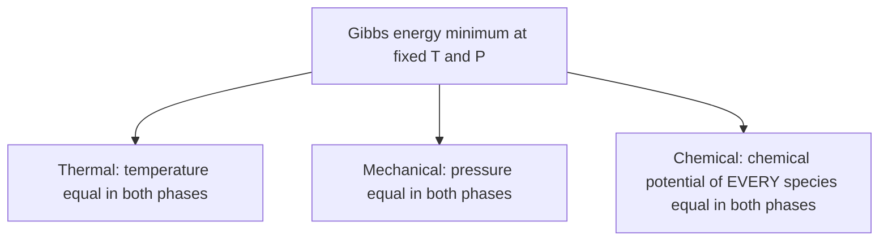

## ビデオ講義

<div class="video-container">
  <iframe
    width="560"
    height="315"
    src="https://www.youtube.com/embed/tGOpNey5U9E?start=1412"
    title="化学工学熱力学 第3章: 相平衡"
    frameborder="0"
    allow="accelerometer; autoplay; clipboard-write; encrypted-media; gyroscope; picture-in-picture"
    allowfullscreen>
  </iframe>
</div>

> このビデオは以下のテキストと同じ内容をカバーしています。お好みの学習形式をお選びください。

---

# 第3章：相平衡

第1章と第2章で 2 つの法則を組み立てました。本章では、それらを 1 つの問いに費やします。液体とその蒸気が同じ容器の中に共存しているとき、それぞれの相には何が入っているのか。あらゆる蒸留塔、フラッシュドラム、吸収塔、凝縮器は、この答えから設計されます。

**気液平衡、ラウールの法則、そして共沸混合物**

## 学習目標

本章を修了すると、以下ができるようになります:

  * ✅ **相平衡（phase equilibrium）**の判定条件を、温度・圧力・化学ポテンシャルの言葉で述べられる
  * ✅ **ギブズの相律（Gibbs phase rule）**を適用して自由度を数えられる
  * ✅ 蒸気圧が温度とともにどう変化するか、そして**アントワン式（Antoine equation）**が何を相関しているのかを説明できる
  * ✅ **ラウールの法則（Raoult's law）**を用いて理想 2 成分系の泡点圧と蒸気組成を計算できる
  * ✅ 相対揮発度を計算し、それを蒸留の設計に結びつけられる
  * ✅ 活量係数を説明し、共沸混合物がなぜ通常の蒸留を無効にするのかを説明できる

**読了時間**: 20-25分 **コード例**: 1 **演習**: 3

* * *

## 3.1 相と相のあいだの平衡

第2章は、平衡の実用的な判定条件で締めくくられていました。温度と圧力が一定のもとで、系は**ギブズエネルギー**が最小になるまで変化する、というものです。これを、液体と蒸気を収めた密閉容器に適用すると、同時に成り立たなければならない 3 つの等式に分解されます。



はじめの 2 つは直観的です。ホットスポットがあれば熱流が生じますし、圧力差があれば界面が動きます。本当の仕事をするのは 3 つ目です。すべての化学種 $i$ について:

$$ \mu_i^{\,L} = \mu_i^{\,V} \qquad\Longleftrightarrow\qquad f_i^{\,L} = f_i^{\,V} $$

ここで $\mu_i$ は**化学ポテンシャル（chemical potential）**、$f_i$ は**フガシティー（fugacity）**です。フガシティーは同等の言い換えですが、圧力の次元を持ち、理想気体では分圧に帰着するため、技術者はこちらを好みます。フガシティーは**逃げ出そうとする傾向（escaping tendency）**として読めます。化学種 $i$ がその相からどれだけ強く出て行こうとしているか、という量です。

したがって平衡とは、何も起きていない状態ではありません。分子は絶えず両方向に界面を横切っています。平衡とは、各化学種が液から出て行く速度と蒸気から出て行く速度がちょうど等しく、そのため組成が変化しなくなった状態です。逃げ出そうとする傾向が等しいことが、これらの速度を一致させます。

### 自由度を数える：ギブズの相律

何かを計算する前に、いくつの変数を指定してよいのかを知っておくと得をします。**ギブズの相律**がそれに答えます:

$$ F = C - \pi + 2 \qquad (\pi = \text{number of phases}) $$

ここで $C$ は化学種の数、$\pi$ は平衡にある相の数 — 圧力と混同されないよう $P$ ではなく $\pi$ と書きます — 、$F$ は自由に決めてよい示強変数（温度、圧力、組成）の数です。3 つの計算例を挙げます:

| 系 | C | π | F | 帰結 |
|---|---|---|---|---|
| 純水の沸騰（液 + 蒸気） | 1 | 2 | **1** | 圧力を決めれば沸騰温度が決まる — ほかに自由なものはない |
| 水の三重点（固 + 液 + 蒸気） | 1 | 3 | **0** | 不変：唯一の T と P に定まる。だからこそ温度目盛りの定義に使われる |
| 2 成分系の気液平衡 | 2 | 2 | **2** | T と P を決めれば両相の組成が従う。あるいは P と x を決めれば T と y が従う |

1 行目は圧力鍋を説明しています。P を上げれば沸騰温度 T もそれに従わざるをえません。3 行目は以下のすべてを形づくります。塔圧が一定の 2 成分系では、さらに **1 つ**だけ指定すれば（たとえば液組成）、温度と蒸気組成の両方が決まります。T-x-y線図が表示しているのは、まさにこれです。

## 3.2 純成分の蒸気圧

気液平衡のすべては、1 つの純成分物性に錨を下ろしています。**飽和蒸気圧（saturation vapor pressure）** $P_i^{sat}(T)$ — 純粋な $i$ が温度 $T$ で沸騰する圧力です。これは温度とともに急峻に、おおよそ指数関数的に上昇します。逃げ出せるだけのエネルギーを持つ分子の割合がボルツマン因子に支配されているからで、反応速度論のアレニウス項とよく似ています。水は 20 °C でおよそ 0.023 atm、100 °C で 1 atm、150 °C では 5 atm 近くを示します。**標準沸点（normal boiling point）**とは、$P^{sat} = 1$ atm となる温度のことです。

工学における標準的な相関式が**アントワン式**です:

$$ \log_{10} P^{sat} = A - \frac{B}{T + C} $$

$A$、$B$、$C$ は化合物ごとにフィッティングされます。定数そのものよりも重要な注意が 2 つあります。これらはフィッティングされた温度範囲**でのみ**成り立つこと、そして各定数セットは $P$ と $T$ について特定の単位を伴っていることです。bar 基準のセットを atm 基準の計算に混ぜ込むのは、静かに紛れ込む古典的な誤りです。

## 3.3 ラウールの法則と理想溶液

最も単純で有用なモデルは、分子が隣人を区別できないと仮定します — A-B 間の相互作用が A-A と B-B の平均のエネルギーを持つ、という仮定です。このような**理想溶液（ideal solution）**は**ラウールの法則**に従います:

$$ y_i \, P = x_i \, P_i^{sat}(T) $$

ある化学種が混合物の上で示す分圧は、その純成分蒸気圧に液相モル分率を掛けたものになります。全化学種について和を取ると（$y_i$ の和は 1）、蒸気の最初の泡が現れる圧力である**泡点圧（bubble pressure）**が得られます:

$$ P = \sum_i x_i P_i^{sat}(T) $$

ラウールの法則は、化学的に似た化学種 — ベンゼンとトルエン、ヘキサンとヘプタン — に対してはよく働きます。極性や水素結合が異なる場合にはひどく破綻します。エタノール–水がその典型的な破綻例で、3.4 節で扱います。

### 相対揮発度

蒸留の設計は、平衡関係を 1 つの数値に圧縮します。軽質成分 1 の重質成分 2 に対する**相対揮発度（relative volatility）**です:

$$ \alpha = \frac{y_1/x_1}{y_2/x_2} = \frac{P_1^{sat}}{P_2^{sat}} \quad \text{(ideal solution)} $$

$\alpha = 1$ なら両相の組成は同一で、蒸留は不可能です。$\alpha$ が大きいほど必要な段数は少なくなります。理想 2 成分系では、平衡曲線が 1 つの式に集約されます:

$$ y_1 = \frac{\alpha x_1}{1 + (\alpha - 1) x_1} $$

これはまさに、姉妹シリーズ *化学工学入門* の第4章で扱う**マッケーブ–シール（McCabe–Thiele）**作図法が土台にしている、$\alpha$ でパラメータ化された平衡曲線です。そこで描かれる階段は、この形の曲線に対して刻まれていきます。つまりあの図は、ここで導いた熱力学の絵姿なのです。

その式から $y_1$ を $x_1$ に対してプロットすると、**y-x（平衡）線図**が得られます。平衡曲線と、分離が起こらない基準として描かれる 45° 線 $y = x$ からなる図です。この線上の点は、蒸気と液が同一組成であることを意味します。曲線と直線のあいだの縦方向の隔たりが、平衡 1 段が生み出す濃縮の大きさです。それこそが蒸留の利用しているものであり、両者が接するところでは消えてしまうものでもあります。

### 例題：90 °C のベンゼン(1)–トルエン(2)

90 °C における教科書的なおよその値を取ります。ベンゼンは $P_1^{sat} \approx 1.34$ atm、トルエンは $P_2^{sat} \approx 0.54$ atm です。ベンゼンが $x_1 = 0.4$ の液について:

$$ P = 0.4 \times 1.34 + 0.6 \times 0.54 = 0.536 + 0.324 = 0.860\ \text{atm} $$

$$ y_1 = \frac{0.536}{0.860} = 0.623 $$

液の 40% に対して、蒸気は 62.3% のベンゼンを含んでいます — 平衡接触 1 回だけで、すでに大幅に濃縮されています。ここで $\alpha = 1.34/0.54 = 2.48$ — 丸めると 2.5 — であり、入門シリーズ第4章のマッケーブ–シール作図法は、まさにこの種の平衡曲線の上に築かれています。

```python
# Ideal binary VLE (Raoult's law): benzene(1) - toluene(2) at 90 C
# Approximate textbook vapor pressures at 90 C, in atm.
P1sat, P2sat = 1.34, 0.54
alpha = P1sat / P2sat

print(f"Relative volatility alpha = {alpha:.2f}\n")
print(f"{'x1':>5} {'P (atm)':>9} {'y1':>7} {'y1 - x1':>9}")
for i in range(11):
    x1 = i / 10
    P = x1 * P1sat + (1 - x1) * P2sat   # bubble pressure
    y1 = x1 * P1sat / P                 # vapor composition
    print(f"{x1:5.1f} {P:9.3f} {y1:7.3f} {y1 - x1:9.3f}")

# Relative volatility alpha = 2.48
#
#    x1   P (atm)      y1   y1 - x1
#   0.0     0.540   0.000     0.000
#   0.1     0.620   0.216     0.116
#   0.2     0.700   0.383     0.183
#   0.3     0.780   0.515     0.215
#   0.4     0.860   0.623     0.223
#   0.5     0.940   0.713     0.213
#   0.6     1.020   0.788     0.188
#   0.7     1.100   0.853     0.153
#   0.8     1.180   0.908     0.108
#   0.9     1.260   0.957     0.057
#   1.0     1.340   1.000     0.000
```

重要な特徴が 2 つあります。泡点圧が $x_1$ に対して**線形**であること — これが理想溶液の証しです。そして濃縮度 $y_1 - x_1$ は純成分の両端のあいだで正の値を保ちますが、中間の組成でピークを取り、両端に向かって崩れていきます。塔において最後の数パーセントの純度が高価な部分になるのは、このためです。

## 3.4 偏差と活量係数

実在の混合物は理想的ではありません。その手当ては、液相側の補正である**活量係数（activity coefficient）** $\gamma_i$ です:

$$ y_i \, P = \gamma_i \, x_i \, P_i^{sat}(T) $$

定義上、溶液が理想的になるにつれて、また化学種 $i$ が純粋に近づくにつれて $\gamma_i \to 1$ となります。その値には物理的な意味があります:

| 偏差 | $\gamma$ | 分子論的な原因 | 帰結 |
|---|---|---|---|
| **正** | > 1 | 異種分子どうしの引力が同種どうしより弱い — 互いを「押し出し合う」 | ラウールの予測より高い圧力。**最低共沸混合物**を作りうる |
| **負** | < 1 | 異種分子どうしがより強く引き合う（水素結合、錯体形成） | ラウールの予測より低い圧力。最高共沸混合物を作りうる |

エタノール–水は正の偏差の教科書的な例です。エタノール分子が水の水素結合ネットワークを乱すため、両方の化学種が理想モデルの許すよりも容易に逃げ出し、どちらも $\gamma > 1$ となります。

### 共沸混合物

偏差が十分に強いとき、濃縮度 $y_1 - x_1$ はある中間組成でゼロに落ちます:

$$ y_1 = x_1 \qquad\Longrightarrow\qquad \alpha = 1 $$

これが**共沸混合物（azeotrope）**であり、越えられない壁です。ある段から出て行く蒸気がその段上の液と同じ組成になるため、段を 1 つ足しても何も達成されません。どんな還流比も、どんな塔高もこれを越えられません。エタノール–水は 1 atm で **95.6 wt% エタノール**付近（約 89 mol%）に最低共沸混合物を作り、およそ 78.2 °C で沸騰します。これは純エタノールの沸点よりわずかに*低い*温度です。これは入門シリーズ第1章で注意喚起されていた限界であり、発酵液の通常の蒸留が 96 wt% の手前で止まってしまう理由でもあります。

産業界は、塔ではなく熱力学のほうを変えることでこれを越えます:

- **圧力スイング蒸留（pressure-swing distillation）** — 共沸組成は圧力とともに移動するので、圧力の異なる 2 本の塔でその周りを回り込む。
- **抽出蒸留（extractive distillation）** — エチレングリコールのような高沸点の**エントレーナー（entrainer）**（添加される分離剤）が活量係数を十分に変化させ、共沸を破る。
- **モレキュラーシーブ（molecular sieve）** — 3A ゼオライトが水を吸着してエタノールを通し、平衡そのものを迂回する。燃料用無水エタノールの標準的なルート。

## 3.5 T-x-y線図とてこの規則

圧力を固定すると、相律は 2 成分混合物に自由な指定を 1 つ残しました。**T-x-y線図（T-x-y diagram）**はその結果をプロットしたものです。組成に対して温度を取り、2 つの純成分沸点のあいだに 2 本の曲線が張られます — ベンゼン–トルエンの 1 atm では、ベンゼンの 80.1 °C からトルエンの 110.6 °C までです。

- 下側の**沸点曲線（bubble-point curve）**：組成 $x_1$ の液が最初に沸騰する温度。
- 上側の**露点曲線（dew-point curve）**：組成 $y_1$ の蒸気が最初に凝縮する温度。
- その 2 本のあいだが**二相領域**です。ここに入った混合物は、自発的に沸点曲線上の液と露点曲線上の蒸気に分かれます。

ある温度でこの 2 点を結ぶ水平線が**タイライン（tie line）**であり、その両端が平衡組成です。グラフから直接読み取れます。各相にどれだけの物質があるかは物質収支から従い、それが全体組成を $z_1$ とする**てこの規則（lever rule）**です:

$$ \frac{n^{V}}{n^{L}} = \frac{z_1 - x_1}{y_1 - z_1} $$

全体組成に*近い*ほうの相が、量の多い相になります — タイラインは、供給点を支点とする天秤の梁のようにふるまうのです。この 1 つの関係式が、フラッシュドラム計算の内容のすべてです。

*（本章の動画版では、タイラインを描き込んだ T-x-y線図を示しています。）*

## 3.6 本章のまとめ

- 相平衡には、相をまたぐ **3 つ**の等式が必要である：温度、圧力、そしてすべての化学種の化学ポテンシャル（等価にフガシティー） — 最後のものは逃げ出そうとする傾向が等しいということ
- **ギブズの相律** $F = C - \pi + 2$（$\pi$ は相の数）が、何を指定してよいかを数える：沸騰中の純液体で 1、三重点で 0、2 成分系の気液平衡で 2
- 蒸気圧は温度とともにおおよそ指数関数的に上昇し、**アントワン式**で相関される — フィッティングされた範囲と単位の中でのみ有効
- **ラウールの法則** $y_i P = x_i P_i^{sat}$ は、似た化学種からなる理想溶液を記述する。泡点圧は組成に対して線形である
- **相対揮発度** $\alpha = P_1^{sat}/P_2^{sat}$ は蒸留設計が回るためのパラメータである。90 °C のベンゼン–トルエンでは $\alpha = 2.48$（丸めると 2.5）となり、入門シリーズ第4章のマッケーブ–シール作図法は、まさにこの種の平衡曲線の上に築かれている
- **活量係数** $\gamma_i$ は実在混合物に対してラウールの法則を補正する。正の偏差は**共沸混合物**を生みうる。そこでは $y = x$、$\alpha = 1$ となり、通常の蒸留は止まる — 95.6 wt% エタノール付近のエタノール–水が古典的な例
- **T-x-y線図**とそのタイライン、そして**てこの規則**が、以上のすべてをグラフから読み取れるフラッシュ計算に変える

**次章**: 同じギブズの判定条件を、単に相を変えるのではなく互いに変換し合う化学種に適用すると、**化学平衡** — 平衡定数、その温度依存性、そしてあらゆる反応器の転化率にかかる熱力学的な天井 — が得られます。

## 演習問題

1. **概念 — 自由度**: ある 2 成分混合物が、圧力一定の塔の中で気液平衡にある。(a) さらにいくつの変数を独立に指定してよいか、またそれは実務的に何を意味するか。(b) 純物質の場合、最大でいくつの相が共存できるか、またその状態は何が特別か。
   *ヒント*: F = C − π + 2（π = 相の数）を使い、圧力を固定すると自由度を 1 つ消費することを思い出せ。
   *解答*: (a) F = 2 − 2 + 2 = **2**。塔の圧力を固定して 1 つを使うので、**1 つ**残ります: 液組成 x₁ を指定すれば温度と y₁ の両方が決まります — 圧力一定の T-x-y線図が平衡を完全に記述できるのはこのためです。(b) F = 1 − π + 2 = 3 − π なので、**π = 3** で F = 0 — 三重点であり、唯一の温度と圧力に定まる不変な状態です。だからこそ水の三重点が温度目盛りの定点として使われます。

2. **定量 — ラウールの法則による泡点圧**: 90 °C のベンゼン(1)–トルエン(2) について、おおよその値 P₁sat = 1.34 atm、P₂sat = 0.54 atm を用いて、x₁ = 0.6 における泡点圧と蒸気組成を計算せよ。3.3 節の x₁ = 0.4 の場合と濃縮度を比較せよ。
   *ヒント*: P = x₁P₁sat + x₂P₂sat、次いで y₁ = x₁P₁sat / P。
   *解答*: P = 0.6 × 1.34 + 0.4 × 0.54 = 0.804 + 0.216 = **1.020 atm**、y₁ = 0.804 / 1.020 = **0.788**。濃縮度 y₁ − x₁ = 0.188 は、α = 2.48 が変わっていないにもかかわらず x₁ = 0.4 のときの 0.223 より小さくなっています — 1 段あたりの濃縮は中間の組成でピークを取るため、高純度への最終的な追い込みには不釣り合いに多くの段数がかかるのです。また、泡点圧がいまや 1 atm を超えていることにも注意してください: 90 °C において、この混合物は大気圧下で沸騰しますが、x₁ = 0.4 の混合物は沸騰しません。

3. **議論 — 共沸を越える**: ある燃料用エタノール工場は塔頂で 95 wt% エタノールに到達しているが、仕様は 99.5 wt% である。ある技術者が、トレイを 20 段追加して還流比を上げることを提案した。なぜこれが失敗するのかを説明し、実行可能な代替案を機構とともに少なくとも 2 つ挙げよ。
   *ヒント*: 95.6 wt% エタノールにおける α はいくつか。また、平衡曲線が 45° 線と出会うところで、マッケーブ–シールの階段はどうなるか。
   *解答*: 約 95.6 wt%（およそ 89 mol%）エタノールでこの混合物は共沸します: y = x かつ α = 1 です。平衡曲線が 45° 線に接するため、階段の刻みは消え去ってしまいます — 有限の段数では共沸ピンチ（平衡曲線が 45° 線に接するところ）を越えられず、還流は操作線を動かすだけです。トレイを追加しても、資本費とエネルギーが増えるだけで、それ以上のものは得られません。代替案: (1) **モレキュラーシーブによる脱水**。3A ゼオライト層が大きさによって水を吸着しエタノールを通すことで、気液平衡そのものを完全に回避します — 工業的な標準ルートです。(2) エチレングリコールのようなエントレーナーを用いる**抽出蒸留**。活量係数をずらすことで α が 1 に到達しないようにします。(3) **圧力スイング蒸留**。圧力の異なる 2 本の塔を組み合わせ、共沸組成が圧力とともに移動することを利用します。
