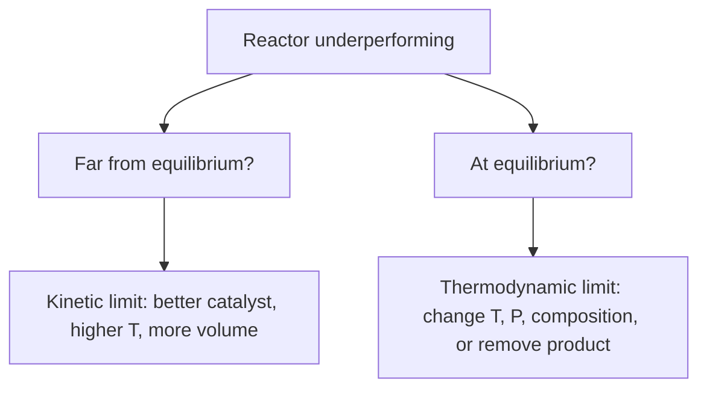

## ビデオ講義

<div class="video-container">
  <iframe
    width="560"
    height="315"
    src="https://www.youtube.com/embed/tGOpNey5U9E?start=2150"
    title="化学工学熱力学 第4章: 化学平衡"
    frameborder="0"
    allow="accelerometer; autoplay; clipboard-write; encrypted-media; gyroscope; picture-in-picture"
    allowfullscreen>
  </iframe>
</div>

> このビデオは以下のテキストと同じ内容をカバーしています。お好みの学習形式をお選びください。

---

# 第4章：化学平衡

第3章では、物質が相のあいだにどう分配されるかを問いました。本章では、反応について同じ形の問いを立てます。ある原料と一組の条件が与えられたとき、**反応は止まるまでにどこまで進めるのか** — そしてその答えに対して技術者は何ができるのか。

**反応はどこまで進めるのか**

## 学習目標

本章を修了すると、以下ができるようになります:

  * ✅ 速度論の問い（「どれだけ速く」）と熱力学の問い（「どこまで」）を区別できる
  * ✅ 触媒が平衡位置を決して動かせない理由を説明できる
  * ✅ $\Delta G^\circ = -RT \ln K$ を用いて平衡定数を計算し、その符号を読み取れる
  * ✅ **ファントホッフ式（van 't Hoff equation）**を適用して、$K$ が温度とともにどう動くかを予測できる
  * ✅ 気相反応に対する圧力・不活性成分・組成の影響を予測できる
  * ✅ **ハーバー・ボッシュ法（Haber–Bosch process）**の妥協点と、平衡が反応器設計をどう形づくるかを説明できる

**読了時間**: 20-25分 **コード例**: 1 **演習**: 3

* * *

## 4.1 2 つの異なる問い

反応は 2 つの独立した問いによって記述されます。そしてこの 2 つを混同することが、反応工学入門において最も多い誤りです。

**速度論が問うのは、どれだけ速く、です。** それは姉妹シリーズ *化学工学入門* 第2章の主題です — 速度式、アレニウス式、反応器のサイジング。速度論は*経路*と、必要な*時間*を支配します。

**熱力学が問うのは、どこまで、です。** 時間が無制限にあるとき、混合物はどんな組成に落ち着くのか。これは初期状態と最終状態だけで決まる性質です。分子がどんな経路をたどるか、中間体がいくつあるか、触媒があるかどうかには一切関知しません。

最後の点は、古典的な誤解であるだけに、はっきり言い切っておく価値があります:

> **触媒は平衡組成を変えられない。平衡へ近づく速さを上げるだけである。**

その理由は構造的なものです。触媒は正反応の活性化エネルギーを下げますが、触媒自身は消費されないため、逆反応の活性化エネルギーもまったく同じだけ下げなければなりません。両方の速度が同じ倍率で上がるので、それらが釣り合う比 — 平衡定数 — は変わりません。熱力学的に言えば、$K$ は反応物と生成物の状態の差である $\Delta G^\circ$ によって固定されており、触媒はそのどちらにも現れないのです。

実務上の帰結はこうです。平衡が 30% だと言っているために反応器が 30% の転化率で止まっているのなら、より良い触媒を入れても何も得られません。その天井を動かせるのは、温度、圧力、組成、あるいは生成物の除去だけです。



## 4.2 平衡定数

温度と圧力が一定のもとで、反応している混合物はギブズエネルギーが最小になる方向へ動きます。その最小点で組成の変化は止まり、**標準反応ギブズエネルギー**が**平衡定数（equilibrium constant）**を固定します:

$$ \Delta G^\circ = -RT \ln K \qquad \Longleftrightarrow \qquad K = \exp\!\left(\frac{-\Delta G^\circ}{RT}\right) $$

$K$ は、平衡状態で評価した、生成物の**活量（activity）**と反応物の活量の比であり、それぞれが化学量論係数の冪に上げられています。理想気体混合物では活量は分圧を標準圧力（1 bar）で割ったものになるため、$K$ は分圧の比から組み立てられ、無次元になります。理想溶液では、標準状態を基準としたモル分率あるいは濃度から組み立てられます。第5章では、状態方程式がここで言う「理想」という語を置き換えるフガシティー補正をどう供給するかを示します。本章の内容はすべて理想気体のふるまいを前提としています。

**簡単な計算例。** ある反応の 298 K における $\Delta G^\circ$ が −20 kJ/mol だとします。

$$ K = \exp\!\left(\frac{20000}{8.314 \times 298}\right) = \exp(8.07) \approx 3.2 \times 10^{3} $$

したがって $K \approx 3200$ です。平衡では生成物が圧倒的に優勢になります。ここで、指数関数が何をしているかに注目してください。$\Delta G^\circ$ がわずか 5.7 kJ/mol ずれるだけで — 化学的直観の基準からすれば丸め誤差のようなものです — 室温において $K$ は 10 倍になったり 10 分の 1 になったりします。**$\Delta G^\circ$ のささやかな変化が、$K$ を桁単位で振り回すのです。** 平衡計算がずさんな熱力学データに対して容赦がないのはこのためであり、紙の上では「うまくいくはず」の反応が、ときに $10^{-6}$ という平衡定数を持つのもこのためです。

| $\Delta G^\circ$ | $K$ | 平衡の位置 |
|---|---|---|
| 強く負（≲ −20 kJ/mol） | $K \gg 1$ | 事実上完結する |
| 負 | $K > 1$ | 生成物が有利 |
| ゼロ | $K = 1$ | 同程度の量 |
| 正 | $K < 1$ | 反応物が有利 |
| 強く正（≳ +20 kJ/mol） | $K \ll 1$ | 手助けなしではほとんど進まない |

1 つ注意があります。$\Delta G^\circ$ は*標準状態*の値です。実際の駆動力は現実の組成に依存するので、$K < 1$ の反応であっても、生成物を少なく保っておけば有用に進行します — この点は演習 2 で再び取り上げます。

## 4.3 温度依存性：ファントホッフ式

$K$ はある温度において固定されていますが、温度の強い関数です。**ファントホッフ式**は次のように述べます:

$$ \frac{d(\ln K)}{dT} = \frac{\Delta H^\circ}{R T^{2}} $$

$R T^2$ は常に正なので、すべてを決めるのは $\Delta H^\circ$ の符号です:

- **発熱（exothermic）**（$\Delta H^\circ < 0$）: $T$ が上がると $\ln K$ は**減少**する — 到達可能な転化率は温度とともに下がる。
- **吸熱（endothermic）**（$\Delta H^\circ > 0$）: $T$ が上がると $\ln K$ は**増加**する — 熱が味方になる。

これは、*化学工学入門* 第2章で述べられていた「発熱反応の温度を上げると平衡転化率が*下がる*」という主張の、熱力学的な根拠です。特殊な事例でも経験的な奇妙さでもなく、上式の $\Delta H^\circ$ の符号から直接に従うことなのです。

$\Delta H^\circ$ がその温度範囲で一定と扱えるなら、積分して実用形が得られます:

$$ \ln\!\frac{K_2}{K_1} = -\frac{\Delta H^\circ}{R}\left(\frac{1}{T_2} - \frac{1}{T_1}\right) $$

以下のコードは、これをアンモニア合成程度の大きさの発熱反応 $\Delta H^\circ = -92$ kJ/mol に適用しています。

```python
import math

R = 8.314          # J/(mol K)
dH = -92000.0      # J/mol, exothermic (ammonia-synthesis magnitude)
T_ref = 298.15     # K
K_ref = 5.6e5      # approximate standard-state K at 298 K (p in bar)

def K_vant_hoff(T):
    """Integrated van 't Hoff, constant dH:
       ln(K/K_ref) = -(dH/R) * (1/T - 1/T_ref)"""
    return K_ref * math.exp(-(dH / R) * (1.0 / T - 1.0 / T_ref))

print(f"{'T (K)':>7} {'T (C)':>7} {'K':>12} {'log10 K':>9}")
for T in [300, 400, 500, 600, 700, 800]:
    K = K_vant_hoff(T)
    print(f"{T:7d} {T-273.15:7.0f} {K:12.3e} {math.log10(K):9.2f}")

print(f"\nK(300 K)/K(800 K) = {K_vant_hoff(300)/K_vant_hoff(800):.2e}")

#   T (K)   T (C)            K   log10 K
#     300      27    4.454e+05      5.65
#     400     127    4.405e+01      1.64
#     500     227    1.742e-01     -0.76
#     600     327    4.357e-03     -2.36
#     700     427    3.126e-04     -3.51
#     800     527    4.333e-05     -4.36
#
# K(300 K)/K(800 K) = 1.03e+10
```

300 → 800 K のあいだで、$K$ はおよそ **10 桁**崩れ落ちます。室温では熱力学的にほぼ完結する反応が、800 K では熱力学的に絶望的になるのです。（$\Delta H^\circ$ 一定という仮定のため、これらの値は近似です — 実際の $\Delta H^\circ$ は温度とともに変動します — が、傾向とその大きさは正しいものです。）

## 4.4 圧力と組成の影響

**ルシャトリエの原理（Le Chatelier's principle）**を定性的に述べると、平衡にある系は外乱に対して、それを部分的に打ち消す方向に応答します。圧縮すれば分子数の少ない側へ移動し、加熱すれば吸熱方向へ移動します。

気体に対する定量的な形は、モル数の変化 $\Delta n$ =（気体生成物のモル数）−（気体反応物のモル数）を通して現れます。$K$ 自体は温度だけに依存しますが、それを満たす*モル分率*組成のほうは、$\Delta n \neq 0$ である限り全圧に依存します:

- $\Delta n < 0$（生成物側の気体モル数が少ない）: **圧力を上げると転化率が上がる**
- $\Delta n > 0$: 圧力を上げると転化率が下がる
- $\Delta n = 0$: 圧力は平衡組成に影響しない

**不活性成分**は圧縮とは逆方向に働きます。反応に関与しない窒素や水蒸気を加えると、全圧一定のもとであらゆる分圧が下がるため、$\Delta n < 0$ の反応を逆向きに移動させます。リサイクルループにパージが必要なのは、まさにこのためです。蓄積した不活性成分は反応器への供給を希釈し、反応速度だけでなく平衡転化率をも蝕むのです。

### ケーススタディ：アンモニア合成

$$ \mathrm{N_2} + 3\,\mathrm{H_2} \rightleftharpoons 2\,\mathrm{NH_3}, \qquad \Delta n = 2 - 4 = -2, \qquad \Delta H^\circ \approx -92\ \text{kJ per mol N}_2 $$

熱力学は明快な処方を与えます。$\Delta n < 0$ は**高圧**を、$\Delta H^\circ < 0$ は**低温**を指示します。ところが速度論は、温度について正反対の指示を出します — N≡N 三重結合はあまりに強く、低温では触媒があろうとなかろうと、有用な速度では何も起こらないのです。

歴史的な決着が**ハーバー・ボッシュ法の妥協**でした。鉄系触媒を用い、教科書的な標準運転範囲はおよそ **400–500 °C**、**150–300 bar** です。温度は許容できる速度が得られるだけ高く、しかし $K$ が完全には崩壊しない程度に低く取られます。そのうえで、温度の犠牲にした分を取り返すべく圧力が押し上げられます。それでも **1 パス転化率（single-pass conversion）**はささやかで、典型的には **15–20%** の範囲とされます。転化されなかった合成ガスの残り 80% ほどは分離され（アンモニアが凝縮して抜かれます）、**リサイクル**されます。これはまさに *化学工学入門* 第1章で導入されたリサイクル構造です — 1 パス転化率が平凡な反応器でも、小さなパージ以外に何も捨てないため、全体としてはほぼ完全な転化率を実現するのです。

## 4.5 平衡と反応器設計の結びつき

平衡が天井を定め、速度論が反応器がそこへどれだけ速く近づくかを定めます。設計とは、その両方を同時に扱うことです。

**断熱の発熱反応層はみずからと戦います。** 除熱がなければ、転化率が上がるにつれて温度が上がり、温度が上がれば $K$ が下がります — つまり層は、動きながら下がっていく天井へ近づいていくことになります。標準的な答えは、**段間冷却（interstage cooling）を備えた多段反応器**です。温度が平衡限界に近づくまで反応させ、流れを冷却し、また反応させる。冷却のたびに余裕が回復します。

**平衡律速の反応は、生成物の除去を動機づけます。** 生成物が連続的に取り除かれれば、混合物は決して平衡に到達できず、反応は走り続けます — これが**反応蒸留（reactive distillation）**（生成物が生成するそばから蒸発させる方式で、エステル化の標準手法）と**膜反応器（membrane reactor）**（改質や脱水素の層から水素を透過させて抜く）の基礎です。

**反応物を過剰に入れるのは、同じ発想の安価な版です。** 一方の反応物を大過剰に供給すると、もう一方の到達可能な転化率が引き上げられます。その代償は、下流の分離とリサイクルの負荷が大きくなることです — プロセス設計に繰り返し現れるトレードオフです。

## 4.6 本章のまとめ

- 速度論は**どれだけ速く**に、熱力学は**どこまで**に答える。この 2 つの限界は独立している
- **触媒は平衡を動かせない** — 正反応と逆反応を等しく加速するだけであり、$K$ は $\Delta G^\circ$ だけに依存する
- $\Delta G^\circ = -RT \ln K$。$\Delta G^\circ < 0 \Rightarrow K > 1$ であり、関係が指数関数的であるため、$\Delta G^\circ$ の小さな変化が $K$ を桁単位で振り回す（298 K で $\Delta G^\circ = -20$ kJ/mol なら $K \approx 3200$）
- **ファントホッフ式** $d(\ln K)/dT = \Delta H^\circ/RT^2$: 発熱反応は温度が上がると平衡転化率を失い、吸熱反応は得る
- 圧力は気相平衡を**モル数の少ない**側（$\Delta n < 0$）へ移動させる。不活性成分は希釈し、平衡を押し戻す
- **ハーバー・ボッシュ法**は教科書的な妥協である: 熱力学は冷たく圧縮された条件を求め、速度論は熱い条件を求めるので、典型的なプラントは約 400–500 °C、約 150–300 bar で運転され、1 パス転化率は約 15–20%、そして大量のリサイクルを伴う
- 平衡は装置を形づくる: 断熱発熱反応には**段間冷却**、天井を出し抜いて生成物を除去するには**反応蒸留**と**膜反応器**

**次章**: 本章に出てきたあらゆる平衡定数、分圧、モル収支は、**理想気体のふるまい**を前提としていました。200 bar — まさにアンモニア合成が要求する条件 — では、その前提は端的に誤りです。第5章では実在流体と、これらの計算を工業的な圧力でも信頼できるものにするフガシティー補正を供給する状態方程式を導入します。

## 演習問題

1. **概念 — なぜ触媒は平衡を変えられないのか**: ある技術者が、新しい触媒によって充填層の転化率が 45% から 62% に上がったと報告し、この触媒は「平衡をずらした」と結論した。なぜこの結論が正しくありえないのかを説明し、この観測に対する正しい説明を述べよ。
   *ヒント*: $K$ は何に依存するか。触媒は正反応と逆反応の速度に何をするか。
   *解答*: $K$ は反応物と生成物の標準状態の差である $\Delta G^\circ$ によって固定されています。触媒はそのどちらにも消費されないので、$K$ を変えることはできません。機構的に言えば、活性化障壁を下げることは正反応と逆反応を**同じ倍率**で速めるので、それらが釣り合う比は変わりません。正しい説明は、以前の反応器が**速度律速**だった — 利用できる滞留時間内に平衡へ到達していなかった — というものであり、より速い触媒が出口を、同じ、変わっていない天井へ近づけたのです。判別法: 真に平衡にあるなら、滞留時間を延ばしても触媒を増やしても、それ以上の転化率は得られません。

2. **定量 — 小さな平衡定数**: ある気相反応の 298 K における $\Delta G^\circ$ が +10 kJ/mol である。(a) $K$ を計算せよ。(b) この反応は工業的に使い物にならないのか。
   *ヒント*: $K = \exp(-\Delta G^\circ / RT)$、$\Delta G^\circ$ の単位は J/mol、$R = 8.314$ J mol⁻¹ K⁻¹。(b) については、標準状態が組成について何を前提にしているかを考えよ。
   *解答*: (a) $-10000/(8.314 \times 298) = -4.036$ なので、$K = \exp(-4.036) \approx \mathbf{0.018}$ — 標準条件では反応物が強く有利です。(b) **いいえ、使い物にならないわけではありません。** $K$ が固定するのは平衡における*比*であって、絶対的な禁止ではありません。標準的な手当てが 2 つあります: 生成物を生成するそばから**除去する**（反応蒸留、膜反応器）ことで、混合物を決して平衡に到達させない。あるいは**一方の反応物を大過剰に供給し**、もう一方をより高い転化率へ追い込む。エステル化が古典的な例で、$K$ は 1 程度かそれ以下でありながら、制限反応物はほぼ完全に転化します。代償は下流にあります: どちらの手当ても分離部とリサイクル部を大きくします。

3. **議論 — ハーバー・ボッシュ法の妥協**: アンモニア合成は発熱反応（$\Delta H^\circ \approx -92$ kJ/mol N₂）で $\Delta n = -2$ であるにもかかわらず、プラントはおよそ 400–500 °C の高温で運転される。(a) 純粋に熱力学だけならどんな処方になるか、そしてなぜそれが守られないのかを述べよ。(b) 温度によって失われた転化率を、プラントはどう取り戻しているのかを説明せよ。(c) リサイクルループにパージが必要なのはなぜか。
   *ヒント*: $\Delta H^\circ$ の符号をファントホッフ式に、$\Delta n$ の符号をルシャトリエの原理に用い、不活性成分が分圧に何をするかを思い出せ。
   *解答*: (a) $\Delta H^\circ < 0$ のファントホッフ式は $T$ が上がると $K$ が下がると言うので、熱力学は**可能な限り低い温度**を処方します。それが守られないのは、N≡N 結合のせいで低温では反応速度が無視できるほど小さいからです — 鉄触媒であっても常温で有用な速度は出せません。したがって温度は速度論によって決められます。(b) $\Delta n = -2$ なので、**全圧を上げること**（典型的には 150–300 bar）が平衡組成をアンモニア側へ移動させ、高温が犠牲にした分を部分的に取り戻します。それでも 1 パス転化率は約 15–20% にすぎないので、アンモニアを凝縮して抜き、転化されなかった N₂ と H₂ は**リサイクル**されます。これにより、1 パスあたりはささやかな転化率から高い全体転化率が得られます。(c) 供給中の不活性成分（典型的にはアルゴンとメタン）は反応もせず、液体アンモニアとともに出て行くこともないため、ループが唯一の居場所となり、際限なく蓄積します。$\Delta n < 0$ であるため、それらは N₂ と H₂ の分圧を下げ、反応速度を落とすだけでなく平衡を逆向きに押し戻します — そこで、少量の**パージ**が不活性成分のレベルを一定に保ちます。反応物の一部を一緒に失うことが、その代償です。
