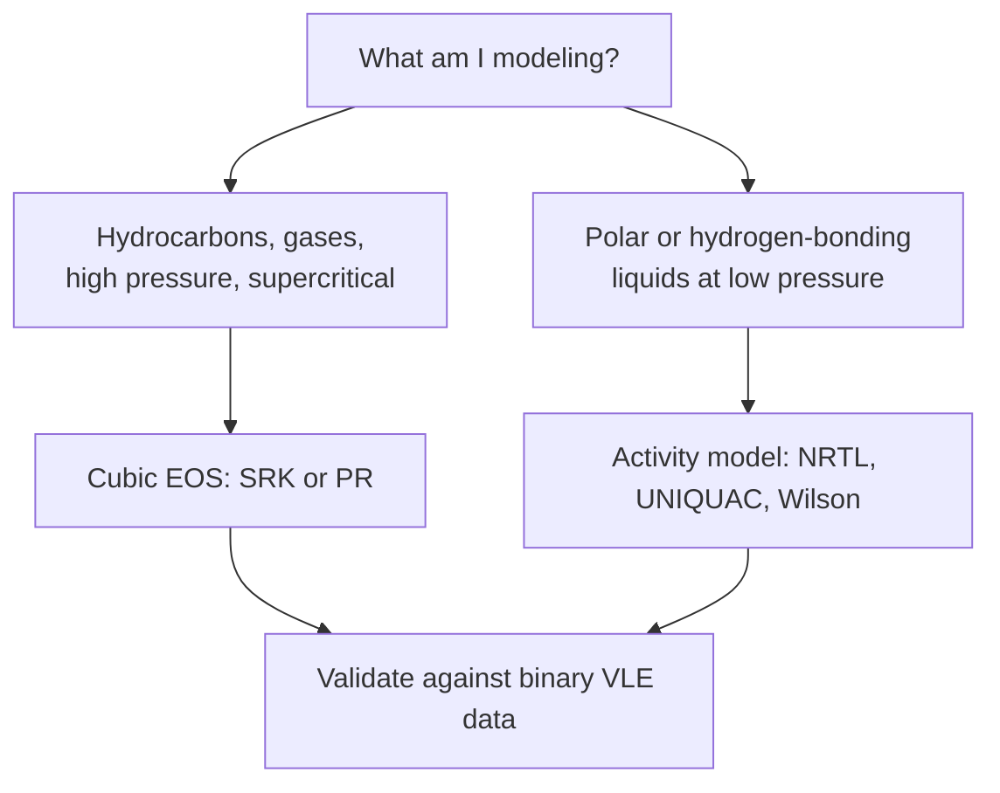

## ビデオ講義

<div class="video-container">
  <iframe
    width="560"
    height="315"
    src="https://www.youtube.com/embed/tGOpNey5U9E?start=2925"
    title="化学工学熱力学 第5章: 実在流体と状態方程式"
    frameborder="0"
    allow="accelerometer; autoplay; clipboard-write; encrypted-media; gyroscope; picture-in-picture"
    allowfullscreen>
  </iframe>
</div>

> このビデオは以下のテキストと同じ内容をカバーしています。お好みの学習形式をお選びください。

---

# 第5章：実在流体と状態方程式

この最終章では、理想気体の法則を、実際のプロセスシミュレータが用いる状態方程式に置き換えます。そして、シミュレータの設定ダイアログの奥に埋もれた熱力学モデルが、その答えに価値があるかどうかを静かに決めてしまうのはなぜかを示します。

**理想気体からプロセスシミュレータへ**

## 学習目標

本章を修了すると、以下ができるようになります:

  * ✅ 理想気体の法則が十分な場面と破綻する場面を説明できる
  * ✅ 圧縮係数 Z を定義し、1 より大きい値と小さい値を解釈できる
  * ✅ ファンデルワールス式のパラメータ a と b が何を表すかを説明できる
  * ✅ 産業で用いられる3次型状態方程式を挙げ、それらが必要とする物性を述べられる
  * ✅ 対象とする系に対して、3次型状態方程式と活量係数モデルのどちらを選ぶか判断できる
  * ✅ あらゆるシミュレータ、デジタルツイン、ソフトセンサーが熱力学モデルの上に立っている理由を説明できる

**読了時間**: 20-25分 **コード例**: 1 **演習**: 3

* * *

## 5.1 理想気体が破綻するところ

ここまでのすべての章は、理想気体の法則に寄りかかってきました:

$$ PV = nRT $$

これは 2 つの仮定の上に成り立っています: 分子は体積を持たない、そして分子どうしは力を及ぼし合わない。分子が互いに遠く離れているとき — **低圧かつ高温** — には、どちらも優れた近似であり、入門的な扱いの大部分と、実際のプラント運転のかなりの部分をカバーします。

しかしこの 2 つの仮定は、エンジニアが最も気にする条件でこそ、そろって崩れます。凝縮の近傍では引力がすべてであり、高圧では分子が十分密に詰まって、分子自身の体積が効いてきます。これは運転領域の中の風変わりな片隅などではありません。**あらゆる圧縮機の吸込・吐出** であり、**アンモニア合成ループの 150〜300 bar**（第 4 章）であり、そして本質的に **天然ガスの処理と液化のすべて** です。そこで $PV = nRT$ を使うことは、少し粗い答えを生むのではなく、誤った答えを生みます。

そのずれを測る標準的な指標が **圧縮係数（compressibility factor）** です:

$$ Z = \frac{PV}{nRT} $$

$Z$ は実在のモル体積と理想のモル体積の比なので、$Z = 1$ は理想的な振る舞いを意味し、そこからのずれは理想気体の法則がどれほど嘘をついているかを測ります。重要な領域は 2 つです:

- **$Z < 1$** — 引力が支配的。分子が互いに引き合うため、実在気体は理想気体より *コンパクト* になります。中程度の圧力ではこちらが一般的なケースです。
- **$Z > 1$** — 斥力が支配的。非常な高圧では分子自身の有限の大きさがそれ以上の圧縮に抵抗し、気体は理想気体より *コンパクトでなく* なります。

以下の表は、5.3 節のコードで計算した 300 K のメタンの値です:

| 圧力 | Z | 解釈 |
|---|---|---|
| 1 bar | 0.998 | 実質的に理想気体 |
| 50 bar | 0.924 | 引力が効く。無視すれば 8% の誤差 |
| 150 bar | 0.851 | 引力の効果が最大 |
| 300 bar | 0.951 | 斥力が押し返す |
| 400 bar | 1.070 | 斥力が支配的、Z > 1 |

50 bar における 8% の体積誤差は、そのまま圧縮機動力、容器サイジング、在庫量へと伝播します。もはや問いは、非理想性を補正するかどうかではなく、どう補正するかです。

## 5.2 ファンデルワールスの洞察

最初の成功した答えは、ヨハネス・ディーデリク・ファンデルワールスが **1873 年** の博士論文で与えたもので、この仕事は後にノーベル賞を受けました。彼の発想は、破綻した仮定それぞれに 1 つずつ項を当てて、理想気体の法則を繕うことでした:

$$ \left(P + \frac{a}{V_m^2}\right)\left(V_m - b\right) = RT $$

ここで $V_m$ はモル体積です。

| パラメータ | 何を補正するか | 物理的意味 |
|---|---|---|
| **a** | 分子間引力 | 分子は内側へ引き合うため、容器壁が感じる圧力は、引力で減じられる前の分子衝突そのものの圧力より *低い*。$a/V_m^2$ を足し戻す |
| **b** | 有限の分子体積 | 分子はゼロの空間に圧縮できない。自由体積は $V_m$ ではなく $V_m - b$ |

どちらのパラメータも物質ごとに固有であり、どちらもその物質の臨界点から得られます。

これを単なるカーブフィット以上のものにしているのは、そこから帰結することです。この式は **体積について3次** であるため、臨界温度より下では、1 つの圧力に対して 3 つの実根を返しうるのです — 最大の根が蒸気、最小の根が液体、真ん中の根は物理的に不安定なもの。言い換えれば、気体のために書かれた 1 つの式が、**凝縮**、**液相**、そして 2 相が区別できなくなる **臨界点** を、おのずと予測してしまうのです。これは正真正銘の発見であり、ファンデルワールスが本章のすべての祖先である理由でもあります。

同時に、これは設計に使えるほど正確ではありません。現代の実務は、その構造 — 斥力項と引力項、体積について3次 — を保ったまま、中身を置き換えます。

## 5.3 実務における3次型状態方程式

産業のプロセスシミュレーションを支配しているのは、その 2 つの子孫です:

- **Soave–Redlich–Kwong（SRK式）**、Soave により **1972 年** に発表、1949 年の Redlich–Kwong 式を修正したもの
- **Peng–Robinson（PR式）**、**1976 年** に発表

どちらも体積について3次のままであり、これは実務上重要です: 3次式は、何百万回ものフラッシュ計算に対して速く確実に解けますし、その複数の根が、ファンデルワールスの発見した気液の振る舞いを保持します。どちらも純成分あたりちょうど 3 つの入力を取ります — **臨界温度 $T_c$**、**臨界圧力 $P_c$**、そして分子が球からどれだけ隔たっているかを表す 1 つの数値である **偏心因子 $\omega$** です。実務では、臨界領域近傍の液密度には PR 式が好まれることが多く、SRK 式はガス処理で長い伝統を持ちますが、たいていの炭化水素系では両者はよく一致します。

この背後にあるのが **対応状態原理** です: 同じ **換算条件** で比べたとき

$$ T_r = \frac{T}{T_c} \qquad P_r = \frac{P}{P_c} $$

異なる流体は驚くほど似た振る舞いをします。$T_r = 1.5$ のメタンは、$T_r = 1.5$ の窒素とよく似て見えます。3 つのパラメータを持つ 1 つの式が何百もの化合物をカバーできるのはこのためであり、偏心因子が存在する理由でもあります: それは、単純な球ではない分子に対する補正なのです。

以下のコードは、3次方程式を数値的に解いて、SRK 式からメタンの $Z$ を計算します。

```python
import numpy as np

def srk_Z(T, P, Tc, Pc, omega):
    """Compressibility factor Z from the Soave–Redlich–Kwong EOS."""
    Tr, Pr = T / Tc, P / Pc                       # reduced temperature and pressure
    m = 0.480 + 1.574 * omega - 0.176 * omega**2  # Soave's acentric correction
    alpha = (1.0 + m * (1.0 - np.sqrt(Tr)))**2    # temperature dependence of attraction
    A = 0.42748 * alpha * Pr / Tr**2              # dimensionless attraction term
    B = 0.08664 * Pr / Tr                         # dimensionless volume term
    # Cubic in Z:  Z^3 - Z^2 + (A - B - B^2) Z - A*B = 0
    roots = np.roots([1.0, -1.0, A - B - B**2, -A * B])
    real = np.sort(roots[np.abs(roots.imag) < 1e-9].real)
    real = real[real > B]                         # discard unphysical roots
    return real[-1]                               # vapor root = largest real root

# Methane: Tc = 190.6 K, Pc = 45.99 bar, omega = 0.011
Tc, Pc, omega = 190.6, 45.99, 0.011

print(f"{'T (K)':>7} {'P (bar)':>8} {'Tr':>6} {'Pr':>6} {'Z (vapor)':>10}")
for T, P in [(300.0, 1.0), (300.0, 50.0), (300.0, 150.0), (300.0, 300.0), (300.0, 400.0)]:
    print(f"{T:7.1f} {P:8.1f} {T/Tc:6.3f} {P/Pc:6.3f} {srk_Z(T, P, Tc, Pc, omega):10.4f}")

#   T (K)  P (bar)     Tr     Pr  Z (vapor)
#   300.0      1.0  1.574  0.022     0.9983
#   300.0     50.0  1.574  1.087     0.9238
#   300.0    150.0  1.574  3.262     0.8508
#   300.0    300.0  1.574  6.523     0.9511
#   300.0    400.0  1.574  8.698     1.0703
```

300 K・50 bar において、SRK 式は **Z = 0.924** を与えます: メタンは、理想気体の法則が予測するよりおよそ 8% 小さい体積を占めるということです。この実行結果は、5.1 節の定性的な流れも再現しています — 引力が効き始めて $Z$ が下がり、底を打ち、やがて斥力が勝って 1 を超えて上昇していきます。

同じ状態方程式は、体積以上のものをもたらします。そこから各成分の **フガシティー係数** $\phi_i$ — 実効圧力に対する補正係数であり、第 3 章のフガシティーが $f_i = \phi_i y_i P$ となり、気体が理想に近づくにつれ $\phi_i \to 1$ となるように定義されます — が計算できます。それこそが、高圧下でも平衡計算を生き延びさせるものです。第 4 章の平衡定数は、そこでは分圧のみで書かれていましたが、厳密には $K_\phi = \prod_i \phi_i^{\nu_i}$ という因子を伴います。そして **150〜300 bar のアンモニアループ** では、その因子は形式上のものではなく実質的な補正です — まさに $Z$ が 1 から数十パーセント外れる条件です。第 4 章の理想気体に基づく平衡計算が産業的な圧力でも信頼に足るのは、このためです: 厳密であるからではなく、状態方程式が供給する数値によって補正されるからです。

## 5.4 3次型を超えて: 物性パッケージを選ぶ

3次型状態方程式は、無極性ないし弱い極性の分子 — 炭化水素、窒素、二酸化炭素、水素 — に対して、気体条件から高圧条件までよく機能します。うまくいかないのは **強い極性を持つ液体や水素結合する液体** で、そこでは相互作用が平均化された引力ではなく、特異的で方向性を持つものになります。水、アルコール、有機酸は、単一のパラメータ $a$ では表現できない、まさにそうしたケースです。

そうした液体混合物に対して、エンジニアは代わりに **活量係数モデル** を用います — **NRTL**、**UNIQUAC**、**Wilson** が標準的な名前であり、データが存在せず分子団からパラメータを推算しなければならない場合には **UNIFAC** が使えます。これらのモデルは液相における理想溶液からのずれを記述するもので、エタノール-水のような共沸を再現できるのはこれらです。3次型状態方程式は、単独では共沸を正しく捉えられません。



この選択 — **物性パッケージ** — は、シミュレータが最初に尋ねてくるものであり、そして大半のユーザーが最も無造作にクリックして通り過ぎる、最も重大なものです。注意を払う価値があるのは、**誤った物性パッケージがシミュレーション精度における古典的なサイレントキラーだから** です。シミュレーションはクラッシュしません。収束し、完全な熱収支・物質収支を出力し、塔のプロファイルを小数点以下 4 桁まで報告します — それが単に誤っているだけです。エタノール-水の蒸留塔を3次型状態方程式でモデル化すると共沸が消えてしまうことがあり、そうなるとシミュレータは、そこそこの段数で純エタノールが得られると上機嫌で告げてくるでしょう — 存在しえない設計です。

実務的な指針は短いものです。低圧の極性液体には、活量係数モデル。炭化水素、軽質ガス、あるいは高圧のものは何であれ、3次型状態方程式。迷ったとき、あるいは答えに金銭がかかっているときは、下流の結果を信用する前に、系の中の重要な組に対して **実測の二成分気液平衡データにモデルを照らして確認すること**。二成分相互作用パラメータを実データに対して回帰することは、高度な技術ではなく、日常的なプロの実務です。

## 5.5 デジタルプラントの基礎としての熱力学

現代のデジタルの層にあるものはすべて、本章の上に乗っています。**フローシートシミュレータ** は、構造的には 3 つのものです: 物質収支とエネルギー収支、単位操作モデル、そしてそれらのモデルが要求するあらゆるエンタルピー・エントロピー・密度・平衡定数を供給する熱力学パッケージです。収支は厳密であり、単位操作モデルは近似です — しかし熱力学こそが物理的な真実が入ってくる場所であり、最も深く、最も見えにくい層なのです。

1 つ上のレベルでも同じことが言えます。**デジタルツイン**（*化学工学入門* シリーズの第 5 章を参照）は、稼働中のプラントと同期され続けるシミュレーションであり、その物性パッケージをそっくりそのまま受け継ぎます。密度・露点・組成を予測する **ソフトセンサー** は、熱力学量を予測しているのであり、それが何に対して学習されたにせよ、その量の定義がそのままソフトセンサーにとっての真実の定義になります。

このことは機械学習に対して鋭い帰結を持ちます。**シミュレータの出力で学習した ML 代理モデルは、そのシミュレータの熱力学を — 精度も誤差も同じように — 受け継ぎます。** 代理モデルは、物性パッケージの系統的な誤差を物理と区別できません。その誤差を忠実に学習し、そして速く、滑らかに、何の警告も付さずに再現します。学習元のシミュレータと 0.1% で一致する代理モデルは、0.1% の精度を持つのではありません。それは、自らの精度が別問題であり誰も問わなかったモデルと、0.1% で *整合している* にすぎないのです。

そしてこれが、本シリーズの締めくくりの論点です。熱力学のリテラシーとは、状態方程式を暗記することではありません — それはシミュレータのほうがあなたよりうまく解きます。それは、200 bar で理想気体の法則が単に不正確なのではないと知っていること、共沸が数値的な人工物ではなく実在する物理的制約であると知っていること、そして収束したシミュレーションはモデルについての言明であってプラントについての言明ではないと知っていることです。**熱力学のリテラシーとは、エンジニアが正しい理由でシミュレーションを疑えるようにするものなのです。**

## 5.6 シリーズのまとめ

第 1 章では **エネルギーの勘定** を確立しました: 第一法則、エンタルピー、そしてエネルギーは保存されるが決してタダではないという事実です。第 2 章では、エントロピーと第二法則を通じて **方向と限界** を加えました — なぜ熱は一方向に流れるのか、なぜ 100% に達する熱機関が存在しないのか、そしてなぜ現実のあらゆるプロセスが仕事をする能力の一部を破壊するのか。第 3 章では、その両方を **相平衡** に適用しました。蒸留・吸収、そしてプラントのあらゆる分離の基礎です。第 4 章では、同じ平衡の論理を **反応系** に拡張し、$\Delta G$ がいかなる触媒によっても引き上げられない上限を定めることを示しました。第 5 章では理想気体を捨て、産業のシミュレーションが実際に動かしている **実在流体のモデル** にたどり着きました。

これら 5 つの章はまとめて、何が実際的かを問う前に、何が可能かを描き出します — それこそが、化学工学教育で熱力学が最初に来る理由であり、その後に続くキャリア全体にわたって役立ち続ける理由です。

次に進む先: *化学工学入門* シリーズをもう一度たどってみてください — その単位操作、反応器、設計上の判断は、熱力学が備わったいま、違って読めるはずです。そして、これらのモデルの上に築かれるデータの層については *プロセス・インフォマティクス入門* へ、1 回の実験が高価なときに意思決定を行う方法については *ベイズ最適化入門* へ進んでください。

最後までお読みいただきありがとうございました。

## 演習問題

1. **概念 — 理想気体の法則はいつ許容できるか?**: ある同僚が、(a) 1 bar・25 °C の換気ダクト内の空気、(b) ボイラードラム内の 40 bar の蒸気、(c) アンモニアループに供給される 200 bar の水素、に対して $PV = nRT$ を用いています。どの用法が擁護できますか。またそれぞれの場合に、どの 1 組の数値を確認しますか。
   *ヒント*: 換算条件で考えること — それぞれの流体は自身の臨界点からどれだけ離れているか、そして凝縮の近くにいないか。
   *解答*: **(a) は問題ありません。** 常温常圧の空気は臨界温度をはるかに上回り、換算圧力も非常に低いので、$Z \approx 1.00$ であり、理想気体の法則は 1% の何分の一という精度で正確です。**(b) は擁護できません。** ボイラードラム内の 40 bar の蒸気は飽和状態にあり、凝縮線の *上に* 乗っています。そこでは引力が支配的で、$Z$ は 1 から大きく外れます。さらに水は強く水素結合します。蒸気表か適切な物性モデルを使うべきです。**(c) も擁護できません。** ただしそれは水素が極性だから（極性ではありません）ではなく、200 bar が分子体積の効いてくる十分な高圧だからです。水素はそこで特徴的に $Z > 1$ を示すので、理想気体の法則は体積を *過小評価* します。いずれの場合も確認すべき 1 組の数値は換算条件 $T_r = T/T_c$ と $P_r = P/P_c$ です: $T_r \approx 2$ を余裕をもって上回り、$P_r \approx 0.1$ を下回っていれば、理想気体でたいてい安全です。

2. **定量 — PVT データから Z を計算する**: ある気体を **300 K**・**50 bar** で測定したところ、1 mol が **0.46 L** を占めていました。$R = 0.08314$ L·bar·mol⁻¹·K⁻¹ とします。(a) 理想気体のモル体積、(b) $Z$、(c) どちらの分子的効果が支配的かを求めなさい。
   *ヒント*: $Z = PV/(nRT)$。まず $RT$ を L·bar/mol の単位で計算すること。
   *解答*: $RT = 0.08314 \times 300 = 24.94$ L·bar/mol。(a) 理想気体のモル体積 $= RT/P = 24.94/50 = \mathbf{0.499\ L/mol}$。(b) $Z = PV/(RT) = (50 \times 0.46)/24.94 = 23.0/24.94 = \mathbf{0.922}$。(c) $Z < 1$ なので、実在気体は **理想気体よりコンパクト** であり、**引力が支配的** です — 中程度の圧力では通常の状況です。これが 5.3 節のメタンに対する SRK の結果（同じ条件で $Z = 0.924$）にどれほど近いかに注目してください: 状態方程式が実測の振る舞いを再現しているということであり、それこそが状態方程式の目的です。

3. **討論 — 物性パッケージの選定**: 2 つのシミュレーションを立ち上げなければなりません: (a) 1 atm の **エタノール-水の蒸留塔**、(b) ほぼメタンの流体を 10 bar から 100 bar まで昇圧する **天然ガス圧縮機列**。それぞれに物性モデルを選び、その根拠を述べ、それぞれについて警戒すべき失敗モードを 1 つ挙げなさい。
   *ヒント*: 難しい振る舞いが液相にあるのか、それとも高度に圧縮された気相にあるのかを問うこと。
   *解答*: **(a) エタノール-水: 活量係数モデル — NRTL または UNIQUAC。** 圧力が低いので気相の非理想性は無視できます。難しさのすべては **液相** にあり、そこでは水素結合が理想溶液からの強いずれと、**重量比 95.6% エタノールにおける最低沸点共沸** を生みます。3次型状態方程式はそうした特異的な相互作用を平均化して消してしまい、共沸を完全に見落としうるので、達成不可能な段数で純エタノールが得られると約束する塔設計を生みます。これを防ぐには、**二成分相互作用パラメータを実測のエタノール-水気液平衡データに対して回帰し**、何かを設計する前に、モデルが共沸組成と共沸温度を再現することを確認します。**(b) 天然ガス圧縮機列: 3次型状態方程式 — SRK 式または PR 式。** メタンは無極性なので3次型でよく扱え、100 bar はまさに理想気体の法則が破綻する領域です: 5.3 節が示すとおり 50 bar で $Z \approx 0.92$ なので、圧縮性を無視すると体積流量と圧縮機動力を段あたり数パーセント誤ります。警戒すべき失敗モードは **より重い成分** です: 実際の天然ガスはエタン、プロパン、CO₂、水を含んでおり、中間的な条件で **逆行凝縮**（減圧に伴う凝縮）**あるいはハイドレート生成**（氷状の水-ガス固体）が起こるリスクがあります。純メタンではなく実際の多成分混合物をモデル化し、圧縮経路に沿って相包絡線（2 相領域の境界）を確認して、液が存在する状態で運転している段が気づかれないまま生じないようにします。
