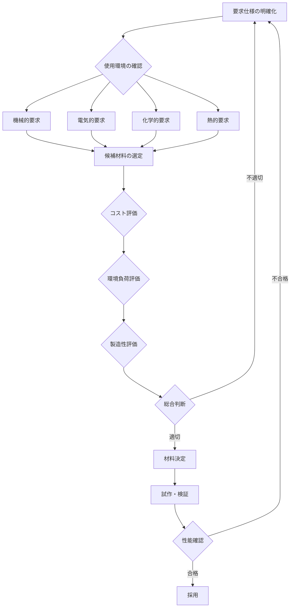

# 第4章 応用：材料選択の基準

## 材料選択の重要性

適切な材料を選択することは、製品の性能、コスト、環境負荷を大きく左右します。材料選択は単一の物性だけでなく、使用環境、製造プロセス、ライフサイクル全体を考慮した総合的な判断が必要です。

## 材料選択のフローチャート

実際の材料選択プロセスは、以下のフローに沿って行われます：

このフローチャートは、材料選択が単純な一方向のプロセスではなく、要求仕様に戻って再検討する反復的なプロセスであることを示しています。

## 実践的な応用例

### 応用例1: 構造材料の選択（建築・航空宇宙）

**建築分野での鉄骨構造**

高層ビルの骨組みには、主に鉄鋼材料が使用されます。選択理由は以下の通りです：

- **高い引張強度**: 500 MPa以上の降伏強度により、大きな荷重に耐えられる
- **延性**: 地震時の変形エネルギーを吸収し、建物の倒壊を防ぐ
- **溶接性**: 現場での接合が容易で施工性が高い
- **コスト**: トン当たり数万円と比較的安価

一方、超高層ビルの一部には**高強度コンクリート**（セラミックス系複合材料）を使用します：

- **圧縮強度**: 60-100 MPaの高い圧縮耐力
- **耐火性**: 高温でも構造を維持
- **施工性**: 現場打設が可能

**航空宇宙分野でのアルミニウム合金**

航空機の機体には、アルミニウム合金（特にジュラルミン: Al-Cu-Mg系）が広く使用されます：

- **軽量性**: 密度2.7 g/cm³で鉄鋼の約1/3
- **比強度**: 強度/重量比が高く、燃費向上に貢献
- **加工性**: 押出、鍛造などの成形が容易
- **コスト**: 炭素繊維複合材料の1/10程度

最新の航空機では、**炭素繊維強化プラスチック（CFRP）**の使用も増加しています：

- **超軽量**: アルミニウムの60%の重量で同等の強度
- **疲労耐性**: 金属疲労がない
- **デメリット**: 高コスト（アルミの約10倍）、衝撃損傷の検出が困難

### 応用例2: 電子材料の選択（半導体・電池）

**半導体デバイスのシリコン**

現代のほぼすべての半導体デバイスに単結晶シリコンが使用される理由：

- **バンドギャップ**: 1.1 eVで室温動作に最適
- **豊富な資源**: 地殻中に多く存在しコストが低い
- **酸化膜形成**: SiO₂の高品質絶縁膜を容易に形成可能
- **製造技術**: 70年以上の蓄積された技術基盤

一方、高速・高周波デバイスには**ガリウム砒素（GaAs）**や**窒化ガリウム（GaN）**を選択：

- **電子移動度**: Siの2-5倍で高速動作が可能
- **バンドギャップ**: GaNは3.4 eVでパワーデバイスに適する
- **コスト**: Siウエハーの10-100倍高価

**リチウムイオン電池の電極材料**

正極材料の選択は、電池の性能を決定づけます：

| 材料 | エネルギー密度 | サイクル寿命 | コスト | 主な用途 |
|------|---------------|-------------|--------|----------|
| LiCoO₂ | 高 (150-200 Wh/kg) | 中 (500-1000回) | 高 | スマートフォン |
| LiFePO₄ | 中 (90-120 Wh/kg) | 高 (2000-3000回) | 中 | 電動工具 |
| NMC (Li(Ni,Mn,Co)O₂) | 高 (150-220 Wh/kg) | 中-高 (1000-2000回) | 中 | 電気自動車 |

電気自動車には、エネルギー密度と寿命のバランスに優れた**NMC系材料**が主流となっています。

### 応用例3: 日用品の材料選択（プラスチック容器等）

**飲料用ペットボトル**

ポリエチレンテレフタレート（PET）が選ばれる理由：

- **透明性**: 内容物が見える
- **ガスバリア性**: 炭酸ガスの透過が少なく、炭酸飲料に適する
- **軽量性**: ガラス瓶の1/10の重量
- **リサイクル性**: 分別回収システムが確立
- **コスト**: 1本あたり数円と非常に安価

**電子レンジ対応容器**

ポリプロピレン（PP）が主に使用されます：

- **耐熱性**: 融点160-170℃で電子レンジ使用可能
- **耐薬品性**: 酸・アルカリに強い
- **成形性**: 射出成形で複雑形状が作れる
- **安全性**: 食品接触用途で安全性が確認済み

一方、高温調理には**ガラス（セラミックス）**を選択：

- **耐熱性**: 500℃以上に耐える
- **化学的安定性**: 溶出物がなく安全
- **デメリット**: 重い、割れやすい

## ベストプラクティス：3つのバランス

材料選択における重要な3つの要素とそのバランス：

### 1. **コストバランス**

✅ **良い実践**:
- 初期材料費だけでなく、製造コスト、メンテナンスコスト、廃棄コストを含めたライフサイクルコスト（LCC）で評価する
- 例: 自動車エンジン部品で、高価な耐熱合金を使用することで、冷却システムを簡素化し、トータルコストを削減

❌ **悪い実践**:
- 材料単価のみで判断し、加工費や品質管理コストを無視
- 結果的に製造不良率が上昇し、総コストが増加

### 2. **性能バランス**

✅ **良い実践**:
- 要求される複数の物性のバランスを取る
- 例: スマートフォン筐体にアルミニウム合金を使用（強度、軽量性、放熱性、加工性のバランス）

❌ **悪い実践**:
- 特定の物性（例: 強度）のみを最大化
- 例: 最高強度の材料を選択したが、脆性破壊により実用性が低下

### 3. **環境バランス**

✅ **良い実践**:
- 製造時のエネルギー、使用段階の環境負荷、リサイクル性を総合評価
- 例: 自動車の軽量化材料として、製造エネルギーは高いがライフサイクルでCO₂削減効果が大きいCFRPを採用

❌ **悪い実践**:
- リサイクル困難な複合材料を安易に使用
- 廃棄時の環境負荷や処理コストを考慮せず

**具体的な評価指標**:
- LCA（ライフサイクルアセスメント）スコア
- 材料性能指数（例: E/ρ（剛性/密度）、σ/ρ（強度/密度））
- リサイクル率

## よくある間違いと回避方法

### 間違い1: 単一物性のみで材料を選択

❌ **悪い例**:
「この部品には最も硬い材料を使おう。ダイヤモンドコーティングが最適だ」

**問題点**:
- 硬度は高いが、脆性が高く衝撃に弱い
- コストが極端に高い（1cm²あたり数千円）
- 大量生産に不向き

✅ **良い例**:
「この部品には、耐摩耗性、靭性、コストのバランスを考慮して、窒化処理した工具鋼を使用する」

**改善点**:
- 複数の物性を総合評価
- 製造プロセスとコストも考慮
- 実用性と経済性のバランス

### 間違い2: 過剰品質（オーバースペック）

❌ **悪い例**:
「安全のため、必要強度の10倍の材料を使おう」

**問題点**:
- 不要なコスト増加
- 重量増加による性能低下（例: 燃費悪化）
- 資源の無駄

✅ **良い例**:
「安全率3-5倍を確保し、適切な材料を選択。定期点検で安全性を維持」

**改善点**:
- 適切な安全率の設定（一般的に3-5倍）
- 過剰品質ではなく、適正品質
- メンテナンス計画と組み合わせた信頼性確保

### 間違い3: 製造プロセスを無視した材料選択

❌ **悪い例**:
「この材料は性能が良いから採用しよう」→ 既存設備では加工できず、大規模投資が必要に

**問題点**:
- 製造設備の新規導入コストが膨大
- 加工技術の習得に時間がかかる
- 量産までのリードタイムが長い

✅ **良い例**:
「既存の成形設備で加工可能な材料の中から、性能要求を満たすものを選択」

**改善点**:
- 製造プロセスとの整合性を確認
- 段階的な技術導入計画
- サプライチェーンの成熟度も考慮

## 材料選択の意思決定ツール

実際の材料選択では、以下のような評価マトリックスを使用します：

| 評価項目 | 重み | 材料A | 材料B | 材料C |
|---------|-----|-------|-------|-------|
| 機械的性質 | 30% | 8点 | 6点 | 9点 |
| コスト | 25% | 5点 | 9点 | 4点 |
| 製造性 | 20% | 7点 | 8点 | 5点 |
| 環境性 | 15% | 6点 | 7点 | 8点 |
| 入手性 | 10% | 8点 | 9点 | 6点 |
| **総合得点** | **100%** | **6.9** | **7.6** | **6.5** |

この例では、材料Bが総合的に最も優れた選択となります。

## まとめ

材料選択は、単純な「良い材料」「悪い材料」の二元論ではなく、**用途に応じた最適な材料**を見極めることが重要です。

**材料選択の5つの原則**:
1. 要求仕様を明確にする
2. 複数の物性をバランス良く評価する
3. ライフサイクル全体でコストを考える
4. 製造プロセスとの整合性を確認する
5. 環境負荷とリサイクル性を考慮する

これらの原則に基づいた材料選択により、高性能で経済的、かつ環境に配慮した製品設計が可能になります。次章では、本記事全体のまとめと、さらに深く学ぶための次のステップを紹介します。
