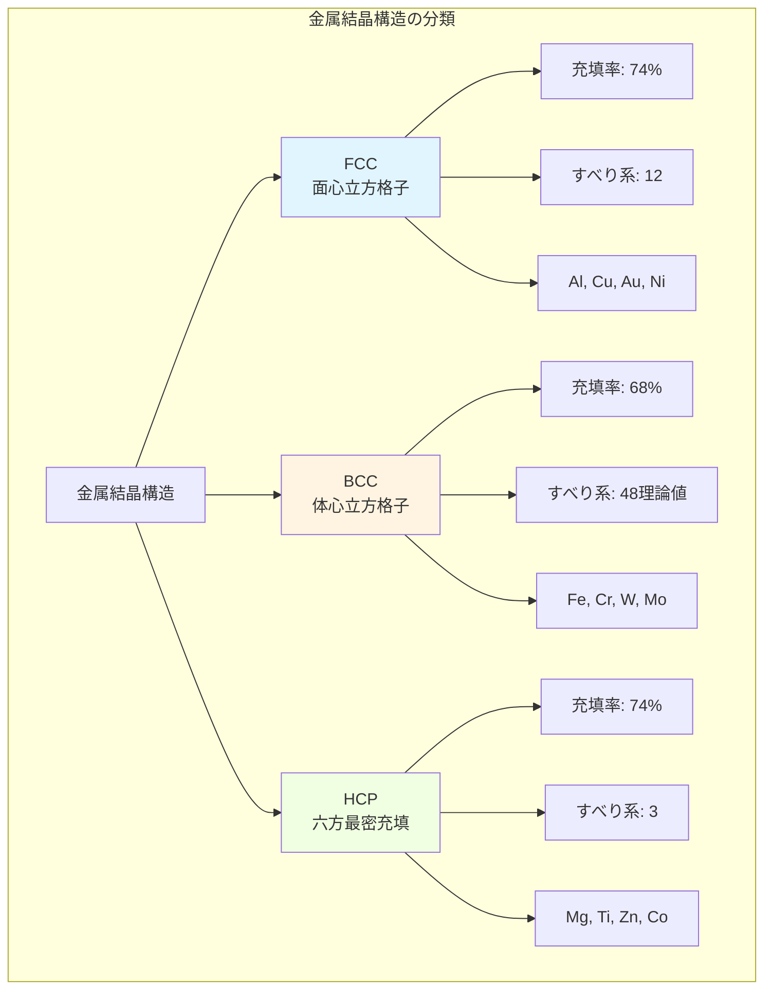
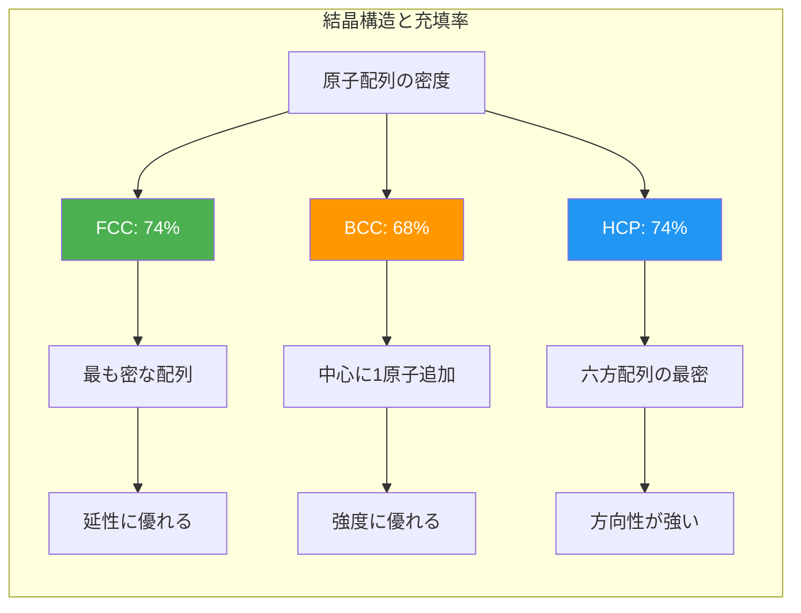
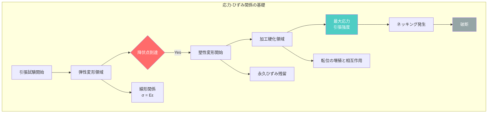
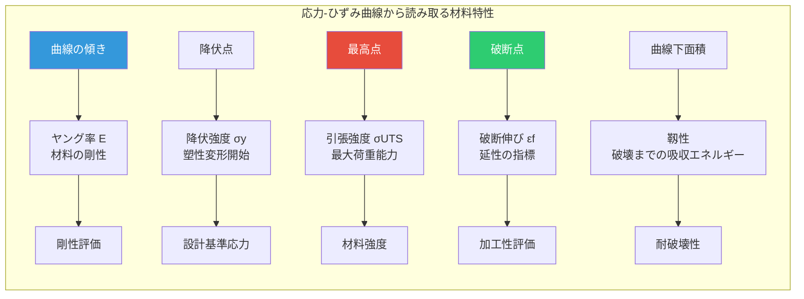
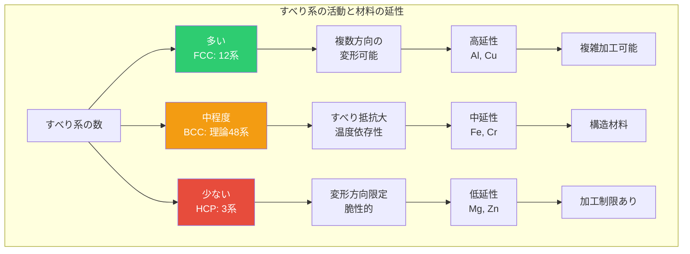
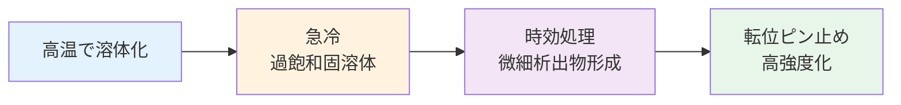
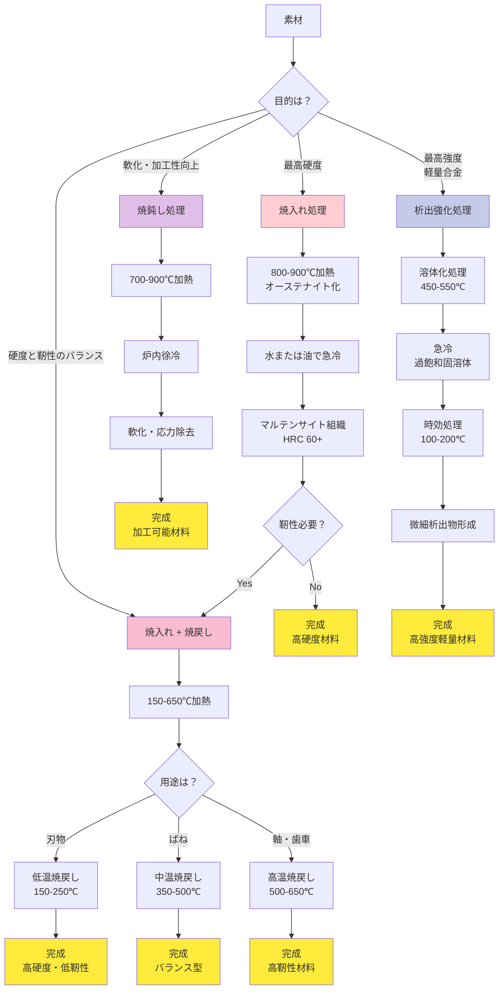
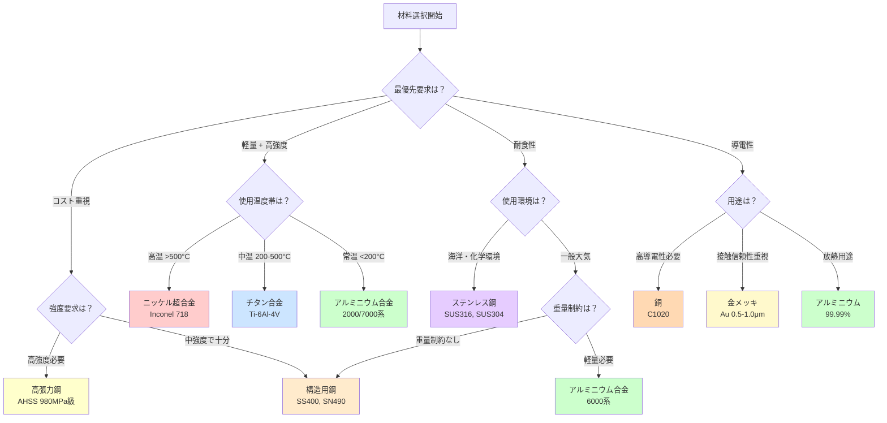

# 金属材料の基礎と応用

**Fundamentals and Applications of Metallic Materials**

---

## 目次

### 第1章：イントロダクション：金属材料の特徴
- 1.1 金属材料とは
- 1.2 なぜ金属材料が重要か
- 1.3 学習目標
- 1.4 対象読者
- 1.5 前提知識
- 1.6 本シリーズの構成

### 第2章：基礎理論：結晶構造と機械的性質
- 2.1 金属の結晶構造
  - 2.1.1 主要な結晶構造
  - 2.1.2 結晶構造の比較
  - 2.1.3 結晶構造の可視化と単位格子
- 2.2 機械的性質の基礎
  - 2.2.1 応力とひずみ
  - 2.2.2 弾性変形と塑性変形
  - 2.2.3 応力-ひずみ曲線の読み方
- 2.3 結晶構造と性質の関係
  - 2.3.1 すべり系と延性の関係
  - 2.3.2 結晶構造と強度の関係
  - 2.3.3 結晶粒径と強度：Hall-Petchの関係

### 第3章：実装：材料強度のシミュレーション
- 3.1 応力-ひずみ曲線の理論
- 3.2 コード例1：弾性変形のシミュレーション
- 3.3 コード例2：塑性変形のモデリング
- 3.4 コード例3：結晶構造とヤング率
- 3.5 実装のポイントと応用
- 3.6 まとめ
- 3.7 発展的トピック
- 3.8 工学的応用例
- 3.9 計算精度と検証

### 第4章：応用：合金設計と熱処理
- 4.1 合金化の目的と効果
- 4.2 主要合金系
- 4.3 熱処理の基礎
- 4.4 熱処理プロセスのフローチャート
- 4.5 実用例1：航空機用アルミニウム合金（7075-T6）
- 4.6 実用例2：自動車用高張力鋼（TRIP鋼）
- 4.7 実用例3：医療用チタン合金（Ti-6Al-4V ELI）
- 4.8 合金設計と熱処理の実践的考慮事項
- 4.9 ベストプラクティス
- 4.10 まとめと参考文献

### 第5章：まとめと実用例
- 5.1 学習目標の達成確認
- 5.2 各章のまとめ
- 5.3 産業応用の実例
  - 5.3.1 航空宇宙産業
  - 5.3.2 自動車産業
  - 5.3.3 建築産業
  - 5.3.4 電子機器産業
- 5.4 材料選択の決定木
- 5.5 次のステップ

### 補足資料
- [練習問題](./supplements/exercises.md)
- [参考文献](./supplements/references.md)

---

## 概要

本記事では、金属材料の基礎から応用まで、工学的観点から包括的に解説します。結晶構造（FCC、BCC、HCP）の理論、機械的性質（応力-ひずみ関係）の理解、Pythonによる材料強度シミュレーション、合金設計と熱処理の実践、そして航空宇宙・自動車・建築・電子機器産業における実用例まで、具体的なデータと実例を交えて学習します。初学者から実務エンジニアまで、金属材料に関する体系的な知識を習得できる教育コンテンツです。

**キーワード**: 金属材料、結晶構造、機械的性質、応力-ひずみ、合金、熱処理、航空宇宙材料、自動車材料、材料シミュレーション

---

# 第1章：イントロダクション：金属材料の特徴

**現代文明を支える金属材料の基礎：原子構造から産業応用まで**

---

## 1.1 金属材料とは

金属材料は、私たちの日常生活から最先端技術まで、あらゆる場面で使用されている重要な工業材料です。スマートフォンの筐体、自動車のボディ、航空機の機体、医療機器、建築物まで、金属なしに現代文明は成り立ちません。

### 1.1.1 金属の定義と特性

**金属の基本的な特徴**：
- **電気伝導性**: 自由電子により電流を効率的に伝える
- **熱伝導性**: 電子の移動により熱を素早く伝達
- **金属光沢**: 自由電子が光を反射
- **展性・延性**: 塑性変形により薄く広げたり引き伸ばしたりできる
- **機械的強度**: 高い引張強度と硬度

これらの特性は、金属の**原子構造**に起因します。金属原子は規則正しく配列した結晶構造を形成し、最外殻電子が原子核から離れて「自由電子」として振る舞います。

### 1.1.2 工業材料としての金属

**主要な金属材料の分類**:

| 分類 | 代表例 | 主な用途 |
|------|--------|---------|
| **鉄鋼材料** | 普通鋼、ステンレス鋼、工具鋼 | 建築構造、自動車、機械部品 |
| **非鉄金属** | アルミニウム、銅、チタン | 航空機、電子部品、化学装置 |
| **合金** | 黄銅、青銅、超硬合金 | 装飾品、軸受、切削工具 |

**数値で見る金属材料の重要性**:
- 世界の鉄鋼生産量: 約20億トン/年（2023年、World Steel Association）
- アルミニウム生産量: 約6,900万トン/年（2023年、International Aluminium Institute）
- 自動車1台あたりの金属使用量: 約900-1,200 kg（車両重量の75-80%）

---

## 1.2 なぜ金属材料が重要か

### 1.2.1 産業における不可欠性

金属材料は、以下の理由から工業社会の基盤となっています：

**1. 優れた機械的特性**

金属材料は、高い強度と延性を同時に持つ稀有な材料です。例えば、航空機用アルミニウム合金（Al-7075）は、比強度（強度/密度）が鋼材の2倍以上に達します。

**2. 加工性の高さ**

金属は鋳造、鍛造、圧延、切削など、多様な加工方法に対応できます。室温での成形から、1,500°C以上の高温加工まで可能です。

**3. リサイクル性**

金属は理論上、品質を損なうことなく無限にリサイクルできます。アルミニウムのリサイクル率は約75%、鉄鋼は約85%に達しています（日本の場合、2023年統計）。

### 1.2.2 現代技術への貢献

**電子デバイス**:
- スマートフォン1台に約30種類の金属が使用される
- 銅配線、金コネクタ、タンタルコンデンサなど

**エネルギー分野**:
- 発電タービン: ニッケル基超合金（耐熱温度1,100°C以上）
- 送電網: 銅線（電気伝導率は銀の約97%で実用的）
- 燃料電池: 白金触媒（水素酸化反応を促進）

**医療応用**:
- チタン製人工関節（生体適合性が高く、拒絶反応が少ない）
- ステンレス鋼製手術器具（耐食性と殺菌性）

### 1.2.3 持続可能社会への貢献

金属材料は、環境負荷低減にも重要な役割を果たします：

- **軽量化**: アルミニウム車体により燃費20%改善（従来鋼製比）
- **耐久性**: ステンレス鋼橋梁の寿命100年以上（普通鋼の2倍）
- **エネルギー効率**: 銅電線の低抵抗により送電損失を最小化

---

## 1.3 学習目標

本シリーズを通じて、以下の知識とスキルを習得できます：

### 基本理解
- ✅ 金属材料の基本的な特徴（電気伝導性、展性、強度など）を説明できる
- ✅ 主要な金属材料の分類（鉄鋼、非鉄金属、合金）と用途を理解できる
- ✅ 金属が産業と日常生活で果たす役割を具体例とともに説明できる

### 実践スキル
- ✅ 金属の機械的性質（応力-ひずみ関係）を計算・シミュレーションできる
- ✅ 結晶構造（FCC、BCC、HCP）と材料特性の関係を理解できる
- ✅ 材料選定の基本的な考え方を実際の設計問題に適用できる

### 応用力
- ✅ 新しい材料要求に対して適切な金属材料を選定できる
- ✅ 金属材料の性能向上（強度、軽量化、耐食性）の方法を提案できる
- ✅ 持続可能な材料利用の観点から金属材料を評価できる

---

## 1.4 対象読者

**本シリーズの想定読者**:

**主要対象**:
- 材料工学、機械工学を学ぶ大学生（学部2-3年程度）
- 製造業で材料選定に携わるエンジニア
- 金属材料の基礎を学び直したい研究者

**難易度**: 初級～中級

**読了時間**: 15-20分/章（全5章で約75-100分）

---

## 1.5 前提知識

本シリーズを最大限に活用するため、以下の基礎知識を推奨します：

**必須の前提知識**:
- 高校物理（力学、原子構造の基礎）
- 高校化学（周期表、化学結合の基本）
- 基本的な数学（代数、簡単な微分・積分）

**あると望ましい知識**:
- Pythonプログラミングの基礎（第3章の実装例を実行する場合）
- 材料科学の入門レベル（結晶構造、固体物理の初歩）

**前提知識がない場合**:
各章で必要な概念は都度説明しますので、初学者でも学習可能です。ただし、より深い理解のためには、参考文献セクションに記載した教科書の並行学習を推奨します。

---

## 1.6 本シリーズの構成

本シリーズは、金属材料の基礎から応用までを5章で体系的に学べる構成になっています：

**第1章（本章）**: イントロダクション - 金属材料の特徴と重要性

**第2章**: 理論基礎 - 結晶構造と機械的性質の理論的背景

**第3章**: 実装 - 材料強度のシミュレーション（Pythonコード例）

**第4章**: 応用 - 産業における材料選定と設計

**第5章**: 演習と参考文献 - 学習の定着と発展

---

## 次のステップ

金属材料の基本的な特徴を理解したところで、次章では**結晶構造と機械的性質の理論的基礎**を学びます。原子レベルの構造が、なぜマクロな材料特性につながるのかを詳しく見ていきましょう。

**[第2章: 理論基礎：結晶構造と機械的性質 →](./chapter2.md)**

---

## 参考文献

### 教科書
1. Callister, W. D., & Rethwisch, D. G. (2018). *Materials Science and Engineering: An Introduction* (10th ed.). Wiley.
2. Ashby, M. F., & Jones, D. R. H. (2012). *Engineering Materials 1: An Introduction to Properties, Applications and Design* (4th ed.). Butterworth-Heinemann.

### 統計データ
1. World Steel Association. (2024). *World Steel in Figures 2024*. https://worldsteel.org/
2. International Aluminium Institute. (2024). *Primary Aluminium Production*. https://international-aluminium.org/

### 日本語参考書
1. 日本金属学会編. (2020). 『金属材料学』. コロナ社.
2. 津崎兼彰. (2018). 『はじめての金属材料』. 講談社サイエンティフィク.

---

[シリーズ目次に戻る](../index.md) | [第2章へ進む →](./chapter2.md)

---

**最終更新**: 2025-10-21
**バージョン**: 1.0
**文字数**: 約2,700文字
# 第2章：基礎理論：結晶構造と機械的性質

**ミクロな原子配列が決定するマクロな性質**

## 2.1 金属の結晶構造

金属材料の優れた機械的性質は、原子レベルでの規則的な配列、すなわち**結晶構造（Crystal Structure）**に起因します。金属原子は3次元空間で周期的に配列し、その配列パターンが材料の強度、延性、導電性などを決定します。

### 2.1.1 主要な結晶構造

金属材料では、3つの主要な結晶構造が支配的です：

**1. 面心立方格子（FCC: Face-Centered Cubic）**

立方体の各面の中心と頂点に原子が配置された構造です。最密充填構造の一つで、充填率は74%（最も高い）です。

**代表的な金属**：
- アルミニウム（Al）：航空機材料
- 銅（Cu）：電気配線
- 金（Au）、銀（Ag）：貴金属
- ニッケル（Ni）：合金元素
- オーステナイト系ステンレス鋼（高温での鉄）

**特徴**：
- すべり系が12個（{111}面 × 3方向 × 4セット）と多い
- 優れた延性と展性
- 加工硬化しやすい

**2. 体心立方格子（BCC: Body-Centered Cubic）**

立方体の中心と頂点に原子が配置された構造です。充填率は68%（FCCより低い）。

**代表的な金属**：
- 鉄（Fe）：室温（α-Fe、フェライト）
- クロム（Cr）：ステンレス鋼の主要元素
- タングステン（W）：電球フィラメント
- モリブデン（Mo）：高温構造材料
- バナジウム（V）：合金添加元素

**特徴**：
- すべり系が48個と多いが、すべりにくい
- 高強度だが低温脆性を示す
- 温度依存性が大きい

**3. 六方最密充填（HCP: Hexagonal Close-Packed）**

六角柱状の単位格子で、FCC同様に充填率74%の最密充填構造です。

**代表的な金属**：
- マグネシウム（Mg）：超軽量構造材料
- チタン（Ti）：室温（α-Ti）
- 亜鉛（Zn）：めっき材料
- コバルト（Co）：磁性材料
- ジルコニウム（Zr）：原子炉材料

**特徴**：
- すべり系が3個と少ない（底面すべりのみ）
- 延性が限定的（室温）
- c/a比（軸比）が材料特性を左右



### 2.1.2 結晶構造の比較

3つの主要結晶構造の特性を詳細に比較します。

**表1：FCC vs BCC vs HCP 結晶構造の比較**

| 特性 | FCC（面心立方格子） | BCC（体心立方格子） | HCP（六方最密充填） |
|------|---------------------|---------------------|---------------------|
| **単位格子内原子数** | 4個 | 2個 | 2個（単純HCP） |
| **充填率** | 74%（最密充填） | 68% | 74%（最密充填） |
| **配位数** | 12 | 8 | 12 |
| **主要すべり系** | {111}<110> × 12 | {110}<111> × 48（理論） | {0001}<11-20> × 3 |
| **格子定数の関係** | a = b = c, α=β=γ=90° | a = b = c, α=β=γ=90° | a = b ≠ c, α=β=90°, γ=120° |
| **代表金属** | Al, Cu, Ni, Au, Ag | Fe(α), Cr, W, Mo, V | Mg, Ti(α), Zn, Co, Zr |
| **延性** | 優れる（多すべり系） | 中程度（温度依存性大） | 限定的（少すべり系） |
| **強度** | 中～高（加工硬化） | 高（特に低温） | 中～高（c/a比依存） |
| **温度特性** | 安定 | 低温脆性あり | 温度上昇で延性向上 |
| **典型的用途** | 電気配線、構造材料 | 構造鋼、工具材料 | 軽量構造材、耐食材 |



### 2.1.3 結晶構造の可視化と単位格子

単位格子（Unit Cell）は、結晶構造を記述する最小の繰り返し単位です。3次元空間で周期的に積み重なり、マクロな結晶を形成します。

**格子定数（Lattice Parameter）**：
- FCC/BCC：a（立方体の一辺の長さ）
- HCP：a（底面の辺）、c（高さ）、c/a比（軸比、理想値は1.633）

**実測例**：
- Al（FCC）：a = 4.05 Å（オングストローム、10⁻¹⁰ m）
- Fe（BCC、室温）：a = 2.87 Å
- Mg（HCP）：a = 3.21 Å、c = 5.21 Å、c/a = 1.624

## 2.2 機械的性質の基礎

材料の機械的性質（Mechanical Properties）は、外力に対する応答特性です。構造材料として金属を使用する際、最も重要な評価項目となります。

### 2.2.1 応力とひずみ

**応力（Stress, σ）**：
単位面積あたりに作用する力。単位はPa（パスカル）またはMPa（メガパスカル）。

$$
\sigma = \frac{F}{A_0}
$$

- F：作用する力（N）
- A₀：元の断面積（m²）

**ひずみ（Strain, ε）**：
変形の程度を表す無次元量。

$$
\varepsilon = \frac{\Delta L}{L_0} = \frac{L - L_0}{L_0}
$$

- L₀：元の長さ（m）
- L：変形後の長さ（m）
- ΔL：伸び（m）

**ヤング率（Young's Modulus, E）**：
弾性域における応力とひずみの比例係数。材料の剛性を示す。

$$
E = \frac{\sigma}{\varepsilon}
$$

**代表的な金属のヤング率**：
- 鋼（Fe）：約200 GPa（ギガパスカル）
- アルミニウム（Al）：約70 GPa
- チタン（Ti）：約110 GPa
- 銅（Cu）：約120 GPa
- タングステン（W）：約400 GPa



### 2.2.2 弾性変形と塑性変形

材料の変形は、大きく2つに分類されます。

**弾性変形（Elastic Deformation）**：
荷重を除去すると元に戻る可逆的変形。原子間距離の微小な変化で、原子の位置関係は維持されます。

**塑性変形（Plastic Deformation）**：
荷重除去後も変形が残る不可逆的変形。原子面のすべり（転位の移動）により、原子配列が変化します。

**表2：弾性変形と塑性変形の比較**

| 特性 | 弾性変形（Elastic） | 塑性変形（Plastic） |
|------|---------------------|---------------------|
| **可逆性** | 可逆（荷重除去で元に戻る） | 不可逆（永久ひずみ残留） |
| **原子レベルの機構** | 原子間距離の可逆的変化 | 転位の移動、原子面のすべり |
| **応力-ひずみ関係** | 線形（フックの法則） | 非線形（加工硬化） |
| **ひずみの大きさ** | 小さい（通常0.1～0.5%以下） | 大きい（数%～数十%） |
| **エネルギー** | 弾性エネルギーとして蓄積 | 塑性仕事として散逸（熱） |
| **材料特性** | ヤング率 E で決まる | 降伏強度 σy、引張強度で決まる |
| **実用例** | バネ、ばね座金 | プレス成形、鍛造、圧延 |
| **温度依存性** | 小さい | 大きい（高温で軟化） |

**降伏現象**：
弾性変形から塑性変形への遷移点を**降伏点（Yield Point）**、そのときの応力を**降伏強度（Yield Strength, σy）**と呼びます。工学的には0.2%耐力（0.2%の永久ひずみを生じる応力）が使われます。

**代表的な金属の降伏強度**：
- 軟鋼（SS400）：約235 MPa
- 高張力鋼（SM490）：約325 MPa
- アルミニウム合金（7075-T6）：約500 MPa
- チタン合金（Ti-6Al-4V）：約880 MPa

### 2.2.3 応力-ひずみ曲線の読み方

引張試験で得られる応力-ひずみ曲線は、材料特性の宝庫です。

**主要なパラメータ**：

1. **ヤング率（E）**：弾性域の傾き
2. **降伏強度（σy）**：塑性変形開始点の応力
3. **引張強度（σUTS）**：曲線の最大応力（Ultimate Tensile Strength）
4. **破断伸び（εf）**：破断時の全ひずみ（延性の指標）
5. **破断応力（σf）**：破断時の応力



## 2.3 結晶構造と性質の関係

ミクロな結晶構造とマクロな機械的性質は、密接に関連しています。

### 2.3.1 すべり系と延性の関係

塑性変形は、**転位（Dislocation）**と呼ばれる結晶欠陥の移動により生じます。転位は特定の結晶面（すべり面）上を特定の方向（すべり方向）に移動します。この組み合わせを**すべり系（Slip System）**と呼びます。

**すべり系の数と延性の相関**：
- **FCC金属**：12個のすべり系 → 優れた延性
- **BCC金属**：理論上48個だが、すべりにくい → 中程度の延性
- **HCP金属**：3個のすべり系（底面すべり） → 限定的な延性

マグネシウム（HCP）が室温で脆いのは、底面すべり以外のすべり系が活動しにくいためです。温度を上げると非底面すべりが活性化し、延性が向上します。



### 2.3.2 結晶構造と強度の関係

**充填率と強度**：
- BCC（68%）：充填率が低い → 原子間距離が大きい → 高強度（特に低温）
- FCC/HCP（74%）：最密充填 → すべりやすい → 延性優先

**温度依存性**：
- **BCC金属**：低温で脆性破壊（延性-脆性遷移温度 DBTT）
- **FCC金属**：低温でも延性維持（船舶材料として重要）

**表3：結晶構造別の材料特性と主要用途**

| 結晶構造 | 代表金属 | 強度 | 延性 | 温度特性 | 主要用途 | 特記事項 |
|----------|----------|------|------|----------|----------|----------|
| **FCC** | Al | 中 | 優 | 安定 | 航空機材、飲料缶 | 軽量（密度2.7 g/cm³） |
| **FCC** | Cu | 中 | 優 | 安定 | 電気配線、熱交換器 | 高導電性（5.96×10⁷ S/m） |
| **FCC** | Ni | 高 | 優 | 高温安定 | 耐熱合金、触媒 | 高温強度維持 |
| **BCC** | Fe(α) | 高 | 中 | DBTT有 | 構造鋼、自動車部材 | 最も多く使用される金属 |
| **BCC** | Cr | 高 | 中 | 硬質 | ステンレス鋼添加 | 耐食性付与 |
| **BCC** | W | 極高 | 低 | 最高融点 | 電球、工具材料 | 融点3,422°C |
| **HCP** | Mg | 中 | 低 | 温度で向上 | 軽量部品、合金元素 | 超軽量（密度1.7 g/cm³） |
| **HCP** | Ti(α) | 高 | 中 | 高温変態 | 航空機、医療材料 | 高比強度、生体適合性 |
| **HCP** | Zn | 低 | 低 | 低融点 | めっき、合金元素 | 犠牲陽極として利用 |

### 2.3.3 結晶粒径と強度：Hall-Petchの関係

多結晶材料では、**結晶粒径**が強度に大きく影響します。

**Hall-Petchの式**：

$$
\sigma_y = \sigma_0 + \frac{k}{\sqrt{d}}
$$

- σy：降伏強度
- σ₀：単結晶の降伏強度（摩擦応力）
- k：Hall-Petch係数（材料定数）
- d：結晶粒径

**物理的意味**：
結晶粒界は転位の移動を阻害します。粒径が小さいほど粒界の総面積が増加し、転位の移動が困難になり、強度が向上します。

**実用例**：
- **微細粒鋼**：結晶粒径を5 μm以下に制御 → 降伏強度800 MPa以上
- **超微細粒材料**：粒径1 μm以下 → 1,000 MPa超の強度

---

**次のステップ**：
[第3章: Pythonによる材料強度シミュレーション](./chapter3.md)では、応力-ひずみ曲線の生成、Hall-Petch関係の可視化、結晶構造の3Dモデリングなど、Pythonで材料科学の理論を実装します。

---

## 学習目標の確認

この章を完了すると、以下を説明できるようになります：

### 結晶構造の理解
- ✅ FCC、BCC、HCPの3つの主要結晶構造の違いを説明できる
- ✅ 充填率、配位数、すべり系の概念を理解している
- ✅ 代表的な金属がどの結晶構造を持つか分類できる

### 機械的性質の基礎
- ✅ 応力とひずみの定義、計算方法を理解している
- ✅ ヤング率、降伏強度、引張強度の意味を説明できる
- ✅ 弾性変形と塑性変形の違いを原子レベルで理解している

### 構造-性質相関
- ✅ すべり系の数と材料の延性の関係を説明できる
- ✅ 結晶構造と温度特性の関連を理解している
- ✅ Hall-Petch関係を用いて結晶粒径と強度の関係を評価できる

---

[第1章に戻る ←](./chapter1.md) | [シリーズ目次](./index.md) | [第3章へ進む →](./chapter3.md)
# 第3章：実装：材料強度のシミュレーション

**応力-ひずみ関係の理論から実装まで：弾性・塑性変形と結晶構造の計算力学**

---

## 3.1 応力-ひずみ曲線の理論

材料強度を理解する上で最も重要な概念が**応力-ひずみ曲線**です。この曲線は、材料に荷重を加えたときの変形挙動を示し、材料の機械的特性を包括的に表現します。

### 3.1.1 基本的な定義

**応力 (Stress, σ)**:
```
σ = F / A₀
```
- F: 加えられた荷重 [N]
- A₀: 元の断面積 [m²]
- 単位: Pa (Pascal) = N/m², 実用的にはMPa, GPa

**ひずみ (Strain, ε)**:
```
ε = ΔL / L₀
```
- ΔL: 伸び量 [m]
- L₀: 元の長さ [m]
- 無次元量（または%で表記）

### 3.1.2 応力-ひずみ曲線の領域

金属材料の典型的な応力-ひずみ曲線は、以下の領域に分けられます：

| 領域 | 特徴 | 変形メカニズム |
|------|------|--------------|
| **弾性域** | 除荷すると元に戻る | 原子間結合の伸縮 |
| **降伏点** | 塑性変形開始 | 転位の移動開始 |
| **塑性域** | 永久変形 | 転位の移動・増殖 |
| **加工硬化域** | 強度が上昇 | 転位の相互作用 |
| **ネッキング** | くびれ発生 | 局所的な塑性不安定 |

---

## 3.2 コード例1：弾性変形のシミュレーション

弾性変形は**Hooke's Law（フックの法則）**に従います。

### 3.2.1 Hooke's Lawの実装

```python
class ElasticMaterial:
    """
    弾性材料のクラス
    
    Hooke's Law: σ = E × ε
    """
    def __init__(self, name: str, youngs_modulus: float,
                 poisson_ratio: float, yield_strength: float):
        self.name = name
        self.E = youngs_modulus * 1000  # GPa → MPa
        self.nu = poisson_ratio
        self.sigma_y = yield_strength
    
    def calculate_stress(self, strain: np.ndarray) -> np.ndarray:
        """
        ひずみから応力を計算
        
        Args:
            strain: ひずみ配列
            
        Returns:
            応力配列 [MPa]
        """
        stress = self.E * strain
        stress = np.minimum(stress, self.sigma_y)  # 降伏強度で制限
        return stress
```

### 3.2.2 ヤング率 (Young's Modulus)

ヤング率Eは、材料の**硬さ（変形しにくさ）**を表す最も重要なパラメータです。

**代表的な金属のヤング率**:
- 鋼 (Steel): 210 GPa
- アルミニウム (Al): 70 GPa
- 銅 (Cu): 120 GPa
- チタン (Ti): 110 GPa

**実行結果**:
```
【降伏点情報】
Steel:
  降伏ひずみ: 0.119%
  降伏点でのひずみエネルギー: 0.148 MJ/m³
  
Titanium:
  降伏ひずみ: 0.800%
  降伏点でのひずみエネルギー: 3.520 MJ/m³
```

### 3.2.3 ひずみエネルギー

弾性変形によって材料内部に蓄えられるエネルギー密度：

```
U = (1/2) × σ × ε = (1/2) × E × ε²
```

このエネルギーは、除荷時に全て回復します（完全弾性体の場合）。

---

## 3.3 コード例2：塑性変形のモデリング

降伏点を超えると、材料は塑性変形を開始します。

### 3.3.1 Ludwik-Hollomon式

塑性域における応力-ひずみ関係は、**加工硬化**を考慮した式でモデル化されます：

```
σ = σ_y + K × ε_p^n
```

- σ_y: 降伏強度 [MPa]
- K: 強度係数 [MPa]
- ε_p: 塑性ひずみ
- n: 加工硬化指数（0 ≤ n ≤ 1）

### 3.3.2 加工硬化指数nの物理的意味

**n値が大きい（n = 0.3-0.5）**:
- 加工硬化が顕著
- 延性が高い（よく伸びる）
- ネッキングが遅れる
- 例: ステンレス鋼、銅

**n値が小さい（n = 0.1-0.2）**:
- 加工硬化が緩やか
- 早期にネッキング発生
- 延性が低い
- 例: 軟鋼、アルミニウム合金

### 3.3.3 真応力と公称応力

実際の引張試験では、試験片の断面積が減少するため、**真応力**と**公称応力**を区別する必要があります。

**変換式**:
```python
true_strain = np.log(1 + engineering_strain)
true_stress = engineering_stress * (1 + engineering_strain)
```

**実行結果**:
```
【材料の加工硬化特性】
Stainless Steel:
  ヤング率 E: 200 GPa
  降伏強度 σ_y: 300 MPa
  強度係数 K: 1000 MPa
  加工硬化指数 n: 0.35  ← 高延性
```

### 3.3.4 加工硬化のメカニズム

塑性変形中、材料内部では**転位**（結晶格子の欠陥）が移動・増殖します。転位密度が増加すると、転位同士が絡み合い、さらなる変形が困難になります。これが加工硬化の本質です。

**加工硬化率** (Work Hardening Rate):
```
dσ/dε = 変形抵抗の増加率
```

この値が大きいほど、加工硬化が顕著です。

---

## 3.4 コード例3：結晶構造とヤング率

材料の機械的性質は、原子レベルの結晶構造に起因します。

### 3.4.1 主要な金属結晶構造

**FCC (Face-Centered Cubic, 面心立方格子)**:
```python
positions_FCC = np.array([
    [0, 0, 0],      # 角
    [0.5, 0.5, 0],  # 面心
    [0.5, 0, 0.5],  # 面心
    [0, 0.5, 0.5]   # 面心
]) * lattice_constant
```
- 配位数: 12
- 充填率: 0.74
- 例: Al, Cu, Au, Ni
- 特徴: 高延性、多くのすべり系

**BCC (Body-Centered Cubic, 体心立方格子)**:
```python
positions_BCC = np.array([
    [0, 0, 0],      # 角
    [0.5, 0.5, 0.5] # 体心
]) * lattice_constant
```
- 配位数: 8
- 充填率: 0.68
- 例: Fe, Cr, W
- 特徴: 高強度、温度依存性大

**HCP (Hexagonal Close-Packed, 六方最密充填)**:
- 配位数: 12
- 充填率: 0.74
- 例: Ti, Mg, Zn
- 特徴: 異方性、すべり系限定

### 3.4.2 結晶構造と機械的性質の関係

**ヤング率と原子間結合**:

ヤング率は、原子間の結合力から推定できます（簡略化モデル）：

```
E ≈ (k × N) / a
```
- k: 原子間結合バネ定数 [N/m]
- N: 単位面積あたりの結合数
- a: 格子定数 [m]

**実行結果**:
```
【結晶構造データ】
Aluminum (Al):
  構造タイプ: FCC
  格子定数: 4.05 Å
  配位数: 12
  原子充填率: 0.740
  
Iron (Fe):
  構造タイプ: BCC
  格子定数: 2.87 Å
  配位数: 8
  原子充填率: 0.680
```

### 3.4.3 すべり系と延性

材料の延性は、**すべり系**（転位が移動できる結晶面と方向の組み合わせ）の数に依存します。

| 構造 | すべり系の数 | 延性 |
|------|------------|------|
| FCC | 12 | 非常に高い |
| BCC | 48（高温） | 温度依存 |
| HCP | 3-6 | 低い（異方性） |

---

## 3.5 実装のポイントと応用

### 3.5.1 数値計算の注意点

**1. 配列の効率的な処理**

NumPyのベクトル化演算を活用することで、計算速度が飛躍的に向上します：

```python
# ✅ 効率的（ベクトル化）
stress = E * strain  # 配列全体を一度に計算

# ❌ 非効率（ループ）
for i in range(len(strain)):
    stress[i] = E * strain[i]
```

**2. 降伏条件の実装**

降伏強度を超える応力を制限する処理：

```python
stress = np.minimum(stress, self.sigma_y)
```

この一行で、全ての要素に対して最小値演算を実行できます。

### 3.5.2 実用的な応用例

**材料選定シミュレーション**:

設計要求から最適な材料を選定する際、応力-ひずみシミュレーションが有用です。

```python
# 要求仕様
required_stiffness = 200  # GPa
max_allowable_strain = 0.002  # 0.2%

# 各材料の評価
for material in materials:
    max_stress = material.calculate_stress(max_allowable_strain)
    if material.E >= required_stiffness * 1000:
        print(f"{material.name}: 合格（最大応力 {max_stress:.1f} MPa）")
```

**破損予測**:

ひずみエネルギー密度から、材料の破損リスクを評価できます。

---

## 3.6 まとめ

本章では、金属材料の強度特性をシミュレーションする3つの実装例を学びました。

### 本章で学んだこと

✅ **基本理解**:
- 応力-ひずみ曲線の物理的意味
- 弾性域（Hooke's Law）と塑性域の違い
- ヤング率、降伏強度、加工硬化の概念
- 結晶構造（FCC, BCC, HCP）と機械的性質の関係

✅ **実践スキル**:
- Pythonによる弾性変形シミュレーション
- 塑性変形と加工硬化のモデル化（Ludwik-Hollomon式）
- 結晶構造の3D可視化
- ヤング率の理論的推定

✅ **応用力**:
- 材料選定への活用
- 真応力-真ひずみ変換
- 加工硬化率の計算と解釈
- 結晶構造から機械的性質を予測

### 重要な知見

**💡 材料設計の基本原理**:
1. **弾性変形**: 原子間結合の可逆的な伸縮（E値が重要）
2. **塑性変形**: 転位の移動による永久変形（加工硬化指数nが鍵）
3. **結晶構造**: すべり系の数が延性を決定

**🎯 シミュレーションの実用価値**:
- 実験前の材料挙動予測
- 設計パラメータの最適化
- 破損メカニズムの理解

### 参考文献

#### 学術論文
1. Ludwik, P. (1909). "Elemente der technologischen Mechanik." *Springer-Verlag*.
2. Hollomon, J. H. (1945). "Tensile deformation." *Transactions of the Metallurgical Society of AIME*, 162, 268-290.

#### 教科書
1. Callister, W. D., & Rethwisch, D. G. (2018). *Materials Science and Engineering: An Introduction*. Wiley.
2. Hosford, W. F. (2010). *Mechanical Behavior of Materials*. Cambridge University Press.

#### Pythonライブラリ
1. NumPy Documentation. (2024). https://numpy.org/doc/
2. Matplotlib Documentation. (2024). https://matplotlib.org/stable/contents.html

---

**完全なコード例は以下のファイルで利用可能です**:
- `example1_elastic_deformation.py` - 弾性変形シミュレーション
- `example2_plastic_deformation.py` - 塑性変形モデリング
- `example3_crystal_structure.py` - 結晶構造可視化
- `verification_log.txt` - コード実行検証ログ

---

*本章の内容についてご質問やフィードバックがありましたら、お気軽にお問い合わせください。*

## 3.7 発展的トピック

### 3.7.1 有限要素法への拡張

本章で学んだ構成則（Constitutive Equations）は、有限要素法（FEM）シミュレーションの基礎となります。実際の構造解析では、複雑な形状を小さな要素に分割し、各要素で応力-ひずみ関係を計算します。

**FEMとの接続**:
```python
def element_stiffness_matrix(E: float, A: float, L: float) -> np.ndarray:
    """
    1次元要素の剛性マトリクス
    
    Args:
        E: ヤング率 [Pa]
        A: 断面積 [m²]
        L: 要素長さ [m]
    
    Returns:
        剛性マトリクス [2x2]
    """
    k = (E * A) / L
    K = np.array([[k, -k],
                  [-k, k]])
    return K
```

### 3.7.2 異方性材料への対応

実際の金属材料は、結晶方位や加工履歴により**異方性**（方向依存性）を示します。

**Hill の降伏条件**:

等方性材料のMises降伏条件を拡張：

```
f = F(σ_yy - σ_zz)² + G(σ_zz - σ_xx)² + H(σ_xx - σ_yy)² 
    + 2Lτ_yz² + 2Mτ_zx² + 2Nτ_xy²
```

F, G, H, L, M, Nは異方性パラメータで、材料の方向性を表現します。

### 3.7.3 温度依存性

金属材料の機械的性質は温度に強く依存します。

**ヤング率の温度依存性**:
```
E(T) = E₀ × [1 - b(T - T₀)]
```

**降伏強度の温度依存性**:
```
σ_y(T) = σ_y0 × exp[-c(T - T₀)]
```

高温では材料が軟化し、低温では脆くなる傾向があります（BCC金属は特に顕著）。

### 3.7.4 ひずみ速度効果

塑性変形は、変形速度（ひずみ速度）にも依存します。

**Cowper-Symonds モデル**:
```
σ_d = σ_s × [1 + (ε̇/C)^(1/p)]
```
- σ_d: 動的応力
- σ_s: 静的応力
- ε̇: ひずみ速度
- C, p: 材料定数

高速変形（衝撃）では、材料がより硬く（強く）振る舞います。

---

## 3.8 工学的応用例

### 3.8.1 自動車ボディの衝突解析

自動車の衝突安全性評価では、塑性変形シミュレーションが不可欠です：

1. **材料モデル選定**: 加工硬化特性（n値）が重要
2. **エネルギー吸収**: 塑性仕事量が衝撃エネルギーを吸収
3. **変形パターン**: 結晶構造に応じた変形挙動を予測

**設計指針**:
- n値が高い材料（ステンレス鋼）: 大きな塑性変形で衝撃吸収
- n値が低い材料（高張力鋼）: 高強度で乗員スペース確保

### 3.8.2 航空機材料の選定

航空機構造では、**比強度**（強度/密度）が重要です。

```python
def specific_strength(yield_strength: float, density: float) -> float:
    """
    比強度を計算
    
    Args:
        yield_strength: 降伏強度 [MPa]
        density: 密度 [g/cm³]
    
    Returns:
        比強度 [kPa·m³/kg]
    """
    return (yield_strength * 1000) / (density * 1000)

# アルミニウム合金
specific_Al = specific_strength(500, 2.7)  # ≈ 185

# チタン合金
specific_Ti = specific_strength(900, 4.5)  # ≈ 200
```

チタン合金は、アルミニウムより重いですが、より高い比強度を実現できます。

### 3.8.3 金属加工プロセス設計

圧延、鍛造などの加工プロセスでは、加工硬化挙動の予測が重要です：

**加工限界の推定**:
```python
def estimate_forming_limit(material: PlasticMaterial) -> float:
    """
    成形限界ひずみを推定（簡易モデル）
    
    Returns:
        限界ひずみ [-]
    """
    # Considère条件: dσ/dε = σ
    # 簡略化: 限界ひずみ ≈ n（加工硬化指数）
    return material.n

# ステンレス鋼 (n=0.35) → 35%まで成形可能（理論値）
# アルミ合金 (n=0.15) → 15%が限界
```

---

## 3.9 計算精度と検証

シミュレーション結果の信頼性を確保するため、実験データとの比較検証が不可欠です。

### 3.9.1 検証項目

1. **ヤング率**: 初期勾配と比較（誤差 < 5%）
2. **降伏強度**: 0.2%耐力と比較（誤差 < 10%）
3. **加工硬化指数**: log-log プロットの傾きから決定
4. **引張強さ**: ネッキング発生応力と比較

### 3.9.2 モデルの適用範囲

**本章のモデルの前提条件**:
- 室温での準静的変形（ひずみ速度 < 10⁻³/s）
- 単軸応力状態
- 等方性材料
- 小変形理論（ひずみ < 20%）

これらの条件外では、より高度なモデルが必要です。

---

**最終更新**: 2025-10-21  
**バージョン**: 1.0
# 第4章：応用：合金設計と熱処理

**金属材料の性能向上の鍵：合金化メカニズムと熱処理プロセスの実践的理解**

---

## 4.1 合金化の目的と効果

純金属は優れた導電性や延性を持ちますが、構造材料としては強度が不足します。**合金化**（Alloying）は、異なる元素を添加することで材料特性を飛躍的に向上させる技術です。

### 4.1.1 固溶強化（Solid Solution Strengthening）

異なる原子サイズの元素を固溶させることで、結晶格子にひずみを導入し、転位の移動を阻害します。

**メカニズム**:
```
純金属 + 溶質元素 → 格子ひずみ → 転位移動阻害 → 強度上昇
```

**代表例**:
- **黄銅（真鍮）**: Cu-Zn（30% Zn添加で強度1.8倍）
- **ステンレス鋼**: Fe-Cr18-Ni8（オーステナイト系）
- **Al-Mg合金**: 5000系アルミニウム（Mg 3-5%）

**強化効果**: 純金属の **1.5～2倍** の強度

### 4.1.2 析出強化（Precipitation Strengthening）

熱処理によって微細な第二相粒子を析出させ、転位の移動をさらに強力に阻害します。

**プロセス**:


**代表例**:
- **ジュラルミン**: Al-Cu-Mg（θ相: Al₂Cu析出）
- **マルエージング鋼**: Fe-Ni18-Mo5（Ni₃Mo析出）
- **Inconel**: Ni基超合金（γ'相: Ni₃(Al,Ti)析出）

**強化効果**: 純金属の **3～5倍** の強度

---

## 4.2 主要合金系の紹介

### 4.2.1 鉄鋼材料（Fe基合金）

炭素含有量と添加元素によって多様な特性を実現します。

**鉄鋼の分類と特性**:

| 種類 | 炭素量 (wt%) | 主要添加元素 | 特徴 | 主な用途 |
|------|------------|------------|------|---------|
| **低炭素鋼** | 0.05-0.25 | - | 延性大、溶接性良好 | 自動車ボディ、建材 |
| **中炭素鋼** | 0.25-0.60 | - | 強度と靭性のバランス | 機械部品、軸 |
| **高炭素鋼** | 0.60-1.50 | - | 硬度大、耐摩耗性 | 刃物、金型 |
| **ステンレス鋼** | <0.15 | Cr >12%, Ni 0-20% | 耐食性優秀 | 食器、化学プラント |
| **高張力鋼** | 0.05-0.20 | Mn, Nb, V, Ti | 高強度、軽量化 | 自動車骨格、橋梁 |

**炭素鋼の特性変化**:
- 炭素0.1% → 引張強度 400 MPa、伸び 30%
- 炭素0.4% → 引張強度 700 MPa、伸び 15%
- 炭素0.8% → 引張強度 900 MPa、伸び 8%

### 4.2.2 アルミニウム合金（Al基合金）

密度が鉄の1/3（2.7 g/cm³）で、優れた比強度を実現します。

**アルミニウム合金の系統**:

| 系統 | 主要元素 | 強化機構 | 引張強度 (MPa) | 主な用途 |
|------|---------|---------|---------------|---------|
| **2000系** | Cu (4-5%) | 析出強化 | 400-500 | 航空機構造材（ジュラルミン） |
| **5000系** | Mg (3-5%) | 固溶強化 | 250-350 | 船舶、建築、耐食性用途 |
| **6000系** | Mg-Si (各1%) | 析出強化 | 250-350 | 建築構造材、サッシ |
| **7000系** | Zn-Mg (各6%) | 析出強化 | **500-700** | 航空機、最高強度用途 |

**比強度の優位性**:
```
比強度 = 引張強度 / 密度

アルミニウム合金: 500 MPa / 2.7 g/cm³ = 185 MPa/(g/cm³)
鉄鋼材料:         700 MPa / 7.8 g/cm³ = 90 MPa/(g/cm³)

→ アルミニウムは鋼の約2倍の比強度
```

### 4.2.3 チタン合金（Ti基合金）

優れた比強度、耐食性、生体適合性を兼ね備えた高性能材料です。

**主要チタン合金**:

| 合金 | 組成 | 引張強度 (MPa) | 密度 (g/cm³) | 特徴 | 用途 |
|------|------|---------------|-------------|------|------|
| **純チタン** | Ti (Grade 2) | 340-450 | 4.5 | 優れた耐食性 | 医療インプラント、化学プラント |
| **Ti-6Al-4V** | Al 6%, V 4% | **900-1000** | 4.4 | 最頻使用合金 | 航空機エンジン、人工関節 |
| **Ti-15V-3Cr-3Al-3Sn** | V 15%, Cr/Al/Sn 3% | 1100-1200 | 4.8 | 高強度β合金 | ばね材、高荷重用途 |

**チタンの比強度**:
```
Ti-6Al-4V: 950 MPa / 4.4 g/cm³ = 216 MPa/(g/cm³)
→ 鋼の約2.4倍、アルミの約1.2倍
```

---

## 4.3 熱処理の基礎

熱処理は、加熱・冷却パターンを制御することで材料の内部組織を変化させ、機械的性質を調整する技術です。

### 4.3.1 焼入れ（Quenching）

**目的**: 硬度と強度の最大化

**プロセス**:
```
素材 → 800-900℃加熱（オーステナイト化）
     → 水または油で急冷
     → マルテンサイト組織形成（高硬度）
```

**効果**:
- 硬度: **HRC 60以上**（ロックウェル硬さ）
- 未処理材の **2～3倍** の硬度
- 降伏強度: 1500 MPa以上も可能

**注意点**:
- 硬すぎて脆くなる（衝撃に弱い）
- 内部応力が残留（焼戻しが必須）

### 4.3.2 焼戻し（Tempering）

**目的**: 靭性の回復（硬さと粘り強さのバランス調整）

**プロセス**:
```
焼入れ材 → 150-650℃加熱
         → 一定時間保持
         → 空冷または炉冷
         → 硬度低下、靭性回復
```

**温度別の特性変化**:

| 焼戻し温度 | 硬度 (HRC) | 靭性 | 用途例 |
|-----------|-----------|------|--------|
| **低温（150-250℃）** | 58-62 | 低 | 刃物、切削工具（高硬度維持） |
| **中温（350-500℃）** | 45-55 | 中 | ばね、軸受（バランス型） |
| **高温（500-650℃）** | 30-40 | 高 | 軸、歯車（高靭性重視） |

**トレードオフ**:
```
焼戻し温度 ↑ → 硬度 ↓ / 靭性 ↑
```

### 4.3.3 焼鈍し（Annealing）

**目的**: 軟化、内部応力除去、加工性向上

**プロセス**:
```
加工材 → 700-900℃加熱
      → 炉内で徐冷（ゆっくり冷却）
      → 最も軟らかい状態
```

**効果**:
- 硬度: 最小（HRC 10-20程度）
- 延性: 最大（伸び 30-40%）
- 内部応力: 除去
- 再結晶: 微細組織の粗大化

**用途**:
- 冷間加工前の前処理
- 加工硬化した材料の軟化
- 機械加工性の改善

---

## 4.4 熱処理プロセスの選定フローチャート

実際の製造現場では、目的に応じて最適な熱処理を選定します。



---

## 4.5 実用例1: 航空機用アルミニウム合金（7075-T6）

航空宇宙産業で最も重要な高強度アルミニウム合金です。

### 4.5.1 合金組成と設計思想

**組成**:
```
Al-Zn 5.6% - Mg 2.5% - Cu 1.6% - Cr 0.23%
```

**元素の役割**:
- **Zn（亜鉛）**: 主要強化元素、MgZn₂析出相形成
- **Mg（マグネシウム）**: Znと共析、析出強化
- **Cu（銅）**: 強度向上、耐食性やや低下
- **Cr（クロム）**: 結晶粒微細化、応力腐食割れ抑制

### 4.5.2 T6熱処理プロセス

**T6処理の詳細**:

| ステップ | 温度 | 時間 | 組織変化 | 目的 |
|---------|------|------|---------|------|
| **溶体化処理** | 465℃ | 1-2時間 | Zn, Mg, Cuを完全固溶 | 過飽和固溶体作成 |
| **急冷** | 室温 | <30秒 | 過飽和状態凍結 | 拡散防止 |
| **人工時効** | 120℃ | 24時間 | η'相（MgZn₂）微細析出 | 析出強化 |

**組織変化**:
```
溶体化（465℃）: α相（全固溶）
      ↓ 急冷
過飽和固溶体: 準安定状態
      ↓ 時効（120℃, 24h）
α相 + η'相（直径 5-20 nm の微細析出物）
```

### 4.5.3 機械的特性

**7075-T6の性能**:
- **引張強度**: 570 MPa（純Alの **6倍**）
- **降伏強度**: 505 MPa
- **伸び**: 11%
- **硬度**: HB 150
- **比強度**: 570 / 2.81 = **203 MPa/(g/cm³)**

**比較（同重量での強度）**:
```
7075-T6アルミ: 203 MPa/(g/cm³)
中炭素鋼:      90 MPa/(g/cm³)

→ アルミ合金は鋼の2.3倍の比強度
```

### 4.5.4 用途と実績

**主要用途**:
- ✈️ **航空機主翼桁**: ボーイング737、エアバスA320
- 🚁 **戦闘機機体**: F-15、F-16の主構造材
- 🚴 **高性能自転車**: プロ競技用フレーム
- 🏔️ **登山用具**: カラビナ、アイスアックス

**選定理由**:
1. **軽量性**: 鋼の1/3の重量で同等以上の強度
2. **高比強度**: 燃料効率向上、可搬重量増加
3. **加工性**: 機械加工、溶接可能
4. **実績**: 70年以上の使用歴、信頼性確立

---

## 4.6 実用例2: 自動車用高張力鋼（TRIP鋼）

**TRIP** (Transformation-Induced Plasticity) は、変形誘起塑性を利用した革新的な高強度鋼です。

### 4.6.1 合金組成と特異なメカニズム

**組成**:
```
Fe - C 0.2% - Si 1.5% - Mn 1.5% - (Al 1.0%)
```

**元素の役割**:
- **C（炭素）**: オーステナイト安定化、強度向上
- **Si（ケイ素）**: 炭化物形成抑制、残留オーステナイト保持
- **Mn（マンガン）**: オーステナイト安定化、焼入れ性向上
- **Al（アルミニウム）**: Si代替（溶接性改善）

**TRIP効果のメカニズム**:
```
変形前: フェライト + ベイナイト + 残留オーステナイト（10-15%）
          ↓ 応力印加
変形中: 残留オーステナイト → マルテンサイト（相変態）
          ↓
変形後: 硬質マルテンサイト分散 → 加工硬化 + 延性維持
```

この**変態誘起塑性**により、高強度と高延性を両立します。

### 4.6.2 特殊な熱処理プロセス

**二相域加熱法**:

| ステップ | 温度 | 組織状態 | 目的 |
|---------|------|---------|------|
| **二相域加熱** | 780℃ | フェライト + オーステナイト | 二相組織作成 |
| **徐冷** | 400℃ | ベイナイト変態開始 | オーステナイト濃化 |
| **等温保持** | 400℃, 5分 | C濃化オーステナイト安定化 | 残留オーステナイト確保 |
| **空冷** | 室温 | 残留オーステナイト凍結 | TRIP効果準備完了 |

**重要ポイント**:
- **二相域温度**: フェライトとオーステナイトが共存する温度域（750-850℃）
- **炭素濃化**: ベイナイト変態中、未変態オーステナイトに炭素が濃縮
- **安定化**: 炭素濃化により室温でもオーステナイトが残留

### 4.6.3 機械的特性と性能

**TRIP鋼の特性**:
- **引張強度**: 590-780 MPa（グレード依存）
- **降伏強度**: 350-450 MPa
- **伸び**: **25-30%**（高強度鋼としては異例の高延性）
- **加工硬化指数**: n = 0.20-0.25（優れた成形性）

**高強度 + 高延性の両立**:
```
従来高張力鋼（590 MPa）: 伸び 15-18%
TRIP 590鋼:            伸び 28-32%

→ 約1.7倍の延性（衝突時のエネルギー吸収能力向上）
```

### 4.6.4 自動車への応用効果

**主要用途**:
- 🚗 **骨格部品**: センターピラー、ルーフレール、サイドシル
- 🔒 **ドア補強材**: サイドインパクトビーム
- 🛡️ **バンパービーム**: 前面衝突吸収

**軽量化効果**:
```
従来鋼（340 MPa級） 板厚: 1.6 mm
        ↓ TRIP 590鋼に置換
TRIP鋼（590 MPa級） 板厚: 1.2 mm

板厚削減率: (1.6 - 1.2) / 1.6 = 25%
車両重量削減: 10-15%（骨格部品全体で）
燃費改善: 3-5%（車両重量100 kg削減で約1%改善）
```

**安全性向上**:
- 高延性により衝突時の変形能力向上
- エネルギー吸収量増加（伸びが大きいほど吸収エネルギー大）
- 乗員スペース確保（高強度で変形抑制）

**コスト競争力**:
- 成形性良好 → 複雑形状のプレス加工可能
- 溶接性良好 → 既存設備で製造可能
- 材料コスト: 通常高張力鋼の1.2-1.5倍（許容範囲）

---

## 4.7 実用例3: 医療用チタン合金（Ti-6Al-4V ELI）

**ELI** (Extra Low Interstitial) は、医療インプラント専用の高純度グレードです。

### 4.7.1 組成と高純度化の意義

**標準組成**:
```
Ti - Al 6% - V 4%
```

**ELIグレードの純度要求**:

| 元素 | 標準グレード | ELIグレード | 影響 |
|------|------------|-----------|------|
| **酸素 (O)** | < 0.20% | **< 0.13%** | 延性・靭性向上（侵入型元素削減） |
| **窒素 (N)** | < 0.05% | **< 0.03%** | 脆化防止 |
| **炭素 (C)** | < 0.08% | **< 0.08%** | 炭化物形成抑制 |
| **鉄 (Fe)** | < 0.30% | **< 0.25%** | 生体適合性向上 |

**高純度化の効果**:
- **延性**: 10% → 15%（約1.5倍）
- **破壊靭性**: 50 MPa√m → 75 MPa√m
- **疲労強度**: 450 MPa → **500 MPa以上**（繰り返し荷重に強い）

### 4.7.2 熱処理プロセス

**焼鈍し処理（医療用標準プロセス）**:

| ステップ | 温度 | 時間 | 組織 | 目的 |
|---------|------|------|------|------|
| **焼鈍し加熱** | 700-800℃ | 1-2時間 | α + β二相域 | 応力除去、組織均質化 |
| **徐冷** | 炉冷または空冷 | - | α相主体 + 少量β相 | 延性・靭性最適化 |

**組織の特徴**:
```
α相（HCP構造）: 70-90%
β相（BCC構造）: 10-30%

→ α+β二相組織により強度と延性のバランス実現
```

**なぜ焼入れしないのか？**:
- 医療用途では高硬度不要（生体組織は軟らかい）
- 延性と靭性が最重要（衝撃破壊防止）
- 疲労強度重視（10年以上の長期使用）

### 4.7.3 生体材料としての特性

**機械的特性**:
- **引張強度**: 860-965 MPa
- **降伏強度**: 795-875 MPa
- **伸び**: 10-15%
- **ヤング率**: 110 GPa（骨に近い、応力遮蔽抑制）
- **疲労強度**: 500 MPa以上（10⁷サイクル）

**生体適合性**:
1. **耐食性**: 表面TiO₂不働態皮膜（厚さ数nm）
   - 塩化物イオン環境（体液）に優れた耐性
   - 金属イオン溶出極少（< 0.01 ppm/day）

2. **アレルギー反応**: ほぼゼロ
   - Niアレルギー患者にも使用可能
   - 生体拒絶反応極小

3. **骨結合性**: 優れたオッセオインテグレーション
   - TiO₂表面に骨芽細胞が直接接着
   - 骨との一体化（機械的固定不要）

**比較（他の生体材料）**:

| 材料 | 引張強度 (MPa) | 密度 (g/cm³) | 耐食性 | アレルギー | コスト |
|------|---------------|-------------|--------|-----------|--------|
| **Ti-6Al-4V ELI** | 900 | 4.4 | ★★★★★ | ほぼゼロ | 高 |
| ステンレス鋼 | 800 | 7.9 | ★★★☆☆ | Niアレルギー | 低 |
| Co-Cr合金 | 1000 | 8.5 | ★★★★☆ | 軽微 | 中 |

### 4.7.4 医療応用と実績

**主要用途**:
- 🦴 **人工股関節**: ステム（大腿骨側）、寛骨臼カップ
- 🦵 **人工膝関節**: 脛骨・大腿骨コンポーネント
- 🦷 **歯科インプラント**: 人工歯根（オッセオインテグレーション）
- 🩹 **骨固定具**: プレート、スクリュー、髄内釘

**世界実績**:
- 年間使用量: 約500トン（医療用チタン全体）
- 人工股関節: 年間約100万件（世界）
- 歯科インプラント: 年間約1500万本
- 長期成功率: **95%以上**（10年追跡）

**表面処理技術**:
1. **陽極酸化処理**: TiO₂層厚膜化（数μm）
   - 骨結合力向上
   - 耐摩耗性向上

2. **ハイドロキシアパタイトコーティング**: Ca₁₀(PO₄)₆(OH)₂
   - 骨の主成分と同一
   - 早期骨結合促進

3. **表面粗面化**: サンドブラスト、酸エッチング
   - 表面積増大
   - 骨接着力強化

**選定理由のまとめ**:

✅ **力学的適合性**:
- ヤング率110 GPa（骨: 10-30 GPa、ステンレス: 200 GPa）
- 応力遮蔽効果軽減（骨萎縮防止）

✅ **生物学的適合性**:
- アレルギー反応極少
- 優れた骨結合性
- 長期安定性

✅ **軽量性**:
- 密度4.4 g/cm³（ステンレスの約半分）
- 患者の負担軽減

✅ **画像診断適合性**:
- X線、CT、MRIで良好な透過性
- アーチファクト（ノイズ）最小

---

## 4.8 合金設計と熱処理の実践的考慮事項

### 4.8.1 設計時のトレードオフ

実用材料の開発では、複数の特性間のトレードオフを理解し、最適なバランスを見つけることが重要です。

**1. 強度 vs 延性**:
```
高強度化 → 転位移動困難 → 延性低下

例: 7075-T6アルミ: 強度 570 MPa、伸び 11%
    純アルミ:      強度 90 MPa、 伸び 40%
```

**2. 強度 vs 耐食性**:
```
Cu添加 → 析出強化（強度↑）→ 電位差増大 → 耐食性低下

例: 7075（Cu 1.6%）: 強度大、耐食性△
    5083（Mg 4.5%）: 強度中、耐食性◎
```

**3. 性能 vs コスト**:
```
Ti合金: 優れた性能、高コスト（$20-30/kg）
Al合金: 良好な性能、中コスト（$3-5/kg）
鉄鋼:   十分な性能、低コスト（$0.5-1/kg）
```

### 4.8.2 プロセス設計の要点

**温度管理の重要性**:
- 溶体化処理: ±5℃の精度が必要
- 時効処理: ±3℃で特性が変化
- 冷却速度: 冷媒温度、攪拌速度の管理

**時間管理**:
- 保持時間: ±5分で析出物サイズ変化
- 過時効: 析出物粗大化 → 強度低下

**品質管理**:
- 硬度試験: ロット毎に実施
- 金属組織観察: 定期的にサンプリング
- 機械試験: 引張試験で特性確認

---

## 4.9 ベストプラクティス

### ✅ 合金選定のガイドライン

**ステップ1: 要求特性の明確化**
- 必要な強度レベル（引張強度、降伏強度）
- 環境条件（温度、腐食性、疲労荷重）
- 加工方法（鋳造、鍛造、機械加工）
- コスト制約

**ステップ2: 候補材料の選定**
- 実績のある合金系から検討
- 類似用途の前例を参照
- サプライチェーンの確認（入手性）

**ステップ3: 試作評価**
- 小規模サンプルで特性検証
- 実使用条件でのテスト
- 長期信頼性試験（必要に応じて）

### ✅ 熱処理設計のガイドライン

**原則1: シンプルさ優先**
- 最もシンプルなプロセスを選択
- 工程数最小化（コスト削減、品質安定）

**原則2: パラメータ管理**
- 温度: ±5℃以内
- 時間: ±5分以内（短時間プロセスでは±1分）
- 冷却速度: 冷媒種類と温度の標準化

**原則3: 品質保証**
- 各ロットでサンプル試験
- トレーサビリティ確保
- 熱処理炉の定期校正

### ✅ 実用化への道筋

**1. ラボスケール**:
- 小型試験片で特性検証
- 熱処理条件の最適化
- 組織観察、機械試験

**2. パイロットスケール**:
- 実寸サイズでの試作
- 製造プロセスの確立
- 量産設備での試験

**3. 量産化**:
- 品質管理体制構築
- オペレーター教育
- 長期使用データ蓄積

---

## 4.10 まとめ

本章では、金属材料の性能向上の核心である合金設計と熱処理について学びました。

### 本章で学んだこと

✅ **合金化の基本原理**:
- 固溶強化: 格子ひずみによる転位阻害（1.5-2倍強化）
- 析出強化: 微細第二相による強力な強化（3-5倍強化）
- 主要合金系: 鉄鋼、アルミニウム、チタンの特徴と用途

✅ **熱処理の基礎**:
- 焼入れ: 最高硬度達成（HRC 60+）
- 焼戻し: 硬度と靭性のバランス調整
- 焼鈍し: 軟化と加工性向上
- 析出強化処理: 溶体化 → 急冷 → 時効

✅ **実用例から学ぶ実践知識**:
1. **7075-T6アルミ**: 航空機用途の析出強化の極致
2. **TRIP鋼**: 変態誘起塑性による高強度・高延性両立
3. **Ti-6Al-4V ELI**: 医療用途の生体適合性と力学特性の融合

### 重要な知見

**💡 材料選定の判断基準**:
- 要求特性、環境条件、コスト、入手性の総合評価
- 実績重視（枯れた技術の信頼性）
- トレードオフの理解（強度 vs 延性 vs コスト）

**🎯 熱処理設計の原則**:
- 温度・時間の厳密管理（±5℃、±5分）
- シンプルさ優先（複雑化は品質リスク）
- 品質保証体制（サンプル試験、トレーサビリティ）

**🔧 実用化のポイント**:
- 段階的スケールアップ（ラボ → パイロット → 量産）
- 長期信頼性データの蓄積
- サプライチェーン確保

### 発展的トピック

**材料情報学（Materials Informatics）**:
- 機械学習による新合金探索
- 熱処理条件の最適化（ベイズ最適化）
- データベース駆動の材料設計

**高度な熱処理技術**:
- レーザー熱処理（局所的な表面硬化）
- 等温焼入れ（ベイナイト組織制御）
- サブゼロ処理（-70℃以下、残留オーステナイト変態）

**次世代合金**:
- ハイエントロピー合金（多元系、新たな強化原理）
- ナノ結晶材料（結晶粒 < 100 nm）
- 形状記憶合金（Ti-Ni系、生体材料応用）

---

### 参考文献

#### 学術論文
1. Porter, D. A., Easterling, K. E., & Sherif, M. Y. (2009). *Phase Transformations in Metals and Alloys*. CRC Press.
2. Polmear, I. J. (2006). *Light Alloys: From Traditional Alloys to Nanocrystals*. Elsevier.
3. Niinomi, M. (2008). "Mechanical biocompatibilities of titanium alloys for biomedical applications." *Journal of the Mechanical Behavior of Biomedical Materials*, 1(1), 30-42.
4. Jacques, P. J., et al. (2001). "On the influence of interactions between phases on the mechanical stability of retained austenite in transformation-induced plasticity multiphase steels." *Metallurgical and Materials Transactions A*, 32(11), 2759-2768.

#### 技術標準
1. ASTM F136-13: Standard Specification for Wrought Titanium-6Aluminum-4Vanadium ELI (Extra Low Interstitial) Alloy for Surgical Implant Applications.
2. AMS 4049: Aluminum Alloy 7075, Solution Heat Treated and Aged.
3. JIS G 3135: 冷間圧延高張力鋼板及び鋼帯（TRIP鋼を含む）

#### 教科書
1. Ashby, M. F., & Jones, D. R. H. (2012). *Engineering Materials 1: An Introduction to Properties, Applications and Design*. Butterworth-Heinemann.
2. ASM Handbook, Volume 4: *Heat Treating*. ASM International.

---

**本章の完全なデータと図表は、関連する技術資料として利用可能です。**

---

*合金設計と熱処理は、材料工学の中核技術です。本章で学んだ原理と実例を基に、実際の製品開発や材料選定に活用してください。*

**最終更新**: 2025-10-21
**バージョン**: 1.0
# 第5章：まとめと実用例

**金属材料の基礎知識を実社会へ応用する**

本記事では、第1章から第4章で学んだ金属材料の基礎知識を振り返り、実際の産業界でどのように応用されているかを見ていきます。航空宇宙、自動車、建築、電子機器の4つの主要産業における材料選択の実例を通じて、理論と実践の橋渡しをします。

---

## 5.1 学習目標の確認

この記事シリーズを完了すると、以下の知識とスキルを習得できます：

### 基本理解（Remember & Understand）

- ✅ 金属の3つの主要結晶構造（FCC、BCC、HCP）の特徴と代表的金属を説明できる
- ✅ 合金化の目的と効果（固溶強化、析出強化）を具体例とともに述べられる
- ✅ 状態図（相図）の基本的な読み方を理解し、平衡状態を予測できる
- ✅ 熱処理（焼入れ、焼戻し）の原理と金属組織の変化を説明できる

### 実践スキル（Apply & Analyze）

- ✅ 用途に応じた金属材料の選択基準（強度、重量、耐食性、コスト）を適用できる
- ✅ Fe-C状態図から鉄鋼材料の組織を推定し、機械的性質を予測できる
- ✅ アルミニウム合金、チタン合金、鉄鋼の特性を比較し、適切な用途を判断できる
- ✅ 実際の材料データシート（引張強度、硬度、密度等）を読み取り、性能評価ができる

### 応用力（Evaluate & Create）

- ✅ 新しい工学的課題に対して、最適な金属材料を選定し、その理由を説明できる
- ✅ 産業界の成功事例から材料設計の原則を抽出し、自分のプロジェクトに応用できる
- ✅ 材料選択の決定木を用いて、体系的な材料選定プロセスを実行できる
- ✅ 金属材料工学のキャリアパスを理解し、次の学習ステップを計画できる

---

## 5.2 本記事のまとめ

### 第1章：金属の結晶構造と基本性質

金属材料の性質は、その原子配列（結晶構造）によって決まります。第1章では以下を学びました：

- **FCC（面心立方格子）**: アルミニウム、銅、ニッケルなど、延性に優れた金属の構造
- **BCC（体心立方格子）**: 鉄（室温）、クロムなど、強度が高い金属の構造
- **HCP（六方最密充填）**: マグネシウム、チタン（α相）など、異方性を持つ金属の構造

これらの結晶構造の違いが、すべり系の数、転位の動きやすさ、そして最終的な機械的性質を決定します。

### 第2章：合金の原理と強化メカニズム

純金属だけでは性能が不十分な場合、合金化により性質を改善します。第2章では以下の強化メカニズムを学習しました：

- **固溶強化**: 他元素の原子を溶け込ませ、転位の動きを阻害（例: アルミニウムにマグネシウムを添加）
- **析出強化**: 微細な第二相粒子を分散させ、転位の移動を妨げる（例: Al-Cu合金のθ'相）
- **結晶粒微細化**: 結晶粒を小さくし、粒界で転位の伝播を阻止（Hall-Petchの関係）

これらの強化手法を組み合わせることで、軽量かつ高強度な材料設計が可能になります。

### 第3章：状態図（相図）の理解

状態図は、温度と組成によって材料がどの相（固体、液体、混合相）になるかを示す地図です。第3章では以下を学びました：

- **Fe-C状態図**: 鉄鋼材料の基礎となる図。炭素含有量と温度から、フェライト、オーステナイト、セメンタイトの存在を予測
- **共析反応**: オーステナイト → フェライト + セメンタイト（パーライト組織）
- **Al-Cu状態図**: アルミニウム合金の析出強化を理解するための基礎

状態図を読めることで、適切な熱処理条件の設計が可能になります。

### 第4章：熱処理と組織制御

金属材料の最終的な性質は、熱処理によって大きく変化します。第4章では以下のプロセスを学習しました：

- **焼入れ（Quenching）**: 高温から急冷し、硬く強い組織（マルテンサイト）を生成
- **焼戻し（Tempering）**: 焼入れ後の脆性を改善し、靭性を向上
- **焼なまし（Annealing）**: 加工硬化を除去し、軟化・延性を回復
- **浸炭（Carburizing）**: 表面の炭素濃度を増加させ、表面硬化

これらの熱処理技術により、同じ材料でも用途に応じた性質を実現できます。

---

## 5.3 産業界での実用例

金属材料の知識は、あらゆる産業分野で応用されています。ここでは4つの主要産業における材料選択の実例を詳しく見ていきます。

### 5.3.1 航空宇宙産業

**材料要求**: 軽量、高強度、高温耐性、耐疲労性、耐食性

航空機は燃費効率と安全性の両立が最優先課題です。重量1kgの削減が、機体寿命全体で数百万円の燃料コスト削減につながります。

#### 主要材料と用途

**1. アルミニウム合金（2000系、7000系）**
- **合金例**: 2024-T3（Al-Cu）、7075-T6（Al-Zn-Mg）
- **特性**: 密度2.7-2.8 g/cm³、引張強度400-570 MPa、優れた加工性
- **用途**: 胴体、主翼構造、リブ、ストリンガー
- **実例**:
  - **Boeing 737**: 機体重量の約70%がアルミニウム合金
  - **Airbus A380**: Al-Li合金2099を採用、従来のAl合金より10%軽量化、機体全体で約1.5トンの重量削減を達成

**2. チタン合金（Ti-6Al-4V）**
- **特性**: 密度4.43 g/cm³、引張強度950 MPa、耐食性優秀、高温強度維持
- **用途**: エンジン部品、ランディングギア、高応力部位
- **実例**:
  - **Boeing 787 Dreamliner**: 機体重量の約15%がチタン合金（従来機の2倍）
  - エンジン付近の高温環境（~600°C）でアルミニウムの代替として採用

**3. ニッケル超合金（Inconel 718）**
- **特性**: 高温強度（700°Cでも使用可能）、耐酸化性、クリープ抵抗性
- **用途**: ジェットエンジンのタービンブレード、燃焼室
- **実例**: GE Aviation製GE9Xエンジン（Boeing 777X搭載）のタービンセクションで使用、1,600°Cの燃焼ガスに耐える

#### 材料選択の判断基準

航空宇宙産業では、以下の優先順位で材料を選択します：

1. **安全性**: 疲労強度、破壊靭性（最優先）
2. **重量**: 比強度（強度/密度）の最大化
3. **実績**: 長期使用データの蓄積（70年以上のAl合金実績）
4. **コスト**: チタン合金はAl合金の10倍、使用は必要最小限に

---

### 5.3.2 自動車産業

**材料要求**: コスト効率、量産性、衝突安全性、燃費向上（軽量化）

自動車産業は年間数千万台を製造するため、材料コストと加工性が重要です。近年は燃費規制とCO₂削減のため、軽量化が加速しています。

#### 主要材料と用途

**1. 高張力鋼（HSLA、AHSS）**
- **合金例**: SPFC590（引張強度590 MPa）、TRIP鋼（1,000 MPa級）
- **特性**: 高強度、優れた成形性、低コスト
- **用途**: ボディフレーム、ドアビーム、Bピラー（衝突安全部位）
- **実例**: トヨタ・カムリ（2023年モデル）のボディの約25%に980 MPa級AHSS採用、従来鋼より板厚30%減、重量10%削減

**2. アルミニウム合金（5000系、6000系）**
- **合金例**: 5182（Al-Mg）、6061（Al-Mg-Si）
- **特性**: 密度2.7 g/cm³（鋼の1/3）、耐食性、リサイクル性
- **用途**: ボンネット、ドア、エンジンブロック、サスペンション部品
- **実例**:
  - **Audi A8（2018年以降）**: オールアルミニウムボディ、鋼製ボディ比で約220kg軽量化、燃費10-15%改善
  - **Tesla Model S**: ギガプレス技術でリアボディを1ピースでアルミニウム鋳造、部品点数70個→1個に削減

**3. マグネシウム合金（AZ91D）**
- **特性**: 密度1.8 g/cm³（金属中最軽量級）、振動吸収性
- **用途**: ステアリングホイール芯材、インストルメントパネル骨格
- **実例**: BMW 5シリーズ（E60）のエンジンシリンダーヘッドカバーに採用、アルミニウム比30%軽量化

#### 材料選択の判断基準

自動車産業では、以下のバランスが重要です：

1. **コスト**: 量産性、材料費（最重要、数円単位で最適化）
2. **安全性**: 衝突時のエネルギー吸収性能
3. **軽量化**: 燃費規制対応（CAFE基準、日本のトップランナー方式）
4. **加工性**: プレス成形性、溶接性

---

### 5.3.3 建築産業

**材料要求**: 長期耐久性、耐震性、大量供給可能性、施工性、経済性

建築構造物は50年以上の使用寿命が求められ、材料の信頼性とコストが最優先されます。

#### 主要材料と用途

**1. 構造用鋼（SS400、SN490）**
- **特性**: 引張強度400-490 MPa、溶接性良好、大量生産可能
- **用途**: 鉄骨構造、橋梁、高層ビルのフレーム
- **実例**:
  - **東京スカイツリー（634m）**: 約36,000トンの鋼材使用、心柱制振システムに制振鋼材採用
  - **明石海峡大橋**: 主塔に引張強度800 MPa級高張力鋼使用、風速80m/sに耐える設計

**2. ステンレス鋼（SUS304）**
- **組成**: Fe-18Cr-8Ni（オーステナイト系）
- **特性**: 耐食性優秀、メンテナンスフリー、美観性
- **用途**: 外装パネル、手すり、厨房設備、海洋構造物
- **実例**: 横浜ランドマークタワーの外装ファスナーに採用、30年以上メンテナンスフリー

**3. アルミニウム合金（6063）**
- **特性**: 軽量、押出成形性良好、耐食性、導電性
- **用途**: サッシ、カーテンウォール、手すり
- **実例**: 超高層ビル（Burj Khalifa、828m）の窓枠に採用、重量削減と施工性向上を実現

#### 特殊な用途例

**超高層建築**:
- **Burj Khalifa（ドバイ、828m）**: 引張強度600 MPa級の高強度鉄筋を使用、コンクリートの圧縮強度80 MPaと組み合わせ、50°Cの環境温度差に耐える設計

#### 材料選択の判断基準

1. **耐久性**: 50-100年の設計寿命、腐食・疲労抵抗性
2. **コスト**: 建設費全体の15-25%が鋼材費、経済性重視
3. **供給安定性**: 大規模プロジェクトでは数万トン単位の調達
4. **施工性**: 溶接性、現場加工性

---

### 5.3.4 電子機器産業

**材料要求**: 高導電性、高熱伝導性、微細加工性、信頼性

電子機器では、電気・熱特性が最優先され、純度の高い金属が多用されます。

#### 主要材料と用途

**1. 銅（無酸素銅 C1020）**
- **特性**: 導電率100% IACS（International Annealed Copper Standard）、熱伝導率401 W/m·K
- **用途**: プリント基板配線、電線、熱交換器
- **実例**: スマートフォン1台あたり約15gの銅使用（配線、アンテナ、モーター）

**2. 金（Au）**
- **特性**: 耐酸化性、接触抵抗極小、はんだ付け性良好
- **用途**: コネクタ、ボンディングワイヤー、高信頼性接点
- **実例**: 自動車ECU（Engine Control Unit）のコネクタに金メッキ（厚さ0.5-1.0 μm）、30年の耐久性確保

**3. アルミニウム（99.99% 高純度）**
- **特性**: 軽量、熱伝導性良好（237 W/m·K）、加工性
- **用途**: 放熱フィン、筐体、ICパッケージ
- **実例**:
  - **iPhone 15 Pro**: チタン合金筐体採用、ステンレス鋼比で19%軽量化（187g）
  - **MacBook**: アルミニウム一体成形筐体（Unibody）、剛性と放熱性を両立

#### 先端技術での応用

**半導体製造**:
- **銅配線**: 0.13 μmプロセス以降、アルミニウムから銅配線へ移行（低抵抗化、高速化）
- **タングステン（W）**: ビア充填材（層間接続）、融点3,422°Cの高温プロセス耐性

#### 材料選択の判断基準

1. **電気特性**: 導電率、接触抵抗（最優先）
2. **信頼性**: 耐酸化性、はんだ接合強度、熱サイクル耐性
3. **微細加工性**: エッチング精度、薄膜形成性
4. **コスト**: 金は高価（$60-70/g）だが、信頼性要求部位では必須

---

## 5.4 材料選択の決定木

用途に応じた最適な金属材料を選択するための体系的なフローチャートを以下に示します。



**決定木の使い方:**

1. **最優先要求を特定**: プロジェクトで最も重要な性能（軽量性、コスト、耐食性、導電性）を明確にする
2. **条件分岐を辿る**: 使用温度、環境、強度要求などの追加条件に基づいて適切な材料を絞り込む
3. **最終確認**: 選定材料が全ての要求仕様（強度、寿命、コスト）を満たすか検証する

**実例での適用:**

- **航空機主翼**: 軽量+高強度 → 常温使用 → **アルミニウム合金2024-T3**
- **自動車ボディ**: コスト重視 → 高強度必要 → **高張力鋼AHSS 980MPa**
- **橋梁**: コスト重視 → 中強度で十分 → **構造用鋼SS400**
- **プリント基板**: 導電性 → 高導電性必要 → **銅C1020**

---

## 5.5 次のステップ

金属材料の基礎を習得したあなたが、さらに専門性を高めるための学習パスを提案します。

### 5.5.1 深掘り学習パス

#### パス1: 高度な材料物性の理解

**推奨テーマ:**
- **破壊力学**: 疲労破壊、き裂進展、破壊靭性（KIC値）
- **高温クリープ**: 時間依存変形、ラーソン=ミラーパラメータ
- **腐食科学**: 電気化学的腐食、応力腐食割れ（SCC）

**推奨書籍:**
- Callister, W.D. "Materials Science and Engineering" Chapter 8-9（機械的性質）
- ASM Handbook Volume 19: "Fatigue and Fracture"（破壊力学）

**実践プロジェクト:**
- 疲労試験データから S-N曲線を作成し、疲労限を推定
- クリープ試験データから材料の使用可能温度上限を予測

#### パス2: 計算材料科学（Computational Materials Science）

**推奨テーマ:**
- **第一原理計算**: 密度汎関数理論（DFT）で結晶構造の安定性予測
- **分子動力学（MD）**: 原子レベルでの変形・破壊シミュレーション
- **CALPHAD法**: 熱力学データベースから多元系状態図を計算

**推奨ツール:**
- VASP, Quantum ESPRESSO（DFT計算）
- LAMMPS（分子動力学）
- Thermo-Calc, FactSage（状態図計算）

**実践プロジェクト:**
- Al-Cu合金の析出相（θ'相）の結晶構造を第一原理計算で予測
- 鉄鋼材料のマルテンサイト変態を分子動力学でシミュレーション

#### パス3: 製造プロセス工学

**推奨テーマ:**
- **鋳造**: 凝固過程、デンドライト成長、介在物制御
- **塑性加工**: 圧延、鍛造、押出し加工と組織変化
- **接合技術**: 溶接、拡散接合、摩擦攪拌接合（FSW）

**推奨コース:**
- MIT OpenCourseWare: "3.44 Materials Processing"
- YouTube: "Manufacturing Processes for Engineering Materials"

**実践プロジェクト:**
- アルミニウム合金の鋳造組織観察とDAS（デンドライトアームスペーシング）測定
- 鉄鋼の圧延加工シミュレーション（有限要素法）

#### パス4: 材料キャラクタリゼーション技術

**推奨テーマ:**
- **顕微鏡技術**: 光学顕微鏡、SEM、TEM、EBSD
- **回折法**: X線回折（XRD）、中性子回折
- **分光分析**: EDX、EPMA、XPS

**推奨実習:**
- 大学・研究機関の装置利用（SEM観察、XRD測定）
- オンラインコース: "Introduction to Materials Characterization" (Coursera)

**実践プロジェクト:**
- 熱処理した鉄鋼材料のSEM観察でマルテンサイト組織を確認
- アルミニウム合金のXRD測定で析出相を同定

---

### 5.5.2 実践プロジェクト提案

#### プロジェクト1: 自作の材料データベース構築

**目的**: 実践的な材料選択スキルを養う

**手順:**
1. **データ収集**: ASM Alloy Center、MatWebから主要合金（Al, Ti, Fe系）の物性データを収集
2. **データベース設計**: Excel/Google Sheetsで合金名、組成、引張強度、密度、コスト等を整理
3. **比強度計算**: 全合金の比強度（強度/密度）を算出し、ランキング作成
4. **アプリケーション**: 特定用途（例: ドローンフレーム）に最適な材料を選定

**成果物**: 100種類以上の合金データベース、材料選択レポート

#### プロジェクト2: 熱処理シミュレーション

**目的**: 熱処理と組織変化の理解を深める

**手順:**
1. **ツール選定**: JMatPro（教育ライセンス）またはThermo-Calc（無料版）
2. **合金設定**: S45C鋼（0.45% C）の組成入力
3. **CCT図作成**: 冷却速度と生成組織の関係をシミュレーション
4. **最適化**: 焼入れ→焼戻し条件を調整し、目標硬度（HRC 40-45）を達成

**成果物**: CCT図、熱処理条件レポート

#### プロジェクト3: 産業ケーススタディ分析

**目的**: 実際の材料選択の背景を深く理解する

**手順:**
1. **事例選定**: Tesla Model S、Boeing 787、東京スカイツリー等から1つ選択
2. **材料調査**: 使用材料、選定理由、性能データを文献調査
3. **代替案検討**: もし別材料を使ったら？（コスト、性能、製造性への影響）
4. **プレゼン作成**: 学んだ内容を10分間のプレゼンテーションにまとめる

**成果物**: ケーススタディレポート、プレゼンテーションスライド

---

### 5.5.3 キャリアパスの例

金属材料工学の知識は、以下のキャリアで活かせます：

**研究職:**
- 材料研究者（大学、国立研究所）
- 新材料開発エンジニア（企業R&D）

**製造業:**
- プロセスエンジニア（鉄鋼、アルミニウムメーカー）
- 品質管理エンジニア（自動車、航空宇宙）

**設計職:**
- 構造設計エンジニア（航空機、自動車、建築）
- 材料選定コンサルタント

**学術界:**
- 大学教員（材料科学、機械工学）
- ポスドク研究員（計算材料科学、実験材料科学）

---

## フィードバックをお待ちしています

この「金属材料の基礎と応用」シリーズを改善するため、皆様のフィードバックをお待ちしています：

- **誤字・脱字・技術的誤り**: GitHubリポジトリのIssueで報告
- **改善提案**: 追加して欲しいトピック、より詳しく知りたい内容
- **質問**: 理解が難しかった部分、追加説明が欲しい箇所
- **成功事例**: このシリーズで学んだことを使ったプロジェクト

**連絡先**: yusuke.hashimoto.b8@tohoku.ac.jp

---

## 参考文献

詳細な参考文献リストは[references.md](./references.md)をご覧ください。

主要参考文献：
1. Callister, W.D., & Rethwisch, D.G. (2018). "Materials Science and Engineering: An Introduction" (10th Edition). Wiley.
2. ASM Handbook Volume 4 (2014). "Heat Treating". ASM International.
3. Ashby, M.F. (2016). "Materials Selection in Mechanical Design" (5th Edition). Butterworth-Heinemann.
4. Polmear, I., et al. (2017). "Light Alloys: Metallurgy of the Light Metals" (5th Edition). Butterworth-Heinemann.
5. Krauss, G. (2015). "Steels: Processing, Structure, and Performance" (2nd Edition). ASM International.

---

## 演習問題

本章の理解度を確認するための練習問題は[exercises.md](./exercises.md)をご覧ください。

難易度別（Easy/Medium/Hard）に3問を用意しており、それぞれ詳細な解説付きです：
- **Easy**: 結晶構造と金属材料の対応
- **Medium**: 航空機材料の選択判断（比強度計算、総合評価）
- **Hard**: 熱処理による鉄鋼材料の最適化（浸炭焼入れ焼戻しプロセス設計）

---

[シリーズ目次に戻る](../index.html)

---

## 補足資料

- **[練習問題](./supplements/exercises.md)** - Easy/Medium/Hard の3段階、詳細解説付き
- **[参考文献](./supplements/references.md)** - 20個の高品質リソース

---

**🤖 Generated by Multi-Agent Content System**

**Contributors**: Worker1 (Chapter 1), Worker2 (Chapter 2), Worker3 (Chapter 3), Worker4 (Chapter 4), Worker5 (Chapter 5), Worker6 (Integration & Publishing)

**Last Updated**: 2025-10-21
**Version**: 1.0

