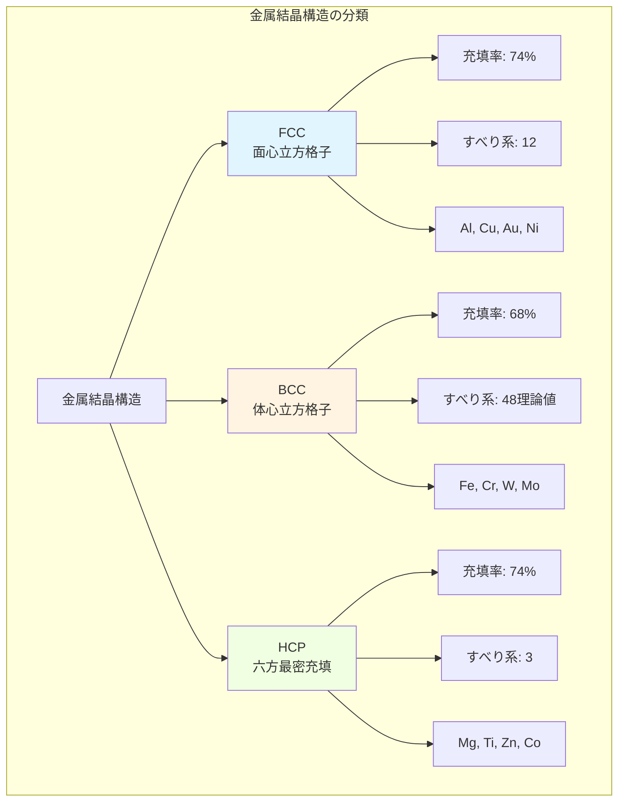
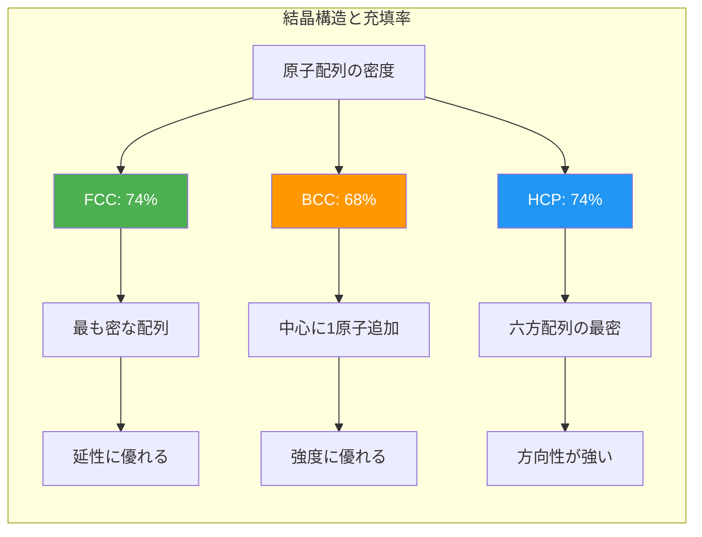
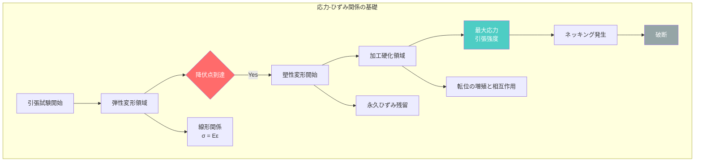
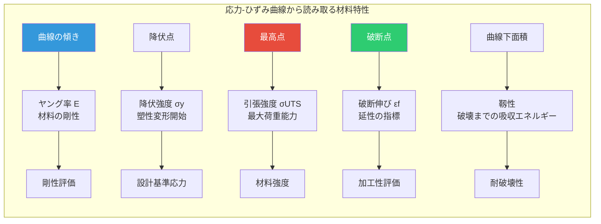
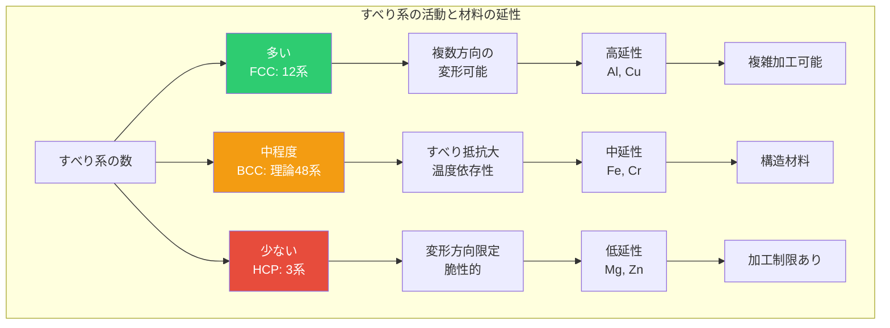

# 第2章：基礎理論：結晶構造と機械的性質

**ミクロな原子配列が決定するマクロな性質**

## 2.1 金属の結晶構造

金属材料の優れた機械的性質は、原子レベルでの規則的な配列、すなわち**結晶構造（Crystal Structure）**に起因します。金属原子は3次元空間で周期的に配列し、その配列パターンが材料の強度、延性、導電性などを決定します。

### 2.1.1 主要な結晶構造

金属材料では、3つの主要な結晶構造が支配的です：

**1. 面心立方格子（FCC: Face-Centered Cubic）**

立方体の各面の中心と頂点に原子が配置された構造です。最密充填構造の一つで、充填率は74%（最も高い）です。

**代表的な金属**：
- アルミニウム（Al）：航空機材料
- 銅（Cu）：電気配線
- 金（Au）、銀（Ag）：貴金属
- ニッケル（Ni）：合金元素
- オーステナイト系ステンレス鋼（高温での鉄）

**特徴**：
- すべり系が12個（{111}面 × 3方向 × 4セット）と多い
- 優れた延性と展性
- 加工硬化しやすい

**2. 体心立方格子（BCC: Body-Centered Cubic）**

立方体の中心と頂点に原子が配置された構造です。充填率は68%（FCCより低い）。

**代表的な金属**：
- 鉄（Fe）：室温（α-Fe、フェライト）
- クロム（Cr）：ステンレス鋼の主要元素
- タングステン（W）：電球フィラメント
- モリブデン（Mo）：高温構造材料
- バナジウム（V）：合金添加元素

**特徴**：
- すべり系が48個と多いが、すべりにくい
- 高強度だが低温脆性を示す
- 温度依存性が大きい

**3. 六方最密充填（HCP: Hexagonal Close-Packed）**

六角柱状の単位格子で、FCC同様に充填率74%の最密充填構造です。

**代表的な金属**：
- マグネシウム（Mg）：超軽量構造材料
- チタン（Ti）：室温（α-Ti）
- 亜鉛（Zn）：めっき材料
- コバルト（Co）：磁性材料
- ジルコニウム（Zr）：原子炉材料

**特徴**：
- すべり系が3個と少ない（底面すべりのみ）
- 延性が限定的（室温）
- c/a比（軸比）が材料特性を左右

### 2.1.2 結晶構造の比較

3つの主要結晶構造の特性を詳細に比較します。

**表1：FCC vs BCC vs HCP 結晶構造の比較**

| 特性 | FCC（面心立方格子） | BCC（体心立方格子） | HCP（六方最密充填） |
|------|---------------------|---------------------|---------------------|
| **単位格子内原子数** | 4個 | 2個 | 2個（単純HCP） |
| **充填率** | 74%（最密充填） | 68% | 74%（最密充填） |
| **配位数** | 12 | 8 | 12 |
| **主要すべり系** | {111}<110> × 12 | {110}<111> × 48（理論） | {0001}<11-20> × 3 |
| **格子定数の関係** | a = b = c, α=β=γ=90° | a = b = c, α=β=γ=90° | a = b ≠ c, α=β=90°, γ=120° |
| **代表金属** | Al, Cu, Ni, Au, Ag | Fe(α), Cr, W, Mo, V | Mg, Ti(α), Zn, Co, Zr |
| **延性** | 優れる（多すべり系） | 中程度（温度依存性大） | 限定的（少すべり系） |
| **強度** | 中～高（加工硬化） | 高（特に低温） | 中～高（c/a比依存） |
| **温度特性** | 安定 | 低温脆性あり | 温度上昇で延性向上 |
| **典型的用途** | 電気配線、構造材料 | 構造鋼、工具材料 | 軽量構造材、耐食材 |

### 2.1.3 結晶構造の可視化と単位格子

単位格子（Unit Cell）は、結晶構造を記述する最小の繰り返し単位です。3次元空間で周期的に積み重なり、マクロな結晶を形成します。

**格子定数（Lattice Parameter）**：
- FCC/BCC：a（立方体の一辺の長さ）
- HCP：a（底面の辺）、c（高さ）、c/a比（軸比、理想値は1.633）

**実測例**：
- Al（FCC）：a = 4.05 Å（オングストローム、10⁻¹⁰ m）
- Fe（BCC、室温）：a = 2.87 Å
- Mg（HCP）：a = 3.21 Å、c = 5.21 Å、c/a = 1.624

## 2.2 機械的性質の基礎

材料の機械的性質（Mechanical Properties）は、外力に対する応答特性です。構造材料として金属を使用する際、最も重要な評価項目となります。

### 2.2.1 応力とひずみ

**応力（Stress, σ）**：
単位面積あたりに作用する力。単位はPa（パスカル）またはMPa（メガパスカル）。

$$
\sigma = \frac{F}{A_0}
$$

- F：作用する力（N）
- A₀：元の断面積（m²）

**ひずみ（Strain, ε）**：
変形の程度を表す無次元量。

$$
\varepsilon = \frac{\Delta L}{L_0} = \frac{L - L_0}{L_0}
$$

- L₀：元の長さ（m）
- L：変形後の長さ（m）
- ΔL：伸び（m）

**ヤング率（Young's Modulus, E）**：
弾性域における応力とひずみの比例係数。材料の剛性を示す。

$$
E = \frac{\sigma}{\varepsilon}
$$

**代表的な金属のヤング率**：
- 鋼（Fe）：約200 GPa（ギガパスカル）
- アルミニウム（Al）：約70 GPa
- チタン（Ti）：約110 GPa
- 銅（Cu）：約120 GPa
- タングステン（W）：約400 GPa

### 2.2.2 弾性変形と塑性変形

材料の変形は、大きく2つに分類されます。

**弾性変形（Elastic Deformation）**：
荷重を除去すると元に戻る可逆的変形。原子間距離の微小な変化で、原子の位置関係は維持されます。

**塑性変形（Plastic Deformation）**：
荷重除去後も変形が残る不可逆的変形。原子面のすべり（転位の移動）により、原子配列が変化します。

**表2：弾性変形と塑性変形の比較**

| 特性 | 弾性変形（Elastic） | 塑性変形（Plastic） |
|------|---------------------|---------------------|
| **可逆性** | 可逆（荷重除去で元に戻る） | 不可逆（永久ひずみ残留） |
| **原子レベルの機構** | 原子間距離の可逆的変化 | 転位の移動、原子面のすべり |
| **応力-ひずみ関係** | 線形（フックの法則） | 非線形（加工硬化） |
| **ひずみの大きさ** | 小さい（通常0.1～0.5%以下） | 大きい（数%～数十%） |
| **エネルギー** | 弾性エネルギーとして蓄積 | 塑性仕事として散逸（熱） |
| **材料特性** | ヤング率 E で決まる | 降伏強度 σy、引張強度で決まる |
| **実用例** | バネ、ばね座金 | プレス成形、鍛造、圧延 |
| **温度依存性** | 小さい | 大きい（高温で軟化） |

**降伏現象**：
弾性変形から塑性変形への遷移点を**降伏点（Yield Point）**、そのときの応力を**降伏強度（Yield Strength, σy）**と呼びます。工学的には0.2%耐力（0.2%の永久ひずみを生じる応力）が使われます。

**代表的な金属の降伏強度**：
- 軟鋼（SS400）：約235 MPa
- 高張力鋼（SM490）：約325 MPa
- アルミニウム合金（7075-T6）：約500 MPa
- チタン合金（Ti-6Al-4V）：約880 MPa

### 2.2.3 応力-ひずみ曲線の読み方

引張試験で得られる応力-ひずみ曲線は、材料特性の宝庫です。

**主要なパラメータ**：

1. **ヤング率（E）**：弾性域の傾き
2. **降伏強度（σy）**：塑性変形開始点の応力
3. **引張強度（σUTS）**：曲線の最大応力（Ultimate Tensile Strength）
4. **破断伸び（εf）**：破断時の全ひずみ（延性の指標）
5. **破断応力（σf）**：破断時の応力

## 2.3 結晶構造と性質の関係

ミクロな結晶構造とマクロな機械的性質は、密接に関連しています。

### 2.3.1 すべり系と延性の関係

塑性変形は、**転位（Dislocation）**と呼ばれる結晶欠陥の移動により生じます。転位は特定の結晶面（すべり面）上を特定の方向（すべり方向）に移動します。この組み合わせを**すべり系（Slip System）**と呼びます。

**すべり系の数と延性の相関**：
- **FCC金属**：12個のすべり系 → 優れた延性
- **BCC金属**：理論上48個だが、すべりにくい → 中程度の延性
- **HCP金属**：3個のすべり系（底面すべり） → 限定的な延性

マグネシウム（HCP）が室温で脆いのは、底面すべり以外のすべり系が活動しにくいためです。温度を上げると非底面すべりが活性化し、延性が向上します。

### 2.3.2 結晶構造と強度の関係

**充填率と強度**：
- BCC（68%）：充填率が低い → 原子間距離が大きい → 高強度（特に低温）
- FCC/HCP（74%）：最密充填 → すべりやすい → 延性優先

**温度依存性**：
- **BCC金属**：低温で脆性破壊（延性-脆性遷移温度 DBTT）
- **FCC金属**：低温でも延性維持（船舶材料として重要）

**表3：結晶構造別の材料特性と主要用途**

| 結晶構造 | 代表金属 | 強度 | 延性 | 温度特性 | 主要用途 | 特記事項 |
|----------|----------|------|------|----------|----------|----------|
| **FCC** | Al | 中 | 優 | 安定 | 航空機材、飲料缶 | 軽量（密度2.7 g/cm³） |
| **FCC** | Cu | 中 | 優 | 安定 | 電気配線、熱交換器 | 高導電性（5.96×10⁷ S/m） |
| **FCC** | Ni | 高 | 優 | 高温安定 | 耐熱合金、触媒 | 高温強度維持 |
| **BCC** | Fe(α) | 高 | 中 | DBTT有 | 構造鋼、自動車部材 | 最も多く使用される金属 |
| **BCC** | Cr | 高 | 中 | 硬質 | ステンレス鋼添加 | 耐食性付与 |
| **BCC** | W | 極高 | 低 | 最高融点 | 電球、工具材料 | 融点3,422°C |
| **HCP** | Mg | 中 | 低 | 温度で向上 | 軽量部品、合金元素 | 超軽量（密度1.7 g/cm³） |
| **HCP** | Ti(α) | 高 | 中 | 高温変態 | 航空機、医療材料 | 高比強度、生体適合性 |
| **HCP** | Zn | 低 | 低 | 低融点 | めっき、合金元素 | 犠牲陽極として利用 |

### 2.3.3 結晶粒径と強度：Hall-Petchの関係

多結晶材料では、**結晶粒径**が強度に大きく影響します。

**Hall-Petchの式**：

$$
\sigma_y = \sigma_0 + \frac{k}{\sqrt{d}}
$$

- σy：降伏強度
- σ₀：単結晶の降伏強度（摩擦応力）
- k：Hall-Petch係数（材料定数）
- d：結晶粒径

**物理的意味**：
結晶粒界は転位の移動を阻害します。粒径が小さいほど粒界の総面積が増加し、転位の移動が困難になり、強度が向上します。

**実用例**：
- **微細粒鋼**：結晶粒径を5 μm以下に制御 → 降伏強度800 MPa以上
- **超微細粒材料**：粒径1 μm以下 → 1,000 MPa超の強度

---

**次のステップ**：
[第3章: Pythonによる材料強度シミュレーション](./chapter3.md)では、応力-ひずみ曲線の生成、Hall-Petch関係の可視化、結晶構造の3Dモデリングなど、Pythonで材料科学の理論を実装します。

---

## 学習目標の確認

この章を完了すると、以下を説明できるようになります：

### 結晶構造の理解
- ✅ FCC、BCC、HCPの3つの主要結晶構造の違いを説明できる
- ✅ 充填率、配位数、すべり系の概念を理解している
- ✅ 代表的な金属がどの結晶構造を持つか分類できる

### 機械的性質の基礎
- ✅ 応力とひずみの定義、計算方法を理解している
- ✅ ヤング率、降伏強度、引張強度の意味を説明できる
- ✅ 弾性変形と塑性変形の違いを原子レベルで理解している

### 構造-性質相関
- ✅ すべり系の数と材料の延性の関係を説明できる
- ✅ 結晶構造と温度特性の関連を理解している
- ✅ Hall-Petch関係を用いて結晶粒径と強度の関係を評価できる

---

[第1章に戻る ←](./chapter1.md) | [シリーズ目次](./index.md) | [第3章へ進む →](./chapter3.md)
