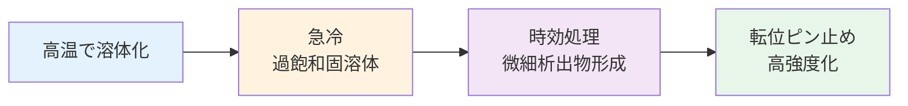
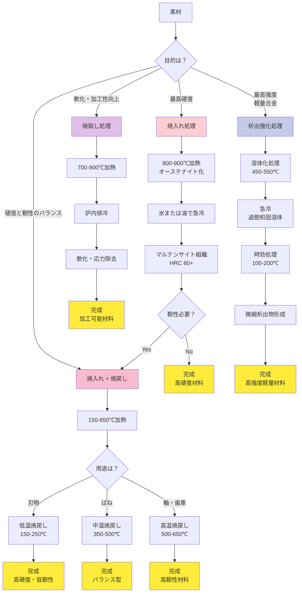

# 第4章：応用：合金設計と熱処理

**金属材料の性能向上の鍵：合金化メカニズムと熱処理プロセスの実践的理解**

---

## 4.1 合金化の目的と効果

純金属は優れた導電性や延性を持ちますが、構造材料としては強度が不足します。**合金化**（Alloying）は、異なる元素を添加することで材料特性を飛躍的に向上させる技術です。

### 4.1.1 固溶強化（Solid Solution Strengthening）

異なる原子サイズの元素を固溶させることで、結晶格子にひずみを導入し、転位の移動を阻害します。

**メカニズム**:
```
純金属 + 溶質元素 → 格子ひずみ → 転位移動阻害 → 強度上昇
```

**代表例**:
- **黄銅（真鍮）**: Cu-Zn（30% Zn添加で強度1.8倍）
- **ステンレス鋼**: Fe-Cr18-Ni8（オーステナイト系）
- **Al-Mg合金**: 5000系アルミニウム（Mg 3-5%）

**強化効果**: 純金属の **1.5～2倍** の強度

### 4.1.2 析出強化（Precipitation Strengthening）

熱処理によって微細な第二相粒子を析出させ、転位の移動をさらに強力に阻害します。

**プロセス**:


**代表例**:
- **ジュラルミン**: Al-Cu-Mg（θ相: Al₂Cu析出）
- **マルエージング鋼**: Fe-Ni18-Mo5（Ni₃Mo析出）
- **Inconel**: Ni基超合金（γ'相: Ni₃(Al,Ti)析出）

**強化効果**: 純金属の **3～5倍** の強度

---

## 4.2 主要合金系の紹介

### 4.2.1 鉄鋼材料（Fe基合金）

炭素含有量と添加元素によって多様な特性を実現します。

**鉄鋼の分類と特性**:

| 種類 | 炭素量 (wt%) | 主要添加元素 | 特徴 | 主な用途 |
|------|------------|------------|------|---------|
| **低炭素鋼** | 0.05-0.25 | - | 延性大、溶接性良好 | 自動車ボディ、建材 |
| **中炭素鋼** | 0.25-0.60 | - | 強度と靭性のバランス | 機械部品、軸 |
| **高炭素鋼** | 0.60-1.50 | - | 硬度大、耐摩耗性 | 刃物、金型 |
| **ステンレス鋼** | <0.15 | Cr >12%, Ni 0-20% | 耐食性優秀 | 食器、化学プラント |
| **高張力鋼** | 0.05-0.20 | Mn, Nb, V, Ti | 高強度、軽量化 | 自動車骨格、橋梁 |

**炭素鋼の特性変化**:
- 炭素0.1% → 引張強度 400 MPa、伸び 30%
- 炭素0.4% → 引張強度 700 MPa、伸び 15%
- 炭素0.8% → 引張強度 900 MPa、伸び 8%

### 4.2.2 アルミニウム合金（Al基合金）

密度が鉄の1/3（2.7 g/cm³）で、優れた比強度を実現します。

**アルミニウム合金の系統**:

| 系統 | 主要元素 | 強化機構 | 引張強度 (MPa) | 主な用途 |
|------|---------|---------|---------------|---------|
| **2000系** | Cu (4-5%) | 析出強化 | 400-500 | 航空機構造材（ジュラルミン） |
| **5000系** | Mg (3-5%) | 固溶強化 | 250-350 | 船舶、建築、耐食性用途 |
| **6000系** | Mg-Si (各1%) | 析出強化 | 250-350 | 建築構造材、サッシ |
| **7000系** | Zn-Mg (各6%) | 析出強化 | **500-700** | 航空機、最高強度用途 |

**比強度の優位性**:
```
比強度 = 引張強度 / 密度

アルミニウム合金: 500 MPa / 2.7 g/cm³ = 185 MPa/(g/cm³)
鉄鋼材料:         700 MPa / 7.8 g/cm³ = 90 MPa/(g/cm³)

→ アルミニウムは鋼の約2倍の比強度
```

### 4.2.3 チタン合金（Ti基合金）

優れた比強度、耐食性、生体適合性を兼ね備えた高性能材料です。

**主要チタン合金**:

| 合金 | 組成 | 引張強度 (MPa) | 密度 (g/cm³) | 特徴 | 用途 |
|------|------|---------------|-------------|------|------|
| **純チタン** | Ti (Grade 2) | 340-450 | 4.5 | 優れた耐食性 | 医療インプラント、化学プラント |
| **Ti-6Al-4V** | Al 6%, V 4% | **900-1000** | 4.4 | 最頻使用合金 | 航空機エンジン、人工関節 |
| **Ti-15V-3Cr-3Al-3Sn** | V 15%, Cr/Al/Sn 3% | 1100-1200 | 4.8 | 高強度β合金 | ばね材、高荷重用途 |

**チタンの比強度**:
```
Ti-6Al-4V: 950 MPa / 4.4 g/cm³ = 216 MPa/(g/cm³)
→ 鋼の約2.4倍、アルミの約1.2倍
```

---

## 4.3 熱処理の基礎

熱処理は、加熱・冷却パターンを制御することで材料の内部組織を変化させ、機械的性質を調整する技術です。

### 4.3.1 焼入れ（Quenching）

**目的**: 硬度と強度の最大化

**プロセス**:
```
素材 → 800-900℃加熱（オーステナイト化）
     → 水または油で急冷
     → マルテンサイト組織形成（高硬度）
```

**効果**:
- 硬度: **HRC 60以上**（ロックウェル硬さ）
- 未処理材の **2～3倍** の硬度
- 降伏強度: 1500 MPa以上も可能

**注意点**:
- 硬すぎて脆くなる（衝撃に弱い）
- 内部応力が残留（焼戻しが必須）

### 4.3.2 焼戻し（Tempering）

**目的**: 靭性の回復（硬さと粘り強さのバランス調整）

**プロセス**:
```
焼入れ材 → 150-650℃加熱
         → 一定時間保持
         → 空冷または炉冷
         → 硬度低下、靭性回復
```

**温度別の特性変化**:

| 焼戻し温度 | 硬度 (HRC) | 靭性 | 用途例 |
|-----------|-----------|------|--------|
| **低温（150-250℃）** | 58-62 | 低 | 刃物、切削工具（高硬度維持） |
| **中温（350-500℃）** | 45-55 | 中 | ばね、軸受（バランス型） |
| **高温（500-650℃）** | 30-40 | 高 | 軸、歯車（高靭性重視） |

**トレードオフ**:
```
焼戻し温度 ↑ → 硬度 ↓ / 靭性 ↑
```

### 4.3.3 焼鈍し（Annealing）

**目的**: 軟化、内部応力除去、加工性向上

**プロセス**:
```
加工材 → 700-900℃加熱
      → 炉内で徐冷（ゆっくり冷却）
      → 最も軟らかい状態
```

**効果**:
- 硬度: 最小（HRC 10-20程度）
- 延性: 最大（伸び 30-40%）
- 内部応力: 除去
- 再結晶: 微細組織の粗大化

**用途**:
- 冷間加工前の前処理
- 加工硬化した材料の軟化
- 機械加工性の改善

---

## 4.4 熱処理プロセスの選定フローチャート

実際の製造現場では、目的に応じて最適な熱処理を選定します。



---

## 4.5 実用例1: 航空機用アルミニウム合金（7075-T6）

航空宇宙産業で最も重要な高強度アルミニウム合金です。

### 4.5.1 合金組成と設計思想

**組成**:
```
Al-Zn 5.6% - Mg 2.5% - Cu 1.6% - Cr 0.23%
```

**元素の役割**:
- **Zn（亜鉛）**: 主要強化元素、MgZn₂析出相形成
- **Mg（マグネシウム）**: Znと共析、析出強化
- **Cu（銅）**: 強度向上、耐食性やや低下
- **Cr（クロム）**: 結晶粒微細化、応力腐食割れ抑制

### 4.5.2 T6熱処理プロセス

**T6処理の詳細**:

| ステップ | 温度 | 時間 | 組織変化 | 目的 |
|---------|------|------|---------|------|
| **溶体化処理** | 465℃ | 1-2時間 | Zn, Mg, Cuを完全固溶 | 過飽和固溶体作成 |
| **急冷** | 室温 | <30秒 | 過飽和状態凍結 | 拡散防止 |
| **人工時効** | 120℃ | 24時間 | η'相（MgZn₂）微細析出 | 析出強化 |

**組織変化**:
```
溶体化（465℃）: α相（全固溶）
      ↓ 急冷
過飽和固溶体: 準安定状態
      ↓ 時効（120℃, 24h）
α相 + η'相（直径 5-20 nm の微細析出物）
```

### 4.5.3 機械的特性

**7075-T6の性能**:
- **引張強度**: 570 MPa（純Alの **6倍**）
- **降伏強度**: 505 MPa
- **伸び**: 11%
- **硬度**: HB 150
- **比強度**: 570 / 2.81 = **203 MPa/(g/cm³)**

**比較（同重量での強度）**:
```
7075-T6アルミ: 203 MPa/(g/cm³)
中炭素鋼:      90 MPa/(g/cm³)

→ アルミ合金は鋼の2.3倍の比強度
```

### 4.5.4 用途と実績

**主要用途**:
- ✈️ **航空機主翼桁**: ボーイング737、エアバスA320
- 🚁 **戦闘機機体**: F-15、F-16の主構造材
- 🚴 **高性能自転車**: プロ競技用フレーム
- 🏔️ **登山用具**: カラビナ、アイスアックス

**選定理由**:
1. **軽量性**: 鋼の1/3の重量で同等以上の強度
2. **高比強度**: 燃料効率向上、可搬重量増加
3. **加工性**: 機械加工、溶接可能
4. **実績**: 70年以上の使用歴、信頼性確立

---

## 4.6 実用例2: 自動車用高張力鋼（TRIP鋼）

**TRIP** (Transformation-Induced Plasticity) は、変形誘起塑性を利用した革新的な高強度鋼です。

### 4.6.1 合金組成と特異なメカニズム

**組成**:
```
Fe - C 0.2% - Si 1.5% - Mn 1.5% - (Al 1.0%)
```

**元素の役割**:
- **C（炭素）**: オーステナイト安定化、強度向上
- **Si（ケイ素）**: 炭化物形成抑制、残留オーステナイト保持
- **Mn（マンガン）**: オーステナイト安定化、焼入れ性向上
- **Al（アルミニウム）**: Si代替（溶接性改善）

**TRIP効果のメカニズム**:
```
変形前: フェライト + ベイナイト + 残留オーステナイト（10-15%）
          ↓ 応力印加
変形中: 残留オーステナイト → マルテンサイト（相変態）
          ↓
変形後: 硬質マルテンサイト分散 → 加工硬化 + 延性維持
```

この**変態誘起塑性**により、高強度と高延性を両立します。

### 4.6.2 特殊な熱処理プロセス

**二相域加熱法**:

| ステップ | 温度 | 組織状態 | 目的 |
|---------|------|---------|------|
| **二相域加熱** | 780℃ | フェライト + オーステナイト | 二相組織作成 |
| **徐冷** | 400℃ | ベイナイト変態開始 | オーステナイト濃化 |
| **等温保持** | 400℃, 5分 | C濃化オーステナイト安定化 | 残留オーステナイト確保 |
| **空冷** | 室温 | 残留オーステナイト凍結 | TRIP効果準備完了 |

**重要ポイント**:
- **二相域温度**: フェライトとオーステナイトが共存する温度域（750-850℃）
- **炭素濃化**: ベイナイト変態中、未変態オーステナイトに炭素が濃縮
- **安定化**: 炭素濃化により室温でもオーステナイトが残留

### 4.6.3 機械的特性と性能

**TRIP鋼の特性**:
- **引張強度**: 590-780 MPa（グレード依存）
- **降伏強度**: 350-450 MPa
- **伸び**: **25-30%**（高強度鋼としては異例の高延性）
- **加工硬化指数**: n = 0.20-0.25（優れた成形性）

**高強度 + 高延性の両立**:
```
従来高張力鋼（590 MPa）: 伸び 15-18%
TRIP 590鋼:            伸び 28-32%

→ 約1.7倍の延性（衝突時のエネルギー吸収能力向上）
```

### 4.6.4 自動車への応用効果

**主要用途**:
- 🚗 **骨格部品**: センターピラー、ルーフレール、サイドシル
- 🔒 **ドア補強材**: サイドインパクトビーム
- 🛡️ **バンパービーム**: 前面衝突吸収

**軽量化効果**:
```
従来鋼（340 MPa級） 板厚: 1.6 mm
        ↓ TRIP 590鋼に置換
TRIP鋼（590 MPa級） 板厚: 1.2 mm

板厚削減率: (1.6 - 1.2) / 1.6 = 25%
車両重量削減: 10-15%（骨格部品全体で）
燃費改善: 3-5%（車両重量100 kg削減で約1%改善）
```

**安全性向上**:
- 高延性により衝突時の変形能力向上
- エネルギー吸収量増加（伸びが大きいほど吸収エネルギー大）
- 乗員スペース確保（高強度で変形抑制）

**コスト競争力**:
- 成形性良好 → 複雑形状のプレス加工可能
- 溶接性良好 → 既存設備で製造可能
- 材料コスト: 通常高張力鋼の1.2-1.5倍（許容範囲）

---

## 4.7 実用例3: 医療用チタン合金（Ti-6Al-4V ELI）

**ELI** (Extra Low Interstitial) は、医療インプラント専用の高純度グレードです。

### 4.7.1 組成と高純度化の意義

**標準組成**:
```
Ti - Al 6% - V 4%
```

**ELIグレードの純度要求**:

| 元素 | 標準グレード | ELIグレード | 影響 |
|------|------------|-----------|------|
| **酸素 (O)** | < 0.20% | **< 0.13%** | 延性・靭性向上（侵入型元素削減） |
| **窒素 (N)** | < 0.05% | **< 0.03%** | 脆化防止 |
| **炭素 (C)** | < 0.08% | **< 0.08%** | 炭化物形成抑制 |
| **鉄 (Fe)** | < 0.30% | **< 0.25%** | 生体適合性向上 |

**高純度化の効果**:
- **延性**: 10% → 15%（約1.5倍）
- **破壊靭性**: 50 MPa√m → 75 MPa√m
- **疲労強度**: 450 MPa → **500 MPa以上**（繰り返し荷重に強い）

### 4.7.2 熱処理プロセス

**焼鈍し処理（医療用標準プロセス）**:

| ステップ | 温度 | 時間 | 組織 | 目的 |
|---------|------|------|------|------|
| **焼鈍し加熱** | 700-800℃ | 1-2時間 | α + β二相域 | 応力除去、組織均質化 |
| **徐冷** | 炉冷または空冷 | - | α相主体 + 少量β相 | 延性・靭性最適化 |

**組織の特徴**:
```
α相（HCP構造）: 70-90%
β相（BCC構造）: 10-30%

→ α+β二相組織により強度と延性のバランス実現
```

**なぜ焼入れしないのか？**:
- 医療用途では高硬度不要（生体組織は軟らかい）
- 延性と靭性が最重要（衝撃破壊防止）
- 疲労強度重視（10年以上の長期使用）

### 4.7.3 生体材料としての特性

**機械的特性**:
- **引張強度**: 860-965 MPa
- **降伏強度**: 795-875 MPa
- **伸び**: 10-15%
- **ヤング率**: 110 GPa（骨に近い、応力遮蔽抑制）
- **疲労強度**: 500 MPa以上（10⁷サイクル）

**生体適合性**:
1. **耐食性**: 表面TiO₂不働態皮膜（厚さ数nm）
   - 塩化物イオン環境（体液）に優れた耐性
   - 金属イオン溶出極少（< 0.01 ppm/day）

2. **アレルギー反応**: ほぼゼロ
   - Niアレルギー患者にも使用可能
   - 生体拒絶反応極小

3. **骨結合性**: 優れたオッセオインテグレーション
   - TiO₂表面に骨芽細胞が直接接着
   - 骨との一体化（機械的固定不要）

**比較（他の生体材料）**:

| 材料 | 引張強度 (MPa) | 密度 (g/cm³) | 耐食性 | アレルギー | コスト |
|------|---------------|-------------|--------|-----------|--------|
| **Ti-6Al-4V ELI** | 900 | 4.4 | ★★★★★ | ほぼゼロ | 高 |
| ステンレス鋼 | 800 | 7.9 | ★★★☆☆ | Niアレルギー | 低 |
| Co-Cr合金 | 1000 | 8.5 | ★★★★☆ | 軽微 | 中 |

### 4.7.4 医療応用と実績

**主要用途**:
- 🦴 **人工股関節**: ステム（大腿骨側）、寛骨臼カップ
- 🦵 **人工膝関節**: 脛骨・大腿骨コンポーネント
- 🦷 **歯科インプラント**: 人工歯根（オッセオインテグレーション）
- 🩹 **骨固定具**: プレート、スクリュー、髄内釘

**世界実績**:
- 年間使用量: 約500トン（医療用チタン全体）
- 人工股関節: 年間約100万件（世界）
- 歯科インプラント: 年間約1500万本
- 長期成功率: **95%以上**（10年追跡）

**表面処理技術**:
1. **陽極酸化処理**: TiO₂層厚膜化（数μm）
   - 骨結合力向上
   - 耐摩耗性向上

2. **ハイドロキシアパタイトコーティング**: Ca₁₀(PO₄)₆(OH)₂
   - 骨の主成分と同一
   - 早期骨結合促進

3. **表面粗面化**: サンドブラスト、酸エッチング
   - 表面積増大
   - 骨接着力強化

**選定理由のまとめ**:

✅ **力学的適合性**:
- ヤング率110 GPa（骨: 10-30 GPa、ステンレス: 200 GPa）
- 応力遮蔽効果軽減（骨萎縮防止）

✅ **生物学的適合性**:
- アレルギー反応極少
- 優れた骨結合性
- 長期安定性

✅ **軽量性**:
- 密度4.4 g/cm³（ステンレスの約半分）
- 患者の負担軽減

✅ **画像診断適合性**:
- X線、CT、MRIで良好な透過性
- アーチファクト（ノイズ）最小

---

## 4.8 合金設計と熱処理の実践的考慮事項

### 4.8.1 設計時のトレードオフ

実用材料の開発では、複数の特性間のトレードオフを理解し、最適なバランスを見つけることが重要です。

**1. 強度 vs 延性**:
```
高強度化 → 転位移動困難 → 延性低下

例: 7075-T6アルミ: 強度 570 MPa、伸び 11%
    純アルミ:      強度 90 MPa、 伸び 40%
```

**2. 強度 vs 耐食性**:
```
Cu添加 → 析出強化（強度↑）→ 電位差増大 → 耐食性低下

例: 7075（Cu 1.6%）: 強度大、耐食性△
    5083（Mg 4.5%）: 強度中、耐食性◎
```

**3. 性能 vs コスト**:
```
Ti合金: 優れた性能、高コスト（$20-30/kg）
Al合金: 良好な性能、中コスト（$3-5/kg）
鉄鋼:   十分な性能、低コスト（$0.5-1/kg）
```

### 4.8.2 プロセス設計の要点

**温度管理の重要性**:
- 溶体化処理: ±5℃の精度が必要
- 時効処理: ±3℃で特性が変化
- 冷却速度: 冷媒温度、攪拌速度の管理

**時間管理**:
- 保持時間: ±5分で析出物サイズ変化
- 過時効: 析出物粗大化 → 強度低下

**品質管理**:
- 硬度試験: ロット毎に実施
- 金属組織観察: 定期的にサンプリング
- 機械試験: 引張試験で特性確認

---

## 4.9 ベストプラクティス

### ✅ 合金選定のガイドライン

**ステップ1: 要求特性の明確化**
- 必要な強度レベル（引張強度、降伏強度）
- 環境条件（温度、腐食性、疲労荷重）
- 加工方法（鋳造、鍛造、機械加工）
- コスト制約

**ステップ2: 候補材料の選定**
- 実績のある合金系から検討
- 類似用途の前例を参照
- サプライチェーンの確認（入手性）

**ステップ3: 試作評価**
- 小規模サンプルで特性検証
- 実使用条件でのテスト
- 長期信頼性試験（必要に応じて）

### ✅ 熱処理設計のガイドライン

**原則1: シンプルさ優先**
- 最もシンプルなプロセスを選択
- 工程数最小化（コスト削減、品質安定）

**原則2: パラメータ管理**
- 温度: ±5℃以内
- 時間: ±5分以内（短時間プロセスでは±1分）
- 冷却速度: 冷媒種類と温度の標準化

**原則3: 品質保証**
- 各ロットでサンプル試験
- トレーサビリティ確保
- 熱処理炉の定期校正

### ✅ 実用化への道筋

**1. ラボスケール**:
- 小型試験片で特性検証
- 熱処理条件の最適化
- 組織観察、機械試験

**2. パイロットスケール**:
- 実寸サイズでの試作
- 製造プロセスの確立
- 量産設備での試験

**3. 量産化**:
- 品質管理体制構築
- オペレーター教育
- 長期使用データ蓄積

---

## 4.10 まとめ

本章では、金属材料の性能向上の核心である合金設計と熱処理について学びました。

### 本章で学んだこと

✅ **合金化の基本原理**:
- 固溶強化: 格子ひずみによる転位阻害（1.5-2倍強化）
- 析出強化: 微細第二相による強力な強化（3-5倍強化）
- 主要合金系: 鉄鋼、アルミニウム、チタンの特徴と用途

✅ **熱処理の基礎**:
- 焼入れ: 最高硬度達成（HRC 60+）
- 焼戻し: 硬度と靭性のバランス調整
- 焼鈍し: 軟化と加工性向上
- 析出強化処理: 溶体化 → 急冷 → 時効

✅ **実用例から学ぶ実践知識**:
1. **7075-T6アルミ**: 航空機用途の析出強化の極致
2. **TRIP鋼**: 変態誘起塑性による高強度・高延性両立
3. **Ti-6Al-4V ELI**: 医療用途の生体適合性と力学特性の融合

### 重要な知見

**💡 材料選定の判断基準**:
- 要求特性、環境条件、コスト、入手性の総合評価
- 実績重視（枯れた技術の信頼性）
- トレードオフの理解（強度 vs 延性 vs コスト）

**🎯 熱処理設計の原則**:
- 温度・時間の厳密管理（±5℃、±5分）
- シンプルさ優先（複雑化は品質リスク）
- 品質保証体制（サンプル試験、トレーサビリティ）

**🔧 実用化のポイント**:
- 段階的スケールアップ（ラボ → パイロット → 量産）
- 長期信頼性データの蓄積
- サプライチェーン確保

### 発展的トピック

**材料情報学（Materials Informatics）**:
- 機械学習による新合金探索
- 熱処理条件の最適化（ベイズ最適化）
- データベース駆動の材料設計

**高度な熱処理技術**:
- レーザー熱処理（局所的な表面硬化）
- 等温焼入れ（ベイナイト組織制御）
- サブゼロ処理（-70℃以下、残留オーステナイト変態）

**次世代合金**:
- ハイエントロピー合金（多元系、新たな強化原理）
- ナノ結晶材料（結晶粒 < 100 nm）
- 形状記憶合金（Ti-Ni系、生体材料応用）

---

### 参考文献

#### 学術論文
1. Porter, D. A., Easterling, K. E., & Sherif, M. Y. (2009). *Phase Transformations in Metals and Alloys*. CRC Press.
2. Polmear, I. J. (2006). *Light Alloys: From Traditional Alloys to Nanocrystals*. Elsevier.
3. Niinomi, M. (2008). "Mechanical biocompatibilities of titanium alloys for biomedical applications." *Journal of the Mechanical Behavior of Biomedical Materials*, 1(1), 30-42.
4. Jacques, P. J., et al. (2001). "On the influence of interactions between phases on the mechanical stability of retained austenite in transformation-induced plasticity multiphase steels." *Metallurgical and Materials Transactions A*, 32(11), 2759-2768.

#### 技術標準
1. ASTM F136-13: Standard Specification for Wrought Titanium-6Aluminum-4Vanadium ELI (Extra Low Interstitial) Alloy for Surgical Implant Applications.
2. AMS 4049: Aluminum Alloy 7075, Solution Heat Treated and Aged.
3. JIS G 3135: 冷間圧延高張力鋼板及び鋼帯（TRIP鋼を含む）

#### 教科書
1. Ashby, M. F., & Jones, D. R. H. (2012). *Engineering Materials 1: An Introduction to Properties, Applications and Design*. Butterworth-Heinemann.
2. ASM Handbook, Volume 4: *Heat Treating*. ASM International.

---

**本章の完全なデータと図表は、関連する技術資料として利用可能です。**

---

*合金設計と熱処理は、材料工学の中核技術です。本章で学んだ原理と実例を基に、実際の製品開発や材料選定に活用してください。*

**最終更新**: 2025-10-21
**バージョン**: 1.0
