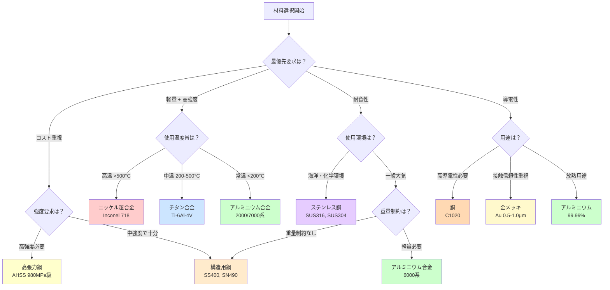

# 第5章：まとめと実用例

**金属材料の基礎知識を実社会へ応用する**

本記事では、第1章から第4章で学んだ金属材料の基礎知識を振り返り、実際の産業界でどのように応用されているかを見ていきます。航空宇宙、自動車、建築、電子機器の4つの主要産業における材料選択の実例を通じて、理論と実践の橋渡しをします。

---

## 5.1 学習目標の確認

この記事シリーズを完了すると、以下の知識とスキルを習得できます：

### 基本理解（Remember & Understand）

- ✅ 金属の3つの主要結晶構造（FCC、BCC、HCP）の特徴と代表的金属を説明できる
- ✅ 合金化の目的と効果（固溶強化、析出強化）を具体例とともに述べられる
- ✅ 状態図（相図）の基本的な読み方を理解し、平衡状態を予測できる
- ✅ 熱処理（焼入れ、焼戻し）の原理と金属組織の変化を説明できる

### 実践スキル（Apply & Analyze）

- ✅ 用途に応じた金属材料の選択基準（強度、重量、耐食性、コスト）を適用できる
- ✅ Fe-C状態図から鉄鋼材料の組織を推定し、機械的性質を予測できる
- ✅ アルミニウム合金、チタン合金、鉄鋼の特性を比較し、適切な用途を判断できる
- ✅ 実際の材料データシート（引張強度、硬度、密度等）を読み取り、性能評価ができる

### 応用力（Evaluate & Create）

- ✅ 新しい工学的課題に対して、最適な金属材料を選定し、その理由を説明できる
- ✅ 産業界の成功事例から材料設計の原則を抽出し、自分のプロジェクトに応用できる
- ✅ 材料選択の決定木を用いて、体系的な材料選定プロセスを実行できる
- ✅ 金属材料工学のキャリアパスを理解し、次の学習ステップを計画できる

---

## 5.2 本記事のまとめ

### 第1章：金属の結晶構造と基本性質

金属材料の性質は、その原子配列（結晶構造）によって決まります。第1章では以下を学びました：

- **FCC（面心立方格子）**: アルミニウム、銅、ニッケルなど、延性に優れた金属の構造
- **BCC（体心立方格子）**: 鉄（室温）、クロムなど、強度が高い金属の構造
- **HCP（六方最密充填）**: マグネシウム、チタン（α相）など、異方性を持つ金属の構造

これらの結晶構造の違いが、すべり系の数、転位の動きやすさ、そして最終的な機械的性質を決定します。

### 第2章：合金の原理と強化メカニズム

純金属だけでは性能が不十分な場合、合金化により性質を改善します。第2章では以下の強化メカニズムを学習しました：

- **固溶強化**: 他元素の原子を溶け込ませ、転位の動きを阻害（例: アルミニウムにマグネシウムを添加）
- **析出強化**: 微細な第二相粒子を分散させ、転位の移動を妨げる（例: Al-Cu合金のθ'相）
- **結晶粒微細化**: 結晶粒を小さくし、粒界で転位の伝播を阻止（Hall-Petchの関係）

これらの強化手法を組み合わせることで、軽量かつ高強度な材料設計が可能になります。

### 第3章：状態図（相図）の理解

状態図は、温度と組成によって材料がどの相（固体、液体、混合相）になるかを示す地図です。第3章では以下を学びました：

- **Fe-C状態図**: 鉄鋼材料の基礎となる図。炭素含有量と温度から、フェライト、オーステナイト、セメンタイトの存在を予測
- **共析反応**: オーステナイト → フェライト + セメンタイト（パーライト組織）
- **Al-Cu状態図**: アルミニウム合金の析出強化を理解するための基礎

状態図を読めることで、適切な熱処理条件の設計が可能になります。

### 第4章：熱処理と組織制御

金属材料の最終的な性質は、熱処理によって大きく変化します。第4章では以下のプロセスを学習しました：

- **焼入れ（Quenching）**: 高温から急冷し、硬く強い組織（マルテンサイト）を生成
- **焼戻し（Tempering）**: 焼入れ後の脆性を改善し、靭性を向上
- **焼なまし（Annealing）**: 加工硬化を除去し、軟化・延性を回復
- **浸炭（Carburizing）**: 表面の炭素濃度を増加させ、表面硬化

これらの熱処理技術により、同じ材料でも用途に応じた性質を実現できます。

---

## 5.3 産業界での実用例

金属材料の知識は、あらゆる産業分野で応用されています。ここでは4つの主要産業における材料選択の実例を詳しく見ていきます。

### 5.3.1 航空宇宙産業

**材料要求**: 軽量、高強度、高温耐性、耐疲労性、耐食性

航空機は燃費効率と安全性の両立が最優先課題です。重量1kgの削減が、機体寿命全体で数百万円の燃料コスト削減につながります。

#### 主要材料と用途

**1. アルミニウム合金（2000系、7000系）**
- **合金例**: 2024-T3（Al-Cu）、7075-T6（Al-Zn-Mg）
- **特性**: 密度2.7-2.8 g/cm³、引張強度400-570 MPa、優れた加工性
- **用途**: 胴体、主翼構造、リブ、ストリンガー
- **実例**:
  - **Boeing 737**: 機体重量の約70%がアルミニウム合金
  - **Airbus A380**: Al-Li合金2099を採用、従来のAl合金より10%軽量化、機体全体で約1.5トンの重量削減を達成

**2. チタン合金（Ti-6Al-4V）**
- **特性**: 密度4.43 g/cm³、引張強度950 MPa、耐食性優秀、高温強度維持
- **用途**: エンジン部品、ランディングギア、高応力部位
- **実例**:
  - **Boeing 787 Dreamliner**: 機体重量の約15%がチタン合金（従来機の2倍）
  - エンジン付近の高温環境（~600°C）でアルミニウムの代替として採用

**3. ニッケル超合金（Inconel 718）**
- **特性**: 高温強度（700°Cでも使用可能）、耐酸化性、クリープ抵抗性
- **用途**: ジェットエンジンのタービンブレード、燃焼室
- **実例**: GE Aviation製GE9Xエンジン（Boeing 777X搭載）のタービンセクションで使用、1,600°Cの燃焼ガスに耐える

#### 材料選択の判断基準

航空宇宙産業では、以下の優先順位で材料を選択します：

1. **安全性**: 疲労強度、破壊靭性（最優先）
2. **重量**: 比強度（強度/密度）の最大化
3. **実績**: 長期使用データの蓄積（70年以上のAl合金実績）
4. **コスト**: チタン合金はAl合金の10倍、使用は必要最小限に

---

### 5.3.2 自動車産業

**材料要求**: コスト効率、量産性、衝突安全性、燃費向上（軽量化）

自動車産業は年間数千万台を製造するため、材料コストと加工性が重要です。近年は燃費規制とCO₂削減のため、軽量化が加速しています。

#### 主要材料と用途

**1. 高張力鋼（HSLA、AHSS）**
- **合金例**: SPFC590（引張強度590 MPa）、TRIP鋼（1,000 MPa級）
- **特性**: 高強度、優れた成形性、低コスト
- **用途**: ボディフレーム、ドアビーム、Bピラー（衝突安全部位）
- **実例**: トヨタ・カムリ（2023年モデル）のボディの約25%に980 MPa級AHSS採用、従来鋼より板厚30%減、重量10%削減

**2. アルミニウム合金（5000系、6000系）**
- **合金例**: 5182（Al-Mg）、6061（Al-Mg-Si）
- **特性**: 密度2.7 g/cm³（鋼の1/3）、耐食性、リサイクル性
- **用途**: ボンネット、ドア、エンジンブロック、サスペンション部品
- **実例**:
  - **Audi A8（2018年以降）**: オールアルミニウムボディ、鋼製ボディ比で約220kg軽量化、燃費10-15%改善
  - **Tesla Model S**: ギガプレス技術でリアボディを1ピースでアルミニウム鋳造、部品点数70個→1個に削減

**3. マグネシウム合金（AZ91D）**
- **特性**: 密度1.8 g/cm³（金属中最軽量級）、振動吸収性
- **用途**: ステアリングホイール芯材、インストルメントパネル骨格
- **実例**: BMW 5シリーズ（E60）のエンジンシリンダーヘッドカバーに採用、アルミニウム比30%軽量化

#### 材料選択の判断基準

自動車産業では、以下のバランスが重要です：

1. **コスト**: 量産性、材料費（最重要、数円単位で最適化）
2. **安全性**: 衝突時のエネルギー吸収性能
3. **軽量化**: 燃費規制対応（CAFE基準、日本のトップランナー方式）
4. **加工性**: プレス成形性、溶接性

---

### 5.3.3 建築産業

**材料要求**: 長期耐久性、耐震性、大量供給可能性、施工性、経済性

建築構造物は50年以上の使用寿命が求められ、材料の信頼性とコストが最優先されます。

#### 主要材料と用途

**1. 構造用鋼（SS400、SN490）**
- **特性**: 引張強度400-490 MPa、溶接性良好、大量生産可能
- **用途**: 鉄骨構造、橋梁、高層ビルのフレーム
- **実例**:
  - **東京スカイツリー（634m）**: 約36,000トンの鋼材使用、心柱制振システムに制振鋼材採用
  - **明石海峡大橋**: 主塔に引張強度800 MPa級高張力鋼使用、風速80m/sに耐える設計

**2. ステンレス鋼（SUS304）**
- **組成**: Fe-18Cr-8Ni（オーステナイト系）
- **特性**: 耐食性優秀、メンテナンスフリー、美観性
- **用途**: 外装パネル、手すり、厨房設備、海洋構造物
- **実例**: 横浜ランドマークタワーの外装ファスナーに採用、30年以上メンテナンスフリー

**3. アルミニウム合金（6063）**
- **特性**: 軽量、押出成形性良好、耐食性、導電性
- **用途**: サッシ、カーテンウォール、手すり
- **実例**: 超高層ビル（Burj Khalifa、828m）の窓枠に採用、重量削減と施工性向上を実現

#### 特殊な用途例

**超高層建築**:
- **Burj Khalifa（ドバイ、828m）**: 引張強度600 MPa級の高強度鉄筋を使用、コンクリートの圧縮強度80 MPaと組み合わせ、50°Cの環境温度差に耐える設計

#### 材料選択の判断基準

1. **耐久性**: 50-100年の設計寿命、腐食・疲労抵抗性
2. **コスト**: 建設費全体の15-25%が鋼材費、経済性重視
3. **供給安定性**: 大規模プロジェクトでは数万トン単位の調達
4. **施工性**: 溶接性、現場加工性

---

### 5.3.4 電子機器産業

**材料要求**: 高導電性、高熱伝導性、微細加工性、信頼性

電子機器では、電気・熱特性が最優先され、純度の高い金属が多用されます。

#### 主要材料と用途

**1. 銅（無酸素銅 C1020）**
- **特性**: 導電率100% IACS（International Annealed Copper Standard）、熱伝導率401 W/m·K
- **用途**: プリント基板配線、電線、熱交換器
- **実例**: スマートフォン1台あたり約15gの銅使用（配線、アンテナ、モーター）

**2. 金（Au）**
- **特性**: 耐酸化性、接触抵抗極小、はんだ付け性良好
- **用途**: コネクタ、ボンディングワイヤー、高信頼性接点
- **実例**: 自動車ECU（Engine Control Unit）のコネクタに金メッキ（厚さ0.5-1.0 μm）、30年の耐久性確保

**3. アルミニウム（99.99% 高純度）**
- **特性**: 軽量、熱伝導性良好（237 W/m·K）、加工性
- **用途**: 放熱フィン、筐体、ICパッケージ
- **実例**:
  - **iPhone 15 Pro**: チタン合金筐体採用、ステンレス鋼比で19%軽量化（187g）
  - **MacBook**: アルミニウム一体成形筐体（Unibody）、剛性と放熱性を両立

#### 先端技術での応用

**半導体製造**:
- **銅配線**: 0.13 μmプロセス以降、アルミニウムから銅配線へ移行（低抵抗化、高速化）
- **タングステン（W）**: ビア充填材（層間接続）、融点3,422°Cの高温プロセス耐性

#### 材料選択の判断基準

1. **電気特性**: 導電率、接触抵抗（最優先）
2. **信頼性**: 耐酸化性、はんだ接合強度、熱サイクル耐性
3. **微細加工性**: エッチング精度、薄膜形成性
4. **コスト**: 金は高価（$60-70/g）だが、信頼性要求部位では必須

---

## 5.4 材料選択の決定木

用途に応じた最適な金属材料を選択するための体系的なフローチャートを以下に示します。

**決定木の使い方:**

1. **最優先要求を特定**: プロジェクトで最も重要な性能（軽量性、コスト、耐食性、導電性）を明確にする
2. **条件分岐を辿る**: 使用温度、環境、強度要求などの追加条件に基づいて適切な材料を絞り込む
3. **最終確認**: 選定材料が全ての要求仕様（強度、寿命、コスト）を満たすか検証する

**実例での適用:**

- **航空機主翼**: 軽量+高強度 → 常温使用 → **アルミニウム合金2024-T3**
- **自動車ボディ**: コスト重視 → 高強度必要 → **高張力鋼AHSS 980MPa**
- **橋梁**: コスト重視 → 中強度で十分 → **構造用鋼SS400**
- **プリント基板**: 導電性 → 高導電性必要 → **銅C1020**

---

## 5.5 次のステップ

金属材料の基礎を習得したあなたが、さらに専門性を高めるための学習パスを提案します。

### 5.5.1 深掘り学習パス

#### パス1: 高度な材料物性の理解

**推奨テーマ:**
- **破壊力学**: 疲労破壊、き裂進展、破壊靭性（KIC値）
- **高温クリープ**: 時間依存変形、ラーソン=ミラーパラメータ
- **腐食科学**: 電気化学的腐食、応力腐食割れ（SCC）

**推奨書籍:**
- Callister, W.D. "Materials Science and Engineering" Chapter 8-9（機械的性質）
- ASM Handbook Volume 19: "Fatigue and Fracture"（破壊力学）

**実践プロジェクト:**
- 疲労試験データから S-N曲線を作成し、疲労限を推定
- クリープ試験データから材料の使用可能温度上限を予測

#### パス2: 計算材料科学（Computational Materials Science）

**推奨テーマ:**
- **第一原理計算**: 密度汎関数理論（DFT）で結晶構造の安定性予測
- **分子動力学（MD）**: 原子レベルでの変形・破壊シミュレーション
- **CALPHAD法**: 熱力学データベースから多元系状態図を計算

**推奨ツール:**
- VASP, Quantum ESPRESSO（DFT計算）
- LAMMPS（分子動力学）
- Thermo-Calc, FactSage（状態図計算）

**実践プロジェクト:**
- Al-Cu合金の析出相（θ'相）の結晶構造を第一原理計算で予測
- 鉄鋼材料のマルテンサイト変態を分子動力学でシミュレーション

#### パス3: 製造プロセス工学

**推奨テーマ:**
- **鋳造**: 凝固過程、デンドライト成長、介在物制御
- **塑性加工**: 圧延、鍛造、押出し加工と組織変化
- **接合技術**: 溶接、拡散接合、摩擦攪拌接合（FSW）

**推奨コース:**
- MIT OpenCourseWare: "3.44 Materials Processing"
- YouTube: "Manufacturing Processes for Engineering Materials"

**実践プロジェクト:**
- アルミニウム合金の鋳造組織観察とDAS（デンドライトアームスペーシング）測定
- 鉄鋼の圧延加工シミュレーション（有限要素法）

#### パス4: 材料キャラクタリゼーション技術

**推奨テーマ:**
- **顕微鏡技術**: 光学顕微鏡、SEM、TEM、EBSD
- **回折法**: X線回折（XRD）、中性子回折
- **分光分析**: EDX、EPMA、XPS

**推奨実習:**
- 大学・研究機関の装置利用（SEM観察、XRD測定）
- オンラインコース: "Introduction to Materials Characterization" (Coursera)

**実践プロジェクト:**
- 熱処理した鉄鋼材料のSEM観察でマルテンサイト組織を確認
- アルミニウム合金のXRD測定で析出相を同定

---

### 5.5.2 実践プロジェクト提案

#### プロジェクト1: 自作の材料データベース構築

**目的**: 実践的な材料選択スキルを養う

**手順:**
1. **データ収集**: ASM Alloy Center、MatWebから主要合金（Al, Ti, Fe系）の物性データを収集
2. **データベース設計**: Excel/Google Sheetsで合金名、組成、引張強度、密度、コスト等を整理
3. **比強度計算**: 全合金の比強度（強度/密度）を算出し、ランキング作成
4. **アプリケーション**: 特定用途（例: ドローンフレーム）に最適な材料を選定

**成果物**: 100種類以上の合金データベース、材料選択レポート

#### プロジェクト2: 熱処理シミュレーション

**目的**: 熱処理と組織変化の理解を深める

**手順:**
1. **ツール選定**: JMatPro（教育ライセンス）またはThermo-Calc（無料版）
2. **合金設定**: S45C鋼（0.45% C）の組成入力
3. **CCT図作成**: 冷却速度と生成組織の関係をシミュレーション
4. **最適化**: 焼入れ→焼戻し条件を調整し、目標硬度（HRC 40-45）を達成

**成果物**: CCT図、熱処理条件レポート

#### プロジェクト3: 産業ケーススタディ分析

**目的**: 実際の材料選択の背景を深く理解する

**手順:**
1. **事例選定**: Tesla Model S、Boeing 787、東京スカイツリー等から1つ選択
2. **材料調査**: 使用材料、選定理由、性能データを文献調査
3. **代替案検討**: もし別材料を使ったら？（コスト、性能、製造性への影響）
4. **プレゼン作成**: 学んだ内容を10分間のプレゼンテーションにまとめる

**成果物**: ケーススタディレポート、プレゼンテーションスライド

---

### 5.5.3 キャリアパスの例

金属材料工学の知識は、以下のキャリアで活かせます：

**研究職:**
- 材料研究者（大学、国立研究所）
- 新材料開発エンジニア（企業R&D）

**製造業:**
- プロセスエンジニア（鉄鋼、アルミニウムメーカー）
- 品質管理エンジニア（自動車、航空宇宙）

**設計職:**
- 構造設計エンジニア（航空機、自動車、建築）
- 材料選定コンサルタント

**学術界:**
- 大学教員（材料科学、機械工学）
- ポスドク研究員（計算材料科学、実験材料科学）

---

## フィードバックをお待ちしています

この「金属材料の基礎と応用」シリーズを改善するため、皆様のフィードバックをお待ちしています：

- **誤字・脱字・技術的誤り**: GitHubリポジトリのIssueで報告
- **改善提案**: 追加して欲しいトピック、より詳しく知りたい内容
- **質問**: 理解が難しかった部分、追加説明が欲しい箇所
- **成功事例**: このシリーズで学んだことを使ったプロジェクト

**連絡先**: yusuke.hashimoto.b8@tohoku.ac.jp

---

## 参考文献

詳細な参考文献リストは[references.md](./references.md)をご覧ください。

主要参考文献：
1. Callister, W.D., & Rethwisch, D.G. (2018). "Materials Science and Engineering: An Introduction" (10th Edition). Wiley.
2. ASM Handbook Volume 4 (2014). "Heat Treating". ASM International.
3. Ashby, M.F. (2016). "Materials Selection in Mechanical Design" (5th Edition). Butterworth-Heinemann.
4. Polmear, I., et al. (2017). "Light Alloys: Metallurgy of the Light Metals" (5th Edition). Butterworth-Heinemann.
5. Krauss, G. (2015). "Steels: Processing, Structure, and Performance" (2nd Edition). ASM International.

---

## 演習問題

本章の理解度を確認するための練習問題は[exercises.md](./exercises.md)をご覧ください。

難易度別（Easy/Medium/Hard）に3問を用意しており、それぞれ詳細な解説付きです：
- **Easy**: 結晶構造と金属材料の対応
- **Medium**: 航空機材料の選択判断（比強度計算、総合評価）
- **Hard**: 熱処理による鉄鋼材料の最適化（浸炭焼入れ焼戻しプロセス設計）

---

[シリーズ目次に戻る](../index.html)
