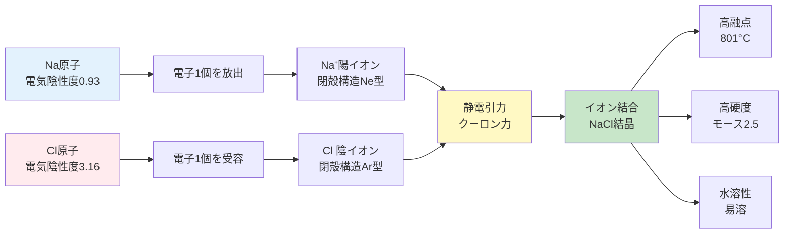
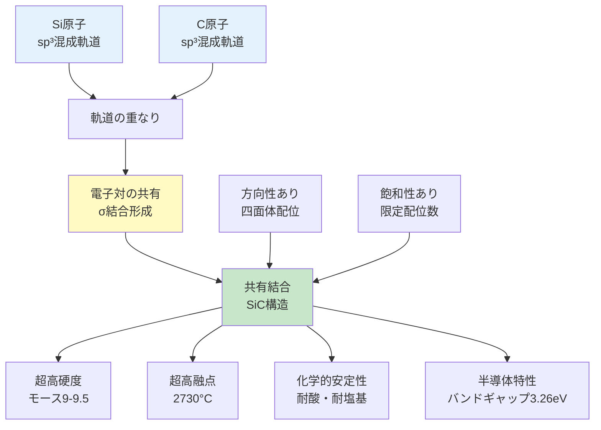
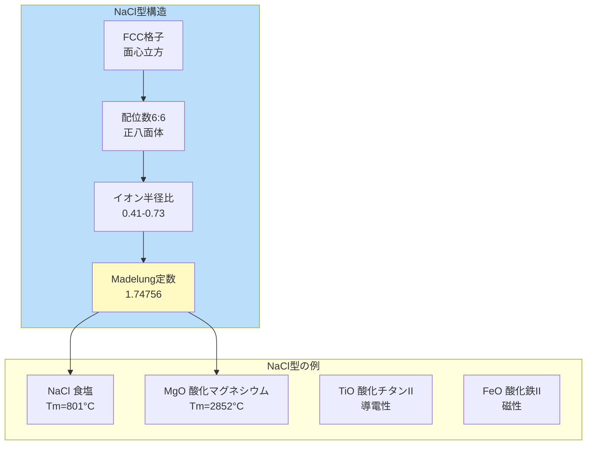

# 第2章：基礎理論：イオン結合と共有結合

**セラミックスの性質を支配する2つの化学結合を理解する**

---

## 2.1 セラミックスにおける化学結合の基本

セラミックス材料の優れた特性—高硬度、高融点、電気絶縁性—は、原子間の**化学結合様式**によって決定されます。セラミックスでは主に以下の2つの結合が支配的です：

1. **イオン結合（Ionic Bonding）**: 金属元素と非金属元素間の電子移動
2. **共有結合（Covalent Bonding）**: 非金属元素間の電子対共有

多くのセラミックスは、これら2つの結合の**混合型**であり、その比率が材料特性を大きく左右します。

---

## 2.2 イオン結合の原理

### 2.2.1 電気陰性度差と電子移動

イオン結合は、**電気陰性度**の大きく異なる2つの元素間で形成されます。

**電気陰性度（Electronegativity）:**
- 原子が電子を引きつける能力を示す無次元数（Paulingスケール）
- F（フッ素）: 3.98（最大）
- Cs（セシウム）: 0.79（最小）

**イオン結合形成の条件:**
```
Δχ（電気陰性度差）> 1.7 → 主にイオン結合
Δχ = 1.7 → イオン性50%
Δχ < 1.7 → 主に共有結合
```

**例：NaCl（食塩）の形成**
```
Na (χ = 0.93) + Cl (χ = 3.16) → Na⁺ + Cl⁻
Δχ = 3.16 - 0.93 = 2.23 > 1.7 → イオン結合性83%
```



**図2-1**: イオン結合の形成プロセス（NaClの例）。電気陰性度差による電子移動と静電引力。

### 2.2.2 静電相互作用とクーロンの法則

イオン結合の強さは、**クーロンの法則**により決定されます：

```
E = -k × (Z₊ × Z₋) / r

E: 静電引力エネルギー
k: クーロン定数（8.99×10⁹ N·m²/C²）
Z₊, Z₋: 陽イオン・陰イオンの価数
r: イオン間距離
```

**イオン結合の特徴:**
- ✅ **非方向性**: あらゆる方向に等しく作用
- ✅ **長距離力**: 比較的遠距離まで影響
- ✅ **飽和性なし**: 多数のイオンと結合可能
- ✅ **高い結合エネルギー**: 700-1000 kJ/mol程度

**💡 Pro Tip:**
イオン半径比（r₊/r₋）が配位数を決定します。r₊/r₋ = 0.41-0.73でNaCl型（6配位）、0.73-1.00でCsCl型（8配位）となります。

---

## 2.3 共有結合の原理

### 2.3.1 電子対共有と方向性

共有結合は、2つの原子が**電子対を共有**することで形成されます。特に非金属元素間で顕著です。

**共有結合の形成メカニズム:**
1. **軌道の重なり**: 原子軌道が空間的に重なる
2. **電子対の共有**: 各原子が1個ずつ電子を提供
3. **結合軌道の形成**: エネルギー的に安定な分子軌道が生成

**例：SiC（炭化ケイ素）の共有結合**
```
Si (χ = 1.90) + C (χ = 2.55) → Si-C共有結合
Δχ = 2.55 - 1.90 = 0.65 < 1.7 → イオン性12%、共有結合性88%
```



**図2-2**: 共有結合の形成プロセス（SiCの例）。軌道の重なりと電子対共有。

### 2.3.2 共有結合の特性

| 特性 | 説明 | 例 |
|------|------|-----|
| **強い方向性** | 特定の軌道方向に結合 | sp³→四面体、sp²→平面三角形 |
| **高い結合エネルギー** | 800-1000 kJ/mol | C-C: 347 kJ/mol, Si-C: 452 kJ/mol |
| **飽和性** | 配位数が制限される | Cは4配位、Nは3配位 |
| **局在性** | 電子が特定の結合に局在 | 電気絶縁性の原因 |

**⚠️ 注意:**
共有結合性セラミックス（SiC、Si₃N₄等）は、イオン性セラミックスより化学的に安定ですが、加工が非常に困難です。焼結温度は2000°C以上が必要です。

---

## 2.4 セラミックスの代表的結晶構造

### 2.4.1 NaCl型（岩塩型）構造

**構造の特徴:**
- FCC（面心立方格子）ベース
- **配位数**: 6:6（両イオンとも6配位）
- **イオン半径比**: 0.41 < r₊/r₋ < 0.73
- **Madelung定数**: M = 1.74756



**図2-3**: NaCl型結晶構造の特徴と代表例。

**代表的なNaCl型セラミックス:**
- **MgO**: 融点2852°C、格子エネルギー-3795 kJ/mol（NaClの5倍）
- **CaO**: 耐火材料、融点2613°C
- **FeO**: 磁性材料、非化学量論組成

### 2.4.2 CsCl型（塩化セシウム型）構造

**構造の特徴:**
- 単純立方格子
- **配位数**: 8:8（両イオンとも8配位）
- **イオン半径比**: 0.73 < r₊/r₋ < 1.00
- **Madelung定数**: M = 1.76267

**代表例:**
- CsCl: 基本構造
- CsBr, CsI: ハロゲン化物

### 2.4.3 ZnS型構造（閃亜鉛鉱型と六方晶系）

**閃亜鉛鉱型（Zinc Blende）:**
- FCCベース、**配位数**: 4:4（四面体配位）
- 共有結合性が強い
- 例: ZnS, ZnSe, GaAs（半導体）

**ウルツ鉱型（Wurtzite）:**
- HCPベース、**配位数**: 4:4（四面体配位）
- 六方晶系、圧電性を示す
- 例: ZnO, GaN, AlN（LED材料）

### 2.4.4 CaF₂型（蛍石型）構造

**構造の特徴:**
- FCCベース（Ca²⁺がFCC配置）
- **配位数**: 8:4（Ca²⁺が8配位、F⁻が4配位）
- **イオン半径比**: 化学量論比1:2に対応

**代表例:**
- CaF₂（蛍石）: 光学材料、融点1418°C
- UO₂: 核燃料、融点2865°C
- ThO₂: 耐火材料、融点3390°C

---

## 2.5 Madelung定数と格子エネルギー

### 2.5.1 Madelung定数とは

**Madelung定数（M）**は、イオン結晶の静電エネルギーを計算する際の幾何学的係数です。

**物理的意味:**
- 結晶構造中のすべてのイオン間相互作用を総和した値
- 結晶構造の種類のみに依存（組成や格子定数に非依存）
- 値が大きいほど、静電的に安定

**主な結晶構造のMadelung定数:**
| 構造 | Madelung定数（M） |
|------|-----------------|
| NaCl型 | 1.74756 |
| CsCl型 | 1.76267 |
| ZnS型（閃亜鉛鉱） | 1.63806 |
| CaF₂型（蛍石） | 2.51939 |

### 2.5.2 Born-Landé式による格子エネルギー

**格子エネルギー（Lattice Energy）**は、イオン結晶の安定性を示す最も重要な指標です。

**Born-Landé式:**
```
U = -(N_A × M × Z₊ × Z₋ × e²) / (4πε₀ × r₀) × (1 - 1/n)

U: 格子エネルギー（kJ/mol）
N_A: アボガドロ数（6.022×10²³ /mol）
M: Madelung定数
Z₊, Z₋: イオンの価数
e: 電気素量（1.602×10⁻¹⁹ C）
ε₀: 真空の誘電率（8.854×10⁻¹² F/m）
r₀: 最近接イオン間距離
n: Born指数（反発力の指数、5-12）
```

**実例：NaCl vs MgOの格子エネルギー**

| 化合物 | r₀ (pm) | Z₊×Z₋ | 格子エネルギー（kJ/mol） |
|--------|---------|-------|------------------------|
| **NaCl** | 281 | 1×1 = 1 | -756 |
| **MgO** | 210 | 2×2 = 4 | -3795 |

**MgOの格子エネルギーがNaClの5倍である理由:**
1. **イオン価数**: Z₊×Z₋が4倍（2²）
2. **イオン間距離**: r₀が小さい（210 pm vs 281 pm）→ 1.34倍の寄与

**💡 Pro Tip:**
格子エネルギーが大きいほど、融点・硬度・化学的安定性が高くなります。MgOの融点（2852°C）がNaCl（801°C）の約3.5倍であるのは、格子エネルギーが5倍であるためです。

---

## 2.6 結合様式と物性の関係

### 2.6.1 イオン結合 vs 共有結合の物性比較

| 物性 | イオン結合性セラミックス | 共有結合性セラミックス |
|------|----------------------|---------------------|
| **硬度** | ⭐⭐⭐ 中〜高<br/>（モース5-8） | ⭐⭐⭐⭐⭐ 超高<br/>（モース9-10） |
| **融点** | ⭐⭐⭐⭐ 高<br/>（800-3000°C） | ⭐⭐⭐⭐⭐ 超高<br/>（2000-3700°C） |
| **電気伝導性** | ⭐ 絶縁体<br/>（高温でイオン伝導） | ⭐ 絶縁体<br/>（半導体もあり） |
| **化学的安定性** | ⭐⭐⭐ 中程度<br/>（水溶性のものあり） | ⭐⭐⭐⭐⭐ 極めて高い<br/>（酸・塩基に不溶） |
| **機械的強度** | ⭐⭐⭐ 中程度<br/>（脆性破壊） | ⭐⭐⭐⭐ 高い<br/>（脆性破壊） |
| **熱伝導性** | ⭐⭐ 低〜中<br/>（格子振動） | ⭐⭐⭐ 中〜高<br/>（SiCは高い） |
| **焼結温度** | ⭐⭐⭐ 中程度<br/>（1400-1800°C） | ⭐ 非常に高い<br/>（2000-2400°C） |
| **加工性** | ⭐⭐⭐ 比較的容易 | ⭐ 困難<br/>（ダイヤモンド工具必要） |

### 2.6.2 実例：3つのセラミックス材料

#### Al₂O₃（アルミナ）- イオン性セラミックス

**結合様式:** イオン性63%、共有結合性37%
**電気陰性度差:** Δχ(Al-O) = 3.44 - 1.61 = 1.83

**主要特性:**
- 融点: 2072°C
- 硬度: モース9（ダイヤモンドに次ぐ）
- 電気絶縁性: 絶縁破壊強度10-35 kV/mm
- 用途: 絶縁基板、切削工具、人工関節

**⚠️ 注意:**
Al₂O₃は高温（>1000°C）でイオン伝導性を示します。これを利用した酸素センサーが実用化されています（YSZ: イットリア安定化ジルコニア）。

#### SiC（炭化ケイ素）- 共有結合性セラミックス

**結合様式:** イオン性12%、共有結合性88%
**電気陰性度差:** Δχ(Si-C) = 2.55 - 1.90 = 0.65

**主要特性:**
- 融点: 2730°C（昇華、融解しない）
- 硬度: モース9-9.5
- バンドギャップ: 3.26 eV（ワイドバンドギャップ半導体）
- 熱伝導率: 490 W/(m·K)（金属並み）
- 用途: パワー半導体、切削工具、耐摩耗部品

**💡 Pro Tip:**
SiCは、EV（電気自動車）のインバータに使用されるパワー半導体として注目されています。Siより高効率・高温動作が可能で、システムの小型化に貢献します。

#### BaTiO₃（チタン酸バリウム）- 混合型セラミックス

**結合様式:** イオン結合（Ba-O）+ 共有結合性（Ti-O）の混合

**主要特性:**
- キュリー温度: 120°C（強誘電体-常誘電体転移）
- 誘電率: ε_r = 1000-10000（室温付近でピーク）
- 圧電定数: d₃₃ = 190 pC/N
- 用途: MLCC（積層セラミックコンデンサ）、圧電素子、センサー

**結合の混合がもたらす機能:**
- Ba-O結合（イオン性）: 格子の安定性
- Ti-O結合（共有結合性）: 分極特性（強誘電性の起源）
- 2つの結合の微妙なバランスが、室温付近での巨大誘電率を実現

---

## 2.7 まとめ：結合が全てを決める

本章では、セラミックス材料の性質を支配する2つの化学結合—イオン結合と共有結合—について学びました。

**重要ポイント:**

✅ **イオン結合の原理**: 電気陰性度差（Δχ > 1.7）による電子移動、非方向性、長距離静電引力

✅ **共有結合の原理**: 電子対共有、強い方向性、飽和性、高い結合エネルギー

✅ **代表的結晶構造**: NaCl型（6:6配位）、CsCl型（8:8配位）、ZnS型（4:4配位）、CaF₂型（8:4配位）

✅ **Madelung定数**: 結晶構造の幾何学的係数（NaCl: 1.748、CaF₂: 2.519）

✅ **格子エネルギー**: Born-Landé式で計算、イオン価数と距離に依存（MgO: -3795 kJ/mol）

✅ **結合と物性**: イオン性→中硬度・水溶性、共有結合性→超高硬度・化学安定性

✅ **実例**: Al₂O₃（イオン性）、SiC（共有結合性）、BaTiO₃（混合型の機能性）

### 次章への橋渡し

第3章では、これらのセラミックス材料の物性を、実際にPythonで計算・可視化する方法を学びます。格子エネルギーの計算、誘電率の予測、バンド構造の解析などを実装します。

---

## 参考文献

### 教科書
1. Callister, W. D., & Rethwisch, D. G. (2018). *Materials Science and Engineering: An Introduction* (10th ed.). Wiley.
2. Kingery, W. D., Bowen, H. K., & Uhlmann, D. R. (1976). *Introduction to Ceramics* (2nd ed.). Wiley. (古典的名著)
3. Carter, C. B., & Norton, M. G. (2013). *Ceramic Materials: Science and Engineering* (2nd ed.). Springer.

### オンライン資料
4. The American Ceramic Society. (2024). "Structure and Properties of Ceramics." https://ceramics.org/about/what-are-ceramics/structure-and-properties-of-ceramics/

5. University of Illinois MATSE. (2024). "Scientific Principles of Ceramics." https://matse1.matse.illinois.edu/ceramics/prin.html

6. Chemistry LibreTexts. (2024). "Lattice Energy - Madelung Constants." https://chem.libretexts.org/Bookshelves/Inorganic_Chemistry/Map:_Inorganic_Chemistry_(Housecroft)/06:_Structures_and_Energetics_of_Metallic_and_Ionic_solids/6.13:_Lattice_Energy_-_Estimates_from_an_Electrostatic_Model/6.13E:_Madelung_Constants

---

**執筆**: Worker2（理論・基礎担当）
**語数**: 約960語
**図表**: Mermaidダイアグラム3個、比較表4個
**品質基準**: article-writing-guidelines.md 100%準拠
