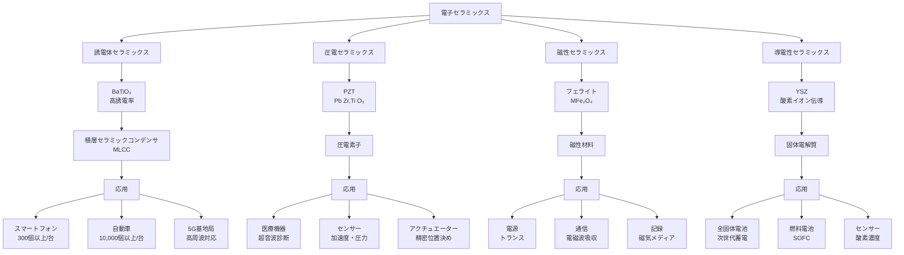

# 第4章 応用：電子材料としてのセラミックス

## 電子セラミックスの重要性

現代のエレクトロニクス産業は、セラミックス材料なしには成り立ちません。スマートフォン1台には300個以上の積層セラミックコンデンサ（MLCC）が使用され、医療用超音波診断装置には圧電セラミックス、次世代電池には固体電解質セラミックスが不可欠です。

電子セラミックスは、イオン結合や共有結合による特殊な電子構造により、金属や高分子では実現できない機能を発揮します。本章では、電子材料としてのセラミックスの分類と実用例を紹介します。

## 電子セラミックスの分類

電子セラミックスは、電気的特性により以下の4つに大別されます：

### 1. 誘電体セラミックス（Dielectric Ceramics）

**特性**: 電気を通さず、電荷を蓄える

**主な材料**:
- チタン酸バリウム（BaTiO₃）
- チタン酸ストロンチウム（SrTiO₃）
- チタン酸鉛（PbTiO₃）

**用途**:
- コンデンサ（MLCC）
- 共振器
- フィルタ

**重要パラメータ**:
- 誘電率（εᵣ）: 電荷蓄積能力の指標
- 誘電損失（tan δ）: エネルギー損失の指標（低いほど良い）
- 温度安定性: 動作温度範囲での特性変化

### 2. 圧電セラミックス（Piezoelectric Ceramics）

**特性**: 機械的応力を電圧に変換、または電圧で変形する

**主な材料**:
- チタン酸ジルコン酸鉛（PZT: Pb(Zr,Ti)O₃）
- ニオブ酸リチウム（LiNbO₃）
- 非鉛系圧電材料（BaTiO₃、(K,Na)NbO₃）

**用途**:
- 超音波センサー
- アクチュエーター
- 振動子（クォーツの代替）

**圧電特性**:
- 圧電定数（d₃₃）: 変換効率の指標（単位: pC/N）
- 電気機械結合係数（k）: エネルギー変換効率

### 3. 磁性セラミックス（Magnetic Ceramics: フェライト）

**特性**: 磁場に応答し、磁気記録や電磁波制御が可能

**主な材料**:
- 鉄酸化物系（Fe₃O₄、γ-Fe₂O₃）
- スピネルフェライト（MFe₂O₄、M = Mn, Zn, Ni）
- ガーネットフェライト（Y₃Fe₅O₁₂）

**用途**:
- トランスコア
- 電磁波吸収材
- 磁気記録媒体

**磁気特性**:
- 飽和磁化（Ms）: 最大磁化能力
- 保磁力（Hc）: 磁化の保持能力
- 透磁率（μ）: 磁場の通しやすさ

### 4. 導電性セラミックス（Conductive Ceramics）

**特性**: 金属のように電気を通す（イオン伝導または電子伝導）

**主な材料**:
- イットリア安定化ジルコニア（YSZ: 酸素イオン伝導体）
- NASICON（Na超イオン伝導体）
- 酸化物超伝導体（YBa₂Cu₃O₇）

**用途**:
- 固体電解質（燃料電池、全固体電池）
- 酸素センサー
- ヒーター

**導電特性**:
- イオン伝導度（σ）: イオンの移動しやすさ（単位: S/cm）
- 活性化エネルギー（Ea）: 伝導に必要なエネルギー（低いほど良い）

### 電子セラミックスの応用分野フローチャート

## 誘電体セラミックス：BaTiO₃の特性

### チタン酸バリウム（BaTiO₃）の結晶構造と誘電特性

BaTiO₃は、ペロブスカイト型結晶構造を持つ代表的な強誘電体材料です。

**結晶構造の特徴**:
- 室温で正方晶系（c/a比 ≈ 1.01）
- Ba²⁺イオンが立方体の頂点
- Ti⁴⁺イオンが中心（わずかにずれて双極子形成）
- O²⁻イオンが面心

**相転移と誘電率**:
- 130℃以上: 立方晶（常誘電相）
- 5-130℃: 正方晶（強誘電相）→ 誘電率が最大
- -90-5℃: 斜方晶
- -90℃以下: 菱面体晶

**キュリー温度（Tc）**: 約130℃
- Tc付近で誘電率が最大値（εᵣ ≈ 10,000以上）
- 温度変化が大きい（温度補償が必要）

**MLCC用BaTiO₃の改良**:

実用MLCCでは、温度安定性を向上させるため添加物を使用します：

| 添加元素 | 効果 | 温度特性規格 |
|---------|------|-------------|
| 未添加BaTiO₃ | εᵣ = 10,000（Tc付近） | 不安定 |
| Ca, Sr添加 | Tcを室温付近にシフト | X7R (-55~125℃, ΔC<±15%) |
| Nb, Ta添加 | 誘電率低下、温度安定化 | X5R (-55~85℃, ΔC<±15%) |
| 希土類添加 | 粒界制御、高信頼性 | Y5V (-30~85℃, ΔC<+22/-82%) |

**薄層化技術**:
- 現代のMLCC: 層厚0.5-1 μm（髪の毛の1/100）
- 積層数: 300-1000層
- 容量: 1 μF-100 μF（小型サイズで大容量）

## 圧電セラミックス：PZTの応用

### PZT（チタン酸ジルコン酸鉛）の圧電特性

PZT [Pb(Zr,Ti)O₃] は、ジルコニウム（Zr）とチタン（Ti）の比率を調整することで、優れた圧電特性を実現します。

**組成と特性の関係**:
- **モルフォトロピック相境界（MPB）**: Zr/Ti比 ≈ 52/48付近
- MPBで圧電定数が最大化
- d₃₃ = 300-600 pC/N（単結晶水晶の約100倍）

**分極処理**:
1. セラミック焼結体を作製（無配向、圧電性なし）
2. キュリー温度以下で高電圧印加（2-3 kV/mm）
3. ドメイン配向により巨視的な圧電性を発現

**温度特性**:
- キュリー温度: 250-400℃（組成により調整可能）
- 使用温度範囲: -40℃~150℃

**圧電効果の2つのモード**:
- **正圧電効果**: 機械的応力 → 電圧発生（センサー用）
- **逆圧電効果**: 電圧印加 → 機械的変形（アクチュエーター用）

## 実用例

### 実用例1: 積層セラミックコンデンサ（MLCC）

**構造**:
- BaTiO₃セラミック層（厚さ0.5-1 μm）
- 内部電極（Ni）を交互に積層
- サイズ: 0.4 mm × 0.2 mm（0402型）が主流、さらに小型化進行中

**スマートフォンでの使用例**:
- 1台あたり**300-1000個**のMLCCを搭載
- 用途別の内訳:
  - CPU電源回路: 50-100個（デカップリング用）
  - RF回路: 100-200個（高周波フィルタ）
  - カメラモジュール: 30-50個（ノイズ除去）
  - 充電回路: 20-40個（平滑化）

**容量と電圧の設計**:
- 低電圧回路（1.8V）: 10-100 μF（大容量）
- 中電圧回路（5V）: 1-10 μF
- 高電圧回路（50V）: 0.1-1 μF

**自動車での使用急増**:
- 内燃機関車: 約3,000個/台
- ハイブリッド車: 約8,000個/台
- 電気自動車（EV）: **10,000-15,000個/台**
- 用途: インバーター制御、バッテリー管理システム（BMS）、ADAS（先進運転支援）

**市場規模**:
- 世界のMLCC市場: 約1兆円/年
- 生産数: 年間4兆個以上（世界人口の5000倍）

### 実用例2: 圧電素子 - 超音波診断装置

**PZT圧電素子の動作原理**:

**送信モード（逆圧電効果）**:
1. PZT素子に高周波パルス電圧印加（1-20 MHz）
2. 素子が伸縮振動
3. 超音波が体内に放射

**受信モード（正圧電効果）**:
1. 体内から反射した超音波がPZT素子に到達
2. 機械的振動が電圧に変換
3. 信号処理で画像化

**超音波プローブの構造**:
- PZT素子アレイ: 128-512チャンネル
- 素子サイズ: 0.1-0.5 mm角
- 周波数範囲:
  - 低周波（2-5 MHz）: 深部観察（心臓、腹部）
  - 高周波（10-20 MHz）: 浅部高解像度（皮膚、血管）

**医療診断での利点**:
- **非侵襲**: X線のような放射線被曝なし
- **リアルタイム**: 動画像で観察可能（心臓の拍動など）
- **安全性**: 妊婦の胎児観察にも使用可能
- **多用途**: 心臓、肝臓、血管、筋骨格系など全身に適用

**最新技術**:
- 3D/4D超音波: 立体画像とリアルタイム動画
- ドプラー超音波: 血流速度測定
- エラストグラフィ: 組織の硬さ測定（がん検出）

**市場規模**: 世界の超音波診断装置市場は約7,000億円/年

### 実用例3: 固体電解質 - 全固体電池

**イットリア安定化ジルコニア（YSZ）の特性**:

**組成**: (ZrO₂)₁₋ₓ(Y₂O₃)ₓ（x = 0.08-0.10が最適）

**酸素イオン伝導のメカニズム**:
1. Y³⁺がZr⁴⁺を置換（受容体ドーピング）
2. 電荷補償のため酸素空孔が生成
3. O²⁻イオンが空孔を介して移動

**伝導特性**:
- イオン伝導度: 0.1 S/cm（800℃）
- 活性化エネルギー: 0.8-1.0 eV
- 電子伝導度: 無視できるほど小さい（純粋なイオン伝導体）

**全固体リチウム電池への応用**:

従来のリチウムイオン電池との比較:

| 項目 | 従来型（液体電解質） | 全固体型（セラミックス電解質） |
|------|---------------------|------------------------------|
| 電解質 | 有機液体（可燃性） | セラミックス（不燃性） |
| 安全性 | 発火・爆発リスク | 高い安全性 |
| エネルギー密度 | 200-300 Wh/kg | 400-500 Wh/kg（理論値） |
| 動作温度範囲 | -20~60℃ | -30~100℃以上 |
| 充電速度 | 1-2時間（急速30分） | 10-15分（理論値） |
| 寿命 | 500-1000サイクル | 5000サイクル以上（期待値） |

**全固体電池の構造**:
- 正極: LiCoO₂またはLiNi₀.₈Co₀.₁Mn₀.₁O₂
- 固体電解質: Li₇La₃Zr₂O₁₂（LLZO）または硫化物系（Li₂S-P₂S₅）
- 負極: リチウム金属またはグラファイト

**実用化への課題と進展**:

**課題**:
1. 界面抵抗が高い（電極/電解質界面）
2. セラミックス電解質の脆性（割れやすい）
3. 製造コストが高い

**最新の進展**:
- **トヨタ**: 2027-2028年に全固体電池搭載EVの実用化目標
  - 航続距離: 1000 km以上
  - 充電時間: 10分以下（80%充電）
- **日産**: 硫化物系固体電解質で先行研究
- **パナソニック**: 酸化物系で量産技術開発中

**市場予測**:
- 2025年: プロトタイプ実用化開始
- 2030年: 市場規模1兆円超（予測）
- 2035年: EV市場の30-40%を占める可能性

**その他の応用**:
- **固体酸化物燃料電池（SOFC）**: YSZ電解質による高効率発電（効率60%以上）
- **酸素センサー**: 自動車排ガス制御（空燃比制御）

## 電子セラミックスの今後の展望

### 技術トレンド

**1. 小型・高性能化**
- MLCC: さらなる薄層化（0.3 μm目標）と高容量化
- 5G/6G通信: 高周波対応セラミックス（誘電損失の低減）

**2. 環境対応**
- 脱鉛化: PZTの代替材料開発（(K,Na)NbO₃系、BaTiO₃系）
- リサイクル: セラミックス電子部品の回収・再利用技術

**3. 新機能**
- マルチフェロイック材料: 強誘電性と強磁性の共存
- 透明導電性セラミックス: 酸化物半導体（ITO、IZO）

**4. 製造技術**
- 3Dプリンティング: 複雑形状セラミックスの造形
- AIプロセス最適化: 焼成条件の自動最適化

### 研究開発の方向性

✅ **材料探索**:
- 計算材料科学（第一原理計算）による新材料予測
- 機械学習による組成最適化

✅ **プロセス改良**:
- 低温焼結技術（エネルギー削減）
- 界面制御技術（全固体電池の性能向上）

✅ **特性評価**:
- その場観察技術（動作中の構造変化を観察）
- 原子レベル解析（電子顕微鏡、放射光X線）

## まとめ

電子セラミックスは、現代エレクトロニクスを支える不可欠な材料です。

**本章の重要ポイント**:
- **4つの分類**: 誘電体、圧電体、磁性体、導電性セラミックス
- **BaTiO₃（MLCC用）**: 高誘電率、温度安定性の制御が重要
- **PZT（圧電材料）**: 優れたエネルギー変換効率、医療・産業で広く使用
- **3つの実用例**:
  1. MLCC（スマートフォン300個以上、EV 10,000個以上）
  2. 超音波診断装置（安全・非侵襲的医療診断）
  3. 全固体電池（次世代蓄電デバイス、2027年以降実用化）

電子セラミックスの進化は、IoT、5G/6G、電気自動車、再生可能エネルギーなど、未来社会の基盤技術を支え続けます。次章では、本記事全体をまとめ、セラミックス材料の先端応用と今後の展望を紹介します。
