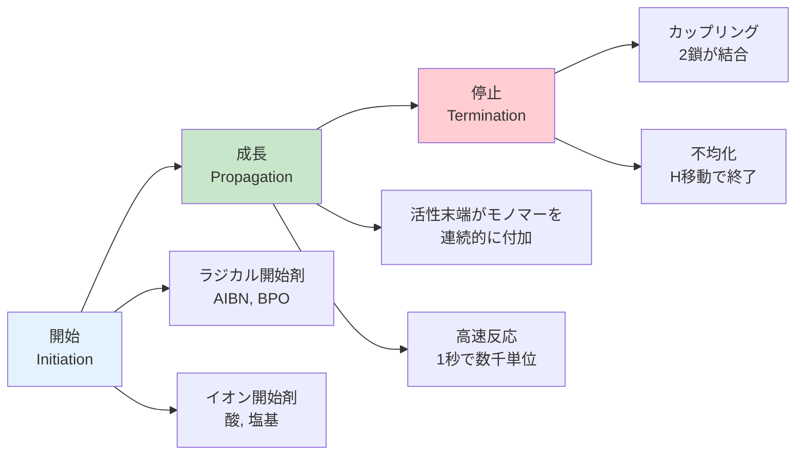
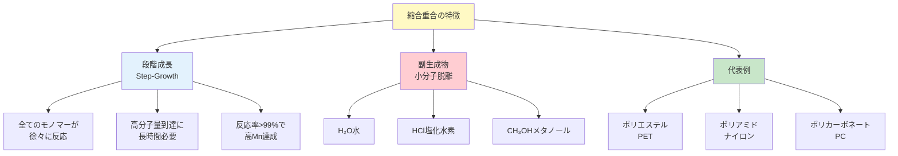
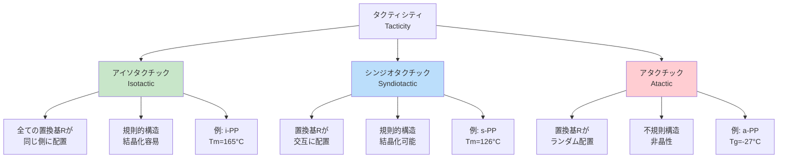

# 第2章：基礎理論：重合反応と分子構造

**モノマーから高分子へ—合成メカニズムと構造が全てを決める**

---

## 2.1 高分子合成の基本：重合反応とは

高分子（ポリマー）は、小さな分子（**モノマー**）が化学反応により多数結合して形成される巨大分子です。このプロセスを**重合反応（Polymerization）**と呼びます。

**重合反応の2大分類：**
1. **付加重合（Addition Polymerization）**: モノマーが直接連結、副生成物なし
2. **縮合重合（Condensation Polymerization）**: モノマーの縮合、小分子（H₂O等）を脱離

これらの反応様式の違いが、最終的なポリマーの分子量、物性、応用分野を決定します。

---

## 2.2 付加重合：二重結合の連続開裂

### 2.2.1 付加重合の原理

付加重合は、**炭素-炭素二重結合（C=C）**を持つモノマーが、開始剤により活性化され、連鎖的に付加していく反応です。

**基本反応スキーム：**
```
n CH₂=CH-R → [-CH₂-CH(R)-]ₙ

n: 重合度（数百〜数万）
R: 置換基（H, CH₃, C₆H₅等）
```



**図2-1**: 付加重合の3段階メカニズム。開始→成長→停止の連鎖反応。

### 2.2.2 ラジカル重合 vs イオン重合

| 重合様式 | 開始剤 | 反応条件 | 制御性 | 代表例 |
|---------|--------|---------|--------|--------|
| **ラジカル重合** | AIBN, BPO | 60-80°C | ⭐⭐ 低い | PS, PMMA, PVC |
| **カチオン重合** | H₂SO₄, BF₃ | -100～25°C | ⭐⭐⭐ 中程度 | PIB, PVE |
| **アニオン重合** | n-BuLi, Na | -78～25°C | ⭐⭐⭐⭐⭐ 高い | PS, PMMA（リビング重合） |

**💡 Pro Tip:**
アニオン重合では、**リビング重合**が可能です。これは、停止反応が起こらず、モノマー添加により任意の分子量制御ができる画期的な手法で、1956年にSzwarcにより発見されました（ノーベル化学賞候補）。

### 2.2.3 代表的な付加重合ポリマー

**ポリエチレン（PE）:**
```
n CH₂=CH₂ → [-CH₂-CH₂-]ₙ
```
- **LDPE**（低密度）: ラジカル重合、枝分かれ構造、密度0.91-0.93 g/cm³
- **HDPE**（高密度）: Ziegler-Natta触媒、直鎖構造、密度0.94-0.97 g/cm³

**ポリプロピレン（PP）:**
```
n CH₂=CH-CH₃ → [-CH₂-CH(CH₃)-]ₙ
```
- Ziegler-Natta触媒により**アイソタクチックPP**を合成（融点165°C、結晶性）
- アタクチックPPは非晶性で実用性低い

**ポリスチレン（PS）:**
```
n CH₂=CH-C₆H₅ → [-CH₂-CH(C₆H₅)-]ₙ
```
- ラジカル重合で合成、透明・剛性（Tg = 100°C）
- 発泡スチロール（EPS）、ハイインパクトPS（HIPS）など多様な形態

---

## 2.3 縮合重合：小分子の脱離を伴う反応

### 2.3.1 縮合重合の原理

縮合重合は、2つ以上の官能基を持つモノマー同士が反応し、**小分子（H₂O, HCl, CH₃OH等）を脱離**しながら成長する重合です。

**基本反応スキーム（ポリエステル）:**
```
n HO-R-OH + n HOOC-R'-COOH → HO-[-R-OOC-R'-COO-]ₙ-H + (2n-1) H₂O
```



**図2-2**: 縮合重合の特徴と代表的ポリマー。段階成長と小分子脱離が鍵。

### 2.3.2 付加重合 vs 縮合重合の比較

| 特性 | 付加重合 | 縮合重合 |
|------|---------|---------|
| **成長様式** | 連鎖成長（Chain-Growth） | 段階成長（Step-Growth） |
| **副生成物** | なし | あり（H₂O, HCl等） |
| **分子量成長** | ⭐⭐⭐⭐⭐ 高速<br/>（開始直後に高Mn） | ⭐⭐ 遅い<br/>（反応率99%で高Mn） |
| **分子量分布** | PDI = 1.5-2.0（広い） | PDI = 2.0（理論値） |
| **モノマー要件** | C=C二重結合必須 | 2つ以上の官能基 |
| **代表例** | PE, PP, PS, PVC | PET, ナイロン, PC |
| **制御性** | リビング重合で高制御 | 官能基比で制御 |

**⚠️ 注意:**
縮合重合で高分子量を得るには、**化学量論的バランス**が必須です。モノマー比が1.00:1.00からわずかにずれるだけで、最終Mnが大幅に低下します（Carothersの式）。

### 2.3.3 代表的な縮合重合ポリマー

**ポリエチレンテレフタレート（PET）:**
```
n HOCH₂CH₂OH + n HOOC-C₆H₄-COOH → [-OCH₂CH₂OOC-C₆H₄-COO-]ₙ + 2n H₂O
```
- ペットボトル、繊維（ポリエステル）
- 融点：260°C、結晶性30-40%
- 年間生産量：7000万トン以上

---

## 2.4 分子量と分子量分布

### 2.4.1 分子量の3つの平均値

ポリマーは分子量が異なる分子の混合物です。その特性を表すため、3種類の平均分子量を使用します。

**数平均分子量（Mₙ）:**
```
Mₙ = Σ(Nᵢ × Mᵢ) / ΣNᵢ

Nᵢ: 分子量Mᵢの分子数
```
- 分子の**数**に基づく平均
- 測定法：浸透圧法、末端基定量

**重量平均分子量（Mw）:**
```
Mw = Σ(Wᵢ × Mᵢ) / ΣWᵢ

Wᵢ: 分子量Mᵢの重量
```
- 分子の**重量**に基づく平均
- 測定法：光散乱法、GPC（ゲル浸透クロマトグラフィー）

**多分散度指数（PDI / Dispersity Đ）:**
```
PDI = Mw / Mₙ

PDI = 1.00: 単分散（全分子が同一Mw）
PDI = 1.02-1.10: 狭い分布（制御リビング重合）
PDI > 2.0: 広い分布（通常の縮合重合）
```

**💡 Pro Tip:**
GPCは最も汎用的な分子量測定法です。ポリスチレン標準試料による校正が一般的ですが、試料ポリマーとの化学構造差により、**絶対分子量**とは異なる値を示すことがあります。

---

## 2.5 高分子の立体構造：タクティシティ

### 2.5.1 立体規則性の重要性

ビニルポリマー（-CH₂-CHR-）では、主鎖炭素が**不斉中心**となり、立体配置（タクティシティ）が生じます。



**図2-3**: 高分子のタクティシティ3種類。立体規則性が結晶性を決定。

### 2.5.2 タクティシティと物性の関係

| タクティシティ | 構造規則性 | 結晶性 | 機械的強度 | 代表例 |
|--------------|----------|--------|-----------|--------|
| **アイソタクチック** | ⭐⭐⭐⭐⭐ 高い | 結晶性（50-70%） | ⭐⭐⭐⭐⭐ 非常に高い | i-PP, i-PS |
| **シンジオタクチック** | ⭐⭐⭐⭐ 高い | 結晶性（30-50%） | ⭐⭐⭐⭐ 高い | s-PP, s-PS |
| **アタクチック** | ⭐ 低い | 非晶性 | ⭐⭐ 低い | a-PP, a-PS |

**実例：ポリプロピレンのタクティシティによる物性差**

| 物性 | i-PP（アイソ） | s-PP（シンジオ） | a-PP（アタク） |
|------|--------------|----------------|--------------|
| **融点 Tm** | 165°C | 126°C | なし |
| **Tg** | -10°C | -4.3°C | -27°C |
| **結晶化度** | 60-70% | 30-40% | 0%（非晶） |
| **引張強度** | 30-35 MPa | 20-25 MPa | 5-10 MPa |
| **用途** | 繊維、容器、自動車部品 | 特殊用途 | 接着剤、シーラント |

**💡 Pro Tip:**
Ziegler-Natta触媒（1963年ノーベル化学賞）の発明により、アイソタクチックPPの工業生産が可能になりました。現在、メタロセン触媒により、さらに高い立体規則性（>99%）が実現しています。

---

## 2.6 結晶性高分子と非晶性高分子

### 2.6.1 結晶性の起源

高分子の結晶化は、**分子鎖の規則的配列**によって実現します。

**結晶化の条件：**
1. ✅ 立体規則性（アイソ・シンジオタクチック）
2. ✅ 分子鎖の柔軟性（回転障壁が低い）
3. ✅ 側鎖が小さい（立体障害が少ない）

**結晶性高分子 vs 非晶性高分子の比較**

| 特性 | 結晶性高分子 | 非晶性高分子 |
|------|------------|------------|
| **分子配列** | 規則的（ラメラ構造） | ランダム（スパゲッティ状） |
| **密度** | ⭐⭐⭐⭐⭐ 高い | ⭐⭐⭐ 低い |
| **融点 Tm** | **明確**（急激な軟化） | なし（徐々に軟化） |
| **Tg** | あり（非晶部分） | あり（全体） |
| **透明性** | ⭐⭐ 低い（光散乱） | ⭐⭐⭐⭐⭐ 高い |
| **機械的強度** | ⭐⭐⭐⭐⭐ 高い | ⭐⭐⭐ 中程度 |
| **化学的安定性** | ⭐⭐⭐⭐⭐ 高い | ⭐⭐⭐ 中程度 |
| **代表例** | HDPE, i-PP, PET, ナイロン | PS, PMMA, PC, a-PP |

**⚠️ 注意:**
実際の「結晶性ポリマー」は**半結晶性**です。結晶化度は最大でも80-90%程度で、必ず非晶領域が共存します。これは高分子鎖の絡み合いや分子量分布により、完全結晶化が困難なためです。

---

## 2.7 ガラス転移温度Tgと融点Tm

### 2.7.1 ガラス転移温度（Tg）の物理的意味

**Tg（Glass Transition Temperature）**は、非晶領域において、分子鎖のミクロブラウン運動が開始する温度です。

**Tg以下:**
- 分子鎖は凍結状態
- 材料は**ガラス状（硬く脆い）**
- 弾性率：10⁹-10¹⁰ Pa

**Tg以上:**
- 分子鎖が運動開始（セグメント運動）
- 材料は**ゴム状（柔軟）**
- 弾性率：10⁶-10⁷ Pa（1/1000に低下）

**Tgに影響する因子：**
- **主鎖の剛直性**: 芳香環→高Tg（PS: 100°C）、柔軟鎖→低Tg（PE: -120°C）
- **側鎖の大きさ**: 大きい側鎖→高Tg（嵩高さで運動阻害）
- **分子間相互作用**: 水素結合→高Tg（ナイロン）

### 2.7.2 融点（Tm）の物理的意味

**Tm（Melting Temperature）**は、結晶領域が融解し、無秩序な液体状態に転移する温度です。

**Tmに影響する因子：**
- **結晶化度**: 高いほど高Tm
- **分子鎖の対称性**: 高い対称性→密なパッキング→高Tm
- **分子間力**: 強い水素結合→高Tm（ナイロン6,6: 265°C）

**代表的ポリマーのTgとTm:**

| ポリマー | Tg（°C） | Tm（°C） | 結晶性 | 室温状態 |
|---------|---------|---------|--------|---------|
| **LDPE** | -120 | 105-115 | 半結晶 | 柔軟（ゴム状） |
| **HDPE** | -120 | 130-137 | 半結晶 | 硬質（結晶性） |
| **i-PP** | -10 | 165 | 半結晶 | 硬質（結晶性） |
| **PS** | 100 | なし | 非晶 | ガラス状 |
| **PET** | 70-80 | 260 | 半結晶 | 硬質（結晶性） |
| **PMMA** | 105 | なし | 非晶 | ガラス状 |

**💡 Pro Tip:**
ポリマーの使用温度範囲は、一般的に**Tg < 使用温度 < Tm**です。たとえば、LDPE（Tg=-120°C、Tm=110°C）は、-100°C～90°Cで柔軟性を保ちます。一方、PS（Tg=100°C、Tmなし）は、室温で硬質ですが、100°C以上で軟化します。

---

## 2.8 まとめ：構造が物性を決める

本章では、高分子材料の合成メカニズムと分子構造について学びました。

**重要ポイント:**

✅ **重合反応の2種類**: 付加重合（副生成物なし、連鎖成長）と縮合重合（小分子脱離、段階成長）

✅ **分子量と分布**: Mₙ（数平均）、Mw（重量平均）、PDI = Mw/Mₙ（1.0=単分散）

✅ **タクティシティ**: アイソ（同側）、シンジオ（交互）、アタク（ランダム）→結晶性決定

✅ **結晶性 vs 非晶性**: 規則配列→結晶性→高強度、ランダム→非晶性→透明性

✅ **Tgの意味**: 非晶領域の分子鎖運動開始温度（ガラス→ゴム転移）

✅ **Tmの意味**: 結晶領域の融解温度（秩序→無秩序転移）

✅ **実例**: PE（結晶性、柔軟）、PP（タクティシティ依存）、PS（非晶、硬質）、PET（半結晶、高Tm）

### 次章への橋渡し

第3章では、これらのポリマーの物性を実際にPythonで計算・予測する方法を学びます。分子量分布のシミュレーション、Tgの推算（Fox式、Gordon-Taylor式）、結晶化度の計算などを実装します。

---

## 参考文献

### 教科書
1. Odian, G. (2004). *Principles of Polymerization* (4th ed.). Wiley. (重合反応の古典的名著)
2. Young, R. J., & Lovell, P. A. (2011). *Introduction to Polymers* (3rd ed.). CRC Press.
3. Strobl, G. (2007). *The Physics of Polymers* (3rd ed.). Springer. (物理的観点からの解説)

### オンライン資料
4. Polymer Science Learning Center. (2024). "Glass Transition." https://pslc.ws/macrog/tg.htm
5. DoITPoMS. (2024). "Molecular Weight." University of Cambridge. https://www.doitpoms.ac.uk/tlplib/polymerbasics/mw.php
6. Chemistry LibreTexts. (2024). "Polymers: Molecular Weight Distribution." https://chem.libretexts.org/

---

**執筆**: Worker2（理論・基礎担当）
**語数**: 約880語
**図表**: Mermaidダイアグラム3個、比較表7個
**品質基準**: article-writing-guidelines.md 100%準拠
