# 第4章 応用：プラスチックからバイオ材料まで

## ポリマー材料の産業的重要性

ポリマー材料は、現代社会のあらゆる場面で使用されています。世界のプラスチック生産量は年間約**3.9億トン**（2022年）に達し、包装材、自動車部品、電子機器、医療機器など、多岐にわたる用途で不可欠な材料となっています。

本章では、汎用プラスチックから高性能エンジニアリングプラスチック、そして環境配慮型のバイオ材料まで、ポリマー材料の応用を体系的に紹介します。

## 高分子材料の分類フローチャート

```mermaid
graph TD
    A[高分子材料] --> B[汎用プラスチック<br/>Commodity Plastics]
    A --> C[エンジニアリング<br/>プラスチック<br/>Engineering Plastics]
    A --> D[スーパーエンプラ<br/>Super Engineering<br/>Plastics]
    A --> E[バイオベース<br/>プラスチック]

    B --> B1[5大プラスチック]
    B1 --> B1A[PE<br/>ポリエチレン<br/>密度: 0.92-0.97]
    B1 --> B1B[PP<br/>ポリプロピレン<br/>密度: 0.90-0.91]
    B1 --> B1C[PVC<br/>塩化ビニル<br/>密度: 1.38-1.41]
    B1 --> B1D[PS<br/>ポリスチレン<br/>密度: 1.05]
    B1 --> B1E[PET<br/>ポリエステル<br/>密度: 1.38-1.40]

    B --> B2[用途]
    B2 --> B2A[包装材<br/>60%]
    B2 --> B2B[建材<br/>20%]
    B2 --> B2C[日用品<br/>20%]

    C --> C1[主要材料]
    C1 --> C1A[PC<br/>ポリカーボネート<br/>耐熱120℃]
    C1 --> C1B[PA<br/>ポリアミド<br/>ナイロン]
    C1 --> C1C[POM<br/>ポリアセタール<br/>耐摩耗性]
    C1 --> C1D[PBT<br/>ポリブチレン<br/>テレフタレート]

    C --> C2[用途]
    C2 --> C2A[自動車部品<br/>35%]
    C2 --> C2B[電気・電子<br/>40%]
    C2 --> C2C[機械部品<br/>25%]

    D --> D1[超高性能材料]
    D1 --> D1A[PEEK<br/>耐熱250℃]
    D1 --> D1B[PPS<br/>耐薬品性]
    D1 --> D1C[LCP<br/>液晶ポリマー]
    D1 --> D1D[PI<br/>ポリイミド<br/>耐熱400℃]

    D --> D2[用途]
    D2 --> D2A[航空宇宙<br/>30%]
    D2 --> D2B[半導体<br/>40%]
    D2 --> D2C[医療機器<br/>30%]

    E --> E1[環境対応材料]
    E1 --> E1A[PLA<br/>生分解性<br/>トウモロコシ原料]
    E1 --> E1B[PBS<br/>生分解性<br/>石油由来]
    E1 --> E1C[バイオPE<br/>サトウキビ原料]

    E --> E2[用途]
    E2 --> E2A[使い捨て製品<br/>50%]
    E2 --> E2B[包装材<br/>40%]
    E2 --> E2C[農業資材<br/>10%]
```

## 汎用プラスチック：5大プラスチック

汎用プラスチックは、世界のプラスチック生産量の約**75%**を占め、低コストで大量生産される材料です。

### 5大プラスチックの特性と用途

| 材料 | 化学構造 | 密度 (g/cm³) | 融点 (℃) | 主な特性 | 主な用途 | 価格 (円/kg) |
|------|---------|----------------|------------|---------|---------|----------------|
| **PE** ポリエチレン | -(CH₂-CH₂)ₙ- | 0.92-0.97 | 110-135 | 柔軟、耐薬品性、電気絶縁性 | レジ袋、容器、パイプ | 150-200 |
| **PP** ポリプロピレン | -(CH₂-CH(CH₃))ₙ- | 0.90-0.91 | 160-170 | 軽量、耐熱性、成形性良好 | 自動車部品、容器、繊維 | 140-180 |
| **PVC** 塩化ビニル | -(CH₂-CHCl)ₙ- | 1.38-1.41 | 80 （分解） | 難燃性、耐候性、可塑剤で軟質化 | パイプ、電線被覆、床材 | 120-160 |
| **PS** ポリスチレン | -(CH₂-CH(C₆H₅))ₙ- | 1.05 | 240 | 透明性、剛性、断熱性（発泡） | 食品容器、断熱材、CD | 130-170 |
| **PET** ポリエステル | -[CO-C₆H₄-CO-O-CH₂-CH₂-O]ₙ- | 1.38-1.40 | 260 | 透明性、ガスバリア性、強度 | ペットボトル、繊維、フィルム | 160-220 |

**世界生産量（2022年）**:
- PE: 約1.2億トン（31%）
- PP: 約7,500万トン（19%）
- PVC: 約5,500万トン（14%）
- PS: 約2,000万トン（5%）
- PET: 約3,000万トン（8%）

## エンジニアリングプラスチック

エンジニアリングプラスチック（エンプラ）は、機械的強度や耐熱性に優れ、金属の代替として構造材料に使用されます。

### 主要エンプラの特性比較

| 材料 | 耐熱温度 (℃) | 引張強度 (MPa) | 主な特性 | 主な用途 | 価格 (円/kg) |
|------|----------------|------------------|---------|---------|----------------|
| **PC** ポリカーボネート | 120-130 | 60-70 | 高透明性、耐衝撃性、難燃性 | 光学レンズ、車両窓、CD/DVD基板 | 350-500 |
| **PA** ポリアミド（ナイロン） | 80-150 | 70-85 | 耐摩耗性、自己潤滑性、靭性 | 歯車、軸受、繊維、自動車部品 | 300-600 |
| **POM** ポリアセタール | 90-110 | 65-70 | 耐疲労性、低摩擦係数、寸法安定性 | 精密歯車、ファスナー、バルブ | 280-400 |
| **PBT** ポリブチレンテレフタレート | 140-160 | 55-65 | 電気絶縁性、耐薬品性、成形性 | 電気コネクタ、自動車電装品 | 300-450 |
| **変性PPE** ポリフェニレンエーテル | 100-120 | 50-60 | 耐熱性、寸法安定性、低吸水性 | OA機器筐体、自動車外装 | 350-500 |

**市場規模**: 世界のエンプラ市場は約**2兆円**（2023年）、年率5-7%成長

## スーパーエンジニアリングプラスチック

スーパーエンプラは、150℃以上の高温環境で長期間使用可能な超高性能材料です。

### スーパーエンプラの特性と高性能用途

| 材料 | 耐熱温度 (℃) | 引張強度 (MPa) | 主な特性 | 主な用途 | 価格 (円/kg) |
|------|----------------|------------------|---------|---------|----------------|
| **PEEK** ポリエーテルエーテルケトン | 250-260 | 90-100 | 超耐熱性、耐薬品性、放射線耐性 | 航空機部品、医療インプラント、半導体製造装置 | 5,000-10,000 |
| **PPS** ポリフェニレンサルファイド | 220-240 | 65-85 | 難燃性、耐薬品性、寸法安定性 | 自動車エンジン周辺部品、電子部品 | 800-1,500 |
| **LCP** 液晶ポリマー | 280-320 | 140-280 | 超高強度、低線膨張、高周波特性 | 電子コネクタ、5G基地局部品、光ファイバー | 1,500-3,000 |
| **PI** ポリイミド | 400以上 | 80-120 | 超耐熱性、電気絶縁性、耐放射線性 | 半導体絶縁膜、宇宙機器、フレキシブル基板 | 3,000-15,000 |

**用途の特徴**:
- 汎用プラスチックの**10-100倍**の価格
- 少量生産・高付加価値用途
- 市場規模: 約5,000億円（スーパーエンプラ全体、2023年）

## 実用例

### 実用例1: PETボトル - リサイクル性とバリア性

**ポリエチレンテレフタレート（PET）の特性**

PETは、優れた透明性、ガスバリア性、機械的強度により、飲料容器として世界的に普及しています。

**PETボトルの構造と特性**:
- 厚さ: 0.3-0.5 mm（500 mL ボトル）
- 重量: 20-30 g（従来ガラス瓶の1/20）
- 透明度: 90%以上（ガラスに匹敵）
- 酸素透過率: 10-20 cc/(m²·day·atm)（ガラスの約1/100、ポリエチレンの1/10）
- 二酸化炭素透過率: 50-100 cc/(m²·day·atm)（炭酸飲料の保持に十分）

**製造プロセス（延伸ブロー成形）**:
1. **プリフォーム成形**: PET樹脂を射出成形（試験管状）
2. **加熱**: 90-120℃に加熱（ガラス転移温度以上）
3. **延伸ブロー**: 縦方向2.5-3倍、横方向3-4倍に延伸しながらブロー成形
4. **結晶化**: 二軸延伸により結晶化度向上（15-30%）
5. **冷却固化**: 透明で強度の高いボトル完成

**市場規模と生産量**:
- 世界のPETボトル生産量: 年間約**5,000億本**（2022年）
- 日本: 年間約230億本（1人あたり約180本/年）
- 市場規模: 世界で約**3兆円**

**リサイクルの実態**:

日本のPETボトルリサイクル率は世界最高水準です：

| 地域 | リサイクル率 | 主な用途 |
|------|------------|---------|
| 日本 | **88.5%** (2022年) | ボトル to ボトル: 35% 繊維: 40% シート: 15% その他: 10% |
| EU | 約48% | 繊維、シート |
| 米国 | 約27% | 繊維、プラスチック製品 |

**ケミカルリサイクル技術**:
- **加溶解法**: PETを解重合し、テレフタル酸とエチレングリコールに分解
- **メタノリシス**: メタノールでジメチルテレフタレートとエチレングリコールに転換
- **糖化法**: 酵素でPETを分解（新技術、効率向上中）
- バージン材と同等品質の再生PETを製造可能

**環境貢献**:
- ガラス瓶からの転換によりCO₂排出量**60%削減**
- 軽量化により輸送時のエネルギー消費削減
- リサイクルによりバージン樹脂使用量削減

### 実用例2: ポリアミド繊維（ナイロン）- 自動車部品と衣料

**ポリアミド（PA）の特性**

ポリアミドは、アミド結合（-CO-NH-）を持つ高分子で、優れた機械的強度、耐摩耗性、自己潤滑性を示します。

**主要なポリアミド**:
- **PA6（ナイロン6）**: カプロラクタムの開環重合
- **PA66（ナイロン66）**: ヘキサメチレンジアミンとアジピン酸の縮合重合
- **PA12**: ラウロラクタムの開環重合（低吸水性）

**機械的特性**:
- 引張強度: 70-85 MPa
- 引張弾性率: 2-3 GPa
- 伸び率: 30-100%
- 耐摩耗性: 鋼の約10倍（自己潤滑性による）

**自動車部品への応用**:

現代の自動車1台には、約**15-20 kg**のポリアミド部品が使用されています：

| 部品 | 使用量 | 選定理由 |
|------|--------|---------|
| エンジンカバー | 2-3 kg | 耐熱性（PA6GF：ガラス繊維強化）、軽量化 |
| インテークマニホールド | 1-2 kg | 耐熱性150℃、複雑形状成形可能 |
| ラジエータータンク | 1.5 kg | 耐熱性、耐不凍液性（PA66GF） |
| 燃料配管 | 0.5 kg | 耐ガソリン性（PA12） |
| 歯車・軸受 | 1-2 kg | 耐摩耗性、自己潤滑性、静音性 |
| エアバッグ基布 | 0.3 kg | 高強度、引裂強度（PA66繊維） |

**軽量化効果**:
- アルミ合金と比較して**40%軽量**
- 鋼と比較して**80%軽量**
- 燃費向上: 車両重量10%削減で燃費約**5-7%改善**

**衣料用繊維への応用**:

ポリアミド繊維（ナイロン）の衣料市場：

**特性**:
- 引張強度: 綿の約2倍、絹の約3倍
- 耐摩耗性: 綿の約10倍
- 速乾性: 吸水率約4%（綿は8%）
- 弾性回復率: 優れたストレッチ性

**用途別消費量（世界、2022年）**:
- スポーツウェア: 40%（約200万トン）
- ストッキング・タイツ: 25%
- アウトドア衣料: 20%
- 下着: 10%
- その他: 5%

**市場規模**: 世界のポリアミド繊維市場は約**500万トン/年**、市場規模約**1.5兆円**

### 実用例3: 生分解性プラスチック（PLA）- 環境配慮型材料

**ポリ乳酸（PLA: Polylactic Acid）の特性**

PLAは、トウモロコシやサトウキビなどの植物由来の乳酸を原料とする生分解性バイオプラスチックです。

**製造プロセス**:
1. **発酵**: トウモロコシ澱粉 → グルコース → 乳酸（乳酸菌発酵）
2. **重合**: 乳酸 → ラクチド（環状二量体）→ PLA（開環重合）
3. **成形**: 射出成形、フィルム成形、繊維紡糸

**物性**:
- 融点: 150-180℃
- ガラス転移温度: 55-60℃
- 引張強度: 50-70 MPa（PSに匹敵）
- 透明性: 90%以上（PETやPSに匹敵）
- 密度: 1.24 g/cm³

**生分解性のメカニズム**:

PLAは、コンポスト環境（高温・高湿度・微生物存在）で生分解します：

1. **加水分解**: 60℃以上の高温多湿環境でエステル結合が加水分解
2. **低分子化**: 分子量が数千程度まで低下
3. **微生物分解**: バクテリアや真菌が低分子PLAを代謝
4. **完全分解**: CO₂ + H₂O + バイオマスに分解（約3-6ヶ月）

**分解条件**:
- 工業コンポスト（60℃、湿度80%）: 3-6ヶ月で完全分解
- 土壌中（25℃）: 2-5年で分解
- 海洋環境: 分解が極めて遅い（低温・pH変動）

**用途と市場**:

| 用途 | 特徴 | 市場シェア |
|------|------|-----------|
| 使い捨て食器 | 透明性、成形性、コンポスト対応 | 30% |
| 包装フィルム | ガスバリア性、透明性、ヒートシール性 | 25% |
| 農業用マルチフィルム | 土壌分解性、回収不要 | 20% |
| 繊維（衣料、不織布） | 吸湿性、抗菌性、肌触り | 15% |
| 医療用材料（縫合糸、ステント） | 生体吸収性、生体適合性 | 10% |

**市場規模**:
- 世界のPLA生産量: 約**30万トン/年**（2023年）
- 市場規模: 約**1,200億円**
- 年平均成長率（CAGR）: **15-20%**（2023-2030年予測）

**環境への影響**:

PLAのライフサイクルアセスメント（LCA）:

| 項目 | 石油系プラスチック（PE） | PLA | 削減率 |
|------|----------------------|-----|--------|
| CO₂排出量（kg-CO₂/kg樹脂） | 2.0-2.5 | 0.5-1.5 | **40-70%削減** |
| 化石燃料使用量（MJ/kg） | 70-80 | 20-40 | **50-70%削減** |
| 土地利用（m²/kg） | 0 | 2-5 | - |

**課題と今後の展開**:

**現在の課題**:
1. **価格**: PE/PPの2-3倍（300-500円/kg）
2. **耐熱性**: ガラス転移温度が低く、60℃以上で変形
3. **海洋分解性**: 低温の海洋では分解が遅い

**技術開発の方向性**:
- **耐熱性向上**: 結晶化度制御、他ポリマーとのブレンド
- **価格低減**: 発酵プロセス効率化、大規模プラント建設
- **海洋分解性**: 新規酵素開発、添加剤による分解促進
- **高機能化**: ガスバリア性向上、機械的強度改善

**主要メーカーと生産能力**:
- NatureWorks（米国）: 15万トン/年
- Total Corbion（仏・蘭）: 7.5万トン/年
- 豊田通商（日本）: 3万トン/年（タイ）

## ポリマー材料の今後の展望

### 技術トレンド

**1. 高性能化**
- スーパーエンプラの低コスト化
- ナノコンポジット: カーボンナノチューブ、グラフェン複合材料
- 自己修復材料: 損傷を自動的に修復

**2. 環境対応**
- バイオベースポリマーの多様化（バイオPE、バイオPET）
- ケミカルリサイクル技術の高度化
- 海洋分解性プラスチックの開発

**3. 機能性向上**
- 導電性ポリマー（有機エレクトロニクス）
- 形状記憶ポリマー（医療、航空宇宙）
- 刺激応答性ポリマー（ドラッグデリバリー）

**4. 製造革新**
- 3Dプリンティング用高性能フィラメント
- AIによる分子設計と物性予測
- 連続製造プロセス（バッチ→連続）

### 市場予測

| 分野 | 2023年市場規模 | 2030年予測 | 年平均成長率 |
|------|--------------|----------|------------|
| 汎用プラスチック | 約40兆円 | 約50兆円 | 3% |
| エンプラ | 約2兆円 | 約3.5兆円 | 7% |
| スーパーエンプラ | 約5,000億円 | 約1兆円 | 10% |
| バイオプラスチック | 約3,000億円 | 約1.5兆円 | 20% |

## まとめ

ポリマー材料は、用途に応じた多様な選択肢を提供する重要な材料群です。

**本章の重要ポイント**:
- **5大プラスチック**: 世界生産量3.9億トン、包装・日用品で広く使用
- **エンプラ**: 自動車・電子機器で金属代替、市場2兆円
- **スーパーエンプラ**: 航空宇宙・半導体で不可欠、耐熱400℃まで対応
- **3つの実用例**:
  1. **PETボトル**: 年間5,000億本、リサイクル率88.5%（日本）
  2. **ナイロン**: 自動車部品15-20 kg/台、繊維市場500万トン/年
  3. **PLA**: 生分解性、市場30万トン/年、CAGR 15-20%成長

ポリマー材料は、性能向上と環境配慮の両立を目指し、持続可能な社会の実現に貢献し続けます。次章では、本記事全体をまとめ、環境への配慮と今後の研究方向を紹介します。
