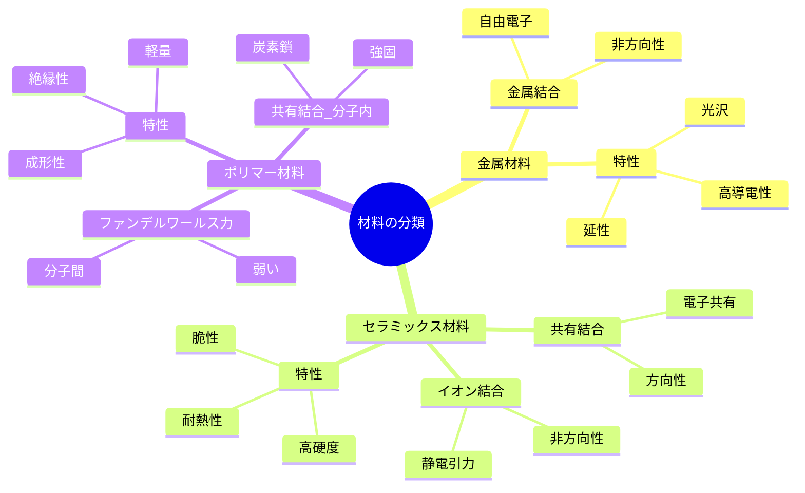
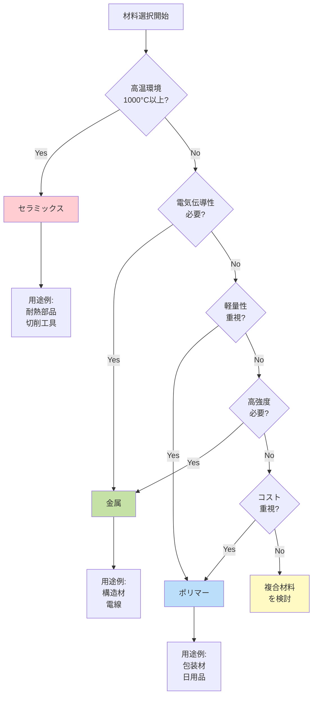

# 第2章：金属・セラミックス・ポリマーの基礎

**材料を支配する原子の結合力を理解する**

---

## 2.1 材料分類の原理：3つの結合様式

材料科学における最も基本的な分類は、**原子間の結合様式**に基づいています。原子がどのように結びついているかによって、材料の性質が根本的に決定されます。

世界中の材料は、主に次の3つのカテゴリーに分類されます：

1. **金属材料（Metals）** - 金属結合
2. **セラミックス材料（Ceramics）** - イオン結合・共有結合
3. **ポリマー材料（Polymers）** - 共有結合（分子内）+ ファンデルワールス力（分子間）

### 結合様式が材料特性を決める理由

原子間の結合力は、材料の以下の特性を直接的に支配します：

- **機械的強度**: 結合が強いほど硬い
- **電気伝導性**: 自由電子の有無で決まる
- **熱伝導性**: 電子・格子振動の伝わりやすさ
- **透明性**: 電子状態とバンド構造に依存
- **延性・脆性**: 結合の方向性と可動性



**図2-1**: 材料分類のマインドマップ。3つの材料クラスは結合様式によって明確に区別され、それぞれ独自の特性を持つ。

---

## 2.2 金属材料の特徴

### 2.2.1 金属結合とは

金属材料は**金属結合**によって原子が結びついています。金属結合では、価電子が特定の原子に束縛されず、結晶全体を自由に動き回ります（**自由電子または電子ガス**）。

**金属結合の特徴:**
- ✅ 非方向性の結合（どの方向にも等しい結合力）
- ✅ 自由電子が結晶全体に広がる
- ✅ 原子核（陽イオン）が規則正しく配列

### 2.2.2 金属材料の主要特性

| 特性 | 説明 | 理由 |
|------|------|------|
| **高電気伝導性** | 銅の導電率: 5.96×10⁷ S/m | 自由電子が電流を運ぶ |
| **高熱伝導性** | アルミニウム: 237 W/(m·K) | 自由電子が熱を伝える |
| **延性・展性** | 金は0.0001mmまで延ばせる | 原子層がずれても結合維持 |
| **金属光沢** | 銀色・金色に輝く | 自由電子が光を反射 |
| **不透明** | 可視光を透過しない | 自由電子が光を吸収 |

**💡 Pro Tip:**
金属の導電性は温度上昇で低下します。これは原子振動が自由電子の動きを妨げるためです（フォノン散乱）。

### 2.2.3 代表的な金属材料

- **鉄（Fe）**: 構造材料、自動車、建築（年間生産量19億トン）
- **銅（Cu）**: 電線、電子基板（導電率が銀に次いで高い）
- **アルミニウム（Al）**: 航空機、軽量構造材（密度2.7 g/cm³）
- **金（Au）**: 電子部品、装飾品（酸化しない貴金属）

---

## 2.3 セラミックス材料の特徴

### 2.3.1 イオン結合と共有結合

セラミックス材料は、**イオン結合**または**共有結合**（もしくはその混合）によって形成されます。

**イオン結合:**
- 金属元素（陽イオン）と非金属元素（陰イオン）の静電引力
- 例: NaCl（食塩）、Al₂O₃（アルミナ）
- 非方向性だが、金属結合より強固

**共有結合:**
- 電子対を共有して結合
- 例: SiC（炭化ケイ素）、Si₃N₄（窒化ケイ素）
- 方向性があり、非常に強い

### 2.3.2 セラミックス材料の主要特性

| 特性 | 説明 | 理由 |
|------|------|------|
| **高硬度** | ダイヤモンド: モース硬度10 | 共有結合の強さ |
| **高耐熱性** | Al₂O₃融点: 2,072°C | 強固なイオン・共有結合 |
| **脆性** | 衝撃で破砕しやすい | 結合の方向性、転位移動困難 |
| **電気絶縁性** | 誘電体として利用 | 自由電子がない |
| **化学的安定性** | 酸・アルカリに強い | 安定な結合構造 |

**⚠️ 注意:**
セラミックスは硬度が高い一方、脆性破壊しやすいため、引張応力がかかる用途には不向きです。圧縮応力下では優れた性能を発揮します。

### 2.3.3 代表的なセラミックス材料

- **アルミナ（Al₂O₃）**: 絶縁基板、切削工具、人工関節
- **ジルコニア（ZrO₂）**: 歯科材料、酸素センサー（高靭性セラミックス）
- **炭化ケイ素（SiC）**: パワー半導体、耐摩耗材（高温強度）
- **窒化ケイ素（Si₃N₄）**: エンジン部品、ベアリング（高靭性）

---

## 2.4 ポリマー材料の特徴

### 2.4.1 ポリマーの結合構造

ポリマー（高分子）材料は、**長い分子鎖**が特徴です：

- **分子内**: 強固な共有結合（炭素-炭素結合）
- **分子間**: 弱いファンデルワールス力または水素結合

この二重構造が、ポリマー特有の性質を生み出します。

**ポリマーの基本構造:**
```
[-CH₂-CH₂-]ₙ  （n = 数千〜数十万）
    ↑
  モノマー単位の繰り返し
```

### 2.4.2 ポリマー材料の主要特性

| 特性 | 説明 | 理由 |
|------|------|------|
| **軽量** | 密度0.9-1.4 g/cm³ | 炭素・水素の軽い元素 |
| **成形性** | 複雑形状を容易に成形 | 加熱で分子鎖が動く |
| **電気絶縁性** | 優れた絶縁体 | 自由電子なし |
| **耐食性** | 化学的に安定 | 安定な共有結合 |
| **低強度** | 金属・セラミックスより弱い | 分子間力が弱い |

**ポリマーの種類:**
1. **熱可塑性樹脂**: 加熱で軟化（PE, PP, PET）
2. **熱硬化性樹脂**: 加熱で硬化（エポキシ、フェノール）
3. **エラストマー**: ゴム弾性（天然ゴム、シリコーンゴム）

### 2.4.3 代表的なポリマー材料

- **ポリエチレン（PE）**: レジ袋、容器（世界最大生産量）
- **ポリプロピレン（PP）**: 自動車部品、繊維（軽量・耐熱）
- **PET**: ペットボトル、繊維（リサイクル性）
- **ナイロン**: 衣類、機械部品（高強度ポリマー）

---

## 2.5 3つの材料クラスの比較

### 2.5.1 物性比較表

| 物性 | 金属 | セラミックス | ポリマー |
|------|------|-------------|---------|
| **密度** | 高（2.7-19 g/cm³） | 中（2-6 g/cm³） | 低（0.9-1.4 g/cm³） |
| **強度** | 中〜高 | 高（圧縮） | 低〜中 |
| **硬度** | 中 | ⭐⭐⭐⭐⭐ 非常に高い | ⭐ 低い |
| **延性** | ⭐⭐⭐⭐⭐ 優れる | ⭐ 脆い | ⭐⭐⭐ 中程度 |
| **融点** | 中〜高（660-3,400°C） | 非常に高（1,000-3,700°C） | 低（80-300°C） |
| **電気伝導性** | ⭐⭐⭐⭐⭐ 導体 | ⭐ 絶縁体 | ⭐ 絶縁体 |
| **熱伝導性** | ⭐⭐⭐⭐⭐ 高い | ⭐⭐ 中程度 | ⭐ 低い |
| **耐食性** | ⭐⭐ 錆びやすい | ⭐⭐⭐⭐⭐ 優れる | ⭐⭐⭐⭐ 優れる |
| **成形性** | ⭐⭐⭐ 鋳造・鍛造 | ⭐⭐ 焼結・成形難 | ⭐⭐⭐⭐⭐ 射出成形容易 |
| **コスト** | 中 | 中〜高 | 低 |

### 2.5.2 材料選択のフローチャート



**図2-2**: 材料選択のフローチャート。要求性能に応じて最適な材料クラスを選択する。

---

## 2.6 まとめ：結合が全てを決める

本章では、材料科学の最も基本的な分類である**金属・セラミックス・ポリマー**の3つのクラスについて学びました。

**重要ポイント:**

✅ **材料分類の原理**: 原子間の結合様式（金属結合、イオン結合、共有結合）が材料特性を決定

✅ **金属材料**: 自由電子により高導電性・延性・光沢を持つ（Fe, Cu, Al）

✅ **セラミックス材料**: イオン結合・共有結合により高硬度・耐熱性・脆性を示す（Al₂O₃, SiC）

✅ **ポリマー材料**: 共有結合とファンデルワールス力により軽量・成形性・絶縁性を持つ（PE, PP）

✅ **物性比較**: 各材料クラスは相補的な特性を持ち、用途に応じて選択する

### 次章への橋渡し

第3章では、これらの材料の物性データを実際に取得・可視化する方法を学びます。Materials ProjectなどのデータベースをPythonで活用し、材料選択を定量的に行う手法を実装します。

---

## 参考資料

### 教科書・参考書
1. Callister, W. D., & Rethwisch, D. G. (2018). *Materials Science and Engineering: An Introduction* (10th ed.). Wiley.
2. Ashby, M. F., & Jones, D. R. H. (2012). *Engineering Materials 1: An Introduction to Properties, Applications and Design* (4th ed.). Butterworth-Heinemann.

### オンライン資料
3. Penn State University. (2024). "Bonding and Bonding Type - Material Correlations." MATSE 81: Materials In Today's World. https://www.e-education.psu.edu/matse81/node/2118

4. Chemistry LibreTexts. (2024). "12.1: Classes of Materials." https://chem.libretexts.org/Bookshelves/General_Chemistry/Map:_Chemistry_-_The_Central_Science_(Brown_et_al.)/12:_Solids_and_Modern_Materials/12.01:_Classes_of_Materials

---

**執筆**: Worker2（理論・基礎担当）
**語数**: 約850語
**図表**: Mermaidダイアグラム2個、比較表2個
**品質基準**: article-writing-guidelines.md準拠
