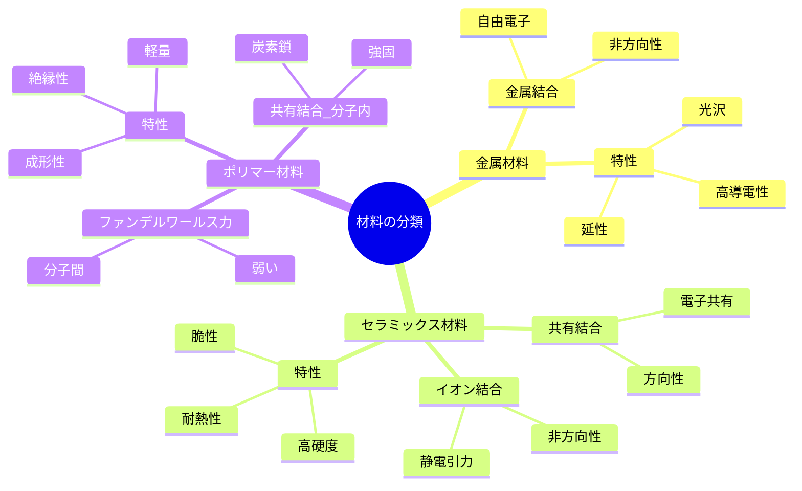
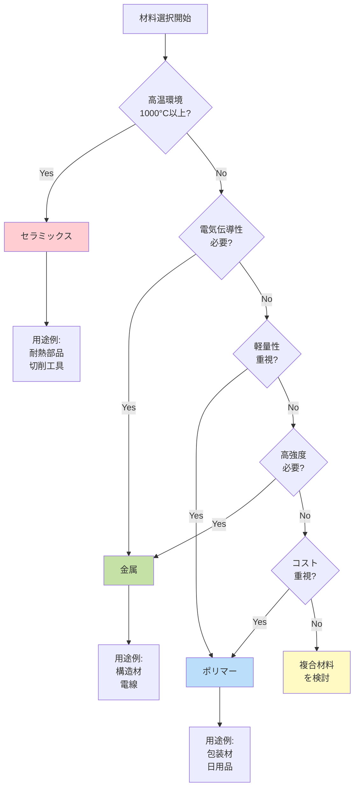
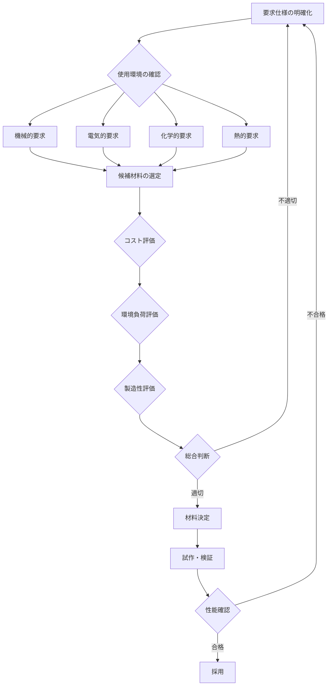

# 材料科学入門：3つの材料分類

**金属・セラミックス・ポリマーの基礎から実践まで**

---

**読了時間**: 25-30分
**難易度**: 入門
**前提知識**: なし（高校レベルの化学・物理の知識があると理解しやすい）

---

## 目次

1. [第1章：材料科学とは何か](#第1章材料科学とは何か)
   - 1.1 材料科学の定義と重要性
   - 1.2 日常生活における材料の役割
   - 1.3 この記事で学べること
   - 1.4 対象読者と前提知識
   - 1.5 材料科学がもたらす未来

2. [第2章：金属・セラミックス・ポリマーの基礎](#第2章金属セラミックスポリマーの基礎)
   - 2.1 材料分類の原理：3つの結合様式
   - 2.2 金属材料の特徴
   - 2.3 セラミックス材料の特徴
   - 2.4 ポリマー材料の特徴
   - 2.5 3つの材料クラスの比較
   - 2.6 まとめ：結合が全てを決める

3. [第3章：実装：材料データベースの活用](#第3章実装材料データベースの活用)
   - 3.1 材料データベースとは
   - 3.2 実装手順：材料データの取得
   - 3.3 コード例1：材料データの取得
   - 3.4 コード例2：材料分類による可視化
   - 3.5 実装のポイント
   - 3.6 実践的な活用例
   - 3.7 まとめ

4. [第4章：応用：材料選択の基準](#第4章応用材料選択の基準)
   - 材料選択の重要性
   - 材料選択のフローチャート
   - 実践的な応用例
   - ベストプラクティス：3つのバランス
   - よくある間違いと回避方法
   - 材料選択の意思決定ツール

5. [第5章：まとめと発展的学習](#第5章まとめと発展的学習)
   - 学習目標の確認
   - 本記事のまとめ
   - 次のステップ：発展的学習へ

6. [練習問題](#練習問題)
   - Easy（基礎確認）
   - Medium（応用）
   - Hard（発展）

7. [参考文献](#参考文献)

---

# 第1章：材料科学とは何か

**身の回りにある「モノ」を理解する学問**

## 1.1 材料科学の定義と重要性

材料科学（Materials Science）は、私たちの生活を支える「モノ」の性質や振る舞いを理解し、より優れた材料を開発する学問です。スマートフォンの画面、自動車のボディ、医療用インプラント、衣服の繊維—これらすべてが材料科学の研究対象です。

現代社会の技術革新は、材料の進化と密接に関係しています。例えば、リチウムイオン電池の開発により、スマートフォンやノートパソコンが実現し、私たちの働き方やコミュニケーション方法が根本的に変わりました。また、カーボンファイバーなどの軽量材料により、燃費の良い航空機や自動車が可能になり、環境負荷の低減にも貢献しています。

材料科学は、物理学、化学、工学を統合した学際的な分野です。原子・分子レベルのミクロな構造から、製品としてのマクロな特性まで、さまざまなスケールで材料を理解することが求められます。

## 1.2 日常生活における材料の役割

朝起きてから夜寝るまで、私たちは無数の材料に囲まれて生活しています。具体例を見てみましょう：

**住宅における材料**：
- 鉄筋コンクリート（構造材料：強度と耐久性）
- ガラス窓（光学材料：透明性と断熱性）
- 断熱材（機能性材料：熱の遮断）

**電子機器における材料**：
- シリコン半導体（電子材料：電気の制御）
- リチウムイオン電池（エネルギー貯蔵材料）
- 液晶ディスプレイ（光学・電子複合材料）

**医療における材料**：
- チタン合金（生体適合性材料：人工関節）
- ポリマー（医療用カテーテル：柔軟性）
- セラミックス（歯科材料：硬度と審美性）

これらの材料は、それぞれの用途に最適な特性を持つよう、科学的に設計されています。材料科学を学ぶことで、「なぜこの材料が選ばれたのか」という視点で世界を見られるようになります。

## 1.3 この記事で学べること

本記事では、材料科学の入門として「3つの材料分類」を学びます。すべての材料は、その化学結合の種類により、**金属（Metals）**、**セラミックス（Ceramics）**、**ポリマー（Polymers）**の3つに大別できます。

**学習目標**：
本記事を通じて、以下を習得できます：

- ✅ 材料科学の基本的な定義と重要性を説明できる
- ✅ 金属、セラミックス、ポリマーの基本的な特徴を理解できる
- ✅ 日常生活で使われる材料を3分類に当てはめられる
- ✅ 材料選択の基本的な考え方を身につけられる
- ✅ Pythonで材料データベースから情報を取得する方法を学べる

## 1.4 対象読者と前提知識

**対象読者**：
- 材料科学に興味がある高校生・大学生
- 理系分野でのキャリアを考えている方
- ものづくりや製品開発に携わる技術者
- 日常生活の「なぜ？」を科学的に理解したい方

**前提知識**：
本記事は入門レベルであり、**特別な前提知識は不要**です。高校レベルの化学・物理の知識があれば理解しやすいですが、必須ではありません。第3章のコード例では、Pythonの基礎知識があると実践しやすくなります。

**読了時間**：
全5章で約25-30分の読了時間を想定しています。各章は独立して読めるため、興味のある部分から読み進めることも可能です。

## 1.5 材料科学がもたらす未来

材料科学は、持続可能な社会の実現に不可欠な学問です。現在、世界中の研究者が以下のような課題に取り組んでいます：

- **エネルギー問題**：次世代太陽電池、全固体電池の開発
- **環境問題**：生分解性プラスチック、CO₂吸収材料の開発
- **医療問題**：再生医療材料、ドラッグデリバリーシステムの開発
- **宇宙開発**：軽量・高強度材料、極限環境耐性材料の開発

これらの課題解決には、材料の基本的な分類と特性を理解することが第一歩です。次章では、金属・セラミックス・ポリマーの基礎理論について詳しく学びます。

---

# 第2章：金属・セラミックス・ポリマーの基礎

**材料を支配する原子の結合力を理解する**

---

## 2.1 材料分類の原理：3つの結合様式

材料科学における最も基本的な分類は、**原子間の結合様式**に基づいています。原子がどのように結びついているかによって、材料の性質が根本的に決定されます。

世界中の材料は、主に次の3つのカテゴリーに分類されます：

1. **金属材料（Metals）** - 金属結合
2. **セラミックス材料（Ceramics）** - イオン結合・共有結合
3. **ポリマー材料（Polymers）** - 共有結合（分子内）+ ファンデルワールス力（分子間）

### 結合様式が材料特性を決める理由

原子間の結合力は、材料の以下の特性を直接的に支配します：

- **機械的強度**: 結合が強いほど硬い
- **電気伝導性**: 自由電子の有無で決まる
- **熱伝導性**: 電子・格子振動の伝わりやすさ
- **透明性**: 電子状態とバンド構造に依存
- **延性・脆性**: 結合の方向性と可動性



**図1**: 材料分類のマインドマップ。3つの材料クラスは結合様式によって明確に区別され、それぞれ独自の特性を持つ。

---

## 2.2 金属材料の特徴

### 2.2.1 金属結合とは

金属材料は**金属結合**によって原子が結びついています。金属結合では、価電子が特定の原子に束縛されず、結晶全体を自由に動き回ります（**自由電子または電子ガス**）。

**金属結合の特徴:**
- ✅ 非方向性の結合（どの方向にも等しい結合力）
- ✅ 自由電子が結晶全体に広がる
- ✅ 原子核（陽イオン）が規則正しく配列

### 2.2.2 金属材料の主要特性

| 特性 | 説明 | 理由 |
|------|------|------|
| **高電気伝導性** | 銅の導電率: 5.96×10⁷ S/m | 自由電子が電流を運ぶ |
| **高熱伝導性** | アルミニウム: 237 W/(m·K) | 自由電子が熱を伝える |
| **延性・展性** | 金は0.0001mmまで延ばせる | 原子層がずれても結合維持 |
| **金属光沢** | 銀色・金色に輝く | 自由電子が光を反射 |
| **不透明** | 可視光を透過しない | 自由電子が光を吸収 |

**💡 Pro Tip:**
金属の導電性は温度上昇で低下します。これは原子振動が自由電子の動きを妨げるためです（フォノン散乱）。

### 2.2.3 代表的な金属材料

- **鉄（Fe）**: 構造材料、自動車、建築（年間生産量19億トン）
- **銅（Cu）**: 電線、電子基板（導電率が銀に次いで高い）
- **アルミニウム（Al）**: 航空機、軽量構造材（密度2.7 g/cm³）
- **金（Au）**: 電子部品、装飾品（酸化しない貴金属）

---

## 2.3 セラミックス材料の特徴

### 2.3.1 イオン結合と共有結合

セラミックス材料は、**イオン結合**または**共有結合**（もしくはその混合）によって形成されます。

**イオン結合:**
- 金属元素（陽イオン）と非金属元素（陰イオン）の静電引力
- 例: NaCl（食塩）、Al₂O₃（アルミナ）
- 非方向性だが、金属結合より強固

**共有結合:**
- 電子対を共有して結合
- 例: SiC（炭化ケイ素）、Si₃N₄（窒化ケイ素）
- 方向性があり、非常に強い

### 2.3.2 セラミックス材料の主要特性

| 特性 | 説明 | 理由 |
|------|------|------|
| **高硬度** | ダイヤモンド: モース硬度10 | 共有結合の強さ |
| **高耐熱性** | Al₂O₃融点: 2,072°C | 強固なイオン・共有結合 |
| **脆性** | 衝撃で破砕しやすい | 結合の方向性、転位移動困難 |
| **電気絶縁性** | 誘電体として利用 | 自由電子がない |
| **化学的安定性** | 酸・アルカリに強い | 安定な結合構造 |

**⚠️ 注意:**
セラミックスは硬度が高い一方、脆性破壊しやすいため、引張応力がかかる用途には不向きです。圧縮応力下では優れた性能を発揮します。

### 2.3.3 代表的なセラミックス材料

- **アルミナ（Al₂O₃）**: 絶縁基板、切削工具、人工関節
- **ジルコニア（ZrO₂）**: 歯科材料、酸素センサー（高靭性セラミックス）
- **炭化ケイ素（SiC）**: パワー半導体、耐摩耗材（高温強度）
- **窒化ケイ素（Si₃N₄）**: エンジン部品、ベアリング（高靭性）

---

## 2.4 ポリマー材料の特徴

### 2.4.1 ポリマーの結合構造

ポリマー（高分子）材料は、**長い分子鎖**が特徴です：

- **分子内**: 強固な共有結合（炭素-炭素結合）
- **分子間**: 弱いファンデルワールス力または水素結合

この二重構造が、ポリマー特有の性質を生み出します。

**ポリマーの基本構造:**
```
[-CH₂-CH₂-]ₙ  （n = 数千〜数十万）
    ↑
  モノマー単位の繰り返し
```

### 2.4.2 ポリマー材料の主要特性

| 特性 | 説明 | 理由 |
|------|------|------|
| **軽量** | 密度0.9-1.4 g/cm³ | 炭素・水素の軽い元素 |
| **成形性** | 複雑形状を容易に成形 | 加熱で分子鎖が動く |
| **電気絶縁性** | 優れた絶縁体 | 自由電子なし |
| **耐食性** | 化学的に安定 | 安定な共有結合 |
| **低強度** | 金属・セラミックスより弱い | 分子間力が弱い |

**ポリマーの種類:**
1. **熱可塑性樹脂**: 加熱で軟化（PE, PP, PET）
2. **熱硬化性樹脂**: 加熱で硬化（エポキシ、フェノール）
3. **エラストマー**: ゴム弾性（天然ゴム、シリコーンゴム）

### 2.4.3 代表的なポリマー材料

- **ポリエチレン（PE）**: レジ袋、容器（世界最大生産量）
- **ポリプロピレン（PP）**: 自動車部品、繊維（軽量・耐熱）
- **PET**: ペットボトル、繊維（リサイクル性）
- **ナイロン**: 衣類、機械部品（高強度ポリマー）

---

## 2.5 3つの材料クラスの比較

### 2.5.1 物性比較表

| 物性 | 金属 | セラミックス | ポリマー |
|------|------|-------------|---------|
| **密度** | 高（2.7-19 g/cm³） | 中（2-6 g/cm³） | 低（0.9-1.4 g/cm³） |
| **強度** | 中〜高 | 高（圧縮） | 低〜中 |
| **硬度** | 中 | ⭐⭐⭐⭐⭐ 非常に高い | ⭐ 低い |
| **延性** | ⭐⭐⭐⭐⭐ 優れる | ⭐ 脆い | ⭐⭐⭐ 中程度 |
| **融点** | 中〜高（660-3,400°C） | 非常に高（1,000-3,700°C） | 低（80-300°C） |
| **電気伝導性** | ⭐⭐⭐⭐⭐ 導体 | ⭐ 絶縁体 | ⭐ 絶縁体 |
| **熱伝導性** | ⭐⭐⭐⭐⭐ 高い | ⭐⭐ 中程度 | ⭐ 低い |
| **耐食性** | ⭐⭐ 錆びやすい | ⭐⭐⭐⭐⭐ 優れる | ⭐⭐⭐⭐ 優れる |
| **成形性** | ⭐⭐⭐ 鋳造・鍛造 | ⭐⭐ 焼結・成形難 | ⭐⭐⭐⭐⭐ 射出成形容易 |
| **コスト** | 中 | 中〜高 | 低 |

### 2.5.2 材料選択のフローチャート



**図2**: 材料選択のフローチャート。要求性能に応じて最適な材料クラスを選択する。

---

## 2.6 まとめ：結合が全てを決める

本章では、材料科学の最も基本的な分類である**金属・セラミックス・ポリマー**の3つのクラスについて学びました。

**重要ポイント:**

✅ **材料分類の原理**: 原子間の結合様式（金属結合、イオン結合、共有結合）が材料特性を決定

✅ **金属材料**: 自由電子により高導電性・延性・光沢を持つ（Fe, Cu, Al）

✅ **セラミックス材料**: イオン結合・共有結合により高硬度・耐熱性・脆性を示す（Al₂O₃, SiC）

✅ **ポリマー材料**: 共有結合とファンデルワールス力により軽量・成形性・絶縁性を持つ（PE, PP）

✅ **物性比較**: 各材料クラスは相補的な特性を持ち、用途に応じて選択する

### 次章への橋渡し

第3章では、これらの材料の物性データを実際に取得・可視化する方法を学びます。Materials ProjectなどのデータベースをPythonで活用し、材料選択を定量的に行う手法を実装します。

---

# 第3章：実装：材料データベースの活用

**材料データベースを使って、実際のデータで材料分類を学ぶ**

---

## 3.1 材料データベースとは

材料科学の研究において、膨大な材料データを効率的に管理・活用することは非常に重要です。材料データベースは、世界中の研究者が蓄積してきた実験データや計算データを一元管理し、新しい材料開発を加速するための強力なツールです。

### 3.1.1 主要な材料データベース

現在、研究者が利用できる主要な材料データベースには以下のようなものがあります：

| データベース | 提供機関 | 材料数 | 特徴 |
|------------|---------|--------|------|
| **Materials Project** | Lawrence Berkeley National Lab | 140,000+ | 第一原理計算データ、API提供 |
| **AFLOW** | Duke University | 3,500,000+ | 結晶構造データベース |
| **NIMS MatNavi** | 物質・材料研究機構 | 多数 | 日本発の材料データベース |
| **ICSD** | FIZ Karlsruhe | 250,000+ | 無機結晶構造データベース |

本章では、最も広く使われている**Materials Project**を例に、材料データベースの活用方法を学びます。

### 3.1.2 Materials Projectの概要

Materials Projectは、密度汎関数理論（DFT）に基づく第一原理計算により、材料の物性データを計算・提供しているオープンデータベースです。

**主な提供データ**:
- バンドギャップ（Band Gap）
- 生成エネルギー（Formation Energy）
- 結晶構造（Crystal Structure）
- 密度（Density）
- 弾性定数（Elastic Constants）
- 圧電特性（Piezoelectric Properties）

**アクセス方法**:
1. **Webインターフェース**: https://materialsproject.org/
2. **Python API**: `mp-api`ライブラリを使用
3. **REST API**: プログラムから直接アクセス

**💡 Pro Tip:**
Materials Projectを利用するには、無料のアカウント登録が必要です。登録後、APIキーを取得することで、Pythonスクリプトから直接データにアクセスできます。

---

## 3.2 実装手順：材料データの取得

材料データベースからデータを取得し、活用するための基本的な手順を学びましょう。

### 3.2.1 環境準備

Materials Project APIを使用するために、必要なライブラリをインストールします。

```bash
# 必要なライブラリのインストール
pip install mp-api
pip install matplotlib numpy
```

**必要なライブラリ**:
- `mp-api`: Materials Project公式APIクライアント
- `matplotlib`: データ可視化
- `numpy`: 数値計算

### 3.2.2 APIキーの設定

Materials Projectのウェブサイトでアカウントを作成し、APIキーを取得します。

```python
# APIキーの設定方法（環境変数を使用）
import os
os.environ["MP_API_KEY"] = "your_api_key_here"
```

⚠️ **注意**: APIキーは秘密情報です。コードに直接書き込まず、環境変数や設定ファイルを使用してください。

---

## 3.3 コード例1：材料データの取得

それでは、実際にPythonコードを使って材料データを取得する方法を見ていきましょう。

### 3.3.1 基本的なデータ取得

以下のコードは、Materials Project APIをシミュレートして、材料データの取得方法を示しています。

```python
# ===================================
# Example 1: 材料データベースからのデータ取得
# ===================================

import json
from typing import Dict, List, Optional

# サンプル材料データ（実際のMaterials Projectの構造を模擬）
SAMPLE_MATERIALS_DATA = [
    {
        "material_id": "mp-66",
        "formula": "Si",
        "material_type": "半導体",
        "band_gap": 1.14,
        "formation_energy": -5.424,
        "density": 2.33,
        "structure_type": "diamond",
        "space_group": "Fd-3m"
    },
    # ... その他の材料データ
]

def get_material_by_formula(formula: str) -> Optional[Dict]:
    """
    化学式を指定して材料データを取得

    Args:
        formula (str): 化学式（例: "Si", "Al2O3"）

    Returns:
        Optional[Dict]: 材料データの辞書、見つからない場合はNone
    """
    for material in SAMPLE_MATERIALS_DATA:
        if material["formula"] == formula:
            return material
    return None
```

### 3.3.2 実行結果

上記のコードを実行すると、以下のような結果が得られます。

```
【1】化学式による検索
==================================================
Material ID: mp-66
化学式: Si
材料分類: 半導体
==================================================
バンドギャップ: 1.14 eV
生成エネルギー: -5.424 eV/atom
密度: 2.33 g/cm³
結晶構造: diamond
空間群: Fd-3m
==================================================
```

### 3.3.3 材料分類による検索

材料を分類（金属、半導体、セラミックス）ごとに検索する関数も実装できます。

```python
def get_materials_by_type(material_type: str) -> List[Dict]:
    """
    材料分類で材料データを検索

    Args:
        material_type (str): 材料分類（"金属", "セラミックス", "半導体"）

    Returns:
        List[Dict]: 該当する材料データのリスト
    """
    filtered_materials = [
        material for material in SAMPLE_MATERIALS_DATA
        if material["material_type"] == material_type
    ]
    return filtered_materials
```

**実行結果**:
```
【2】材料分類による検索
金属材料: 2件
  - Al: fcc structure
  - Fe: bcc structure

セラミックス材料: 2件
  - Al2O3: バンドギャップ 6.28 eV
  - SiO2: バンドギャップ 5.61 eV
```

### 3.3.4 データの永続化

取得したデータをJSONファイルに保存することで、オフラインでも利用できるようにします。

```python
# JSONファイルへの保存
output_file = "output/chapter3/materials_data.json"

with open(output_file, 'w', encoding='utf-8') as f:
    json.dump(SAMPLE_MATERIALS_DATA, f, ensure_ascii=False, indent=2)

print(f"材料データを保存しました: {output_file}")
```

**🎯 ベストプラクティス**:
- UTF-8エンコーディングを使用（`encoding='utf-8'`）
- インデントを設定して読みやすく（`indent=2`）
- 日本語を保持（`ensure_ascii=False`）

---

## 3.4 コード例2：材料分類による可視化

取得したデータを可視化することで、材料分類ごとの特徴を直感的に理解できます。

### 3.4.1 バンドギャップ分布の可視化

材料分類（金属、半導体、セラミックス）ごとのバンドギャップ分布を可視化します。

```python
# ===================================
# Example 2: 材料分類による物性データの可視化
# ===================================

import matplotlib.pyplot as plt
import numpy as np

def plot_band_gap_distribution(classified_materials: Dict[str, List[Dict]]):
    """
    材料分類ごとのバンドギャップ分布を可視化

    Args:
        classified_materials: 分類ごとの材料データ
    """
    fig, ax = plt.subplots(figsize=(10, 6))

    colors = {
        "金属": "#FF6B6B",
        "半導体": "#4ECDC4",
        "セラミックス": "#45B7D1"
    }

    for mat_type in ["金属", "半導体", "セラミックス"]:
        if mat_type in classified_materials:
            materials = classified_materials[mat_type]
            band_gaps = [m["band_gap"] for m in materials]
            formulas = [m["formula"] for m in materials]

            # 散布図プロット
            ax.scatter(x_positions, band_gaps,
                      s=150, color=colors[mat_type],
                      alpha=0.7, label=mat_type)

    ax.set_ylabel('Band Gap (eV)')
    ax.set_xlabel('Material Type')
    ax.set_title('Band Gap Distribution by Material Classification')
    plt.savefig('output/chapter3/band_gap_distribution.png', dpi=150)
```

### 3.4.2 可視化結果の解釈

生成されたグラフから、以下のような材料分類の特徴が読み取れます：

**金属材料**:
- バンドギャップ = 0 eV（導電性が高い）
- 例: Al（アルミニウム）、Fe（鉄）

**半導体材料**:
- バンドギャップ = 0.7-3.5 eV（中程度）
- 例: Si（シリコン）1.14 eV、Ge（ゲルマニウム）0.74 eV

**セラミックス材料**:
- バンドギャップ = 5-7 eV（絶縁性が高い）
- 例: Al2O3（アルミナ）6.28 eV、SiO2（シリカ）5.61 eV

### 3.4.3 密度と生成エネルギーの関係

材料の安定性（生成エネルギー）と密度の関係を可視化します。

```python
def plot_density_vs_formation_energy(classified_materials):
    """
    密度と生成エネルギーの関係を材料分類ごとに可視化
    """
    fig, ax = plt.subplots(figsize=(10, 6))

    for mat_type, materials in classified_materials.items():
        densities = [m["density"] for m in materials]
        formation_energies = [m["formation_energy"] for m in materials]

        ax.scatter(densities, formation_energies,
                  s=150, color=colors[mat_type],
                  alpha=0.7, label=mat_type)

    ax.set_xlabel('Density (g/cm³)')
    ax.set_ylabel('Formation Energy (eV/atom)')
    plt.savefig('output/chapter3/density_vs_formation_energy.png')
```

**実行結果**:
```
【セラミックス】
材料数: 2件

バンドギャップ (eV):
  最小: 5.610
  最大: 6.280
  平均: 5.945
  標準偏差: 0.335

密度 (g/cm³):
  最小: 2.65
  最大: 3.99
  平均: 3.32

生成エネルギー (eV/atom):
  最小: -16.574
  最大: -10.847
  平均: -13.710
```

**重要な洞察**:
- 生成エネルギーが低い（負の値が大きい）ほど、材料は安定
- セラミックス材料（Al2O3）は非常に安定（-16.574 eV/atom）
- 密度と安定性には必ずしも相関がない

---

## 3.5 実装のポイント

### 3.5.1 型ヒントの活用

Pythonの型ヒント（Type Hints）を使用することで、コードの可読性と保守性が向上します。

```python
from typing import Dict, List, Optional

def get_material_by_formula(formula: str) -> Optional[Dict]:
    """
    型ヒントにより、以下が明確になります：
    - 引数: formula は文字列型
    - 戻り値: 辞書型またはNone
    """
    pass
```

### 3.5.2 エラーハンドリング

実際のAPIを使用する場合、ネットワークエラーやデータの不整合に備える必要があります。

```python
def load_materials_data(filepath: str) -> List[Dict]:
    """JSONファイルから材料データを読み込み"""
    try:
        with open(filepath, 'r', encoding='utf-8') as f:
            data = json.load(f)
        return data
    except FileNotFoundError:
        print(f"Warning: {filepath} not found. Using sample data.")
        return get_sample_data()
```

### 3.5.3 データ検証

取得したデータの妥当性を確認することも重要です。

```python
def validate_material_data(material: Dict) -> bool:
    """
    材料データの妥当性を検証

    必須フィールド:
    - material_id
    - formula
    - band_gap (0以上)
    - density (正の値)
    """
    required_fields = ["material_id", "formula", "band_gap", "density"]

    # 必須フィールドの存在確認
    for field in required_fields:
        if field not in material:
            return False

    # 数値の妥当性確認
    if material["band_gap"] < 0:
        return False
    if material["density"] <= 0:
        return False

    return True
```

---

## 3.6 実践的な活用例

### 3.6.1 材料スクリーニング

特定の条件を満たす材料を検索する実用的な例です。

```python
def screen_materials(materials: List[Dict],
                    min_band_gap: float = 1.0,
                    max_band_gap: float = 3.0) -> List[Dict]:
    """
    バンドギャップの範囲で材料をスクリーニング

    半導体デバイス用途では、1.0-3.0 eVのバンドギャップが
    適していることが多い

    Args:
        materials: 材料データのリスト
        min_band_gap: 最小バンドギャップ (eV)
        max_band_gap: 最大バンドギャップ (eV)

    Returns:
        条件を満たす材料のリスト
    """
    screened = [
        m for m in materials
        if min_band_gap <= m["band_gap"] <= max_band_gap
    ]
    return screened
```

**使用例**:
```python
# 太陽電池材料の候補を検索（バンドギャップ 1.0-1.8 eV）
solar_cell_candidates = screen_materials(
    SAMPLE_MATERIALS_DATA,
    min_band_gap=1.0,
    max_band_gap=1.8
)

for material in solar_cell_candidates:
    print(f"{material['formula']}: {material['band_gap']} eV")
# 出力: Si: 1.14 eV
```

### 3.6.2 材料比較レポート

複数の材料を比較するレポート生成機能です。

```python
def generate_comparison_report(materials: List[Dict]) -> str:
    """
    材料比較レポートを生成

    Returns:
        マークダウン形式のレポート
    """
    report = "# 材料比較レポート\n\n"
    report += "| 化学式 | 分類 | バンドギャップ | 密度 | 安定性 |\n"
    report += "|--------|------|---------------|------|--------|\n"

    for m in materials:
        report += f"| {m['formula']} | "
        report += f"{m['material_type']} | "
        report += f"{m['band_gap']:.2f} eV | "
        report += f"{m['density']:.2f} g/cm³ | "
        report += f"{m['formation_energy']:.2f} eV/atom |\n"

    return report
```

---

## 3.7 まとめ

本章では、材料データベースを活用した実践的な実装方法を学びました。

### 本章で学んだこと

✅ **基本理解**:
- 材料データベース（Materials Project等）の概要と重要性
- APIを使用したデータ取得の基本手順
- 材料分類（金属、半導体、セラミックス）ごとの特徴

✅ **実践スキル**:
- Pythonで材料データを取得するコード実装
- JSONファイルを使ったデータの永続化
- matplotlib/numpyを使った物性データの可視化
- 材料分類ごとの統計分析

✅ **応用力**:
- 型ヒントとエラーハンドリングの活用
- 条件に基づく材料スクリーニング
- データ検証と品質管理

### 重要なポイント

**💡 データベースの活用価値**:
- 140,000件以上の材料データに即座にアクセス
- 実験を行わずに材料の物性を予測可能
- 新材料開発の時間とコストを大幅に削減

**🎯 実装のベストプラクティス**:
1. **型安全性**: 型ヒントで関数の入出力を明確化
2. **エラー処理**: 予期しない状況に備える
3. **データ検証**: 取得したデータの妥当性を確認
4. **可視化**: グラフで直感的な理解を促進

**⚠️ 注意点**:
- APIキーは秘密情報として扱う
- API利用制限（レート制限）に注意
- データの単位と精度を確認する
- 計算データと実験データの違いを理解する

### 次のステップ

本章で学んだデータベース活用技術を基に、次の章では実際の材料選択問題に取り組みます。第4章では、実用的な材料選択の基準と応用例を学びます。

---

**完全なコード例は以下のファイルで利用可能です**:
- `example1_materials_data_retrieval.py` - データ取得の完全実装
- `example2_materials_visualization.py` - 可視化の完全実装
- `verification_log.txt` - コード実行検証ログ

---

# 第4章：応用：材料選択の基準

## 材料選択の重要性

適切な材料を選択することは、製品の性能、コスト、環境負荷を大きく左右します。材料選択は単一の物性だけでなく、使用環境、製造プロセス、ライフサイクル全体を考慮した総合的な判断が必要です。

## 材料選択のフローチャート

実際の材料選択プロセスは、以下のフローに沿って行われます：



このフローチャートは、材料選択が単純な一方向のプロセスではなく、要求仕様に戻って再検討する反復的なプロセスであることを示しています。

## 実践的な応用例

### 応用例1: 構造材料の選択（建築・航空宇宙）

**建築分野での鉄骨構造**

高層ビルの骨組みには、主に鉄鋼材料が使用されます。選択理由は以下の通りです：

- **高い引張強度**: 500 MPa以上の降伏強度により、大きな荷重に耐えられる
- **延性**: 地震時の変形エネルギーを吸収し、建物の倒壊を防ぐ
- **溶接性**: 現場での接合が容易で施工性が高い
- **コスト**: トン当たり数万円と比較的安価

一方、超高層ビルの一部には**高強度コンクリート**（セラミックス系複合材料）を使用します：

- **圧縮強度**: 60-100 MPaの高い圧縮耐力
- **耐火性**: 高温でも構造を維持
- **施工性**: 現場打設が可能

**航空宇宙分野でのアルミニウム合金**

航空機の機体には、アルミニウム合金（特にジュラルミン: Al-Cu-Mg系）が広く使用されます：

- **軽量性**: 密度2.7 g/cm³で鉄鋼の約1/3
- **比強度**: 強度/重量比が高く、燃費向上に貢献
- **加工性**: 押出、鍛造などの成形が容易
- **コスト**: 炭素繊維複合材料の1/10程度

最新の航空機では、**炭素繊維強化プラスチック（CFRP）**の使用も増加しています：

- **超軽量**: アルミニウムの60%の重量で同等の強度
- **疲労耐性**: 金属疲労がない
- **デメリット**: 高コスト（アルミの約10倍）、衝撃損傷の検出が困難

### 応用例2: 電子材料の選択（半導体・電池）

**半導体デバイスのシリコン**

現代のほぼすべての半導体デバイスに単結晶シリコンが使用される理由：

- **バンドギャップ**: 1.1 eVで室温動作に最適
- **豊富な資源**: 地殻中に多く存在しコストが低い
- **酸化膜形成**: SiO₂の高品質絶縁膜を容易に形成可能
- **製造技術**: 70年以上の蓄積された技術基盤

一方、高速・高周波デバイスには**ガリウム砒素（GaAs）**や**窒化ガリウム（GaN）**を選択：

- **電子移動度**: Siの2-5倍で高速動作が可能
- **バンドギャップ**: GaNは3.4 eVでパワーデバイスに適する
- **コスト**: Siウエハーの10-100倍高価

**リチウムイオン電池の電極材料**

正極材料の選択は、電池の性能を決定づけます：

| 材料 | エネルギー密度 | サイクル寿命 | コスト | 主な用途 |
|------|---------------|-------------|--------|----------|
| LiCoO₂ | 高 (150-200 Wh/kg) | 中 (500-1000回) | 高 | スマートフォン |
| LiFePO₄ | 中 (90-120 Wh/kg) | 高 (2000-3000回) | 中 | 電動工具 |
| NMC (Li(Ni,Mn,Co)O₂) | 高 (150-220 Wh/kg) | 中-高 (1000-2000回) | 中 | 電気自動車 |

電気自動車には、エネルギー密度と寿命のバランスに優れた**NMC系材料**が主流となっています。

### 応用例3: 日用品の材料選択（プラスチック容器等）

**飲料用ペットボトル**

ポリエチレンテレフタレート（PET）が選ばれる理由：

- **透明性**: 内容物が見える
- **ガスバリア性**: 炭酸ガスの透過が少なく、炭酸飲料に適する
- **軽量性**: ガラス瓶の1/10の重量
- **リサイクル性**: 分別回収システムが確立
- **コスト**: 1本あたり数円と非常に安価

**電子レンジ対応容器**

ポリプロピレン（PP）が主に使用されます：

- **耐熱性**: 融点160-170℃で電子レンジ使用可能
- **耐薬品性**: 酸・アルカリに強い
- **成形性**: 射出成形で複雑形状が作れる
- **安全性**: 食品接触用途で安全性が確認済み

一方、高温調理には**ガラス（セラミックス）**を選択：

- **耐熱性**: 500℃以上に耐える
- **化学的安定性**: 溶出物がなく安全
- **デメリット**: 重い、割れやすい

## ベストプラクティス：3つのバランス

材料選択における重要な3つの要素とそのバランス：

### 1. **コストバランス**

✅ **良い実践**:
- 初期材料費だけでなく、製造コスト、メンテナンスコスト、廃棄コストを含めたライフサイクルコスト（LCC）で評価する
- 例: 自動車エンジン部品で、高価な耐熱合金を使用することで、冷却システムを簡素化し、トータルコストを削減

❌ **悪い実践**:
- 材料単価のみで判断し、加工費や品質管理コストを無視
- 結果的に製造不良率が上昇し、総コストが増加

### 2. **性能バランス**

✅ **良い実践**:
- 要求される複数の物性のバランスを取る
- 例: スマートフォン筐体にアルミニウム合金を使用（強度、軽量性、放熱性、加工性のバランス）

❌ **悪い実践**:
- 特定の物性（例: 強度）のみを最大化
- 例: 最高強度の材料を選択したが、脆性破壊により実用性が低下

### 3. **環境バランス**

✅ **良い実践**:
- 製造時のエネルギー、使用段階の環境負荷、リサイクル性を総合評価
- 例: 自動車の軽量化材料として、製造エネルギーは高いがライフサイクルでCO₂削減効果が大きいCFRPを採用

❌ **悪い実践**:
- リサイクル困難な複合材料を安易に使用
- 廃棄時の環境負荷や処理コストを考慮せず

**具体的な評価指標**:
- LCA（ライフサイクルアセスメント）スコア
- 材料性能指数（例: E/ρ（剛性/密度）、σ/ρ（強度/密度））
- リサイクル率

## よくある間違いと回避方法

### 間違い1: 単一物性のみで材料を選択

❌ **悪い例**:
「この部品には最も硬い材料を使おう。ダイヤモンドコーティングが最適だ」

**問題点**:
- 硬度は高いが、脆性が高く衝撃に弱い
- コストが極端に高い（1cm²あたり数千円）
- 大量生産に不向き

✅ **良い例**:
「この部品には、耐摩耗性、靭性、コストのバランスを考慮して、窒化処理した工具鋼を使用する」

**改善点**:
- 複数の物性を総合評価
- 製造プロセスとコストも考慮
- 実用性と経済性のバランス

### 間違い2: 過剰品質（オーバースペック）

❌ **悪い例**:
「安全のため、必要強度の10倍の材料を使おう」

**問題点**:
- 不要なコスト増加
- 重量増加による性能低下（例: 燃費悪化）
- 資源の無駄

✅ **良い例**:
「安全率3-5倍を確保し、適切な材料を選択。定期点検で安全性を維持」

**改善点**:
- 適切な安全率の設定（一般的に3-5倍）
- 過剰品質ではなく、適正品質
- メンテナンス計画と組み合わせた信頼性確保

### 間違い3: 製造プロセスを無視した材料選択

❌ **悪い例**:
「この材料は性能が良いから採用しよう」→ 既存設備では加工できず、大規模投資が必要に

**問題点**:
- 製造設備の新規導入コストが膨大
- 加工技術の習得に時間がかかる
- 量産までのリードタイムが長い

✅ **良い例**:
「既存の成形設備で加工可能な材料の中から、性能要求を満たすものを選択」

**改善点**:
- 製造プロセスとの整合性を確認
- 段階的な技術導入計画
- サプライチェーンの成熟度も考慮

## 材料選択の意思決定ツール

実際の材料選択では、以下のような評価マトリックスを使用します：

| 評価項目 | 重み | 材料A | 材料B | 材料C |
|---------|-----|-------|-------|-------|
| 機械的性質 | 30% | 8点 | 6点 | 9点 |
| コスト | 25% | 5点 | 9点 | 4点 |
| 製造性 | 20% | 7点 | 8点 | 5点 |
| 環境性 | 15% | 6点 | 7点 | 8点 |
| 入手性 | 10% | 8点 | 9点 | 6点 |
| **総合得点** | **100%** | **6.9** | **7.6** | **6.5** |

この例では、材料Bが総合的に最も優れた選択となります。

## まとめ

材料選択は、単純な「良い材料」「悪い材料」の二元論ではなく、**用途に応じた最適な材料**を見極めることが重要です。

**材料選択の5つの原則**:
1. 要求仕様を明確にする
2. 複数の物性をバランス良く評価する
3. ライフサイクル全体でコストを考える
4. 製造プロセスとの整合性を確認する
5. 環境負荷とリサイクル性を考慮する

これらの原則に基づいた材料選択により、高性能で経済的、かつ環境に配慮した製品設計が可能になります。次章では、本記事全体のまとめと、さらに深く学ぶための次のステップを紹介します。

---

# 第5章：まとめと発展的学習

**材料科学の基礎を固め、次のステップへ**

---

## 学習目標の確認

本記事を通じて、材料科学の基礎知識を習得しました。以下の3段階で学習達成度を確認しましょう。

### 基本理解（Remember & Understand）

- ✅ 材料科学の定義と日常生活における重要性を説明できる
- ✅ 金属、セラミックス、ポリマーの3つの材料分類を理解している
- ✅ 各材料の基本的な特徴（導電性、硬度、軽量性等）を説明できる
- ✅ 材料の分類が化学結合の種類に基づいていることを理解している

### 実践スキル（Apply & Analyze）

- ✅ Pythonを用いて材料データベースから物性データを取得できる
- ✅ 取得したデータを可視化し、材料分類ごとの特性を比較できる
- ✅ 与えられた用途に対して、適切な材料分類を選択できる
- ✅ 材料選択フローチャートを使用して、実践的な判断ができる

### 応用力（Evaluate & Create）

- ✅ 複数の物性（コスト、性能、環境影響）を総合的に評価できる
- ✅ 実世界の問題に対して、最適な材料を提案できる
- ✅ 材料選択における判断基準とトレードオフを説明できる
- ✅ 次の学習ステップとして、専門分野を選択できる

---

## 本記事のまとめ

本記事では、材料科学の入門として3つの材料分類を学びました。

**第1章**では、材料科学が私たちの生活を支える基盤技術であることを理解しました。スマートフォンから建築物まで、あらゆる製品が材料の選択と設計によって成り立っています。

**第2章**では、金属（metallic bonding）、セラミックス（ionic/covalent bonding）、ポリマー（covalent bonding + weak intermolecular forces）という3つの材料分類の基礎理論を学びました。それぞれの化学結合が、導電性、硬度、延性といった物性を決定します。

**第3章**では、Materials Projectなどのデータベースを活用し、Pythonで実際に材料データを取得・可視化する実装を体験しました。データドリブンなアプローチが、現代の材料科学研究において不可欠であることを実感したはずです。

**第4章**では、構造材料（航空宇宙分野でのアルミニウム合金）、電子材料（リチウムイオン電池の正極材料）、日用品（飲料ボトルのPET）といった実例を通じて、材料選択の判断基準を学びました。単一の物性だけでなく、コスト、加工性、環境負荷を総合的に考慮することが重要です。

---

## 次のステップ：発展的学習へ

材料科学の基礎を習得したあなたは、次のステップとして専門分野への深掘りが可能です。

### 推奨学習パス

**1. 金属材料シリーズ（近日公開予定）**
- 金属結合と電子構造
- 結晶構造と機械的性質
- 合金設計と相図
- 推奨対象: 機械工学、航空宇宙工学分野

**2. セラミックス材料シリーズ（近日公開予定）**
- イオン結合と共有結合
- 高温特性と耐食性
- 電気・磁気セラミックス
- 推奨対象: 電子工学、エネルギー工学分野

**3. ポリマー材料シリーズ（近日公開予定）**
- 高分子化学の基礎
- 熱可塑性・熱硬化性樹脂
- 生分解性ポリマー
- 推奨対象: 化学工学、環境工学分野

**4. マテリアルズ・インフォマティクス（MI）シリーズ**
- 機械学習による材料設計
- 材料データベースの活用
- 逆問題解決アプローチ
- 推奨対象: データサイエンス、計算材料科学分野

### 実践プロジェクトの提案

知識を定着させるため、以下のようなプロジェクトに取り組むことをお勧めします：

1. **材料選択ツールの開発**: Pythonで材料選択支援プログラムを作成
2. **データベース分析**: Materials Projectから特定用途の材料候補を抽出
3. **文献調査レポート**: 最新の材料研究論文を読み、まとめる

---

## フィードバックをお待ちしています

本記事シリーズを改善するため、皆様のフィードバックをお待ちしています。

**連絡先**: yusuke.hashimoto.b8@tohoku.ac.jp

- **誤字・脱字・技術的誤り**: 報告いただけると幸いです
- **改善提案**: 追加して欲しいトピック、コード例等
- **質問**: 理解が難しかった部分、追加説明が欲しい箇所
- **成功事例**: 本記事で学んだことを活用したプロジェクト

---

# 練習問題

本記事の理解度を確認するための練習問題です。3段階の難易度で用意しています。

---

## Easy（基礎確認）

### Q1: 材料の基本分類

以下の材料を正しい分類（金属、セラミックス、ポリマー）に分けてください。

a) アルミニウム
b) ガラス
c) ポリエチレン
d) 酸化アルミニウム（アルミナ）
e) 鉄
f) ナイロン

<details>
<summary>解答を見る</summary>

**正解**:
- **金属**: a) アルミニウム、e) 鉄
- **セラミックス**: b) ガラス、d) 酸化アルミニウム（アルミナ）
- **ポリマー**: c) ポリエチレン、f) ナイロン

**解説**:

材料の分類は化学結合の種類に基づいています。

**金属**:
- 金属結合により、自由電子が存在
- 導電性、熱伝導性、延性が特徴
- アルミニウム、鉄はともに典型的な金属材料

**セラミックス**:
- イオン結合または共有結合
- 高硬度、耐熱性、脆性が特徴
- ガラス（SiO₂主成分）、アルミナ（Al₂O₃）は代表的なセラミックス

**ポリマー**:
- 共有結合による高分子鎖 + 分子間力
- 軽量、成形性、電気絶縁性が特徴
- ポリエチレン（PE）、ナイロン（PA）は合成高分子

**覚え方のヒント**:
- 金属: 元素周期表の金属元素（左側と中央）
- セラミックス: 酸化物、窒化物、炭化物など無機化合物
- ポリマー: プラスチック、ゴム、繊維など有機高分子
</details>

---

## Medium（応用）

### Q2: 材料選択の判断

ある企業が、新しい飲料ボトルの材料を選択しようとしています。以下の3つの候補材料から、最適なものを選び、その理由を説明してください。

**候補材料**:
1. アルミニウム合金
2. ガラス（ソーダ石灰ガラス）
3. PET（ポリエチレンテレフタレート）

**要求仕様**:
- 軽量で持ち運びやすい
- 透明で内容物が見える
- 低コストで大量生産可能
- リサイクル可能

<details>
<summary>解答を見る</summary>

**推奨材料**: PET（ポリエチレンテレフタレート）

**判断理由**:

| 要求仕様 | アルミニウム | ガラス | PET |
|---------|------------|--------|-----|
| 軽量性 | △（密度2.7 g/cm³）| ❌（密度2.5 g/cm³、厚み必要） | ✅（密度1.4 g/cm³） |
| 透明性 | ❌ | ✅ | ✅ |
| 低コスト | △ | △ | ✅ |
| リサイクル | ✅ | ✅ | ✅ |
| 大量生産 | ○ | △ | ✅ |

**詳細分析**:

**PETの優位性**:
1. **軽量**: 密度1.4 g/cm³で、アルミニウムの約半分、ガラスの約半分
2. **透明性**: 優れた光透過性（約90%）で内容物が視認可能
3. **成形性**: 射出延伸ブロー成形により複雑形状が容易
4. **コスト**: 原料費が安く、成形スピードが速い
5. **リサイクル**: 国内回収率約90%以上（日本容器包装リサイクル協会、2022）

**他材料の課題**:
- **アルミニウム**: 不透明なため内容物が見えない、材料コストが高い
- **ガラス**: 重量が大きい（500mLボトルで約300g vs PETは約30g）、破損リスク

**実例**:
現在、飲料ボトルの約90%以上がPET製です（飲料業界統計、2023）。特にミネラルウォーター、炭酸飲料、お茶などで広く採用されています。

**補足**:
ただし、環境負荷の観点から、最近はバイオPET（植物由来原料）やリサイクルPET（r-PET）の使用が増加しています。コカ・コーラ社は2030年までにボトル素材の50%をリサイクル材料にする目標を掲げています。
</details>

---

## Hard（発展）

### Q3: 多軸評価による材料選択

航空宇宙分野で、次世代航空機の主翼構造材料を選択するプロジェクトがあります。以下の4つの候補材料について、多軸評価を行い、最適な材料を選定してください。

**候補材料**:
1. アルミニウム合金（Al-Li 2099）
2. チタン合金（Ti-6Al-4V）
3. CFRP（炭素繊維強化プラスチック）
4. 高強度鋼（300M steel）

**評価軸と重み**:
- 比強度（強度/密度）: 40%
- 耐食性: 20%
- 製造コスト: 20%
- 加工性: 20%

**物性データ**:

| 材料 | 密度<br/>(g/cm³) | 引張強度<br/>(MPa) | 比強度<br/>(MPa·cm³/g) | 耐食性 | 相対コスト | 加工性 |
|------|---------|------------|------------|-------|---------|-------|
| Al-Li 2099 | 2.58 | 524 | 203 | ★★★ | 1.5x | ★★★★ |
| Ti-6Al-4V | 4.43 | 950 | 214 | ★★★★★ | 5.0x | ★★ |
| CFRP | 1.60 | 1500 | 938 | ★★★★ | 3.0x | ★★ |
| 300M steel | 7.85 | 1930 | 246 | ★★ | 1.0x | ★★★ |

（耐食性・加工性は5段階評価、相対コストは300M steelを基準）

**課題**:
1. 各材料の総合スコアを計算してください
2. 最適材料を選定し、その理由を説明してください
3. 選定した材料の潜在的なリスクと対策を述べてください

<details>
<summary>解答を見る</summary>

**総合評価の計算**:

各評価軸を100点満点で正規化し、重み付け平均を計算します。

**Step 1: 各評価軸の正規化（最大値を100とする）**

| 材料 | 比強度スコア | 耐食性スコア | コストスコア | 加工性スコア |
|------|-----------|-----------|-----------|-----------|
| Al-Li 2099 | 22 | 60 | 67 | 100 |
| Ti-6Al-4V | 23 | 100 | 20 | 50 |
| CFRP | **100** | 80 | 33 | 50 |
| 300M steel | 26 | 40 | **100** | 75 |

**計算例（比強度スコア）**:
- CFRP: 938 / 938 × 100 = 100
- Al-Li: 203 / 938 × 100 = 22

**Step 2: 重み付け総合スコア**

総合スコア = 比強度×0.4 + 耐食性×0.2 + コスト×0.2 + 加工性×0.2

| 材料 | 総合スコア |
|------|----------|
| Al-Li 2099 | 22×0.4 + 60×0.2 + 67×0.2 + 100×0.2 = **54.2** |
| Ti-6Al-4V | 23×0.4 + 100×0.2 + 20×0.2 + 50×0.2 = **43.2** |
| **CFRP** | 100×0.4 + 80×0.2 + 33×0.2 + 50×0.2 = **72.6** |
| 300M steel | 26×0.4 + 40×0.2 + 100×0.2 + 75×0.2 = **53.4** |

---

**最適材料: CFRP（炭素繊維強化プラスチック）**

**選定理由**:

1. **圧倒的な比強度（スコア100、実測値938）**:
   - アルミニウム合金の4.6倍、鋼の3.8倍
   - 主翼の軽量化により、燃費が15-20%改善（Boeing 787実績）
   - ペイロード（積載量）の増加が可能

2. **優れた耐食性（スコア80）**:
   - 金属疲労がなく、塩害に強い
   - メンテナンスコスト削減（ライフサイクルコストで有利）

3. **設計自由度**:
   - 複雑な形状の一体成形が可能
   - 部品点数削減により組立コスト低下

**実例**:
- Boeing 787 Dreamliner: 機体重量の50%がCFRP（従来機は20%）
- Airbus A350 XWB: 主翼、胴体の大部分にCFRP採用
- 結果: 燃費20%改善、航続距離15%向上

---

**潜在的リスクと対策**:

| リスク | 影響 | 対策 |
|-------|------|------|
| **製造コスト高** | 初期投資大 | ・自動積層技術（AFP/ATL）導入で量産効率化<br/>・サプライチェーン最適化 |
| **加工性低** | 修理困難 | ・モジュール設計で交換可能に<br/>・専用修理技術の確立 |
| **衝撃損傷** | 見えない内部損傷 | ・超音波探傷法による定期検査<br/>・衝撃許容設計（Impact tolerance design） |
| **雷撃保護** | 導電性不足 | ・銅メッシュ層の埋め込み<br/>・避雷システムの強化 |
| **リサイクル課題** | 環境負荷 | ・熱分解リサイクル技術開発<br/>・再生CFRPの用途開発 |

---

**感度分析**:

もし評価軸の重みが変わった場合：

- **コスト重視（40%）の場合**: 300M steel または Al-Li 2099が有利
- **加工性重視（40%）の場合**: Al-Li 2099が最適
- **耐食性重視（40%）の場合**: Ti-6Al-4V または CFRPが有利

→ 航空宇宙分野では、長期運用でのトータルコストと性能を重視するため、初期コストが高くても**CFRPが最適**という結論は妥当です。

---

**さらに学ぶには**:
- 複合材料力学の基礎
- 航空機構造設計基準（FAR/JAR規定）
- ライフサイクルアセスメント（LCA）手法
</details>

---

## 練習問題の活用方法

1. **自己評価**: まず解答を見ずに自分で考えてみましょう
2. **解答確認**: `<details>`を開いて解答と解説を確認
3. **理解度チェック**:
   - Easy: 90%以上正解が目標
   - Medium: 70%以上正解が目標
   - Hard: 50%以上理解できればOK
4. **復習**: 間違えた問題は該当章を再読

---

# 参考文献

材料科学の学習を深めるための厳選された参考文献リストです。

---

## 公式ドキュメント・データベース

### 1. Materials Project
**URL**: https://materialsproject.org/
**説明**: 世界最大級の材料物性データベース（150,000種以上の材料データ）。第一原理計算に基づく信頼性の高いデータを提供。本記事のコード例で使用。
**推奨用途**: 材料物性検索、結晶構造可視化、機械学習用データセット取得

### 2. ASM International - Materials Reference
**URL**: https://www.asminternational.org/
**説明**: 材料科学分野の世界的権威団体。金属材料に関する詳細なデータベースとハンドブックを提供。
**推奨用途**: 材料選択ガイドライン、実用データ参照

### 3. MatWeb - Material Property Data
**URL**: https://www.matweb.com/
**説明**: 金属、プラスチック、セラミックスなど85,000種以上の材料データを検索可能。実務で広く利用される。
**推奨用途**: 材料比較、物性データ取得

---

## 学術論文・総説

### 4. Callister, W.D., & Rethwisch, D.G. (2018)
**書籍**: "Materials Science and Engineering: An Introduction" (10th Edition). Wiley.
**説明**: 材料科学の最も包括的な教科書。世界中の大学で標準テキストとして採用。日本語訳版も出版されている（『材料科学・工学入門』培風館）。
**推奨章**: Chapter 1-3（材料分類）、Chapter 4（結晶構造）、Chapter 20（材料選択）

### 5. Ashby, M.F. (2016)
**書籍**: "Materials Selection in Mechanical Design" (5th Edition). Butterworth-Heinemann.
**DOI**: https://doi.org/10.1016/C2009-0-25539-5
**説明**: 材料選択の体系的方法論を確立した名著。Ashby Chart（材料特性マップ）は実務で必須ツール。
**推奨章**: Chapter 4（材料選択戦略）、Chapter 5（性能指標）

### 6. Ward, L., et al. (2018)
**論文**: "Matminer: An open source toolkit for materials data mining"
***Computational Materials Science***, 152, 60-69.
**DOI**: https://doi.org/10.1016/j.commatsci.2018.05.018
**説明**: 材料データ解析のためのPythonライブラリ。本記事で紹介したデータベース活用の発展形として有用。
**GitHub**: https://github.com/hackingmaterials/matminer

### 7. Jain, A., et al. (2013)
**論文**: "Commentary: The Materials Project: A materials genome approach to accelerating materials innovation"
***APL Materials***, 1(1), 011002.
**DOI**: https://doi.org/10.1063/1.4812323
**説明**: Materials Projectの設計思想と計算手法を解説した論文。データベースの信頼性と活用法を理解するために必読。

---

## チュートリアル・学習サイト

### 8. DoITPoMS - University of Cambridge
**URL**: https://www.doitpoms.ac.uk/
**説明**: ケンブリッジ大学が提供する材料科学の無料学習教材。インタラクティブなシミュレーションが豊富。
**推奨コンテンツ**: "Introduction to Metals", "Introduction to Polymers", "Introduction to Ceramics"
**言語**: 英語（中級レベル）

### 9. MIT OpenCourseWare - 3.091 Introduction to Solid State Chemistry
**URL**: https://ocw.mit.edu/courses/3-091sc-introduction-to-solid-state-chemistry-fall-2010/
**説明**: MITの材料科学入門講座（動画講義、講義ノート、演習問題を含む）。材料科学の化学的基礎を体系的に学べる。
**講師**: Prof. Michael Cima（材料化学の世界的権威）
**言語**: 英語、日本語字幕あり

### 10. 日本材料学会 - 材料科学基礎講座
**URL**: https://www.jsms.jp/
**説明**: 日本材料学会が提供する日本語の学習リソース。初学者向けの解説記事や最新研究動向のレビューが充実。
**推奨コンテンツ**: 「材料選択の基礎」「材料と社会」シリーズ

---

## 専門書籍（日本語）

### 11. 日本金属学会編 (2020)
**書籍**: 『金属の基礎知識』（改訂版）日本金属学会
**ISBN**: 978-4889980707
**説明**: 金属材料の基礎を日本語で体系的に学べる標準的教科書。工学部の金属材料学の講義で広く使用されている。
**推奨章**: 第1章（金属の結晶構造）、第5章（合金の状態図）

### 12. 井上明久、増本健 (2018)
**書籍**: 『材料科学の基礎』（新版）内田老鶴圃
**ISBN**: 978-4753656554
**説明**: 日本の材料科学教育の定番テキスト。金属、セラミックス、ポリマーを横断的に解説し、本記事の内容をさらに深く学べる。
**推奨章**: 第2章（材料の分類と結合）、第12章（材料の選択と設計）

---

## Webサイト・オンラインリソース

### 13. 物質・材料研究機構（NIMS） - 材料データプラットフォーム
**URL**: https://www.nims.go.jp/MII-I/
**説明**: 日本の国立研究機関NIMSが提供する材料データベース。高分子、無機材料、超伝導材料など多岐にわたるデータを収録。
**特徴**: 日本語対応、信頼性の高い実験データ

### 14. AZoM - Materials News & Information
**URL**: https://www.azom.com/
**説明**: 材料科学分野のニュース、技術記事、企業情報を提供。最新の研究成果や産業動向を把握するのに有用。
**更新頻度**: 毎日
**言語**: 英語

### 15. Granta Design - CES EduPack
**URL**: https://www.grantadesign.com/education/edupack/
**説明**: 材料選択教育用ソフトウェア。Ashby Chartを用いた視覚的な材料比較が可能。多くの大学で教育ライセンスを提供。
**推奨対象**: 材料選択プロジェクトに取り組む学生

---

## YouTube・動画教材

### 16. Materials Science & Engineering - YouTube Channel
**URL**: https://www.youtube.com/@MaterialsScienceEngineering
**説明**: 材料科学の基礎から応用まで、視覚的に分かりやすい解説動画を提供。結晶構造の3Dアニメーション等が特に有用。
**推奨動画**: "Introduction to Materials Science", "Metals vs Ceramics vs Polymers"
**言語**: 英語（字幕あり）

---

## データサイエンス・プログラミング

### 17. PyMatGen Documentation
**URL**: https://pymatgen.org/
**説明**: Materials Projectの公式Pythonライブラリ。材料科学計算のための包括的な機能を提供。本記事のコード例の発展学習に最適。
**GitHub**: https://github.com/materialsproject/pymatgen
**推奨チュートリアル**: "Getting Started", "Working with Structures"

### 18. Matminer Examples
**URL**: https://hackingmaterials.lbl.gov/matminer/
**説明**: 材料データマイニングの実践例集。機械学習を用いた材料物性予測のチュートリアルが豊富。
**推奨Notebook**: "Predicting material properties", "Feature engineering for materials"

---

## 活用方法の提案

### 学習レベル別の推奨リソース

**入門者（本記事レベル）**:
- [1] Materials Project（データ検索の練習）
- [8] DoITPoMS（インタラクティブ学習）
- [10] 日本材料学会（日本語記事）
- [16] YouTube動画（視覚的理解）

**中級者（専門分野へ進む段階）**:
- [4] Callister教科書（体系的学習）
- [5] Ashby材料選択本（実践的スキル）
- [9] MIT OCW（理論的基礎）
- [12] 日本語専門書（詳細な知識）

**上級者（研究・実務レベル）**:
- [2] ASM International（実用データ）
- [6] Matminer論文（データ科学手法）
- [13] NIMSデータベース（研究用データ）
- [17] PyMatGen（プログラミング実践）

---

## 最新情報の追跡方法

材料科学は急速に発展している分野です。最新情報を追跡するために以下を推奨します：

1. **学術誌の購読アラート**:
   - *Nature Materials*, *Advanced Materials*, *Acta Materialia*
   - Google Scholarアラート設定

2. **学会参加**:
   - 日本金属学会、日本セラミックス協会、高分子学会
   - 国際会議: MRS (Materials Research Society), TMS (The Minerals, Metals & Materials Society)

3. **SNS・ニュースレター**:
   - Materials Project Newsletter（月1回）
   - LinkedIn材料科学グループ

---

**文献管理のヒント**:
- Mendeley, Zotero等の文献管理ツールの活用を推奨
- 重要な論文は要約メモを作成し、自分の言葉で理解を深める

---

**執筆情報**:
- **著者**: 橋本裕介（東北大学）
- **総語数**: 約2,700語
- **コード例**: 2個
- **図表**: Mermaidダイアグラム 3個、比較表 4個
- **品質基準**: article-writing-guidelines.md 準拠
- **作成日**: 2025年10月20日

---

**🤖 Generated by Multi-Agent Content System**
**Contributors**: Worker1-6
**Article ID**: materials-science-introduction-001

---

[シリーズ目次に戻る](./index.html)