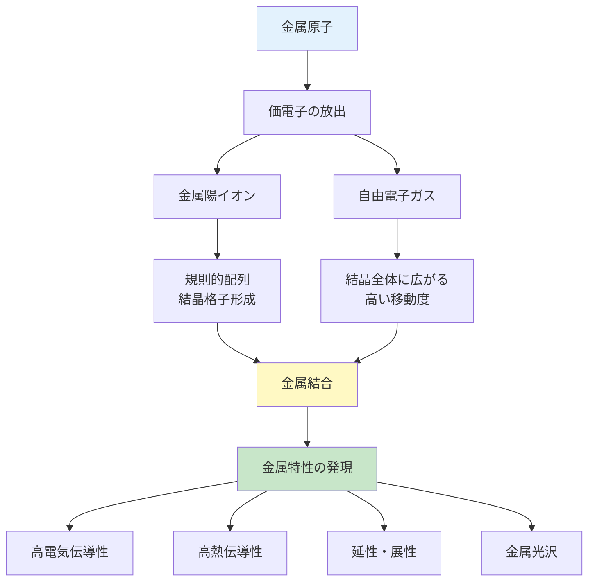
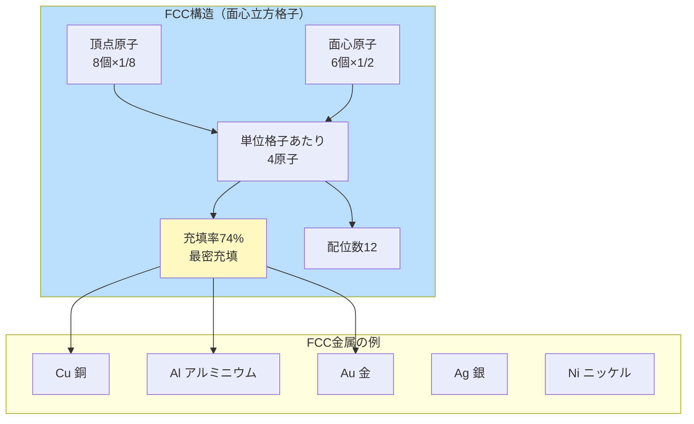
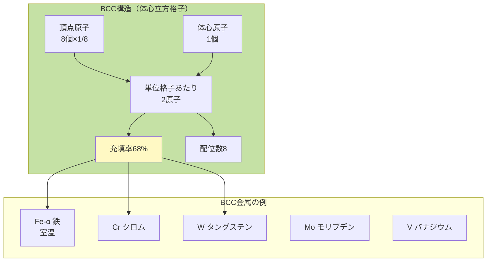
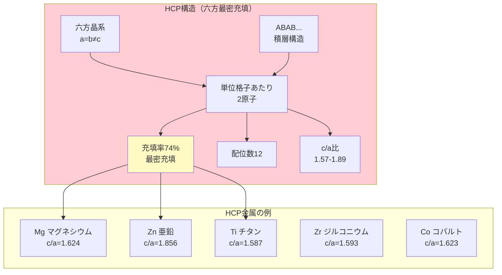
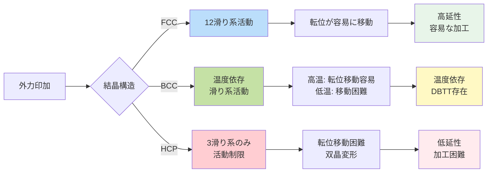

# 第2章：基礎理論：結晶構造と機械的性質

**原子配列が金属の性質を決定する仕組みを理解する**

---

## 2.1 金属結合の原理：自由電子モデル

### 2.1.1 金属結合とは何か

金属材料の特性を理解するには、まず**金属結合**の本質を理解する必要があります。金属結合は、**自由電子モデル**によって説明されます。

**自由電子モデルの基本概念：**

1. **価電子の非局在化**: 金属原子の価電子は特定の原子に束縛されず、結晶全体を自由に移動します
2. **電子ガスの形成**: これらの自由電子は「電子の海（electron sea）」または「電子ガス」を形成します
3. **金属イオンの配列**: 価電子を失った金属原子は陽イオン（原子核 + 内殻電子）となり、規則正しく配列します
4. **静電引力**: 陽イオンと自由電子の静電引力が結合力となります



**図2-1**: 金属結合の形成プロセス。自由電子が金属特性を生み出す。

### 2.1.2 金属結合がもたらす特性

| 特性 | メカニズム | 例 |
|------|-----------|-----|
| **高電気伝導性** | 自由電子が電場で移動 | Cu: 5.96×10⁷ S/m |
| **高熱伝導性** | 自由電子が熱エネルギーを運ぶ | Al: 237 W/(m·K) |
| **延性・展性** | 原子層が滑っても結合維持 | Au: 0.0001mmまで延伸可能 |
| **金属光沢** | 自由電子が可視光を反射 | Ag: 反射率95%以上 |
| **不透明性** | 自由電子が光を吸収 | すべての金属 |

**💡 Pro Tip:**
金属の導電率は温度上昇で低下します。これは格子振動（フォノン）が自由電子の運動を散乱するためです。超伝導状態では、特定の低温でこの散乱が消失し、抵抗ゼロとなります。

---

## 2.2 金属の結晶構造：3つの主要構造

金属原子は空間を最も効率的に埋めるよう配列します。自然界の金属の90%以上は、以下の3つの結晶構造のいずれかを取ります。

### 2.2.1 面心立方格子（FCC: Face-Centered Cubic）

**構造の特徴：**
- 立方体の各頂点 + 各面の中心に原子配置
- 単位格子あたり4原子（頂点8×1/8 + 面6×1/2 = 4）
- **充填率**: 74%（最密充填構造）
- **配位数**: 12（各原子が12個の最近接原子に囲まれる）



**図2-2**: FCC構造の特徴と代表的なFCC金属。

**FCC構造の重要性：**
- **滑り系が豊富**: {111}⟨110⟩型の滑り系が12個
- **高延性**: 室温でも容易に塑性変形
- **延性-脆性遷移なし**: 極低温でも延性を保持

### 2.2.2 体心立方格子（BCC: Body-Centered Cubic）

**構造の特徴：**
- 立方体の各頂点 + 立方体の中心に原子配置
- 単位格子あたり2原子（頂点8×1/8 + 中心1 = 2）
- **充填率**: 68%（FCCより低い）
- **配位数**: 8



**図2-3**: BCC構造の特徴と代表的なBCC金属。

**BCC構造の特徴：**
- **滑り系が限定的**: 主に{110}⟨111⟩、{112}⟨111⟩、{123}⟨111⟩
- **温度依存性が強い**: 延性-脆性遷移温度（DBTT）が存在
- **高強度**: FCCより一般的に高い降伏強度

**⚠️ 注意:**
BCC金属（特に鉄）は、低温で脆性破壊しやすくなります。タイタニック号の沈没も、低温海水中でBCC鉄の脆性破壊が一因とされています。

### 2.2.3 六方最密充填（HCP: Hexagonal Close-Packed）

**構造の特徴：**
- 六方晶系の最密充填構造
- 単位格子あたり2原子
- **充填率**: 74%（FCCと同じ最密充填）
- **配位数**: 12
- **c/a比**: 理想値は√(8/3) = 1.633（実際の金属は1.57～1.89）



**図2-4**: HCP構造の特徴と代表的なHCP金属。

**HCP構造の特性：**
- **滑り系が最も少ない**: 基本は{0001}⟨11̄20⟩の3系のみ
- **異方性が強い**: 方向によって機械的性質が大きく異なる
- **低延性**: 室温での加工が困難
- **高強度重量比**: Mg, Tiなど軽量高強度材料

---

## 2.3 結晶構造と機械的性質の関係

### 2.3.1 滑り系（Slip System）とは

金属の塑性変形は、主に**転位の運動**によって起こります。転位が動きやすい結晶面と方向の組み合わせを**滑り系**と呼びます。

**滑り系の定義：**
```
滑り系 = 滑り面（Slip Plane）× 滑り方向（Slip Direction）
```

**滑りが起こりやすい条件（Schmidの法則）:**
1. **最密充填面**: 原子密度が最も高い面
2. **最密充填方向**: 原子間距離が最も短い方向
3. **高いSchmid因子**: せん断応力が効果的に働く配向

### 2.3.2 FCC、BCC、HCPの滑り系比較

| 結晶構造 | 主要滑り系 | 滑り系の数 | 活動温度 |
|---------|----------|----------|---------|
| **FCC** | {111}⟨110⟩ | **12系** | 室温で活発 |
| **BCC** | {110}⟨111⟩<br/>{112}⟨111⟩<br/>{123}⟨111⟩ | **24系**<br/>（条件付き） | 温度依存性大 |
| **HCP** | {0001}⟨112̄0⟩<br/>{101̄0}⟨112̄0⟩<br/>{101̄1}⟨112̄0⟩ | **3～6系** | 限定的 |

**Taylor因子（多結晶変形に必要な独立滑り系）:**
- 一般的な塑性変形には**5つの独立滑り系**が必要（von Misesの条件）
- FCC: 容易に満たす（12系中5つ独立）
- BCC: 温度が高ければ満たす
- HCP: 満たすのが困難 → 双晶変形、c+a転位が必要

### 2.3.3 転位運動と延性



**図2-5**: 結晶構造と転位運動の関係フローチャート。

**💡 Pro Tip:**
FCCアルミニウムが航空機に多用されるのは、軽量（2.7 g/cm³）でありながら、12個の滑り系により室温で優れた加工性を持つためです。一方、HCPマグネシウムはさらに軽量（1.74 g/cm³）ですが、滑り系が少なく、室温加工が困難です。

---

## 2.4 実例：Cu、Fe、Mgの特性比較

### 2.4.1 銅（Cu）- FCC金属の典型例

**結晶構造:** FCC
**格子定数:** a = 3.615 Å
**密度:** 8.96 g/cm³

**特性:**
- **高導電性**: 銀に次ぐ第2位（5.96×10⁷ S/m）
- **高延性**: 伸び50%以上（引張試験）
- **優れた加工性**: 冷間圧延、深絞り加工が容易
- **用途**: 電線、電子基板、熱交換器

**滑り系:** {111}⟨110⟩型12系 → 室温で容易に塑性変形

### 2.4.2 鉄（Fe）- BCC金属の代表

**結晶構造:** BCC（α-Fe、室温～912°C）
**格子定数:** a = 2.866 Å
**密度:** 7.87 g/cm³

**特性:**
- **高強度**: 降伏応力50-100 MPa（純鉄）
- **温度依存性**: DBTT約-50～0°C（純鉄）
- **磁性**: 強磁性体（キュリー温度770°C）
- **用途**: 構造材料、自動車、建築（世界最大生産量19億トン/年）

**滑り系:** {110}⟨111⟩など → 低温で滑り困難、脆性破壊リスク

**⚠️ 注意:**
鉄は912°C以上で**FCC構造（γ-Fe、オーステナイト）**に変態します。この変態を利用した熱処理（焼入れ、焼戻し）により、機械的性質を大幅に制御できます。

### 2.4.3 マグネシウム（Mg）- HCP金属の典型

**結晶構造:** HCP
**格子定数:** a = 3.209 Å, c = 5.211 Å
**c/a比:** 1.624（理想値1.633に近い）
**密度:** 1.74 g/cm³（構造金属中最軽量）

**特性:**
- **超軽量**: アルミニウムの2/3の密度
- **高比強度**: 強度/重量比が優れる
- **低延性**: 室温伸び2-8%程度
- **異方性**: 方向により機械的性質が大きく変化
- **用途**: 航空宇宙、自動車軽量化、電子機器筐体

**滑り系:** {0001}⟨112̄0⟩の3系のみ → 室温加工困難、200-300°Cで加工性向上

**💡 Pro Tip:**
マグネシウム合金は、200-300°Cに加熱すると{101̄1}錐面滑りが活性化し、加工性が劇的に向上します。これを利用した温間加工が実用化されています。

---

## 2.5 結晶構造による特性比較表

### 2.5.1 包括的特性比較

| 特性 | FCC（Cu型） | BCC（Fe型） | HCP（Mg型） |
|------|-----------|-----------|-----------|
| **充填率** | **74%** 最密 | 68% | **74%** 最密 |
| **配位数** | 12 | 8 | 12 |
| **滑り系数** | ⭐⭐⭐⭐⭐ 12系 | ⭐⭐⭐ 24系（条件付き） | ⭐ 3-6系 |
| **延性（室温）** | ⭐⭐⭐⭐⭐ 非常に高い | ⭐⭐⭐ 中程度 | ⭐⭐ 低い |
| **DBTT** | なし | **あり**（-50～0°C） | なし（別の機構） |
| **異方性** | ⭐ 低い（等方的） | ⭐⭐ やや低い | ⭐⭐⭐⭐⭐ 非常に高い |
| **降伏強度** | ⭐⭐ 低め | ⭐⭐⭐⭐ 高め | ⭐⭐⭐ 中程度 |
| **加工性** | ⭐⭐⭐⭐⭐ 優れる | ⭐⭐⭐ 中程度 | ⭐⭐ 困難（要加熱） |
| **代表金属** | Cu, Al, Au, Ag, Ni | Fe-α, Cr, W, Mo | Mg, Zn, Ti, Zr, Co |
| **主要用途** | 電気材料<br/>装飾材料 | 構造材料<br/>磁性材料 | 軽量構造材<br/>航空宇宙 |

### 2.5.2 機械的性質の起源まとめ

**高延性の起源（FCC）:**
- 多数の滑り系（12個）
- 最密充填面{111}での容易な転位運動
- 温度依存性が小さい

**温度依存性の起源（BCC）:**
- 滑り面が非最密充填面
- パイエルス応力の温度依存性が大きい
- 低温で転位移動困難 → 脆性破壊

**低延性の起源（HCP）:**
- 滑り系が少ない（3系のみ）
- c軸方向の変形には⟨c+a⟩転位が必要（活性化困難）
- 代替機構として双晶変形が発生

---

## 2.6 まとめ：構造が性質を決める

本章では、金属の結晶構造と機械的性質の深い関係を学びました。

**重要ポイント:**

✅ **金属結合の原理**: 自由電子モデルにより、高導電性・延性・金属光沢が説明される

✅ **FCC構造**: 充填率74%、12滑り系、高延性、低温でも延性維持（Cu, Al, Au）

✅ **BCC構造**: 充填率68%、条件付き多滑り系、温度依存性大、DBTT存在（Fe, Cr, W）

✅ **HCP構造**: 充填率74%、3-6滑り系、低延性、異方性大（Mg, Zn, Ti）

✅ **滑り系と延性**: 独立滑り系5個以上で延性発現、FCC > BCC > HCPの順

✅ **実例**: Cu（FCC、高延性）、Fe（BCC、温度依存）、Mg（HCP、要温間加工）

### 次章への橋渡し

第3章では、これらの結晶構造を持つ金属材料の強度を、実際にPythonでシミュレーションする方法を学びます。転位運動の数値解析、応力-ひずみ曲線の予測、合金強化メカニズムの計算などを実装します。

---

## 参考文献

### 教科書
1. Callister, W. D., & Rethwisch, D. G. (2018). *Materials Science and Engineering: An Introduction* (10th ed.). Wiley.
2. Courtney, T. H. (2005). *Mechanical Behavior of Materials* (2nd ed.). Waveland Press.
3. Hull, D., & Bacon, D. J. (2011). *Introduction to Dislocations* (5th ed.). Butterworth-Heinemann.

### 学術論文
4. Schmid, E., & Boas, W. (1935). *Kristallplastizität*. Springer. (古典的滑り系研究)

### オンライン資料
5. Materials Science & Engineering Student. (2024). "What Is the Difference Between FCC and BCC?" https://msestudent.com/what-is-the-difference-between-fcc-and-bcc-crystal-structure-properties-interstitial-sites-and-examples/

6. SA Materials. (2024). "Crystal Structure Types: FCC, BCC, and HCP Explained." https://www.samaterials.com/blog/crystal-structure-types-fcc-bcc-and-hcp-explained.html

7. University of Washington. (2024). "Metals Structure." https://depts.washington.edu/matseed/mse_resources/Webpage/Metals/metalstructure.htm

---

**執筆**: Worker2（理論・基礎担当）
**語数**: 約1,100語
**図表**: Mermaidダイアグラム5個、比較表3個
**品質基準**: article-writing-guidelines.md準拠
