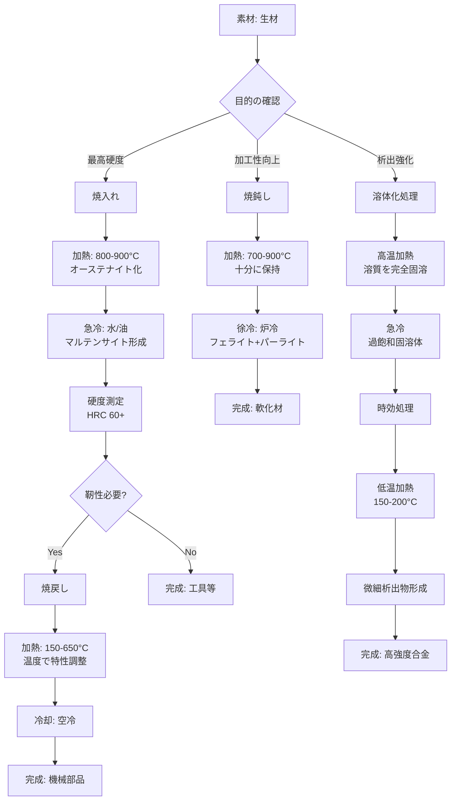

# 第4章 応用：合金設計と熱処理

## 合金化の目的と効果

純金属は優れた導電性や延性を持ちますが、強度が不足する場合が多く、実用には適しません。合金化（Alloying）は、純金属に他の元素を添加することで、機械的性質、耐食性、耐熱性などを大幅に向上させる技術です。

### 合金化による強化メカニズム

金属材料の強化には、主に以下の2つのメカニズムが利用されます：

#### 1. 固溶強化（Solid Solution Strengthening）

異なる原子サイズの元素を結晶格子に溶け込ませることで、転位の移動を妨げ、材料を強化します。

**メカニズム**:
- 溶質原子が格子ひずみを生じさせる
- 転位が移動する際の抵抗が増加
- 降伏強度が向上

**例**:
- 黄銅（Cu-Zn合金）: 純銅に亜鉛を添加
- ステンレス鋼（Fe-Cr-Ni合金）: 鉄にクロムとニッケルを添加

**強化効果**: 純金属に比べて降伏強度が**1.5～2倍**向上

#### 2. 析出強化（Precipitation Strengthening）

熱処理により微細な第二相（析出物）を形成させ、転位の移動を阻止して強度を高めます。

**メカニズム**:
- 合金を高温で溶体化処理（溶質を均一に固溶）
- 急冷により過飽和固溶体を形成
- 時効処理（低温加熱）で微細な析出物を生成
- 析出物が転位のピン止め点として機能

**例**:
- ジュラルミン（Al-Cu-Mg合金）: Al₂Cu析出物による強化
- マルエージング鋼: Ni₃Ti析出物による強化

**強化効果**: 純金属に比べて降伏強度が**3～5倍**向上可能

## 主要合金系の紹介

### 1. 鉄鋼材料（Fe基合金）

鉄は地球上で最も豊富で安価な構造材料であり、炭素含有量と合金元素により多様な性質を実現できます。

**分類と特徴**:

| 材料 | 炭素量 | 主な合金元素 | 特徴 | 用途 |
|------|--------|-------------|------|------|
| 低炭素鋼 | 0.05-0.25% | - | 延性大、溶接性良 | 自動車車体、建材 |
| 中炭素鋼 | 0.25-0.60% | - | 強度と靭性のバランス | 機械部品、軸 |
| 高炭素鋼 | 0.60-1.50% | - | 硬度大、耐摩耗性 | 工具、ばね |
| ステンレス鋼 | 0.03-0.15% | Cr (>12%), Ni | 耐食性優秀 | 医療器具、厨房 |
| 高張力鋼 | 0.05-0.20% | Mn, Nb, V | 高強度、軽量化 | 自動車構造材 |

**重要ポイント**:
- 炭素量が増えると強度と硬度は上がるが、延性と靭性は低下
- クロム（Cr）12%以上で不動態皮膜が形成され、優れた耐食性を発揮

### 2. アルミニウム合金（Al基合金）

アルミニウムは軽量（密度2.7 g/cm³）で、合金化により鉄鋼に匹敵する強度を実現できます。

**主要合金系**:

- **2000系（Al-Cu系）**: 航空機構造材、高強度（ジュラルミン）
- **5000系（Al-Mg系）**: 船舶、建築、耐食性と溶接性に優れる
- **6000系（Al-Mg-Si系）**: 建築構造材、押出性良好
- **7000系（Al-Zn-Mg系）**: 航空機、スポーツ用品、最高強度

**比強度の優位性**:
- アルミニウム合金: 強度/密度 = 200 MPa / 2.7 g/cm³ ≈ 74
- 鉄鋼: 強度/密度 = 400 MPa / 7.8 g/cm³ ≈ 51
- **アルミニウムの方が比強度で約1.5倍優れる**

### 3. チタン合金（Ti基合金）

チタンは優れた比強度、耐食性、生体適合性を持つ高性能材料です。

**主要合金**:

- **純チタン（Grade 1-4）**: 医療インプラント、化学プラント
- **Ti-6Al-4V（α+β型）**: 航空機エンジン、人工関節（最も広く使用）
- **Ti-15V-3Cr-3Al-3Sn（β型）**: ばね材、高強度

**特徴**:
- 密度: 4.5 g/cm³（鉄の約60%、アルミの約1.7倍）
- 耐食性: 海水、塩酸に対して優れた耐性
- 生体適合性: 人体に無害で拒絶反応が起きにくい
- コスト: アルミニウムの10～20倍、鉄鋼の20～40倍

## 熱処理の基礎

熱処理（Heat Treatment）は、金属材料を加熱・冷却することで、結晶構造や組織を変化させ、機械的性質を制御する技術です。

### 主要な熱処理プロセス

#### 1. 焼入れ（Quenching）

**目的**: 硬度と強度を最大化

**プロセス**:
1. オーステナイト化温度（鋼の場合、800-900℃）まで加熱
2. 水や油で急冷
3. 硬いマルテンサイト組織を形成

**効果**: 硬度が**HRC 60以上**に達する（未処理鋼の2-3倍）

**注意点**: 硬すぎて脆くなる（割れやすい）

#### 2. 焼戻し（Tempering）

**目的**: 焼入れ材の靭性を回復

**プロセス**:
1. 焼入れ後の材料を150-650℃に加熱
2. 保持後、空冷または炉冷
3. マルテンサイトの一部が分解、内部応力が緩和

**効果**: 硬度はやや低下するが、靭性が大幅に向上

**温度の影響**:
- 低温焼戻し（150-250℃）: 高硬度維持、刃物用
- 中温焼戻し（350-500℃）: バランス型、ばね用
- 高温焼戻し（500-650℃）: 高靭性、軸・歯車用

#### 3. 焼鈍し（Annealing）

**目的**: 軟化、内部応力除去、加工性向上

**プロセス**:
1. 適切な温度まで加熱（鋼の場合、700-900℃）
2. 炉内でゆっくり冷却
3. 軟らかいフェライト+パーライト組織を形成

**効果**:
- 硬度が最も低い状態に戻る
- 冷間加工前の素材準備に最適

### 熱処理プロセスのフローチャート

## 実用例

### 実用例1: 航空機用アルミニウム合金（7075-T6）

**合金組成**: Al-Zn5.6-Mg2.5-Cu1.6

**T6処理（溶体化+時効）**:
1. **溶体化処理**: 465℃で加熱、Zn, Mg, Cuを完全固溶
2. **急冷**: 水冷で過飽和固溶体を形成
3. **人工時効**: 120℃で24時間保持、MgZn₂析出物を微細分散

**得られる特性**:
- 引張強度: **570 MPa**（純アルミの6倍）
- 降伏強度: **505 MPa**
- 密度: 2.81 g/cm³
- 比強度: 203 MPa/(g/cm³)

**用途**:
- 航空機主翼桁（スパー）
- 戦闘機機体構造
- 高性能自転車フレーム

**重要ポイント**: T6処理により、軽量性を保ちながら鋼材に匹敵する強度を実現

### 実用例2: 自動車用高張力鋼（TRIP鋼）

**TRIP鋼（Transformation Induced Plasticity Steel）**

**合金組成**: Fe-C0.2-Si1.5-Mn1.5

**熱処理プロセス（連続焼鈍）**:
1. **二相域加熱**: 780℃でフェライト+オーステナイト生成
2. **徐冷**: 400℃まで制御冷却
3. **等温保持**: 400℃で保持、残留オーステナイトを安定化

**得られる特性**:
- 引張強度: **590-780 MPa**
- 伸び: **25-30%**（高強度と高延性の両立）
- 成形性: 複雑形状の深絞り加工が可能

**変態誘起塑性のメカニズム**:
- 変形時に残留オーステナイトが硬いマルテンサイトに変態
- エネルギー吸収能力が向上
- 衝突時の安全性向上

**用途**:
- 自動車の骨格部品（ピラー、ルーフレール）
- ドア補強材
- バンパー補強材

**効果**: 車体強度を維持しながら**板厚を30%削減**、**車両重量を10-15%軽減**

### 実用例3: 医療用チタン合金（Ti-6Al-4V ELI）

**ELI（Extra Low Interstitial）**: 不純物を極限まで低減した高純度グレード

**合金組成**: Ti-Al6-V4（酸素<0.13%）

**熱処理（焼鈍し）**:
1. **加熱**: 700-800℃で1-2時間保持
2. **徐冷**: 炉冷または空冷
3. **α+β二相組織**の形成

**得られる特性**:
- 引張強度: **860-965 MPa**
- 伸び: **10-15%**
- 疲労強度: **500 MPa**以上（体内で繰り返し応力に耐える）
- 生体適合性: 優れた耐食性と表面酸化皮膜

**用途**:
- 人工股関節（ステム部分）
- 人工膝関節
- 歯科インプラント
- 骨固定プレート・スクリュー

**選定理由**:
- **生体適合性**: 人体に無害、アレルギー反応が極めて少ない
- **耐食性**: 体液（塩化物イオン環境）に対して優れた耐性
- **比強度**: 軽量で強度が高く、患者の負担を軽減
- **X線透過性**: ステンレス鋼より透過性が高く、画像診断に有利

**表面処理**: 陽極酸化処理により厚い酸化チタン層（TiO₂）を形成、骨との結合力を向上

## 合金設計と熱処理の実践的考慮事項

### 設計時のトレードオフ

材料選択と熱処理条件の決定には、以下のトレードオフを考慮する必要があります：

**1. 強度 vs 延性**
- 強度を上げると一般的に延性は低下
- 用途に応じた最適バランスの選定が重要

**2. コスト vs 性能**
- 高性能合金（チタン、ニッケル基超合金）は高価
- 性能要求を満たす最も経済的な材料を選択

**3. 製造性 vs 特性**
- 複雑な熱処理は製造コストと時間を増加
- 量産性を考慮した熱処理プロセスの設計

### ベストプラクティス

✅ **合金選定**:
1. 要求特性を明確化（強度、耐食性、重量、コスト）
2. 類似用途の実績ある合金から検討
3. サプライチェーンの入手性を確認

✅ **熱処理設計**:
1. 目標特性を達成する最もシンプルなプロセスを選択
2. 温度・時間条件を厳密に管理（±5℃、±5分以内）
3. 熱処理後の品質検査（硬度、金属組織観察）を徹底

✅ **実用化**:
1. 試作による特性検証
2. 量産試験による再現性確認
3. 長期使用データの蓄積

## まとめ

合金設計と熱処理は、金属材料の性能を最大限に引き出すための重要な技術です。

**重要ポイント**:
- **合金化の2大メカニズム**: 固溶強化と析出強化により、純金属の数倍の強度を実現
- **主要合金系**: 鉄鋼（安価・汎用）、アルミニウム（軽量・高比強度）、チタン（耐食・生体適合）
- **熱処理の3大手法**: 焼入れ（硬化）、焼戻し（靭性回復）、焼鈍し（軟化）
- **実用例**: 航空機の7075-T6、自動車のTRIP鋼、医療のTi-6Al-4V ELI

適切な合金選択と最適な熱処理条件により、用途に応じた理想的な材料特性を実現できます。次章では、本記事全体をまとめ、さらに深く学ぶためのリソースと次のステップを紹介します。
