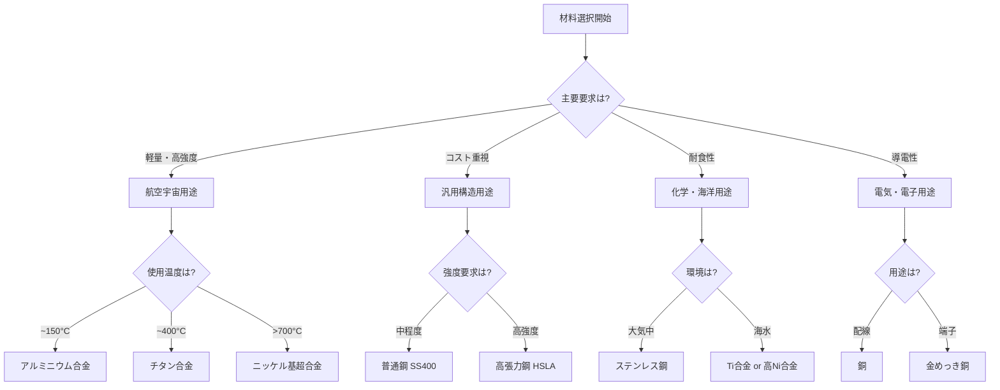

# 第5章：まとめと実用例

**金属材料の知識を実践へ - 産業界における応用事例**

---

## 学習目標の確認

本記事を通じて、金属材料の基礎から応用までを体系的に学習しました。以下の3段階で学習達成度を確認しましょう。

### 基本理解（Remember & Understand）

- ✅ 金属材料の基本的な性質（導電性、延性、展性、金属光沢）を説明できる
- ✅ 結晶構造の3つの主要タイプ（FCC、BCC、HCP）を識別できる
- ✅ 合金化の原理と目的（強度向上、耐食性改善）を理解している
- ✅ 熱処理の基本プロセス（焼入れ、焼戻し、焼鈍し）を説明できる

### 実践スキル（Apply & Analyze）

- ✅ 状態図（相図）を読み取り、温度と組成から相を予測できる
- ✅ 機械的性質（引張強度、硬度、靭性）のトレードオフを分析できる
- ✅ 用途に応じた金属材料の選択基準を適用できる
- ✅ 材料の微細組織観察から特性を推測できる

### 応用力（Evaluate & Create）

- ✅ 実世界の工学的課題に対して最適な金属材料を選定できる
- ✅ 材料選択における複数の制約条件（強度、重量、コスト、加工性）を総合評価できる
- ✅ 新しい合金設計の方向性を提案できる
- ✅ 材料選択の失敗事例から教訓を抽出し、改善策を提示できる

---

## 本記事のまとめ

本記事では、金属材料の基礎から応用までを包括的に学習しました。

**第1章**では、金属結合の特徴と自由電子の役割を理解し、金属材料が優れた導電性・延性を持つ理由を学びました。

**第2章**では、FCC（面心立方）、BCC（体心立方）、HCP（六方最密充填）という3つの主要な結晶構造と、それらが機械的性質に与える影響を学びました。例えば、FCCのアルミニウムは延性に優れ、BCCの鉄は強度が高いという特徴があります。

**第3章**では、合金化と熱処理という金属材料の特性を制御する2つの重要な手法を学びました。鉄-炭素系状態図を通じて、温度と組成が微細組織に与える影響を理解しました。

**第4章**では、実用金属材料（鉄鋼、アルミニウム合金、チタン合金、銅合金）の特性と用途を学び、材料選択の実践的な基準を習得しました。

---

## 実用例：産業界における金属材料の応用

金属材料は現代の産業基盤を支える重要な素材です。以下に主要産業分野での応用事例を紹介します。

### 航空宇宙産業

**材料要求**: 高強度、軽量、耐熱性、耐疲労性

**主要材料**:
- **アルミニウム合金（Al-Cu系 2000系）**: 機体構造材
  - Boeing 737: 機体重量の約70%がアルミニウム合金
  - 密度2.8 g/cm³で鉄（7.87 g/cm³）の約1/3
  - 引張強度: 400-500 MPa（熱処理により達成）

- **チタン合金（Ti-6Al-4V）**: エンジン部品、ファスナー
  - 比強度（強度/密度）が鋼の約2倍
  - 使用温度: 最大400°C
  - Boeing 787: 機体重量の15%（従来機の2倍）

- **ニッケル基超合金（Inconel 718）**: ジェットエンジンタービンブレード
  - 使用温度: 700-1000°C
  - クリープ抵抗性に優れる

**事例**: Airbus A380は、アルミニウム-リチウム合金（Al-Li 2099）を採用し、従来のアルミニウム合金より10%軽量化、機体重量を1.5トン削減しました。

### 自動車産業

**材料要求**: 強度、成形性、コスト効率、衝突安全性

**主要材料**:
- **高張力鋼（HSLA, Advanced High-Strength Steel）**: 車体骨格
  - 引張強度: 590-1500 MPa
  - 板厚削減により軽量化（従来鋼比30%減）
  - コスト: アルミニウム合金の約1/3

- **アルミニウム合金（5000系、6000系）**: ボンネット、ドア、車輪
  - Audi A8: オールアルミニウムボディで220kg軽量化
  - 燃費改善: 10-15%

- **マグネシウム合金（AZ91D）**: インストルメントパネル、ステアリングホイール
  - 密度1.8 g/cm³（アルミニウムの約2/3）
  - 振動減衰性に優れる

**事例**: Tesla Model Sは、ギガプレス技術により、アルミニウム合金製リアボディを1ピース成形。部品点数を70から1に削減し、製造工程を短縮しました。

### 建築産業

**材料要求**: 耐久性、耐食性、構造強度、美観

**主要材料**:
- **構造用鋼（SS400, SN490）**: 高層ビル骨組み
  - 降伏強度: 235-325 MPa
  - 東京スカイツリー: 36,000トンの鋼材使用

- **ステンレス鋼（SUS304）**: 外装パネル、手すり
  - Cr含有率18%による不動態皮膜形成
  - 耐用年数: 50年以上

- **アルミニウム合金（6063-T5）**: サッシ、カーテンウォール
  - 陽極酸化処理により耐食性・意匠性向上
  - メンテナンスフリー

**事例**: ブルジュ・ハリファ（828m）は、高強度鉄筋（引張強度600 MPa）と構造用鋼の組み合わせにより、極限の高さを実現しました。

### 電子機器産業

**材料要求**: 導電性、熱伝導性、薄型化、実装性

**主要材料**:
- **銅（無酸素銅 C1020）**: 配線、プリント基板
  - 導電率: 58.0 MS/m（銀に次ぐ高導電性）
  - 熱伝導率: 398 W/(m·K)

- **金（Au）**: 電子部品端子、ボンディングワイヤ
  - 耐酸化性（不動態化不要）
  - はんだ付け性良好

- **アルミニウム（99.99%）**: スマートフォン筐体、ヒートシンク
  - 熱伝導率: 237 W/(m·K)
  - CNC加工による高精度成形

**事例**: iPhone 15 Proは、チタン合金（Grade 5）筐体を採用。ステンレス鋼比で重量19%削減、強度は維持しました。

---

## 材料選択の決定木

実際の設計において、金属材料を選択する際の判断フローを以下に示します：

---

## 次のステップ：発展的学習へ

金属材料の基礎を習得したあなたは、次のステップとして以下の専門分野への学習を推奨します。

### 推奨学習パス

**1. セラミックス材料シリーズ（近日公開予定）**
- イオン結合・共有結合と物性の関係
- 電気セラミックス（誘電体、圧電体、半導体）
- 構造セラミックス（高硬度、耐熱性材料）
- **推奨対象**: 電子材料、高温材料に興味がある方

**2. ポリマー材料シリーズ（近日公開予定）**
- 高分子化学の基礎
- 熱可塑性・熱硬化性樹脂の違い
- 複合材料（CFRP、GFRP）への展開
- **推奨対象**: 軽量材料、成形加工に興味がある方

**3. 複合材料シリーズ（近日公開予定）**
- 金属基複合材料（MMC）
- 繊維強化金属（FRM）
- ハイブリッド材料設計
- **推奨対象**: 次世代材料開発に興味がある方

**4. マテリアルズ・インフォマティクス（MI）シリーズ**
- 機械学習による材料物性予測
- 合金組成最適化
- 第一原理計算との統合
- **推奨対象**: データサイエンス、計算材料科学に興味がある方

### 実践プロジェクトの提案

知識を定着させるため、以下のようなプロジェクトに取り組むことをお勧めします：

1. **材料選択ケーススタディ**: 実際の製品（自転車、スマートフォン等）の材料選択理由を分析
2. **状態図シミュレーション**: Thermo-Calcなどのソフトウェアで平衡状態図を作成
3. **熱処理実験**: 炭素鋼の焼入れ・焼戻しによる硬度変化を測定（大学実験室で）

---

## フィードバックをお待ちしています

本記事シリーズを改善するため、皆様のフィードバックをお待ちしています。

**連絡先**: yusuke.hashimoto.b8@tohoku.ac.jp

- **誤字・脱字・技術的誤り**: 報告いただけると幸いです
- **改善提案**: 追加して欲しいトピック、コード例、実用例等
- **質問**: 理解が難しかった部分、追加説明が欲しい箇所
- **成功事例**: 本記事で学んだことを活用したプロジェクト

---

[シリーズ目次に戻る](./index.html)
