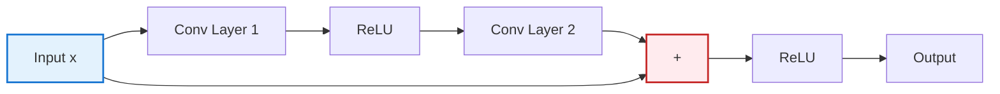

# Markdown-HTML Pipeline Examples

This document provides practical examples for using the Markdown-HTML pipeline tools.

## Installation

First, install all dependencies:

```bash
cd /Users/yusukehashimoto/Documents/pycharm/AI_Homepage/wp
pip install -r tools/requirements-markdown-pipeline.txt
```

## Example 1: Convert Single Chapter from Markdown to HTML

**Scenario**: You've written a new chapter in Markdown and want to generate the HTML version.

```bash
# Create a new chapter in Markdown
cd knowledge/en/ML/transformer-introduction/

# The file should have frontmatter like this:
cat > chapter-6.md << 'EOF'
---
title: "Chapter 6: Advanced Transformer Architectures"
chapter_title: "Chapter 6: GPT and BERT Variants"
subtitle: "Exploring Modern Language Model Architectures"
reading_time: "30-35 minutes"
difficulty: "Advanced"
code_examples: 5
exercises: 3
version: "1.0"
created_at: "2025-01-16"
---

## Introduction

This chapter explores advanced Transformer variants...
EOF

# Convert to HTML
python3 /Users/yusukehashimoto/Documents/pycharm/AI_Homepage/wp/tools/convert_md_to_html_en.py chapter-6.md

# Result: chapter-6.html is created with full styling and navigation
```

## Example 2: Extract Markdown from Existing HTML

**Scenario**: You have HTML files but no Markdown sources and want to start maintaining them in Markdown.

```bash
# Extract a single chapter
cd knowledge/en/ML/transformer-introduction/
python3 /Users/yusukehashimoto/Documents/pycharm/AI_Homepage/wp/tools/html_to_md.py chapter-1.html

# Result: chapter-1.md is created with frontmatter extracted from HTML

# Extract all chapters in a series
python3 /Users/yusukehashimoto/Documents/pycharm/AI_Homepage/wp/tools/html_to_md.py knowledge/en/ML/transformer-introduction/

# Result: All chapter*.html files are converted to .md
```

## Example 3: Bidirectional Sync During Development

**Scenario**: You're actively developing content and want changes to sync automatically.

```bash
# Start watch mode
cd /Users/yusukehashimoto/Documents/pycharm/AI_Homepage/wp
python3 tools/sync_md_html.py knowledge/en/ML/transformer-introduction/ --watch

# Now in another terminal or editor:
# - Edit chapter-1.md → HTML automatically regenerates
# - Edit chapter-2.html → MD automatically extracts
# Press Ctrl+C to stop watching
```

## Example 4: Batch Convert Entire Dojo

**Scenario**: You want to regenerate all HTML files for the ML Dojo.

```bash
cd /Users/yusukehashimoto/Documents/pycharm/AI_Homepage/wp

# Convert all ML series
python3 tools/convert_md_to_html_en.py ML

# This will:
# - Find all series in knowledge/en/ML/
# - Convert all chapter*.md files to HTML
# - Generate navigation links automatically
```

## Example 5: Dry Run Before Making Changes

**Scenario**: You want to see what would change without actually modifying files.

```bash
# See what would be synced
cd /Users/yusukehashimoto/Documents/pycharm/AI_Homepage/wp
python3 tools/sync_md_html.py knowledge/en/ML/transformer-introduction/ --dry-run

# Output shows:
# - Which files would be converted
# - Direction of conversion (MD→HTML or HTML→MD)
# - No actual files are modified
```

## Example 6: Force Direction Override

**Scenario**: Both MD and HTML exist, but you want to force regeneration from MD regardless of timestamps.

```bash
cd /Users/yusukehashimoto/Documents/pycharm/AI_Homepage/wp

# Force Markdown to HTML conversion
python3 tools/sync_md_html.py knowledge/en/ML/transformer-introduction/ --force-direction md2html

# Force HTML to Markdown extraction (useful for recovering from HTML-only backups)
python3 tools/sync_md_html.py knowledge/en/ML/transformer-introduction/ --force-direction html2md
```

## Example 7: Working with Math-Heavy Content

**Scenario**: Creating a chapter with extensive LaTeX equations.

```bash
cat > knowledge/en/FM/calculus-introduction/chapter-1.md << 'EOF'
---
title: "Chapter 1: Limits and Continuity"
chapter_title: "Chapter 1: Fundamental Concepts of Calculus"
subtitle: "Understanding Limits and Continuous Functions"
reading_time: "35-40 minutes"
difficulty: "Intermediate"
code_examples: 4
exercises: 8
version: "1.0"
created_at: "2025-01-16"
---

## Limits

The limit of a function $f(x)$ as $x$ approaches $a$ is:

$$
\lim_{x \to a} f(x) = L
$$

This means for every $\epsilon > 0$, there exists $\delta > 0$ such that:

$$
0 < |x - a| < \delta \implies |f(x) - L| < \epsilon
$$

### Example

Calculate: $\lim_{x \to 2} \frac{x^2 - 4}{x - 2}$

**Solution**:

$$
\lim_{x \to 2} \frac{x^2 - 4}{x - 2} = \lim_{x \to 2} \frac{(x-2)(x+2)}{x-2} = \lim_{x \to 2} (x+2) = 4
$$
EOF

# Convert with math support (automatically handled by MathPreprocessor)
python3 /Users/yusukehashimoto/Documents/pycharm/AI_Homepage/wp/tools/convert_md_to_html_en.py knowledge/en/FM/calculus-introduction/chapter-1.md

# Result: HTML with properly rendered LaTeX equations via MathJax
```

## Example 8: Creating Content with Mermaid Diagrams

**Scenario**: Adding diagrams to explain complex architectures.

```bash
cat > knowledge/en/ML/cnn-introduction/chapter-2.md << 'EOF'
---
title: "Chapter 2: CNN Architectures"
chapter_title: "Chapter 2: Classic and Modern Architectures"
subtitle: "From LeNet to ResNet"
reading_time: "40-45 minutes"
difficulty: "Intermediate"
code_examples: 6
exercises: 4
version: "1.0"
created_at: "2025-01-16"
---

## ResNet Architecture

The key innovation of ResNet is the skip connection:



The residual connection allows gradients to flow directly...
EOF

# Convert with diagram support (automatically handled by MermaidPreprocessor)
python3 /Users/yusukehashimoto/Documents/pycharm/AI_Homepage/wp/tools/convert_md_to_html_en.py knowledge/en/ML/cnn-introduction/chapter-2.md

# Result: HTML with interactive Mermaid diagram
```

## Example 9: Workflow Integration with Git

**Scenario**: Setting up a workflow where you commit Markdown and auto-generate HTML.

```bash
cd /Users/yusukehashimoto/Documents/pycharm/AI_Homepage/wp

# Edit your chapter
vim knowledge/en/ML/transformer-introduction/chapter-1.md

# Generate HTML
python3 tools/convert_md_to_html_en.py knowledge/en/ML/transformer-introduction/chapter-1.md

# Add both to git
git add knowledge/en/ML/transformer-introduction/chapter-1.md
git add knowledge/en/ML/transformer-introduction/chapter-1.html
git commit -m "Add: Transformer introduction chapter 1"

# Or, add to .gitignore to exclude HTML:
echo "knowledge/en/**/*.html" >> .gitignore
git add .gitignore
git add knowledge/en/ML/transformer-introduction/chapter-1.md
git commit -m "Add: Transformer chapter 1 (HTML auto-generated in CI)"
```

## Example 10: Recovering from HTML-Only Backup

**Scenario**: You lost your Markdown sources but have HTML backups.

```bash
cd /Users/yusukehashimoto/Documents/pycharm/AI_Homepage/wp

# Extract all HTML to Markdown
python3 tools/html_to_md.py knowledge/en/ML/ --output-dir markdown_recovery/

# Review extracted Markdown
ls markdown_recovery/

# Move back to original locations if satisfied
find markdown_recovery -name "*.md" -exec sh -c 'cp "$1" "knowledge/en/${1#markdown_recovery/}"' _ {} \;

# Verify sync
python3 tools/sync_md_html.py knowledge/en/ML/ --dry-run
```

## Example 11: Custom Output Directory

**Scenario**: You want to generate HTML to a different directory for deployment.

```bash
cd /Users/yusukehashimoto/Documents/pycharm/AI_Homepage/wp

# Extract to custom directory
python3 tools/html_to_md.py knowledge/en/ML/transformer-introduction/ --output-dir docs/markdown/

# Result: Markdown files in docs/markdown/ directory
# Original HTML files remain unchanged
```

## Example 12: Processing Specific File Patterns

**Scenario**: Convert only certain chapters.

```bash
cd /Users/yusukehashimoto/Documents/pycharm/AI_Homepage/wp

# Convert only chapter 1 files across all series
for chapter1 in knowledge/en/ML/*/chapter-1.md; do
    python3 tools/convert_md_to_html_en.py "$chapter1"
done

# Extract only index files
for index in knowledge/en/ML/*/index.html; do
    python3 tools/html_to_md.py "$index"
done
```

## Example 13: Development Workflow with Live Preview

**Scenario**: Writing new content with instant HTML preview.

```bash
# Terminal 1: Start watch mode
cd /Users/yusukehashimoto/Documents/pycharm/AI_Homepage/wp
python3 tools/sync_md_html.py knowledge/en/ML/transformer-introduction/ --watch

# Terminal 2: Start local web server
cd knowledge/en/ML/transformer-introduction/
python3 -m http.server 8000

# Terminal 3: Edit Markdown
vim chapter-3.md

# Browser: Open http://localhost:8000/chapter-3.html
# Refresh browser after saving - see changes instantly!
```

## Example 14: Bulk Migration from Another Format

**Scenario**: You have content in another system and exported to HTML.

```bash
cd /Users/yusukehashimoto/Documents/pycharm/AI_Homepage/wp

# Extract all HTML to Markdown
python3 tools/html_to_md.py exported_html/ --output-dir knowledge/en/ML/new-series/

# Review and edit Markdown sources
# Clean up any conversion artifacts

# Regenerate clean HTML
python3 tools/convert_md_to_html_en.py knowledge/en/ML/new-series/
```

## Example 15: Verifying Conversion Quality

**Scenario**: Ensuring bidirectional conversion doesn't lose information.

```bash
cd /Users/yusukehashimoto/Documents/pycharm/AI_Homepage/wp

# Start with original Markdown
cp knowledge/en/ML/transformer-introduction/chapter-1.md /tmp/original.md

# Convert MD → HTML → MD
python3 tools/convert_md_to_html_en.py /tmp/original.md
python3 tools/html_to_md.py /tmp/original.html --output-dir /tmp/

# Compare
diff /tmp/original.md /tmp/original.md
# Minor formatting differences are expected (spacing, etc.)
# Mathematical content and structure should be identical
```

## Troubleshooting Examples

### Example 16: Fixing Broken Navigation

```bash
# If navigation links are broken, ensure consistent naming:
cd knowledge/en/ML/transformer-introduction/

# Rename files to consistent pattern
mv chapter1-attention.md chapter-1.md
mv chapter2-architecture.md chapter-2.md
mv chapter3-training.md chapter-3.md

# Regenerate all HTML
python3 /Users/yusukehashimoto/Documents/pycharm/AI_Homepage/wp/tools/convert_md_to_html_en.py .
```

### Example 17: Debugging Math Rendering

```bash
# If math isn't rendering correctly, check the Markdown:
cat knowledge/en/FM/calculus-introduction/chapter-1.md

# Ensure:
# 1. Inline math uses $...$
# 2. Display math uses $$...$$
# 3. No extra spaces: $x$ not $ x $
# 4. Underscores are fine inside math (preprocessor handles them)

# Regenerate
python3 /Users/yusukehashimoto/Documents/pycharm/AI_Homepage/wp/tools/convert_md_to_html_en.py knowledge/en/FM/calculus-introduction/chapter-1.md

# Test in browser
open knowledge/en/FM/calculus-introduction/chapter-1.html
```

### Example 18: Checking Conversion Logs

```bash
# Run with detailed logging to debug issues
cd /Users/yusukehashimoto/Documents/pycharm/AI_Homepage/wp

# Convert with full output
python3 tools/convert_md_to_html_en.py knowledge/en/ML/transformer-introduction/ 2>&1 | tee conversion.log

# Check log for errors
grep -i error conversion.log
grep -i warning conversion.log
```

## Advanced Examples

### Example 19: Custom Template Modification

```bash
# Backup original converter
cp tools/convert_md_to_html_en.py tools/convert_md_to_html_en.py.backup

# Edit template colors
vim tools/convert_md_to_html_en.py
# Change color variables in HTML_HEADER_TEMPLATE

# Test with sample file
python3 tools/convert_md_to_html_en.py tools/test_sample_chapter.md

# If satisfied, convert entire Dojo
python3 tools/convert_md_to_html_en.py ML
```

### Example 20: Programmatic Usage

```python
#!/usr/bin/env python3
"""Custom batch conversion script."""

from pathlib import Path
import sys
sys.path.insert(0, '/Users/yusukehashimoto/Documents/pycharm/AI_Homepage/wp/tools')

from convert_md_to_html_en import convert_chapter

# Convert specific chapters based on custom logic
base_path = Path('knowledge/en/ML')

for series_dir in base_path.iterdir():
    if series_dir.is_dir():
        # Only convert chapters with "introduction" in series name
        if 'introduction' in series_dir.name:
            for md_file in series_dir.glob('chapter-*.md'):
                print(f"Converting {md_file}")
                convert_chapter(series_dir, md_file.name)
```

## Performance Tips

### Example 21: Parallel Conversion

```bash
# Convert multiple series in parallel using GNU parallel
cd /Users/yusukehashimoto/Documents/pycharm/AI_Homepage/wp

find knowledge/en/ML -type d -name "*-introduction" | \
    parallel -j 4 python3 tools/convert_md_to_html_en.py {}

# -j 4 means 4 parallel jobs
```

### Example 22: Incremental Builds

```bash
# Only sync files that have changed
cd /Users/yusukehashimoto/Documents/pycharm/AI_Homepage/wp

# Sync detects modification times automatically
python3 tools/sync_md_html.py knowledge/en/

# Only files where MD or HTML is newer will be converted
# Files already in sync are skipped
```

## Summary

These examples cover:
- Basic conversion workflows
- Bidirectional synchronization
- Development with live preview
- Batch processing
- Error recovery
- Custom integrations

For more details, see [README_MARKDOWN_PIPELINE.md](README_MARKDOWN_PIPELINE.md).
