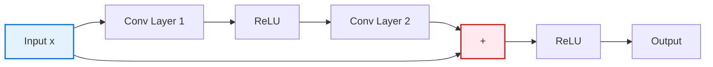

# Markdown-HTML Pipeline Examples

This document provides practical examples for using the Markdown-HTML pipeline tools.

## Installation

First, install all dependencies:

```bash
cd <repo>/wp   # the wp/ directory of your AI_Homepage checkout
python3 -m pip install -r requirements.txt   # the one dependency list
```

## Example 1: Convert Single Chapter from Markdown to HTML

**Scenario**: You've written a new chapter in Markdown and want to generate the HTML version.

All commands in this document run from `wp/` (the tools resolve `knowledge/` relative to
their own location, but the paths in these examples are written relative to `wp/`).

```bash
# Create a new chapter in Markdown
cat > knowledge/en/ML/transformer-introduction/chapter6-advanced-architectures.md << 'EOF'
---
title: "Chapter 6: Advanced Transformer Architectures"
chapter_title: "Chapter 6: GPT and BERT Variants"
subtitle: "Exploring Modern Language Model Architectures"
reading_time: "30-35 minutes"
difficulty: "Advanced"
code_examples: 5
exercises: 3
version: "1.0"
created_at: "2025-01-16"
---

## Introduction

This chapter explores advanced Transformer variants...
EOF

# Convert to HTML (locale inferred from the knowledge/en/ path)
python3 tools/convert_md_to_html.py knowledge/en/ML/transformer-introduction/chapter6-advanced-architectures.md

# Result: chapter6-advanced-architectures.html is created with styling and navigation
```

Pass a path that contains `knowledge/<en|jp>/` so the locale can be inferred; a bare
filename falls back to `en`, which would produce English labels on a Japanese chapter.
Match the series' existing filename pattern (this series uses `chapterN-name`, others use
`chapter-N`) or navigation links will not line up. Adding a chapter also changes the
published counts, so regenerate the derived data before committing:
`python3 scripts/update_index_stats.py --write`, `python3 scripts/build_search_index.py`,
`python3 scripts/build_sitemap.py`.

## Example 2: Extract Markdown from Existing HTML

**Scenario**: You have HTML files but no Markdown sources and want to start maintaining them in Markdown.

```bash
# Extract a single chapter
python3 tools/html_to_md.py knowledge/en/ML/transformer-introduction/chapter1-self-attention.html

# Result: chapter-1.md is created with frontmatter extracted from HTML

# Extract all chapters in a series
python3 tools/html_to_md.py knowledge/en/ML/transformer-introduction/

# Result: All chapter*.html files are converted to .md
```

## Example 3: Bidirectional Sync During Development

**Scenario**: You're actively developing content and want changes to sync automatically.

```bash
# Start watch mode
cd <repo>/wp   # the wp/ directory of your AI_Homepage checkout
python3 tools/sync_md_html.py knowledge/en/ML/transformer-introduction/ --watch

# Now in another terminal or editor:
# - Edit chapter-1.md → HTML automatically regenerates
# - Edit chapter-2.html → MD automatically extracts
# Press Ctrl+C to stop watching
```

## Example 4: Batch Convert Entire Dojo

**Scenario**: You want to regenerate all HTML files for the ML Dojo.

```bash
cd <repo>/wp   # the wp/ directory of your AI_Homepage checkout

# Convert all ML series
python3 tools/convert_md_to_html.py ML

# This will:
# - Find all series in knowledge/en/ML/
# - Convert all chapter*.md files to HTML
# - Generate navigation links automatically
```

## Example 5: Dry Run Before Making Changes

**Scenario**: You want to see what would change without actually modifying files.

```bash
# See what would be synced
cd <repo>/wp   # the wp/ directory of your AI_Homepage checkout
python3 tools/sync_md_html.py knowledge/en/ML/transformer-introduction/ --dry-run

# Output shows:
# - Which files would be converted
# - Direction of conversion (MD→HTML or HTML→MD)
# - No actual files are modified
```

## Example 6: Force Direction Override

**Scenario**: Both MD and HTML exist, but you want to force regeneration from MD regardless of timestamps.

```bash
cd <repo>/wp   # the wp/ directory of your AI_Homepage checkout

# Force Markdown to HTML conversion
python3 tools/sync_md_html.py knowledge/en/ML/transformer-introduction/ --force-direction md2html

# Force HTML to Markdown extraction (useful for recovering from HTML-only backups)
python3 tools/sync_md_html.py knowledge/en/ML/transformer-introduction/ --force-direction html2md
```

## Example 7: Working with Math-Heavy Content

**Scenario**: Creating a chapter with extensive LaTeX equations.

```bash
# Scratch directory — do not `cat >` over a real chapter, it would overwrite it
mkdir -p /tmp/mdpipe-demo
cat > /tmp/mdpipe-demo/chapter-1.md << 'EOF'
---
title: "Chapter 1: Limits and Continuity"
chapter_title: "Chapter 1: Fundamental Concepts of Calculus"
subtitle: "Understanding Limits and Continuous Functions"
reading_time: "35-40 minutes"
difficulty: "Intermediate"
code_examples: 4
exercises: 8
version: "1.0"
created_at: "2025-01-16"
---

## Limits

The limit of a function $f(x)$ as $x$ approaches $a$ is:

$$
\lim_{x \to a} f(x) = L
$$

This means for every $\epsilon > 0$, there exists $\delta > 0$ such that:

$$
0 < |x - a| < \delta \implies |f(x) - L| < \epsilon
$$

### Example

Calculate: $\lim_{x \to 2} \frac{x^2 - 4}{x - 2}$

**Solution**:

$$
\lim_{x \to 2} \frac{x^2 - 4}{x - 2} = \lim_{x \to 2} \frac{(x-2)(x+2)}{x-2} = \lim_{x \to 2} (x+2) = 4
$$
EOF

# Convert with math support (automatically handled by MathPreprocessor).
# An out-of-tree path has no locale, so it is treated as en.
python3 tools/convert_md_to_html.py /tmp/mdpipe-demo/chapter-1.md

# Result: HTML with properly rendered LaTeX equations via MathJax
```

## Example 8: Creating Content with Mermaid Diagrams

**Scenario**: Adding diagrams to explain complex architectures.

```bash
# Scratch directory again — cnn-introduction/chapter2-architectures.md is real content
mkdir -p /tmp/mdpipe-demo
cat > /tmp/mdpipe-demo/chapter-2.md << 'EOF'
---
title: "Chapter 2: CNN Architectures"
chapter_title: "Chapter 2: Classic and Modern Architectures"
subtitle: "From LeNet to ResNet"
reading_time: "40-45 minutes"
difficulty: "Intermediate"
code_examples: 6
exercises: 4
version: "1.0"
created_at: "2025-01-16"
---

## ResNet Architecture

The key innovation of ResNet is the skip connection:


```mermaid
graph LR
    A[Input x] --> B[Conv Layer 1]
    B --> C[ReLU]
    C --> D[Conv Layer 2]
    D --> E[+]
    A --> E
    E --> F[ReLU]
    F --> G[Output]

    style E fill:#ffebee,stroke:#c62828,stroke-width:2px
    style A fill:#e3f2fd,stroke:#1976d2,stroke-width:2px
```

The residual connection allows gradients to flow directly...
EOF

# Convert with diagram support (automatically handled by MermaidPreprocessor)
python3 tools/convert_md_to_html.py /tmp/mdpipe-demo/chapter-2.md

# Then validate the diagram the way CI does
python3 tools/validate_mermaid.py knowledge/en

# Result: HTML with interactive Mermaid diagram
```

## Example 9: Workflow Integration with Git

**Scenario**: Committing a chapter — Markdown source plus the HTML you generated from it.

```bash
cd <repo>/wp   # the wp/ directory of your AI_Homepage checkout

# Edit your chapter
vim knowledge/en/ML/transformer-introduction/chapter1-self-attention.md

# Generate HTML
python3 tools/convert_md_to_html.py knowledge/en/ML/transformer-introduction/chapter1-self-attention.md

# Commit BOTH the Markdown source and the generated HTML. The generated HTML is what
# GitHub Pages serves — it is never built in CI, so it must be committed.
git add knowledge/en/ML/transformer-introduction/chapter1-self-attention.md
git add knowledge/en/ML/transformer-introduction/chapter1-self-attention.html
git commit -m "content(ML): add transformer introduction chapter 1"

# Dual-commit rule: wp/ is the public deploy repo and the private root monorepo tracks
# the same files, so repeat the commit there with the same message (see ../../DEPLOYMENT.md).
cd ..                       # repository root
git add wp/knowledge/en/ML/transformer-introduction/chapter1-self-attention.{md,html}
git commit -m "content(ML): add transformer introduction chapter 1"
```

## Example 10: Recovering from HTML-Only Backup

**Scenario**: You lost your Markdown sources but have HTML backups.

```bash
cd <repo>/wp   # the wp/ directory of your AI_Homepage checkout

# Extract all HTML to Markdown. html_to_md.py globs chapter*.html in exactly the
# directory given (no recursion), so iterate over the series directories.
for s in knowledge/en/ML/*/; do
  python3 tools/html_to_md.py "$s" --output-dir "markdown_recovery/${s#knowledge/en/}"
done

# Review extracted Markdown
ls markdown_recovery/

# Move back to original locations if satisfied
find markdown_recovery -name "*.md" -exec sh -c 'cp "$1" "knowledge/en/${1#markdown_recovery/}"' _ {} \;

# Verify sync
python3 tools/sync_md_html.py knowledge/en/ML/ --dry-run
```

## Example 11: Custom Output Directory

**Scenario**: You want to generate HTML to a different directory for deployment.

```bash
cd <repo>/wp   # the wp/ directory of your AI_Homepage checkout

# Extract to custom directory
python3 tools/html_to_md.py knowledge/en/ML/transformer-introduction/ --output-dir docs/markdown/

# Result: Markdown files in docs/markdown/ directory
# Original HTML files remain unchanged
```

## Example 12: Processing Specific File Patterns

**Scenario**: Convert only certain chapters.

```bash
cd <repo>/wp   # the wp/ directory of your AI_Homepage checkout

# Convert only chapter 1 files across all series
for chapter1 in knowledge/en/ML/*/chapter-1.md; do
    python3 tools/convert_md_to_html.py "$chapter1"
done

# Extract only index files
for index in knowledge/en/ML/*/index.html; do
    python3 tools/html_to_md.py "$index"
done
```

## Example 13: Development Workflow with Live Preview

**Scenario**: Writing new content with instant HTML preview.

```bash
# Terminal 1: Start watch mode
cd <repo>/wp   # the wp/ directory of your AI_Homepage checkout
python3 tools/sync_md_html.py knowledge/en/ML/transformer-introduction/ --watch

# Terminal 2: Start local web server
cd knowledge/en/ML/transformer-introduction/
python3 -m http.server 8000

# Terminal 3: Edit Markdown
vim chapter-3.md

# Browser: Open http://localhost:8000/chapter-3.html
# Refresh browser after saving - see changes instantly!
```

## Example 14: Bulk Migration from Another Format

**Scenario**: You have content in another system and exported to HTML.

```bash
cd <repo>/wp   # the wp/ directory of your AI_Homepage checkout

# Extract all HTML to Markdown
python3 tools/html_to_md.py exported_html/ --output-dir knowledge/en/ML/new-series/

# Review and edit Markdown sources
# Clean up any conversion artifacts

# Regenerate clean HTML
python3 tools/convert_md_to_html.py knowledge/en/ML/new-series/
```

## Example 15: Verifying Conversion Quality

**Scenario**: Ensuring bidirectional conversion doesn't lose information.

```bash
cd <repo>/wp   # the wp/ directory of your AI_Homepage checkout

# Keep a copy of the Markdown source
cp knowledge/en/ML/transformer-introduction/chapter1-self-attention.md /tmp/original.md

# Round-trip the real file: MD → HTML (in place) → MD into /tmp
python3 tools/convert_md_to_html.py knowledge/en/ML/transformer-introduction/chapter1-self-attention.md
python3 tools/html_to_md.py knowledge/en/ML/transformer-introduction/chapter1-self-attention.html \
  --output-dir /tmp/roundtrip/

# Compare the source with the round-tripped result
diff /tmp/original.md /tmp/roundtrip/chapter-1.md
# Minor formatting differences are expected (spacing, etc.)
# Mathematical content and structure should be identical
```

## Troubleshooting Examples

### Example 16: Fixing Broken Navigation

```bash
# If navigation links are broken, ensure consistent naming:
cd knowledge/en/ML/transformer-introduction/

# Rename files to consistent pattern
mv chapter1-attention.md chapter-1.md
mv chapter2-architecture.md chapter-2.md
mv chapter3-training.md chapter-3.md

# Regenerate all HTML — back to wp/, and pass the path so the locale is inferred
cd ../../../..
python3 tools/convert_md_to_html.py knowledge/en/ML/transformer-introduction/
```

### Example 17: Debugging Math Rendering

```bash
# If math isn't rendering correctly, check the Markdown:
cat knowledge/en/FM/calculus-vector-analysis/chapter-1.md

# Ensure:
# 1. Inline math uses $...$
# 2. Display math uses $$...$$
# 3. No extra spaces: $x$ not $ x $
# 4. Underscores are fine inside math (preprocessor handles them)

# Regenerate
python3 tools/convert_md_to_html.py knowledge/en/FM/calculus-vector-analysis/chapter-1.md

# Test in browser
open knowledge/en/FM/calculus-vector-analysis/chapter-1.html
```

### Example 18: Checking Conversion Logs

```bash
# Run with detailed logging to debug issues
cd <repo>/wp   # the wp/ directory of your AI_Homepage checkout

# Convert with full output
python3 tools/convert_md_to_html.py knowledge/en/ML/transformer-introduction/ 2>&1 | tee conversion.log

# Check log for errors
grep -i error conversion.log
grep -i warning conversion.log
```

## Advanced Examples

### Example 19: Custom Template Modification

```bash
# Backup original converter
cp tools/convert_md_to_html.py tools/convert_md_to_html.py.backup

# Edit template colors
vim tools/convert_md_to_html.py
# Change color variables in HTML_HEADER_TEMPLATE

# Test with sample file
python3 tools/convert_md_to_html.py tools/test_sample_chapter.md

# If satisfied, convert entire Dojo
python3 tools/convert_md_to_html.py ML
```

### Example 20: Programmatic Usage

```python
#!/usr/bin/env python3
"""Custom batch conversion script."""

from pathlib import Path
import sys
sys.path.insert(0, 'tools')

from convert_md_to_html import convert_chapter

# Convert specific chapters based on custom logic
base_path = Path('knowledge/en/ML')

for series_dir in base_path.iterdir():
    if series_dir.is_dir():
        # Only convert chapters with "introduction" in series name
        if 'introduction' in series_dir.name:
            for md_file in series_dir.glob('chapter-*.md'):
                print(f"Converting {md_file}")
                convert_chapter(series_dir, md_file.name)
```

## Performance Tips

### Example 21: Parallel Conversion

```bash
# Convert multiple series in parallel using GNU parallel
cd <repo>/wp   # the wp/ directory of your AI_Homepage checkout

find knowledge/en/ML -type d -name "*-introduction" | \
    parallel -j 4 python3 tools/convert_md_to_html.py {}

# -j 4 means 4 parallel jobs
```

### Example 22: Incremental Builds

```bash
# Only sync files that have changed
cd <repo>/wp   # the wp/ directory of your AI_Homepage checkout

# Sync detects modification times automatically
python3 tools/sync_md_html.py knowledge/en/

# Only files where MD or HTML is newer will be converted
# Files already in sync are skipped
```

## Summary

These examples cover:
- Basic conversion workflows
- Bidirectional synchronization
- Development with live preview
- Batch processing
- Error recovery
- Custom integrations

For more details, see [README_MARKDOWN_PIPELINE.md](README_MARKDOWN_PIPELINE.md).
