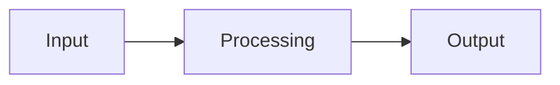
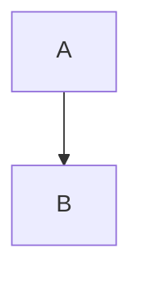

# Markdown-HTML Pipeline Quickstart Guide

## What is This?

A complete bidirectional conversion system for managing Markdown and HTML content in the AI Terakoya English knowledge base (`knowledge/en/`).

## 3-Minute Setup

```bash
# 1. Install dependencies
cd /Users/yusukehashimoto/Documents/pycharm/AI_Homepage/wp
pip install markdown pyyaml beautifulsoup4 html2text

# 2. Test the converter
python3 tools/convert_md_to_html_en.py --help

# 3. You're ready!
```

## The Three Tools

### 1. Markdown → HTML: `convert_md_to_html_en.py`

**Use when**: Creating new content in Markdown

```bash
# Single file
python3 tools/convert_md_to_html_en.py knowledge/en/ML/series/chapter-1.md

# Entire series
python3 tools/convert_md_to_html_en.py knowledge/en/ML/series/

# Entire Dojo
python3 tools/convert_md_to_html_en.py ML

# Everything
python3 tools/convert_md_to_html_en.py
```

**Features**:
- LaTeX math rendering (MathJax)
- Mermaid diagrams
- Code syntax highlighting
- Auto-navigation links
- Responsive design

### 2. HTML → Markdown: `html_to_md.py`

**Use when**: Extracting Markdown from existing HTML

```bash
# Single file
python3 tools/html_to_md.py knowledge/en/ML/series/chapter-1.html

# Entire series
python3 tools/html_to_md.py knowledge/en/ML/series/

# With custom output directory
python3 tools/html_to_md.py knowledge/en/ML/series/ --output-dir backup/
```

**Features**:
- Auto-extracts YAML frontmatter
- Preserves LaTeX math
- Recovers Mermaid diagrams
- Clean Markdown output
- Automatic backups

### 3. Bidirectional Sync: `sync_md_html.py`

**Use when**: Developing content and need auto-sync

```bash
# Auto-detect which file is newer
python3 tools/sync_md_html.py knowledge/en/ML/series/

# Force Markdown to HTML
python3 tools/sync_md_html.py knowledge/en/ML/series/ --force-direction md2html

# Force HTML to Markdown
python3 tools/sync_md_html.py knowledge/en/ML/series/ --force-direction html2md

# Dry run (preview only)
python3 tools/sync_md_html.py knowledge/en/ML/series/ --dry-run

# Watch mode (auto-sync on file changes)
python3 tools/sync_md_html.py knowledge/en/ML/series/ --watch
```

**Features**:
- Timestamp-based detection
- Bidirectional conversion
- Dry run preview
- Live watch mode
- Batch processing

## Common Workflows

### Workflow 1: New Content (Recommended)

```bash
# 1. Write in Markdown
vim knowledge/en/ML/transformer-introduction/chapter-6.md

# 2. Generate HTML
python3 tools/convert_md_to_html_en.py knowledge/en/ML/transformer-introduction/chapter-6.md

# 3. Preview in browser
open knowledge/en/ML/transformer-introduction/chapter-6.html

# 4. Commit Markdown (HTML optional depending on your strategy)
git add knowledge/en/ML/transformer-introduction/chapter-6.md
git commit -m "Add transformer chapter 6"
```

### Workflow 2: Edit Existing HTML

```bash
# 1. Edit HTML
vim knowledge/en/ML/transformer-introduction/chapter-1.html

# 2. Extract to Markdown
python3 tools/html_to_md.py knowledge/en/ML/transformer-introduction/chapter-1.html

# 3. Now you have both in sync
```

### Workflow 3: Live Development

```bash
# Terminal 1: Start watch mode
python3 tools/sync_md_html.py knowledge/en/ML/transformer-introduction/ --watch

# Terminal 2: Start web server
cd knowledge/en/ML/transformer-introduction/
python3 -m http.server 8000

# Terminal 3: Edit Markdown
vim chapter-1.md

# Browser: http://localhost:8000/chapter-1.html
# Refresh to see changes!
```

## Markdown Template

```markdown
---
title: "Chapter X: Topic Name"
chapter_title: "Chapter X: Detailed Title"
subtitle: "Brief description of what this chapter covers"
reading_time: "20-25 minutes"
difficulty: "Beginner"  # Beginner | Intermediate | Advanced
code_examples: 5
exercises: 3
version: "1.0"
created_at: "2025-01-16"
---

## Section Title

Your content here...

### Math Equations

Inline: $E = mc^2$

Display:
$$
\frac{\partial u}{\partial t} = \nabla^2 u
$$

### Code Example

```python
def hello_world():
    print("Hello, AI Terakoya!")
```

### Diagram



### Table

| Feature | Value |
|---------|-------|
| Speed   | Fast  |
| Quality | High  |
```

## Supported Dojos

- **FM**: Fundamental Math
- **MI**: Materials Informatics
- **ML**: Machine Learning
- **MS**: Materials Science
- **PI**: Process Informatics

## File Structure

```
knowledge/en/
├── ML/
│   ├── transformer-introduction/
│   │   ├── index.html
│   │   ├── chapter-1.md        ← Source
│   │   ├── chapter-1.html      ← Generated
│   │   ├── chapter-2.md
│   │   └── chapter-2.html
│   └── another-series/
└── [Other Dojos]/
```

## Quick Reference

| Task | Command |
|------|---------|
| Convert single MD file | `python3 tools/convert_md_to_html_en.py FILE.md` |
| Convert series | `python3 tools/convert_md_to_html_en.py SERIES_DIR/` |
| Convert Dojo | `python3 tools/convert_md_to_html_en.py ML` |
| Convert all | `python3 tools/convert_md_to_html_en.py` |
| Extract HTML to MD | `python3 tools/html_to_md.py FILE.html` |
| Auto-sync | `python3 tools/sync_md_html.py SERIES_DIR/` |
| Watch mode | `python3 tools/sync_md_html.py SERIES_DIR/ --watch` |
| Dry run | `python3 tools/sync_md_html.py SERIES_DIR/ --dry-run` |

## Troubleshooting

### Issue: "No module named 'markdown'"

**Solution**:
```bash
pip install markdown pyyaml beautifulsoup4 html2text
```

### Issue: Math not rendering

**Check**:
- Inline math uses `$...$`
- Display math uses `$$...$$`
- No spaces after opening `$`: `$x$` not `$ x$`

### Issue: Navigation broken

**Fix**:
- Use consistent naming: `chapter-1.md`, `chapter-2.md`
- Or: `chapter1-name.md`, `chapter2-name.md`
- Don't mix patterns

### Issue: Mermaid not showing

**Check**:
````markdown

````

Not `~~~mermaid` or indented code blocks.

## Need More Help?

- Full documentation: [README_MARKDOWN_PIPELINE.md](README_MARKDOWN_PIPELINE.md)
- Examples: [EXAMPLES_MARKDOWN_PIPELINE.md](EXAMPLES_MARKDOWN_PIPELINE.md)
- Requirements: [requirements-markdown-pipeline.txt](requirements-markdown-pipeline.txt)

## Next Steps

1. Try converting an existing HTML file to Markdown:
   ```bash
   python3 tools/html_to_md.py knowledge/en/ML/transformer-introduction/chapter-1.html
   ```

2. Edit the extracted Markdown

3. Regenerate HTML:
   ```bash
   python3 tools/convert_md_to_html_en.py knowledge/en/ML/transformer-introduction/chapter-1.md
   ```

4. Start using watch mode for development:
   ```bash
   python3 tools/sync_md_html.py knowledge/en/ML/transformer-introduction/ --watch
   ```

## Pro Tips

1. **Version Control**: Commit Markdown, generate HTML in CI/CD
2. **Live Preview**: Use watch mode + local web server
3. **Batch Operations**: Process entire Dojos at once
4. **Dry Run First**: Always test with `--dry-run` before bulk operations
5. **Backups**: The tools create `.bak` files automatically

---

**Happy writing!** 🚀

For questions or issues, refer to the full documentation in `README_MARKDOWN_PIPELINE.md`.
