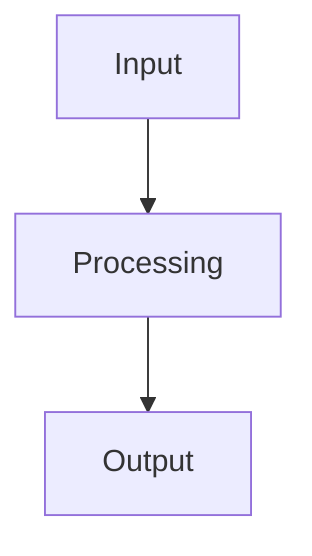
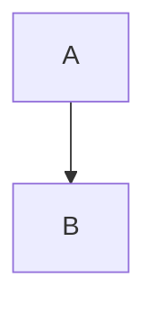

# Markdown-HTML Pipeline Documentation

## Overview

This pipeline provides comprehensive tools for managing Markdown and HTML content in the AI Terakoya English knowledge base. The system supports bidirectional conversion and synchronization between Markdown source files and production-ready HTML.

## Quick Start

### Installation

Install required dependencies:

```bash
pip install markdown pyyaml beautifulsoup4 html2text watchdog
```

### Basic Usage

```bash
# Convert Markdown to HTML
python tools/convert_md_to_html_en.py knowledge/en/ML/transformer-introduction/

# Convert HTML back to Markdown
python tools/html_to_md.py knowledge/en/ML/transformer-introduction/

# Bidirectional sync (auto-detects which is newer)
python tools/sync_md_html.py knowledge/en/ML/transformer-introduction/

# Watch mode for live development
python tools/sync_md_html.py knowledge/en/ML/transformer-introduction/ --watch
```

## Tools Overview

### 1. `convert_md_to_html_en.py` - Markdown to HTML Converter

Converts Markdown files with YAML frontmatter to production-ready HTML with full support for math equations, diagrams, and code highlighting.

#### Features

- **YAML Frontmatter Extraction**: Parses metadata from document headers
- **MathJax Integration**: Renders LaTeX equations (inline `$...$` and display `$$...$$`)
- **Mermaid Diagrams**: Converts code blocks to interactive diagrams
- **Code Highlighting**: Syntax highlighting with language detection
- **Responsive Design**: Mobile-friendly CSS with professional styling
- **Navigation Generation**: Automatic previous/next/index links
- **English Localization**: All labels and text in English

#### Usage

```bash
# Convert single file
python tools/convert_md_to_html_en.py knowledge/en/ML/transformer-introduction/chapter-1.md

# Convert entire series
python tools/convert_md_to_html_en.py knowledge/en/ML/transformer-introduction/

# Convert entire Dojo
python tools/convert_md_to_html_en.py ML

# Convert all English content
python tools/convert_md_to_html_en.py
```

#### Frontmatter Schema

```yaml
---
title: "Chapter 1: Introduction to Transformers"
chapter_title: "Chapter 1: Self-Attention Mechanism"
subtitle: "Understanding the core architecture of modern NLP"
reading_time: "25-30 minutes"
difficulty: "Intermediate"
code_examples: 8
exercises: 5
version: "1.0"
created_at: "2025-01-15"
---
```

**Field Descriptions:**

- `title`: Overall document title (used in browser tab)
- `chapter_title`: Displayed in page header
- `subtitle`: Descriptive subtitle
- `reading_time`: Estimated reading time (e.g., "20-25 minutes")
- `difficulty`: Beginner | Intermediate | Advanced
- `code_examples`: Number of code examples (integer)
- `exercises`: Number of exercises (integer)
- `version`: Version number (semantic versioning)
- `created_at`: Creation date (YYYY-MM-DD format)

#### Supported Markdown Features

**Basic Syntax:**
- Headers (H1-H6)
- Paragraphs, line breaks
- **Bold**, *italic*, ***bold italic***
- Lists (ordered, unordered, nested)
- Links, images
- Blockquotes
- Horizontal rules

**Extended Syntax:**
- Tables (GitHub-flavored)
- Fenced code blocks with language tags
- Task lists
- Details/summary (collapsible sections)

**Math Equations:**
```markdown
Inline math: $E = mc^2$

Display math:
$$
\frac{\partial u}{\partial t} = \nabla^2 u
$$
```

**Mermaid Diagrams:**
````markdown

````

**Code Blocks:**
````markdown
```python
def transformer_attention(Q, K, V):
    scores = torch.matmul(Q, K.transpose(-2, -1))
    attention = F.softmax(scores / sqrt(d_k), dim=-1)
    return torch.matmul(attention, V)
```
````

### 2. `html_to_md.py` - HTML to Markdown Converter

Reverse converter that extracts clean Markdown from HTML files, including automatic frontmatter generation from HTML metadata.

#### Features

- **Metadata Extraction**: Auto-generates YAML frontmatter from HTML headers/footers
- **Structure Preservation**: Maintains headings, lists, tables, links
- **Math Preservation**: Keeps LaTeX notation intact
- **Mermaid Recovery**: Converts `<div class="mermaid">` back to code blocks
- **Automatic Backup**: Creates `.bak` files before overwriting
- **Clean Output**: Removes navigation, scripts, and styling

#### Usage

```bash
# Convert single file
python tools/html_to_md.py knowledge/en/ML/transformer-introduction/chapter-1.html

# Convert entire series
python tools/html_to_md.py knowledge/en/ML/transformer-introduction/

# Custom output directory
python tools/html_to_md.py knowledge/en/ML/transformer-introduction/ --output-dir markdown_backup/

# No backup files
python tools/html_to_md.py knowledge/en/ML/transformer-introduction/ --no-backup
```

#### Extraction Logic

The converter intelligently extracts metadata from HTML:

```html
<!-- Extracted from header -->
<h1>Chapter 1: Self-Attention Mechanism</h1>
<p class="subtitle">Understanding the core architecture</p>
<span class="meta-item">📖 Reading Time: 25-30 minutes</span>
<span class="meta-item">📊 Difficulty: Intermediate</span>

<!-- Extracted from footer -->
<p><strong>Version</strong>: 1.0</p>
<p><strong>Created</strong>: 2025-01-15</p>
```

Becomes:

```yaml
---
title: "Chapter 1: Self-Attention Mechanism"
chapter_title: "Chapter 1: Self-Attention Mechanism"
subtitle: "Understanding the core architecture"
reading_time: "25-30 minutes"
difficulty: "Intermediate"
version: "1.0"
created_at: "2025-01-15"
---
```

### 3. `sync_md_html.py` - Bidirectional Synchronization

Intelligent sync tool that detects file modification times and automatically converts in the correct direction.

#### Features

- **Auto-Detection**: Compares modification times to determine sync direction
- **Bidirectional**: Supports both MD→HTML and HTML→MD
- **Force Direction**: Override auto-detection when needed
- **Dry Run**: Preview changes without modifying files
- **Watch Mode**: Live monitoring for development workflow
- **Batch Processing**: Handle entire series, Dojos, or knowledge base
- **Detailed Logging**: Clear status messages for all operations

#### Usage

```bash
# Auto-sync (detects which file is newer)
python tools/sync_md_html.py knowledge/en/ML/transformer-introduction/

# Force Markdown to HTML
python tools/sync_md_html.py knowledge/en/ML/transformer-introduction/ --force-direction md2html

# Force HTML to Markdown
python tools/sync_md_html.py knowledge/en/ML/transformer-introduction/ --force-direction html2md

# Dry run (see what would happen)
python tools/sync_md_html.py knowledge/en/ML/transformer-introduction/ --dry-run

# Watch mode for live development
python tools/sync_md_html.py knowledge/en/ML/transformer-introduction/ --watch

# Sync entire Dojo
python tools/sync_md_html.py ML

# Sync entire knowledge base
python tools/sync_md_html.py knowledge/en/
```

#### Sync Logic

The sync tool uses the following decision tree:

```
1. Check if both .md and .html exist
   ├─ Only .md exists → Convert MD→HTML
   ├─ Only .html exists → Extract HTML→MD
   └─ Both exist → Compare modification times
       ├─ .md newer → Convert MD→HTML
       └─ .html newer → Extract HTML→MD

2. Force direction overrides auto-detection

3. Watch mode monitors file changes and auto-syncs
```

#### Watch Mode

Watch mode is ideal for development:

```bash
# Start watching
python tools/sync_md_html.py knowledge/en/ML/transformer-introduction/ --watch

# Now edit either .md or .html files
# Changes are automatically synced in the correct direction
# Press Ctrl+C to stop
```

**Watch Mode Features:**
- Real-time monitoring of file changes
- 2-second debounce to avoid multiple syncs
- Handles both .md and .html modifications
- Logs all sync operations clearly

## Workflow Recommendations

### Workflow 1: Author in Markdown (Recommended)

**Best for:** Creating new content, version control, collaboration

1. Write content in Markdown with frontmatter:
   ```bash
   vim knowledge/en/ML/transformer-introduction/chapter-1.md
   ```

2. Generate HTML for production:
   ```bash
   python tools/convert_md_to_html_en.py knowledge/en/ML/transformer-introduction/chapter-1.md
   ```

3. Preview HTML in browser, iterate on Markdown

4. Commit Markdown to git (HTML is generated during build)

**Advantages:**
- Clean diffs in version control
- Easy to edit and review
- Portable format
- Build-time HTML generation

### Workflow 2: Edit Existing HTML

**Best for:** Quick fixes, content updates without Markdown source

1. Edit HTML file directly:
   ```bash
   vim knowledge/en/ML/transformer-introduction/chapter-1.html
   ```

2. Extract to Markdown for future maintenance:
   ```bash
   python tools/html_to_md.py knowledge/en/ML/transformer-introduction/chapter-1.html
   ```

3. Now both are in sync and you can use Workflow 1

**Advantages:**
- Recover Markdown from HTML-only content
- Quick edits without conversion overhead
- Maintain both formats

### Workflow 3: Live Development with Auto-Sync

**Best for:** Rapid iteration, testing, prototyping

1. Start watch mode:
   ```bash
   python tools/sync_md_html.py knowledge/en/ML/transformer-introduction/ --watch
   ```

2. Edit Markdown in your editor

3. HTML automatically regenerates

4. Refresh browser to see changes

5. Or edit HTML and extract back to Markdown automatically

**Advantages:**
- Instant feedback loop
- No manual conversion steps
- Freedom to edit either format
- Perfect for live demos

### Workflow 4: Batch Migration

**Best for:** Converting legacy HTML, bulk updates

1. Extract all HTML to Markdown:
   ```bash
   python tools/html_to_md.py knowledge/en/ML/
   ```

2. Review and edit Markdown sources

3. Regenerate all HTML:
   ```bash
   python tools/convert_md_to_html_en.py ML
   ```

4. Verify with sync tool:
   ```bash
   python tools/sync_md_html.py knowledge/en/ML/ --dry-run
   ```

## Integration with Existing Tools

### Link Checking

After converting or syncing, verify links:

```bash
# Check links in converted HTML
python tools/check_links.py knowledge/en/ML/transformer-introduction/

# Fix broken links automatically
python tools/fix_broken_links.py knowledge/en/ML/transformer-introduction/

# Re-sync after fixes
python tools/sync_md_html.py knowledge/en/ML/transformer-introduction/ --force-direction html2md
```

### CI/CD Integration

Example GitHub Actions workflow:

```yaml
name: Build Documentation

on:
  push:
    paths:
      - 'knowledge/en/**/*.md'

jobs:
  build:
    runs-on: ubuntu-latest
    steps:
      - uses: actions/checkout@v3

      - name: Set up Python
        uses: actions/setup-python@v4
        with:
          python-version: '3.9'

      - name: Install dependencies
        run: |
          pip install markdown pyyaml beautifulsoup4 html2text

      - name: Convert Markdown to HTML
        run: |
          python tools/convert_md_to_html_en.py knowledge/en/

      - name: Check links
        run: |
          python tools/check_links.py knowledge/en/

      - name: Commit generated HTML
        run: |
          git config user.name "GitHub Actions"
          git config user.email "actions@github.com"
          git add knowledge/en/**/*.html
          git commit -m "Auto-generate HTML from Markdown" || exit 0
          git push
```

### Pre-commit Hooks

Example `.pre-commit-config.yaml`:

```yaml
repos:
  - repo: local
    hooks:
      - id: markdown-to-html
        name: Convert Markdown to HTML
        entry: python tools/convert_md_to_html_en.py
        language: system
        files: '^knowledge/en/.*\.md$'
        pass_filenames: true
```

## Troubleshooting

### Common Issues

#### 1. **Math Rendering Issues**

**Problem:** Underscores in equations rendered as italics

**Solution:** The `MathPreprocessor` should handle this automatically. If issues persist:

```python
# Manually escape in Markdown
$$
f\_score = \frac{2 \cdot precision \cdot recall}{precision + recall}
$$
```

#### 2. **Mermaid Diagrams Not Displaying**

**Problem:** Diagrams show as code blocks

**Solution:** Ensure proper code fence syntax:

````markdown

````

Not:
````markdown
~~~mermaid  <!-- Wrong delimiter -->
graph TD
    A --> B
~~~
````

#### 3. **Navigation Links Broken**

**Problem:** Previous/Next chapter links don't work

**Solution:** Ensure consistent file naming:
- Use `chapter-1.md`, `chapter-2.md` OR
- Use `chapter1-intro.md`, `chapter2-basics.md`
- Don't mix patterns in same series

#### 4. **Frontmatter Not Parsed**

**Problem:** Metadata not appearing in HTML

**Solution:** Check YAML syntax:

```yaml
---
title: "Valid Title"           # ✓ Correct
difficulty: Intermediate       # ✓ Correct
code_examples: 5               # ✓ Correct

title: Invalid "Title"         # ✗ Wrong - quotes inside unquoted string
difficulty: Inter-mediate      # ✗ Wrong - hyphen without quotes
code_examples: "5"             # ⚠ Works but should be integer
---
```

#### 5. **HTML Extraction Produces Messy Markdown**

**Problem:** Too many escaped characters, broken formatting

**Solution:** This usually happens with manually edited HTML. Clean it first:

```bash
# Re-generate from Markdown if available
python tools/convert_md_to_html_en.py knowledge/en/ML/series/chapter-1.md

# Or manually clean HTML structure before extraction
```

#### 6. **Watch Mode Not Working**

**Problem:** `watchdog` import error

**Solution:** Install the optional dependency:

```bash
pip install watchdog
```

#### 7. **File Permissions Errors**

**Problem:** Cannot write HTML files

**Solution:** Check file permissions:

```bash
# Fix permissions
chmod 644 knowledge/en/ML/series/*.html

# Or use sudo (not recommended)
sudo python tools/convert_md_to_html_en.py knowledge/en/ML/series/
```

### Debugging

Enable detailed logging:

```python
# Add to script
import logging
logging.basicConfig(level=logging.DEBUG)
```

Or use verbose mode:

```bash
# Run with Python -v flag
python -v tools/convert_md_to_html_en.py knowledge/en/ML/series/

# Check for import issues
python -c "import markdown; import yaml; import bs4; import html2text; print('All dependencies OK')"
```

## Advanced Usage

### Custom Templates

Modify templates in `convert_md_to_html_en.py`:

```python
# Change color scheme
HTML_HEADER_TEMPLATE = '''
:root {{
    --color-primary: #1a365d;     /* Dark blue */
    --color-accent: #2b6cb0;      /* Blue */
    /* ... */
}}
'''

# Add custom CSS classes
# Add analytics tracking
# Customize footer content
```

### Extending Markdown Syntax

Add custom Markdown extensions:

```python
from markdown.extensions import Extension
from markdown.inlinepatterns import InlineProcessor

class HighlightExtension(Extension):
    """Custom ==highlight== syntax."""

    def extendMarkdown(self, md):
        HIGHLIGHT_PATTERN = r'==(.*?)=='
        md.inlinePatterns.register(
            HighlightProcessor(HIGHLIGHT_PATTERN, md),
            'highlight',
            175
        )

# Then add to converter
md = markdown.Markdown(
    extensions=[
        MathExtension(),
        MermaidExtension(),
        HighlightExtension(),  # Your custom extension
        'tables',
        'fenced_code',
    ]
)
```

### Batch Operations with Find

Process specific patterns:

```bash
# Convert all transformer-related chapters
find knowledge/en -path "*/transformer*/chapter*.md" -exec python tools/convert_md_to_html_en.py {} \;

# Extract all chapter-1 files
find knowledge/en -name "chapter-1.html" -exec python tools/html_to_md.py {} \;

# Sync all ML Dojo series
find knowledge/en/ML -type d -name "*-introduction" -exec python tools/sync_md_html.py {} \;
```

### Programmatic Usage

Use as Python modules:

```python
from pathlib import Path
from tools.convert_md_to_html_en import convert_chapter
from tools.html_to_md import convert_html_file
from tools.sync_md_html import FilePair, sync_file_pair

# Convert programmatically
series_path = Path("knowledge/en/ML/transformer-introduction")
convert_chapter(series_path, "chapter-1.md")

# Extract programmatically
html_path = Path("knowledge/en/ML/transformer-introduction/chapter-1.html")
convert_html_file(html_path)

# Sync programmatically
pair = FilePair(Path("knowledge/en/ML/transformer-introduction/chapter-1.md"))
sync_file_pair(pair, force_direction='md2html')
```

## Best Practices

### 1. Version Control Strategy

**Commit Markdown, Generate HTML:**

```bash
# .gitignore
knowledge/en/**/*.html    # Don't commit HTML
knowledge/en/**/*.html.tmp
knowledge/en/**/*.md.bak
```

**Or Commit Both:**

```bash
# Keep both in git for deployment simplicity
git add knowledge/en/**/*.md
git add knowledge/en/**/*.html
```

### 2. File Naming Conventions

**Consistent Naming:**
- ✓ `chapter-1.md`, `chapter-2.md`, `chapter-3.md`
- ✓ `chapter1-introduction.md`, `chapter2-theory.md`
- ✗ Mix of both patterns
- ✗ `chapter_1.md`, `ch-1.md`, `1-chapter.md`

### 3. Frontmatter Management

**Always Include:**
- `title` - Required for HTML `<title>`
- `chapter_title` - Required for header display
- `reading_time` - User experience metric
- `difficulty` - Helps users gauge content

**Optional but Recommended:**
- `subtitle` - Adds context
- `code_examples` - Sets expectations
- `exercises` - Educational value
- `version` - Track updates
- `created_at` - Provenance

### 4. Content Organization

**Directory Structure:**

```
knowledge/en/
├── FM/  (Fundamental Math)
├── MI/  (Materials Informatics)
├── ML/  (Machine Learning)
├── MS/  (Materials Science)
└── PI/  (Process Informatics)
    ├── series-name-introduction/
    │   ├── index.html          # Series overview
    │   ├── chapter-1.md        # Source
    │   ├── chapter-1.html      # Generated
    │   ├── chapter-2.md
    │   ├── chapter-2.html
    │   └── ...
    └── another-series/
```

### 5. Testing Before Deployment

```bash
# 1. Dry run to check what would change
python tools/sync_md_html.py knowledge/en/ML/ --dry-run

# 2. Run link checker
python tools/check_links.py knowledge/en/ML/

# 3. Convert with logging
python tools/convert_md_to_html_en.py knowledge/en/ML/ > conversion.log 2>&1

# 4. Validate HTML (optional)
find knowledge/en -name "*.html" -exec tidy -q -e {} \;
```

## Support and Contributing

### Getting Help

1. Check this documentation
2. Review error logs carefully
3. Test with minimal examples
4. Check Python version (requires 3.8+)

### Contributing Improvements

To improve the pipeline:

1. Test changes thoroughly
2. Update this documentation
3. Add type hints to new functions
4. Include docstrings
5. Follow existing code style

### Reporting Issues

Include:
- Python version
- Command used
- Full error message
- Sample Markdown/HTML that fails
- Expected vs. actual behavior

## License

This pipeline is part of the AI Terakoya project.

**License:** Creative Commons BY 4.0

© 2025 AI Terakoya. All rights reserved.
