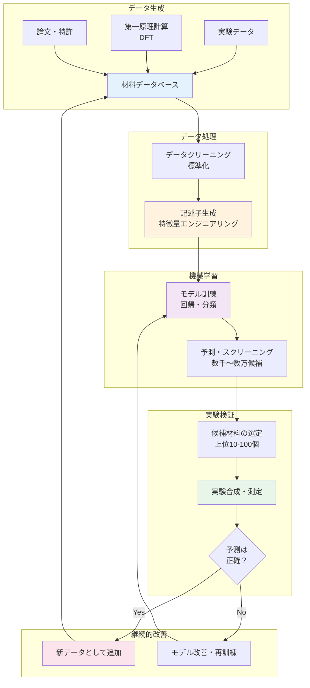

# 第2章：MIの基礎知識 - 概念・手法・エコシステム

## 学習目標

この章を読むことで、以下を習得できます：
- MIの定義と関連分野（計算材料科学、ケモインフォマティクス等）との違いを説明できる
- 主要な材料データベース（Materials Project、AFLOW、OQMD、JARVIS）の特徴と使い分けを理解する
- MIの基本ワークフロー5ステップ（問題定式化から検証まで）を詳細に説明できる
- 材料記述子（組成、構造、物性ベース）の種類と重要性を理解する
- MI領域で頻出する専門用語20語を正しく使用できる

---

## 2.1 MIとは何か：定義と関連分野

### 2.1.1 Materials Informaticsの語源と歴史

**マテリアルズ・インフォマティクス（Materials Informatics, MI）**という用語は、2000年代初頭から使われるようになりました。特に**2011年の米国Materials Genome Initiative (MGI)**の発足により、世界的に注目を集めるようになります [1]。

**MGIの目標:**
- 新材料の開発期間を従来の半分に短縮
- 開発コストを大幅に削減
- 計算・実験・データの統合による加速

この取り組みは、ヒトゲノムプロジェクトが生物学を変革したように、材料科学を根本から変える可能性を秘めていると期待されました。

### 2.1.2 定義

**マテリアルズ・インフォマティクス（Materials Informatics, MI）**とは、材料科学とデータサイエンスを融合させた学問分野です。大量の材料データと機械学習などの情報科学技術を活用して、新材料の発見や材料特性の予測を加速する手法です。

**簡潔な定義:**
> 「データとAIの力で材料開発をスピードアップする科学」

**コア要素:**
1. **データ**: 実験データ、計算データ、論文からの知識
2. **計算**: 第一原理計算、分子動力学シミュレーション
3. **機械学習**: 予測モデル、最適化アルゴリズム
4. **実験検証**: 予測結果の確認とデータ追加

### 2.1.3 関連分野との比較

MIは複数の分野と関連していますが、それぞれ異なる焦点を持っています。

| 分野 | 対象 | 主な手法 | 目的 | MIとの関係 |
|-----|------|---------|------|-----------|
| **計算材料科学<br>(Computational Materials Science)** | 材料の物理・化学現象 | DFT、分子動力学 | 材料特性の理論予測 | MIはこのデータを活用 |
| **ケモインフォマティクス<br>(Cheminformatics)** | 化合物・低分子 | QSAR、分子記述子 | 薬物設計、分子特性予測 | 記述子の概念を共有 |
| **バイオインフォマティクス<br>(Bioinformatics)** | 生体分子、DNA/タンパク質 | 配列解析、構造予測 | 遺伝情報の解読 | データ駆動型アプローチを共有 |
| **マテリアルズ・インフォマティクス<br>(MI)** | 固体材料全般 | 機械学習、ベイズ最適化 | 新材料の発見・設計 | - |

**MIの独自性:**
- **逆設計アプローチ**: 目標特性から材料を設計（従来は材料から特性を計算）
- **多様な材料タイプ**: 金属、セラミックス、半導体、ポリマーなど幅広い対象
- **実験との強い連携**: 計算だけでなく、実験検証を重視

### 2.1.4 Forward Design vs Inverse Design

**従来の材料開発（Forward Design）:**
```
材料組成 → 構造・特性を計算/測定 → 結果を評価
```
- 研究者が候補材料を提案
- 試行錯誤の繰り返し
- 時間がかかる

**MIのアプローチ（Inverse Design）:**
```
目標特性 → 機械学習で候補材料を予測 → 上位候補を実験
```
- AIが最適な材料を提案
- 大量の候補を効率的にスクリーニング
- 大幅な時間短縮

**逆設計の具体例:**
「バンドギャップが2.0 eVの半導体材料が欲しい」
→ MIシステムが候補材料リストを自動生成
→ 研究者は上位10個だけを実験で検証

---

## 2.2 MI用語集：必須の20用語

MIを学ぶ上で頻出する専門用語をまとめました。初学者の方は、これらの用語を正しく理解することが第一歩です。

### データ・モデル関連（1-7）

| 用語（日本語） | 用語（英語） | 説明 |
|--------------|------------|------|
| **1. 記述子** | Descriptor | 材料の特徴を数値で表現したもの。例：電気陰性度、原子半径、格子定数。機械学習モデルへの入力として使用される。 |
| **2. 特徴量エンジニアリング** | Feature Engineering | 生データから機械学習に適した記述子を設計・選択するプロセス。モデルの性能を左右する重要なステップ。 |
| **3. スクリーニング** | Screening | 大量の候補材料の中から、目的の特性を持つものを効率的に選び出すこと。計算スクリーニングでは数千〜数万種類を短時間で評価可能。 |
| **4. 過学習** | Overfitting | モデルが訓練データを「暗記」してしまい、未知のデータへの予測性能が低下する現象。データ数が少ない材料科学では特に注意が必要。 |
| **5. 交差検証** | Cross-validation | モデルの汎化性能を評価する手法。データをK個に分割し、1つをテスト、残りを訓練に使う操作をK回繰り返す。 |
| **6. アンサンブル法** | Ensemble Methods | 複数のモデルの予測を組み合わせることで、より高精度な予測を実現する手法。例：ランダムフォレスト、勾配ブースティング。 |
| **7. 検証** | Validation | 予測結果が実際の材料特性と一致するか、実験または高精度計算で確認するプロセス。MIの信頼性を担保する重要なステップ。 |

### 計算手法関連（8-13）

| 用語（日本語） | 用語（英語） | 説明 |
|--------------|------------|------|
| **8. DFT** | Density Functional Theory<br>（密度汎関数理論） | 量子力学に基づいて材料の電子状態を計算する手法。材料特性（バンドギャップ、形成エネルギー等）を理論的に予測できる。 |
| **9. 能動学習** | Active Learning | モデルが「次にどのデータを取得すべきか」を提案する学習方法。実験コストを最小化しながらモデルを改善できる。 |
| **10. ベイズ最適化** | Bayesian Optimization | 実験回数を最小限に抑えながら最適な材料を探索する手法。ガウス過程を用いて次の実験候補を決定する。 |
| **11. 転移学習** | Transfer Learning | ある材料系で学習したモデルを、関連する別の材料系に応用する手法。データが少ない新規材料系でも高精度な予測が可能。 |
| **12. グラフニューラルネットワーク** | Graph Neural Networks (GNN) | 結晶構造をグラフ（原子=ノード、結合=エッジ）として扱い、構造情報を直接学習するニューラルネットワーク。近年注目の手法。 |
| **13. ハイスループット計算** | High-throughput Computation | 大量の材料について自動的に第一原理計算を実行する手法。Materials Projectは14万種類以上の材料をハイスループット計算で評価。 |

### 材料科学関連（14-20）

| 用語（日本語） | 用語（英語） | 説明 |
|--------------|------------|------|
| **14. 結晶構造** | Crystal Structure | 原子が規則的に配列した構造。FCC（面心立方）、BCC（体心立方）、HCP（六方最密）などの種類がある。 |
| **15. 空間群** | Space Group | 結晶構造の対称性を分類する230種類の数学的グループ。材料の物性と密接に関連。 |
| **16. バンドギャップ** | Bandgap | 半導体や絶縁体において、電子が占有する価電子帯と空の伝導帯の間のエネルギー差。太陽電池や半導体デバイスの設計に重要。 |
| **17. 形成エネルギー** | Formation Energy | 材料が元素から生成される際のエネルギー変化。負の値は安定な材料を示す。 |
| **18. 状態図** | Phase Diagram | 温度・圧力・組成の関数として、材料がどの相（固体、液体、気体）で存在するかを示す図。合金設計に不可欠。 |
| **19. 多目的最適化** | Multi-objective Optimization | 複数の特性（例：軽量性と強度）を同時に最適化する手法。通常、トレードオフの関係にある特性をバランス良く改善する。 |
| **20. パレートフロント** | Pareto Front | 多目的最適化において、すべての目的で最良ではないが、どの目的も改善できない解の集合。最適な材料の候補群を表す。 |

**用語学習のポイント:**
- まずは1-7（データ・モデル関連）を優先的に理解
- 8-13（計算手法）は中級レベルで詳細を学習
- 14-20（材料科学）は材料科学の基礎知識と合わせて復習

---

## 2.3 材料データベースの全体像

MIの基盤となる材料データベースについて、主要な4つを詳しく比較します。

### 2.3.1 主要データベースの詳細比較

| データベース名 | 材料数 | データソース | 主な特性データ | ライセンス | アクセス方法 | 利点 | 用途例 |
|--------------|--------|------------|--------------|----------|-----------|------|-------|
| **Materials Project** | 140,000+ | DFT計算（VASP） | バンドギャップ、形成エネルギー、弾性定数、相安定性 | **CC BY 4.0**<br>（学術・非営利のみ） | Web UI、API（Python: `pymatgen`）、要登録（無料） | 最大規模、活発なコミュニティ、豊富なツール | 電池材料、半導体、構造材料 |
| **AFLOW** | 3,500,000+ | DFT計算（VASP） | 結晶構造、電子構造、熱力学的安定性 | **CC BY 4.0** | Web UI、API（RESTful）、登録不要 | 最多の結晶構造データ、標準化された命名規則 | 結晶構造探索、新規構造予測 |
| **OQMD** | 1,000,000+ | DFT計算（VASP） | 形成エネルギー、安定性、状態図 | **ODbL 1.0**<br>（引用必須） | Web UI、API（Python: `qmpy`）、登録不要 | 状態図計算に強い、合金データが豊富 | 合金設計、相安定性評価 |
| **JARVIS** | 70,000+ | DFT計算（VASP）<br>機械学習予測 | 光学特性、機械特性、トポロジカル特性 | **NIST Public Data**<br>（パブリックドメイン） | Web UI、API（Python: `jarvis-tools`）、登録不要 | 多様な物性、機械学習モデル提供 | 光学材料、トポロジカル材料 |

### 2.3.2 データベースの使い分け

**1. Materials Project**
- **いつ使うか**: 電池材料、半導体、一般的な無機材料の探索
- **強み**:
  - Web UIが直感的で初心者に優しい
  - Pythonライブラリ（`pymatgen`）が充実
  - コミュニティが活発で情報が豊富
- **弱み**: 一部の構造タイプでは網羅性が低い

**2. AFLOW**
- **いつ使うか**: 新規結晶構造の探索、構造類似性の検索
- **強み**:
  - 最も多くの結晶構造（350万種類）
  - 標準化された結晶構造記述（AFLOW prototype）
  - 構造類似性検索が高速
- **弱み**: 物性データの種類がMaterials Projectより少ない

**3. OQMD**
- **いつ使うか**: 合金の状態図計算、相安定性の詳細評価
- **強み**:
  - 状態図計算に特化
  - 多元系合金のデータが充実
  - 温度依存性の評価が可能
- **弱み**: Web UIの使い勝手がやや劣る

**4. JARVIS**
- **いつ使うか**: 光学材料、トポロジカル材料、機械学習モデルの利用
- **強み**:
  - 機械学習モデルが統合されている
  - 光学特性（誘電率、屈折率）が充実
  - トポロジカル特性の計算
- **弱み**: データ数が他より少ない

### 2.3.3 データベース活用の実践例

**シナリオ1: リチウムイオン電池の新規正極材料を探したい**

1. **Materials Projectで検索**:
   - 条件: Liを含み、電圧が3.5-4.5V、安定
   - 候補: 100種類が見つかる

2. **上位10種類を選定**:
   - 容量、電圧、安定性のバランスで評価

3. **OQMDで相安定性を確認**:
   - 温度変化での分解の可能性をチェック

4. **実験で検証**:
   - 上位3種類を実際に合成

**シナリオ2: 透明導電性材料（太陽電池用）を探したい**

1. **JARVISで検索**:
   - 条件: バンドギャップ > 3.0 eV（透明）、電気伝導性が高い
   - 候補: 50種類

2. **Materials Projectで追加情報**:
   - 形成エネルギー、熱安定性を確認

3. **AFLOWで類似構造を探索**:
   - 見つかった有望材料と類似の構造を探す

4. **実験検証**

### 2.3.4 データベースアクセスの実例

**Materials Project API (Python)の使用例:**

```python
from pymatgen.ext.matproj import MPRester

# APIキーを取得: https://materialsproject.org
with MPRester("YOUR_API_KEY") as mpr:
    # LiCoO2の情報を取得
    data = mpr.get_data("mp-1234")  # material_id

    print(f"化学式: {data[0]['pretty_formula']}")
    print(f"バンドギャップ: {data[0]['band_gap']} eV")
    print(f"形成エネルギー: {data[0]['formation_energy_per_atom']} eV/atom")
```

**重要なポイント:**
- 各データベースは相補的な関係
- 1つのデータベースだけでなく、複数を併用することが推奨される
- データの信頼性を確保するため、異なるデータベース間で結果を比較することが重要

### 2.3.5 データライセンスと引用方法

材料データベースの利用には、適切なライセンス理解と引用が不可欠です。不適切な使用は法的問題や倫理的問題を引き起こす可能性があります。

#### ライセンスの詳細

**Materials Project - CC BY 4.0（Creative Commons Attribution 4.0）**

- **許可される使用:**
  - ✅ 学術研究での使用
  - ✅ 論文・発表での利用
  - ✅ 教育目的での使用
  - ✅ 非営利プロジェクトでの使用

- **制限事項:**
  - ⚠️ **商業利用には別途許可が必要**
  - ⚠️ 企業での製品開発に使用する場合は事前に連絡
  - ⚠️ データの再配布時は必ず出典を明記

- **引用方法:**
  ```
  Jain, A., Ong, S. P., Hautier, G., Chen, W., Richards, W. D., et al. (2013).
  "Commentary: The Materials Project: A materials genome approach to accelerating
  materials innovation." APL Materials, 1(1), 011002.
  DOI: 10.1063/1.4812323
  ```

- **APIキー取得:** https://materialsproject.org → アカウント登録（無料）→ API Keys

**AFLOW - CC BY 4.0**

- **許可される使用:**
  - ✅ 学術・商業問わず自由に使用可能
  - ✅ データの加工・再配布も可能（出典明記が条件）

- **引用方法:**
  ```
  Curtarolo, S., Setyawan, W., Hart, G. L., Jahnatek, M., et al. (2012).
  "AFLOW: An automatic framework for high-throughput materials discovery."
  Computational Materials Science, 58, 218-226.
  DOI: 10.1016/j.commatsci.2012.02.005
  ```

- **アクセス:** 登録不要、APIも自由に利用可能

**OQMD - Open Database License (ODbL) 1.0**

- **許可される使用:**
  - ✅ 学術・商業問わず使用可能
  - ✅ データの加工・再配布も可能

- **必須条件:**
  - ✅ **必ず引用を記載**
  - ✅ 派生データも同じライセンス（ODbL）で公開

- **引用方法:**
  ```
  Saal, J. E., Kirklin, S., Aykol, M., Meredig, B., & Wolverton, C. (2013).
  "Materials Design and Discovery with High-Throughput Density Functional Theory:
  The Open Quantum Materials Database (OQMD)." JOM, 65(11), 1501-1509.
  DOI: 10.1007/s11837-013-0755-4
  ```

- **アクセス:** 登録不要

**JARVIS - NIST Public Data（パブリックドメイン相当）**

- **許可される使用:**
  - ✅ 完全に自由に使用可能（米国政府のデータ）
  - ✅ 学術・商業問わず無制限
  - ✅ 引用は推奨だが必須ではない

- **推奨引用方法:**
  ```
  Choudhary, K., Garrity, K. F., Reid, A. C. E., et al. (2020).
  "The joint automated repository for various integrated simulations (JARVIS)
  for data-driven materials design." npj Computational Materials, 6(1), 173.
  DOI: 10.1038/s41524-020-00440-1
  ```

- **アクセス:** 登録不要

#### 商業利用の注意点

**⚠️ 重要: Materials Projectの商業利用**

Materials Projectは**学術・非営利目的のみ**を対象としたCC BY 4.0ライセンスです。以下のケースは商業利用とみなされます:

- ❌ 企業での製品開発（材料選定、特性予測など）
- ❌ 商用サービスでのデータ利用
- ❌ 有償コンサルティング業務での使用

**商業利用したい場合:**
1. Materials Projectの運営チームに連絡（contact@materialsproject.org）
2. 利用目的と範囲を説明
3. 商業ライセンスの取得（条件は要相談）

**AFLOW・OQMD・JARVISは商業利用も可能:**
- ただし、適切な引用は必須
- 派生データの公開時はライセンスに注意

#### 再配布の可否

| データベース | 元データの再配布 | 加工データの再配布 | 条件 |
|------------|---------------|----------------|------|
| **Materials Project** | ⚠️ 要確認 | ⚠️ 要確認 | 出典明記、学術目的のみ |
| **AFLOW** | ✅ 可能 | ✅ 可能 | 出典明記必須 |
| **OQMD** | ✅ 可能 | ✅ 可能 | ODbLライセンス維持、出典明記 |
| **JARVIS** | ✅ 可能 | ✅ 可能 | 制限なし（引用推奨） |

#### Pythonコードでの引用例

論文やレポートだけでなく、コード内にも引用を記載することが推奨されます:

```python
"""
Materials Project API Example

Data source: Materials Project (https://materialsproject.org)
License: CC BY 4.0 (academic use only)
Citation: Jain et al. (2013), APL Materials, 1(1), 011002.
          DOI: 10.1063/1.4812323

Commercial use requires separate permission from Materials Project.
"""

from pymatgen.ext.matproj import MPRester

# APIキーは環境変数から読み込むことを推奨
import os
API_KEY = os.getenv("MP_API_KEY")  # セキュリティのため直接記載しない

with MPRester(API_KEY) as mpr:
    # データ取得コード
    pass
```

#### レート制限とエチケット

各データベースには、サーバー負荷を避けるためのレート制限があります:

| データベース | レート制限 | 推奨事項 |
|------------|-----------|---------|
| **Materials Project** | ~5リクエスト/秒 | 大量取得時は sleep() を挿入 |
| **AFLOW** | 明示的制限なし | 常識的な範囲で使用 |
| **OQMD** | 明示的制限なし | 並列リクエストは避ける |
| **JARVIS** | 明示的制限なし | バッチダウンロード推奨 |

**推奨コード例（レート制限への対応）:**

```python
import time
from pymatgen.ext.matproj import MPRester

with MPRester(API_KEY) as mpr:
    material_ids = ["mp-1234", "mp-5678", ...]  # 大量のID

    results = []
    for i, mat_id in enumerate(material_ids):
        data = mpr.get_data(mat_id)
        results.append(data)

        # 100件ごとに1秒待機（レート制限への配慮）
        if (i + 1) % 100 == 0:
            time.sleep(1)
            print(f"取得完了: {i+1}/{len(material_ids)}")
```

#### チェックリスト: データベース利用前の確認

- [ ] 使用目的は学術か商業か？
- [ ] 商業利用の場合、ライセンスは許可しているか？
- [ ] 引用方法を確認したか？
- [ ] APIキーが必要な場合、取得したか？
- [ ] レート制限を理解し、対応コードを書いたか？
- [ ] データを再配布する予定がある場合、ライセンス条件を満たしているか？

---

## 2.4 MIエコシステム：データの流れ

MIは単独の技術ではなく、複数の要素が連携するエコシステムです。以下の図は、MIにおけるデータの流れを示しています。



**図の読み方:**
1. **データ生成**: 実験、計算、文献からデータを集める
2. **データ処理**: 生データを機械学習に適した形式に変換
3. **機械学習**: モデルを訓練し、大量の候補を予測
4. **実験検証**: 有望な候補を実験で確認
5. **継続的改善**: 結果をデータに追加し、モデルを改善

**フィードバックループの重要性:**
- 予測が正確 → データを追加してモデルをさらに改善
- 予測が不正確 → モデルを見直し、記述子や学習方法を変更
- このサイクルを繰り返すことで、モデルの精度が向上

---

## 2.5 MIの基本ワークフロー：詳細版

第1章では4ステップのワークフローを紹介しましたが、ここではより実践的な**5ステップ**に拡張します。

### 2.5.1 全体像

```mermaid
graph LR
    A[Step 0:<br>問題定式化] --> B[Step 1:<br>データ収集]
    B --> C[Step 2:<br>モデル構築]
    C --> D[Step 3:<br>予測・スクリーニング]
    D --> E[Step 4:<br>実験検証]
    E --> F[Step 5:<br>データ追加・改善]
    F - 継続的改善 .-> B

    style A fill:#ffebee
    style B fill:#e3f2fd
    style C fill:#fff3e0
    style D fill:#f3e5f5
    style E fill:#e8f5e9
    style F fill:#fce4ec
```

### 2.5.2 Step 0: 問題定式化（最も重要、しばしば見落とされる）

**何をするか:**
- 解決したい問題を明確に定義する
- 目標特性と制約条件を具体化する
- 成功の基準を設定する

**具体例：電池材料の開発**

**悪い問題定式化:**
> 「良い電池材料を探したい」

**良い問題定式化:**
> 「リチウムイオン電池の正極材料として、以下の特性を持つ材料を発見する：
> - 理論容量: ≥200 mAh/g
> - 作動電圧: 3.5-4.5 V vs. Li/Li+
> - サイクル寿命: 500サイクル後も容量維持率80%以上
> - コスト: ≤$50/kg（原材料ベース）
> - 安全性: 熱暴走温度 ≥200°C
> - 環境制約: Co使用量を最小化（理想的にはCo-free）」

**問題定式化のチェックリスト:**
- [ ] 目標特性が定量的に定義されているか？
- [ ] 制約条件（コスト、環境、安全性）が明確か？
- [ ] 成功の基準が測定可能か？
- [ ] 実験的に検証可能な範囲か？

**時間の目安:** 1〜2週間（文献調査と専門家との議論を含む）

**よくある失敗:**
- 目標が曖昧で、後から何度も変更する
- 制約条件を考慮せず、実現不可能な材料を探索してしまう
- 成功基準がないため、いつまでも探索が終わらない

### 2.5.3 Step 1: データ収集

**何をするか:**
- 既存の実験データや論文から材料情報を集める
- 材料データベースから関連データをダウンロード
- 必要に応じて第一原理計算でデータを追加

**データソースの優先順位:**
1. **既存のデータベース**（最も効率的）
   - Materials Project, AFLOW, OQMD
   - 信頼性が高く、すぐに使える

2. **論文・特許**（手作業が必要）
   - Google Scholar, Web of Science
   - 実験データが含まれる場合がある

3. **自分で計算/測定**（時間がかかる）
   - DFT計算で新規材料のデータを生成
   - 実験室で測定

**具体例：リチウムイオン電池正極材料**

```python
"""
リチウムイオン電池正極材料のデータ収集

Dependencies (依存ライブラリとバージョン):
- Python: 3.9+
- pymatgen: 2023.10.11 以降
- pandas: 2.0+
- numpy: 1.24+

Environment (実行環境):
- APIキー: Materials Project (https://materialsproject.org)
- Rate limit: ~5 requests/sec
"""

from pymatgen.ext.matproj import MPRester
import pandas as pd
import os

# APIキーは環境変数から読み込み（セキュリティ向上）
API_KEY = os.getenv("MP_API_KEY", "YOUR_API_KEY")

# Materials Projectから Li含有酸化物を検索
with MPRester(API_KEY) as mpr:
    # 検索条件
    criteria = {
        "elements": {"$all": ["Li", "O"]},  # LiとOを必ず含む
        "nelements": {"$gte": 2, "$lte": 4},  # 元素数2-4
        "e_above_hull": {"$lte": 0.05}  # 安定または準安定（50 meV/atom以内）
    }

    # 取得する特性
    properties = [
        "material_id",
        "pretty_formula",
        "formation_energy_per_atom",  # eV/atom
        "energy_above_hull",  # eV/atom（熱力学的安定性）
        "band_gap",  # eV（電子構造）
        "density"  # g/cm³
    ]

    # データ取得
    results = mpr.query(criteria, properties)

    # DataFrameに変換
    df = pd.DataFrame(results)

    print(f"取得した材料数: {len(df)}")
    print(f"データ形状: {df.shape}")
    print(df.head())

# データ検証（NaN, 異常値のチェック）
print(f"\n欠損値の数:\n{df.isnull().sum()}")
print(f"\nバンドギャップの範囲: {df['band_gap'].min():.2f} - {df['band_gap'].max():.2f} eV")
```

**期待される結果:**
- 数百〜数千種類の候補材料データ
- 各材料の基本特性（組成、形成エネルギー、バンドギャップ等）

**時間の目安:**
- データベース利用: 数時間〜数日
- 論文調査: 1〜2週間
- DFT計算: 数週間〜数ヶ月（材料数に依存）

**よくある問題:**
- データの欠損（特定の特性が一部の材料でのみ利用可能）
- データの不一致（異なるデータベース間で値が異なる）
- データのバイアス（特定の材料系に偏っている）

**解決策:**
- 複数のデータベースを比較して信頼性を確認
- 欠損値の補完方法を検討（平均値、機械学習による推定等）
- データのバイアスを認識し、モデルの適用範囲を明確にする

### 2.5.4 Step 2: モデル構築

**何をするか:**
- 収集したデータを使って機械学習モデルを訓練
- 適切な記述子（特徴量）を選択
- モデルの性能を評価し、最適化

**サブステップ:**

**2.1 記述子の設計**

材料を数値ベクトルに変換する必要があります。

**記述子の種類:**

| タイプ | 具体例 | 利点 | 欠点 |
|-------|-------|------|------|
| **組成ベース** | 元素の電気陰性度、原子半径、原子量 | 計算が簡単、解釈しやすい | 構造情報を無視 |
| **構造ベース** | 格子定数、空間群、配位数 | 構造と物性の関係を捉える | 結晶構造データが必要 |
| **物性ベース** | 融点、密度、バンドギャップ | 物性同士の相関を利用 | 未知材料には適用困難 |

**記述子の例: LiCoO2の数値化**

```python
# 簡単な例: 組成ベースの記述子
material = "LiCoO2"

# 各元素の割合
Li_fraction = 0.25  # 1/(1+1+2)
Co_fraction = 0.25
O_fraction = 0.50

# 元素の特性（周期表から）
electronegativity_Li = 0.98
electronegativity_Co = 1.88
electronegativity_O = 3.44

# 加重平均
avg_electronegativity = (
    Li_fraction * electronegativity_Li +
    Co_fraction * electronegativity_Co +
    O_fraction * electronegativity_O
)  # = 2.38

# ベクトル表現
descriptor_vector = [
    Li_fraction, Co_fraction, O_fraction,  # 組成
    avg_electronegativity,  # 電気陰性度
    # ... 他の特性も追加
]
```

**実際のプロジェクトでは、`matminer`ライブラリを使用:**

```python
from matminer.featurizers.composition import ElementProperty

# 自動的に多数の記述子を生成
featurizer = ElementProperty.from_preset("magpie")
features = featurizer.featurize_dataframe(df, col_id="composition")
```

**2.2 モデルの選択**

**初級者向けモデル:**
- **線形回帰**: シンプル、解釈しやすい
- **決定木**: 視覚化可能、非線形関係を捉える

**中級者向けモデル:**
- **ランダムフォレスト**: 高精度、過学習に強い
- **勾配ブースティング（XGBoost, LightGBM）**: 最も高精度

**上級者向けモデル:**
- **ニューラルネットワーク**: 複雑な非線形関係を学習
- **グラフニューラルネットワーク（GNN）**: 結晶構造を直接学習

**2.3 訓練と評価**

```python
"""
機械学習モデルの訓練と評価

Dependencies (依存ライブラリとバージョン):
- Python: 3.9+
- scikit-learn: 1.3+
- numpy: 1.24+
- pandas: 2.0+

Reproducibility (再現性):
- Random seed固定: 42（すべての乱数操作で統一）
- Train/test split: 80/20
- Cross-validation: 5-fold
"""

import numpy as np
from sklearn.model_selection import train_test_split, cross_val_score
from sklearn.ensemble import RandomForestRegressor
from sklearn.metrics import mean_absolute_error, r2_score, mean_squared_error

# 乱数シード固定（再現性確保）
RANDOM_SEED = 42
np.random.seed(RANDOM_SEED)

# データ分割
X = features  # 記述子（例: 73次元のベクトル）
y = df['target_property']  # 例: 電圧 (V)、バンドギャップ (eV) など

print(f"データ形状: X={X.shape}, y={y.shape}")
print(f"目標変数の範囲: {y.min():.2f} - {y.max():.2f}")

X_train, X_test, y_train, y_test = train_test_split(
    X, y, test_size=0.2, random_state=RANDOM_SEED, shuffle=True
)

print(f"訓練データ: {X_train.shape[0]}件, テストデータ: {X_test.shape[0]}件")

# モデル訓練
model = RandomForestRegressor(
    n_estimators=100,  # 決定木の数
    max_depth=20,  # 最大深さ（過学習防止）
    min_samples_split=5,  # 分割に必要な最小サンプル数
    random_state=RANDOM_SEED,  # 再現性確保
    n_jobs=-1  # 全CPUコアを使用（高速化）
)

model.fit(X_train, y_train)

# 予測
y_pred = model.predict(X_test)

# 評価指標の計算
mae = mean_absolute_error(y_test, y_pred)  # 平均絶対誤差
rmse = np.sqrt(mean_squared_error(y_test, y_pred))  # 二乗平均平方根誤差
r2 = r2_score(y_test, y_pred)  # 決定係数

print("\n===== テストセット性能 =====")
print(f"MAE (Mean Absolute Error): {mae:.3f}")
print(f"RMSE (Root Mean Squared Error): {rmse:.3f}")
print(f"R² (Coefficient of Determination): {r2:.3f}")

# 交差検証（より信頼性の高い評価）
cv_scores = cross_val_score(
    model, X, y, cv=5, scoring='neg_mean_absolute_error', n_jobs=-1
)
print(f"\n===== 交差検証性能（5-fold） =====")
print(f"CV MAE: {-cv_scores.mean():.3f} ± {cv_scores.std():.3f}")

# データリーク検証（訓練誤差 vs テスト誤差の比較）
y_train_pred = model.predict(X_train)
train_mae = mean_absolute_error(y_train, y_train_pred)
print(f"\n訓練MAE: {train_mae:.3f}, テストMAE: {mae:.3f}")
if train_mae < mae * 0.5:
    print("⚠️ 警告: 過学習の可能性あり（訓練誤差が大幅に低い）")
```

**性能の目安:**
- **R² > 0.8**: 良好
- **R² > 0.9**: 優秀
- **R² < 0.5**: モデルの見直しが必要

**時間の目安:**
- 記述子設計: 数日〜1週間
- モデル訓練と最適化: 1〜2週間

**よくある問題:**
- 過学習（訓練データでは高精度だがテストデータで低精度）
- 記述子の選択ミス（重要な特徴を見落とす）

**解決策:**
- 交差検証で汎化性能を確認
- 特徴量の重要度を分析し、不要な記述子を削除
- 正則化（L1/L2）を導入

### 2.5.5 Step 3: 予測・スクリーニング

**何をするか:**
- 訓練したモデルを使って、未知の材料の特性を予測
- 大量の候補材料（数千〜数万）を短時間で評価
- 有望な上位候補を選定

**スクリーニングの流れ:**

```
候補材料: 10,000種類（計算で生成）
  ↓（機械学習で予測：数分）
予測値でランク付け
  ↓
上位1,000種類を選定（目標特性に近い）
  ↓（詳細な計算・評価：数時間〜数日）
上位100種類に絞り込み
  ↓
実験する材料: 上位10種類（最有望候補）
```

**具体的なコード例:**

```python
import numpy as np

# 候補材料のリストを生成（例: 組成を変えて候補を作る）
# 実際にはもっと体系的な方法を使用
candidate_compositions = [...]  # 10,000個

# 各候補の記述子を計算
candidate_features = compute_descriptors(candidate_compositions)

# モデルで予測
predicted_properties = model.predict(candidate_features)

# ランク付け（例: 電圧が高い順）
ranked_indices = np.argsort(predicted_properties)[::-1]

# 上位100個を選定
top_100 = [candidate_compositions[i] for i in ranked_indices[:100]]

print("Top 10 candidates:")
for i, comp in enumerate(top_100[:10]):
    pred_val = predicted_properties[ranked_indices[i]]
    print(f"{i+1}. {comp}: 予測値 = {pred_val:.2f}")
```

**効率化の例:**
- **従来**: 10,000種類を実験で評価 → 約30年（1日1個）
- **MI**: 10種類を実験で評価 → 約2週間
- **時間削減率**: 99.9%

**時間の目安:**
- 予測計算: 数分〜数時間（候補材料数に依存）
- 結果の分析: 数日

**注意点:**
- 予測はあくまで予測。必ず実験で検証する
- モデルの適用範囲外の材料（訓練データと大きく異なる材料）では予測精度が低い
- 不確実性の評価（ベイズ的手法）を行うとより信頼性が高い

### 2.5.6 Step 4: 実験検証

**何をするか:**
- 予測で絞り込んだ材料を実際に合成
- 特性を測定し、予測が正しかったか確認
- 予測と実測のズレを分析

**実験の優先順位:**
1. **予測値が最も高い材料**（ベストケース）
2. **予測値は中程度だが、不確実性が低い材料**（安全な選択）
3. **予測値は高いが、不確実性も高い材料**（ハイリスク・ハイリターン）

**検証のチェックリスト:**
- [ ] 合成条件が確立されているか？
- [ ] 測定装置が利用可能か？
- [ ] 測定精度は目標特性の要求を満たすか？
- [ ] 再現性の確認（複数回の測定）

**時間の目安:**
- 合成: 数日〜数週間（材料に依存）
- 測定: 数日〜1週間
- 合計: 上位10個で2〜3ヶ月

**成功と失敗の判断:**

| 結果 | 判断 | 次のアクション |
|-----|------|--------------|
| 予測と実測が一致 | 成功 | データに追加、さらに探索 |
| 予測より良い | 大成功 | モデルを分析し、なぜ過小評価したか調査 |
| 予測より悪い | 部分的失敗 | 記述子やモデルを見直し |
| 全く異なる | 失敗 | モデルの適用範囲外の可能性。データとモデルを再検討 |

**重要なポイント:**
- 失敗も貴重なデータ。必ずデータベースに追加する
- 予測と実測のズレの原因を分析することで、モデルが改善される

### 2.5.7 Step 5: データ追加・モデル改善

**何をするか:**
- 実験結果（成功・失敗両方）をデータベースに追加
- 新しいデータでモデルを再訓練
- 予測精度の向上を確認

**継続的改善のサイクル:**

```
初期モデル（R² = 0.75）
  ↓
10個の実験結果を追加
  ↓
モデル再訓練（R² = 0.82）
  ↓
さらに10個の実験
  ↓
モデル再訓練（R² = 0.88）
  ↓
最終的に最適な材料を発見
```

**能動学習の活用:**

通常のMIでは、予測値が高い材料を実験しますが、**能動学習**ではモデルが「不確実性が高い材料」を提案します。

```python
# ランダムフォレストで不確実性を推定
predictions = []
for tree in model.estimators_:
    pred = tree.predict(candidate_features)
    predictions.append(pred)

predictions = np.array(predictions)
uncertainty = predictions.std(axis=0)  # 標準偏差が大きい = 不確実性が高い

# 不確実性が高い材料を優先的に実験
high_uncertainty_indices = np.argsort(uncertainty)[::-1]
next_experiment = candidate_compositions[high_uncertainty_indices[0]]
```

**時間の目安:** 1サイクルあたり1〜2週間

**終了条件:**
- 目標特性を満たす材料が見つかった
- 予測精度が十分に高くなった（R² > 0.9）
- 予算・時間の制約

---

## 2.6 材料記述子の詳細

### 2.6.1 記述子の種類と具体例

**1. 組成ベース記述子（Composition-based Descriptors）**

**特徴:**
- 化学式だけから計算可能
- 結晶構造が不明でも使える
- 計算コストが低い

**具体例:**

| 記述子 | 説明 | 例（LiCoO2） |
|-------|------|------------|
| 平均電気陰性度 | 各元素の電気陰性度の加重平均 | 2.38 |
| 平均原子半径 | 各元素の原子半径の加重平均 | 1.15 Å |
| 元素の種類数 | 構成元素の数 | 3（Li, Co, O） |
| 平均原子量 | 各元素の原子量の加重平均 | 30.8 g/mol |
| 電気陰性度の差 | 最大と最小の電気陰性度の差 | 2.46（O - Li） |

**2. 構造ベース記述子（Structure-based Descriptors）**

**特徴:**
- 結晶構造の情報を活用
- 物性と構造の関係を捉える
- 結晶構造データが必要

**具体例:**

| 記述子 | 説明 | 例（LiCoO2） |
|-------|------|------------|
| 格子定数 | 単位格子の長さ a, b, c | a=2.82 Å, c=14.05 Å（六方晶） |
| 空間群 | 結晶の対称性 | R-3m (166) |
| 配位数 | 原子周囲の近接原子数 | Co: 6配位（酸素に囲まれる） |
| 結合距離 | 隣接原子間の距離 | Co-O: 1.93 Å |
| 密度 | 単位体積あたりの質量 | 5.06 g/cm³ |

**3. 物性ベース記述子（Property-based Descriptors）**

**特徴:**
- 既知の物性から未知の物性を予測
- 物性間の相関を利用
- 未知材料には適用困難

**具体例:**

| 記述子 | 説明 | 例（LiCoO2） |
|-------|------|------------|
| 融点 | 固体から液体への相転移温度 | ~1200 K |
| バンドギャップ | 電子構造のエネルギーギャップ | ~2.7 eV（絶縁体） |
| 形成エネルギー | 元素から生成される際のエネルギー | -2.5 eV/atom（安定） |
| 弾性率 | 材料の硬さ・変形しにくさ | 150 GPa |
| 熱伝導率 | 熱の伝わりやすさ | 5 W/(m·K) |

### 2.6.2 記述子の自動生成（Matminerの活用）

```python
from matminer.featurizers.composition import ElementProperty, Stoichiometry
from matminer.featurizers.structure import DensityFeatures
from pymatgen.core import Composition

# 組成ベース記述子の自動生成
comp = Composition("LiCoO2")

# 例1: 元素特性ベースの記述子（73種類）
element_featurizer = ElementProperty.from_preset("magpie")
element_features = element_featurizer.featurize(comp)

print(f"生成された記述子の数: {len(element_features)}")
print(f"記述子の例: {element_features[:5]}")

# 例2: 組成比ベースの記述子
stoich_featurizer = Stoichiometry()
stoich_features = stoich_featurizer.featurize(comp)

print(f"組成比記述子: {stoich_features}")
```

**Matminerが生成する記述子（一部）:**
- 平均電気陰性度、原子半径、原子量
- 元素の周期表上の位置（族、周期）
- 電子配置（s軌道電子数、p軌道電子数等）
- 酸化状態の平均・分散
- 元素の価電子数

### 2.6.3 記述子の選択とFeature Engineering

**すべての記述子が有用とは限らない:**
- 無関係な記述子 → ノイズとなりモデルの性能を低下させる
- 冗長な記述子 → 計算コストの無駄

**記述子選択の手法:**

**1. 特徴量重要度（Feature Importance）**

```python
import matplotlib.pyplot as plt
import pandas as pd

# ランダムフォレストの特徴量重要度
importances = model.feature_importances_
feature_names = X.columns

# 重要度の高い順にソート
indices = np.argsort(importances)[::-1]

# 上位20個を可視化
plt.figure(figsize=(10, 6))
plt.bar(range(20), importances[indices[:20]])
plt.xticks(range(20), [feature_names[i] for i in indices[:20]], rotation=90)
plt.xlabel("特徴量")
plt.ylabel("重要度")
plt.title("特徴量重要度 Top 20")
plt.tight_layout()
plt.show()
```

**2. 相関分析**

```python
# 特徴量間の相関行列
correlation_matrix = X.corr()

# 相関が高い（>0.9）特徴量のペアを削除
high_corr_pairs = []
for i in range(len(correlation_matrix.columns)):
    for j in range(i+1, len(correlation_matrix.columns)):
        if abs(correlation_matrix.iloc[i, j]) > 0.9:
            high_corr_pairs.append((correlation_matrix.columns[i],
                                   correlation_matrix.columns[j]))

print(f"高相関ペア: {len(high_corr_pairs)}個")
```

**3. 再帰的特徴量削除（RFE）**

```python
from sklearn.feature_selection import RFE

# 最良の50個の特徴量を選択
selector = RFE(model, n_features_to_select=50, step=1)
selector.fit(X_train, y_train)

selected_features = X.columns[selector.support_]
print(f"選択された特徴量: {list(selected_features)}")
```

---

## 2.8 実務の落とし穴：MIプロジェクトでよくある失敗

MIプロジェクトを成功させるには、技術的なスキルだけでなく、実務上の罠を避けることが重要です。ここでは、初学者が陥りやすい6つの落とし穴と対策を紹介します。

### 2.8.1 データリーク（Data Leakage）

**問題:**

データリークとは、テストデータの情報が訓練プロセスに漏れ込み、モデルの性能を過大評価してしまう現象です。

**よくあるケース:**

**ケース1: 前処理の誤り**
```python
# ❌ 間違い: 全データで標準化してから分割
from sklearn.preprocessing import StandardScaler
scaler = StandardScaler()
X_scaled = scaler.fit_transform(X)  # テストデータの情報が漏れる！

X_train, X_test, y_train, y_test = train_test_split(X_scaled, y, test_size=0.2)

# ✅ 正しい: 分割してから訓練データのみで標準化
X_train, X_test, y_train, y_test = train_test_split(X, y, test_size=0.2)

scaler = StandardScaler()
X_train_scaled = scaler.fit_transform(X_train)  # 訓練データのみで学習
X_test_scaled = scaler.transform(X_test)  # テストデータは変換のみ
```

**ケース2: 時系列データの扱い**
```python
# ❌ 間違い: ランダム分割（未来のデータで訓練）
X_train, X_test = train_test_split(X, test_size=0.2, random_state=42)

# ✅ 正しい: 時間順で分割
split_point = int(len(X) * 0.8)
X_train = X[:split_point]  # 古いデータで訓練
X_test = X[split_point:]  # 新しいデータでテスト
```

**対策:**
- 前処理は必ず訓練データのみで学習し、テストデータには適用のみ
- 時系列データは時間順で分割
- 交差検証でデータリークを検証（GroupKFold, TimeSeriesSplit）

### 2.8.2 重複構造（Duplicate Structures）

**問題:**

材料データベースには、同一材料が異なるIDで複数回登録されていることがあります。これにより、訓練データとテストデータに同じ材料が含まれ、性能が過大評価されます。

**検出方法:**

```python
from pymatgen.analysis.structure_matcher import StructureMatcher

# 構造の類似性を判定
matcher = StructureMatcher()

# 重複を検出
duplicates = []
for i in range(len(structures)):
    for j in range(i+1, len(structures)):
        if matcher.fit(structures[i], structures[j]):
            duplicates.append((i, j))
            print(f"重複発見: {material_ids[i]} と {material_ids[j]}")

print(f"重複数: {len(duplicates)}")
```

**対策:**
- データセット構築時に重複を削除
- 構造マッチングで類似構造を特定
- 異なるデータベース間でもクロスチェック

### 2.8.3 同一化学式の多結晶/多相（Polymorphs）

**問題:**

同じ化学式でも結晶構造が異なれば物性は大きく変わります（例: ダイヤモンドとグラファイトは両方C）。組成ベース記述子のみを使うと、この違いを捉えられません。

**具体例: TiO2の多形**

| 多形 | 空間群 | バンドギャップ | 用途 |
|------|-------|--------------|------|
| **アナターゼ** | I4₁/amd | 3.2 eV | 光触媒 |
| **ルチル** | P4₂/mnm | 3.0 eV | 顔料 |
| **ブルッカイト** | Pbca | 3.4 eV | 研究用 |

**対策:**

```python
from matminer.featurizers.structure import SiteStatsFingerprint

# 構造ベース記述子を追加
structure_featurizer = SiteStatsFingerprint.from_preset("LocalPropertyDifference")
structure_features = structure_featurizer.featurize_dataframe(df, col_id="structure")

# 組成と構造の両方を使用
X = pd.concat([composition_features, structure_features], axis=1)
```

**対策:**
- 組成ベースと構造ベースの記述子を併用
- データベースで`energy_above_hull`をチェック（安定相のみ選択）
- 実験では相の同定を確実に行う（XRD等）

### 2.8.4 ユニットセル正規化（Unit Cell Normalization）

**問題:**

結晶構造には、conventional cell（慣用セル）とprimitive cell（プリミティブセル）の2つの表現があり、同じ材料でも原子数が異なります。

**例: FCC金属の場合**
- Conventional cell: 4原子
- Primitive cell: 1原子

**対策:**

```python
from pymatgen.symmetry.analyzer import SpacegroupAnalyzer

# Primitive cellに統一
analyzer = SpacegroupAnalyzer(structure)
primitive_structure = analyzer.get_primitive_standard_structure()

# または、原子数で正規化
formation_energy_per_atom = formation_energy / structure.num_sites
```

**対策:**
- 全ての構造をprimitive cellに統一
- エネルギーは必ず原子あたりで正規化（eV/atom）
- 記述子も原子数に依存しない量を使用

### 2.8.5 欠損値（Missing Values）の扱い

**問題:**

材料データベースでは、全ての材料に全ての特性データがあるわけではありません。不適切な欠損値処理は予測精度を大きく低下させます。

**欠損値の確認:**

```python
import pandas as pd
import seaborn as sns
import matplotlib.pyplot as plt

# 欠損値の可視化
missing = df.isnull().sum() / len(df) * 100
missing = missing[missing > 0].sort_values(ascending=False)

plt.figure(figsize=(10, 6))
missing.plot(kind='bar')
plt.ylabel('欠損率 (%)')
plt.title('特性ごとの欠損率')
plt.show()

print(f"欠損値あり特性数: {len(missing)}/{len(df.columns)}")
```

**対策の選択:**

| 欠損率 | 推奨対策 | 理由 |
|-------|---------|------|
| < 5% | 平均値/中央値補完 | 影響が小さい |
| 5-20% | KNN補完、反復補完 | 他の特性との相関を利用 |
| 20-50% | その特性を削除 | 補完の信頼性が低い |
| > 50% | データを削除 | 使用不可能 |

**補完例:**

```python
from sklearn.impute import KNNImputer

# KNN補完（類似材料の値を使用）
imputer = KNNImputer(n_neighbors=5)
X_imputed = imputer.fit_transform(X_train)

# または、欠損値がない特性のみ使用
df_clean = df.dropna(subset=['band_gap', 'formation_energy'])
```

**対策:**
- 欠損率を必ず確認
- 欠損パターンを分析（ランダムか系統的か）
- 補完方法の妥当性を検証

### 2.8.6 外れ値（Outliers）の影響

**問題:**

計算エラー、測定ミス、または極端な材料が外れ値として存在し、モデルの学習を歪めます。

**検出方法:**

```python
import numpy as np
import matplotlib.pyplot as plt

# 箱ひげ図で外れ値を可視化
plt.figure(figsize=(12, 4))

plt.subplot(1, 3, 1)
plt.boxplot(df['formation_energy_per_atom'])
plt.title('Formation Energy (eV/atom)')

plt.subplot(1, 3, 2)
plt.boxplot(df['band_gap'])
plt.title('Band Gap (eV)')

plt.subplot(1, 3, 3)
plt.boxplot(df['density'])
plt.title('Density (g/cm³)')

plt.tight_layout()
plt.show()

# IQR法で外れ値を検出
Q1 = df['formation_energy_per_atom'].quantile(0.25)
Q3 = df['formation_energy_per_atom'].quantile(0.75)
IQR = Q3 - Q1

outliers = df[(df['formation_energy_per_atom'] < Q1 - 1.5*IQR) |
              (df['formation_energy_per_atom'] > Q3 + 1.5*IQR)]

print(f"外れ値数: {len(outliers)}/{len(df)} ({len(outliers)/len(df)*100:.1f}%)")
print(outliers[['material_id', 'pretty_formula', 'formation_energy_per_atom']])
```

**対策:**

1. **原因の特定:**
   - 計算エラー → 削除
   - 測定ミス → 削除
   - 本物の極端な材料 → 保持（ただし影響を評価）

2. **ロバストなモデル:**
   ```python
   from sklearn.ensemble import RandomForestRegressor
   from sklearn.linear_model import HuberRegressor  # 外れ値にロバスト

   # ランダムフォレストは外れ値に比較的強い
   model_rf = RandomForestRegressor()

   # Huber回帰（外れ値に対してロバスト）
   model_huber = HuberRegressor(epsilon=1.5)
   ```

3. **変換:**
   ```python
   # 対数変換（歪んだ分布を正規化）
   df['log_formation_energy'] = np.log1p(np.abs(df['formation_energy_per_atom']))
   ```

**対策:**
- 必ず外れ値を確認
- 物理的に妥当性をチェック
- 外れ値除去前後の性能を比較

### 2.8.7 実務チェックリスト

MIプロジェクト開始前に確認すべき項目:

**データ品質:**
- [ ] 欠損値の割合と分布を確認したか？
- [ ] 重複構造を削除したか？
- [ ] 外れ値を検出し、対処したか？
- [ ] データリークの可能性を排除したか？

**モデル構築:**
- [ ] 前処理は訓練データのみで学習したか？
- [ ] 適切なデータ分割を行ったか？（時系列、グループ、ランダム）
- [ ] 交差検証で汎化性能を評価したか？
- [ ] 過学習の兆候をチェックしたか？

**結果の解釈:**
- [ ] 予測結果の物理的妥当性を確認したか？
- [ ] モデルの適用範囲を理解しているか？
- [ ] 不確実性を評価したか？

**再現性:**
- [ ] 乱数シードを固定したか？
- [ ] 依存ライブラリのバージョンを記録したか？
- [ ] データの前処理手順を文書化したか？

---

## 2.9 章末チェックリスト：品質保証

この章の内容を理解し、実践できているか確認しましょう。

### 概念理解（Understanding）

- [ ] MIの定義を他者に説明できる
- [ ] 計算材料科学、ケモインフォマティクスとの違いを説明できる
- [ ] 順設計と逆設計の違いを具体例で示せる
- [ ] MI用語20語のうち、最低15語を正しく使用できる

### データベース活用（Application）

- [ ] Materials Projectのライセンスと商業利用制限を理解している
- [ ] 4つのデータベース（MP, AFLOW, OQMD, JARVIS）の使い分けができる
- [ ] APIキーを取得し、Pythonでデータを取得できる
- [ ] データ引用方法を知っており、コードに記載できる

### ワークフロー実践（Application）

- [ ] 問題定式化で定量的な目標を設定できる
- [ ] データ収集時に欠損値・重複をチェックできる
- [ ] 適切な記述子（組成/構造/物性）を選択できる
- [ ] データリークを避けた正しいデータ分割ができる
- [ ] 交差検証で汎化性能を評価できる

### コード品質（Quality Assurance）

- [ ] 全コードに依存ライブラリバージョンを記載している
- [ ] 乱数シードを固定して再現性を確保している
- [ ] データ検証（shape, dtype, NaN, 範囲）を実施している
- [ ] レート制限に対応したAPIアクセスコードを書ける

### 実務スキル（Real-world Application)

- [ ] データリークの5つのパターンを認識し、回避できる
- [ ] 重複構造の検出と除去ができる
- [ ] 欠損値の適切な処理方法を選択できる
- [ ] 外れ値を検出し、妥当性を判断できる

### 次のステップ

**達成度80%未満の場合:**
- この章を再読し、理解が不足している部分を重点的に学習
- 演習問題を解き直す
- prerequisites.md で基礎知識を補強

**達成度80-95%の場合:**
- 第3章（実践編）に進む準備OK
- 不明点は第3章で手を動かしながら理解を深める

**達成度95%以上の場合:**
- 第3章に進み、実際のコード実装で知識を定着させる
- 可能であれば、簡単なMIプロジェクトを開始する

---

## 2.7 まとめ

### この章で学んだこと

1. **MIの定義と位置づけ**
   - 材料科学とデータサイエンスの融合
   - 逆設計アプローチによる効率化
   - 計算材料科学、ケモインフォマティクスとの違い

2. **MI用語20語**
   - データ・モデル関連（記述子、特徴量エンジニアリング、過学習等）
   - 計算手法関連（DFT、ベイズ最適化、GNN等）
   - 材料科学関連（結晶構造、バンドギャップ、状態図等）

3. **材料データベース**
   - Materials Project: 最大規模、初心者に優しい
   - AFLOW: 最多の結晶構造データ
   - OQMD: 状態図計算に強い
   - JARVIS: 機械学習モデル統合
   - 複数データベースの併用が推奨される

4. **MIエコシステム**
   - データ生成 → 処理 → 機械学習 → 実験検証 → 改善のサイクル
   - フィードバックループが重要

5. **MIの5ステップワークフロー**
   - Step 0: 問題定式化（最も重要）
   - Step 1: データ収集（データベース、論文、計算）
   - Step 2: モデル構築（記述子設計、訓練、評価）
   - Step 3: 予測・スクリーニング（大量候補を効率的に評価）
   - Step 4: 実験検証（上位候補の合成・測定）
   - Step 5: データ追加・改善（継続的改善サイクル）

6. **材料記述子の詳細**
   - 組成ベース、構造ベース、物性ベースの3種類
   - Matminerによる自動生成
   - 特徴量選択の重要性

### 次の章へ

第3章では、これらの知識を実践に移します。実際のPythonコードを使って、材料データベースからのデータ取得、記述子の生成、機械学習モデルの構築、予測まで、一連の流れを体験します。

---

## 演習問題

### 問題1（難易度: easy）

MI用語集から5つの用語を選び、自分の言葉で説明してください。

<details>
<summary>解答例</summary>

**1. 記述子（Descriptor）**
材料の特徴を機械学習モデルに入力できるように数値化したもの。例えば、元素の電気陰性度や原子半径などがある。

**2. スクリーニング（Screening）**
大量の候補材料の中から、目的の特性を持つものを効率的に絞り込むこと。MIでは計算で数千〜数万種類を短時間で評価できる。

**3. 過学習（Overfitting）**
機械学習モデルが訓練データを暗記してしまい、新しいデータへの予測性能が低下する現象。交差検証で検出できる。

**4. バンドギャップ（Bandgap）**
半導体において、電子が占有する価電子帯と空の伝導帯の間のエネルギー差。太陽電池の設計では重要な指標。

**5. ベイズ最適化（Bayesian Optimization）**
実験回数を最小限に抑えながら最適な材料を探索する手法。次にどの材料を実験すべきかをAIが提案する。

</details>

### 問題2（難易度: medium）

Materials ProjectとAFLOWの使い分けについて、以下のシナリオでどちらを使うべきか理由とともに答えてください。

**シナリオA**: 新規リチウムイオン電池正極材料を探索したい。バンドギャップと形成エネルギーのデータが必要。

**シナリオB**: 既存の材料と似た結晶構造を持つ新規材料を見つけたい。構造類似性検索が必要。

<details>
<summary>解答例</summary>

**シナリオA: Materials Projectを使用**

**理由:**
- Materials Projectは14万種類以上の材料データを持ち、バンドギャップと形成エネルギーの両方が利用可能
- 電池材料の研究に特化したツールが豊富（電圧、容量の計算等）
- Pythonライブラリ（pymatgen）が充実しており、データ取得が容易
- Web UIが直感的で、初心者でも使いやすい

**シナリオB: AFLOWを使用**

**理由:**
- AFLOWは350万種類という最多の結晶構造データを持つ
- 構造類似性検索機能が高速かつ正確
- AFLOW prototypeによる標準化された構造記述により、類似構造の探索が容易
- 構造探索に特化したツールが充実

**まとめ:**
物性データを重視する場合はMaterials Project、構造探索を重視する場合はAFLOWが適しています。実際のプロジェクトでは両方を併用することも多いです。

</details>

### 問題3（難易度: medium）

MIワークフローのStep 0（問題定式化）がなぜ最も重要なのか、具体例を挙げて説明してください。

<details>
<summary>ヒント</summary>

問題定式化が曖昧だと、後の全ステップに影響します。目標特性、制約条件、成功基準を明確にすることの重要性を考えてみましょう。

</details>

<details>
<summary>解答例</summary>

**問題定式化の重要性:**

問題定式化が不十分だと、以下のような問題が発生します。

**悪い例:**
> 「高性能な触媒材料を探したい」

**問題点:**
- 「高性能」が定義されていない（反応速度？選択性？耐久性？）
- 制約条件がない（コスト、毒性、入手性）
- 成功の基準が不明（いつまで探索を続けるか？）

**結果:**
1. データ収集で無駄な時間を費やす（関係ないデータまで集めてしまう）
2. モデルが間違った目的を最適化する
3. 実験段階で「実は別の特性が重要だった」と気づき、やり直し

**良い例:**
> 「水素製造用の触媒材料として、以下の特性を持つ材料を発見する：
> - 反応速度: ≥100 mol H2/(m²·h)
> - 選択性: ≥95%（水素以外の副生成物を抑制）
> - 耐久性: 1000時間連続運転後も活性が80%以上維持
> - コスト: ≤$100/kg
> - 制約: Pt, Pd等の貴金属使用量を最小化」

**効果:**
1. データ収集が明確（反応速度、選択性、耐久性のデータを優先）
2. モデルが正しい目的を最適化
3. 成功基準が明確で、プロジェクトの進捗を評価しやすい
4. 実験の優先順位を決めやすい

**時間投資の価値:**
問題定式化に1〜2週間を費やすことで、後の数ヶ月〜数年の作業を無駄にするリスクを大幅に減らせます。

</details>

### 問題4（難易度: hard）

材料記述子として、組成ベース、構造ベース、物性ベースの3種類があります。それぞれの利点と欠点を挙げ、どのような状況で使い分けるべきか説明してください。

<details>
<summary>ヒント</summary>

各記述子の計算コスト、必要なデータ、予測精度のトレードオフを考えてみましょう。

</details>

<details>
<summary>解答例</summary>

**組成ベース記述子**

**利点:**
- 化学式だけから計算可能（結晶構造不要）
- 計算コストが低い（数秒）
- 未知材料にも適用可能

**欠点:**
- 構造情報を無視（同じ組成でも構造が異なれば物性が変わる）
- 予測精度が構造ベースより低い場合がある

**使用すべき状況:**
- 結晶構造が不明な材料が多い場合
- 高速なスクリーニングが必要な場合（数万種類）
- プロジェクトの初期段階（粗いスクリーニング）

**構造ベース記述子**

**利点:**
- 構造と物性の関係を捉える（より正確な予測）
- 同じ組成でも異なる構造を区別できる

**欠点:**
- 結晶構造データが必要（実験で決定、またはDFT計算）
- 計算コストが高い
- 未知材料では構造を予測する必要がある

**使用すべき状況:**
- 結晶構造データが利用可能な場合
- 高精度な予測が必要な場合（最終候補の絞り込み）
- 構造-物性相関を理解したい場合

**物性ベース記述子**

**利点:**
- 物性間の相関を利用（例：融点が高い材料は硬度も高い傾向）
- 既知材料では高精度

**欠点:**
- 未知材料では適用困難（目的の物性を予測するために別の物性が必要）
- 因果関係が不明確（なぜその物性が関連するのか）

**使用すべき状況:**
- 既知材料の物性を別の物性から推定する場合
- 実験データが豊富な材料系
- 物性間の相関を探索する研究

**実践的な使い分け戦略:**

1. **初期スクリーニング（数万種類）**: 組成ベース記述子
   - 高速に候補を1,000種類程度に絞り込む

2. **中間スクリーニング（1,000種類）**: 構造ベース記述子
   - より正確に100種類に絞り込む

3. **最終選定（100種類）**: 物性ベース記述子（可能であれば）
   - 既知の物性を活用し、最終的な10種類を決定

4. **実験検証（10種類）**

この段階的アプローチにより、計算コストと予測精度のバランスを取ることができます。

</details>

---

## 参考文献

1. **Materials Genome Initiative (MGI)** - White House Office of Science and Technology Policy (2011)
   URL: https://www.mgi.gov
   *米国が2011年に開始した材料開発加速プロジェクト。MIの世界的普及のきっかけとなった。*

2. Ramprasad, R., Batra, R., Pilania, G., Mannodi-Kanakkithodi, A., & Kim, C. (2017). "Machine learning in materials informatics: recent applications and prospects." *npj Computational Materials*, 3(1), 54.
   DOI: [10.1038/s41524-017-0056-5](https://doi.org/10.1038/s41524-017-0056-5)

3. Jain, A., Ong, S. P., Hautier, G., Chen, W., Richards, W. D., et al. (2013). "Commentary: The Materials Project: A materials genome approach to accelerating materials innovation." *APL Materials*, 1(1), 011002.
   DOI: [10.1063/1.4812323](https://doi.org/10.1063/1.4812323)
   Materials Project: https://materialsproject.org

4. Curtarolo, S., Setyawan, W., Hart, G. L., Jahnatek, M., Chepulskii, R. V., et al. (2012). "AFLOW: An automatic framework for high-throughput materials discovery." *Computational Materials Science*, 58, 218-226.
   DOI: [10.1016/j.commatsci.2012.02.005](https://doi.org/10.1016/j.commatsci.2012.02.005)
   AFLOW: http://www.aflowlib.org

5. Saal, J. E., Kirklin, S., Aykol, M., Meredig, B., & Wolverton, C. (2013). "Materials Design and Discovery with High-Throughput Density Functional Theory: The Open Quantum Materials Database (OQMD)." *JOM*, 65(11), 1501-1509.
   DOI: [10.1007/s11837-013-0755-4](https://doi.org/10.1007/s11837-013-0755-4)
   OQMD: http://oqmd.org

6. Choudhary, K., Garrity, K. F., Reid, A. C. E., DeCost, B., Biacchi, A. J., et al. (2020). "The joint automated repository for various integrated simulations (JARVIS) for data-driven materials design." *npj Computational Materials*, 6(1), 173.
   DOI: [10.1038/s41524-020-00440-1](https://doi.org/10.1038/s41524-020-00440-1)
   JARVIS: https://jarvis.nist.gov

---

**著者情報**

この記事は、東北大学 Dr. Yusuke Hashimotoのもと、MI Knowledge Hubプロジェクトの一環として作成されました。

**更新履歴**
- 2025-10-16: v3.0 初版作成
  - v2.1のSection 2（約2,000語）を4,000-5,000語に拡張
  - 20用語の用語集を追加
  - 材料データベース詳細比較表を追加
  - MIエコシステム図（Mermaid）を追加
  - 5ステップワークフローの詳細解説を追加
  - 材料記述子の深掘りセクションを追加
  - 演習問題4問を追加（難易度: easy 1問、medium 2問、hard 1問）
