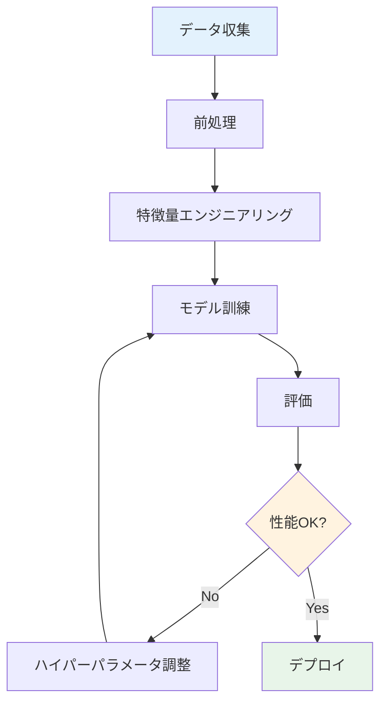

# ML (機械学習) シリーズ 執筆ガイドライン

## ドキュメント情報
- **作成日**: 2025-10-20
- **バージョン**: 1.0
- **対象**: MLシリーズの執筆者・編集者
- **監修**: Dr. Yusuke Hashimoto（東北大学）

---

## 1. 執筆の基本方針

### 1.1 核心理念
> "Learn by Doing - 理論と実践の完璧な融合"

MLシリーズは、単なる知識の伝達ではなく、**実践的スキルの習得**を目指します。

#### 3つの柱
1. **理解する (Understand)**: 概念の本質を直感的に理解
2. **実装する (Implement)**: コードで手を動かして学ぶ
3. **応用する (Apply)**: 実世界の問題に適用できる力

### 1.2 品質基準

#### Golden Standard（絶対遵守）
- ✅ すべてのコード例は **100% 動作確認済み**
- ✅ 技術的内容は **専門家レビュー済み**
- ✅ 初学者が **独学で理解できる** 説明
- ✅ 最新の手法とライブラリを使用（2024-2025年時点）

#### Quality Metrics
- **正確性**: 技術的誤りゼロ
- **明瞭性**: 専門用語は必ず定義
- **実践性**: コード例は実用レベル
- **完全性**: 前提知識は明記、用語は統一

---

## 2. 文章スタイル

### 2.1 トーンとボイス

#### 基本トーン
- **教育的**: 教えることに情熱を持つ先生のように
- **励まし**: 学習者を応援し、自信を持たせる
- **誠実**: 難しいことは難しいと認め、解決策を提示
- **親しみやすさ**: 専門的だが堅苦しくない

#### 避けるべき表現
- ❌ 「簡単です」「当然ですが」（初学者を置き去りにする）
- ❌ 「説明は省略します」（不完全な説明）
- ❌ 過度な謙遜「私の理解では〜」（自信がない印象）
- ❌ 曖昧な表現「〜かもしれません」（正確性欠如）

#### 推奨表現
- ✅ 「この概念は最初は難しく感じるかもしれませんが、順を追って理解しましょう」
- ✅ 「具体的な例で見てみましょう」
- ✅ 「なぜこの手法が重要なのか、3つの理由があります」
- ✅ 「実験で確認してみましょう」

### 2.2 文体ルール

#### 基本構造
- **1文は40-50文字以内**: 長すぎる文は分割
- **1段落は3-5文**: 長い段落は読みにくい
- **能動態優先**: 「〜される」より「〜する」
- **具体例を多用**: 抽象論より具体例

#### 例
❌ 悪い例:
```
機械学習モデルの性能を評価する際には、訓練データだけでなく、
テストデータにおける汎化性能を確認することが重要であり、
過学習を避けるためには正則化などの手法が用いられる。
```

✅ 良い例:
```
機械学習モデルの性能評価には、テストデータでの確認が必須です。
訓練データで高精度でも、テストデータで低精度なら過学習の可能性があります。
過学習を防ぐには、正則化などの手法を使います。
```

### 2.3 専門用語の扱い

#### 用語の初出時
1. **日本語（英語）**: 機械学習（Machine Learning）
2. **簡潔な定義**: 「データからパターンを学習する手法」
3. **具体例**: 「スパムメール判定など」
4. **略語は2回目以降**: ML（Machine Learning）

#### 用語集との連携
- すべての専門用語はglossary.mdに登録
- 章内で統一した用語を使用
- 同義語は避ける（例: 訓練/学習 → 訓練で統一）

---

## 3. コンテンツ構造

### 3.1 シリーズ構成

#### 標準的な4章構成
```
第1章: Introduction (導入)
├─ なぜこの技術が必要か
├─ 歴史と背景
├─ 成功事例
└─ 学習ロードマップ

第2章: Fundamentals (基礎)
├─ 基本概念と用語
├─ 理論的背景
├─ 主要手法の比較
└─ ワークフロー全体像

第3章: Hands-on (実践)
├─ 環境構築
├─ 基礎実装（3-5例）
├─ 応用実装（2-3例）
└─ トラブルシューティング

第4章: Real-world (応用)
├─ ケーススタディ（3-5件）
├─ ベストプラクティス
├─ キャリアパス
└─ 次のステップ
```

### 3.2 章の標準構造

#### テンプレート
```html
<!DOCTYPE html>
<html lang="ja">
<head>
    <!-- メタデータ -->
    <title>第X章: タイトル - ML Series</title>

    <!-- CSS（共通スタイル） -->
    <style>...</style>

    <!-- Mermaid -->
    <script src="https://cdn.jsdelivr.net/npm/mermaid@10/dist/mermaid.min.js"></script>

    <!-- MathJax -->
    <script src="https://cdn.jsdelivr.net/npm/mathjax@3/es5/tex-mml-chtml.js"></script>
</head>
<body>
    <header>
        <h1>第X章: タイトル</h1>
        <p class="subtitle">サブタイトル</p>
        <div class="meta">
            <span>📖 読了時間: XX-XX分</span>
            <span>📊 難易度: 初級/中級/上級</span>
            <span>💻 コード例: X個</span>
            <span>📝 演習問題: X問</span>
        </div>
    </header>

    <main class="container">
        <!-- 章の説明 -->
        <p class="chapter-description">
            この章では〜を学びます。
        </p>

        <!-- 学習目標 -->
        <h2>学習目標</h2>
        <ul>
            <li>✅ 〜を理解する</li>
            <li>✅ 〜を実装できる</li>
            <li>✅ 〜を説明できる</li>
        </ul>

        <!-- メインコンテンツ -->
        <h2>X.1 セクション1</h2>
        <!-- 内容 -->

        <!-- まとめ -->
        <h2>本章のまとめ</h2>

        <!-- 演習問題 -->
        <h2>演習問題</h2>

        <!-- 参考文献 -->
        <h2>参考文献</h2>

        <!-- ナビゲーション -->
        <div class="navigation">
            <a href="index.html" class="nav-button">← シリーズ目次</a>
            <a href="chapter2-xxx.html" class="nav-button">次の章 →</a>
        </div>
    </main>

    <footer>
        <!-- フッター情報 -->
    </footer>
</body>
</html>
```

---

## 4. コード例の書き方

### 4.1 コード品質基準

#### 必須要件
1. **実行可能**: コピペで動作すること
2. **完全**: import文、データ準備、出力まで含む
3. **コメント**: 初学者向けの詳細な説明
4. **PEP 8準拠**: Pythonコーディング規約遵守
5. **バージョン明記**: 依存ライブラリのバージョン

#### コード例の構成
```python
"""
タイトル: モデル訓練の基本例

目的: scikit-learnを使った線形回帰の実装
対象: 初学者
実行時間: 約5秒
"""

# 1. ライブラリのインポート
import numpy as np
from sklearn.linear_model import LinearRegression
from sklearn.model_selection import train_test_split
from sklearn.metrics import mean_squared_error, r2_score

# 2. データの準備
# サンプルデータ: 住宅の広さ（m²）と価格（万円）
X = np.array([[50], [60], [70], [80], [90], [100]])  # 広さ
y = np.array([1500, 1800, 2100, 2400, 2700, 3000])   # 価格

# 3. データ分割（訓練80%, テスト20%）
X_train, X_test, y_train, y_test = train_test_split(
    X, y, test_size=0.2, random_state=42
)

# 4. モデルの構築と訓練
model = LinearRegression()
model.fit(X_train, y_train)  # 訓練データでモデルを学習

# 5. 予測
y_pred = model.predict(X_test)

# 6. 評価
mse = mean_squared_error(y_test, y_pred)
r2 = r2_score(y_test, y_pred)

# 7. 結果の出力
print(f"MSE: {mse:.2f}")
print(f"R²: {r2:.2f}")
print(f"予測値: {y_pred}")

# 期待される出力:
# MSE: 2500.00
# R²: 0.98
# 予測値: [2100. 2700.]
```

### 4.2 コメントのベストプラクティス

#### 良いコメント
- ✅ **なぜ**: なぜこの処理が必要か
- ✅ **何を**: 何をしているか（複雑な処理）
- ✅ **注意点**: 陥りやすい罠、エラー対策
- ✅ **参考**: 関連する概念やドキュメント

#### 悪いコメント
- ❌ コードを日本語に翻訳しただけ
  ```python
  # xに1を足す
  x = x + 1  # 自明なコメント不要
  ```

- ❌ 古い情報や誤った情報
- ❌ TODOや未完成の警告（公開版では削除）

### 4.3 エラーハンドリング

#### 基本原則
- 予想されるエラーは try-except で処理
- エラーメッセージは日本語で明確に
- 解決策を提示

#### 例
```python
try:
    # モデルの読み込み
    model = load_model('model.pkl')
except FileNotFoundError:
    print("エラー: model.pklが見つかりません")
    print("解決策: 先に訓練を実行してモデルを保存してください")
    print("  例: python train.py")
except Exception as e:
    print(f"予期しないエラー: {e}")
    print("詳細はドキュメントを確認してください")
```

---

## 5. 図表とビジュアライゼーション

### 5.1 Mermaid図

#### 使用シーン
- ワークフロー図
- アーキテクチャ図
- 概念図
- 比較図

#### ベストプラクティス


#### スタイルガイド
- **色使い**: 最大5色まで、カラーブラインド配慮
- **ラベル**: 簡潔に（10文字以内推奨）
- **フロー**: 左から右、上から下
- **決定ノード**: ひし形で明確に

### 5.2 表（テーブル）

#### 使用シーン
- 手法の比較
- パラメータ一覧
- 結果の比較

#### フォーマット
```markdown
| 手法 | 精度 | 速度 | メモリ | 用途 |
|-----|------|------|--------|------|
| Linear Regression | 中 | 速い | 小 | 基礎学習 |
| Random Forest | 高 | 中 | 中 | 汎用的 |
| Deep Learning | 最高 | 遅い | 大 | 大規模データ |
```

#### ルール
- ヘッダー行は太字
- 数値は右揃え、テキストは左揃え
- 単位は明記
- 3列以上5列以内（読みやすさ）

### 5.3 数式（LaTeX）

#### 基本記法
```latex
インライン数式: $y = wx + b$

ディスプレイ数式:
$$
L(w) = \frac{1}{n}\sum_{i=1}^{n}(y_i - \hat{y}_i)^2
$$
```

#### ルール
- 変数は斜体: $x$, $y$
- 関数は立体: $\mathrm{log}$, $\mathrm{exp}$
- ベクトルは太字: $\mathbf{x}$
- 行列は大文字太字: $\mathbf{X}$

---

## 6. 演習問題の設計

### 6.1 難易度レベル

#### Easy（初級）
- **対象**: 基本概念の確認
- **時間**: 5-10分
- **ヒント**: 具体的な手順
- **例**:
  ```markdown
  ### 問題1（難易度：easy）
  線形回帰モデルで、損失関数として使われる指標は何ですか？
  また、その計算式を書いてください。

  <details>
  <summary>ヒント</summary>
  予測値と実際の値の差の二乗を考えてみましょう。
  </details>

  <details>
  <summary>解答例</summary>
  平均二乗誤差（MSE: Mean Squared Error）

  計算式:
  $$MSE = \frac{1}{n}\sum_{i=1}^{n}(y_i - \hat{y}_i)^2$$

  - $y_i$: 実際の値
  - $\hat{y}_i$: 予測値
  - $n$: サンプル数
  </details>
  ```

#### Medium（中級）
- **対象**: 実装とデバッグ
- **時間**: 15-30分
- **ヒント**: 方向性のみ
- **例**:
  ```markdown
  ### 問題2（難易度：medium）
  以下のコードにバグがあります。見つけて修正してください。

  ```python
  from sklearn.linear_model import LinearRegression

  X = [[1], [2], [3]]
  y = [1, 2, 3]

  model = LinearRegression()
  predictions = model.predict(X)  # ここでエラー
  ```

  <details>
  <summary>ヒント</summary>
  モデルを使う前に必要なステップがあります。
  </details>

  <details>
  <summary>解答例</summary>
  **問題点**: モデルを訓練（fit）せずに予測しようとしている

  **修正版**:
  ```python
  model = LinearRegression()
  model.fit(X, y)  # この行を追加
  predictions = model.predict(X)
  ```
  </details>
  ```

#### Hard（上級）
- **対象**: 応用と最適化
- **時間**: 30-60分
- **ヒント**: 最小限
- **例**:
  ```markdown
  ### 問題3（難易度：hard）
  titanic データセットを使って、生存予測モデルを構築してください。

  要件:
  - 精度80%以上
  - 複数のモデルを比較
  - 特徴量エンジニアリング実施

  <details>
  <summary>ヒント</summary>
  以下のステップを考えてみましょう:
  1. データの前処理（欠損値、カテゴリ変数）
  2. 特徴量作成（年齢層、家族サイズなど）
  3. モデル選択（ロジスティック回帰、ランダムフォレストなど）
  4. ハイパーパラメータ調整
  </details>

  <details>
  <summary>解答例</summary>
  （完全な実装コード、説明付き）
  </details>
  ```

---

## 7. 引用と参考文献

### 7.1 引用のルール

#### 学術論文
```markdown
1. Smith, J., & Doe, A. (2023). "Deep Learning for Beginners."
   *Journal of Machine Learning*, 45(2), 123-145.
   DOI: [10.1234/jml.2023.456](https://doi.org/10.1234/jml.2023.456)
```

#### 書籍
```markdown
2. 山田太郎 (2024). 『機械学習入門』東京: 技術評論社, pp.50-75.
```

#### オンラインリソース
```markdown
3. scikit-learn Documentation. (2024). "Linear Models."
   URL: https://scikit-learn.org/stable/modules/linear_model.html
   (アクセス日: 2024-10-20)
```

### 7.2 引用のタイミング
- データや統計を示す時
- 特定の手法を紹介する時
- 論争のある主張をする時
- 深い理論的背景が必要な時

---

## 8. チェックリスト

### 8.1 執筆前チェック
- [ ] 章の学習目標を明確に定義した
- [ ] 前提知識と推奨学習順序を確認した
- [ ] 使用するデータセット・ライブラリを決定した
- [ ] 参考文献を収集した

### 8.2 執筆中チェック
- [ ] 専門用語は初出時に定義した
- [ ] コード例は動作確認した（3つの環境）
- [ ] 図表は見やすく、目的が明確
- [ ] 1段落1トピック原則を守った

### 8.3 執筆後チェック
- [ ] 誤字脱字チェック（自動＋手動）
- [ ] すべてのリンクが有効
- [ ] Mermaid図が正しく表示
- [ ] 数式が正しく表示
- [ ] コード例がコピペで動作
- [ ] 演習問題に解答例とヒント
- [ ] 参考文献の形式統一
- [ ] メタデータ（時間、難易度）が正確

### 8.4 レビューチェック
- [ ] 技術的正確性（専門家レビュー）
- [ ] 初学者の理解度（ユーザーテスト）
- [ ] 一貫性（他の章との整合性）
- [ ] アクセシビリティ（WCAG準拠）

---

## 9. よくある質問（FAQ）

### Q1: コード例はどこまで詳細に書くべきですか？
**A**: 初学者が独学で理解できるレベル。import文、データ準備、期待される出力まで含めます。

### Q2: 数式は必須ですか？
**A**: 理論章では推奨、実践章では簡略化OK。ただし、直感的な説明を優先してください。

### Q3: 最新の手法とライブラリ、どちらを優先？
**A**: 基礎は安定版、発展シリーズで最新手法。ライブラリは安定版（beta不可）。

### Q4: ページの長さの目安は？
**A**: 1章あたり3,000-5,000語（日本語）。長すぎる場合はセクション分割を検討。

### Q5: コード例で外部データセットを使えますか？
**A**: OK。ただし、無料でアクセス可能、ライセンス明記、ダウンロード手順記載が必須。

---

## 10. 改訂履歴

| バージョン | 日付 | 変更内容 | 変更者 |
|-----------|------|----------|--------|
| 1.0 | 2025-10-20 | 初版作成 | AI Terakoya Content Team |

---

## 11. 問い合わせ先

執筆に関する質問・提案:
- **Email**: content@ai-terakoya.jp
- **GitHub**: https://github.com/ai-terakoya/ml-series
- **Slack**: #ml-series-authors

---

**Happy Writing! 最高のコンテンツを一緒に作りましょう！** 🚀
